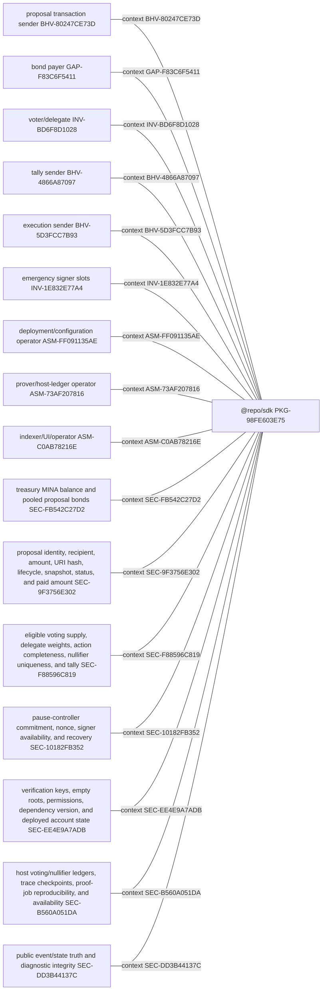

<!-- trace: PKG-98FE603E75, BHV-80247CE73D, GAP-F83C6F5411, INV-BD6F8D1028, BHV-4866A87097, BHV-5D3FCC7B93, INV-1E832E77A4, ASM-FF091135AE, ASM-73AF207816, ASM-C0AB78216E, SEC-FB542C27D2, SEC-9F3756E302, SEC-F88596C819, SEC-10182FB352, SEC-EE4E9A7ADB, SEC-B560A051DA, SEC-DD3B44137C -->
# Architecture

<!-- trace: PKG-98FE603E75, CMP-49180D7623, CMP-834A30297A, CMP-31D3990A1F, CMP-7DB1B15B38, CMP-2890255AE1, CMP-7CC27EFA43, CMP-874E479BA1, CMP-E155326DD2, CMP-B6BB8BE661, CMP-5CAF19BDCD, CMP-0F476A460D -->
## Packages and components

```mermaid
flowchart TB
  P0["@repo/sdk PKG-98FE603E75"]
  C0["Mina account/hash model CMP-49180D7623"]
  P0 -->|"contains CMP-49180D7623"| C0
  C1["Treasury event schemas CMP-834A30297A"]
  P0 -->|"contains CMP-834A30297A"| C1
  C2["Prefixed hashing and action chaining CMP-31D3990A1F"]
  P0 -->|"contains CMP-31D3990A1F"| C2
  C3["Pause-controller multisig messages CMP-7DB1B15B38"]
  P0 -->|"contains CMP-7DB1B15B38"| C3
  C4["Prefixed Merkle trees and witnesses CMP-2890255AE1"]
  P0 -->|"contains CMP-2890255AE1"| C4
  C5["Provable ledger and hashing support CMP-7CC27EFA43"]
  P0 -->|"contains CMP-7CC27EFA43"| C5
  C6["Staking-ledger-to-voting-ledger ZkProgram CMP-874E479BA1"]
  P0 -->|"contains CMP-874E479BA1"| C6
  C7["Treasury Owner smart contract CMP-E155326DD2"]
  P0 -->|"contains CMP-E155326DD2"| C7
  C8["Treasury Pause Controller smart contract CMP-B6BB8BE661"]
  P0 -->|"contains CMP-B6BB8BE661"| C8
  C9["Treasury Proposal smart contract CMP-5CAF19BDCD"]
  P0 -->|"contains CMP-5CAF19BDCD"| C9
  C10["Vote Reducer ZkProgram CMP-0F476A460D"]
  P0 -->|"contains CMP-0F476A460D"| C10
```

<!-- trace: FLW-802D71B91D, FLW-FB5CAECCAD, FLW-FD2B1F4966, FLW-BEFDEF1197, FLW-E60ABD1745, FLW-9BA4D696D1, FLW-2F560AE009, FLW-5C8E5E0DE3, FLW-A565B35EC6, FLW-21AF7F4E4D, FLW-745B097927, FLW-9D28A6D299, FLW-6394A1B72B, FLW-5AA543472A, FLW-5E24C8B8E4, FLW-A6B92A4E6D, FLW-53B4410963, FLW-7DA083B071, FLW-9BB4E99B75, FLW-BFD5C6D535, CMP-49180D7623, CMP-834A30297A, CMP-31D3990A1F, CMP-7DB1B15B38, CMP-2890255AE1, CMP-7CC27EFA43, CMP-874E479BA1, CMP-E155326DD2, CMP-B6BB8BE661, CMP-5CAF19BDCD, CMP-0F476A460D -->
## Principal flows

```mermaid
flowchart LR
  PC0["Mina account/hash model CMP-49180D7623"]
  PC1["Treasury event schemas CMP-834A30297A"]
  PC2["Prefixed hashing and action chaining CMP-31D3990A1F"]
  PC3["Pause-controller multisig messages CMP-7DB1B15B38"]
  PC4["Prefixed Merkle trees and witnesses CMP-2890255AE1"]
  PC5["Provable ledger and hashing support CMP-7CC27EFA43"]
  PC6["Staking-ledger-to-voting-ledger ZkProgram CMP-874E479BA1"]
  PC7["Treasury Owner smart contract CMP-E155326DD2"]
  PC8["Treasury Pause Controller smart contract CMP-B6BB8BE661"]
  PC9["Treasury Proposal smart contract CMP-5CAF19BDCD"]
  PC10["Vote Reducer ZkProgram CMP-0F476A460D"]
  PF0["Staking-transformation digest proof statement FLW-802D71B91D"]
  PC6 -->|"owns FLW-802D71B91D"| PF0
  PF1["Owner-side proposal creation FLW-FB5CAECCAD"]
  PC7 -->|"owns FLW-FB5CAECCAD"| PF1
  PF2["Pause-controller command authorization FLW-FD2B1F4966"]
  PC8 -->|"owns FLW-FD2B1F4966"| PF2
  PF3["Proposal-local payout FLW-BEFDEF1197"]
  PC9 -->|"owns FLW-BEFDEF1197"| PF3
  PF4["Proposal-local tally FLW-E60ABD1745"]
  PC9 -->|"owns FLW-E60ABD1745"| PF4
  PF5["Vote-reduction proof statement FLW-9BA4D696D1"]
  PC10 -->|"owns FLW-9BA4D696D1"| PF5
  PF6["Treasury event producer-to-consumer schema FLW-2F560AE009"]
  PC1 -->|"owns FLW-2F560AE009"| PF6
  PF7["Public key to voting/nullifier root FLW-5C8E5E0DE3"]
  PC5 -->|"owns FLW-5C8E5E0DE3"| PF7
  PF8["Mina account to staking-ledger root FLW-A565B35EC6"]
  PC0 -->|"owns FLW-A565B35EC6"| PF8
  PF9["Global pause or unpause command FLW-21AF7F4E4D"]
  PC8 -->|"owns FLW-21AF7F4E4D"| PF9
  PF10["Emergency participant commitment rotation FLW-745B097927"]
  PC8 -->|"owns FLW-745B097927"| PF10
  PF11["Approved partial payout FLW-9D28A6D299"]
  PC7 -->|"owns FLW-9D28A6D299"| PF11
  PF12["Proposal creation and bond custody FLW-6394A1B72B"]
  PC7 -->|"owns FLW-6394A1B72B"| PF12
  PF13["Proposal-specific pause toggle FLW-5AA543472A"]
  PC8 -->|"owns FLW-5AA543472A"| PF13
  PF14["Proof-backed tally finalization FLW-5E24C8B8E4"]
  PC7 -->|"owns FLW-5E24C8B8E4"| PF14
  PF15["Vote authorization and action dispatch FLW-A6B92A4E6D"]
  PC7 -->|"owns FLW-A6B92A4E6D"| PF15
  PF16["Compose staking ranges and prove terminal boundary FLW-53B4410963"]
  PC6 -->|"owns FLW-53B4410963"| PF16
  PF17["Staking-to-voting digest batch FLW-7DA083B071"]
  PC6 -->|"owns FLW-7DA083B071"| PF17
  PF18["Recursive vote-proof aggregation FLW-9BB4E99B75"]
  PC10 -->|"owns FLW-9BB4E99B75"| PF18
  PF19["Vote reduction batch FLW-BFD5C6D535"]
  PC10 -->|"owns FLW-BFD5C6D535"| PF19
```

<!-- trace: REL-8D94358D1F, IO-1CF641A344, IO-140ADF5967, AST-89436D04DA, EVD-7241D16957, ASM-53F278775C, ASM-73AF207816, ASM-EF2D37A6EF, CMP-5CAF19BDCD, SEC-9F3756E302, SEC-BC2C476AE2, SEC-E0D95AF002, UNR-20BC6033C1, ZKP-0830843A1A, ZKP-37F3DC23FD, REL-E20DC14C1E, ZKP-DF018A9714, AST-D0C06153AF, EVD-69F140A1C8, ASM-4B596D13E3, CMP-7CC27EFA43, CMP-874E479BA1, REL-A38D47D128, ZKP-547C93E79B, AST-9323330F7F, EVD-C40CC7BDB8, CMP-0F476A460D, SEC-F88596C819, THR-01539B0FF5, REL-26FCFBF6F0, AST-1FDFAE9F37, EVD-D79183A876, SRC-4A1F6AB356, SRC-F3FE44D20B, REL-589CBF628B, AST-515F544FC1, EVD-BA6F09A95B, SEC-DD3B44137C, SRC-58ADF841FC, SRC-045B6CA381, REL-63B84007BB, AST-64BD096893, EVD-FA6B741A20, ASM-A4087EF988, CMP-B6BB8BE661, SEC-10182FB352, THR-77C87EDE62, SRC-DF069048A5, REL-1FB12A6A77, AST-32328D4EA9, EVD-5327C5E368, SRC-B0C4273C06, SRC-1FAD2D3160, REL-26D4DBC387, AST-832CCC61F1, EVD-7592298436, REL-2B644C02CF, AST-DE84E4B6D8, EVD-2FDEDC62E5, SEC-B560A051DA, THR-5F94AE7496, THR-C66F2EDB38, SRC-9140D57A6C, SRC-B5BD04FEE3, REL-DEA7407543, AST-A9204E3560, EVD-217A6D8C94, SRC-9EBB65D4B9, REL-C7975C3671, AST-D81457025B, EVD-9C0E8C00C8, SRC-639D488B2F, REL-B4EBED13D8, AST-A477ADD949, EVD-99D123E17D, REL-EC7623BEA0, AST-D06E0E2EF0, EVD-8237C0A803, REL-00EBA2ADAB, AST-1FD88F877F, EVD-7B9A8B77FE, REL-A3B3E26666, AST-6A56FAC38B, EVD-B548ADFA1A, SRC-70F3CC4F23, REL-90D77C3467, AST-CEB4B5DB2A, EVD-3535FA4E52, SRC-C64523D77B, REL-276593D308, AST-C41220FB00, EVD-2BF1613495, REL-6EA11DB500, AST-9A44D656F7, EVD-5EA85AB571, REL-A410753B86, AST-4166440B51, EVD-A981878820, SRC-BA72F0CFB2, REL-6C91733B3B, AST-6264104BA9, EVD-FE36105D52, REL-F0B89E51EA, AST-406CE64588, EVD-C934B61211, REL-299D396767, AST-E075C694F1, EVD-546B43B781, REL-2E6A97C4F4, AST-0FA334BDCF, EVD-4C0532CE7D, SRC-457F3C87C6, REL-168EF28932, AST-43D713EE9A, EVD-0B05CF7A57, SRC-3FC38F9998, REL-78C89A1167, AST-06C970473A, EVD-501B3A11E8, ASM-BD7E733FE5, CMP-E155326DD2, SEC-FB542C27D2, SRC-5ACF00A9FC, REL-5B59D6E729, AST-6AC13AB849, EVD-143F30BAE9, REL-E5F8590514, AST-86394D7F21, EVD-B02FDCA7A9, THR-F283B3AF7E, REL-F7662AD13A, AST-4C2F0B8AFE, EVD-5BF6C08B0C, REL-9F3429D10A, AST-3FFA3EC08D, EVD-328036A7FC, REL-08A70D7B33, AST-ECA7056A8D, EVD-0B119E094A, REL-CE32C719DB, AST-3EC405C96A, EVD-9EF06E485C, REL-DD43BE2BCF, AST-85FF2F32DA, EVD-1C18F16803, REL-B259F3702C, AST-032980F0BE, EVD-C5F60BB8F2, REL-B26C9DEED0, AST-987CC84FDB, EVD-92A18EC931, REL-9FD39CA0BF, AST-622AADBE8E, EVD-AA2243F703, REL-E78B1A4B91, AST-7143D1C85C, EVD-E9416393D5, REL-1D6D923385, AST-4375854C5D, EVD-ED07B38B39, REL-B6B58FC464, AST-983EC50BDC, EVD-B9AD9D302C, SRC-F697D41C4C, REL-091EC29FB8, AST-A5484DA2AF, EVD-1809F2D716, REL-7EFB214FA7, AST-3099E7D607, EVD-EEEC54D2DF, REL-CD42F66A0B, AST-6B4F2BCC5E, EVD-8018A85CDC, REL-F5500906DF, IO-89BB105E28, IO-D2E9ED5387, AST-4158C9ABF6, EVD-74C5612F1A, REL-0A93E6EC1A, IO-DB06E786C6, AST-AC57603198, EVD-77FCCF8764, REL-4B6DE7971E, AST-13EC66A5F3, EVD-01A88DE81D, REL-BEA98FD671, BHV-80247CE73D, BHV-5B1BD6B386, AST-9D2798B4FF, EVD-2CC556DD12, REL-2B8B758DBD, AST-219E0463D2, EVD-3EFA780CA4, REL-00F1D87439, BHV-5D3FCC7B93, BHV-F2207732B4, AST-38DAFC5A42, EVD-D24325B047, REL-EC464B39A2, BHV-4866A87097, BHV-1136BD4D08, AST-F687AEC36B, EVD-F0B6E0FB7E, REL-5802D63B62, AST-540078830F, EVD-EAC5164121, REL-DEAD37FEA7, AST-F6A56EC26C, EVD-4A51346245, REL-0E60F21EB7, BHV-8FA351E512, BHV-10BA9AD71E, AST-DE875F91AD, EVD-BDBAA51FA4, REL-4BF305E289, BHV-8B6F3A639B, AST-C1FF4EB66F, EVD-5E79A4F90E, REL-9DD700D149, BHV-8E9F5C3ECE, BHV-9E1B7D1BA1, AST-8720F60004, EVD-9B9F528292, REL-52D00868F0, BHV-F898CD867A, BHV-DDC0A35072, AST-7E6733A40C, EVD-743D18DD5F, REL-4237EF6012, BHV-0D6A8D760E, AST-5FD690501B, EVD-96A4F56358, REL-A7E0080416, AST-9B4C0AF951, EVD-486D7CAD2C, REL-4810C50C7E, AST-9836611F84, EVD-368185B3B6, REL-188319D340, AST-C3D19901B3, EVD-BDBE008B7F, REL-8723F51AAF, AST-0CD43AB99E, EVD-4AAAFAD8E9, REL-B9BE0F0531, IO-DD1852B56B, IO-A0335A63F4, AST-4BF1892CA3, EVD-AE1EDCE441, REL-9320DFA9E7, IO-C3A08EF697, AST-1EF8F28462, EVD-7DDAF2A961, REL-8F340CD1A7, AST-2C4BFE55A6, EVD-7476F54969, REL-00AEF1536B, ZKP-EFB3E28391, IO-1F97CF4E82, AST-85EC868F18, EVD-3CEBE6B022, REL-EA36BC48D2, ZKP-5DF7D24003, IO-4708EC66CE, CL-43DA8C0600, CL-9016ED73D7, CL-E1DF82E30D, CL-B5C01C5182, CL-3D67D2EC7C, AST-AE12A9B458, ASM-35D9BB50D0, REL-86B5C33BDA, IO-668F610724, AST-77CDB51C4D, REL-8F24F6DAF1, IO-7E445A843C, AST-D4E921995E, REL-1089110191, IO-C71845C9DB, AST-74710B1F1E, REL-A5F59855A3, IO-BD428B4BFE, AST-F71E3823EF, REL-4F545BA3FC, IO-9D3B7CAE85, AST-E6E48797C4, REL-E47D90B32A, IO-3236C0037A, AST-BD7A72EE7F, REL-75A476CA07, IO-5CBBA7540B, AST-C85058B1AC, REL-CE969D1CD9, IO-FE03A006D4, AST-C497CA71CD, REL-E202BF783A, IO-F795103B44, AST-AC88A4EFCC, REL-4E2DBDEEAD, IO-F2FDEDAAD4, CL-26D2B7BB15, CL-DA12027943, AST-1C5400A4A9, REL-83D83BBB4E, IO-0E47C270AF, AST-2129808A12, REL-44D59128AF, IO-DFBE3E4B97, AST-CC802992A7, REL-5D9A09A125, IO-6FC5F32B87, AST-F264AC45FC, REL-41284327B7, ZKP-66153C8CB1, IO-69C74E38D3, CL-5C42FDBA1B, CL-820ACD71D0, CL-E51C01E8DF, AST-EF64B7A104, REL-3664E9D6F9, IO-088DC1C843, AST-DC0E038963, REL-6B57F8E5A0, IO-E30D4BDAFB, AST-F821F23937, REL-31E87AE8C0, IO-20DE355EF7, AST-D8AB71EE2C, REL-CE966AA43A, IO-9C80690415, CL-14F284A0F4, CL-9DDDB05A64, CL-96F95D8CE6, CL-CE68CFDE0A, AST-7E59C8D7DB, REL-7C3831D8EC, IO-4B9BD5AA91, AST-5CAEED6691, REL-DA430F1EDD, IO-67C38AAD67, AST-9E19552881, REL-C5386D41BC, IO-5B7DDF71A2, AST-47DE918315, REL-96992E7E50, ZKP-BA11C90A9F, IO-626345DDF5, CL-2311B61899, CL-2F056FA9A9, CL-9C7B0C38F5, CL-61EF5A92CB, CL-631833DB43, CL-034C97475E, CL-5D1DBDDB89, CL-0966A605CA, AST-46003B9211, REL-D6AFDBBC16, IO-B0282188FD, AST-34C8C97FDF, REL-1884583AD7, IO-0467289092, AST-B648C8BAC4, REL-4D9D9DF877, IO-E9661CD282, AST-E990C1DC66, REL-03AA6118C2, IO-3F0DC7DE94, AST-B58494BCFE, REL-E3A8EF7E65, IO-13802BA54F, AST-C6141A9AB0, REL-5DA946B3A1, IO-EC980A7F95, AST-434359CD07, REL-296CAFE207, IO-65764C55DD, AST-A7F26980D7, REL-5EDF6F2962, IO-DEB6DB3865, AST-A9153DC3E5, REL-ADD56A64B3, IO-623DE360CA, AST-85C1EED2B9, REL-67A94DDB19, IO-C22A925F5B, AST-8CD2B4E01D, REL-70D1CDE363, IO-E34414723E, AST-35393AC0D7, REL-FA211B3844, IO-A27752072E, AST-84F3626CA6, REL-C73428091B, IO-9C3461F78B, AST-C8A036B90F, REL-022A0995FF, IO-0E41C22124, AST-50A2C4DE89, REL-9F87928AEA, IO-B36955C5A4, AST-12DBAF1B4A, REL-5BAB584F4B, IO-0AE4C61332, AST-5CF314714A, REL-3CDDF609DA, IO-87B5865B4B, AST-EFC72DC6AB, REL-6AE927936D, IO-8095F5006E, AST-C48D739FE9, REL-E1F0545D1D, IO-5C4505832E, AST-05F4016BE2, REL-7C92E212B4, IO-FEAE73D285, AST-9A2E465842, REL-346BB31D1A, IO-51C319BC65, IO-33EF11CDC4, EVD-B7C40C0F6F, AST-6689244515, REL-14E18DFB1F, IO-46A1C8D782, IO-B5D0C42BBA, EVD-177476A23F, AST-89B493E3AA, REL-0908B0F4AD, IO-D9A49956C7, EVD-2720E90D33, AST-A73ABFA2B0, REL-A9809109C5, BHV-C4F9C6CEE0, IO-9974229C95, EVD-F7DE049BDC, AST-6E9ED6CE68, REL-04F149788B, IO-57798F0171, AST-45D139BB69, REL-02B5E35EEA, IO-4216D4A05E, AST-50E28BBC6B, REL-DD21A8E7A9, IO-BD18BAE884, IO-E8F865E1FF, AST-F632C88450, REL-EC2F02C65F, BHV-50C1B246E0, IO-7B2F867805, EVD-C7D1DB2A7C, AST-8F502D621B, REL-37CDC651DC, IO-A0F8C1C59A, IO-C1EF5A7724, EVD-D70E747767, AST-F0C33B6FA1, REL-5F2D985D2E, IO-51ADBABB02, AST-9F15F731E7, REL-F82E54D4F3, IO-1437898F9F, AST-88F942893C, REL-549A32EEBD, IO-F1C491BFA4, AST-FF674DC1C0 -->
## Call, data, and trust relationships

```mermaid
flowchart LR
  R0["output.votingLedgerRoot IO-1CF641A344"]
  R1["votingLedgerRoot IO-140ADF5967"]
  R2["Treasury Proposal smart contract CMP-5CAF19BDCD"]
  R3["StakingLedgerToVotingLedger.exhaust statement ZKP-DF018A9714"]
  R4["VoteReducer.merge statement ZKP-547C93E79B"]
  R5["source:component:inventory:account-model:packages/sdk/src/provable/account.ts#file SRC-4A1F6AB356"]
  R6["source:component:inventory:hashing:packages/sdk/src/provable/hashing-helpers.ts#file SRC-F3FE44D20B"]
  R7["source:component:inventory:event-schemas:packages/sdk/src/provable/events/treasury-proposal-events.ts#file SRC-58ADF841FC"]
  R8["source:component:inventory:vote-reducer:packages/sdk/src/provable/contracts/treasury-proposal/vote-reducer.ts#file SRC-045B6CA381"]
  R9["source:component:inventory:pause-multisig:packages/sdk/src/provable/contracts/treasury-pause-controller/multisig-signatures.ts#file SRC-DF069048A5"]
  R10["source:component:inventory:pause-controller:packages/sdk/src/provable/contracts/treasury-pause-controller/treasury-pause-controller.ts#file SRC-B0C4273C06"]
  R11["source:component:inventory:context:packages/sdk/src/logging/logger.ts#file SRC-1FAD2D3160"]
  R12["source:component:inventory:prefixed-merkle:packages/sdk/src/provable/merkle-tree/prefixed-merkle-tree.ts#file SRC-9140D57A6C"]
  R13["source:component:inventory:context:packages/sdk/src/storage/merkle-tree-storage.ts#file SRC-B5BD04FEE3"]
  R14["source:component:inventory:treasury-proposal:packages/sdk/src/provable/contracts/treasury-proposal/treasury-proposal.ts#file SRC-9EBB65D4B9"]
  R15["source:component:inventory:treasury-owner:packages/sdk/src/provable/contracts/treasury-constants.ts#file SRC-639D488B2F"]
  R16["source:component:inventory:context:packages/sdk/src/ledgers/staking-ledger/staking-ledger.ts#file SRC-70F3CC4F23"]
  R17["source:component:inventory:staking-to-voting:packages/sdk/src/provable/staking-ledger-to-voting-ledger.ts#file SRC-C64523D77B"]
  R18["source:component:inventory:context:packages/sdk/src/utils/context-provider.ts#file SRC-BA72F0CFB2"]
  R19["source:component:inventory:staking-to-voting:packages/sdk/src/provable/voting-account.ts#file SRC-457F3C87C6"]
  R20["source:component:inventory:context:packages/sdk/src/ledgers/voting-ledger/voting-ledger.ts#file SRC-3FC38F9998"]
  R21["source:component:inventory:treasury-owner:packages/sdk/src/provable/contracts/treasury-owner.ts#file SRC-5ACF00A9FC"]
  R22["source:component:inventory:context:packages/sdk/src/ledgers/nullifier-ledger/nullifier-ledger.ts#file SRC-F697D41C4C"]
  R23["accounts(0..4) IO-89BB105E28"]
  R24["stakingLedgerRoot IO-D2E9ED5387"]
  R25["host staking witnesses and voting accounts/witnesses/writes IO-DB06E786C6"]
  R26["Staking-ledger-to-voting-ledger ZkProgram CMP-874E479BA1"]
  R27["Create proposal and collect ten-percent bond BHV-80247CE73D"]
  R28["Snapshot current staking epoch ledger BHV-5B1BD6B386"]
  R29["Execute bounded recipient payout BHV-5D3FCC7B93"]
  R30["Enforce approved recipient payout cap BHV-F2207732B4"]
  R31["Verify proofs, bind action history, and tally proposal BHV-4866A87097"]
  R32["Bind proof outputs and finalize proposal tally BHV-1136BD4D08"]
  R33["Authorize and toggle proposal pause status BHV-8FA351E512"]
  R34["Authorize proposal-specific toggle BHV-10BA9AD71E"]
  R35["Toggle shared status between PAUSED and UNKNOWN BHV-8B6F3A639B"]
  R36["Dispatch signed voter action BHV-8E9F5C3ECE"]
  R37["Expose lifecycle and dispatch vote action BHV-9E1B7D1BA1"]
  R38["Bind five witnessed participant slots and require three signatures BHV-F898CD867A"]
  R39["Set global treasury pause state BHV-DDC0A35072"]
  R40["Rotate multisig commitment BHV-0D6A8D760E"]
  R41["Treasury Owner smart contract CMP-E155326DD2"]
  R42["host nullifier value/witness and persistence writes IO-DD1852B56B"]
  R43["fromNullifierRoot IO-A0335A63F4"]
  R44["host voting account and PrefixedMerkleWitness255 IO-C3A08EF697"]
  R45["Vote Reducer ZkProgram CMP-0F476A460D"]
  R46["Pause-controller participant witness binding ZKP-EFB3E28391"]
  R47["Pause-controller private participant witness IO-1F97CF4E82"]
  R48["StakingLedgerToVotingLedger.digest statement ZKP-5DF7D24003"]
  R49["StakingLedgerToVotingLedger.digest exhausted IO-4708EC66CE"]
  R50["StakingLedgerToVotingLedger.digest index IO-668F610724"]
  R51["StakingLedgerToVotingLedger.digest votingLedgerRoot IO-7E445A843C"]
  R52["StakingLedgerToVotingLedger.digest accounts(5) IO-C71845C9DB"]
  R53["StakingLedgerToVotingLedger.digest stakingWitness(iteration) IO-BD428B4BFE"]
  R54["StakingLedgerToVotingLedger.digest votingAccount(iteration).balance IO-9D3B7CAE85"]
  R55["StakingLedgerToVotingLedger.digest votingWitness(iteration) IO-3236C0037A"]
  R56["StakingLedgerToVotingLedger.digest index IO-5CBBA7540B"]
  R57["StakingLedgerToVotingLedger.digest stakingLedgerRoot IO-FE03A006D4"]
  R58["StakingLedgerToVotingLedger.digest votingLedgerRoot IO-F795103B44"]
  R59["StakingLedgerToVotingLedger.exhaust nextEmptyWitness IO-F2FDEDAAD4"]
  R60["StakingLedgerToVotingLedger.exhaust proof IO-0E47C270AF"]
  R61["StakingLedgerToVotingLedger.exhaust exhaustedPublicOutput IO-DFBE3E4B97"]
  R62["StakingLedgerToVotingLedger.exhaust outerPublicInput IO-6FC5F32B87"]
  R63["StakingLedgerToVotingLedger.merge statement ZKP-66153C8CB1"]
  R64["StakingLedgerToVotingLedger.merge proof1 IO-69C74E38D3"]
  R65["StakingLedgerToVotingLedger.merge proof2 IO-088DC1C843"]
  R66["StakingLedgerToVotingLedger.merge mergedPublicOutput IO-E30D4BDAFB"]
  R67["StakingLedgerToVotingLedger.merge outerPublicInput IO-20DE355EF7"]
  R68["VoteReducer.merge proof1 IO-9C80690415"]
  R69["VoteReducer.merge proof2 IO-4B9BD5AA91"]
  R70["VoteReducer.merge mergedPublicOutput IO-67C38AAD67"]
  R71["VoteReducer.merge outerPublicInput IO-5B7DDF71A2"]
  R72["VoteReducer.reduceBatch statement ZKP-BA11C90A9F"]
  R73["VoteReducer.reduceBatch abstain IO-626345DDF5"]
  R74["VoteReducer.reduceBatch actionStateHistory(5).found IO-B0282188FD"]
  R75["VoteReducer.reduceBatch actionStateHistory(5).hash IO-0467289092"]
  R76["VoteReducer.reduceBatch nay IO-E9661CD282"]
  R77["VoteReducer.reduceBatch toActionsHash IO-3F0DC7DE94"]
  R78["VoteReducer.reduceBatch toNullifierRoot IO-13802BA54F"]
  R79["VoteReducer.reduceBatch yay IO-EC980A7F95"]
  R80["VoteReducer.reduceBatch nullifierWitness(iteration) IO-65764C55DD"]
  R81["VoteReducer.reduceBatch priorNullifier(iteration) IO-DEB6DB3865"]
  R82["VoteReducer.reduceBatch voteActions(5).publicKey IO-623DE360CA"]
  R83["VoteReducer.reduceBatch voteActions(5).vote IO-C22A925F5B"]
  R84["VoteReducer.reduceBatch votingAccount(iteration).balance IO-E34414723E"]
  R85["VoteReducer.reduceBatch votingWitness(iteration) IO-A27752072E"]
  R86["VoteReducer.reduceBatch actionStateFive IO-9C3461F78B"]
  R87["VoteReducer.reduceBatch actionStateFour IO-0E41C22124"]
  R88["VoteReducer.reduceBatch actionStateOne IO-B36955C5A4"]
  R89["VoteReducer.reduceBatch actionStateThree IO-0AE4C61332"]
  R90["VoteReducer.reduceBatch actionStateTwo IO-87B5865B4B"]
  R91["VoteReducer.reduceBatch fromActionsHash IO-8095F5006E"]
  R92["VoteReducer.reduceBatch fromNullifierRoot IO-5C4505832E"]
  R93["VoteReducer.reduceBatch votingLedgerRoot IO-FEAE73D285"]
  R94["staking.output.terminalVotingLedgerRoot IO-51C319BC65"]
  R95["vote.reduce.votingLedgerRoot IO-33EF11CDC4"]
  R96["staking.digest.accounts(0..4) IO-46A1C8D782"]
  R97["staking.digest.stakingLedgerRoot IO-B5D0C42BBA"]
  R98["staking.exhaust.nextEmptyWitness36 IO-D9A49956C7"]
  R99["Transform five consecutive staking accounts BHV-C4F9C6CEE0"]
  R100["staking.digest.hostVotingLedgerPersistence IO-9974229C95"]
  R101["staking.digest.stakingMerkleWitness36 IO-57798F0171"]
  R102["staking.digest.votingMerkleWitness255 IO-4216D4A05E"]
  R103["staking.digest.delegateVotingAccount IO-BD18BAE884"]
  R104["staking.digest.startVotingLedgerRoot IO-E8F865E1FF"]
  R105["Reduce a fixed five-action vote batch BHV-50C1B246E0"]
  R106["vote.reduce.hostNullifierPersistence IO-7B2F867805"]
  R107["vote.reduce.nullifierMerkleWitness255 IO-A0F8C1C59A"]
  R108["vote.reduce.fromNullifierRoot IO-C1EF5A7724"]
  R109["vote.reduce.witnessedVoteNullifier IO-51ADBABB02"]
  R110["vote.reduce.votingMerkleWitness255 IO-1437898F9F"]
  R111["vote.reduce.witnessedVotingAccount IO-F1C491BFA4"]
  R0 -->|"BOUND_BY_CONSTRAINT REL-8D94358D1F"| R1
  R2 -->|"VERIFIES REL-E20DC14C1E"| R3
  R2 -->|"VERIFIES REL-A38D47D128"| R4
  R5 -->|"DEPENDS_ON REL-26FCFBF6F0"| R6
  R7 -->|"DEPENDS_ON REL-589CBF628B"| R8
  R9 -->|"DEPENDS_ON REL-63B84007BB"| R6
  R10 -->|"DEPENDS_ON REL-1FB12A6A77"| R11
  R10 -->|"DEPENDS_ON REL-26D4DBC387"| R9
  R12 -->|"DEPENDS_ON REL-2B644C02CF"| R13
  R14 -->|"DEPENDS_ON REL-DEA7407543"| R5
  R14 -->|"DEPENDS_ON REL-C7975C3671"| R15
  R14 -->|"DEPENDS_ON REL-B4EBED13D8"| R6
  R14 -->|"DEPENDS_ON REL-EC7623BEA0"| R11
  R14 -->|"DEPENDS_ON REL-00EBA2ADAB"| R12
  R14 -->|"DEPENDS_ON REL-A3B3E26666"| R16
  R14 -->|"DEPENDS_ON REL-90D77C3467"| R17
  R14 -->|"DEPENDS_ON REL-276593D308"| R8
  R17 -->|"DEPENDS_ON REL-6EA11DB500"| R5
  R17 -->|"DEPENDS_ON REL-A410753B86"| R18
  R17 -->|"DEPENDS_ON REL-6C91733B3B"| R6
  R17 -->|"DEPENDS_ON REL-F0B89E51EA"| R12
  R17 -->|"DEPENDS_ON REL-299D396767"| R16
  R17 -->|"DEPENDS_ON REL-2E6A97C4F4"| R19
  R17 -->|"DEPENDS_ON REL-168EF28932"| R20
  R21 -->|"DEPENDS_ON REL-78C89A1167"| R5
  R21 -->|"DEPENDS_ON REL-5B59D6E729"| R15
  R21 -->|"DEPENDS_ON REL-E5F8590514"| R7
  R21 -->|"DEPENDS_ON REL-F7662AD13A"| R11
  R21 -->|"DEPENDS_ON REL-9F3429D10A"| R9
  R21 -->|"DEPENDS_ON REL-08A70D7B33"| R10
  R21 -->|"DEPENDS_ON REL-CE32C719DB"| R12
  R21 -->|"DEPENDS_ON REL-DD43BE2BCF"| R14
  R21 -->|"DEPENDS_ON REL-B259F3702C"| R17
  R21 -->|"DEPENDS_ON REL-B26C9DEED0"| R8
  R8 -->|"DEPENDS_ON REL-9FD39CA0BF"| R18
  R8 -->|"DEPENDS_ON REL-E78B1A4B91"| R6
  R8 -->|"DEPENDS_ON REL-1D6D923385"| R11
  R8 -->|"DEPENDS_ON REL-B6B58FC464"| R22
  R8 -->|"DEPENDS_ON REL-091EC29FB8"| R12
  R8 -->|"DEPENDS_ON REL-7EFB214FA7"| R19
  R8 -->|"DEPENDS_ON REL-CD42F66A0B"| R20
  R23 -->|"BOUND_BY_CONSTRAINT REL-F5500906DF"| R24
  R25 -->|"BOUND_BY_CONSTRAINT REL-0A93E6EC1A"| R0
  R26 -->|"MAY_FLOW_TO REL-4B6DE7971E"| R25
  R27 -->|"CALLS REL-BEA98FD671"| R28
  R27 -->|"WRITES REL-2B8B758DBD"| R2
  R29 -->|"CALLS REL-00F1D87439"| R30
  R31 -->|"CALLS REL-EC464B39A2"| R32
  R31 -->|"VERIFIES REL-5802D63B62"| R3
  R31 -->|"VERIFIES REL-DEAD37FEA7"| R4
  R33 -->|"CALLS REL-0E60F21EB7"| R34
  R33 -->|"CALLS REL-4BF305E289"| R35
  R36 -->|"CALLS REL-9DD700D149"| R37
  R38 -->|"AUTHORIZES REL-52D00868F0"| R39
  R38 -->|"AUTHORIZES REL-4237EF6012"| R40
  R32 -->|"DEPENDS_ON REL-A7E0080416"| R3
  R32 -->|"DEPENDS_ON REL-4810C50C7E"| R4
  R41 -->|"VERIFIES REL-188319D340"| R3
  R41 -->|"VERIFIES REL-8723F51AAF"| R4
  R42 -->|"BOUND_BY_CONSTRAINT REL-B9BE0F0531"| R43
  R44 -->|"BOUND_BY_CONSTRAINT REL-9320DFA9E7"| R1
  R45 -->|"MAY_FLOW_TO REL-8F340CD1A7"| R42
  R46 -->|"BOUND_BY_CONSTRAINT REL-00AEF1536B"| R47
  R48 -->|"BOUND_BY_CONSTRAINT REL-EA36BC48D2"| R49
  R48 -->|"BOUND_BY_CONSTRAINT REL-86B5C33BDA"| R50
  R48 -->|"BOUND_BY_CONSTRAINT REL-8F24F6DAF1"| R51
  R48 -->|"BOUND_BY_CONSTRAINT REL-1089110191"| R52
  R48 -->|"BOUND_BY_CONSTRAINT REL-A5F59855A3"| R53
  R48 -->|"BOUND_BY_CONSTRAINT REL-4F545BA3FC"| R54
  R48 -->|"BOUND_BY_CONSTRAINT REL-E47D90B32A"| R55
  R48 -->|"BOUND_BY_CONSTRAINT REL-75A476CA07"| R56
  R48 -->|"BOUND_BY_CONSTRAINT REL-CE969D1CD9"| R57
  R48 -->|"BOUND_BY_CONSTRAINT REL-E202BF783A"| R58
  R3 -->|"BOUND_BY_CONSTRAINT REL-4E2DBDEEAD"| R59
  R3 -->|"BOUND_BY_CONSTRAINT REL-83D83BBB4E"| R60
  R3 -->|"BOUND_BY_CONSTRAINT REL-44D59128AF"| R61
  R3 -->|"BOUND_BY_CONSTRAINT REL-5D9A09A125"| R62
  R63 -->|"BOUND_BY_CONSTRAINT REL-41284327B7"| R64
  R63 -->|"BOUND_BY_CONSTRAINT REL-3664E9D6F9"| R65
  R63 -->|"BOUND_BY_CONSTRAINT REL-6B57F8E5A0"| R66
  R63 -->|"BOUND_BY_CONSTRAINT REL-31E87AE8C0"| R67
  R4 -->|"BOUND_BY_CONSTRAINT REL-CE966AA43A"| R68
  R4 -->|"BOUND_BY_CONSTRAINT REL-7C3831D8EC"| R69
  R4 -->|"BOUND_BY_CONSTRAINT REL-DA430F1EDD"| R70
  R4 -->|"BOUND_BY_CONSTRAINT REL-C5386D41BC"| R71
  R72 -->|"BOUND_BY_CONSTRAINT REL-96992E7E50"| R73
  R72 -->|"BOUND_BY_CONSTRAINT REL-D6AFDBBC16"| R74
  R72 -->|"BOUND_BY_CONSTRAINT REL-1884583AD7"| R75
  R72 -->|"BOUND_BY_CONSTRAINT REL-4D9D9DF877"| R76
  R72 -->|"BOUND_BY_CONSTRAINT REL-03AA6118C2"| R77
  R72 -->|"BOUND_BY_CONSTRAINT REL-E3A8EF7E65"| R78
  R72 -->|"BOUND_BY_CONSTRAINT REL-5DA946B3A1"| R79
  R72 -->|"BOUND_BY_CONSTRAINT REL-296CAFE207"| R80
  R72 -->|"BOUND_BY_CONSTRAINT REL-5EDF6F2962"| R81
  R72 -->|"BOUND_BY_CONSTRAINT REL-ADD56A64B3"| R82
  R72 -->|"BOUND_BY_CONSTRAINT REL-67A94DDB19"| R83
  R72 -->|"BOUND_BY_CONSTRAINT REL-70D1CDE363"| R84
  R72 -->|"BOUND_BY_CONSTRAINT REL-FA211B3844"| R85
  R72 -->|"BOUND_BY_CONSTRAINT REL-C73428091B"| R86
  R72 -->|"BOUND_BY_CONSTRAINT REL-022A0995FF"| R87
  R72 -->|"BOUND_BY_CONSTRAINT REL-9F87928AEA"| R88
  R72 -->|"BOUND_BY_CONSTRAINT REL-5BAB584F4B"| R89
  R72 -->|"BOUND_BY_CONSTRAINT REL-3CDDF609DA"| R90
  R72 -->|"BOUND_BY_CONSTRAINT REL-6AE927936D"| R91
  R72 -->|"BOUND_BY_CONSTRAINT REL-E1F0545D1D"| R92
  R72 -->|"BOUND_BY_CONSTRAINT REL-7C92E212B4"| R93
  R94 -->|"BOUND_BY_CONSTRAINT REL-346BB31D1A"| R95
  R96 -->|"BOUND_BY_CONSTRAINT REL-14E18DFB1F"| R97
  R98 -->|"BOUND_BY_CONSTRAINT REL-0908B0F4AD"| R97
  R99 -->|"MAY_FLOW_TO REL-A9809109C5"| R100
  R101 -->|"BOUND_BY_CONSTRAINT REL-04F149788B"| R97
  R102 -->|"BOUND_BY_CONSTRAINT REL-02B5E35EEA"| R94
  R103 -->|"BOUND_BY_CONSTRAINT REL-DD21A8E7A9"| R104
  R105 -->|"MAY_FLOW_TO REL-EC2F02C65F"| R106
  R107 -->|"BOUND_BY_CONSTRAINT REL-37CDC651DC"| R108
  R109 -->|"BOUND_BY_CONSTRAINT REL-5F2D985D2E"| R108
  R110 -->|"BOUND_BY_CONSTRAINT REL-F82E54D4F3"| R95
  R111 -->|"BOUND_BY_CONSTRAINT REL-549A32EEBD"| R95
```

<!-- trace: REL-8D94358D1F, IO-1CF641A344, IO-140ADF5967, AST-89436D04DA, EVD-7241D16957, ASM-53F278775C, ASM-73AF207816, ASM-EF2D37A6EF, CMP-5CAF19BDCD, SEC-9F3756E302, SEC-BC2C476AE2, SEC-E0D95AF002, UNR-20BC6033C1, ZKP-0830843A1A, ZKP-37F3DC23FD, REL-E20DC14C1E, ZKP-DF018A9714, AST-D0C06153AF, EVD-69F140A1C8, ASM-4B596D13E3, CMP-7CC27EFA43, CMP-874E479BA1, REL-A38D47D128, ZKP-547C93E79B, AST-9323330F7F, EVD-C40CC7BDB8, CMP-0F476A460D, SEC-F88596C819, THR-01539B0FF5, REL-F5500906DF, IO-89BB105E28, IO-D2E9ED5387, AST-4158C9ABF6, EVD-74C5612F1A, REL-0A93E6EC1A, IO-DB06E786C6, AST-AC57603198, EVD-77FCCF8764, REL-5802D63B62, BHV-4866A87097, AST-540078830F, EVD-EAC5164121, ASM-BD7E733FE5, CMP-E155326DD2, SEC-FB542C27D2, REL-DEAD37FEA7, AST-F6A56EC26C, EVD-4A51346245, REL-A7E0080416, BHV-1136BD4D08, AST-9B4C0AF951, EVD-486D7CAD2C, REL-4810C50C7E, AST-9836611F84, EVD-368185B3B6, REL-188319D340, AST-C3D19901B3, EVD-BDBE008B7F, REL-8723F51AAF, AST-0CD43AB99E, EVD-4AAAFAD8E9, REL-B9BE0F0531, IO-DD1852B56B, IO-A0335A63F4, AST-4BF1892CA3, EVD-AE1EDCE441, REL-9320DFA9E7, IO-C3A08EF697, AST-1EF8F28462, EVD-7DDAF2A961, REL-00AEF1536B, ZKP-EFB3E28391, IO-1F97CF4E82, AST-85EC868F18, EVD-3CEBE6B022, ASM-A4087EF988, CMP-B6BB8BE661, SEC-10182FB352, THR-77C87EDE62, REL-EA36BC48D2, ZKP-5DF7D24003, IO-4708EC66CE, CL-43DA8C0600, CL-9016ED73D7, CL-E1DF82E30D, CL-B5C01C5182, CL-3D67D2EC7C, AST-AE12A9B458, ASM-35D9BB50D0, REL-86B5C33BDA, IO-668F610724, AST-77CDB51C4D, REL-8F24F6DAF1, IO-7E445A843C, AST-D4E921995E, REL-1089110191, IO-C71845C9DB, AST-74710B1F1E, REL-A5F59855A3, IO-BD428B4BFE, AST-F71E3823EF, REL-4F545BA3FC, IO-9D3B7CAE85, AST-E6E48797C4, REL-E47D90B32A, IO-3236C0037A, AST-BD7A72EE7F, REL-75A476CA07, IO-5CBBA7540B, AST-C85058B1AC, REL-CE969D1CD9, IO-FE03A006D4, AST-C497CA71CD, REL-E202BF783A, IO-F795103B44, AST-AC88A4EFCC, REL-4E2DBDEEAD, IO-F2FDEDAAD4, CL-26D2B7BB15, CL-DA12027943, AST-1C5400A4A9, REL-83D83BBB4E, IO-0E47C270AF, AST-2129808A12, REL-44D59128AF, IO-DFBE3E4B97, AST-CC802992A7, REL-5D9A09A125, IO-6FC5F32B87, AST-F264AC45FC, REL-41284327B7, ZKP-66153C8CB1, IO-69C74E38D3, CL-5C42FDBA1B, CL-820ACD71D0, CL-E51C01E8DF, AST-EF64B7A104, REL-3664E9D6F9, IO-088DC1C843, AST-DC0E038963, REL-6B57F8E5A0, IO-E30D4BDAFB, AST-F821F23937, REL-31E87AE8C0, IO-20DE355EF7, AST-D8AB71EE2C, REL-CE966AA43A, IO-9C80690415, CL-14F284A0F4, CL-9DDDB05A64, CL-96F95D8CE6, CL-CE68CFDE0A, AST-7E59C8D7DB, REL-7C3831D8EC, IO-4B9BD5AA91, AST-5CAEED6691, REL-DA430F1EDD, IO-67C38AAD67, AST-9E19552881, REL-C5386D41BC, IO-5B7DDF71A2, AST-47DE918315, REL-96992E7E50, ZKP-BA11C90A9F, IO-626345DDF5, CL-2311B61899, CL-2F056FA9A9, CL-9C7B0C38F5, CL-61EF5A92CB, CL-631833DB43, CL-034C97475E, CL-5D1DBDDB89, CL-0966A605CA, AST-46003B9211, REL-D6AFDBBC16, IO-B0282188FD, AST-34C8C97FDF, REL-1884583AD7, IO-0467289092, AST-B648C8BAC4, REL-4D9D9DF877, IO-E9661CD282, AST-E990C1DC66, REL-03AA6118C2, IO-3F0DC7DE94, AST-B58494BCFE, REL-E3A8EF7E65, IO-13802BA54F, AST-C6141A9AB0, REL-5DA946B3A1, IO-EC980A7F95, AST-434359CD07, REL-296CAFE207, IO-65764C55DD, AST-A7F26980D7, REL-5EDF6F2962, IO-DEB6DB3865, AST-A9153DC3E5, REL-ADD56A64B3, IO-623DE360CA, AST-85C1EED2B9, REL-67A94DDB19, IO-C22A925F5B, AST-8CD2B4E01D, REL-70D1CDE363, IO-E34414723E, AST-35393AC0D7, REL-FA211B3844, IO-A27752072E, AST-84F3626CA6, REL-C73428091B, IO-9C3461F78B, AST-C8A036B90F, REL-022A0995FF, IO-0E41C22124, AST-50A2C4DE89, REL-9F87928AEA, IO-B36955C5A4, AST-12DBAF1B4A, REL-5BAB584F4B, IO-0AE4C61332, AST-5CF314714A, REL-3CDDF609DA, IO-87B5865B4B, AST-EFC72DC6AB, REL-6AE927936D, IO-8095F5006E, AST-C48D739FE9, REL-E1F0545D1D, IO-5C4505832E, AST-05F4016BE2, REL-7C92E212B4, IO-FEAE73D285, AST-9A2E465842, REL-346BB31D1A, IO-51C319BC65, IO-33EF11CDC4, EVD-B7C40C0F6F, AST-6689244515, REL-14E18DFB1F, IO-46A1C8D782, IO-B5D0C42BBA, EVD-177476A23F, AST-89B493E3AA, REL-0908B0F4AD, IO-D9A49956C7, EVD-2720E90D33, AST-A73ABFA2B0, REL-04F149788B, IO-57798F0171, AST-45D139BB69, REL-02B5E35EEA, IO-4216D4A05E, AST-50E28BBC6B, REL-DD21A8E7A9, IO-BD18BAE884, IO-E8F865E1FF, AST-F632C88450, REL-37CDC651DC, IO-A0F8C1C59A, IO-C1EF5A7724, EVD-D70E747767, AST-F0C33B6FA1, REL-5F2D985D2E, IO-51ADBABB02, AST-9F15F731E7, REL-F82E54D4F3, IO-1437898F9F, AST-88F942893C, REL-549A32EEBD, IO-F1C491BFA4, AST-FF674DC1C0 -->
## Proof composition

```mermaid
flowchart LR
  Z0["output.votingLedgerRoot IO-1CF641A344"]
  Z1["votingLedgerRoot IO-140ADF5967"]
  Z2["Treasury Proposal smart contract CMP-5CAF19BDCD"]
  Z3["StakingLedgerToVotingLedger.exhaust statement ZKP-DF018A9714"]
  Z4["VoteReducer.merge statement ZKP-547C93E79B"]
  Z5["accounts(0..4) IO-89BB105E28"]
  Z6["stakingLedgerRoot IO-D2E9ED5387"]
  Z7["host staking witnesses and voting accounts/witnesses/writes IO-DB06E786C6"]
  Z8["Verify proofs, bind action history, and tally proposal BHV-4866A87097"]
  Z9["Bind proof outputs and finalize proposal tally BHV-1136BD4D08"]
  Z10["Treasury Owner smart contract CMP-E155326DD2"]
  Z11["host nullifier value/witness and persistence writes IO-DD1852B56B"]
  Z12["fromNullifierRoot IO-A0335A63F4"]
  Z13["host voting account and PrefixedMerkleWitness255 IO-C3A08EF697"]
  Z14["Pause-controller participant witness binding ZKP-EFB3E28391"]
  Z15["Pause-controller private participant witness IO-1F97CF4E82"]
  Z16["StakingLedgerToVotingLedger.digest statement ZKP-5DF7D24003"]
  Z17["StakingLedgerToVotingLedger.digest exhausted IO-4708EC66CE"]
  Z18["StakingLedgerToVotingLedger.digest index IO-668F610724"]
  Z19["StakingLedgerToVotingLedger.digest votingLedgerRoot IO-7E445A843C"]
  Z20["StakingLedgerToVotingLedger.digest accounts(5) IO-C71845C9DB"]
  Z21["StakingLedgerToVotingLedger.digest stakingWitness(iteration) IO-BD428B4BFE"]
  Z22["StakingLedgerToVotingLedger.digest votingAccount(iteration).balance IO-9D3B7CAE85"]
  Z23["StakingLedgerToVotingLedger.digest votingWitness(iteration) IO-3236C0037A"]
  Z24["StakingLedgerToVotingLedger.digest index IO-5CBBA7540B"]
  Z25["StakingLedgerToVotingLedger.digest stakingLedgerRoot IO-FE03A006D4"]
  Z26["StakingLedgerToVotingLedger.digest votingLedgerRoot IO-F795103B44"]
  Z27["StakingLedgerToVotingLedger.exhaust nextEmptyWitness IO-F2FDEDAAD4"]
  Z28["StakingLedgerToVotingLedger.exhaust proof IO-0E47C270AF"]
  Z29["StakingLedgerToVotingLedger.exhaust exhaustedPublicOutput IO-DFBE3E4B97"]
  Z30["StakingLedgerToVotingLedger.exhaust outerPublicInput IO-6FC5F32B87"]
  Z31["StakingLedgerToVotingLedger.merge statement ZKP-66153C8CB1"]
  Z32["StakingLedgerToVotingLedger.merge proof1 IO-69C74E38D3"]
  Z33["StakingLedgerToVotingLedger.merge proof2 IO-088DC1C843"]
  Z34["StakingLedgerToVotingLedger.merge mergedPublicOutput IO-E30D4BDAFB"]
  Z35["StakingLedgerToVotingLedger.merge outerPublicInput IO-20DE355EF7"]
  Z36["VoteReducer.merge proof1 IO-9C80690415"]
  Z37["VoteReducer.merge proof2 IO-4B9BD5AA91"]
  Z38["VoteReducer.merge mergedPublicOutput IO-67C38AAD67"]
  Z39["VoteReducer.merge outerPublicInput IO-5B7DDF71A2"]
  Z40["VoteReducer.reduceBatch statement ZKP-BA11C90A9F"]
  Z41["VoteReducer.reduceBatch abstain IO-626345DDF5"]
  Z42["VoteReducer.reduceBatch actionStateHistory(5).found IO-B0282188FD"]
  Z43["VoteReducer.reduceBatch actionStateHistory(5).hash IO-0467289092"]
  Z44["VoteReducer.reduceBatch nay IO-E9661CD282"]
  Z45["VoteReducer.reduceBatch toActionsHash IO-3F0DC7DE94"]
  Z46["VoteReducer.reduceBatch toNullifierRoot IO-13802BA54F"]
  Z47["VoteReducer.reduceBatch yay IO-EC980A7F95"]
  Z48["VoteReducer.reduceBatch nullifierWitness(iteration) IO-65764C55DD"]
  Z49["VoteReducer.reduceBatch priorNullifier(iteration) IO-DEB6DB3865"]
  Z50["VoteReducer.reduceBatch voteActions(5).publicKey IO-623DE360CA"]
  Z51["VoteReducer.reduceBatch voteActions(5).vote IO-C22A925F5B"]
  Z52["VoteReducer.reduceBatch votingAccount(iteration).balance IO-E34414723E"]
  Z53["VoteReducer.reduceBatch votingWitness(iteration) IO-A27752072E"]
  Z54["VoteReducer.reduceBatch actionStateFive IO-9C3461F78B"]
  Z55["VoteReducer.reduceBatch actionStateFour IO-0E41C22124"]
  Z56["VoteReducer.reduceBatch actionStateOne IO-B36955C5A4"]
  Z57["VoteReducer.reduceBatch actionStateThree IO-0AE4C61332"]
  Z58["VoteReducer.reduceBatch actionStateTwo IO-87B5865B4B"]
  Z59["VoteReducer.reduceBatch fromActionsHash IO-8095F5006E"]
  Z60["VoteReducer.reduceBatch fromNullifierRoot IO-5C4505832E"]
  Z61["VoteReducer.reduceBatch votingLedgerRoot IO-FEAE73D285"]
  Z62["staking.output.terminalVotingLedgerRoot IO-51C319BC65"]
  Z63["vote.reduce.votingLedgerRoot IO-33EF11CDC4"]
  Z64["staking.digest.accounts(0..4) IO-46A1C8D782"]
  Z65["staking.digest.stakingLedgerRoot IO-B5D0C42BBA"]
  Z66["staking.exhaust.nextEmptyWitness36 IO-D9A49956C7"]
  Z67["staking.digest.stakingMerkleWitness36 IO-57798F0171"]
  Z68["staking.digest.votingMerkleWitness255 IO-4216D4A05E"]
  Z69["staking.digest.delegateVotingAccount IO-BD18BAE884"]
  Z70["staking.digest.startVotingLedgerRoot IO-E8F865E1FF"]
  Z71["vote.reduce.nullifierMerkleWitness255 IO-A0F8C1C59A"]
  Z72["vote.reduce.fromNullifierRoot IO-C1EF5A7724"]
  Z73["vote.reduce.witnessedVoteNullifier IO-51ADBABB02"]
  Z74["vote.reduce.votingMerkleWitness255 IO-1437898F9F"]
  Z75["vote.reduce.witnessedVotingAccount IO-F1C491BFA4"]
  Z0 -->|"BOUND_BY_CONSTRAINT REL-8D94358D1F"| Z1
  Z2 -->|"VERIFIES REL-E20DC14C1E"| Z3
  Z2 -->|"VERIFIES REL-A38D47D128"| Z4
  Z5 -->|"BOUND_BY_CONSTRAINT REL-F5500906DF"| Z6
  Z7 -->|"BOUND_BY_CONSTRAINT REL-0A93E6EC1A"| Z0
  Z8 -->|"VERIFIES REL-5802D63B62"| Z3
  Z8 -->|"VERIFIES REL-DEAD37FEA7"| Z4
  Z9 -->|"DEPENDS_ON REL-A7E0080416"| Z3
  Z9 -->|"DEPENDS_ON REL-4810C50C7E"| Z4
  Z10 -->|"VERIFIES REL-188319D340"| Z3
  Z10 -->|"VERIFIES REL-8723F51AAF"| Z4
  Z11 -->|"BOUND_BY_CONSTRAINT REL-B9BE0F0531"| Z12
  Z13 -->|"BOUND_BY_CONSTRAINT REL-9320DFA9E7"| Z1
  Z14 -->|"BOUND_BY_CONSTRAINT REL-00AEF1536B"| Z15
  Z16 -->|"BOUND_BY_CONSTRAINT REL-EA36BC48D2"| Z17
  Z16 -->|"BOUND_BY_CONSTRAINT REL-86B5C33BDA"| Z18
  Z16 -->|"BOUND_BY_CONSTRAINT REL-8F24F6DAF1"| Z19
  Z16 -->|"BOUND_BY_CONSTRAINT REL-1089110191"| Z20
  Z16 -->|"BOUND_BY_CONSTRAINT REL-A5F59855A3"| Z21
  Z16 -->|"BOUND_BY_CONSTRAINT REL-4F545BA3FC"| Z22
  Z16 -->|"BOUND_BY_CONSTRAINT REL-E47D90B32A"| Z23
  Z16 -->|"BOUND_BY_CONSTRAINT REL-75A476CA07"| Z24
  Z16 -->|"BOUND_BY_CONSTRAINT REL-CE969D1CD9"| Z25
  Z16 -->|"BOUND_BY_CONSTRAINT REL-E202BF783A"| Z26
  Z3 -->|"BOUND_BY_CONSTRAINT REL-4E2DBDEEAD"| Z27
  Z3 -->|"BOUND_BY_CONSTRAINT REL-83D83BBB4E"| Z28
  Z3 -->|"BOUND_BY_CONSTRAINT REL-44D59128AF"| Z29
  Z3 -->|"BOUND_BY_CONSTRAINT REL-5D9A09A125"| Z30
  Z31 -->|"BOUND_BY_CONSTRAINT REL-41284327B7"| Z32
  Z31 -->|"BOUND_BY_CONSTRAINT REL-3664E9D6F9"| Z33
  Z31 -->|"BOUND_BY_CONSTRAINT REL-6B57F8E5A0"| Z34
  Z31 -->|"BOUND_BY_CONSTRAINT REL-31E87AE8C0"| Z35
  Z4 -->|"BOUND_BY_CONSTRAINT REL-CE966AA43A"| Z36
  Z4 -->|"BOUND_BY_CONSTRAINT REL-7C3831D8EC"| Z37
  Z4 -->|"BOUND_BY_CONSTRAINT REL-DA430F1EDD"| Z38
  Z4 -->|"BOUND_BY_CONSTRAINT REL-C5386D41BC"| Z39
  Z40 -->|"BOUND_BY_CONSTRAINT REL-96992E7E50"| Z41
  Z40 -->|"BOUND_BY_CONSTRAINT REL-D6AFDBBC16"| Z42
  Z40 -->|"BOUND_BY_CONSTRAINT REL-1884583AD7"| Z43
  Z40 -->|"BOUND_BY_CONSTRAINT REL-4D9D9DF877"| Z44
  Z40 -->|"BOUND_BY_CONSTRAINT REL-03AA6118C2"| Z45
  Z40 -->|"BOUND_BY_CONSTRAINT REL-E3A8EF7E65"| Z46
  Z40 -->|"BOUND_BY_CONSTRAINT REL-5DA946B3A1"| Z47
  Z40 -->|"BOUND_BY_CONSTRAINT REL-296CAFE207"| Z48
  Z40 -->|"BOUND_BY_CONSTRAINT REL-5EDF6F2962"| Z49
  Z40 -->|"BOUND_BY_CONSTRAINT REL-ADD56A64B3"| Z50
  Z40 -->|"BOUND_BY_CONSTRAINT REL-67A94DDB19"| Z51
  Z40 -->|"BOUND_BY_CONSTRAINT REL-70D1CDE363"| Z52
  Z40 -->|"BOUND_BY_CONSTRAINT REL-FA211B3844"| Z53
  Z40 -->|"BOUND_BY_CONSTRAINT REL-C73428091B"| Z54
  Z40 -->|"BOUND_BY_CONSTRAINT REL-022A0995FF"| Z55
  Z40 -->|"BOUND_BY_CONSTRAINT REL-9F87928AEA"| Z56
  Z40 -->|"BOUND_BY_CONSTRAINT REL-5BAB584F4B"| Z57
  Z40 -->|"BOUND_BY_CONSTRAINT REL-3CDDF609DA"| Z58
  Z40 -->|"BOUND_BY_CONSTRAINT REL-6AE927936D"| Z59
  Z40 -->|"BOUND_BY_CONSTRAINT REL-E1F0545D1D"| Z60
  Z40 -->|"BOUND_BY_CONSTRAINT REL-7C92E212B4"| Z61
  Z62 -->|"BOUND_BY_CONSTRAINT REL-346BB31D1A"| Z63
  Z64 -->|"BOUND_BY_CONSTRAINT REL-14E18DFB1F"| Z65
  Z66 -->|"BOUND_BY_CONSTRAINT REL-0908B0F4AD"| Z65
  Z67 -->|"BOUND_BY_CONSTRAINT REL-04F149788B"| Z65
  Z68 -->|"BOUND_BY_CONSTRAINT REL-02B5E35EEA"| Z62
  Z69 -->|"BOUND_BY_CONSTRAINT REL-DD21A8E7A9"| Z70
  Z71 -->|"BOUND_BY_CONSTRAINT REL-37CDC651DC"| Z72
  Z73 -->|"BOUND_BY_CONSTRAINT REL-5F2D985D2E"| Z72
  Z74 -->|"BOUND_BY_CONSTRAINT REL-F82E54D4F3"| Z63
  Z75 -->|"BOUND_BY_CONSTRAINT REL-549A32EEBD"| Z63
```

<!-- trace: CMP-49180D7623, AST-8A53446448, EVD-24CF6F537C, CMP-7CC27EFA43, CMP-834A30297A, AST-362967D95D, EVD-13E4458C14, SEC-DD3B44137C, CMP-31D3990A1F, AST-B214F827D3, EVD-07662715F4, CMP-7DB1B15B38, AST-FA4EAAB89D, EVD-14B9133D73, CMP-B6BB8BE661, CMP-2890255AE1, AST-3384181B49, EVD-DCAA55DF63, EVD-B552B19C44, AST-F7A936C866, SEC-B560A051DA, CMP-874E479BA1, EVD-4EA6106FD4, AST-AF59F216E5, SEC-F88596C819, CMP-E155326DD2, EVD-1D03060768, AST-67941F8A93, SEC-FB542C27D2, EVD-98C59C67BD, AST-41614D307F, SEC-10182FB352, CMP-5CAF19BDCD, EVD-79754810F6, AST-33AF9A2EDB, SEC-BC2C476AE2, CMP-0F476A460D, EVD-383EC2153F, AST-F4A755049E -->
## Components
| ID | Topic | Status | Static conclusion | Pass 2 |
| --- | --- | --- | --- | --- |
| [CMP-49180D7623](SPECIFICATION.md#cmp-49180d7623) | Mina account/hash model | CURRENT | Pass-1 evidence proposes this components record at the cited static source anchor; runtime and deployed semantics remain subject to its limitations. | CONFIRMED |
| [CMP-834A30297A](SPECIFICATION.md#cmp-834a30297a) | Treasury event schemas | CURRENT | Pass-1 evidence proposes this components record at the cited static source anchor; runtime and deployed semantics remain subject to its limitations. | CONFIRMED |
| [CMP-31D3990A1F](SPECIFICATION.md#cmp-31d3990a1f) | Prefixed hashing and action chaining | CURRENT | Pass-1 evidence proposes this components record at the cited static source anchor; runtime and deployed semantics remain subject to its limitations. | CONFIRMED |
| [CMP-7DB1B15B38](SPECIFICATION.md#cmp-7db1b15b38) | Pause-controller multisig messages | CURRENT | Pass-1 evidence proposes this components record at the cited static source anchor; runtime and deployed semantics remain subject to its limitations. | CONFIRMED |
| [CMP-2890255AE1](SPECIFICATION.md#cmp-2890255ae1) | Prefixed Merkle trees and witnesses | CURRENT | Pass-1 evidence proposes this components record at the cited static source anchor; runtime and deployed semantics remain subject to its limitations. | CONFIRMED |
| [CMP-7CC27EFA43](SPECIFICATION.md#cmp-7cc27efa43) | Provable ledger and hashing support | LIBRARY_BOUNDARY | The proof statements rely on repository-specific serialization and prefix sequences matching the Mina ledger representations and off-chain storage. | CONFIRMED |
| [CMP-874E479BA1](SPECIFICATION.md#cmp-874e479ba1) | Staking-ledger-to-voting-ledger ZkProgram | ZK_PROGRAM | The program exposes digest, merge, and exhaust methods and publishes the final index, voting-ledger root, and exhaustion flag. | CONFIRMED |
| [CMP-E155326DD2](SPECIFICATION.md#cmp-e155326dd2) | Treasury Owner smart contract | SMART_CONTRACT | The contract statically owns the treasury lifecycle and child-proposal account-update boundary. | CONFIRMED |
| [CMP-B6BB8BE661](SPECIFICATION.md#cmp-b6bb8be661) | Treasury Pause Controller smart contract | SMART_CONTRACT | The controller binds witnessed participant keys to an on-chain commitment and consumes its nonce on each authorized state-changing command. | CONFIRMED |
| [CMP-5CAF19BDCD](SPECIFICATION.md#cmp-5caf19bdcd) | Treasury Proposal smart contract | SMART_CONTRACT | The proposal consumes both proof outputs, binds them to its snapshot and action state, computes a final status, and controls destination and cumulative payout. | CONFIRMED |
| [CMP-0F476A460D](SPECIFICATION.md#cmp-0f476a460d) | Vote Reducer ZkProgram | ZK_PROGRAM | The program exposes reduceBatch and merge proof methods with up to two recursive proofs verified by its side-loaded wrapper. | CONFIRMED |

<!-- trace: API-1889CE2CD1, AST-AF10ADFA82, EVD-18A441BC5C, CMP-7CC27EFA43, API-5E63FB46F2, AST-D5B3342381, EVD-30B1815BF1, API-C8E2E47556, AST-D04A5D832B, EVD-EF9E31E7BF, API-FD2A8AB499, AST-CA88484C19, EVD-36BED4E662, API-58119694A5, AST-626D013281, EVD-4173109CE6, API-98891BC765, AST-F1F4E1FD58, EVD-630EE262B5, API-702CAD321E, AST-0C52366EEC, EVD-89B17745FB, API-91F8CB9F4E, AST-970B07D8BF, EVD-8D3C70337A, API-E777547D48, AST-07D83473D3, EVD-E6238CD82A, API-3E2D8706B3, AST-8C6013101A, EVD-68F1FD1A63, API-FD75421927, AST-0E58D4F4E1, EVD-0675DA09B1, API-2E2E88515C, AST-AFEA3C0391, EVD-1719F329E0 -->
## APIs
| ID | Topic | Status | Static conclusion | Pass 2 |
| --- | --- | --- | --- | --- |
| [API-1889CE2CD1](SPECIFICATION.md#api-1889ce2cd1) | Account model module exports | MODULE | The module exports account schemas and field-packing/hash-input helpers. | CONFIRMED |
| [API-5E63FB46F2](SPECIFICATION.md#api-5e63fb46f2) | Treasury event schemas | MODULE | The module exports five named event payload schemas and their event names. | CONFIRMED |
| [API-C8E2E47556](SPECIFICATION.md#api-c8e2e47556) | Prefixed hashing and action-list API | MODULE | The module exposes prefixed Poseidon hashing and Mina-style action hash-list accumulation. | CONFIRMED |
| [API-FD2A8AB499](SPECIFICATION.md#api-fd2a8ab499) | TreasuryPauseControllerSmartContract callable surface | SMART_CONTRACT | The contract exposes multisig-controlled pause, unpause, proposal-toggle authorization, key rotation, and pause-state precondition methods. | CONFIRMED |
| [API-58119694A5](SPECIFICATION.md#api-58119694a5) | Multisig message and verification surface | MODULE | The module exposes domain-separated message builders, participant commitment construction, and threshold verification. | CONFIRMED |
| [API-98891BC765](SPECIFICATION.md#api-98891bc765) | Prefixed Merkle API | MODULE | The module exposes storage-backed prefixed trees plus circuit-compatible 36- and 255-height witnesses. | CONFIRMED |
| [API-702CAD321E](SPECIFICATION.md#api-702cad321e) | StakingLedgerToVotingLedger ZkProgram | ZK_PROGRAM | The program exposes fixed-batch staking-to-voting transformation, adjacent-proof merge, and terminal exhaustion operations. | CONFIRMED |
| [API-91F8CB9F4E](SPECIFICATION.md#api-91f8cb9f4e) | VotingAccount schema | MODULE | The voting account is a one-field UInt64 balance schema with hash-input helpers. | CONFIRMED |
| [API-E777547D48](SPECIFICATION.md#api-e777547d48) | Treasury parameter constants | MODULE | The module exports eight static treasury threshold/bond parameters. | CONFIRMED |
| [API-3E2D8706B3](SPECIFICATION.md#api-3e2d8706b3) | TreasuryOwnerSmartContract callable surface | SMART_CONTRACT | The token contract exposes custody, proposal, vote, tally, execution, pause, lifecycle, and token-approval entry points. | CONFIRMED |
| [API-FD75421927](SPECIFICATION.md#api-fd75421927) | TreasuryProposalSmartContract callable surface | SMART_CONTRACT | The proposal contract exposes action dispatch, proof-backed tally, payout, pause toggle, lifecycle read, and acceptance arithmetic. | CONFIRMED |
| [API-2E2E88515C](SPECIFICATION.md#api-2e2e88515c) | VoteReducer ZkProgram | ZK_PROGRAM | The program exposes fixed-batch vote reduction and adjacent-proof merge operations. | CONFIRMED |
