<!-- trace: FLW-802D71B91D, FLW-FB5CAECCAD, FLW-FD2B1F4966, FLW-BEFDEF1197, FLW-E60ABD1745, FLW-9BA4D696D1, FLW-2F560AE009, FLW-5C8E5E0DE3, FLW-A565B35EC6, FLW-21AF7F4E4D, FLW-745B097927, FLW-9D28A6D299, FLW-6394A1B72B, FLW-5AA543472A, FLW-5E24C8B8E4, FLW-A6B92A4E6D, FLW-53B4410963, FLW-7DA083B071, FLW-9BB4E99B75, FLW-BFD5C6D535 -->
# Flows

<!-- trace: FLW-802D71B91D, FLW-FB5CAECCAD, FLW-FD2B1F4966, FLW-BEFDEF1197, FLW-E60ABD1745, FLW-9BA4D696D1, FLW-2F560AE009, FLW-5C8E5E0DE3, FLW-A565B35EC6, FLW-21AF7F4E4D, FLW-745B097927, FLW-9D28A6D299, FLW-6394A1B72B, FLW-5AA543472A, FLW-5E24C8B8E4, FLW-A6B92A4E6D, FLW-53B4410963, FLW-7DA083B071, FLW-9BB4E99B75, FLW-BFD5C6D535 -->
The model has 12 local flows and 8 cross-component flows.

<!-- trace: BHV-5095682725, INV-A0200396FA -->
## Lifecycle view
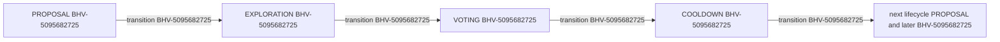

<!-- trace: FLW-802D71B91D, FLW-FB5CAECCAD, FLW-FD2B1F4966, FLW-BEFDEF1197, FLW-E60ABD1745, FLW-9BA4D696D1, FLW-2F560AE009, FLW-5C8E5E0DE3, FLW-A565B35EC6, FLW-21AF7F4E4D, FLW-745B097927, FLW-9D28A6D299, FLW-6394A1B72B, FLW-5AA543472A, FLW-5E24C8B8E4, FLW-A6B92A4E6D, FLW-53B4410963, FLW-7DA083B071, FLW-9BB4E99B75, FLW-BFD5C6D535, CMP-49180D7623, CMP-834A30297A, CMP-31D3990A1F, CMP-7DB1B15B38, CMP-2890255AE1, CMP-7CC27EFA43, CMP-874E479BA1, CMP-E155326DD2, CMP-B6BB8BE661, CMP-5CAF19BDCD, CMP-0F476A460D -->
## Principal flow view
```mermaid
flowchart LR
  PC0["Mina account/hash model CMP-49180D7623"]
  PC1["Treasury event schemas CMP-834A30297A"]
  PC2["Prefixed hashing and action chaining CMP-31D3990A1F"]
  PC3["Pause-controller multisig messages CMP-7DB1B15B38"]
  PC4["Prefixed Merkle trees and witnesses CMP-2890255AE1"]
  PC5["Provable ledger and hashing support CMP-7CC27EFA43"]
  PC6["Staking-ledger-to-voting-ledger ZkProgram CMP-874E479BA1"]
  PC7["Treasury Owner smart contract CMP-E155326DD2"]
  PC8["Treasury Pause Controller smart contract CMP-B6BB8BE661"]
  PC9["Treasury Proposal smart contract CMP-5CAF19BDCD"]
  PC10["Vote Reducer ZkProgram CMP-0F476A460D"]
  PF0["Staking-transformation digest proof statement FLW-802D71B91D"]
  PC6 -->|"owns FLW-802D71B91D"| PF0
  PF1["Owner-side proposal creation FLW-FB5CAECCAD"]
  PC7 -->|"owns FLW-FB5CAECCAD"| PF1
  PF2["Pause-controller command authorization FLW-FD2B1F4966"]
  PC8 -->|"owns FLW-FD2B1F4966"| PF2
  PF3["Proposal-local payout FLW-BEFDEF1197"]
  PC9 -->|"owns FLW-BEFDEF1197"| PF3
  PF4["Proposal-local tally FLW-E60ABD1745"]
  PC9 -->|"owns FLW-E60ABD1745"| PF4
  PF5["Vote-reduction proof statement FLW-9BA4D696D1"]
  PC10 -->|"owns FLW-9BA4D696D1"| PF5
  PF6["Treasury event producer-to-consumer schema FLW-2F560AE009"]
  PC1 -->|"owns FLW-2F560AE009"| PF6
  PF7["Public key to voting/nullifier root FLW-5C8E5E0DE3"]
  PC5 -->|"owns FLW-5C8E5E0DE3"| PF7
  PF8["Mina account to staking-ledger root FLW-A565B35EC6"]
  PC0 -->|"owns FLW-A565B35EC6"| PF8
  PF9["Global pause or unpause command FLW-21AF7F4E4D"]
  PC8 -->|"owns FLW-21AF7F4E4D"| PF9
  PF10["Emergency participant commitment rotation FLW-745B097927"]
  PC8 -->|"owns FLW-745B097927"| PF10
  PF11["Approved partial payout FLW-9D28A6D299"]
  PC7 -->|"owns FLW-9D28A6D299"| PF11
  PF12["Proposal creation and bond custody FLW-6394A1B72B"]
  PC7 -->|"owns FLW-6394A1B72B"| PF12
  PF13["Proposal-specific pause toggle FLW-5AA543472A"]
  PC8 -->|"owns FLW-5AA543472A"| PF13
  PF14["Proof-backed tally finalization FLW-5E24C8B8E4"]
  PC7 -->|"owns FLW-5E24C8B8E4"| PF14
  PF15["Vote authorization and action dispatch FLW-A6B92A4E6D"]
  PC7 -->|"owns FLW-A6B92A4E6D"| PF15
  PF16["Compose staking ranges and prove terminal boundary FLW-53B4410963"]
  PC6 -->|"owns FLW-53B4410963"| PF16
  PF17["Staking-to-voting digest batch FLW-7DA083B071"]
  PC6 -->|"owns FLW-7DA083B071"| PF17
  PF18["Recursive vote-proof aggregation FLW-9BB4E99B75"]
  PC10 -->|"owns FLW-9BB4E99B75"| PF18
  PF19["Vote reduction batch FLW-BFD5C6D535"]
  PC10 -->|"owns FLW-BFD5C6D535"| PF19
```

<!-- trace: FLW-802D71B91D, CMP-874E479BA1, BHV-C4F9C6CEE0, BHV-C01A568AAE, EVD-B30136F272, AST-48E151A2EB, CMP-7CC27EFA43, FLW-FB5CAECCAD, CMP-E155326DD2, BHV-5B1BD6B386, BHV-5095682725, BHV-80247CE73D, EVD-9E30964FCB, AST-4FF53BEEEB, FLW-FD2B1F4966, CMP-7DB1B15B38, BHV-8ED0438CC8, CMP-B6BB8BE661, BHV-F898CD867A, BHV-1FC418499A, BHV-DDC0A35072, EVD-05AEF87762, EVD-98C59C67BD, AST-4481913618, THR-0DEBF32E0A, THR-77C87EDE62, FLW-BEFDEF1197, CMP-5CAF19BDCD, BHV-F2207732B4, EVD-DD1C7DA36F, AST-97B28D8884, GAP-B798CE8DB1, GAP-F83C6F5411, FLW-E60ABD1745, BHV-1136BD4D08, BHV-A302A43C9F, EVD-79754810F6, AST-DAB25C2514, ASM-FF091135AE, FND-B5948FE3CF, FLW-9BA4D696D1, CMP-0F476A460D, BHV-50C1B246E0, BHV-E79288F8DA, EVD-810D58B5D2, AST-CBEC48B1E0, FLW-2F560AE009, CMP-834A30297A, BHV-761186E23C, EVD-02AE7D74CF, AST-BB5FF109EE, FLW-5C8E5E0DE3, BHV-08FB416CF3, CMP-31D3990A1F, BHV-CB4CCBE337, CMP-2890255AE1, BHV-4EC84F351D, EVD-6201011AC1, AST-4CAF411B32, FLW-A565B35EC6, CMP-49180D7623, BHV-44F30E27C0, BHV-0EED4FB2BD, EVD-03D20507BE, AST-04EED85D27, FLW-21AF7F4E4D, INV-1E832E77A4, INV-187FD2A7A9, EVD-337E2C2D56, AST-A132DD0B17, GAP-22CD8BD355, REQ-8BFD766005, SEC-10182FB352, FLW-745B097927, BHV-0D6A8D760E, INV-0697F6A5B4, EVD-CF08ADCD5E, EVD-8F785412DE, AST-7FB05AF254, ASM-E6AE27B10D, FLW-9D28A6D299, BHV-5D3FCC7B93, INV-EF3059DB8A, INV-681AEC9EF4, EVD-0E9360A4D5, AST-F5181D332F, GAP-7BAF881BED, FLW-6394A1B72B, BHV-5CBB373BE5, INV-A2C6F00258, INV-CF85A74EED, EVD-E95EC38949, EVD-9FC5B7AF30, AST-7BC1073B95, GAP-9398E85581, REQ-989D12F5D3, FLW-5AA543472A, BHV-10BA9AD71E, BHV-8B6F3A639B, BHV-8FA351E512, INV-015B387636, INV-DEFE674779, EVD-4908C76CF8, EVD-3FE5CD8A8A, EVD-6665BB19D1, AST-BA1211B140, THR-A943E3380A, FLW-5E24C8B8E4, BHV-4866A87097, INV-F79F5B8C65, INV-222CED01FB, INV-159AD1A04E, EVD-5AED8D6498, AST-9329F20061, UNR-13C729A54A, FLW-A6B92A4E6D, BHV-8E9F5C3ECE, BHV-9E1B7D1BA1, INV-BD6F8D1028, INV-A0200396FA, EVD-2598ABF031, EVD-9D0B8E0BBB, AST-5A260DA2E6, FLW-53B4410963, BHV-17E3A4CB8C, BHV-E7ECC5B6FC, EVD-B7C40C0F6F, AST-BE02BC3E3B, FND-CA0F83CE86, INV-016B52DE5B, FLW-7DA083B071, EVD-177476A23F, AST-D3DF75DC95, ASM-73AF207816, INV-2A14CD3045, FLW-9BB4E99B75, BHV-67153EA362, EVD-4F2874E860, AST-0BF72F1A24, FLW-BFD5C6D535, BHV-CEE91EC6D9, BHV-141ED40E5D, BHV-3946C60752, EVD-D70E747767, AST-6FDBBB5290 -->
## Flow index
| ID | Topic | Status | Static conclusion | Pass 2 |
| --- | --- | --- | --- | --- |
| [FLW-802D71B91D](SPECIFICATION.md#flw-802d71b91d) | Staking-transformation digest proof statement | LOCAL | The proof binds the mathematical root transition, not transactional durability of the host ledger writes. | CONFIRMED |
| [FLW-FB5CAECCAD](SPECIFICATION.md#flw-fb5caeccad) | Owner-side proposal creation | LOCAL | This local view ends at outbound proposal account-update approval; the orchestrator must compose the cross-contract flow. | CONFIRMED |
| [FLW-FD2B1F4966](SPECIFICATION.md#flw-fd2b1f4966) | Pause-controller command authorization | LOCAL | [Exact technical value; STE length exception] The local interpretation for Pause-controller command authorization remains source-supported, but complete context adds cross-component policy, trust, lifecycle, or liveness qualifications represented by the linked context records. | REFINED |
| [FLW-BEFDEF1197](SPECIFICATION.md#flw-befdef1197) | Proposal-local payout | LOCAL | The local interpretation for Proposal-local payout remains source-supported, but complete context adds cross-component policy, trust, lifecycle, or liveness qualifications represented by the linked context records. | REFINED |
| [FLW-E60ABD1745](SPECIFICATION.md#flw-e60abd1745) | Proposal-local tally | LOCAL | The local interpretation for Proposal-local tally remains source-supported, but complete context adds cross-component policy, trust, lifecycle, or liveness qualifications represented by the linked context records. | REFINED |
| [FLW-9BA4D696D1](SPECIFICATION.md#flw-9ba4d696d1) | Vote-reduction proof statement | LOCAL | Host nullifier writes are operational side effects and are not themselves guaranteed by proof verification. | CONFIRMED |
| [FLW-2F560AE009](SPECIFICATION.md#flw-2f560ae009) | Treasury event producer-to-consumer schema | SUPPORTED_STATICALLY | Tests establish static encoding expectations for the shared schema, not correctness of values emitted by production methods. | CONFIRMED |
| [FLW-5C8E5E0DE3](SPECIFICATION.md#flw-5c8e5e0de3) | Public key to voting/nullifier root | SUPPORTED_STATICALLY | Both ledgers use the identical positional index but distinct prefixed empty/typed leaf values. | CONFIRMED |
| [FLW-A565B35EC6](SPECIFICATION.md#flw-a565b35ec6) | Mina account to staking-ledger root | SUPPORTED_STATICALLY | The same account encoding supplies both the empty staking leaf and populated leaf hash path. | CONFIRMED |
| [FLW-21AF7F4E4D](SPECIFICATION.md#flw-21af7f4e4d) | Global pause or unpause command | LOCAL | Global pause authorization lacks deployment-domain binding and an on-chain event and relies on distinct recoverable signers. | REFINED |
| [FLW-745B097927](SPECIFICATION.md#flw-745b097927) | Emergency participant commitment rotation | LOCAL | [Exact technical value; STE length exception] The local interpretation for Emergency participant commitment rotation remains source-supported, but complete context adds cross-component policy, trust, lifecycle, or liveness qualifications represented by the linked context records. | REFINED |
| [FLW-9D28A6D299](SPECIFICATION.md#flw-9d28a6d299) | Approved partial payout | CROSS_COMPONENT | Recipient-bound payout is source-visible, but claims are unreserved, caller ordered, unexpired, and lack a completion state. | REFINED |
| [FLW-6394A1B72B](SPECIFICATION.md#flw-6394a1b72b) | Proposal creation and bond custody | CROSS_COMPONENT | [Exact technical value; STE length exception] The local interpretation for Proposal creation and bond custody remains source-supported, but complete context adds cross-component policy, trust, lifecycle, or liveness qualifications represented by the linked context records. | REFINED |
| [FLW-5AA543472A](SPECIFICATION.md#flw-5aa543472a) | Proposal-specific pause toggle | CROSS_COMPONENT | Authorization is a blind toggle, terminal status can be lost, and the emitted Bool can disagree with state. | REFINED |
| [FLW-5E24C8B8E4](SPECIFICATION.md#flw-5e24c8b8e4) | Proof-backed tally finalization | CROSS_COMPONENT | [Exact technical value; STE length exception] The local interpretation for Proof-backed tally finalization remains source-supported, but complete context adds cross-component policy, trust, lifecycle, or liveness qualifications represented by the linked context records. | REFINED |
| [FLW-A6B92A4E6D](SPECIFICATION.md#flw-a6b92a4e6d) | Vote authorization and action dispatch | CROSS_COMPONENT | Dispatch authenticity and tally eligibility are separate boundaries. | CONFIRMED |
| [FLW-53B4410963](SPECIFICATION.md#flw-53b4410963) | Compose staking ranges and prove terminal boundary | LOCAL | Recursive adjacency is constrained, but terminal completeness still relies on a dense staking-ledger representation. | REFINED |
| [FLW-7DA083B071](SPECIFICATION.md#flw-7da083b071) | Staking-to-voting digest batch | LOCAL | [Exact technical value; STE length exception] The local interpretation for Staking-to-voting digest batch remains source-supported, but complete context adds cross-component policy, trust, lifecycle, or liveness qualifications represented by the linked context records. | REFINED |
| [FLW-9BB4E99B75](SPECIFICATION.md#flw-9bb4e99b75) | Recursive vote-proof aggregation | LOCAL | The result uses proof2 terminal commitments and additive vote totals. | CONFIRMED |
| [FLW-BFD5C6D535](SPECIFICATION.md#flw-bfd5c6d535) | Vote reduction batch | LOCAL | All five actions traverse the same membership/nullifier path; dummy only changes selected downstream effects. | CONFIRMED |

<!-- trace: FLW-802D71B91D, CMP-874E479BA1, BHV-C4F9C6CEE0, BHV-C01A568AAE -->
## Staking-transformation digest proof statement — FLW-802D71B91D
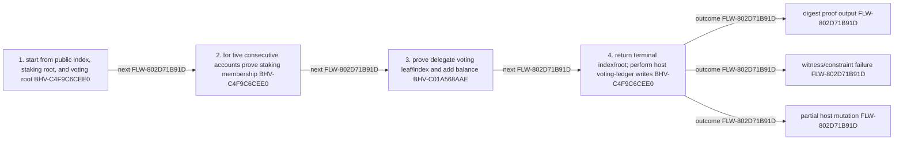

<!-- trace: FLW-FB5CAECCAD, CMP-E155326DD2, BHV-5B1BD6B386, BHV-5095682725, BHV-80247CE73D -->
## Owner-side proposal creation — FLW-FB5CAECCAD
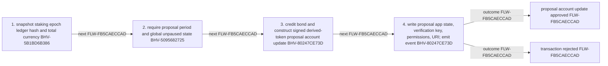

<!-- trace: FLW-FD2B1F4966, CMP-7DB1B15B38, BHV-8ED0438CC8, CMP-B6BB8BE661, BHV-F898CD867A, BHV-1FC418499A, BHV-DDC0A35072 -->
## Pause-controller command authorization — FLW-FD2B1F4966
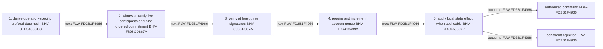

<!-- trace: FLW-BEFDEF1197, CMP-5CAF19BDCD, BHV-F2207732B4 -->
## Proposal-local payout — FLW-BEFDEF1197
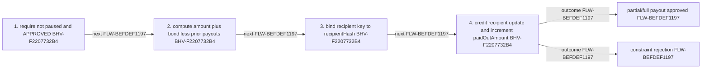

<!-- trace: FLW-E60ABD1745, CMP-5CAF19BDCD, BHV-1136BD4D08, BHV-A302A43C9F -->
## Proposal-local tally — FLW-E60ABD1745
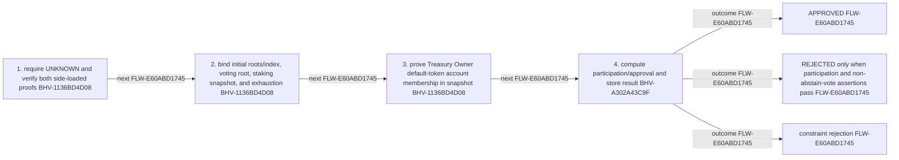

<!-- trace: FLW-9BA4D696D1, CMP-0F476A460D, BHV-50C1B246E0, BHV-E79288F8DA -->
## Vote-reduction proof statement — FLW-9BA4D696D1
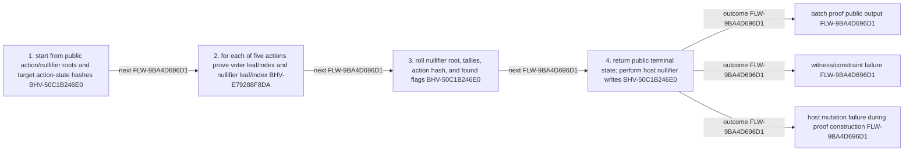

<!-- trace: FLW-2F560AE009, CMP-834A30297A, BHV-761186E23C -->
## Treasury event producer-to-consumer schema — FLW-2F560AE009
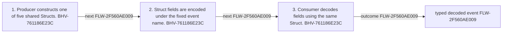

<!-- trace: FLW-5C8E5E0DE3, CMP-7CC27EFA43, BHV-08FB416CF3, CMP-31D3990A1F, BHV-CB4CCBE337, CMP-2890255AE1, BHV-4EC84F351D -->
## Public key to voting/nullifier root — FLW-5C8E5E0DE3
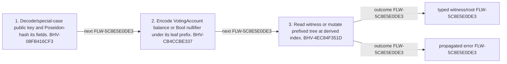

<!-- trace: FLW-A565B35EC6, CMP-49180D7623, BHV-44F30E27C0, BHV-0EED4FB2BD, CMP-2890255AE1, BHV-4EC84F351D -->
## Mina account to staking-ledger root — FLW-A565B35EC6
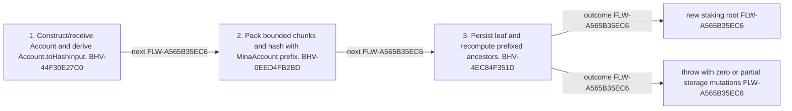

<!-- trace: FLW-21AF7F4E4D, BHV-F898CD867A, CMP-B6BB8BE661, BHV-8ED0438CC8, BHV-DDC0A35072 -->
## Global pause or unpause command — FLW-21AF7F4E4D
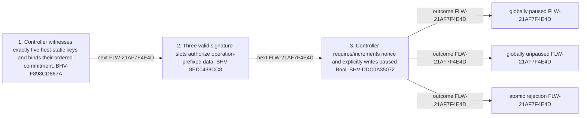

<!-- trace: FLW-745B097927, BHV-8ED0438CC8, CMP-B6BB8BE661, BHV-F898CD867A, BHV-0D6A8D760E -->
## Emergency participant commitment rotation — FLW-745B097927
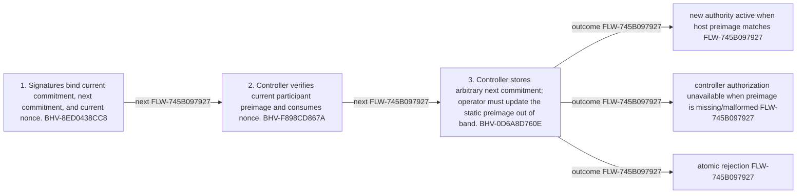

<!-- trace: FLW-9D28A6D299, BHV-5D3FCC7B93, CMP-E155326DD2, BHV-F2207732B4, CMP-5CAF19BDCD -->
## Approved partial payout — FLW-9D28A6D299
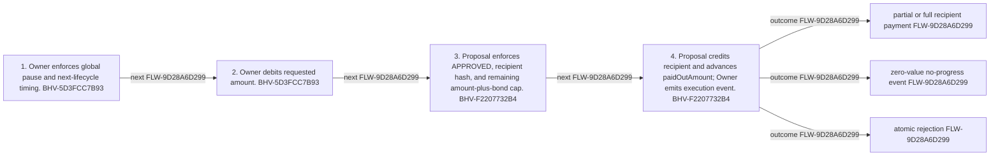

<!-- trace: FLW-6394A1B72B, BHV-5B1BD6B386, CMP-E155326DD2, BHV-5095682725, BHV-80247CE73D, BHV-5CBB373BE5, CMP-834A30297A -->
## Proposal creation and bond custody — FLW-6394A1B72B
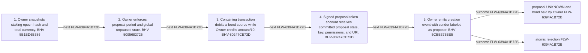

<!-- trace: FLW-5AA543472A, BHV-10BA9AD71E, CMP-B6BB8BE661, BHV-8B6F3A639B, CMP-5CAF19BDCD, BHV-8FA351E512, CMP-E155326DD2 -->
## Proposal-specific pause toggle — FLW-5AA543472A
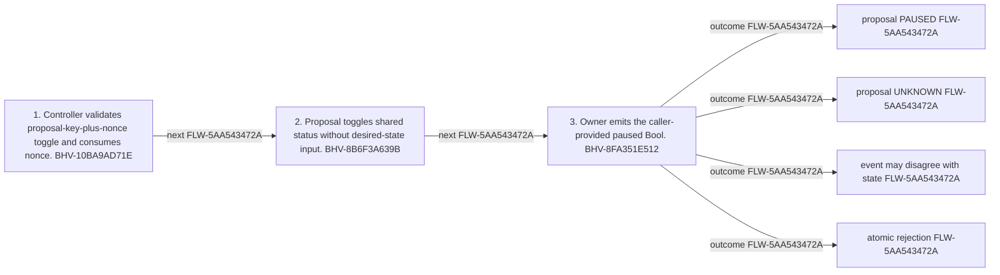

<!-- trace: FLW-5E24C8B8E4, BHV-4866A87097, CMP-E155326DD2, BHV-1136BD4D08, CMP-5CAF19BDCD, BHV-A302A43C9F -->
## Proof-backed tally finalization — FLW-5E24C8B8E4
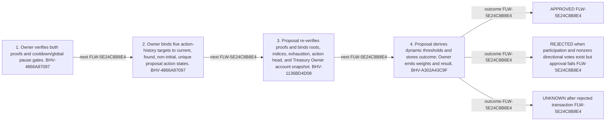

<!-- trace: FLW-A6B92A4E6D, BHV-8E9F5C3ECE, CMP-E155326DD2, BHV-9E1B7D1BA1, CMP-5CAF19BDCD -->
## Vote authorization and action dispatch — FLW-A6B92A4E6D
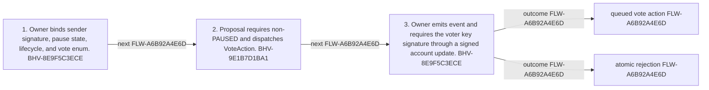

<!-- trace: FLW-53B4410963, CMP-874E479BA1, BHV-17E3A4CB8C, BHV-E7ECC5B6FC -->
## Compose staking ranges and prove terminal boundary — FLW-53B4410963
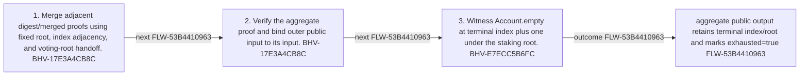

<!-- trace: FLW-7DA083B071, CMP-874E479BA1, BHV-C4F9C6CEE0, BHV-C01A568AAE -->
## Staking-to-voting digest batch — FLW-7DA083B071
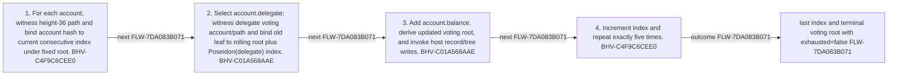

<!-- trace: FLW-9BB4E99B75, CMP-0F476A460D, BHV-67153EA362 -->
## Recursive vote-proof aggregation — FLW-9BB4E99B75
```mermaid
flowchart LR
  S0["1. Verify both proofs and bind caller input to proof1 input by Poseidon hash. BHV-67153EA362"]
  S1["2. Bind common voting root and action/nullifier adjacency. BHV-67153EA362"]
  S0 -->|"next FLW-9BB4E99B75"| S1
  S2["3. Bind target hashes, sum UInt64 tallies, and combine found flags. BHV-67153EA362"]
  S1 -->|"next FLW-9BB4E99B75"| S2
  O0["one recursively verified proof spanning both ordered ranges FLW-9BB4E99B75"]
  S2 -->|"outcome FLW-9BB4E99B75"| O0
```

<!-- trace: FLW-BFD5C6D535, CMP-0F476A460D, BHV-50C1B246E0, BHV-CEE91EC6D9, BHV-E79288F8DA, BHV-141ED40E5D, BHV-3946C60752 -->
## Vote reduction batch — FLW-BFD5C6D535
```mermaid
flowchart LR
  S0["1. Initialize rolling roots, zero tallies, and false target flags from public input. BHV-50C1B246E0"]
  S1["2. For each action, validate enum and classify exact dummy padding. BHV-CEE91EC6D9"]
  S0 -->|"next FLW-BFD5C6D535"| S1
  S2["3. Witness voting account/path and constrain root plus Poseidon(publicKey) index. BHV-E79288F8DA"]
  S1 -->|"next FLW-BFD5C6D535"| S2
  S3["4. Witness nullifier/path, constrain rolling root/index, and compute conditional true leaf. BHV-141ED40E5D"]
  S2 -->|"next FLW-BFD5C6D535"| S3
  S4["5. Attempt host nullifier record/tree persistence for non-dummy action. BHV-141ED40E5D"]
  S3 -->|"next FLW-BFD5C6D535"| S4
  S5["6. Add selected weight, append action commitment, and update target flags. BHV-3946C60752"]
  S4 -->|"next FLW-BFD5C6D535"| S5
  O0["public output contains terminal roots, batch tallies, and target history FLW-BFD5C6D535"]
  S5 -->|"outcome FLW-BFD5C6D535"| O0
```
