<!-- trace: SEC-FB542C27D2, SEC-EE4E9A7ADB, SEC-10182FB352, SEC-B560A051DA, SEC-BC2C476AE2, SEC-042FF4BC76, SEC-DD3B44137C, SEC-E0D95AF002, SEC-9F3756E302, SEC-F88596C819, THR-92F9C4D82A, THR-56AA87E621, THR-C66F2EDB38, THR-77C87EDE62, THR-622BA37FCF, THR-902C4A0F9F, THR-0EC3832BA7, THR-F283B3AF7E, THR-B041D07C7D, THR-5D2535B0B5, THR-0DEBF32E0A, THR-A943E3380A, THR-647A188D6B, THR-CD2BC0B163, THR-B55C2C8D2F, THR-5F94AE7496, THR-01539B0FF5, ASM-3B12C3E849, ASM-C093AE5452, ASM-031E77BE7F, ASM-79662ECECE, ASM-B2699C5369, ASM-E6AE27B10D, ASM-E0E1752AF7, ASM-557C7137A0, ASM-0E591EC647, ASM-82EB259917, ASM-503E6DE8AD, ASM-39FFFFFD50, ASM-B549EC8751, ASM-53F278775C, ASM-EF2D37A6EF, ASM-912B3DBDF6, ASM-FF091135AE, ASM-D691B96D3B, ASM-64F6936A94, ASM-73AF207816, ASM-A4087EF988, ASM-C0AB78216E, ASM-F556007192, ASM-35D9BB50D0, ASM-03D9CA273D, ASM-4B596D13E3, ASM-0DCB6712DD, ASM-BD7E733FE5 -->
# Static Whole-System Security Review

<!-- trace: CMP-E155326DD2, CMP-5CAF19BDCD, CMP-B6BB8BE661, CMP-874E479BA1, CMP-0F476A460D, EVD-2E424CAB76, EVD-11DB5D89B4, EVD-72A633D2CC, EVD-5963C00DAB, EVD-B3695707DC, INV-A0200396FA, BHV-8B6F3A639B, INV-DEFE674779, BHV-F898CD867A, EVD-9B18A655A2, EVD-6665BB19D1, SEC-FB542C27D2, SEC-9F3756E302, SEC-F88596C819, SEC-10182FB352, SEC-EE4E9A7ADB, SEC-B560A051DA, SEC-DD3B44137C, EVD-E95EC38949, EVD-DD1C7DA36F, EVD-D70E747767, EVD-1D93AC4BAF, ASM-D691B96D3B, ASM-A4087EF988, ASM-73AF207816, ASM-C0AB78216E, THR-56AA87E621, SEC-E0D95AF002, INV-EF3059DB8A, INV-BB400806DE, INV-222CED01FB, EVD-5AED8D6498, ZKP-EFB3E28391, ZKP-5DF7D24003, ZKP-DF018A9714, ZKP-BA11C90A9F, THR-5F94AE7496, EVD-8F785412DE, EVD-177476A23F, EVD-2720E90D33, EVD-C7D1DB2A7C, EVD-F7DE049BDC, ASM-EF2D37A6EF, ASM-53F278775C, UNR-20BC6033C1, EVD-BAD04529F7, EVD-9C55001C7F, FND-1979AEB628, FND-CD3FC08B49, FND-ECA97458D5, FND-D0ABA9650D, FND-8DB62F78C9, FND-BF3449506D, EVD-FB46967B48, EVD-8C7F748854, EVD-5099700F2E, EVD-995A61228D, FND-4C6DF9502F, GAP-FE43BADC05, THR-B55C2C8D2F, ASM-03D9CA273D, ASM-0E591EC647, ASM-35D9BB50D0, ASM-031E77BE7F, ASM-82EB259917, ASM-557C7137A0, ASM-0DCB6712DD, ASM-912B3DBDF6, ASM-E0E1752AF7, ASM-B2699C5369, EVD-7BD50662A0, EVD-79754810F6, EVD-1C17FE0D88, EVD-B30136F272, SEC-042FF4BC76, THR-0EC3832BA7, ASM-503E6DE8AD, GAP-A25D114C6F, THR-77C87EDE62, THR-0DEBF32E0A, THR-5D2535B0B5, EVD-278D27A176, EVD-CF08ADCD5E, THR-647A188D6B, FND-D0C94E0DC6, EVD-C3C25357D4, THR-C66F2EDB38, FND-23916993D0, EVD-C15386FB6E, EVD-1D24E67049, SEC-BC2C476AE2, THR-A943E3380A, THR-902C4A0F9F, FND-BFFEA51091, FND-B5948FE3CF, EVD-CFF488F119, THR-F283B3AF7E, THR-622BA37FCF, FND-1D115F22E4, FND-37BEE2B1BA, EVD-0E83AEA025, EVD-03D20507BE, THR-01539B0FF5, EVD-4F2874E860, EVD-C71179133B, ASM-FF091135AE, EVD-8928C709CD, THR-CD2BC0B163, THR-92F9C4D82A, THR-B041D07C7D, ASM-BD7E733FE5, EVD-F2FC321D60, FND-4B4F5D76C9, ASM-64F6936A94, UNR-13C729A54A, FND-E683792BE2, FND-10A2C953A0, EVD-A754CEC381, ASM-F556007192, FND-BBC3A2316C, EVD-E1F14754F0, EVD-97F3268F92, FND-EE80C71EE3, FND-19EC441E53, EVD-817F85F79C, FND-2184025222, EVD-D43C7ED7D0, FND-1FBF087284, EVD-BD46323DD9, FND-CA0F83CE86, GAP-EF32A38D1C, ASM-39FFFFFD50, GAP-1DC17F1884, EVD-0D50A0B3BE, ASM-3B12C3E849, ASM-4B596D13E3, EVD-F211A2464E, EVD-F66F2E3B4A, ASM-79662ECECE, ASM-B549EC8751, GAP-2124E32D06, ASM-C093AE5452, FND-7264C0E61E, EVD-02AE7D74CF, ASM-E6AE27B10D, EVD-98C59C67BD, EVD-A80CE1BF98, FND-8C3BA008B7, EVD-37FFC4C20C, FND-1897280316, EVD-472E3A66BD, FND-961BD4A980, EVD-2C1DE8596E, FND-67861A5343, FND-A5A4858953, EVD-94B958AAA8, FND-7BE7D38B6B, EVD-C70801D35C, FND-5F15694229, FND-1B33097A18, FND-F3C6E62E0B, EVD-D181A65EBF, EVD-05B8A4E6FF, FND-7D495DBE3F, EVD-B964F79D31, FND-30B94DCCE0, FND-3B35F91A1C, FND-756A14D862, FND-E5DB7A78F8, FND-C0656D649D, FND-8467BE9FD1, FND-3471621CD6, FND-9AA5203528, EVD-8D49AA6E0F, EVD-77D32C74CA, FND-D889112D27, FND-077D28F305, FND-4234CF9EC6, FND-88B3C09521, FND-8B2DE6F23F, FND-E393B29703, EVD-BD35AE3098, EVD-A375409A04, EVD-05AEF87762, EVD-C9D82E05E4, EVD-B42086D92E, EVD-4908C76CF8, FND-996A8C6D4E, EVD-1DC49074D7, EVD-810D58B5D2, FND-2237382FBA, EVD-0CA3D36B38, EVD-B3600D67DE, REL-00AEF1536B, IO-1F97CF4E82, EVD-3CEBE6B022, REL-EA36BC48D2, REL-86B5C33BDA, REL-8F24F6DAF1, REL-1089110191, REL-A5F59855A3, REL-4F545BA3FC, REL-E47D90B32A, REL-75A476CA07, REL-CE969D1CD9, REL-E202BF783A, IO-4708EC66CE, IO-668F610724, IO-7E445A843C, IO-C71845C9DB, IO-BD428B4BFE, IO-9D3B7CAE85, IO-3236C0037A, IO-5CBBA7540B, IO-FE03A006D4, IO-F795103B44, CL-43DA8C0600, CL-9016ED73D7, CL-E1DF82E30D, CL-B5C01C5182, CL-3D67D2EC7C, REL-4E2DBDEEAD, REL-83D83BBB4E, REL-44D59128AF, REL-5D9A09A125, IO-F2FDEDAAD4, IO-0E47C270AF, IO-DFBE3E4B97, IO-6FC5F32B87, CL-26D2B7BB15, CL-DA12027943, ZKP-66153C8CB1, REL-41284327B7, REL-3664E9D6F9, REL-6B57F8E5A0, REL-31E87AE8C0, IO-69C74E38D3, IO-088DC1C843, IO-E30D4BDAFB, IO-20DE355EF7, CL-5C42FDBA1B, CL-820ACD71D0, CL-E51C01E8DF, ZKP-547C93E79B, REL-CE966AA43A, REL-7C3831D8EC, REL-DA430F1EDD, REL-C5386D41BC, IO-9C80690415, IO-4B9BD5AA91, IO-67C38AAD67, IO-5B7DDF71A2, CL-14F284A0F4, CL-9DDDB05A64, CL-96F95D8CE6, CL-CE68CFDE0A, REL-96992E7E50, REL-D6AFDBBC16, REL-1884583AD7, REL-4D9D9DF877, REL-03AA6118C2, REL-E3A8EF7E65, REL-5DA946B3A1, REL-296CAFE207, REL-5EDF6F2962, REL-ADD56A64B3, REL-67A94DDB19, REL-70D1CDE363, REL-FA211B3844, REL-C73428091B, REL-022A0995FF, REL-9F87928AEA, REL-5BAB584F4B, REL-3CDDF609DA, REL-6AE927936D, REL-E1F0545D1D, REL-7C92E212B4, IO-626345DDF5, IO-B0282188FD, IO-0467289092, IO-E9661CD282, IO-3F0DC7DE94, IO-13802BA54F, IO-EC980A7F95, IO-65764C55DD, IO-DEB6DB3865, IO-623DE360CA, IO-C22A925F5B, IO-E34414723E, IO-A27752072E, IO-9C3461F78B, IO-0E41C22124, IO-B36955C5A4, IO-0AE4C61332, IO-87B5865B4B, IO-8095F5006E, IO-5C4505832E, IO-FEAE73D285, CL-2311B61899, CL-2F056FA9A9, CL-9C7B0C38F5, CL-61EF5A92CB, CL-631833DB43, CL-034C97475E, CL-5D1DBDDB89, CL-0966A605CA, REL-0908B0F4AD, REL-04F149788B, REL-DD21A8E7A9, REL-02B5E35EEA, REL-A9809109C5, REL-549A32EEBD, REL-F82E54D4F3, REL-5F2D985D2E, REL-37CDC651DC, REL-EC2F02C65F, UNR-D5F28B1A0D, GAP-B798CE8DB1, GAP-22CD8BD355, GAP-8826CA0D4C, UNR-9EEFA83E06, GAP-4DE9FCF9CE, GAP-721B65BE75, GAP-7BAF881BED, GAP-5EB38DFDA6, UNR-C23B2D9729, UNR-3694303308, GAP-BB80E3EB16, UNR-C42A921AD9, UNR-72174E5C45, GAP-935AA6FD0D, GAP-B1C8C1A4E1, UNR-D007DAF961, UNR-F951787FC2, GAP-817200738F, GAP-BCB6F29C25, GAP-52A3FE4758, GAP-ADD703D733, UNR-BA7E7021CF, GAP-2CA978704D, GAP-96C24B88BE, GAP-50DC9AE203, GAP-ABC383D9C1, GAP-0B47B1BC29, GAP-48D1CB3548, GAP-B9423A0E57, GAP-4B6AF1A2C6, GAP-8C60DBC5D8, GAP-003C868089, GAP-9CA1247303, GAP-E291D5E72A, GAP-212C9A0653, GAP-9D0D23D527, GAP-F83C6F5411, UNR-15F1A8EB0E, UNR-743184E14A, UNR-1733743332, UNR-0B3E825B88, UNR-29788D0D91, UNR-6384846777, FND-A9E2B8A781, FND-96F57CB8BE, FND-AABDAA9DDE, FND-09463775C7, FND-0166B772A2, FND-BB5F22E4C9, FND-914C2D8638, FND-8C5615E0BB, FND-77094EEA1D, FND-189B914DB8 -->
## Fresh cross-component security/trust challenge
| Disposition | Reviewed records | Qualifications | Limits |
| --- | --- | --- | --- |
| QUALIFIED_CONFIRMATION_WITH_DISSENT | None recorded. | 2 | No target code, tests, build, compiler, proof, verifier, chain, transaction, database or PROOFS_ENABLED mode was executed. Cryptographic/circuit soundness, runtime reachability, exploitability, production configuration, deployed permissions/keys/roots, Mina/o1js semantics, transaction atomicity and host persistence remain UNKNOWN. RFC and prior-audit materials are hashed intent/history, not current authority, deployment evidence, or certification. UNKNOWN is preserved wherever authority, external component behavior, runtime evidence or consumer behavior is absent; silence is not interpreted as safety. |

<!-- trace: SEC-FB542C27D2, BHV-5D3FCC7B93, BHV-F2207732B4, INV-EF3059DB8A, CMP-49180D7623, REQ-87F314C527, THR-92F9C4D82A, THR-B041D07C7D, ASM-BD7E733FE5, ASM-D691B96D3B, EVD-2E424CAB76, EVD-11DB5D89B4, AST-108D4F8CD8, SEC-EE4E9A7ADB, BHV-C0141CC000, BHV-8786B10BA6, THR-56AA87E621, ASM-912B3DBDF6, ASM-FF091135AE, ASM-39FFFFFD50, EVD-1D93AC4BAF, AST-FBDB5D6A04, SEC-10182FB352, BHV-F898CD867A, BHV-1FC418499A, BHV-0D6A8D760E, THR-77C87EDE62, THR-0DEBF32E0A, THR-5D2535B0B5, ASM-A4087EF988, ASM-64F6936A94, EVD-72A633D2CC, AST-4768226AF7, SEC-B560A051DA, INV-108FEC74C4, INV-2ACACDB43D, THR-C66F2EDB38, ASM-73AF207816, ASM-503E6DE8AD, EVD-B3695707DC, EVD-5963C00DAB, EVD-F66F2E3B4A, AST-07DC53AD00, SEC-BC2C476AE2, INV-A0200396FA, BHV-8B6F3A639B, THR-A943E3380A, THR-902C4A0F9F, ASM-0DCB6712DD, ASM-B549EC8751, AST-8F7A13E2F1, SEC-042FF4BC76, BHV-50C1B246E0, BHV-C4F9C6CEE0, THR-0EC3832BA7, ASM-35D9BB50D0, AST-88FC2A6155, SEC-DD3B44137C, INV-A59D85B29B, INV-078D70B211, THR-F283B3AF7E, THR-622BA37FCF, ASM-C0AB78216E, ASM-F556007192, AST-367BF6EE62, SEC-E0D95AF002, ZKP-BA11C90A9F, ZKP-5DF7D24003, BHV-BAB5A8FD7C, THR-01539B0FF5, THR-5F94AE7496, ASM-EF2D37A6EF, ASM-53F278775C, AST-4A0A5ACB0A, SEC-9F3756E302, BHV-80247CE73D, BHV-872BB5A5F8, THR-647A188D6B, AST-60750D68C0, SEC-F88596C819, BHV-C01A568AAE, BHV-141ED40E5D, THR-B55C2C8D2F, THR-CD2BC0B163, ASM-03D9CA273D, ASM-4B596D13E3, AST-AE9BAA75F8 -->
## Security objectives
| ID | Topic | Status | Static conclusion | Pass 2 |
| --- | --- | --- | --- | --- |
| [SEC-FB542C27D2](SPECIFICATION.md#sec-fb542c27d2) | Preserve treasury custody, payout conservation, and destination binding | CURRENT | Source binds approved status, recipient hash, remaining cap, owner debit, and recipient credit, while atomic conservation remains protocol-dependent. | CONFIRMED |
| [SEC-EE4E9A7ADB](SPECIFICATION.md#sec-ee4e9a7adb) | Bind deployment configuration and dependency versions to the reviewed protocol | CURRENT | Multiple security-critical values are class-static, dependency-defined, or hard-coded; the pinned scope contains no production manifest binding them to this revision. | CONFIRMED |
| [SEC-10182FB352](SPECIFICATION.md#sec-10182fb352) | Keep emergency authority thresholded, replay-bounded, transparent, and recoverable | CURRENT | [Exact technical value; STE length exception] Commitment, operation prefixes, nonce, and three valid slots are enforced; distinct identities, deployment/network domain, exact target pause state, next-key preimage, and controller events are not. | CONFIRMED |
| [SEC-B560A051DA](SPECIFICATION.md#sec-b560a051da) | Keep prover host state isolated, failure-atomic, reproducible, and consistent with public roots | CURRENT | Host mutations occur inside witness callbacks without a visible transactional/job boundary; proof verification does not certify persistence completion. | CONFIRMED |
| [SEC-BC2C476AE2](SPECIFICATION.md#sec-bc2c476ae2) | Enforce lifecycle ordering and preserve terminal governance state | CURRENT | Source-visible time gates exist, but pause shares the result Field and low-participation tally cannot persist REJECTED. | CONFIRMED |
| [SEC-042FF4BC76](SPECIFICATION.md#sec-042ff4bc76) | Permit complete governance processing within operational deadlines | CURRENT | Base proofs process five records and tally requires strict terminal/history conditions, while throughput, recursion schedule, service availability, and deadline fit are unresolved. | CONFIRMED |
| [SEC-DD3B44137C](SPECIFICATION.md#sec-dd3b44137c) | Keep events, parsing, logs, and operational diagnostics faithful to state | CURRENT | Shared event schemas exist, but proposal pause emits caller input rather than derived post-state and deserializers can convert failures into empty values. | CONFIRMED |
| [SEC-E0D95AF002](SPECIFICATION.md#sec-e0d95af002) | Bind every accepted proof product to its intended statement and state effect | CURRENT | Local source shows extensive root/index/continuity bindings; circuit soundness, keys, and host effects remain explicitly outside the established property. | CONFIRMED |
| [SEC-9F3756E302](SPECIFICATION.md#sec-9f3756e302) | Preserve proposal identity, immutable initialization, and authorization domain | CURRENT | Creation installs state and a verification key on a signed derived-token account, but explicit isNew and deployed-permission guarantees are absent from local evidence. | CONFIRMED |
| [SEC-F88596C819](SPECIFICATION.md#sec-f88596c819) | Count only eligible voting weight once and produce an accurate tally | CURRENT | Voter/nullifier indices and proof continuity are constrained, but eligible account/delegate policy and public DUMMY semantics are not authoritatively aligned. | CONFIRMED |

<!-- trace: CMP-49180D7623, CMP-834A30297A, CMP-31D3990A1F, CMP-7DB1B15B38, CMP-2890255AE1, CMP-7CC27EFA43, CMP-874E479BA1, CMP-E155326DD2, FLW-802D71B91D, FLW-FB5CAECCAD, FLW-FD2B1F4966, FLW-BEFDEF1197, FLW-E60ABD1745, FLW-9BA4D696D1, FLW-2F560AE009, FLW-5C8E5E0DE3, BHV-44F30E27C0, BHV-9B695F3AF8, BHV-761186E23C, BHV-3493B522BB, BHV-C881A8957C, BHV-CFC00681B8, BHV-4EC84F351D, BHV-DAE783F632, BHV-0EED4FB2BD, BHV-6214513169, BHV-CB4CCBE337, BHV-08FB416CF3, BHV-CC8CE33239, BHV-B919E9DAF9, BHV-5CBB373BE5, BHV-8ED0438CC8, BHV-80247CE73D, BHV-C0141CC000, BHV-5095682725, BHV-8E9F5C3ECE, CL-7151B97E3F, CL-1A9D54DEF9, CL-B0785D253F, CL-678A5D4790, CL-FB3A4538F7, CL-4556EAE93B, CL-546BFFB196, CL-8EA50D955D, CL-57C7212869, CL-D7B00173DA, CL-60DDDB49C4, CL-8041DB886D, CL-161DE18459, CL-9073A9D34C, CL-C07EA8DC01, CL-EE7157BCAE, CL-CB5F345B9C, CL-AFDB356F05, CL-EBC2FA7E3D, CL-EA98E3F196, FND-CA0F83CE86, FND-37BEE2B1BA, FND-7264C0E61E, FND-8C3BA008B7, FND-1897280316, FND-19EC441E53, FND-961BD4A980, FND-67861A5343, FND-CD3FC08B49, FND-1979AEB628, FND-ECA97458D5, FND-A5A4858953, FND-7BE7D38B6B, FND-5F15694229, FND-1B33097A18, FND-F3C6E62E0B, FND-BF3449506D, FND-7D495DBE3F, FND-30B94DCCE0, FND-3B35F91A1C, FND-756A14D862, FND-E5DB7A78F8, FND-1FBF087284, FND-C0656D649D, FND-8467BE9FD1, FND-3471621CD6, FND-9AA5203528, FND-8DB62F78C9, FND-D0ABA9650D, FND-D889112D27, FND-077D28F305, FND-4234CF9EC6, FND-88B3C09521, FND-8B2DE6F23F, FND-E393B29703, FND-B5948FE3CF, FND-4B4F5D76C9, FND-BBC3A2316C, FND-E683792BE2, FND-BFFEA51091, FND-1D115F22E4, FND-D0C94E0DC6, FND-10A2C953A0, FND-996A8C6D4E, FND-EE80C71EE3, FND-23916993D0, FND-4C6DF9502F, FND-2237382FBA, FND-2184025222, FLW-A565B35EC6, FLW-21AF7F4E4D, FLW-745B097927, FLW-9D28A6D299, FLW-6394A1B72B, FLW-5AA543472A, FLW-5E24C8B8E4, FLW-A6B92A4E6D, FLW-53B4410963, FLW-7DA083B071, FLW-9BB4E99B75, FLW-BFD5C6D535, SEC-FB542C27D2, SEC-EE4E9A7ADB, SEC-10182FB352, SEC-B560A051DA, SEC-BC2C476AE2, SEC-042FF4BC76, SEC-DD3B44137C, SEC-E0D95AF002, SEC-9F3756E302, SEC-F88596C819, THR-92F9C4D82A, THR-56AA87E621, THR-C66F2EDB38, THR-77C87EDE62, THR-622BA37FCF, THR-902C4A0F9F, THR-0EC3832BA7, THR-F283B3AF7E, THR-B041D07C7D, THR-5D2535B0B5, THR-0DEBF32E0A, THR-A943E3380A, THR-647A188D6B, THR-CD2BC0B163, THR-B55C2C8D2F, THR-5F94AE7496, THR-01539B0FF5, UNR-D5F28B1A0D, GAP-B798CE8DB1, GAP-EF32A38D1C, GAP-22CD8BD355, GAP-2124E32D06, GAP-8826CA0D4C, UNR-9EEFA83E06, UNR-13C729A54A, ASM-B549EC8751, ASM-FF091135AE, ASM-C0AB78216E, ASM-BD7E733FE5, GAP-4DE9FCF9CE, GAP-721B65BE75, ASM-E6AE27B10D, ASM-912B3DBDF6, ASM-D691B96D3B, ASM-64F6936A94, ASM-A4087EF988, GAP-7BAF881BED, GAP-5EB38DFDA6, ASM-031E77BE7F, UNR-C23B2D9729, ASM-EF2D37A6EF, ASM-4B596D13E3, UNR-3694303308, ASM-79662ECECE, ASM-B2699C5369, ASM-503E6DE8AD, ASM-73AF207816, GAP-BB80E3EB16, GAP-A25D114C6F, UNR-C42A921AD9, UNR-72174E5C45, ASM-53F278775C, GAP-935AA6FD0D, GAP-B1C8C1A4E1, UNR-D007DAF961, UNR-F951787FC2, UNR-20BC6033C1, ASM-C093AE5452, ASM-82EB259917, ASM-F556007192, GAP-817200738F, GAP-BCB6F29C25, GAP-52A3FE4758, GAP-ADD703D733, UNR-BA7E7021CF, GAP-2CA978704D, GAP-96C24B88BE, GAP-50DC9AE203, GAP-ABC383D9C1, GAP-0B47B1BC29, GAP-48D1CB3548, GAP-B9423A0E57, GAP-4B6AF1A2C6, GAP-8C60DBC5D8, GAP-003C868089, GAP-9CA1247303, GAP-E291D5E72A, GAP-212C9A0653, GAP-9D0D23D527, GAP-F83C6F5411, UNR-15F1A8EB0E, UNR-743184E14A, GAP-1DC17F1884, GAP-FE43BADC05, UNR-1733743332, UNR-0B3E825B88, UNR-29788D0D91, UNR-6384846777 -->
## Known failure classes
| Failure class | Disposition | Rationale | Records |
| --- | --- | --- | --- |
| MISSING_CHECK_OR_BINDING | APPLICABLE_REVIEWED | Pass-1 static evidence contains linked records for this applicable failure class; absence of runtime validation is not a safety claim. | FND-7264C0E61E, FND-ECA97458D5, FND-8467BE9FD1, FND-D0ABA9650D, FND-D889112D27, FND-10A2C953A0, UNR-D5F28B1A0D, THR-92F9C4D82A, THR-01539B0FF5 |
| STATE_OR_FAILURE_POLICY | APPLICABLE_REVIEWED | Pass-1 static evidence contains linked records for this applicable failure class; absence of runtime validation is not a safety claim. | FND-CA0F83CE86, FND-8C3BA008B7, FND-19EC441E53, FND-ECA97458D5, FND-8DB62F78C9, FND-D0ABA9650D, FND-8B2DE6F23F, FND-E683792BE2, FND-BFFEA51091, FND-1D115F22E4, FND-EE80C71EE3, FND-23916993D0, GAP-B798CE8DB1, GAP-EF32A38D1C, GAP-22CD8BD355, GAP-2124E32D06, GAP-8826CA0D4C, UNR-9EEFA83E06, UNR-13C729A54A, THR-C66F2EDB38, THR-0EC3832BA7, THR-A943E3380A, THR-647A188D6B, THR-01539B0FF5, ASM-B549EC8751, ASM-FF091135AE, ASM-C0AB78216E, ASM-BD7E733FE5 |
| IDENTITY_OR_PRIVILEGE | APPLICABLE_REVIEWED | Pass-1 static evidence contains linked records for this applicable failure class; absence of runtime validation is not a safety claim. | FND-A5A4858953, FND-7BE7D38B6B, FND-3471621CD6, FND-9AA5203528, FND-BBC3A2316C, FND-E683792BE2, GAP-4DE9FCF9CE, GAP-721B65BE75, UNR-D5F28B1A0D, THR-56AA87E621, THR-77C87EDE62, ASM-E6AE27B10D, ASM-912B3DBDF6, ASM-FF091135AE, ASM-D691B96D3B, ASM-64F6936A94, ASM-A4087EF988 |
| REPLAY_ORDER_OR_CONCURRENCY | APPLICABLE_REVIEWED | Pass-1 static evidence contains linked records for this applicable failure class; absence of runtime validation is not a safety claim. | FND-8C3BA008B7, FND-7D495DBE3F, FND-30B94DCCE0, FND-E393B29703, FND-4B4F5D76C9, FND-2184025222, GAP-7BAF881BED, GAP-5EB38DFDA6, THR-B041D07C7D, THR-0DEBF32E0A, THR-CD2BC0B163, ASM-031E77BE7F, ASM-64F6936A94 |
| ARITHMETIC_OR_ENCODING | APPLICABLE_REVIEWED | Pass-1 static evidence contains linked records for this applicable failure class; absence of runtime validation is not a safety claim. | FND-67861A5343, FND-3B35F91A1C, FND-996A8C6D4E, UNR-C23B2D9729, ASM-EF2D37A6EF, ASM-4B596D13E3 |
| UNTRUSTED_DATA_FLOW | APPLICABLE_REVIEWED | Pass-1 static evidence contains linked records for this applicable failure class; absence of runtime validation is not a safety claim. | FND-1897280316, FND-67861A5343, FND-23916993D0, GAP-721B65BE75, GAP-8826CA0D4C, UNR-3694303308, THR-92F9C4D82A, THR-C66F2EDB38, THR-5F94AE7496, ASM-031E77BE7F, ASM-79662ECECE, ASM-B2699C5369, ASM-503E6DE8AD, ASM-73AF207816 |
| PRODUCER_CONSUMER_ASYMMETRY | APPLICABLE_REVIEWED | Pass-1 static evidence contains linked records for this applicable failure class; absence of runtime validation is not a safety claim. | FND-CA0F83CE86, FND-7264C0E61E, FND-8C3BA008B7, FND-ECA97458D5, FND-30B94DCCE0, FND-E5DB7A78F8, FND-9AA5203528, FND-D889112D27, FND-8B2DE6F23F, FND-1D115F22E4, FND-EE80C71EE3, FND-23916993D0, FND-2237382FBA, GAP-B798CE8DB1, GAP-BB80E3EB16, GAP-22CD8BD355, GAP-2124E32D06, GAP-A25D114C6F, GAP-8826CA0D4C, UNR-9EEFA83E06, UNR-C42A921AD9, UNR-13C729A54A, UNR-72174E5C45, THR-56AA87E621, THR-C66F2EDB38, THR-902C4A0F9F, THR-0EC3832BA7, THR-F283B3AF7E, THR-A943E3380A, THR-647A188D6B, THR-5F94AE7496, THR-01539B0FF5, ASM-031E77BE7F, ASM-79662ECECE, ASM-53F278775C, ASM-EF2D37A6EF, ASM-912B3DBDF6, ASM-FF091135AE, ASM-73AF207816, ASM-C0AB78216E |
| DEPENDENCY_OR_CONFIGURATION | APPLICABLE_REVIEWED | Pass-1 static evidence contains linked records for this applicable failure class; absence of runtime validation is not a safety claim. | FND-3471621CD6, FND-9AA5203528, FND-D0ABA9650D, FND-4B4F5D76C9, FND-10A2C953A0, FND-2184025222, GAP-4DE9FCF9CE, GAP-935AA6FD0D, GAP-721B65BE75, GAP-B1C8C1A4E1, UNR-D007DAF961, UNR-F951787FC2, UNR-D5F28B1A0D, UNR-C42A921AD9, UNR-20BC6033C1, THR-56AA87E621, THR-0DEBF32E0A, THR-647A188D6B, ASM-C093AE5452, ASM-031E77BE7F, ASM-E6AE27B10D, ASM-82EB259917, ASM-53F278775C, ASM-912B3DBDF6, ASM-FF091135AE, ASM-D691B96D3B, ASM-64F6936A94, ASM-A4087EF988 |
| INFORMATION_EXPOSURE | APPLICABLE_REVIEWED | Pass-1 static evidence contains linked records for this applicable failure class; absence of runtime validation is not a safety claim. | GAP-A25D114C6F, THR-622BA37FCF, THR-0EC3832BA7, ASM-F556007192 |
| RESOURCE_OR_LIVENESS | APPLICABLE_REVIEWED | Pass-1 static evidence contains linked records for this applicable failure class; absence of runtime validation is not a safety claim. | GAP-817200738F, GAP-A25D114C6F, UNR-13C729A54A, THR-0EC3832BA7, ASM-503E6DE8AD |
| OBSERVABILITY_OR_RECOVERY | APPLICABLE_REVIEWED | Pass-1 static evidence contains linked records for this applicable failure class; absence of runtime validation is not a safety claim. | FND-7264C0E61E, FND-19EC441E53, FND-67861A5343, FND-CD3FC08B49, FND-1979AEB628, FND-ECA97458D5, FND-A5A4858953, FND-7BE7D38B6B, FND-5F15694229, FND-1B33097A18, FND-F3C6E62E0B, FND-BF3449506D, FND-7D495DBE3F, FND-30B94DCCE0, FND-3B35F91A1C, FND-756A14D862, FND-E5DB7A78F8, FND-1FBF087284, FND-C0656D649D, FND-8467BE9FD1, FND-3471621CD6, FND-9AA5203528, FND-8DB62F78C9, FND-D0ABA9650D, FND-D889112D27, FND-077D28F305, FND-4234CF9EC6, FND-88B3C09521, FND-8B2DE6F23F, FND-E393B29703, FND-1D115F22E4, FND-23916993D0, GAP-B798CE8DB1, GAP-BB80E3EB16, GAP-BCB6F29C25, GAP-52A3FE4758, GAP-8826CA0D4C, UNR-D007DAF961, THR-902C4A0F9F, THR-0EC3832BA7, THR-F283B3AF7E, THR-5D2535B0B5, ASM-73AF207816, ASM-C0AB78216E |
| TEST_ORACLE_BLIND_SPOT | APPLICABLE_REVIEWED | Pass-1 static evidence contains linked records for this applicable failure class; absence of runtime validation is not a safety claim. | FND-37BEE2B1BA, FND-7264C0E61E, FND-8C3BA008B7, FND-1897280316, FND-19EC441E53, FND-961BD4A980, FND-2237382FBA, GAP-BCB6F29C25, GAP-ADD703D733, UNR-BA7E7021CF |
| REQUIREMENT_OR_AUDIT_DRIFT | APPLICABLE_REVIEWED | Pass-1 static evidence contains linked records for this applicable failure class; absence of runtime validation is not a safety claim. | FND-67861A5343, FND-CD3FC08B49, FND-1979AEB628, FND-ECA97458D5, FND-A5A4858953, FND-7BE7D38B6B, FND-5F15694229, FND-1B33097A18, FND-F3C6E62E0B, FND-BF3449506D, FND-7D495DBE3F, FND-30B94DCCE0, FND-3B35F91A1C, FND-756A14D862, FND-E5DB7A78F8, FND-1FBF087284, FND-C0656D649D, FND-8467BE9FD1, FND-3471621CD6, FND-9AA5203528, FND-8DB62F78C9, FND-D0ABA9650D, FND-D889112D27, FND-077D28F305, FND-4234CF9EC6, FND-88B3C09521, FND-8B2DE6F23F, FND-E393B29703, GAP-2CA978704D, GAP-BB80E3EB16, GAP-96C24B88BE, GAP-50DC9AE203, GAP-ABC383D9C1, GAP-935AA6FD0D, GAP-0B47B1BC29, GAP-48D1CB3548, GAP-5EB38DFDA6, GAP-721B65BE75, GAP-B9423A0E57, GAP-BCB6F29C25, GAP-4B6AF1A2C6, GAP-8C60DBC5D8, GAP-B1C8C1A4E1, GAP-003C868089, GAP-9CA1247303, GAP-E291D5E72A, GAP-212C9A0653, GAP-9D0D23D527, GAP-F83C6F5411, GAP-52A3FE4758, GAP-22CD8BD355, UNR-D007DAF961, UNR-15F1A8EB0E, UNR-743184E14A, THR-A943E3380A |
| SMART_CONTRACT_OR_ZK | APPLICABLE_REVIEWED | Pass-1 static evidence contains linked records for this applicable failure class; absence of runtime validation is not a safety claim. | FND-CA0F83CE86, FND-1897280316, FND-19EC441E53, FND-961BD4A980, FND-30B94DCCE0, FND-D889112D27, FND-E393B29703, FND-B5948FE3CF, FND-4B4F5D76C9, FND-BBC3A2316C, FND-E683792BE2, FND-BFFEA51091, FND-1D115F22E4, FND-D0C94E0DC6, FND-10A2C953A0, FND-996A8C6D4E, FND-EE80C71EE3, FND-23916993D0, FND-4C6DF9502F, FND-2237382FBA, FND-2184025222, GAP-EF32A38D1C, GAP-F83C6F5411, GAP-52A3FE4758, GAP-22CD8BD355, GAP-2124E32D06, GAP-ADD703D733, GAP-1DC17F1884, GAP-A25D114C6F, GAP-8826CA0D4C, GAP-FE43BADC05, UNR-C23B2D9729, UNR-F951787FC2, UNR-1733743332, UNR-743184E14A, UNR-D5F28B1A0D, UNR-0B3E825B88, UNR-BA7E7021CF, UNR-29788D0D91, UNR-C42A921AD9, UNR-20BC6033C1, UNR-3694303308, UNR-13C729A54A, UNR-6384846777, UNR-72174E5C45, THR-C66F2EDB38, THR-0EC3832BA7, THR-5F94AE7496, THR-01539B0FF5, ASM-79662ECECE, ASM-82EB259917, ASM-EF2D37A6EF, ASM-912B3DBDF6, ASM-73AF207816, ASM-4B596D13E3 |

<!-- trace: REL-8D94358D1F, IO-1CF641A344, IO-140ADF5967, AST-89436D04DA, EVD-7241D16957, ASM-53F278775C, ASM-73AF207816, ASM-EF2D37A6EF, CMP-5CAF19BDCD, SEC-9F3756E302, SEC-BC2C476AE2, SEC-E0D95AF002, UNR-20BC6033C1, ZKP-0830843A1A, ZKP-37F3DC23FD, REL-E20DC14C1E, ZKP-DF018A9714, AST-D0C06153AF, EVD-69F140A1C8, ASM-4B596D13E3, CMP-7CC27EFA43, CMP-874E479BA1, REL-A38D47D128, ZKP-547C93E79B, AST-9323330F7F, EVD-C40CC7BDB8, CMP-0F476A460D, SEC-F88596C819, THR-01539B0FF5, REL-F5500906DF, IO-89BB105E28, IO-D2E9ED5387, AST-4158C9ABF6, EVD-74C5612F1A, REL-0A93E6EC1A, IO-DB06E786C6, AST-AC57603198, EVD-77FCCF8764, REL-5802D63B62, BHV-4866A87097, AST-540078830F, EVD-EAC5164121, ASM-BD7E733FE5, CMP-E155326DD2, SEC-FB542C27D2, REL-DEAD37FEA7, AST-F6A56EC26C, EVD-4A51346245, REL-A7E0080416, BHV-1136BD4D08, AST-9B4C0AF951, EVD-486D7CAD2C, REL-4810C50C7E, AST-9836611F84, EVD-368185B3B6, REL-188319D340, AST-C3D19901B3, EVD-BDBE008B7F, REL-8723F51AAF, AST-0CD43AB99E, EVD-4AAAFAD8E9, REL-B9BE0F0531, IO-DD1852B56B, IO-A0335A63F4, AST-4BF1892CA3, EVD-AE1EDCE441, REL-9320DFA9E7, IO-C3A08EF697, AST-1EF8F28462, EVD-7DDAF2A961, REL-00AEF1536B, ZKP-EFB3E28391, IO-1F97CF4E82, AST-85EC868F18, EVD-3CEBE6B022, ASM-A4087EF988, CMP-B6BB8BE661, SEC-10182FB352, THR-77C87EDE62, REL-EA36BC48D2, ZKP-5DF7D24003, IO-4708EC66CE, CL-43DA8C0600, CL-9016ED73D7, CL-E1DF82E30D, CL-B5C01C5182, CL-3D67D2EC7C, AST-AE12A9B458, ASM-35D9BB50D0, REL-86B5C33BDA, IO-668F610724, AST-77CDB51C4D, REL-8F24F6DAF1, IO-7E445A843C, AST-D4E921995E, REL-1089110191, IO-C71845C9DB, AST-74710B1F1E, REL-A5F59855A3, IO-BD428B4BFE, AST-F71E3823EF, REL-4F545BA3FC, IO-9D3B7CAE85, AST-E6E48797C4, REL-E47D90B32A, IO-3236C0037A, AST-BD7A72EE7F, REL-75A476CA07, IO-5CBBA7540B, AST-C85058B1AC, REL-CE969D1CD9, IO-FE03A006D4, AST-C497CA71CD, REL-E202BF783A, IO-F795103B44, AST-AC88A4EFCC, REL-4E2DBDEEAD, IO-F2FDEDAAD4, CL-26D2B7BB15, CL-DA12027943, AST-1C5400A4A9, REL-83D83BBB4E, IO-0E47C270AF, AST-2129808A12, REL-44D59128AF, IO-DFBE3E4B97, AST-CC802992A7, REL-5D9A09A125, IO-6FC5F32B87, AST-F264AC45FC, REL-41284327B7, ZKP-66153C8CB1, IO-69C74E38D3, CL-5C42FDBA1B, CL-820ACD71D0, CL-E51C01E8DF, AST-EF64B7A104, REL-3664E9D6F9, IO-088DC1C843, AST-DC0E038963, REL-6B57F8E5A0, IO-E30D4BDAFB, AST-F821F23937, REL-31E87AE8C0, IO-20DE355EF7, AST-D8AB71EE2C, REL-CE966AA43A, IO-9C80690415, CL-14F284A0F4, CL-9DDDB05A64, CL-96F95D8CE6, CL-CE68CFDE0A, AST-7E59C8D7DB, REL-7C3831D8EC, IO-4B9BD5AA91, AST-5CAEED6691, REL-DA430F1EDD, IO-67C38AAD67, AST-9E19552881, REL-C5386D41BC, IO-5B7DDF71A2, AST-47DE918315, REL-96992E7E50, ZKP-BA11C90A9F, IO-626345DDF5, CL-2311B61899, CL-2F056FA9A9, CL-9C7B0C38F5, CL-61EF5A92CB, CL-631833DB43, CL-034C97475E, CL-5D1DBDDB89, CL-0966A605CA, AST-46003B9211, REL-D6AFDBBC16, IO-B0282188FD, AST-34C8C97FDF, REL-1884583AD7, IO-0467289092, AST-B648C8BAC4, REL-4D9D9DF877, IO-E9661CD282, AST-E990C1DC66, REL-03AA6118C2, IO-3F0DC7DE94, AST-B58494BCFE, REL-E3A8EF7E65, IO-13802BA54F, AST-C6141A9AB0, REL-5DA946B3A1, IO-EC980A7F95, AST-434359CD07, REL-296CAFE207, IO-65764C55DD, AST-A7F26980D7, REL-5EDF6F2962, IO-DEB6DB3865, AST-A9153DC3E5, REL-ADD56A64B3, IO-623DE360CA, AST-85C1EED2B9, REL-67A94DDB19, IO-C22A925F5B, AST-8CD2B4E01D, REL-70D1CDE363, IO-E34414723E, AST-35393AC0D7, REL-FA211B3844, IO-A27752072E, AST-84F3626CA6, REL-C73428091B, IO-9C3461F78B, AST-C8A036B90F, REL-022A0995FF, IO-0E41C22124, AST-50A2C4DE89, REL-9F87928AEA, IO-B36955C5A4, AST-12DBAF1B4A, REL-5BAB584F4B, IO-0AE4C61332, AST-5CF314714A, REL-3CDDF609DA, IO-87B5865B4B, AST-EFC72DC6AB, REL-6AE927936D, IO-8095F5006E, AST-C48D739FE9, REL-E1F0545D1D, IO-5C4505832E, AST-05F4016BE2, REL-7C92E212B4, IO-FEAE73D285, AST-9A2E465842, REL-346BB31D1A, IO-51C319BC65, IO-33EF11CDC4, EVD-B7C40C0F6F, AST-6689244515, REL-14E18DFB1F, IO-46A1C8D782, IO-B5D0C42BBA, EVD-177476A23F, AST-89B493E3AA, REL-0908B0F4AD, IO-D9A49956C7, EVD-2720E90D33, AST-A73ABFA2B0, REL-04F149788B, IO-57798F0171, AST-45D139BB69, REL-02B5E35EEA, IO-4216D4A05E, AST-50E28BBC6B, REL-DD21A8E7A9, IO-BD18BAE884, IO-E8F865E1FF, AST-F632C88450, REL-37CDC651DC, IO-A0F8C1C59A, IO-C1EF5A7724, EVD-D70E747767, AST-F0C33B6FA1, REL-5F2D985D2E, IO-51ADBABB02, AST-9F15F731E7, REL-F82E54D4F3, IO-1437898F9F, AST-88F942893C, REL-549A32EEBD, IO-F1C491BFA4, AST-FF674DC1C0 -->
## Proof and constraint composition

```mermaid
flowchart LR
  Z0["output.votingLedgerRoot IO-1CF641A344"]
  Z1["votingLedgerRoot IO-140ADF5967"]
  Z2["Treasury Proposal smart contract CMP-5CAF19BDCD"]
  Z3["StakingLedgerToVotingLedger.exhaust statement ZKP-DF018A9714"]
  Z4["VoteReducer.merge statement ZKP-547C93E79B"]
  Z5["accounts(0..4) IO-89BB105E28"]
  Z6["stakingLedgerRoot IO-D2E9ED5387"]
  Z7["host staking witnesses and voting accounts/witnesses/writes IO-DB06E786C6"]
  Z8["Verify proofs, bind action history, and tally proposal BHV-4866A87097"]
  Z9["Bind proof outputs and finalize proposal tally BHV-1136BD4D08"]
  Z10["Treasury Owner smart contract CMP-E155326DD2"]
  Z11["host nullifier value/witness and persistence writes IO-DD1852B56B"]
  Z12["fromNullifierRoot IO-A0335A63F4"]
  Z13["host voting account and PrefixedMerkleWitness255 IO-C3A08EF697"]
  Z14["Pause-controller participant witness binding ZKP-EFB3E28391"]
  Z15["Pause-controller private participant witness IO-1F97CF4E82"]
  Z16["StakingLedgerToVotingLedger.digest statement ZKP-5DF7D24003"]
  Z17["StakingLedgerToVotingLedger.digest exhausted IO-4708EC66CE"]
  Z18["StakingLedgerToVotingLedger.digest index IO-668F610724"]
  Z19["StakingLedgerToVotingLedger.digest votingLedgerRoot IO-7E445A843C"]
  Z20["StakingLedgerToVotingLedger.digest accounts(5) IO-C71845C9DB"]
  Z21["StakingLedgerToVotingLedger.digest stakingWitness(iteration) IO-BD428B4BFE"]
  Z22["StakingLedgerToVotingLedger.digest votingAccount(iteration).balance IO-9D3B7CAE85"]
  Z23["StakingLedgerToVotingLedger.digest votingWitness(iteration) IO-3236C0037A"]
  Z24["StakingLedgerToVotingLedger.digest index IO-5CBBA7540B"]
  Z25["StakingLedgerToVotingLedger.digest stakingLedgerRoot IO-FE03A006D4"]
  Z26["StakingLedgerToVotingLedger.digest votingLedgerRoot IO-F795103B44"]
  Z27["StakingLedgerToVotingLedger.exhaust nextEmptyWitness IO-F2FDEDAAD4"]
  Z28["StakingLedgerToVotingLedger.exhaust proof IO-0E47C270AF"]
  Z29["StakingLedgerToVotingLedger.exhaust exhaustedPublicOutput IO-DFBE3E4B97"]
  Z30["StakingLedgerToVotingLedger.exhaust outerPublicInput IO-6FC5F32B87"]
  Z31["StakingLedgerToVotingLedger.merge statement ZKP-66153C8CB1"]
  Z32["StakingLedgerToVotingLedger.merge proof1 IO-69C74E38D3"]
  Z33["StakingLedgerToVotingLedger.merge proof2 IO-088DC1C843"]
  Z34["StakingLedgerToVotingLedger.merge mergedPublicOutput IO-E30D4BDAFB"]
  Z35["StakingLedgerToVotingLedger.merge outerPublicInput IO-20DE355EF7"]
  Z36["VoteReducer.merge proof1 IO-9C80690415"]
  Z37["VoteReducer.merge proof2 IO-4B9BD5AA91"]
  Z38["VoteReducer.merge mergedPublicOutput IO-67C38AAD67"]
  Z39["VoteReducer.merge outerPublicInput IO-5B7DDF71A2"]
  Z40["VoteReducer.reduceBatch statement ZKP-BA11C90A9F"]
  Z41["VoteReducer.reduceBatch abstain IO-626345DDF5"]
  Z42["VoteReducer.reduceBatch actionStateHistory(5).found IO-B0282188FD"]
  Z43["VoteReducer.reduceBatch actionStateHistory(5).hash IO-0467289092"]
  Z44["VoteReducer.reduceBatch nay IO-E9661CD282"]
  Z45["VoteReducer.reduceBatch toActionsHash IO-3F0DC7DE94"]
  Z46["VoteReducer.reduceBatch toNullifierRoot IO-13802BA54F"]
  Z47["VoteReducer.reduceBatch yay IO-EC980A7F95"]
  Z48["VoteReducer.reduceBatch nullifierWitness(iteration) IO-65764C55DD"]
  Z49["VoteReducer.reduceBatch priorNullifier(iteration) IO-DEB6DB3865"]
  Z50["VoteReducer.reduceBatch voteActions(5).publicKey IO-623DE360CA"]
  Z51["VoteReducer.reduceBatch voteActions(5).vote IO-C22A925F5B"]
  Z52["VoteReducer.reduceBatch votingAccount(iteration).balance IO-E34414723E"]
  Z53["VoteReducer.reduceBatch votingWitness(iteration) IO-A27752072E"]
  Z54["VoteReducer.reduceBatch actionStateFive IO-9C3461F78B"]
  Z55["VoteReducer.reduceBatch actionStateFour IO-0E41C22124"]
  Z56["VoteReducer.reduceBatch actionStateOne IO-B36955C5A4"]
  Z57["VoteReducer.reduceBatch actionStateThree IO-0AE4C61332"]
  Z58["VoteReducer.reduceBatch actionStateTwo IO-87B5865B4B"]
  Z59["VoteReducer.reduceBatch fromActionsHash IO-8095F5006E"]
  Z60["VoteReducer.reduceBatch fromNullifierRoot IO-5C4505832E"]
  Z61["VoteReducer.reduceBatch votingLedgerRoot IO-FEAE73D285"]
  Z62["staking.output.terminalVotingLedgerRoot IO-51C319BC65"]
  Z63["vote.reduce.votingLedgerRoot IO-33EF11CDC4"]
  Z64["staking.digest.accounts(0..4) IO-46A1C8D782"]
  Z65["staking.digest.stakingLedgerRoot IO-B5D0C42BBA"]
  Z66["staking.exhaust.nextEmptyWitness36 IO-D9A49956C7"]
  Z67["staking.digest.stakingMerkleWitness36 IO-57798F0171"]
  Z68["staking.digest.votingMerkleWitness255 IO-4216D4A05E"]
  Z69["staking.digest.delegateVotingAccount IO-BD18BAE884"]
  Z70["staking.digest.startVotingLedgerRoot IO-E8F865E1FF"]
  Z71["vote.reduce.nullifierMerkleWitness255 IO-A0F8C1C59A"]
  Z72["vote.reduce.fromNullifierRoot IO-C1EF5A7724"]
  Z73["vote.reduce.witnessedVoteNullifier IO-51ADBABB02"]
  Z74["vote.reduce.votingMerkleWitness255 IO-1437898F9F"]
  Z75["vote.reduce.witnessedVotingAccount IO-F1C491BFA4"]
  Z0 -->|"BOUND_BY_CONSTRAINT REL-8D94358D1F"| Z1
  Z2 -->|"VERIFIES REL-E20DC14C1E"| Z3
  Z2 -->|"VERIFIES REL-A38D47D128"| Z4
  Z5 -->|"BOUND_BY_CONSTRAINT REL-F5500906DF"| Z6
  Z7 -->|"BOUND_BY_CONSTRAINT REL-0A93E6EC1A"| Z0
  Z8 -->|"VERIFIES REL-5802D63B62"| Z3
  Z8 -->|"VERIFIES REL-DEAD37FEA7"| Z4
  Z9 -->|"DEPENDS_ON REL-A7E0080416"| Z3
  Z9 -->|"DEPENDS_ON REL-4810C50C7E"| Z4
  Z10 -->|"VERIFIES REL-188319D340"| Z3
  Z10 -->|"VERIFIES REL-8723F51AAF"| Z4
  Z11 -->|"BOUND_BY_CONSTRAINT REL-B9BE0F0531"| Z12
  Z13 -->|"BOUND_BY_CONSTRAINT REL-9320DFA9E7"| Z1
  Z14 -->|"BOUND_BY_CONSTRAINT REL-00AEF1536B"| Z15
  Z16 -->|"BOUND_BY_CONSTRAINT REL-EA36BC48D2"| Z17
  Z16 -->|"BOUND_BY_CONSTRAINT REL-86B5C33BDA"| Z18
  Z16 -->|"BOUND_BY_CONSTRAINT REL-8F24F6DAF1"| Z19
  Z16 -->|"BOUND_BY_CONSTRAINT REL-1089110191"| Z20
  Z16 -->|"BOUND_BY_CONSTRAINT REL-A5F59855A3"| Z21
  Z16 -->|"BOUND_BY_CONSTRAINT REL-4F545BA3FC"| Z22
  Z16 -->|"BOUND_BY_CONSTRAINT REL-E47D90B32A"| Z23
  Z16 -->|"BOUND_BY_CONSTRAINT REL-75A476CA07"| Z24
  Z16 -->|"BOUND_BY_CONSTRAINT REL-CE969D1CD9"| Z25
  Z16 -->|"BOUND_BY_CONSTRAINT REL-E202BF783A"| Z26
  Z3 -->|"BOUND_BY_CONSTRAINT REL-4E2DBDEEAD"| Z27
  Z3 -->|"BOUND_BY_CONSTRAINT REL-83D83BBB4E"| Z28
  Z3 -->|"BOUND_BY_CONSTRAINT REL-44D59128AF"| Z29
  Z3 -->|"BOUND_BY_CONSTRAINT REL-5D9A09A125"| Z30
  Z31 -->|"BOUND_BY_CONSTRAINT REL-41284327B7"| Z32
  Z31 -->|"BOUND_BY_CONSTRAINT REL-3664E9D6F9"| Z33
  Z31 -->|"BOUND_BY_CONSTRAINT REL-6B57F8E5A0"| Z34
  Z31 -->|"BOUND_BY_CONSTRAINT REL-31E87AE8C0"| Z35
  Z4 -->|"BOUND_BY_CONSTRAINT REL-CE966AA43A"| Z36
  Z4 -->|"BOUND_BY_CONSTRAINT REL-7C3831D8EC"| Z37
  Z4 -->|"BOUND_BY_CONSTRAINT REL-DA430F1EDD"| Z38
  Z4 -->|"BOUND_BY_CONSTRAINT REL-C5386D41BC"| Z39
  Z40 -->|"BOUND_BY_CONSTRAINT REL-96992E7E50"| Z41
  Z40 -->|"BOUND_BY_CONSTRAINT REL-D6AFDBBC16"| Z42
  Z40 -->|"BOUND_BY_CONSTRAINT REL-1884583AD7"| Z43
  Z40 -->|"BOUND_BY_CONSTRAINT REL-4D9D9DF877"| Z44
  Z40 -->|"BOUND_BY_CONSTRAINT REL-03AA6118C2"| Z45
  Z40 -->|"BOUND_BY_CONSTRAINT REL-E3A8EF7E65"| Z46
  Z40 -->|"BOUND_BY_CONSTRAINT REL-5DA946B3A1"| Z47
  Z40 -->|"BOUND_BY_CONSTRAINT REL-296CAFE207"| Z48
  Z40 -->|"BOUND_BY_CONSTRAINT REL-5EDF6F2962"| Z49
  Z40 -->|"BOUND_BY_CONSTRAINT REL-ADD56A64B3"| Z50
  Z40 -->|"BOUND_BY_CONSTRAINT REL-67A94DDB19"| Z51
  Z40 -->|"BOUND_BY_CONSTRAINT REL-70D1CDE363"| Z52
  Z40 -->|"BOUND_BY_CONSTRAINT REL-FA211B3844"| Z53
  Z40 -->|"BOUND_BY_CONSTRAINT REL-C73428091B"| Z54
  Z40 -->|"BOUND_BY_CONSTRAINT REL-022A0995FF"| Z55
  Z40 -->|"BOUND_BY_CONSTRAINT REL-9F87928AEA"| Z56
  Z40 -->|"BOUND_BY_CONSTRAINT REL-5BAB584F4B"| Z57
  Z40 -->|"BOUND_BY_CONSTRAINT REL-3CDDF609DA"| Z58
  Z40 -->|"BOUND_BY_CONSTRAINT REL-6AE927936D"| Z59
  Z40 -->|"BOUND_BY_CONSTRAINT REL-E1F0545D1D"| Z60
  Z40 -->|"BOUND_BY_CONSTRAINT REL-7C92E212B4"| Z61
  Z62 -->|"BOUND_BY_CONSTRAINT REL-346BB31D1A"| Z63
  Z64 -->|"BOUND_BY_CONSTRAINT REL-14E18DFB1F"| Z65
  Z66 -->|"BOUND_BY_CONSTRAINT REL-0908B0F4AD"| Z65
  Z67 -->|"BOUND_BY_CONSTRAINT REL-04F149788B"| Z65
  Z68 -->|"BOUND_BY_CONSTRAINT REL-02B5E35EEA"| Z62
  Z69 -->|"BOUND_BY_CONSTRAINT REL-DD21A8E7A9"| Z70
  Z71 -->|"BOUND_BY_CONSTRAINT REL-37CDC651DC"| Z72
  Z73 -->|"BOUND_BY_CONSTRAINT REL-5F2D985D2E"| Z72
  Z74 -->|"BOUND_BY_CONSTRAINT REL-F82E54D4F3"| Z63
  Z75 -->|"BOUND_BY_CONSTRAINT REL-549A32EEBD"| Z63
```

<!-- trace: none -->
## Assurance limit
This review is static. It is not a penetration test, formal proof, runtime verification, audit certification, or cryptographic certification.
