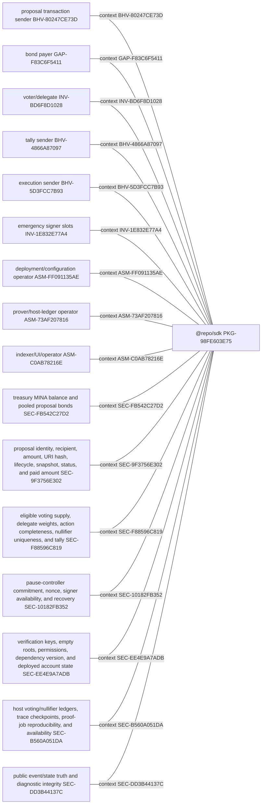

<!-- trace: REQ-998DF345BB, REQ-8BFD766005, REQ-8AC636D92F, REQ-F8D28DBFF5, REQ-9DEF6918CA, REQ-EAE9049742, REQ-529C5F460D, REQ-8671471176, REQ-80815948D4, REQ-74C4827C5B, REQ-E7F4E1ECAD, REQ-1EEFCCC541, REQ-B5E5D97336, REQ-583E087F5C, REQ-B3FFF31BC9, REQ-12FA8872CA, REQ-948F2AA498, REQ-4F1B35FCAA, REQ-740285CD08, REQ-989D12F5D3, REQ-1EEDB7A733, REQ-15F6A20397, REQ-FBC7A8913A, REQ-D100BF5A33, REQ-3E7C685492, REQ-87F314C527, REQ-1E02AF2B34, REQ-230AF0D420, REQ-632DB8C787, REQ-AFB190A0FA, BR-4CC5D3E076, BR-214DBEB50D, BR-BE13F1CD73, BR-B122F86EA0, BR-8EBBA5B636, BR-BEF061F449, BR-3A3926003F, CMP-49180D7623, CMP-834A30297A, CMP-31D3990A1F, CMP-7DB1B15B38, CMP-2890255AE1, CMP-7CC27EFA43, CMP-874E479BA1, CMP-E155326DD2, CMP-B6BB8BE661, CMP-5CAF19BDCD, CMP-0F476A460D, API-1889CE2CD1, API-5E63FB46F2, API-C8E2E47556, API-FD2A8AB499, API-58119694A5, API-98891BC765, API-702CAD321E, API-91F8CB9F4E, API-E777547D48, API-3E2D8706B3, API-FD75421927, API-2E2E88515C, BHV-44F30E27C0, BHV-9B695F3AF8, BHV-761186E23C, BHV-3493B522BB, BHV-C881A8957C, BHV-CFC00681B8, BHV-4EC84F351D, BHV-DAE783F632, BHV-0EED4FB2BD, BHV-6214513169, BHV-CB4CCBE337, BHV-08FB416CF3, BHV-CC8CE33239, BHV-B919E9DAF9, BHV-5CBB373BE5, BHV-8ED0438CC8, BHV-80247CE73D, BHV-C0141CC000, BHV-5095682725, BHV-8E9F5C3ECE, BHV-5D3FCC7B93, BHV-872BB5A5F8, BHV-9E36CCC678, BHV-5B1BD6B386, BHV-4866A87097, BHV-8FA351E512, BHV-10BA9AD71E, BHV-1FC418499A, BHV-8786B10BA6, BHV-DDC0A35072, BHV-0D6A8D760E, BHV-F898CD867A, BHV-B377C55F96, BHV-A302A43C9F, BHV-9E1B7D1BA1, BHV-F2207732B4, BHV-1136BD4D08, BHV-8B6F3A639B, BHV-BAB5A8FD7C, BHV-C01A568AAE, BHV-C4F9C6CEE0, BHV-17E3A4CB8C, BHV-E7ECC5B6FC, BHV-E79288F8DA, BHV-CEE91EC6D9, BHV-3946C60752, BHV-ABB579E6D2, BHV-67153EA362, BHV-141ED40E5D, BHV-50C1B246E0, FLW-802D71B91D, FLW-FB5CAECCAD, FLW-FD2B1F4966, FLW-BEFDEF1197, FLW-E60ABD1745, FLW-9BA4D696D1, FLW-2F560AE009, FLW-5C8E5E0DE3, FLW-A565B35EC6, FLW-21AF7F4E4D, FLW-745B097927, FLW-9D28A6D299, FLW-6394A1B72B, FLW-5AA543472A, FLW-5E24C8B8E4, FLW-A6B92A4E6D, FLW-53B4410963, FLW-7DA083B071, FLW-9BB4E99B75, FLW-BFD5C6D535, CL-7151B97E3F, CL-1A9D54DEF9, CL-B0785D253F, CL-678A5D4790, CL-FB3A4538F7, CL-4556EAE93B, CL-546BFFB196, CL-8EA50D955D, CL-57C7212869, CL-D7B00173DA, CL-60DDDB49C4, CL-8041DB886D, CL-161DE18459, CL-9073A9D34C, CL-C07EA8DC01, CL-EE7157BCAE, CL-CB5F345B9C, CL-AFDB356F05, CL-EBC2FA7E3D, CL-EA98E3F196, CL-EDE8130D74, CL-AB6846116A, CL-D9178E192D, CL-A480D2F867, CL-D767301DCD, CL-72C688955E, CL-B573FAE492, CL-DA4E524A76, CL-06DF3A63C6, CL-45EF6B9C3E, CL-33D744DEBC, CL-944081AB4C, CL-7A13BAC4AA, CL-6989AB70EA, CL-B6F99A74D4, CL-A9E8CDAD73, CL-454A642590, CL-0E9183DED0, CL-F95D8D95BE, CL-2EE46748BE, CL-D0B87D2135, CL-B5C01C5182, CL-1957332AC8, CL-3D67D2EC7C, CL-DA12027943, CL-26D2B7BB15, CL-F1D5CD27F2, CL-E51C01E8DF, CL-820ACD71D0, CL-5C42FDBA1B, CL-9016ED73D7, CL-43DA8C0600, CL-E1DF82E30D, CL-5D1DBDDB89, CL-EED9250B77, CL-0C9F68A22B, CL-2311B61899, CL-0966A605CA, CL-55DB15A0CC, CL-C137D28905, CL-F38468278D, CL-CE68CFDE0A, CL-9DDDB05A64, CL-14F284A0F4, CL-96F95D8CE6, CL-9C7B0C38F5, CL-61EF5A92CB, CL-034C97475E, CL-2F056FA9A9, CL-631833DB43, INV-32F8C9EDB5, INV-E502583790, INV-A59D85B29B, INV-C25A41F372, INV-41F2D0C67B, INV-2ACACDB43D, INV-14E352DEF3, INV-078D70B211, INV-AB69079D81, INV-044B303C73, INV-307C13CAB2, INV-681AEC9EF4, INV-EF3059DB8A, INV-CF85A74EED, INV-075E1EBA53, INV-015B387636, INV-A0200396FA, INV-1E832E77A4, INV-187FD2A7A9, INV-0697F6A5B4, INV-EFEA016A0E, INV-A2C6F00258, INV-DEFE674779, INV-222CED01FB, INV-F79F5B8C65, INV-159AD1A04E, INV-BD6F8D1028, INV-DAA7454111, INV-108FEC74C4, INV-2A14CD3045, INV-D61CCCD760, INV-73B643FAB3, INV-7E1C6FB6BD, INV-D6ADE4E9DA, INV-016B52DE5B, INV-5A6C7F3858, INV-EA1AD61C8B, INV-1036638B64, INV-BB400806DE, INV-E1381514EB, INV-24A18B4772, INV-ED032F16C5, INV-BFF99DCF17, IO-DB06E786C6, IO-89BB105E28, IO-F2D67CC91F, IO-D2E9ED5387, IO-FDFB39F445, IO-A2AA3D7612, IO-AF04F2C7E5, IO-1CF641A344, IO-52293E36B5, IO-A50C2C8E31, IO-CA2719CA24, IO-F754025CE7, IO-C49FFCF2D2, IO-69D7AB53EB, IO-6B965A6F40, IO-36024E02E3, IO-FD35DA69B0, IO-4EA1C35B8D, IO-DD1852B56B, IO-C3A08EF697, IO-D653830A9E, IO-1945E257FC, IO-82C055F932, IO-A0335A63F4, IO-140ADF5967, IO-62DAAB413D, IO-2C9ACC139E, IO-E15D49F2A2, IO-1F97CF4E82, IO-4708EC66CE, IO-668F610724, IO-7E445A843C, IO-C71845C9DB, IO-BD428B4BFE, IO-9D3B7CAE85, IO-3236C0037A, IO-5CBBA7540B, IO-FE03A006D4, IO-F795103B44, IO-F2FDEDAAD4, IO-0E47C270AF, IO-DFBE3E4B97, IO-6FC5F32B87, IO-69C74E38D3, IO-088DC1C843, IO-E30D4BDAFB, IO-20DE355EF7, IO-9C80690415, IO-4B9BD5AA91, IO-67C38AAD67, IO-5B7DDF71A2, IO-626345DDF5, IO-B0282188FD, IO-0467289092, IO-E9661CD282, IO-3F0DC7DE94, IO-13802BA54F, IO-EC980A7F95, IO-65764C55DD, IO-DEB6DB3865, IO-623DE360CA, IO-C22A925F5B, IO-E34414723E, IO-A27752072E, IO-9C3461F78B, IO-0E41C22124, IO-B36955C5A4, IO-0AE4C61332, IO-87B5865B4B, IO-8095F5006E, IO-5C4505832E, IO-FEAE73D285, IO-46A1C8D782, IO-D9A49956C7, IO-D7FE8ADEAC, IO-9974229C95, IO-11EBDF4A8A, IO-57798F0171, IO-B5D0C42BBA, IO-E7C5ED1149, IO-E8F865E1FF, IO-60A9270D22, IO-51C319BC65, IO-BD18BAE884, IO-4216D4A05E, IO-DCDD0F8C40, IO-C1EF5A7724, IO-1DBB80C4F3, IO-5A9F3E8AB4, IO-7B2F867805, IO-A0F8C1C59A, IO-51ADBABB02, IO-9F704E650F, IO-0B01C8B840, IO-C65F44E217, IO-CA717F12D5, IO-F1C491BFA4, IO-1437898F9F, IO-33EF11CDC4, IO-2D6BC19E1D, IO-0EA27A7BC9, IO-1AF04848D4, IO-2AF025E2D0, IO-27333FB515, IO-FEFFF405B1, REL-79921BC506, REL-0672037DC6, REL-BCC6E4E5D1, REL-D3821C9762, REL-8D94358D1F, REL-E20DC14C1E, REL-A38D47D128, REL-26FCFBF6F0, REL-5191CF9309, REL-568A442056, REL-589CBF628B, REL-38BF624FF0, REL-63B84007BB, REL-DB7F631FEE, REL-1FB12A6A77, REL-26D4DBC387, REL-3F2BE04199, REL-A99FE10EDC, REL-2B644C02CF, REL-DEA7407543, REL-C7975C3671, REL-B4EBED13D8, REL-EC7623BEA0, REL-E527B51106, REL-00EBA2ADAB, REL-A3B3E26666, REL-90D77C3467, REL-276593D308, REL-6EA11DB500, REL-A410753B86, REL-6C91733B3B, REL-40B58A67DE, REL-A6AE82B9B5, REL-F0B89E51EA, REL-299D396767, REL-2E6A97C4F4, REL-168EF28932, REL-5B79062338, REL-78C89A1167, REL-5B59D6E729, REL-E5F8590514, REL-F7662AD13A, REL-9F3429D10A, REL-C72118BE10, REL-08A70D7B33, REL-CE32C719DB, REL-DD43BE2BCF, REL-B259F3702C, REL-B26C9DEED0, REL-9FD39CA0BF, REL-E78B1A4B91, REL-1D6D923385, REL-B6B58FC464, REL-18168F74F0, REL-091EC29FB8, REL-7EFB214FA7, REL-CD42F66A0B, REL-6685F92AB7, REL-F5500906DF, REL-0A93E6EC1A, REL-4B6DE7971E, REL-A2F41756C4, REL-D21BD33920, REL-50D332175F, REL-B1A7D393B9, REL-F1C0CEA10E, REL-489BD1D399, REL-BFD88656B6, REL-172D3D004C, REL-F2F467DE44, REL-D37A248DDE, REL-23CCDE8537, REL-BEB602A473, REL-336C0CBD6F, REL-C23B183670, REL-5D19ED4CA6, REL-F0676059EC, REL-E8C18D1D66, REL-BEA98FD671, REL-DCB3F7885C, REL-2B8B758DBD, REL-00F1D87439, REL-EC464B39A2, REL-5802D63B62, REL-DEAD37FEA7, REL-3CED302334, REL-0E60F21EB7, REL-4BF305E289, REL-C3A3BD30D1, REL-9DD700D149, REL-52D00868F0, REL-4237EF6012, REL-DEB2AB770C, REL-D5F524F3C8, REL-A7E0080416, REL-4810C50C7E, REL-188319D340, REL-8723F51AAF, REL-B9BE0F0531, REL-9320DFA9E7, REL-8F340CD1A7, REL-00AEF1536B, REL-EA36BC48D2, REL-86B5C33BDA, REL-8F24F6DAF1, REL-1089110191, REL-A5F59855A3, REL-4F545BA3FC, REL-E47D90B32A, REL-75A476CA07, REL-CE969D1CD9, REL-E202BF783A, REL-4E2DBDEEAD, REL-83D83BBB4E, REL-44D59128AF, REL-5D9A09A125, REL-41284327B7, REL-3664E9D6F9, REL-6B57F8E5A0, REL-31E87AE8C0, REL-CE966AA43A, REL-7C3831D8EC, REL-DA430F1EDD, REL-C5386D41BC, REL-96992E7E50, REL-D6AFDBBC16, REL-1884583AD7, REL-4D9D9DF877, REL-03AA6118C2, REL-E3A8EF7E65, REL-5DA946B3A1, REL-296CAFE207, REL-5EDF6F2962, REL-ADD56A64B3, REL-67A94DDB19, REL-70D1CDE363, REL-FA211B3844, REL-C73428091B, REL-022A0995FF, REL-9F87928AEA, REL-5BAB584F4B, REL-3CDDF609DA, REL-6AE927936D, REL-E1F0545D1D, REL-7C92E212B4, REL-346BB31D1A, REL-14E18DFB1F, REL-0908B0F4AD, REL-A9809109C5, REL-04F149788B, REL-02B5E35EEA, REL-DD21A8E7A9, REL-EC2F02C65F, REL-37CDC651DC, REL-5F2D985D2E, REL-F82E54D4F3, REL-549A32EEBD, TST-ED3BD4CF2F, TST-5FC61A24DA, TST-D1863E1F8D, TST-318386F25F, TST-5A6CA56CD8, TST-A696D485D6, TST-6530589740, TST-A9E4F4D3BC, FND-CA0F83CE86, FND-37BEE2B1BA, FND-7264C0E61E, FND-8C3BA008B7, FND-1897280316, FND-19EC441E53, FND-961BD4A980, FND-67861A5343, FND-CD3FC08B49, FND-1979AEB628, FND-ECA97458D5, FND-A5A4858953, FND-7BE7D38B6B, FND-5F15694229, FND-1B33097A18, FND-F3C6E62E0B, FND-BF3449506D, FND-7D495DBE3F, FND-30B94DCCE0, FND-3B35F91A1C, FND-756A14D862, FND-E5DB7A78F8, FND-1FBF087284, FND-C0656D649D, FND-8467BE9FD1, FND-3471621CD6, FND-9AA5203528, FND-8DB62F78C9, FND-D0ABA9650D, FND-D889112D27, FND-077D28F305, FND-4234CF9EC6, FND-88B3C09521, FND-8B2DE6F23F, FND-E393B29703, FND-B5948FE3CF, FND-4B4F5D76C9, FND-BBC3A2316C, FND-E683792BE2, FND-BFFEA51091, FND-1D115F22E4, FND-D0C94E0DC6, FND-10A2C953A0, FND-996A8C6D4E, FND-EE80C71EE3, FND-23916993D0, FND-4C6DF9502F, FND-2237382FBA, FND-2184025222, SEC-FB542C27D2, SEC-EE4E9A7ADB, SEC-10182FB352, SEC-B560A051DA, SEC-BC2C476AE2, SEC-042FF4BC76, SEC-DD3B44137C, SEC-E0D95AF002, SEC-9F3756E302, SEC-F88596C819, THR-92F9C4D82A, THR-56AA87E621, THR-C66F2EDB38, THR-77C87EDE62, THR-622BA37FCF, THR-902C4A0F9F, THR-0EC3832BA7, THR-F283B3AF7E, THR-B041D07C7D, THR-5D2535B0B5, THR-0DEBF32E0A, THR-A943E3380A, THR-647A188D6B, THR-CD2BC0B163, THR-B55C2C8D2F, THR-5F94AE7496, THR-01539B0FF5, ASM-3B12C3E849, ASM-C093AE5452, ASM-031E77BE7F, ASM-79662ECECE, ASM-B2699C5369, ASM-E6AE27B10D, ASM-E0E1752AF7, ASM-557C7137A0, ASM-0E591EC647, ASM-82EB259917, ASM-503E6DE8AD, ASM-39FFFFFD50, ASM-B549EC8751, ASM-53F278775C, ASM-EF2D37A6EF, ASM-912B3DBDF6, ASM-FF091135AE, ASM-D691B96D3B, ASM-64F6936A94, ASM-73AF207816, ASM-A4087EF988, ASM-C0AB78216E, ASM-F556007192, ASM-35D9BB50D0, ASM-03D9CA273D, ASM-4B596D13E3, ASM-0DCB6712DD, ASM-BD7E733FE5, GAP-F47532E2A5, GAP-9398E85581, GAP-F035E24714, GAP-4DE9FCF9CE, GAP-817200738F, GAP-B798CE8DB1, GAP-7BAF881BED, GAP-EF32A38D1C, GAP-2CA978704D, GAP-BB80E3EB16, GAP-96C24B88BE, GAP-50DC9AE203, GAP-ABC383D9C1, GAP-935AA6FD0D, GAP-0B47B1BC29, GAP-48D1CB3548, GAP-5EB38DFDA6, GAP-721B65BE75, GAP-B9423A0E57, GAP-BCB6F29C25, GAP-4B6AF1A2C6, GAP-8C60DBC5D8, GAP-B1C8C1A4E1, GAP-003C868089, GAP-9CA1247303, GAP-E291D5E72A, GAP-212C9A0653, GAP-9D0D23D527, GAP-F83C6F5411, GAP-52A3FE4758, GAP-22CD8BD355, GAP-2124E32D06, GAP-ADD703D733, GAP-1DC17F1884, GAP-A25D114C6F, GAP-8826CA0D4C, GAP-FE43BADC05, UNR-2C4BA211D7, UNR-D007DAF961, UNR-3C529E3B2C, UNR-15F1A8EB0E, UNR-C23B2D9729, UNR-F951787FC2, UNR-1733743332, UNR-9EEFA83E06, UNR-743184E14A, UNR-D5F28B1A0D, UNR-0B3E825B88, UNR-BA7E7021CF, UNR-29788D0D91, UNR-C42A921AD9, UNR-20BC6033C1, UNR-3694303308, UNR-13C729A54A, UNR-6384846777, UNR-72174E5C45, ZKP-EFB3E28391, ZKP-5DF7D24003, ZKP-DF018A9714, ZKP-66153C8CB1, ZKP-547C93E79B, ZKP-BA11C90A9F -->
# Comprehensive Static Specification

<!-- trace: REQ-998DF345BB, REQ-8BFD766005, REQ-8AC636D92F, REQ-F8D28DBFF5, REQ-9DEF6918CA, REQ-EAE9049742, REQ-529C5F460D, REQ-8671471176, REQ-80815948D4, REQ-74C4827C5B, REQ-E7F4E1ECAD, REQ-1EEFCCC541, REQ-B5E5D97336, REQ-583E087F5C, REQ-B3FFF31BC9, REQ-12FA8872CA, REQ-948F2AA498, REQ-4F1B35FCAA, REQ-740285CD08, REQ-989D12F5D3, REQ-1EEDB7A733, REQ-15F6A20397, REQ-FBC7A8913A, REQ-D100BF5A33, REQ-3E7C685492, REQ-87F314C527, REQ-1E02AF2B34, REQ-230AF0D420, REQ-632DB8C787, REQ-AFB190A0FA, BR-4CC5D3E076, BR-214DBEB50D, BR-BE13F1CD73, BR-B122F86EA0, BR-8EBBA5B636, BR-BEF061F449, BR-3A3926003F, CMP-49180D7623, CMP-834A30297A, CMP-31D3990A1F, CMP-7DB1B15B38, CMP-2890255AE1, CMP-7CC27EFA43, CMP-874E479BA1, CMP-E155326DD2, CMP-B6BB8BE661, CMP-5CAF19BDCD, CMP-0F476A460D, API-1889CE2CD1, API-5E63FB46F2, API-C8E2E47556, API-FD2A8AB499, API-58119694A5, API-98891BC765, API-702CAD321E, API-91F8CB9F4E, API-E777547D48, API-3E2D8706B3, API-FD75421927, API-2E2E88515C, BHV-44F30E27C0, BHV-9B695F3AF8, BHV-761186E23C, BHV-3493B522BB, BHV-C881A8957C, BHV-CFC00681B8, BHV-4EC84F351D, BHV-DAE783F632, BHV-0EED4FB2BD, BHV-6214513169, BHV-CB4CCBE337, BHV-08FB416CF3, BHV-CC8CE33239, BHV-B919E9DAF9, BHV-5CBB373BE5, BHV-8ED0438CC8, BHV-80247CE73D, BHV-C0141CC000, BHV-5095682725, BHV-8E9F5C3ECE, BHV-5D3FCC7B93, BHV-872BB5A5F8, BHV-9E36CCC678, BHV-5B1BD6B386, BHV-4866A87097, BHV-8FA351E512, BHV-10BA9AD71E, BHV-1FC418499A, BHV-8786B10BA6, BHV-DDC0A35072, BHV-0D6A8D760E, BHV-F898CD867A, BHV-B377C55F96, BHV-A302A43C9F, BHV-9E1B7D1BA1, BHV-F2207732B4, BHV-1136BD4D08, BHV-8B6F3A639B, BHV-BAB5A8FD7C, BHV-C01A568AAE, BHV-C4F9C6CEE0, BHV-17E3A4CB8C, BHV-E7ECC5B6FC, BHV-E79288F8DA, BHV-CEE91EC6D9, BHV-3946C60752, BHV-ABB579E6D2, BHV-67153EA362, BHV-141ED40E5D, BHV-50C1B246E0, FLW-802D71B91D, FLW-FB5CAECCAD, FLW-FD2B1F4966, FLW-BEFDEF1197, FLW-E60ABD1745, FLW-9BA4D696D1, FLW-2F560AE009, FLW-5C8E5E0DE3, FLW-A565B35EC6, FLW-21AF7F4E4D, FLW-745B097927, FLW-9D28A6D299, FLW-6394A1B72B, FLW-5AA543472A, FLW-5E24C8B8E4, FLW-A6B92A4E6D, FLW-53B4410963, FLW-7DA083B071, FLW-9BB4E99B75, FLW-BFD5C6D535, CL-7151B97E3F, CL-1A9D54DEF9, CL-B0785D253F, CL-678A5D4790, CL-FB3A4538F7, CL-4556EAE93B, CL-546BFFB196, CL-8EA50D955D, CL-57C7212869, CL-D7B00173DA, CL-60DDDB49C4, CL-8041DB886D, CL-161DE18459, CL-9073A9D34C, CL-C07EA8DC01, CL-EE7157BCAE, CL-CB5F345B9C, CL-AFDB356F05, CL-EBC2FA7E3D, CL-EA98E3F196, CL-EDE8130D74, CL-AB6846116A, CL-D9178E192D, CL-A480D2F867, CL-D767301DCD, CL-72C688955E, CL-B573FAE492, CL-DA4E524A76, CL-06DF3A63C6, CL-45EF6B9C3E, CL-33D744DEBC, CL-944081AB4C, CL-7A13BAC4AA, CL-6989AB70EA, CL-B6F99A74D4, CL-A9E8CDAD73, CL-454A642590, CL-0E9183DED0, CL-F95D8D95BE, CL-2EE46748BE, CL-D0B87D2135, CL-B5C01C5182, CL-1957332AC8, CL-3D67D2EC7C, CL-DA12027943, CL-26D2B7BB15, CL-F1D5CD27F2, CL-E51C01E8DF, CL-820ACD71D0, CL-5C42FDBA1B, CL-9016ED73D7, CL-43DA8C0600, CL-E1DF82E30D, CL-5D1DBDDB89, CL-EED9250B77, CL-0C9F68A22B, CL-2311B61899, CL-0966A605CA, CL-55DB15A0CC, CL-C137D28905, CL-F38468278D, CL-CE68CFDE0A, CL-9DDDB05A64, CL-14F284A0F4, CL-96F95D8CE6, CL-9C7B0C38F5, CL-61EF5A92CB, CL-034C97475E, CL-2F056FA9A9, CL-631833DB43, INV-32F8C9EDB5, INV-E502583790, INV-A59D85B29B, INV-C25A41F372, INV-41F2D0C67B, INV-2ACACDB43D, INV-14E352DEF3, INV-078D70B211, INV-AB69079D81, INV-044B303C73, INV-307C13CAB2, INV-681AEC9EF4, INV-EF3059DB8A, INV-CF85A74EED, INV-075E1EBA53, INV-015B387636, INV-A0200396FA, INV-1E832E77A4, INV-187FD2A7A9, INV-0697F6A5B4, INV-EFEA016A0E, INV-A2C6F00258, INV-DEFE674779, INV-222CED01FB, INV-F79F5B8C65, INV-159AD1A04E, INV-BD6F8D1028, INV-DAA7454111, INV-108FEC74C4, INV-2A14CD3045, INV-D61CCCD760, INV-73B643FAB3, INV-7E1C6FB6BD, INV-D6ADE4E9DA, INV-016B52DE5B, INV-5A6C7F3858, INV-EA1AD61C8B, INV-1036638B64, INV-BB400806DE, INV-E1381514EB, INV-24A18B4772, INV-ED032F16C5, INV-BFF99DCF17, IO-DB06E786C6, IO-89BB105E28, IO-F2D67CC91F, IO-D2E9ED5387, IO-FDFB39F445, IO-A2AA3D7612, IO-AF04F2C7E5, IO-1CF641A344, IO-52293E36B5, IO-A50C2C8E31, IO-CA2719CA24, IO-F754025CE7, IO-C49FFCF2D2, IO-69D7AB53EB, IO-6B965A6F40, IO-36024E02E3, IO-FD35DA69B0, IO-4EA1C35B8D, IO-DD1852B56B, IO-C3A08EF697, IO-D653830A9E, IO-1945E257FC, IO-82C055F932, IO-A0335A63F4, IO-140ADF5967, IO-62DAAB413D, IO-2C9ACC139E, IO-E15D49F2A2, IO-1F97CF4E82, IO-4708EC66CE, IO-668F610724, IO-7E445A843C, IO-C71845C9DB, IO-BD428B4BFE, IO-9D3B7CAE85, IO-3236C0037A, IO-5CBBA7540B, IO-FE03A006D4, IO-F795103B44, IO-F2FDEDAAD4, IO-0E47C270AF, IO-DFBE3E4B97, IO-6FC5F32B87, IO-69C74E38D3, IO-088DC1C843, IO-E30D4BDAFB, IO-20DE355EF7, IO-9C80690415, IO-4B9BD5AA91, IO-67C38AAD67, IO-5B7DDF71A2, IO-626345DDF5, IO-B0282188FD, IO-0467289092, IO-E9661CD282, IO-3F0DC7DE94, IO-13802BA54F, IO-EC980A7F95, IO-65764C55DD, IO-DEB6DB3865, IO-623DE360CA, IO-C22A925F5B, IO-E34414723E, IO-A27752072E, IO-9C3461F78B, IO-0E41C22124, IO-B36955C5A4, IO-0AE4C61332, IO-87B5865B4B, IO-8095F5006E, IO-5C4505832E, IO-FEAE73D285, IO-46A1C8D782, IO-D9A49956C7, IO-D7FE8ADEAC, IO-9974229C95, IO-11EBDF4A8A, IO-57798F0171, IO-B5D0C42BBA, IO-E7C5ED1149, IO-E8F865E1FF, IO-60A9270D22, IO-51C319BC65, IO-BD18BAE884, IO-4216D4A05E, IO-DCDD0F8C40, IO-C1EF5A7724, IO-1DBB80C4F3, IO-5A9F3E8AB4, IO-7B2F867805, IO-A0F8C1C59A, IO-51ADBABB02, IO-9F704E650F, IO-0B01C8B840, IO-C65F44E217, IO-CA717F12D5, IO-F1C491BFA4, IO-1437898F9F, IO-33EF11CDC4, IO-2D6BC19E1D, IO-0EA27A7BC9, IO-1AF04848D4, IO-2AF025E2D0, IO-27333FB515, IO-FEFFF405B1, REL-79921BC506, REL-0672037DC6, REL-BCC6E4E5D1, REL-D3821C9762, REL-8D94358D1F, REL-E20DC14C1E, REL-A38D47D128, REL-26FCFBF6F0, REL-5191CF9309, REL-568A442056, REL-589CBF628B, REL-38BF624FF0, REL-63B84007BB, REL-DB7F631FEE, REL-1FB12A6A77, REL-26D4DBC387, REL-3F2BE04199, REL-A99FE10EDC, REL-2B644C02CF, REL-DEA7407543, REL-C7975C3671, REL-B4EBED13D8, REL-EC7623BEA0, REL-E527B51106, REL-00EBA2ADAB, REL-A3B3E26666, REL-90D77C3467, REL-276593D308, REL-6EA11DB500, REL-A410753B86, REL-6C91733B3B, REL-40B58A67DE, REL-A6AE82B9B5, REL-F0B89E51EA, REL-299D396767, REL-2E6A97C4F4, REL-168EF28932, REL-5B79062338, REL-78C89A1167, REL-5B59D6E729, REL-E5F8590514, REL-F7662AD13A, REL-9F3429D10A, REL-C72118BE10, REL-08A70D7B33, REL-CE32C719DB, REL-DD43BE2BCF, REL-B259F3702C, REL-B26C9DEED0, REL-9FD39CA0BF, REL-E78B1A4B91, REL-1D6D923385, REL-B6B58FC464, REL-18168F74F0, REL-091EC29FB8, REL-7EFB214FA7, REL-CD42F66A0B, REL-6685F92AB7, REL-F5500906DF, REL-0A93E6EC1A, REL-4B6DE7971E, REL-A2F41756C4, REL-D21BD33920, REL-50D332175F, REL-B1A7D393B9, REL-F1C0CEA10E, REL-489BD1D399, REL-BFD88656B6, REL-172D3D004C, REL-F2F467DE44, REL-D37A248DDE, REL-23CCDE8537, REL-BEB602A473, REL-336C0CBD6F, REL-C23B183670, REL-5D19ED4CA6, REL-F0676059EC, REL-E8C18D1D66, REL-BEA98FD671, REL-DCB3F7885C, REL-2B8B758DBD, REL-00F1D87439, REL-EC464B39A2, REL-5802D63B62, REL-DEAD37FEA7, REL-3CED302334, REL-0E60F21EB7, REL-4BF305E289, REL-C3A3BD30D1, REL-9DD700D149, REL-52D00868F0, REL-4237EF6012, REL-DEB2AB770C, REL-D5F524F3C8, REL-A7E0080416, REL-4810C50C7E, REL-188319D340, REL-8723F51AAF, REL-B9BE0F0531, REL-9320DFA9E7, REL-8F340CD1A7, REL-00AEF1536B, REL-EA36BC48D2, REL-86B5C33BDA, REL-8F24F6DAF1, REL-1089110191, REL-A5F59855A3, REL-4F545BA3FC, REL-E47D90B32A, REL-75A476CA07, REL-CE969D1CD9, REL-E202BF783A, REL-4E2DBDEEAD, REL-83D83BBB4E, REL-44D59128AF, REL-5D9A09A125, REL-41284327B7, REL-3664E9D6F9, REL-6B57F8E5A0, REL-31E87AE8C0, REL-CE966AA43A, REL-7C3831D8EC, REL-DA430F1EDD, REL-C5386D41BC, REL-96992E7E50, REL-D6AFDBBC16, REL-1884583AD7, REL-4D9D9DF877, REL-03AA6118C2, REL-E3A8EF7E65, REL-5DA946B3A1, REL-296CAFE207, REL-5EDF6F2962, REL-ADD56A64B3, REL-67A94DDB19, REL-70D1CDE363, REL-FA211B3844, REL-C73428091B, REL-022A0995FF, REL-9F87928AEA, REL-5BAB584F4B, REL-3CDDF609DA, REL-6AE927936D, REL-E1F0545D1D, REL-7C92E212B4, REL-346BB31D1A, REL-14E18DFB1F, REL-0908B0F4AD, REL-A9809109C5, REL-04F149788B, REL-02B5E35EEA, REL-DD21A8E7A9, REL-EC2F02C65F, REL-37CDC651DC, REL-5F2D985D2E, REL-F82E54D4F3, REL-549A32EEBD, TST-ED3BD4CF2F, TST-5FC61A24DA, TST-D1863E1F8D, TST-318386F25F, TST-5A6CA56CD8, TST-A696D485D6, TST-6530589740, TST-A9E4F4D3BC, FND-CA0F83CE86, FND-37BEE2B1BA, FND-7264C0E61E, FND-8C3BA008B7, FND-1897280316, FND-19EC441E53, FND-961BD4A980, FND-67861A5343, FND-CD3FC08B49, FND-1979AEB628, FND-ECA97458D5, FND-A5A4858953, FND-7BE7D38B6B, FND-5F15694229, FND-1B33097A18, FND-F3C6E62E0B, FND-BF3449506D, FND-7D495DBE3F, FND-30B94DCCE0, FND-3B35F91A1C, FND-756A14D862, FND-E5DB7A78F8, FND-1FBF087284, FND-C0656D649D, FND-8467BE9FD1, FND-3471621CD6, FND-9AA5203528, FND-8DB62F78C9, FND-D0ABA9650D, FND-D889112D27, FND-077D28F305, FND-4234CF9EC6, FND-88B3C09521, FND-8B2DE6F23F, FND-E393B29703, FND-B5948FE3CF, FND-4B4F5D76C9, FND-BBC3A2316C, FND-E683792BE2, FND-BFFEA51091, FND-1D115F22E4, FND-D0C94E0DC6, FND-10A2C953A0, FND-996A8C6D4E, FND-EE80C71EE3, FND-23916993D0, FND-4C6DF9502F, FND-2237382FBA, FND-2184025222, SEC-FB542C27D2, SEC-EE4E9A7ADB, SEC-10182FB352, SEC-B560A051DA, SEC-BC2C476AE2, SEC-042FF4BC76, SEC-DD3B44137C, SEC-E0D95AF002, SEC-9F3756E302, SEC-F88596C819, THR-92F9C4D82A, THR-56AA87E621, THR-C66F2EDB38, THR-77C87EDE62, THR-622BA37FCF, THR-902C4A0F9F, THR-0EC3832BA7, THR-F283B3AF7E, THR-B041D07C7D, THR-5D2535B0B5, THR-0DEBF32E0A, THR-A943E3380A, THR-647A188D6B, THR-CD2BC0B163, THR-B55C2C8D2F, THR-5F94AE7496, THR-01539B0FF5, ASM-3B12C3E849, ASM-C093AE5452, ASM-031E77BE7F, ASM-79662ECECE, ASM-B2699C5369, ASM-E6AE27B10D, ASM-E0E1752AF7, ASM-557C7137A0, ASM-0E591EC647, ASM-82EB259917, ASM-503E6DE8AD, ASM-39FFFFFD50, ASM-B549EC8751, ASM-53F278775C, ASM-EF2D37A6EF, ASM-912B3DBDF6, ASM-FF091135AE, ASM-D691B96D3B, ASM-64F6936A94, ASM-73AF207816, ASM-A4087EF988, ASM-C0AB78216E, ASM-F556007192, ASM-35D9BB50D0, ASM-03D9CA273D, ASM-4B596D13E3, ASM-0DCB6712DD, ASM-BD7E733FE5, GAP-F47532E2A5, GAP-9398E85581, GAP-F035E24714, GAP-4DE9FCF9CE, GAP-817200738F, GAP-B798CE8DB1, GAP-7BAF881BED, GAP-EF32A38D1C, GAP-2CA978704D, GAP-BB80E3EB16, GAP-96C24B88BE, GAP-50DC9AE203, GAP-ABC383D9C1, GAP-935AA6FD0D, GAP-0B47B1BC29, GAP-48D1CB3548, GAP-5EB38DFDA6, GAP-721B65BE75, GAP-B9423A0E57, GAP-BCB6F29C25, GAP-4B6AF1A2C6, GAP-8C60DBC5D8, GAP-B1C8C1A4E1, GAP-003C868089, GAP-9CA1247303, GAP-E291D5E72A, GAP-212C9A0653, GAP-9D0D23D527, GAP-F83C6F5411, GAP-52A3FE4758, GAP-22CD8BD355, GAP-2124E32D06, GAP-ADD703D733, GAP-1DC17F1884, GAP-A25D114C6F, GAP-8826CA0D4C, GAP-FE43BADC05, UNR-2C4BA211D7, UNR-D007DAF961, UNR-3C529E3B2C, UNR-15F1A8EB0E, UNR-C23B2D9729, UNR-F951787FC2, UNR-1733743332, UNR-9EEFA83E06, UNR-743184E14A, UNR-D5F28B1A0D, UNR-0B3E825B88, UNR-BA7E7021CF, UNR-29788D0D91, UNR-C42A921AD9, UNR-20BC6033C1, UNR-3694303308, UNR-13C729A54A, UNR-6384846777, UNR-72174E5C45, ZKP-EFB3E28391, ZKP-5DF7D24003, ZKP-DF018A9714, ZKP-66153C8CB1, ZKP-547C93E79B, ZKP-BA11C90A9F -->
This file indexes all 679 current semantic records. The YAML model remains authoritative for full fields, assertions, evidence, and superseded history.

<!-- trace: none -->
## Scope
| Mode | Include | Exclude | Closure | Revision | Scope hash |
| --- | --- | --- | --- | --- | --- |
| scoped | packages/sdk/src/provable/** | None recorded. | bounded | 1e27b1aea88f5ea2764db96e4b337b24fe6dbeb3 | f40d76b91ec3cd8805ecdc7bebba8d43b8f317842639a7799738c37569119ab1 |

<!-- trace: CMP-E155326DD2, CMP-5CAF19BDCD, BHV-5095682725, BHV-C01A568AAE, BHV-141ED40E5D, INV-222CED01FB, THR-5F94AE7496, INV-CF85A74EED, GAP-F83C6F5411 -->
## Glossary
| Term | Meaning or class | Trace |
| --- | --- | --- |
| Treasury Owner | IMPLEMENTED_STATIC | CMP-E155326DD2 |
| Treasury Proposal | IMPLEMENTED_STATIC | CMP-5CAF19BDCD |
| Lifecycle | IMPLEMENTED_STATIC | BHV-5095682725 |
| Voting ledger | IMPLEMENTED_STATIC | BHV-C01A568AAE |
| Nullifier ledger | IMPLEMENTED_STATIC | BHV-141ED40E5D |
| Action-state history | IMPLEMENTED_STATIC | INV-222CED01FB |
| Host effect | EXTERNAL_STANDARD | THR-5F94AE7496 |
| Bond | IMPLEMENTED_STATIC | INV-CF85A74EED, GAP-F83C6F5411 |

<!-- trace: SRC-9BF0E32BE7, SRC-45E1BC61FF, SRC-3828A66960, SRC-F2B7738CBE, SRC-C1BC86B768, SRC-04E6AD40FC, SRC-DA6D1A8620, SRC-94E5F4EED8, SRC-58D63B5BBC, SRC-DC00324323, SRC-56925144B3, SRC-4C7356FD2E, SRC-EC4689A9AB, SRC-5538E0F5FD, SRC-DDE1ECE701, SRC-38B9E1E7F7, SRC-6CB5D699BA, SRC-65269DAE97, SRC-0D73B2B857, SRC-F715F80B03, SRC-05A9B464F2, SRC-DF069048A5, SRC-E877A2A261, SRC-9054CBEF0C, SRC-7F5A9C36BC, SRC-68B94B75EF, SRC-F22A9269B6, SRC-F23C9BD13F, SRC-AA657CB6E6, SRC-8914030316, SRC-A79CC74BB5, SRC-112DCFB4F9, SRC-5603A63D46, SRC-2850B5373B, SRC-412C147142, SRC-A71B08F9A1, SRC-7B0FE5A1B4, SRC-1CA600641B, SRC-080F2D7050, SRC-10C7E429B1, SRC-CA806E1097, SRC-0573DF638C, SRC-75A56FCCF2, SRC-C2BE9449DA, SRC-0F80A1A6A6, SRC-87551E689A, SRC-351B6C703D, SRC-688DA8E143, SRC-4841EF8C1F, SRC-12BDF4F609, SRC-30817C480C, SRC-6AFE4B0C96, SRC-AE207F44F6, SRC-D7A7455C04, SRC-DCF3E95D83, SRC-E1AE28F131, SRC-492377CBA9, SRC-008F80D01D, SRC-F19A19448E, SRC-51A1A1915D, SRC-7AC4F27851, SRC-B3817BB7DA, SRC-29A70B91E1, SRC-FA5A1743BB, SRC-465E46FE9F, SRC-4DEDC3563D, SRC-EA498F083F, SRC-CD18923C4E, SRC-A61270D4E0, SRC-949BB849C3, SRC-D4A738CF5D, SRC-126097B13F, SRC-B9EE6175FD, SRC-FEF5013B9A, SRC-EB1EA77DF8, UNR-2C4BA211D7, UNR-D007DAF961, UNR-3C529E3B2C, UNR-15F1A8EB0E, UNR-C23B2D9729, UNR-F951787FC2, UNR-1733743332, UNR-9EEFA83E06, UNR-743184E14A, UNR-D5F28B1A0D, UNR-0B3E825B88, UNR-BA7E7021CF, UNR-29788D0D91, UNR-C42A921AD9, UNR-20BC6033C1, UNR-3694303308, UNR-13C729A54A, UNR-6384846777, UNR-72174E5C45 -->
## Coverage
| Area | Count or status |
| --- | --- |
| Current semantic records | 679 |
| Primary files | 20 |
| Source records | 20 |
| Mapped test files | 8 |
| Pass-2 reviewed | 679 |
| Security objectives | 10 |
| Threats | 17 |
| Assumptions | 28 |

<!-- trace: PKG-98FE603E75, BHV-80247CE73D, GAP-F83C6F5411, INV-BD6F8D1028, BHV-4866A87097, BHV-5D3FCC7B93, INV-1E832E77A4, ASM-FF091135AE, ASM-73AF207816, ASM-C0AB78216E, SEC-FB542C27D2, SEC-9F3756E302, SEC-F88596C819, SEC-10182FB352, SEC-EE4E9A7ADB, SEC-B560A051DA, SEC-DD3B44137C -->
## System context

<!-- trace: PKG-98FE603E75, CMP-49180D7623, CMP-834A30297A, CMP-31D3990A1F, CMP-7DB1B15B38, CMP-2890255AE1, CMP-7CC27EFA43, CMP-874E479BA1, CMP-E155326DD2, CMP-B6BB8BE661, CMP-5CAF19BDCD, CMP-0F476A460D -->
## Package and component view

```mermaid
flowchart TB
  P0["@repo/sdk PKG-98FE603E75"]
  C0["Mina account/hash model CMP-49180D7623"]
  P0 -->|"contains CMP-49180D7623"| C0
  C1["Treasury event schemas CMP-834A30297A"]
  P0 -->|"contains CMP-834A30297A"| C1
  C2["Prefixed hashing and action chaining CMP-31D3990A1F"]
  P0 -->|"contains CMP-31D3990A1F"| C2
  C3["Pause-controller multisig messages CMP-7DB1B15B38"]
  P0 -->|"contains CMP-7DB1B15B38"| C3
  C4["Prefixed Merkle trees and witnesses CMP-2890255AE1"]
  P0 -->|"contains CMP-2890255AE1"| C4
  C5["Provable ledger and hashing support CMP-7CC27EFA43"]
  P0 -->|"contains CMP-7CC27EFA43"| C5
  C6["Staking-ledger-to-voting-ledger ZkProgram CMP-874E479BA1"]
  P0 -->|"contains CMP-874E479BA1"| C6
  C7["Treasury Owner smart contract CMP-E155326DD2"]
  P0 -->|"contains CMP-E155326DD2"| C7
  C8["Treasury Pause Controller smart contract CMP-B6BB8BE661"]
  P0 -->|"contains CMP-B6BB8BE661"| C8
  C9["Treasury Proposal smart contract CMP-5CAF19BDCD"]
  P0 -->|"contains CMP-5CAF19BDCD"| C9
  C10["Vote Reducer ZkProgram CMP-0F476A460D"]
  P0 -->|"contains CMP-0F476A460D"| C10
```

<!-- trace: FLW-802D71B91D, FLW-FB5CAECCAD, FLW-FD2B1F4966, FLW-BEFDEF1197, FLW-E60ABD1745, FLW-9BA4D696D1, FLW-2F560AE009, FLW-5C8E5E0DE3, FLW-A565B35EC6, FLW-21AF7F4E4D, FLW-745B097927, FLW-9D28A6D299, FLW-6394A1B72B, FLW-5AA543472A, FLW-5E24C8B8E4, FLW-A6B92A4E6D, FLW-53B4410963, FLW-7DA083B071, FLW-9BB4E99B75, FLW-BFD5C6D535, CMP-49180D7623, CMP-834A30297A, CMP-31D3990A1F, CMP-7DB1B15B38, CMP-2890255AE1, CMP-7CC27EFA43, CMP-874E479BA1, CMP-E155326DD2, CMP-B6BB8BE661, CMP-5CAF19BDCD, CMP-0F476A460D -->
## Principal flow view

```mermaid
flowchart LR
  PC0["Mina account/hash model CMP-49180D7623"]
  PC1["Treasury event schemas CMP-834A30297A"]
  PC2["Prefixed hashing and action chaining CMP-31D3990A1F"]
  PC3["Pause-controller multisig messages CMP-7DB1B15B38"]
  PC4["Prefixed Merkle trees and witnesses CMP-2890255AE1"]
  PC5["Provable ledger and hashing support CMP-7CC27EFA43"]
  PC6["Staking-ledger-to-voting-ledger ZkProgram CMP-874E479BA1"]
  PC7["Treasury Owner smart contract CMP-E155326DD2"]
  PC8["Treasury Pause Controller smart contract CMP-B6BB8BE661"]
  PC9["Treasury Proposal smart contract CMP-5CAF19BDCD"]
  PC10["Vote Reducer ZkProgram CMP-0F476A460D"]
  PF0["Staking-transformation digest proof statement FLW-802D71B91D"]
  PC6 -->|"owns FLW-802D71B91D"| PF0
  PF1["Owner-side proposal creation FLW-FB5CAECCAD"]
  PC7 -->|"owns FLW-FB5CAECCAD"| PF1
  PF2["Pause-controller command authorization FLW-FD2B1F4966"]
  PC8 -->|"owns FLW-FD2B1F4966"| PF2
  PF3["Proposal-local payout FLW-BEFDEF1197"]
  PC9 -->|"owns FLW-BEFDEF1197"| PF3
  PF4["Proposal-local tally FLW-E60ABD1745"]
  PC9 -->|"owns FLW-E60ABD1745"| PF4
  PF5["Vote-reduction proof statement FLW-9BA4D696D1"]
  PC10 -->|"owns FLW-9BA4D696D1"| PF5
  PF6["Treasury event producer-to-consumer schema FLW-2F560AE009"]
  PC1 -->|"owns FLW-2F560AE009"| PF6
  PF7["Public key to voting/nullifier root FLW-5C8E5E0DE3"]
  PC5 -->|"owns FLW-5C8E5E0DE3"| PF7
  PF8["Mina account to staking-ledger root FLW-A565B35EC6"]
  PC0 -->|"owns FLW-A565B35EC6"| PF8
  PF9["Global pause or unpause command FLW-21AF7F4E4D"]
  PC8 -->|"owns FLW-21AF7F4E4D"| PF9
  PF10["Emergency participant commitment rotation FLW-745B097927"]
  PC8 -->|"owns FLW-745B097927"| PF10
  PF11["Approved partial payout FLW-9D28A6D299"]
  PC7 -->|"owns FLW-9D28A6D299"| PF11
  PF12["Proposal creation and bond custody FLW-6394A1B72B"]
  PC7 -->|"owns FLW-6394A1B72B"| PF12
  PF13["Proposal-specific pause toggle FLW-5AA543472A"]
  PC8 -->|"owns FLW-5AA543472A"| PF13
  PF14["Proof-backed tally finalization FLW-5E24C8B8E4"]
  PC7 -->|"owns FLW-5E24C8B8E4"| PF14
  PF15["Vote authorization and action dispatch FLW-A6B92A4E6D"]
  PC7 -->|"owns FLW-A6B92A4E6D"| PF15
  PF16["Compose staking ranges and prove terminal boundary FLW-53B4410963"]
  PC6 -->|"owns FLW-53B4410963"| PF16
  PF17["Staking-to-voting digest batch FLW-7DA083B071"]
  PC6 -->|"owns FLW-7DA083B071"| PF17
  PF18["Recursive vote-proof aggregation FLW-9BB4E99B75"]
  PC10 -->|"owns FLW-9BB4E99B75"| PF18
  PF19["Vote reduction batch FLW-BFD5C6D535"]
  PC10 -->|"owns FLW-BFD5C6D535"| PF19
```

<!-- trace: BHV-5095682725, INV-A0200396FA -->
## Lifecycle view

<!-- trace: REL-8D94358D1F, IO-1CF641A344, IO-140ADF5967, AST-89436D04DA, EVD-7241D16957, ASM-53F278775C, ASM-73AF207816, ASM-EF2D37A6EF, CMP-5CAF19BDCD, SEC-9F3756E302, SEC-BC2C476AE2, SEC-E0D95AF002, UNR-20BC6033C1, ZKP-0830843A1A, ZKP-37F3DC23FD, REL-E20DC14C1E, ZKP-DF018A9714, AST-D0C06153AF, EVD-69F140A1C8, ASM-4B596D13E3, CMP-7CC27EFA43, CMP-874E479BA1, REL-A38D47D128, ZKP-547C93E79B, AST-9323330F7F, EVD-C40CC7BDB8, CMP-0F476A460D, SEC-F88596C819, THR-01539B0FF5, REL-26FCFBF6F0, AST-1FDFAE9F37, EVD-D79183A876, SRC-4A1F6AB356, SRC-F3FE44D20B, REL-589CBF628B, AST-515F544FC1, EVD-BA6F09A95B, SEC-DD3B44137C, SRC-58ADF841FC, SRC-045B6CA381, REL-63B84007BB, AST-64BD096893, EVD-FA6B741A20, ASM-A4087EF988, CMP-B6BB8BE661, SEC-10182FB352, THR-77C87EDE62, SRC-DF069048A5, REL-1FB12A6A77, AST-32328D4EA9, EVD-5327C5E368, SRC-B0C4273C06, SRC-1FAD2D3160, REL-26D4DBC387, AST-832CCC61F1, EVD-7592298436, REL-2B644C02CF, AST-DE84E4B6D8, EVD-2FDEDC62E5, SEC-B560A051DA, THR-5F94AE7496, THR-C66F2EDB38, SRC-9140D57A6C, SRC-B5BD04FEE3, REL-DEA7407543, AST-A9204E3560, EVD-217A6D8C94, SRC-9EBB65D4B9, REL-C7975C3671, AST-D81457025B, EVD-9C0E8C00C8, SRC-639D488B2F, REL-B4EBED13D8, AST-A477ADD949, EVD-99D123E17D, REL-EC7623BEA0, AST-D06E0E2EF0, EVD-8237C0A803, REL-00EBA2ADAB, AST-1FD88F877F, EVD-7B9A8B77FE, REL-A3B3E26666, AST-6A56FAC38B, EVD-B548ADFA1A, SRC-70F3CC4F23, REL-90D77C3467, AST-CEB4B5DB2A, EVD-3535FA4E52, SRC-C64523D77B, REL-276593D308, AST-C41220FB00, EVD-2BF1613495, REL-6EA11DB500, AST-9A44D656F7, EVD-5EA85AB571, REL-A410753B86, AST-4166440B51, EVD-A981878820, SRC-BA72F0CFB2, REL-6C91733B3B, AST-6264104BA9, EVD-FE36105D52, REL-F0B89E51EA, AST-406CE64588, EVD-C934B61211, REL-299D396767, AST-E075C694F1, EVD-546B43B781, REL-2E6A97C4F4, AST-0FA334BDCF, EVD-4C0532CE7D, SRC-457F3C87C6, REL-168EF28932, AST-43D713EE9A, EVD-0B05CF7A57, SRC-3FC38F9998, REL-78C89A1167, AST-06C970473A, EVD-501B3A11E8, ASM-BD7E733FE5, CMP-E155326DD2, SEC-FB542C27D2, SRC-5ACF00A9FC, REL-5B59D6E729, AST-6AC13AB849, EVD-143F30BAE9, REL-E5F8590514, AST-86394D7F21, EVD-B02FDCA7A9, THR-F283B3AF7E, REL-F7662AD13A, AST-4C2F0B8AFE, EVD-5BF6C08B0C, REL-9F3429D10A, AST-3FFA3EC08D, EVD-328036A7FC, REL-08A70D7B33, AST-ECA7056A8D, EVD-0B119E094A, REL-CE32C719DB, AST-3EC405C96A, EVD-9EF06E485C, REL-DD43BE2BCF, AST-85FF2F32DA, EVD-1C18F16803, REL-B259F3702C, AST-032980F0BE, EVD-C5F60BB8F2, REL-B26C9DEED0, AST-987CC84FDB, EVD-92A18EC931, REL-9FD39CA0BF, AST-622AADBE8E, EVD-AA2243F703, REL-E78B1A4B91, AST-7143D1C85C, EVD-E9416393D5, REL-1D6D923385, AST-4375854C5D, EVD-ED07B38B39, REL-B6B58FC464, AST-983EC50BDC, EVD-B9AD9D302C, SRC-F697D41C4C, REL-091EC29FB8, AST-A5484DA2AF, EVD-1809F2D716, REL-7EFB214FA7, AST-3099E7D607, EVD-EEEC54D2DF, REL-CD42F66A0B, AST-6B4F2BCC5E, EVD-8018A85CDC, REL-F5500906DF, IO-89BB105E28, IO-D2E9ED5387, AST-4158C9ABF6, EVD-74C5612F1A, REL-0A93E6EC1A, IO-DB06E786C6, AST-AC57603198, EVD-77FCCF8764, REL-4B6DE7971E, AST-13EC66A5F3, EVD-01A88DE81D, REL-BEA98FD671, BHV-80247CE73D, BHV-5B1BD6B386, AST-9D2798B4FF, EVD-2CC556DD12, REL-2B8B758DBD, AST-219E0463D2, EVD-3EFA780CA4, REL-00F1D87439, BHV-5D3FCC7B93, BHV-F2207732B4, AST-38DAFC5A42, EVD-D24325B047, REL-EC464B39A2, BHV-4866A87097, BHV-1136BD4D08, AST-F687AEC36B, EVD-F0B6E0FB7E, REL-5802D63B62, AST-540078830F, EVD-EAC5164121, REL-DEAD37FEA7, AST-F6A56EC26C, EVD-4A51346245, REL-0E60F21EB7, BHV-8FA351E512, BHV-10BA9AD71E, AST-DE875F91AD, EVD-BDBAA51FA4, REL-4BF305E289, BHV-8B6F3A639B, AST-C1FF4EB66F, EVD-5E79A4F90E, REL-9DD700D149, BHV-8E9F5C3ECE, BHV-9E1B7D1BA1, AST-8720F60004, EVD-9B9F528292, REL-52D00868F0, BHV-F898CD867A, BHV-DDC0A35072, AST-7E6733A40C, EVD-743D18DD5F, REL-4237EF6012, BHV-0D6A8D760E, AST-5FD690501B, EVD-96A4F56358, REL-A7E0080416, AST-9B4C0AF951, EVD-486D7CAD2C, REL-4810C50C7E, AST-9836611F84, EVD-368185B3B6, REL-188319D340, AST-C3D19901B3, EVD-BDBE008B7F, REL-8723F51AAF, AST-0CD43AB99E, EVD-4AAAFAD8E9, REL-B9BE0F0531, IO-DD1852B56B, IO-A0335A63F4, AST-4BF1892CA3, EVD-AE1EDCE441, REL-9320DFA9E7, IO-C3A08EF697, AST-1EF8F28462, EVD-7DDAF2A961, REL-8F340CD1A7, AST-2C4BFE55A6, EVD-7476F54969, REL-00AEF1536B, ZKP-EFB3E28391, IO-1F97CF4E82, AST-85EC868F18, EVD-3CEBE6B022, REL-EA36BC48D2, ZKP-5DF7D24003, IO-4708EC66CE, CL-43DA8C0600, CL-9016ED73D7, CL-E1DF82E30D, CL-B5C01C5182, CL-3D67D2EC7C, AST-AE12A9B458, ASM-35D9BB50D0, REL-86B5C33BDA, IO-668F610724, AST-77CDB51C4D, REL-8F24F6DAF1, IO-7E445A843C, AST-D4E921995E, REL-1089110191, IO-C71845C9DB, AST-74710B1F1E, REL-A5F59855A3, IO-BD428B4BFE, AST-F71E3823EF, REL-4F545BA3FC, IO-9D3B7CAE85, AST-E6E48797C4, REL-E47D90B32A, IO-3236C0037A, AST-BD7A72EE7F, REL-75A476CA07, IO-5CBBA7540B, AST-C85058B1AC, REL-CE969D1CD9, IO-FE03A006D4, AST-C497CA71CD, REL-E202BF783A, IO-F795103B44, AST-AC88A4EFCC, REL-4E2DBDEEAD, IO-F2FDEDAAD4, CL-26D2B7BB15, CL-DA12027943, AST-1C5400A4A9, REL-83D83BBB4E, IO-0E47C270AF, AST-2129808A12, REL-44D59128AF, IO-DFBE3E4B97, AST-CC802992A7, REL-5D9A09A125, IO-6FC5F32B87, AST-F264AC45FC, REL-41284327B7, ZKP-66153C8CB1, IO-69C74E38D3, CL-5C42FDBA1B, CL-820ACD71D0, CL-E51C01E8DF, AST-EF64B7A104, REL-3664E9D6F9, IO-088DC1C843, AST-DC0E038963, REL-6B57F8E5A0, IO-E30D4BDAFB, AST-F821F23937, REL-31E87AE8C0, IO-20DE355EF7, AST-D8AB71EE2C, REL-CE966AA43A, IO-9C80690415, CL-14F284A0F4, CL-9DDDB05A64, CL-96F95D8CE6, CL-CE68CFDE0A, AST-7E59C8D7DB, REL-7C3831D8EC, IO-4B9BD5AA91, AST-5CAEED6691, REL-DA430F1EDD, IO-67C38AAD67, AST-9E19552881, REL-C5386D41BC, IO-5B7DDF71A2, AST-47DE918315, REL-96992E7E50, ZKP-BA11C90A9F, IO-626345DDF5, CL-2311B61899, CL-2F056FA9A9, CL-9C7B0C38F5, CL-61EF5A92CB, CL-631833DB43, CL-034C97475E, CL-5D1DBDDB89, CL-0966A605CA, AST-46003B9211, REL-D6AFDBBC16, IO-B0282188FD, AST-34C8C97FDF, REL-1884583AD7, IO-0467289092, AST-B648C8BAC4, REL-4D9D9DF877, IO-E9661CD282, AST-E990C1DC66, REL-03AA6118C2, IO-3F0DC7DE94, AST-B58494BCFE, REL-E3A8EF7E65, IO-13802BA54F, AST-C6141A9AB0, REL-5DA946B3A1, IO-EC980A7F95, AST-434359CD07, REL-296CAFE207, IO-65764C55DD, AST-A7F26980D7, REL-5EDF6F2962, IO-DEB6DB3865, AST-A9153DC3E5, REL-ADD56A64B3, IO-623DE360CA, AST-85C1EED2B9, REL-67A94DDB19, IO-C22A925F5B, AST-8CD2B4E01D, REL-70D1CDE363, IO-E34414723E, AST-35393AC0D7, REL-FA211B3844, IO-A27752072E, AST-84F3626CA6, REL-C73428091B, IO-9C3461F78B, AST-C8A036B90F, REL-022A0995FF, IO-0E41C22124, AST-50A2C4DE89, REL-9F87928AEA, IO-B36955C5A4, AST-12DBAF1B4A, REL-5BAB584F4B, IO-0AE4C61332, AST-5CF314714A, REL-3CDDF609DA, IO-87B5865B4B, AST-EFC72DC6AB, REL-6AE927936D, IO-8095F5006E, AST-C48D739FE9, REL-E1F0545D1D, IO-5C4505832E, AST-05F4016BE2, REL-7C92E212B4, IO-FEAE73D285, AST-9A2E465842, REL-346BB31D1A, IO-51C319BC65, IO-33EF11CDC4, EVD-B7C40C0F6F, AST-6689244515, REL-14E18DFB1F, IO-46A1C8D782, IO-B5D0C42BBA, EVD-177476A23F, AST-89B493E3AA, REL-0908B0F4AD, IO-D9A49956C7, EVD-2720E90D33, AST-A73ABFA2B0, REL-A9809109C5, BHV-C4F9C6CEE0, IO-9974229C95, EVD-F7DE049BDC, AST-6E9ED6CE68, REL-04F149788B, IO-57798F0171, AST-45D139BB69, REL-02B5E35EEA, IO-4216D4A05E, AST-50E28BBC6B, REL-DD21A8E7A9, IO-BD18BAE884, IO-E8F865E1FF, AST-F632C88450, REL-EC2F02C65F, BHV-50C1B246E0, IO-7B2F867805, EVD-C7D1DB2A7C, AST-8F502D621B, REL-37CDC651DC, IO-A0F8C1C59A, IO-C1EF5A7724, EVD-D70E747767, AST-F0C33B6FA1, REL-5F2D985D2E, IO-51ADBABB02, AST-9F15F731E7, REL-F82E54D4F3, IO-1437898F9F, AST-88F942893C, REL-549A32EEBD, IO-F1C491BFA4, AST-FF674DC1C0 -->
## Relationship view

```mermaid
flowchart LR
  R0["output.votingLedgerRoot IO-1CF641A344"]
  R1["votingLedgerRoot IO-140ADF5967"]
  R2["Treasury Proposal smart contract CMP-5CAF19BDCD"]
  R3["StakingLedgerToVotingLedger.exhaust statement ZKP-DF018A9714"]
  R4["VoteReducer.merge statement ZKP-547C93E79B"]
  R5["source:component:inventory:account-model:packages/sdk/src/provable/account.ts#file SRC-4A1F6AB356"]
  R6["source:component:inventory:hashing:packages/sdk/src/provable/hashing-helpers.ts#file SRC-F3FE44D20B"]
  R7["source:component:inventory:event-schemas:packages/sdk/src/provable/events/treasury-proposal-events.ts#file SRC-58ADF841FC"]
  R8["source:component:inventory:vote-reducer:packages/sdk/src/provable/contracts/treasury-proposal/vote-reducer.ts#file SRC-045B6CA381"]
  R9["source:component:inventory:pause-multisig:packages/sdk/src/provable/contracts/treasury-pause-controller/multisig-signatures.ts#file SRC-DF069048A5"]
  R10["source:component:inventory:pause-controller:packages/sdk/src/provable/contracts/treasury-pause-controller/treasury-pause-controller.ts#file SRC-B0C4273C06"]
  R11["source:component:inventory:context:packages/sdk/src/logging/logger.ts#file SRC-1FAD2D3160"]
  R12["source:component:inventory:prefixed-merkle:packages/sdk/src/provable/merkle-tree/prefixed-merkle-tree.ts#file SRC-9140D57A6C"]
  R13["source:component:inventory:context:packages/sdk/src/storage/merkle-tree-storage.ts#file SRC-B5BD04FEE3"]
  R14["source:component:inventory:treasury-proposal:packages/sdk/src/provable/contracts/treasury-proposal/treasury-proposal.ts#file SRC-9EBB65D4B9"]
  R15["source:component:inventory:treasury-owner:packages/sdk/src/provable/contracts/treasury-constants.ts#file SRC-639D488B2F"]
  R16["source:component:inventory:context:packages/sdk/src/ledgers/staking-ledger/staking-ledger.ts#file SRC-70F3CC4F23"]
  R17["source:component:inventory:staking-to-voting:packages/sdk/src/provable/staking-ledger-to-voting-ledger.ts#file SRC-C64523D77B"]
  R18["source:component:inventory:context:packages/sdk/src/utils/context-provider.ts#file SRC-BA72F0CFB2"]
  R19["source:component:inventory:staking-to-voting:packages/sdk/src/provable/voting-account.ts#file SRC-457F3C87C6"]
  R20["source:component:inventory:context:packages/sdk/src/ledgers/voting-ledger/voting-ledger.ts#file SRC-3FC38F9998"]
  R21["source:component:inventory:treasury-owner:packages/sdk/src/provable/contracts/treasury-owner.ts#file SRC-5ACF00A9FC"]
  R22["source:component:inventory:context:packages/sdk/src/ledgers/nullifier-ledger/nullifier-ledger.ts#file SRC-F697D41C4C"]
  R23["accounts(0..4) IO-89BB105E28"]
  R24["stakingLedgerRoot IO-D2E9ED5387"]
  R25["host staking witnesses and voting accounts/witnesses/writes IO-DB06E786C6"]
  R26["Staking-ledger-to-voting-ledger ZkProgram CMP-874E479BA1"]
  R27["Create proposal and collect ten-percent bond BHV-80247CE73D"]
  R28["Snapshot current staking epoch ledger BHV-5B1BD6B386"]
  R29["Execute bounded recipient payout BHV-5D3FCC7B93"]
  R30["Enforce approved recipient payout cap BHV-F2207732B4"]
  R31["Verify proofs, bind action history, and tally proposal BHV-4866A87097"]
  R32["Bind proof outputs and finalize proposal tally BHV-1136BD4D08"]
  R33["Authorize and toggle proposal pause status BHV-8FA351E512"]
  R34["Authorize proposal-specific toggle BHV-10BA9AD71E"]
  R35["Toggle shared status between PAUSED and UNKNOWN BHV-8B6F3A639B"]
  R36["Dispatch signed voter action BHV-8E9F5C3ECE"]
  R37["Expose lifecycle and dispatch vote action BHV-9E1B7D1BA1"]
  R38["Bind five witnessed participant slots and require three signatures BHV-F898CD867A"]
  R39["Set global treasury pause state BHV-DDC0A35072"]
  R40["Rotate multisig commitment BHV-0D6A8D760E"]
  R41["Treasury Owner smart contract CMP-E155326DD2"]
  R42["host nullifier value/witness and persistence writes IO-DD1852B56B"]
  R43["fromNullifierRoot IO-A0335A63F4"]
  R44["host voting account and PrefixedMerkleWitness255 IO-C3A08EF697"]
  R45["Vote Reducer ZkProgram CMP-0F476A460D"]
  R46["Pause-controller participant witness binding ZKP-EFB3E28391"]
  R47["Pause-controller private participant witness IO-1F97CF4E82"]
  R48["StakingLedgerToVotingLedger.digest statement ZKP-5DF7D24003"]
  R49["StakingLedgerToVotingLedger.digest exhausted IO-4708EC66CE"]
  R50["StakingLedgerToVotingLedger.digest index IO-668F610724"]
  R51["StakingLedgerToVotingLedger.digest votingLedgerRoot IO-7E445A843C"]
  R52["StakingLedgerToVotingLedger.digest accounts(5) IO-C71845C9DB"]
  R53["StakingLedgerToVotingLedger.digest stakingWitness(iteration) IO-BD428B4BFE"]
  R54["StakingLedgerToVotingLedger.digest votingAccount(iteration).balance IO-9D3B7CAE85"]
  R55["StakingLedgerToVotingLedger.digest votingWitness(iteration) IO-3236C0037A"]
  R56["StakingLedgerToVotingLedger.digest index IO-5CBBA7540B"]
  R57["StakingLedgerToVotingLedger.digest stakingLedgerRoot IO-FE03A006D4"]
  R58["StakingLedgerToVotingLedger.digest votingLedgerRoot IO-F795103B44"]
  R59["StakingLedgerToVotingLedger.exhaust nextEmptyWitness IO-F2FDEDAAD4"]
  R60["StakingLedgerToVotingLedger.exhaust proof IO-0E47C270AF"]
  R61["StakingLedgerToVotingLedger.exhaust exhaustedPublicOutput IO-DFBE3E4B97"]
  R62["StakingLedgerToVotingLedger.exhaust outerPublicInput IO-6FC5F32B87"]
  R63["StakingLedgerToVotingLedger.merge statement ZKP-66153C8CB1"]
  R64["StakingLedgerToVotingLedger.merge proof1 IO-69C74E38D3"]
  R65["StakingLedgerToVotingLedger.merge proof2 IO-088DC1C843"]
  R66["StakingLedgerToVotingLedger.merge mergedPublicOutput IO-E30D4BDAFB"]
  R67["StakingLedgerToVotingLedger.merge outerPublicInput IO-20DE355EF7"]
  R68["VoteReducer.merge proof1 IO-9C80690415"]
  R69["VoteReducer.merge proof2 IO-4B9BD5AA91"]
  R70["VoteReducer.merge mergedPublicOutput IO-67C38AAD67"]
  R71["VoteReducer.merge outerPublicInput IO-5B7DDF71A2"]
  R72["VoteReducer.reduceBatch statement ZKP-BA11C90A9F"]
  R73["VoteReducer.reduceBatch abstain IO-626345DDF5"]
  R74["VoteReducer.reduceBatch actionStateHistory(5).found IO-B0282188FD"]
  R75["VoteReducer.reduceBatch actionStateHistory(5).hash IO-0467289092"]
  R76["VoteReducer.reduceBatch nay IO-E9661CD282"]
  R77["VoteReducer.reduceBatch toActionsHash IO-3F0DC7DE94"]
  R78["VoteReducer.reduceBatch toNullifierRoot IO-13802BA54F"]
  R79["VoteReducer.reduceBatch yay IO-EC980A7F95"]
  R80["VoteReducer.reduceBatch nullifierWitness(iteration) IO-65764C55DD"]
  R81["VoteReducer.reduceBatch priorNullifier(iteration) IO-DEB6DB3865"]
  R82["VoteReducer.reduceBatch voteActions(5).publicKey IO-623DE360CA"]
  R83["VoteReducer.reduceBatch voteActions(5).vote IO-C22A925F5B"]
  R84["VoteReducer.reduceBatch votingAccount(iteration).balance IO-E34414723E"]
  R85["VoteReducer.reduceBatch votingWitness(iteration) IO-A27752072E"]
  R86["VoteReducer.reduceBatch actionStateFive IO-9C3461F78B"]
  R87["VoteReducer.reduceBatch actionStateFour IO-0E41C22124"]
  R88["VoteReducer.reduceBatch actionStateOne IO-B36955C5A4"]
  R89["VoteReducer.reduceBatch actionStateThree IO-0AE4C61332"]
  R90["VoteReducer.reduceBatch actionStateTwo IO-87B5865B4B"]
  R91["VoteReducer.reduceBatch fromActionsHash IO-8095F5006E"]
  R92["VoteReducer.reduceBatch fromNullifierRoot IO-5C4505832E"]
  R93["VoteReducer.reduceBatch votingLedgerRoot IO-FEAE73D285"]
  R94["staking.output.terminalVotingLedgerRoot IO-51C319BC65"]
  R95["vote.reduce.votingLedgerRoot IO-33EF11CDC4"]
  R96["staking.digest.accounts(0..4) IO-46A1C8D782"]
  R97["staking.digest.stakingLedgerRoot IO-B5D0C42BBA"]
  R98["staking.exhaust.nextEmptyWitness36 IO-D9A49956C7"]
  R99["Transform five consecutive staking accounts BHV-C4F9C6CEE0"]
  R100["staking.digest.hostVotingLedgerPersistence IO-9974229C95"]
  R101["staking.digest.stakingMerkleWitness36 IO-57798F0171"]
  R102["staking.digest.votingMerkleWitness255 IO-4216D4A05E"]
  R103["staking.digest.delegateVotingAccount IO-BD18BAE884"]
  R104["staking.digest.startVotingLedgerRoot IO-E8F865E1FF"]
  R105["Reduce a fixed five-action vote batch BHV-50C1B246E0"]
  R106["vote.reduce.hostNullifierPersistence IO-7B2F867805"]
  R107["vote.reduce.nullifierMerkleWitness255 IO-A0F8C1C59A"]
  R108["vote.reduce.fromNullifierRoot IO-C1EF5A7724"]
  R109["vote.reduce.witnessedVoteNullifier IO-51ADBABB02"]
  R110["vote.reduce.votingMerkleWitness255 IO-1437898F9F"]
  R111["vote.reduce.witnessedVotingAccount IO-F1C491BFA4"]
  R0 -->|"BOUND_BY_CONSTRAINT REL-8D94358D1F"| R1
  R2 -->|"VERIFIES REL-E20DC14C1E"| R3
  R2 -->|"VERIFIES REL-A38D47D128"| R4
  R5 -->|"DEPENDS_ON REL-26FCFBF6F0"| R6
  R7 -->|"DEPENDS_ON REL-589CBF628B"| R8
  R9 -->|"DEPENDS_ON REL-63B84007BB"| R6
  R10 -->|"DEPENDS_ON REL-1FB12A6A77"| R11
  R10 -->|"DEPENDS_ON REL-26D4DBC387"| R9
  R12 -->|"DEPENDS_ON REL-2B644C02CF"| R13
  R14 -->|"DEPENDS_ON REL-DEA7407543"| R5
  R14 -->|"DEPENDS_ON REL-C7975C3671"| R15
  R14 -->|"DEPENDS_ON REL-B4EBED13D8"| R6
  R14 -->|"DEPENDS_ON REL-EC7623BEA0"| R11
  R14 -->|"DEPENDS_ON REL-00EBA2ADAB"| R12
  R14 -->|"DEPENDS_ON REL-A3B3E26666"| R16
  R14 -->|"DEPENDS_ON REL-90D77C3467"| R17
  R14 -->|"DEPENDS_ON REL-276593D308"| R8
  R17 -->|"DEPENDS_ON REL-6EA11DB500"| R5
  R17 -->|"DEPENDS_ON REL-A410753B86"| R18
  R17 -->|"DEPENDS_ON REL-6C91733B3B"| R6
  R17 -->|"DEPENDS_ON REL-F0B89E51EA"| R12
  R17 -->|"DEPENDS_ON REL-299D396767"| R16
  R17 -->|"DEPENDS_ON REL-2E6A97C4F4"| R19
  R17 -->|"DEPENDS_ON REL-168EF28932"| R20
  R21 -->|"DEPENDS_ON REL-78C89A1167"| R5
  R21 -->|"DEPENDS_ON REL-5B59D6E729"| R15
  R21 -->|"DEPENDS_ON REL-E5F8590514"| R7
  R21 -->|"DEPENDS_ON REL-F7662AD13A"| R11
  R21 -->|"DEPENDS_ON REL-9F3429D10A"| R9
  R21 -->|"DEPENDS_ON REL-08A70D7B33"| R10
  R21 -->|"DEPENDS_ON REL-CE32C719DB"| R12
  R21 -->|"DEPENDS_ON REL-DD43BE2BCF"| R14
  R21 -->|"DEPENDS_ON REL-B259F3702C"| R17
  R21 -->|"DEPENDS_ON REL-B26C9DEED0"| R8
  R8 -->|"DEPENDS_ON REL-9FD39CA0BF"| R18
  R8 -->|"DEPENDS_ON REL-E78B1A4B91"| R6
  R8 -->|"DEPENDS_ON REL-1D6D923385"| R11
  R8 -->|"DEPENDS_ON REL-B6B58FC464"| R22
  R8 -->|"DEPENDS_ON REL-091EC29FB8"| R12
  R8 -->|"DEPENDS_ON REL-7EFB214FA7"| R19
  R8 -->|"DEPENDS_ON REL-CD42F66A0B"| R20
  R23 -->|"BOUND_BY_CONSTRAINT REL-F5500906DF"| R24
  R25 -->|"BOUND_BY_CONSTRAINT REL-0A93E6EC1A"| R0
  R26 -->|"MAY_FLOW_TO REL-4B6DE7971E"| R25
  R27 -->|"CALLS REL-BEA98FD671"| R28
  R27 -->|"WRITES REL-2B8B758DBD"| R2
  R29 -->|"CALLS REL-00F1D87439"| R30
  R31 -->|"CALLS REL-EC464B39A2"| R32
  R31 -->|"VERIFIES REL-5802D63B62"| R3
  R31 -->|"VERIFIES REL-DEAD37FEA7"| R4
  R33 -->|"CALLS REL-0E60F21EB7"| R34
  R33 -->|"CALLS REL-4BF305E289"| R35
  R36 -->|"CALLS REL-9DD700D149"| R37
  R38 -->|"AUTHORIZES REL-52D00868F0"| R39
  R38 -->|"AUTHORIZES REL-4237EF6012"| R40
  R32 -->|"DEPENDS_ON REL-A7E0080416"| R3
  R32 -->|"DEPENDS_ON REL-4810C50C7E"| R4
  R41 -->|"VERIFIES REL-188319D340"| R3
  R41 -->|"VERIFIES REL-8723F51AAF"| R4
  R42 -->|"BOUND_BY_CONSTRAINT REL-B9BE0F0531"| R43
  R44 -->|"BOUND_BY_CONSTRAINT REL-9320DFA9E7"| R1
  R45 -->|"MAY_FLOW_TO REL-8F340CD1A7"| R42
  R46 -->|"BOUND_BY_CONSTRAINT REL-00AEF1536B"| R47
  R48 -->|"BOUND_BY_CONSTRAINT REL-EA36BC48D2"| R49
  R48 -->|"BOUND_BY_CONSTRAINT REL-86B5C33BDA"| R50
  R48 -->|"BOUND_BY_CONSTRAINT REL-8F24F6DAF1"| R51
  R48 -->|"BOUND_BY_CONSTRAINT REL-1089110191"| R52
  R48 -->|"BOUND_BY_CONSTRAINT REL-A5F59855A3"| R53
  R48 -->|"BOUND_BY_CONSTRAINT REL-4F545BA3FC"| R54
  R48 -->|"BOUND_BY_CONSTRAINT REL-E47D90B32A"| R55
  R48 -->|"BOUND_BY_CONSTRAINT REL-75A476CA07"| R56
  R48 -->|"BOUND_BY_CONSTRAINT REL-CE969D1CD9"| R57
  R48 -->|"BOUND_BY_CONSTRAINT REL-E202BF783A"| R58
  R3 -->|"BOUND_BY_CONSTRAINT REL-4E2DBDEEAD"| R59
  R3 -->|"BOUND_BY_CONSTRAINT REL-83D83BBB4E"| R60
  R3 -->|"BOUND_BY_CONSTRAINT REL-44D59128AF"| R61
  R3 -->|"BOUND_BY_CONSTRAINT REL-5D9A09A125"| R62
  R63 -->|"BOUND_BY_CONSTRAINT REL-41284327B7"| R64
  R63 -->|"BOUND_BY_CONSTRAINT REL-3664E9D6F9"| R65
  R63 -->|"BOUND_BY_CONSTRAINT REL-6B57F8E5A0"| R66
  R63 -->|"BOUND_BY_CONSTRAINT REL-31E87AE8C0"| R67
  R4 -->|"BOUND_BY_CONSTRAINT REL-CE966AA43A"| R68
  R4 -->|"BOUND_BY_CONSTRAINT REL-7C3831D8EC"| R69
  R4 -->|"BOUND_BY_CONSTRAINT REL-DA430F1EDD"| R70
  R4 -->|"BOUND_BY_CONSTRAINT REL-C5386D41BC"| R71
  R72 -->|"BOUND_BY_CONSTRAINT REL-96992E7E50"| R73
  R72 -->|"BOUND_BY_CONSTRAINT REL-D6AFDBBC16"| R74
  R72 -->|"BOUND_BY_CONSTRAINT REL-1884583AD7"| R75
  R72 -->|"BOUND_BY_CONSTRAINT REL-4D9D9DF877"| R76
  R72 -->|"BOUND_BY_CONSTRAINT REL-03AA6118C2"| R77
  R72 -->|"BOUND_BY_CONSTRAINT REL-E3A8EF7E65"| R78
  R72 -->|"BOUND_BY_CONSTRAINT REL-5DA946B3A1"| R79
  R72 -->|"BOUND_BY_CONSTRAINT REL-296CAFE207"| R80
  R72 -->|"BOUND_BY_CONSTRAINT REL-5EDF6F2962"| R81
  R72 -->|"BOUND_BY_CONSTRAINT REL-ADD56A64B3"| R82
  R72 -->|"BOUND_BY_CONSTRAINT REL-67A94DDB19"| R83
  R72 -->|"BOUND_BY_CONSTRAINT REL-70D1CDE363"| R84
  R72 -->|"BOUND_BY_CONSTRAINT REL-FA211B3844"| R85
  R72 -->|"BOUND_BY_CONSTRAINT REL-C73428091B"| R86
  R72 -->|"BOUND_BY_CONSTRAINT REL-022A0995FF"| R87
  R72 -->|"BOUND_BY_CONSTRAINT REL-9F87928AEA"| R88
  R72 -->|"BOUND_BY_CONSTRAINT REL-5BAB584F4B"| R89
  R72 -->|"BOUND_BY_CONSTRAINT REL-3CDDF609DA"| R90
  R72 -->|"BOUND_BY_CONSTRAINT REL-6AE927936D"| R91
  R72 -->|"BOUND_BY_CONSTRAINT REL-E1F0545D1D"| R92
  R72 -->|"BOUND_BY_CONSTRAINT REL-7C92E212B4"| R93
  R94 -->|"BOUND_BY_CONSTRAINT REL-346BB31D1A"| R95
  R96 -->|"BOUND_BY_CONSTRAINT REL-14E18DFB1F"| R97
  R98 -->|"BOUND_BY_CONSTRAINT REL-0908B0F4AD"| R97
  R99 -->|"MAY_FLOW_TO REL-A9809109C5"| R100
  R101 -->|"BOUND_BY_CONSTRAINT REL-04F149788B"| R97
  R102 -->|"BOUND_BY_CONSTRAINT REL-02B5E35EEA"| R94
  R103 -->|"BOUND_BY_CONSTRAINT REL-DD21A8E7A9"| R104
  R105 -->|"MAY_FLOW_TO REL-EC2F02C65F"| R106
  R107 -->|"BOUND_BY_CONSTRAINT REL-37CDC651DC"| R108
  R109 -->|"BOUND_BY_CONSTRAINT REL-5F2D985D2E"| R108
  R110 -->|"BOUND_BY_CONSTRAINT REL-F82E54D4F3"| R95
  R111 -->|"BOUND_BY_CONSTRAINT REL-549A32EEBD"| R95
```

<!-- trace: REL-8D94358D1F, IO-1CF641A344, IO-140ADF5967, AST-89436D04DA, EVD-7241D16957, ASM-53F278775C, ASM-73AF207816, ASM-EF2D37A6EF, CMP-5CAF19BDCD, SEC-9F3756E302, SEC-BC2C476AE2, SEC-E0D95AF002, UNR-20BC6033C1, ZKP-0830843A1A, ZKP-37F3DC23FD, REL-E20DC14C1E, ZKP-DF018A9714, AST-D0C06153AF, EVD-69F140A1C8, ASM-4B596D13E3, CMP-7CC27EFA43, CMP-874E479BA1, REL-A38D47D128, ZKP-547C93E79B, AST-9323330F7F, EVD-C40CC7BDB8, CMP-0F476A460D, SEC-F88596C819, THR-01539B0FF5, REL-F5500906DF, IO-89BB105E28, IO-D2E9ED5387, AST-4158C9ABF6, EVD-74C5612F1A, REL-0A93E6EC1A, IO-DB06E786C6, AST-AC57603198, EVD-77FCCF8764, REL-5802D63B62, BHV-4866A87097, AST-540078830F, EVD-EAC5164121, ASM-BD7E733FE5, CMP-E155326DD2, SEC-FB542C27D2, REL-DEAD37FEA7, AST-F6A56EC26C, EVD-4A51346245, REL-A7E0080416, BHV-1136BD4D08, AST-9B4C0AF951, EVD-486D7CAD2C, REL-4810C50C7E, AST-9836611F84, EVD-368185B3B6, REL-188319D340, AST-C3D19901B3, EVD-BDBE008B7F, REL-8723F51AAF, AST-0CD43AB99E, EVD-4AAAFAD8E9, REL-B9BE0F0531, IO-DD1852B56B, IO-A0335A63F4, AST-4BF1892CA3, EVD-AE1EDCE441, REL-9320DFA9E7, IO-C3A08EF697, AST-1EF8F28462, EVD-7DDAF2A961, REL-00AEF1536B, ZKP-EFB3E28391, IO-1F97CF4E82, AST-85EC868F18, EVD-3CEBE6B022, ASM-A4087EF988, CMP-B6BB8BE661, SEC-10182FB352, THR-77C87EDE62, REL-EA36BC48D2, ZKP-5DF7D24003, IO-4708EC66CE, CL-43DA8C0600, CL-9016ED73D7, CL-E1DF82E30D, CL-B5C01C5182, CL-3D67D2EC7C, AST-AE12A9B458, ASM-35D9BB50D0, REL-86B5C33BDA, IO-668F610724, AST-77CDB51C4D, REL-8F24F6DAF1, IO-7E445A843C, AST-D4E921995E, REL-1089110191, IO-C71845C9DB, AST-74710B1F1E, REL-A5F59855A3, IO-BD428B4BFE, AST-F71E3823EF, REL-4F545BA3FC, IO-9D3B7CAE85, AST-E6E48797C4, REL-E47D90B32A, IO-3236C0037A, AST-BD7A72EE7F, REL-75A476CA07, IO-5CBBA7540B, AST-C85058B1AC, REL-CE969D1CD9, IO-FE03A006D4, AST-C497CA71CD, REL-E202BF783A, IO-F795103B44, AST-AC88A4EFCC, REL-4E2DBDEEAD, IO-F2FDEDAAD4, CL-26D2B7BB15, CL-DA12027943, AST-1C5400A4A9, REL-83D83BBB4E, IO-0E47C270AF, AST-2129808A12, REL-44D59128AF, IO-DFBE3E4B97, AST-CC802992A7, REL-5D9A09A125, IO-6FC5F32B87, AST-F264AC45FC, REL-41284327B7, ZKP-66153C8CB1, IO-69C74E38D3, CL-5C42FDBA1B, CL-820ACD71D0, CL-E51C01E8DF, AST-EF64B7A104, REL-3664E9D6F9, IO-088DC1C843, AST-DC0E038963, REL-6B57F8E5A0, IO-E30D4BDAFB, AST-F821F23937, REL-31E87AE8C0, IO-20DE355EF7, AST-D8AB71EE2C, REL-CE966AA43A, IO-9C80690415, CL-14F284A0F4, CL-9DDDB05A64, CL-96F95D8CE6, CL-CE68CFDE0A, AST-7E59C8D7DB, REL-7C3831D8EC, IO-4B9BD5AA91, AST-5CAEED6691, REL-DA430F1EDD, IO-67C38AAD67, AST-9E19552881, REL-C5386D41BC, IO-5B7DDF71A2, AST-47DE918315, REL-96992E7E50, ZKP-BA11C90A9F, IO-626345DDF5, CL-2311B61899, CL-2F056FA9A9, CL-9C7B0C38F5, CL-61EF5A92CB, CL-631833DB43, CL-034C97475E, CL-5D1DBDDB89, CL-0966A605CA, AST-46003B9211, REL-D6AFDBBC16, IO-B0282188FD, AST-34C8C97FDF, REL-1884583AD7, IO-0467289092, AST-B648C8BAC4, REL-4D9D9DF877, IO-E9661CD282, AST-E990C1DC66, REL-03AA6118C2, IO-3F0DC7DE94, AST-B58494BCFE, REL-E3A8EF7E65, IO-13802BA54F, AST-C6141A9AB0, REL-5DA946B3A1, IO-EC980A7F95, AST-434359CD07, REL-296CAFE207, IO-65764C55DD, AST-A7F26980D7, REL-5EDF6F2962, IO-DEB6DB3865, AST-A9153DC3E5, REL-ADD56A64B3, IO-623DE360CA, AST-85C1EED2B9, REL-67A94DDB19, IO-C22A925F5B, AST-8CD2B4E01D, REL-70D1CDE363, IO-E34414723E, AST-35393AC0D7, REL-FA211B3844, IO-A27752072E, AST-84F3626CA6, REL-C73428091B, IO-9C3461F78B, AST-C8A036B90F, REL-022A0995FF, IO-0E41C22124, AST-50A2C4DE89, REL-9F87928AEA, IO-B36955C5A4, AST-12DBAF1B4A, REL-5BAB584F4B, IO-0AE4C61332, AST-5CF314714A, REL-3CDDF609DA, IO-87B5865B4B, AST-EFC72DC6AB, REL-6AE927936D, IO-8095F5006E, AST-C48D739FE9, REL-E1F0545D1D, IO-5C4505832E, AST-05F4016BE2, REL-7C92E212B4, IO-FEAE73D285, AST-9A2E465842, REL-346BB31D1A, IO-51C319BC65, IO-33EF11CDC4, EVD-B7C40C0F6F, AST-6689244515, REL-14E18DFB1F, IO-46A1C8D782, IO-B5D0C42BBA, EVD-177476A23F, AST-89B493E3AA, REL-0908B0F4AD, IO-D9A49956C7, EVD-2720E90D33, AST-A73ABFA2B0, REL-04F149788B, IO-57798F0171, AST-45D139BB69, REL-02B5E35EEA, IO-4216D4A05E, AST-50E28BBC6B, REL-DD21A8E7A9, IO-BD18BAE884, IO-E8F865E1FF, AST-F632C88450, REL-37CDC651DC, IO-A0F8C1C59A, IO-C1EF5A7724, EVD-D70E747767, AST-F0C33B6FA1, REL-5F2D985D2E, IO-51ADBABB02, AST-9F15F731E7, REL-F82E54D4F3, IO-1437898F9F, AST-88F942893C, REL-549A32EEBD, IO-F1C491BFA4, AST-FF674DC1C0 -->
## Proof composition view

```mermaid
flowchart LR
  Z0["output.votingLedgerRoot IO-1CF641A344"]
  Z1["votingLedgerRoot IO-140ADF5967"]
  Z2["Treasury Proposal smart contract CMP-5CAF19BDCD"]
  Z3["StakingLedgerToVotingLedger.exhaust statement ZKP-DF018A9714"]
  Z4["VoteReducer.merge statement ZKP-547C93E79B"]
  Z5["accounts(0..4) IO-89BB105E28"]
  Z6["stakingLedgerRoot IO-D2E9ED5387"]
  Z7["host staking witnesses and voting accounts/witnesses/writes IO-DB06E786C6"]
  Z8["Verify proofs, bind action history, and tally proposal BHV-4866A87097"]
  Z9["Bind proof outputs and finalize proposal tally BHV-1136BD4D08"]
  Z10["Treasury Owner smart contract CMP-E155326DD2"]
  Z11["host nullifier value/witness and persistence writes IO-DD1852B56B"]
  Z12["fromNullifierRoot IO-A0335A63F4"]
  Z13["host voting account and PrefixedMerkleWitness255 IO-C3A08EF697"]
  Z14["Pause-controller participant witness binding ZKP-EFB3E28391"]
  Z15["Pause-controller private participant witness IO-1F97CF4E82"]
  Z16["StakingLedgerToVotingLedger.digest statement ZKP-5DF7D24003"]
  Z17["StakingLedgerToVotingLedger.digest exhausted IO-4708EC66CE"]
  Z18["StakingLedgerToVotingLedger.digest index IO-668F610724"]
  Z19["StakingLedgerToVotingLedger.digest votingLedgerRoot IO-7E445A843C"]
  Z20["StakingLedgerToVotingLedger.digest accounts(5) IO-C71845C9DB"]
  Z21["StakingLedgerToVotingLedger.digest stakingWitness(iteration) IO-BD428B4BFE"]
  Z22["StakingLedgerToVotingLedger.digest votingAccount(iteration).balance IO-9D3B7CAE85"]
  Z23["StakingLedgerToVotingLedger.digest votingWitness(iteration) IO-3236C0037A"]
  Z24["StakingLedgerToVotingLedger.digest index IO-5CBBA7540B"]
  Z25["StakingLedgerToVotingLedger.digest stakingLedgerRoot IO-FE03A006D4"]
  Z26["StakingLedgerToVotingLedger.digest votingLedgerRoot IO-F795103B44"]
  Z27["StakingLedgerToVotingLedger.exhaust nextEmptyWitness IO-F2FDEDAAD4"]
  Z28["StakingLedgerToVotingLedger.exhaust proof IO-0E47C270AF"]
  Z29["StakingLedgerToVotingLedger.exhaust exhaustedPublicOutput IO-DFBE3E4B97"]
  Z30["StakingLedgerToVotingLedger.exhaust outerPublicInput IO-6FC5F32B87"]
  Z31["StakingLedgerToVotingLedger.merge statement ZKP-66153C8CB1"]
  Z32["StakingLedgerToVotingLedger.merge proof1 IO-69C74E38D3"]
  Z33["StakingLedgerToVotingLedger.merge proof2 IO-088DC1C843"]
  Z34["StakingLedgerToVotingLedger.merge mergedPublicOutput IO-E30D4BDAFB"]
  Z35["StakingLedgerToVotingLedger.merge outerPublicInput IO-20DE355EF7"]
  Z36["VoteReducer.merge proof1 IO-9C80690415"]
  Z37["VoteReducer.merge proof2 IO-4B9BD5AA91"]
  Z38["VoteReducer.merge mergedPublicOutput IO-67C38AAD67"]
  Z39["VoteReducer.merge outerPublicInput IO-5B7DDF71A2"]
  Z40["VoteReducer.reduceBatch statement ZKP-BA11C90A9F"]
  Z41["VoteReducer.reduceBatch abstain IO-626345DDF5"]
  Z42["VoteReducer.reduceBatch actionStateHistory(5).found IO-B0282188FD"]
  Z43["VoteReducer.reduceBatch actionStateHistory(5).hash IO-0467289092"]
  Z44["VoteReducer.reduceBatch nay IO-E9661CD282"]
  Z45["VoteReducer.reduceBatch toActionsHash IO-3F0DC7DE94"]
  Z46["VoteReducer.reduceBatch toNullifierRoot IO-13802BA54F"]
  Z47["VoteReducer.reduceBatch yay IO-EC980A7F95"]
  Z48["VoteReducer.reduceBatch nullifierWitness(iteration) IO-65764C55DD"]
  Z49["VoteReducer.reduceBatch priorNullifier(iteration) IO-DEB6DB3865"]
  Z50["VoteReducer.reduceBatch voteActions(5).publicKey IO-623DE360CA"]
  Z51["VoteReducer.reduceBatch voteActions(5).vote IO-C22A925F5B"]
  Z52["VoteReducer.reduceBatch votingAccount(iteration).balance IO-E34414723E"]
  Z53["VoteReducer.reduceBatch votingWitness(iteration) IO-A27752072E"]
  Z54["VoteReducer.reduceBatch actionStateFive IO-9C3461F78B"]
  Z55["VoteReducer.reduceBatch actionStateFour IO-0E41C22124"]
  Z56["VoteReducer.reduceBatch actionStateOne IO-B36955C5A4"]
  Z57["VoteReducer.reduceBatch actionStateThree IO-0AE4C61332"]
  Z58["VoteReducer.reduceBatch actionStateTwo IO-87B5865B4B"]
  Z59["VoteReducer.reduceBatch fromActionsHash IO-8095F5006E"]
  Z60["VoteReducer.reduceBatch fromNullifierRoot IO-5C4505832E"]
  Z61["VoteReducer.reduceBatch votingLedgerRoot IO-FEAE73D285"]
  Z62["staking.output.terminalVotingLedgerRoot IO-51C319BC65"]
  Z63["vote.reduce.votingLedgerRoot IO-33EF11CDC4"]
  Z64["staking.digest.accounts(0..4) IO-46A1C8D782"]
  Z65["staking.digest.stakingLedgerRoot IO-B5D0C42BBA"]
  Z66["staking.exhaust.nextEmptyWitness36 IO-D9A49956C7"]
  Z67["staking.digest.stakingMerkleWitness36 IO-57798F0171"]
  Z68["staking.digest.votingMerkleWitness255 IO-4216D4A05E"]
  Z69["staking.digest.delegateVotingAccount IO-BD18BAE884"]
  Z70["staking.digest.startVotingLedgerRoot IO-E8F865E1FF"]
  Z71["vote.reduce.nullifierMerkleWitness255 IO-A0F8C1C59A"]
  Z72["vote.reduce.fromNullifierRoot IO-C1EF5A7724"]
  Z73["vote.reduce.witnessedVoteNullifier IO-51ADBABB02"]
  Z74["vote.reduce.votingMerkleWitness255 IO-1437898F9F"]
  Z75["vote.reduce.witnessedVotingAccount IO-F1C491BFA4"]
  Z0 -->|"BOUND_BY_CONSTRAINT REL-8D94358D1F"| Z1
  Z2 -->|"VERIFIES REL-E20DC14C1E"| Z3
  Z2 -->|"VERIFIES REL-A38D47D128"| Z4
  Z5 -->|"BOUND_BY_CONSTRAINT REL-F5500906DF"| Z6
  Z7 -->|"BOUND_BY_CONSTRAINT REL-0A93E6EC1A"| Z0
  Z8 -->|"VERIFIES REL-5802D63B62"| Z3
  Z8 -->|"VERIFIES REL-DEAD37FEA7"| Z4
  Z9 -->|"DEPENDS_ON REL-A7E0080416"| Z3
  Z9 -->|"DEPENDS_ON REL-4810C50C7E"| Z4
  Z10 -->|"VERIFIES REL-188319D340"| Z3
  Z10 -->|"VERIFIES REL-8723F51AAF"| Z4
  Z11 -->|"BOUND_BY_CONSTRAINT REL-B9BE0F0531"| Z12
  Z13 -->|"BOUND_BY_CONSTRAINT REL-9320DFA9E7"| Z1
  Z14 -->|"BOUND_BY_CONSTRAINT REL-00AEF1536B"| Z15
  Z16 -->|"BOUND_BY_CONSTRAINT REL-EA36BC48D2"| Z17
  Z16 -->|"BOUND_BY_CONSTRAINT REL-86B5C33BDA"| Z18
  Z16 -->|"BOUND_BY_CONSTRAINT REL-8F24F6DAF1"| Z19
  Z16 -->|"BOUND_BY_CONSTRAINT REL-1089110191"| Z20
  Z16 -->|"BOUND_BY_CONSTRAINT REL-A5F59855A3"| Z21
  Z16 -->|"BOUND_BY_CONSTRAINT REL-4F545BA3FC"| Z22
  Z16 -->|"BOUND_BY_CONSTRAINT REL-E47D90B32A"| Z23
  Z16 -->|"BOUND_BY_CONSTRAINT REL-75A476CA07"| Z24
  Z16 -->|"BOUND_BY_CONSTRAINT REL-CE969D1CD9"| Z25
  Z16 -->|"BOUND_BY_CONSTRAINT REL-E202BF783A"| Z26
  Z3 -->|"BOUND_BY_CONSTRAINT REL-4E2DBDEEAD"| Z27
  Z3 -->|"BOUND_BY_CONSTRAINT REL-83D83BBB4E"| Z28
  Z3 -->|"BOUND_BY_CONSTRAINT REL-44D59128AF"| Z29
  Z3 -->|"BOUND_BY_CONSTRAINT REL-5D9A09A125"| Z30
  Z31 -->|"BOUND_BY_CONSTRAINT REL-41284327B7"| Z32
  Z31 -->|"BOUND_BY_CONSTRAINT REL-3664E9D6F9"| Z33
  Z31 -->|"BOUND_BY_CONSTRAINT REL-6B57F8E5A0"| Z34
  Z31 -->|"BOUND_BY_CONSTRAINT REL-31E87AE8C0"| Z35
  Z4 -->|"BOUND_BY_CONSTRAINT REL-CE966AA43A"| Z36
  Z4 -->|"BOUND_BY_CONSTRAINT REL-7C3831D8EC"| Z37
  Z4 -->|"BOUND_BY_CONSTRAINT REL-DA430F1EDD"| Z38
  Z4 -->|"BOUND_BY_CONSTRAINT REL-C5386D41BC"| Z39
  Z40 -->|"BOUND_BY_CONSTRAINT REL-96992E7E50"| Z41
  Z40 -->|"BOUND_BY_CONSTRAINT REL-D6AFDBBC16"| Z42
  Z40 -->|"BOUND_BY_CONSTRAINT REL-1884583AD7"| Z43
  Z40 -->|"BOUND_BY_CONSTRAINT REL-4D9D9DF877"| Z44
  Z40 -->|"BOUND_BY_CONSTRAINT REL-03AA6118C2"| Z45
  Z40 -->|"BOUND_BY_CONSTRAINT REL-E3A8EF7E65"| Z46
  Z40 -->|"BOUND_BY_CONSTRAINT REL-5DA946B3A1"| Z47
  Z40 -->|"BOUND_BY_CONSTRAINT REL-296CAFE207"| Z48
  Z40 -->|"BOUND_BY_CONSTRAINT REL-5EDF6F2962"| Z49
  Z40 -->|"BOUND_BY_CONSTRAINT REL-ADD56A64B3"| Z50
  Z40 -->|"BOUND_BY_CONSTRAINT REL-67A94DDB19"| Z51
  Z40 -->|"BOUND_BY_CONSTRAINT REL-70D1CDE363"| Z52
  Z40 -->|"BOUND_BY_CONSTRAINT REL-FA211B3844"| Z53
  Z40 -->|"BOUND_BY_CONSTRAINT REL-C73428091B"| Z54
  Z40 -->|"BOUND_BY_CONSTRAINT REL-022A0995FF"| Z55
  Z40 -->|"BOUND_BY_CONSTRAINT REL-9F87928AEA"| Z56
  Z40 -->|"BOUND_BY_CONSTRAINT REL-5BAB584F4B"| Z57
  Z40 -->|"BOUND_BY_CONSTRAINT REL-3CDDF609DA"| Z58
  Z40 -->|"BOUND_BY_CONSTRAINT REL-6AE927936D"| Z59
  Z40 -->|"BOUND_BY_CONSTRAINT REL-E1F0545D1D"| Z60
  Z40 -->|"BOUND_BY_CONSTRAINT REL-7C92E212B4"| Z61
  Z62 -->|"BOUND_BY_CONSTRAINT REL-346BB31D1A"| Z63
  Z64 -->|"BOUND_BY_CONSTRAINT REL-14E18DFB1F"| Z65
  Z66 -->|"BOUND_BY_CONSTRAINT REL-0908B0F4AD"| Z65
  Z67 -->|"BOUND_BY_CONSTRAINT REL-04F149788B"| Z65
  Z68 -->|"BOUND_BY_CONSTRAINT REL-02B5E35EEA"| Z62
  Z69 -->|"BOUND_BY_CONSTRAINT REL-DD21A8E7A9"| Z70
  Z71 -->|"BOUND_BY_CONSTRAINT REL-37CDC651DC"| Z72
  Z73 -->|"BOUND_BY_CONSTRAINT REL-5F2D985D2E"| Z72
  Z74 -->|"BOUND_BY_CONSTRAINT REL-F82E54D4F3"| Z63
  Z75 -->|"BOUND_BY_CONSTRAINT REL-549A32EEBD"| Z63
```

<!-- trace: REQ-8AC636D92F, REQ-1EEDB7A733, CMP-49180D7623, CMP-834A30297A, CMP-31D3990A1F, CMP-7DB1B15B38, CMP-2890255AE1, CMP-7CC27EFA43, CMP-874E479BA1, CMP-E155326DD2, CMP-B6BB8BE661, CMP-5CAF19BDCD, CMP-0F476A460D, EVD-C70801D35C, EVD-0D50A0B3BE, FLW-6394A1B72B, FLW-A6B92A4E6D, FLW-5E24C8B8E4, FLW-9D28A6D299, FLW-21AF7F4E4D, FLW-745B097927, SEC-B560A051DA, EVD-71674CDE0D, EVD-BA7944FE2E, EVD-72A633D2CC, EVD-5963C00DAB, REQ-740285CD08, REQ-EAE9049742, REQ-632DB8C787, REQ-F8D28DBFF5, REQ-B3FFF31BC9, BHV-5095682725, FND-1FBF087284, EVD-B5183C166D, REQ-998DF345BB, REQ-8BFD766005, REQ-9DEF6918CA, REQ-529C5F460D, REQ-8671471176, REQ-80815948D4, REQ-74C4827C5B, REQ-1EEFCCC541, REQ-B5E5D97336, REQ-583E087F5C, REQ-4F1B35FCAA, REQ-989D12F5D3, REQ-15F6A20397, REQ-D100BF5A33, REQ-87F314C527, REQ-AFB190A0FA, EVD-CFF488F119, EVD-5AED8D6498, REQ-12FA8872CA, REQ-E7F4E1ECAD, REQ-948F2AA498, REQ-FBC7A8913A, REQ-3E7C685492, REQ-1E02AF2B34, REQ-230AF0D420, BR-4CC5D3E076, BR-214DBEB50D, BR-BE13F1CD73, BR-B122F86EA0, BR-8EBBA5B636, BR-BEF061F449, BR-3A3926003F, EVD-DD1C7DA36F, FLW-5AA543472A, FLW-802D71B91D, FLW-FB5CAECCAD, FLW-FD2B1F4966, FLW-BEFDEF1197, FLW-E60ABD1745, FLW-9BA4D696D1, FLW-2F560AE009, FLW-5C8E5E0DE3, FLW-A565B35EC6, FLW-53B4410963, FLW-7DA083B071, FLW-9BB4E99B75, FLW-BFD5C6D535, EVD-A80CE1BF98, EVD-00FCEA5808, EVD-D43C7ED7D0, EVD-8BB47110D1, BHV-80247CE73D, BHV-8E9F5C3ECE, BHV-4866A87097, BHV-1136BD4D08, BHV-F2207732B4, GAP-ADD703D733, BHV-5D3FCC7B93, EVD-94B958AAA8, BHV-CEE91EC6D9, BHV-141ED40E5D, BHV-8FA351E512, EVD-4908C76CF8, FND-67861A5343, FND-CD3FC08B49, FND-1979AEB628, FND-ECA97458D5, FND-5F15694229, FND-756A14D862, FND-E5DB7A78F8, FND-8467BE9FD1, FND-3471621CD6, FND-9AA5203528, FND-E393B29703, FND-A5A4858953, FND-7BE7D38B6B, FND-1B33097A18, FND-F3C6E62E0B, FND-BF3449506D, FND-7D495DBE3F, FND-30B94DCCE0, FND-3B35F91A1C, FND-C0656D649D, FND-8DB62F78C9, FND-D0ABA9650D, FND-D889112D27, FND-077D28F305, FND-4234CF9EC6, FND-88B3C09521, FND-8B2DE6F23F, GAP-B798CE8DB1, FND-EE80C71EE3, BHV-C01A568AAE, GAP-FE43BADC05, FND-4C6DF9502F, GAP-817200738F, ASM-BD7E733FE5, ASM-D691B96D3B, ASM-FF091135AE, ASM-C0AB78216E, GAP-A25D114C6F, GAP-8826CA0D4C, BHV-A302A43C9F, FND-B5948FE3CF, GAP-2124E32D06, ASM-B549EC8751, BHV-8B6F3A639B, FND-BFFEA51091, FND-1D115F22E4, GAP-22CD8BD355, EVD-278D27A176, EVD-6665BB19D1, GAP-F83C6F5411, EVD-9E30964FCB, GAP-7BAF881BED, FND-BBC3A2316C, FND-E683792BE2, FND-10A2C953A0, FND-4B4F5D76C9, GAP-52A3FE4758, ASM-A4087EF988, BHV-E7ECC5B6FC, FND-CA0F83CE86, GAP-EF32A38D1C, ASM-35D9BB50D0, ASM-B2699C5369, ASM-73AF207816, ASM-557C7137A0, ASM-0DCB6712DD, ASM-0E591EC647, ASM-53F278775C, ASM-031E77BE7F, ASM-82EB259917, ASM-912B3DBDF6, ASM-E0E1752AF7, GAP-1DC17F1884, EVD-47E6A272E4, GAP-935AA6FD0D, GAP-0B47B1BC29, GAP-721B65BE75, GAP-B9423A0E57, GAP-4B6AF1A2C6, GAP-B1C8C1A4E1, GAP-9CA1247303, SRC-1EF7A669E0, SRC-C1BC86B768, SRC-ADD1EE03C0, SRC-262AA2E950, SRC-C34C2E3EFB, SRC-C2638DBE31, SRC-0F15479FFF, SRC-35F79F4F5A, API-1889CE2CD1, API-5E63FB46F2, API-C8E2E47556, API-FD2A8AB499, API-58119694A5, API-98891BC765, API-702CAD321E, API-91F8CB9F4E, API-E777547D48, API-3E2D8706B3, API-FD75421927, API-2E2E88515C, TST-ED3BD4CF2F, TST-5FC61A24DA, TST-D1863E1F8D, TST-318386F25F, TST-5A6CA56CD8, TST-A696D485D6, TST-6530589740, TST-A9E4F4D3BC, ZKP-EFB3E28391, ZKP-5DF7D24003, ZKP-DF018A9714, ZKP-66153C8CB1, ZKP-547C93E79B, ZKP-BA11C90A9F, EVD-3CEBE6B022, EVD-C7D1DB2A7C, EVD-F7DE049BDC, UNR-BA7E7021CF, UNR-20BC6033C1, UNR-C42A921AD9, UNR-3694303308, ASM-EF2D37A6EF, EVD-BAD04529F7, EVD-1C17FE0D88, EVD-2E424CAB76, EVD-FB46967B48, REL-A2F41756C4, REL-F2F467DE44, REL-E8C18D1D66, REL-8D94358D1F, REL-E20DC14C1E, REL-A38D47D128, REL-188319D340, REL-8723F51AAF, ZKP-0830843A1A, ZKP-37F3DC23FD, REL-5802D63B62, REL-DEAD37FEA7, REL-2B8B758DBD, REL-D5F524F3C8, REL-C3A3BD30D1, IO-1F97CF4E82, IO-4708EC66CE, IO-F2FDEDAAD4, IO-69C74E38D3, IO-9C80690415, IO-626345DDF5, EVD-E95EC38949, FND-23916993D0, FND-19EC441E53, EVD-C15386FB6E, INV-307C13CAB2, INV-41F2D0C67B, FND-7264C0E61E, EVD-02AE7D74CF, BHV-4EC84F351D, FND-2237382FBA, EVD-0CA3D36B38, BHV-B377C55F96, FND-996A8C6D4E, FND-2184025222, UNR-13C729A54A, EVD-D70E747767, ASM-3B12C3E849, EVD-F211A2464E, EVD-11DB5D89B4, EVD-B3695707DC, INV-A0200396FA, INV-DEFE674779, BHV-F898CD867A, EVD-9B18A655A2, SEC-FB542C27D2, SEC-9F3756E302, SEC-F88596C819, SEC-10182FB352, SEC-EE4E9A7ADB, SEC-DD3B44137C, EVD-1D93AC4BAF, THR-56AA87E621, SEC-E0D95AF002, INV-EF3059DB8A, INV-BB400806DE, INV-222CED01FB, THR-5F94AE7496, EVD-8F785412DE, EVD-177476A23F, EVD-2720E90D33, EVD-9C55001C7F, EVD-8C7F748854, EVD-5099700F2E, EVD-995A61228D, THR-B55C2C8D2F, ASM-03D9CA273D, EVD-7BD50662A0, EVD-79754810F6, EVD-B30136F272, SEC-042FF4BC76, THR-0EC3832BA7, ASM-503E6DE8AD, THR-77C87EDE62, THR-0DEBF32E0A, THR-5D2535B0B5, EVD-CF08ADCD5E, THR-647A188D6B, FND-D0C94E0DC6, EVD-C3C25357D4, THR-C66F2EDB38, EVD-1D24E67049, SEC-BC2C476AE2, THR-A943E3380A, THR-902C4A0F9F, THR-F283B3AF7E, THR-622BA37FCF, FND-37BEE2B1BA, EVD-0E83AEA025, EVD-03D20507BE, THR-01539B0FF5, EVD-4F2874E860, EVD-C71179133B, EVD-8928C709CD, THR-CD2BC0B163, THR-92F9C4D82A, THR-B041D07C7D, EVD-F2FC321D60, ASM-64F6936A94, EVD-A754CEC381, ASM-F556007192, EVD-E1F14754F0, EVD-97F3268F92, EVD-817F85F79C, EVD-BD46323DD9, ASM-39FFFFFD50, ASM-4B596D13E3, EVD-F66F2E3B4A, ASM-79662ECECE, ASM-C093AE5452, ASM-E6AE27B10D, EVD-98C59C67BD, FND-8C3BA008B7, EVD-37FFC4C20C, FND-1897280316, EVD-472E3A66BD, FND-961BD4A980, EVD-2C1DE8596E, EVD-D181A65EBF, EVD-05B8A4E6FF, EVD-B964F79D31, EVD-8D49AA6E0F, EVD-77D32C74CA, EVD-BD35AE3098, EVD-A375409A04, EVD-05AEF87762, EVD-C9D82E05E4, EVD-B42086D92E, EVD-1DC49074D7, EVD-810D58B5D2, EVD-B3600D67DE, REL-00AEF1536B, REL-EA36BC48D2, REL-86B5C33BDA, REL-8F24F6DAF1, REL-1089110191, REL-A5F59855A3, REL-4F545BA3FC, REL-E47D90B32A, REL-75A476CA07, REL-CE969D1CD9, REL-E202BF783A, IO-668F610724, IO-7E445A843C, IO-C71845C9DB, IO-BD428B4BFE, IO-9D3B7CAE85, IO-3236C0037A, IO-5CBBA7540B, IO-FE03A006D4, IO-F795103B44, CL-43DA8C0600, CL-9016ED73D7, CL-E1DF82E30D, CL-B5C01C5182, CL-3D67D2EC7C, REL-4E2DBDEEAD, REL-83D83BBB4E, REL-44D59128AF, REL-5D9A09A125, IO-0E47C270AF, IO-DFBE3E4B97, IO-6FC5F32B87, CL-26D2B7BB15, CL-DA12027943, REL-41284327B7, REL-3664E9D6F9, REL-6B57F8E5A0, REL-31E87AE8C0, IO-088DC1C843, IO-E30D4BDAFB, IO-20DE355EF7, CL-5C42FDBA1B, CL-820ACD71D0, CL-E51C01E8DF, REL-CE966AA43A, REL-7C3831D8EC, REL-DA430F1EDD, REL-C5386D41BC, IO-4B9BD5AA91, IO-67C38AAD67, IO-5B7DDF71A2, CL-14F284A0F4, CL-9DDDB05A64, CL-96F95D8CE6, CL-CE68CFDE0A, REL-96992E7E50, REL-D6AFDBBC16, REL-1884583AD7, REL-4D9D9DF877, REL-03AA6118C2, REL-E3A8EF7E65, REL-5DA946B3A1, REL-296CAFE207, REL-5EDF6F2962, REL-ADD56A64B3, REL-67A94DDB19, REL-70D1CDE363, REL-FA211B3844, REL-C73428091B, REL-022A0995FF, REL-9F87928AEA, REL-5BAB584F4B, REL-3CDDF609DA, REL-6AE927936D, REL-E1F0545D1D, REL-7C92E212B4, IO-B0282188FD, IO-0467289092, IO-E9661CD282, IO-3F0DC7DE94, IO-13802BA54F, IO-EC980A7F95, IO-65764C55DD, IO-DEB6DB3865, IO-623DE360CA, IO-C22A925F5B, IO-E34414723E, IO-A27752072E, IO-9C3461F78B, IO-0E41C22124, IO-B36955C5A4, IO-0AE4C61332, IO-87B5865B4B, IO-8095F5006E, IO-5C4505832E, IO-FEAE73D285, CL-2311B61899, CL-2F056FA9A9, CL-9C7B0C38F5, CL-61EF5A92CB, CL-631833DB43, CL-034C97475E, CL-5D1DBDDB89, CL-0966A605CA, REL-0908B0F4AD, REL-04F149788B, REL-DD21A8E7A9, REL-02B5E35EEA, REL-A9809109C5, REL-549A32EEBD, REL-F82E54D4F3, REL-5F2D985D2E, REL-37CDC651DC, REL-EC2F02C65F, UNR-D5F28B1A0D, UNR-9EEFA83E06, GAP-4DE9FCF9CE, GAP-5EB38DFDA6, UNR-C23B2D9729, GAP-BB80E3EB16, UNR-72174E5C45, UNR-D007DAF961, UNR-F951787FC2, GAP-BCB6F29C25, GAP-2CA978704D, GAP-96C24B88BE, GAP-50DC9AE203, GAP-ABC383D9C1, GAP-48D1CB3548, GAP-8C60DBC5D8, GAP-003C868089, GAP-E291D5E72A, GAP-212C9A0653, GAP-9D0D23D527, UNR-15F1A8EB0E, UNR-743184E14A, UNR-1733743332, UNR-0B3E825B88, UNR-29788D0D91, UNR-6384846777, FND-A9E2B8A781, FND-96F57CB8BE, FND-AABDAA9DDE, FND-09463775C7, FND-0166B772A2, FND-BB5F22E4C9, FND-914C2D8638, FND-8C5615E0BB, FND-77094EEA1D, FND-189B914DB8, EVD-E0EADE8F80, EVD-06EBF778A2, EVD-F464BA8D69, EVD-79E3305BF5, EVD-26877CBE71, SRC-07F3F99EA2, SRC-0F89247D4C, SRC-0F9F473E1A, SRC-1334DB0EF2, SRC-187FEAE564, SRC-24943B1683, SRC-3431C447F9, SRC-38C308D79B, SRC-3C7346B340, SRC-45A43C9D6D, SRC-45E1BC61FF, SRC-568C6E623C, SRC-57EB81A0AD, SRC-5E22DE33D1, SRC-67903B0F3E, SRC-70E1518866, SRC-79483DC31E, SRC-7C1E69AAD0, SRC-8100F2717B, SRC-85FEEA33F9, SRC-945F1D9F09, SRC-9B22D9FDCB, SRC-9BF0E32BE7, SRC-B40E56FDF7, SRC-B8831BD476, SRC-D93A7361B9, SRC-DE70D7F2E2, SRC-E10737417B, SRC-E8CC1DDE1F, SRC-FCF3FA163F, SRC-FE6F299992, SRC-04DB1C07BB, SRC-79F62F7E42, SRC-90B6ECF482, SRC-9257510B9C, SRC-BAA2394059, SRC-CCF87852C0, SRC-E01D3F1BC2, SRC-FBC1497F0F, SRC-008F80D01D, SRC-0F80A1A6A6, SRC-12BDF4F609, SRC-30817C480C, SRC-351B6C703D, SRC-40D554F54E, SRC-4841EF8C1F, SRC-492377CBA9, SRC-688DA8E143, SRC-6AFE4B0C96, SRC-87551E689A, SRC-AE207F44F6, SRC-C72FDD0898, SRC-D7A7455C04, SRC-DCF3E95D83, SRC-E1AE28F131, SRC-F19A19448E, SRC-05A9B464F2, SRC-0D73B2B857, SRC-38B9E1E7F7, SRC-65269DAE97, SRC-68B94B75EF, SRC-6CB5D699BA, SRC-7F5A9C36BC, SRC-9054CBEF0C, SRC-E877A2A261, SRC-F22A9269B6, SRC-F23C9BD13F, SRC-F715F80B03, SRC-04E6AD40FC, SRC-41765008CC, SRC-4C7356FD2E, SRC-5538E0F5FD, SRC-56925144B3, SRC-58D63B5BBC, SRC-94E5F4EED8, SRC-DA6D1A8620, SRC-DC00324323, SRC-DDE1ECE701, SRC-EC4689A9AB, SRC-122FE249FF, SRC-29A70B91E1, SRC-465E46FE9F, SRC-4DEDC3563D, SRC-51A1A1915D, SRC-7AC4F27851, SRC-A61270D4E0, SRC-B3817BB7DA, SRC-CD18923C4E, SRC-CEB1FB851F, SRC-EA498F083F, SRC-FA5A1743BB, SRC-015C879D05, SRC-01BE8E9649, SRC-040232D633, SRC-126097B13F, SRC-1BC19AE437, SRC-23454E2E1D, SRC-2C20496856, SRC-39F727925D, SRC-466C586464, SRC-63ECB369CC, SRC-6B14F11264, SRC-6CA8735DE0, SRC-74D21E1351, SRC-7EE4AE72A5, SRC-949BB849C3, SRC-9D775A684E, SRC-A2902A0DBA, SRC-B29B602415, SRC-B47703A648, SRC-B9EE6175FD, SRC-BA93692A73, SRC-BBDD6E8489, SRC-BF1DB14E0D, SRC-D0397DB68F, SRC-D4A738CF5D, SRC-D87915BAE8, SRC-EB1EA77DF8, SRC-F010EA9E05, SRC-FE44227B4A, SRC-FEF5013B9A, SRC-02E1E322D0, EVD-79C55B331E, SRC-161B336885, SRC-1C3F8CB902, SRC-2B003844F0, SRC-3531A8B065, SRC-A312EFDDC4, SRC-A855A82000, SRC-B8DC3ADE9E, SRC-CEC6396D04, SRC-DCBF4DB281, SRC-728A95CE05, EVD-8BB7BC9739, SRC-855665073E, SRC-89AF626C99, SRC-8DEF0BF06A, SRC-BB296DA79A, SRC-C2D706CEAF, SRC-C3129875A5, SRC-F4A95CB279, SRC-F51F3D8862, SRC-0DF28CA67B, SRC-112DCFB4F9, SRC-1CA600641B, SRC-2850B5373B, SRC-30F8A81F19, SRC-3890CC35F2, SRC-412C147142, SRC-41A4005E12, SRC-5603A63D46, SRC-646FFA8DE7, SRC-7B0FE5A1B4, SRC-88994FE351, SRC-8914030316, SRC-A71B08F9A1, SRC-A79CC74BB5, SRC-AA657CB6E6, SRC-C3526BB353, SRC-C3FC483AB2, SRC-E32C04FA23, SRC-E6002FE709, SRC-00BC4BE27D, SRC-0573DF638C, SRC-080F2D7050, SRC-10C7E429B1, SRC-2A81374266, SRC-31AFC1E24F, SRC-51B37E4133, SRC-5680BF6561, SRC-68A630FC9E, SRC-6F6EA833D3, SRC-71500385F9, SRC-75A56FCCF2, SRC-75E82A715B, SRC-8D8DE1AE8F, SRC-93B83B469C, SRC-AAEEE853B7, SRC-C2BE9449DA, SRC-CA806E1097, SRC-E055672925, SRC-4E5D79143E, EVD-FE84EB4EF2, SRC-DE59844631, SRC-EE43A212D5, EVD-65B65019A1, EVD-D0A9652ECB, EVD-9FC5B7AF30, EVD-B5B808B00F, EVD-5E0A5DD24E, EVD-337E2C2D56, EVD-AEB7ADB95E, EVD-6201011AC1, EVD-4D735E6477, EVD-0E9360A4D5, EVD-10A0E2F6D5, EVD-9352FDFD17, EVD-DC4A9BA7C7, EVD-3FE5CD8A8A, EVD-11885CB1CE, EVD-7E5AFA1EA1, EVD-AA3D8A203C, EVD-01AF09A7B3, EVD-2598ABF031, EVD-9D0B8E0BBB, EVD-FB81E8BDF9, EVD-A4CE32FE5A, EVD-763D14DE77, EVD-7847A27B4A, EVD-B7C40C0F6F, EVD-67B2EF1C35, EVD-CF0DB0323E, EVD-7241D16957, EVD-69F140A1C8, EVD-C40CC7BDB8, REL-26FCFBF6F0, EVD-D79183A876, REL-5191CF9309, EVD-D6B9AA23FB, REL-568A442056, EVD-0BE795CF19, REL-589CBF628B, EVD-BA6F09A95B, REL-38BF624FF0, EVD-9AF2A82B11, REL-63B84007BB, EVD-FA6B741A20, REL-DB7F631FEE, EVD-DBFE72FF4D, REL-1FB12A6A77, EVD-5327C5E368, REL-26D4DBC387, EVD-7592298436, REL-3F2BE04199, EVD-1561F05ECF, REL-A99FE10EDC, EVD-99D9342D94, REL-2B644C02CF, EVD-2FDEDC62E5, REL-DEA7407543, EVD-217A6D8C94, REL-C7975C3671, EVD-9C0E8C00C8, REL-B4EBED13D8, EVD-99D123E17D, REL-EC7623BEA0, EVD-8237C0A803, REL-E527B51106, EVD-C73E3169A1, REL-00EBA2ADAB, EVD-7B9A8B77FE, REL-A3B3E26666, EVD-B548ADFA1A, REL-90D77C3467, EVD-3535FA4E52, REL-276593D308, EVD-2BF1613495, REL-6EA11DB500, EVD-5EA85AB571, REL-A410753B86, EVD-A981878820, REL-6C91733B3B, EVD-FE36105D52, REL-40B58A67DE, EVD-17FD8C0477, REL-A6AE82B9B5, EVD-F7ED6BF51C, REL-F0B89E51EA, EVD-C934B61211, REL-299D396767, EVD-546B43B781, REL-2E6A97C4F4, EVD-4C0532CE7D, REL-168EF28932, EVD-0B05CF7A57, REL-5B79062338, EVD-8F1C625343, REL-78C89A1167, EVD-501B3A11E8, REL-5B59D6E729, EVD-143F30BAE9, REL-E5F8590514, EVD-B02FDCA7A9, REL-F7662AD13A, EVD-5BF6C08B0C, REL-9F3429D10A, EVD-328036A7FC, REL-C72118BE10, EVD-00CD374609, REL-08A70D7B33, EVD-0B119E094A, REL-CE32C719DB, EVD-9EF06E485C, REL-DD43BE2BCF, EVD-1C18F16803, REL-B259F3702C, EVD-C5F60BB8F2, REL-B26C9DEED0, EVD-92A18EC931, REL-9FD39CA0BF, EVD-AA2243F703, REL-E78B1A4B91, EVD-E9416393D5, REL-1D6D923385, EVD-ED07B38B39, REL-B6B58FC464, EVD-B9AD9D302C, REL-18168F74F0, EVD-15410E702B, REL-091EC29FB8, EVD-1809F2D716, REL-7EFB214FA7, EVD-EEEC54D2DF, REL-CD42F66A0B, EVD-8018A85CDC, REL-6685F92AB7, EVD-545F80C319, EVD-333DB19C52, REL-D21BD33920, EVD-DD5C104130, REL-50D332175F, EVD-406E8BA259, REL-B1A7D393B9, EVD-C13179E5CF, REL-F1C0CEA10E, EVD-185442E9FD, REL-489BD1D399, EVD-34206FFE7C, REL-BFD88656B6, EVD-EB305DF8DE, REL-172D3D004C, EVD-1C56B1E2A1, EVD-17247EC2B9, REL-D37A248DDE, EVD-2007509603, REL-23CCDE8537, EVD-AE083D7E2B, REL-BEB602A473, EVD-9AC3C39AB9, REL-336C0CBD6F, EVD-48888AC771, REL-C23B183670, EVD-EA3ED0A060, REL-5D19ED4CA6, EVD-F64DBCBBA0, REL-F0676059EC, EVD-C316F8A2AA, EVD-64C65F6710, EVD-3EFA780CA4, EVD-EAC5164121, EVD-4A51346245, REL-3CED302334, EVD-49425938B7, EVD-EB581AB9CA, REL-DEB2AB770C, EVD-3C1925A19B, EVD-3E8D2C2CAE, REL-A7E0080416, EVD-486D7CAD2C, REL-4810C50C7E, EVD-368185B3B6, EVD-BDBE008B7F, EVD-4AAAFAD8E9, IO-DB06E786C6, IO-89BB105E28, IO-F2D67CC91F, EVD-7DCF6EDFE3, IO-D2E9ED5387, IO-FDFB39F445, IO-A2AA3D7612, IO-AF04F2C7E5, IO-1CF641A344, IO-52293E36B5, IO-A50C2C8E31, IO-CA2719CA24, IO-F754025CE7, IO-C49FFCF2D2, IO-69D7AB53EB, IO-6B965A6F40, IO-36024E02E3, IO-FD35DA69B0, IO-4EA1C35B8D, IO-DD1852B56B, IO-C3A08EF697, IO-D653830A9E, EVD-7C3AC01219, IO-1945E257FC, IO-82C055F932, IO-A0335A63F4, IO-140ADF5967, IO-62DAAB413D, IO-2C9ACC139E, IO-E15D49F2A2, IO-46A1C8D782, IO-D9A49956C7, IO-D7FE8ADEAC, IO-9974229C95, IO-11EBDF4A8A, IO-57798F0171, IO-B5D0C42BBA, IO-E7C5ED1149, IO-E8F865E1FF, IO-60A9270D22, IO-51C319BC65, IO-BD18BAE884, IO-4216D4A05E, IO-DCDD0F8C40, IO-C1EF5A7724, IO-5A9F3E8AB4, IO-33EF11CDC4, IO-1DBB80C4F3, IO-7B2F867805, IO-A0F8C1C59A, IO-51ADBABB02, IO-F1C491BFA4, IO-1437898F9F, IO-9F704E650F, IO-0B01C8B840, IO-C65F44E217, IO-CA717F12D5, IO-2D6BC19E1D, EVD-C4D7AA9FCD, IO-0EA27A7BC9, EVD-D1E6B5A1DC, IO-1AF04848D4, EVD-E13A45214B, IO-27333FB515, EVD-F9105A0E0B, EVD-B2D3AF1279, GAP-F47532E2A5, GAP-9398E85581, GAP-F035E24714, EVD-1F2E90DA0D, EVD-050BB6E11B, EVD-F340AFD049, EVD-A39B48EDF0, EVD-9DFE0879E6, REL-F5500906DF, EVD-74C5612F1A, REL-0A93E6EC1A, EVD-77FCCF8764, REL-4B6DE7971E, EVD-01A88DE81D, REL-B9BE0F0531, EVD-AE1EDCE441, REL-9320DFA9E7, EVD-7DDAF2A961, REL-8F340CD1A7, EVD-7476F54969, REL-346BB31D1A, REL-14E18DFB1F -->
## Phase-6 integration
| Status | Method | Business review | Challenge review | Security review |
| --- | --- | --- | --- | --- |
| COMPLETE | fresh whole-system business, QA/static-completeness, and mandatory zkSecurity-inspired security/trust coherence reviews after exact Pass-2 reinterpretation | true | true | true |

<!-- trace: SRC-1EF7A669E0, EVD-B5183C166D, SRC-C1BC86B768, EVD-E0EADE8F80, SRC-ADD1EE03C0, EVD-06EBF778A2, SRC-262AA2E950, EVD-F464BA8D69, SRC-C34C2E3EFB, EVD-79E3305BF5, SRC-C2638DBE31, EVD-02AE7D74CF, SRC-0F15479FFF, EVD-2C1DE8596E, SRC-35F79F4F5A, EVD-26877CBE71, SRC-07F3F99EA2, EVD-F211A2464E, SRC-0F89247D4C, SRC-0F9F473E1A, SRC-1334DB0EF2, SRC-187FEAE564, SRC-24943B1683, SRC-3431C447F9, SRC-38C308D79B, SRC-3C7346B340, SRC-45A43C9D6D, SRC-45E1BC61FF, SRC-568C6E623C, SRC-57EB81A0AD, SRC-5E22DE33D1, SRC-67903B0F3E, SRC-70E1518866, SRC-79483DC31E, SRC-7C1E69AAD0, SRC-8100F2717B, SRC-85FEEA33F9, SRC-945F1D9F09, SRC-9B22D9FDCB, SRC-9BF0E32BE7, SRC-B40E56FDF7, SRC-B8831BD476, SRC-D93A7361B9, SRC-DE70D7F2E2, SRC-E10737417B, SRC-E8CC1DDE1F, SRC-FCF3FA163F, SRC-FE6F299992, SRC-04DB1C07BB, EVD-47E6A272E4, SRC-79F62F7E42, SRC-90B6ECF482, SRC-9257510B9C, SRC-BAA2394059, SRC-CCF87852C0, SRC-E01D3F1BC2, SRC-FBC1497F0F, SRC-008F80D01D, EVD-2E424CAB76, SRC-0F80A1A6A6, SRC-12BDF4F609, SRC-30817C480C, SRC-351B6C703D, SRC-40D554F54E, SRC-4841EF8C1F, SRC-492377CBA9, SRC-688DA8E143, SRC-6AFE4B0C96, SRC-87551E689A, SRC-AE207F44F6, SRC-C72FDD0898, SRC-D7A7455C04, SRC-DCF3E95D83, SRC-E1AE28F131, SRC-F19A19448E, SRC-05A9B464F2, EVD-278D27A176, SRC-0D73B2B857, SRC-38B9E1E7F7, SRC-65269DAE97, SRC-68B94B75EF, SRC-6CB5D699BA, SRC-7F5A9C36BC, SRC-9054CBEF0C, SRC-E877A2A261, SRC-F22A9269B6, SRC-F23C9BD13F, SRC-F715F80B03, SRC-04E6AD40FC, EVD-72A633D2CC, SRC-41765008CC, SRC-4C7356FD2E, SRC-5538E0F5FD, SRC-56925144B3, SRC-58D63B5BBC, SRC-94E5F4EED8, SRC-DA6D1A8620, SRC-DC00324323, SRC-DDE1ECE701, SRC-EC4689A9AB, SRC-122FE249FF, EVD-11DB5D89B4, SRC-29A70B91E1, SRC-465E46FE9F, SRC-4DEDC3563D, SRC-51A1A1915D, SRC-7AC4F27851, SRC-A61270D4E0, SRC-B3817BB7DA, SRC-CD18923C4E, SRC-CEB1FB851F, SRC-EA498F083F, SRC-FA5A1743BB, SRC-015C879D05, EVD-B3695707DC, SRC-01BE8E9649, SRC-040232D633, SRC-126097B13F, SRC-1BC19AE437, SRC-23454E2E1D, SRC-2C20496856, SRC-39F727925D, SRC-466C586464, SRC-63ECB369CC, SRC-6B14F11264, SRC-6CA8735DE0, SRC-74D21E1351, SRC-7EE4AE72A5, SRC-949BB849C3, SRC-9D775A684E, SRC-A2902A0DBA, SRC-B29B602415, SRC-B47703A648, SRC-B9EE6175FD, SRC-BA93692A73, SRC-BBDD6E8489, SRC-BF1DB14E0D, SRC-D0397DB68F, SRC-D4A738CF5D, SRC-D87915BAE8, SRC-EB1EA77DF8, SRC-F010EA9E05, SRC-FE44227B4A, SRC-FEF5013B9A, SRC-02E1E322D0, EVD-79C55B331E, SRC-161B336885, SRC-1C3F8CB902, SRC-2B003844F0, SRC-3531A8B065, SRC-A312EFDDC4, SRC-A855A82000, SRC-B8DC3ADE9E, SRC-CEC6396D04, SRC-DCBF4DB281, SRC-728A95CE05, EVD-8BB7BC9739, SRC-855665073E, SRC-89AF626C99, SRC-8DEF0BF06A, SRC-BB296DA79A, SRC-C2D706CEAF, SRC-C3129875A5, SRC-F4A95CB279, SRC-F51F3D8862, SRC-0DF28CA67B, EVD-472E3A66BD, SRC-112DCFB4F9, SRC-1CA600641B, SRC-2850B5373B, SRC-30F8A81F19, SRC-3890CC35F2, SRC-412C147142, SRC-41A4005E12, SRC-5603A63D46, SRC-646FFA8DE7, SRC-7B0FE5A1B4, SRC-88994FE351, SRC-8914030316, SRC-A71B08F9A1, SRC-A79CC74BB5, SRC-AA657CB6E6, SRC-C3526BB353, SRC-C3FC483AB2, SRC-E32C04FA23, SRC-E6002FE709, SRC-00BC4BE27D, EVD-A80CE1BF98, SRC-0573DF638C, SRC-080F2D7050, SRC-10C7E429B1, SRC-2A81374266, SRC-31AFC1E24F, SRC-51B37E4133, SRC-5680BF6561, SRC-68A630FC9E, SRC-6F6EA833D3, SRC-71500385F9, SRC-75A56FCCF2, SRC-75E82A715B, SRC-8D8DE1AE8F, SRC-93B83B469C, SRC-AAEEE853B7, SRC-C2BE9449DA, SRC-CA806E1097, SRC-E055672925, SRC-4E5D79143E, EVD-FE84EB4EF2, SRC-DE59844631, SRC-EE43A212D5, FLW-802D71B91D, EVD-B30136F272, EVD-177476A23F, EVD-C70801D35C, FLW-FB5CAECCAD, EVD-9E30964FCB, EVD-65B65019A1, EVD-FB46967B48, EVD-D0A9652ECB, EVD-9B18A655A2, EVD-E95EC38949, EVD-9FC5B7AF30, FLW-FD2B1F4966, EVD-05AEF87762, EVD-98C59C67BD, EVD-B5B808B00F, EVD-E1F14754F0, EVD-97F3268F92, EVD-5E0A5DD24E, EVD-337E2C2D56, EVD-AEB7ADB95E, FLW-BEFDEF1197, EVD-DD1C7DA36F, FLW-E60ABD1745, EVD-79754810F6, EVD-5AED8D6498, EVD-CFF488F119, FLW-9BA4D696D1, EVD-810D58B5D2, EVD-D70E747767, FLW-2F560AE009, FLW-5C8E5E0DE3, EVD-6201011AC1, FLW-A565B35EC6, EVD-03D20507BE, FLW-21AF7F4E4D, FLW-745B097927, EVD-CF08ADCD5E, EVD-8F785412DE, EVD-4D735E6477, FLW-9D28A6D299, EVD-0E9360A4D5, EVD-10A0E2F6D5, EVD-F2FC321D60, FLW-6394A1B72B, EVD-9352FDFD17, EVD-DC4A9BA7C7, FLW-5AA543472A, EVD-4908C76CF8, EVD-3FE5CD8A8A, EVD-6665BB19D1, EVD-B42086D92E, EVD-0E83AEA025, EVD-11885CB1CE, FLW-5E24C8B8E4, EVD-7E5AFA1EA1, EVD-AA3D8A203C, EVD-01AF09A7B3, FLW-A6B92A4E6D, EVD-2598ABF031, EVD-9D0B8E0BBB, EVD-FB81E8BDF9, EVD-A4CE32FE5A, EVD-763D14DE77, EVD-7847A27B4A, FLW-53B4410963, EVD-B7C40C0F6F, EVD-C71179133B, EVD-67B2EF1C35, EVD-2720E90D33, EVD-7BD50662A0, FLW-7DA083B071, FLW-9BB4E99B75, EVD-4F2874E860, EVD-CF0DB0323E, FLW-BFD5C6D535, EVD-D43C7ED7D0, EVD-3CEBE6B022, REL-8D94358D1F, EVD-7241D16957, REL-E20DC14C1E, ZKP-DF018A9714, EVD-69F140A1C8, REL-A38D47D128, ZKP-BA11C90A9F, EVD-C40CC7BDB8, REL-26FCFBF6F0, EVD-D79183A876, REL-5191CF9309, EVD-D6B9AA23FB, REL-568A442056, EVD-0BE795CF19, REL-589CBF628B, EVD-BA6F09A95B, REL-38BF624FF0, EVD-9AF2A82B11, REL-63B84007BB, EVD-FA6B741A20, REL-DB7F631FEE, EVD-DBFE72FF4D, REL-1FB12A6A77, EVD-5327C5E368, REL-26D4DBC387, EVD-7592298436, REL-3F2BE04199, EVD-1561F05ECF, REL-A99FE10EDC, EVD-99D9342D94, REL-2B644C02CF, EVD-2FDEDC62E5, REL-DEA7407543, EVD-217A6D8C94, REL-C7975C3671, EVD-9C0E8C00C8, REL-B4EBED13D8, EVD-99D123E17D, REL-EC7623BEA0, EVD-8237C0A803, REL-E527B51106, EVD-C73E3169A1, REL-00EBA2ADAB, EVD-7B9A8B77FE, REL-A3B3E26666, EVD-B548ADFA1A, REL-90D77C3467, EVD-3535FA4E52, REL-276593D308, EVD-2BF1613495, REL-6EA11DB500, EVD-5EA85AB571, REL-A410753B86, EVD-A981878820, REL-6C91733B3B, EVD-FE36105D52, REL-40B58A67DE, EVD-17FD8C0477, REL-A6AE82B9B5, EVD-F7ED6BF51C, REL-F0B89E51EA, EVD-C934B61211, REL-299D396767, EVD-546B43B781, REL-2E6A97C4F4, EVD-4C0532CE7D, REL-168EF28932, EVD-0B05CF7A57, REL-5B79062338, EVD-8F1C625343, REL-78C89A1167, EVD-501B3A11E8, REL-5B59D6E729, EVD-143F30BAE9, REL-E5F8590514, EVD-B02FDCA7A9, REL-F7662AD13A, EVD-5BF6C08B0C, REL-9F3429D10A, EVD-328036A7FC, REL-C72118BE10, EVD-00CD374609, REL-08A70D7B33, EVD-0B119E094A, REL-CE32C719DB, EVD-9EF06E485C, REL-DD43BE2BCF, EVD-1C18F16803, REL-B259F3702C, EVD-C5F60BB8F2, REL-B26C9DEED0, EVD-92A18EC931, REL-9FD39CA0BF, EVD-AA2243F703, REL-E78B1A4B91, EVD-E9416393D5, REL-1D6D923385, EVD-ED07B38B39, REL-B6B58FC464, EVD-B9AD9D302C, REL-18168F74F0, EVD-15410E702B, REL-091EC29FB8, EVD-1809F2D716, REL-7EFB214FA7, EVD-EEEC54D2DF, REL-CD42F66A0B, EVD-8018A85CDC, REL-6685F92AB7, EVD-545F80C319, REL-A2F41756C4, EVD-333DB19C52, REL-D21BD33920, EVD-DD5C104130, REL-50D332175F, EVD-406E8BA259, REL-B1A7D393B9, EVD-C13179E5CF, REL-F1C0CEA10E, EVD-185442E9FD, REL-489BD1D399, EVD-34206FFE7C, REL-BFD88656B6, EVD-EB305DF8DE, REL-172D3D004C, EVD-1C56B1E2A1, REL-F2F467DE44, EVD-17247EC2B9, REL-D37A248DDE, EVD-2007509603, REL-23CCDE8537, EVD-AE083D7E2B, REL-BEB602A473, EVD-9AC3C39AB9, REL-336C0CBD6F, EVD-48888AC771, REL-C23B183670, EVD-EA3ED0A060, REL-5D19ED4CA6, EVD-F64DBCBBA0, REL-F0676059EC, EVD-C316F8A2AA, REL-E8C18D1D66, EVD-64C65F6710, REL-2B8B758DBD, EVD-3EFA780CA4, REL-5802D63B62, EVD-EAC5164121, REL-DEAD37FEA7, EVD-4A51346245, REL-3CED302334, EVD-49425938B7, REL-C3A3BD30D1, EVD-EB581AB9CA, REL-DEB2AB770C, EVD-3C1925A19B, REL-D5F524F3C8, EVD-3E8D2C2CAE, REL-A7E0080416, EVD-486D7CAD2C, REL-4810C50C7E, EVD-368185B3B6, REL-188319D340, EVD-BDBE008B7F, REL-8723F51AAF, EVD-4AAAFAD8E9, ZKP-0830843A1A, ZKP-37F3DC23FD, IO-DB06E786C6, EVD-C15386FB6E, IO-89BB105E28, IO-F2D67CC91F, EVD-7DCF6EDFE3, IO-D2E9ED5387, IO-FDFB39F445, IO-A2AA3D7612, IO-AF04F2C7E5, IO-1CF641A344, IO-52293E36B5, IO-A50C2C8E31, IO-CA2719CA24, IO-F754025CE7, IO-C49FFCF2D2, IO-69D7AB53EB, IO-6B965A6F40, IO-36024E02E3, IO-FD35DA69B0, IO-4EA1C35B8D, IO-DD1852B56B, IO-C3A08EF697, IO-D653830A9E, EVD-7C3AC01219, IO-1945E257FC, IO-82C055F932, IO-A0335A63F4, IO-140ADF5967, IO-62DAAB413D, IO-2C9ACC139E, IO-E15D49F2A2, IO-1F97CF4E82, IO-4708EC66CE, IO-668F610724, IO-7E445A843C, IO-C71845C9DB, IO-BD428B4BFE, IO-9D3B7CAE85, IO-3236C0037A, IO-5CBBA7540B, IO-FE03A006D4, IO-F795103B44, IO-F2FDEDAAD4, IO-0E47C270AF, IO-DFBE3E4B97, IO-6FC5F32B87, IO-69C74E38D3, IO-088DC1C843, IO-E30D4BDAFB, IO-20DE355EF7, IO-9C80690415, IO-4B9BD5AA91, IO-67C38AAD67, IO-5B7DDF71A2, IO-626345DDF5, IO-B0282188FD, IO-0467289092, IO-E9661CD282, IO-3F0DC7DE94, IO-13802BA54F, IO-EC980A7F95, IO-65764C55DD, IO-DEB6DB3865, IO-623DE360CA, IO-C22A925F5B, IO-E34414723E, IO-A27752072E, IO-9C3461F78B, IO-0E41C22124, IO-B36955C5A4, IO-0AE4C61332, IO-87B5865B4B, IO-8095F5006E, IO-5C4505832E, IO-FEAE73D285, IO-46A1C8D782, IO-D9A49956C7, IO-D7FE8ADEAC, IO-9974229C95, EVD-F7DE049BDC, IO-11EBDF4A8A, IO-57798F0171, IO-B5D0C42BBA, IO-E7C5ED1149, IO-E8F865E1FF, IO-60A9270D22, IO-51C319BC65, IO-BD18BAE884, IO-4216D4A05E, IO-DCDD0F8C40, IO-C1EF5A7724, IO-5A9F3E8AB4, IO-33EF11CDC4, IO-1DBB80C4F3, IO-7B2F867805, EVD-C7D1DB2A7C, IO-A0F8C1C59A, IO-51ADBABB02, IO-F1C491BFA4, IO-1437898F9F, IO-9F704E650F, IO-0B01C8B840, IO-C65F44E217, IO-CA717F12D5, IO-2D6BC19E1D, EVD-C4D7AA9FCD, IO-0EA27A7BC9, EVD-D1E6B5A1DC, IO-1AF04848D4, EVD-E13A45214B, IO-27333FB515, EVD-F9105A0E0B, REQ-998DF345BB, REQ-8BFD766005, REQ-8AC636D92F, REQ-F8D28DBFF5, REQ-9DEF6918CA, REQ-EAE9049742, REQ-529C5F460D, REQ-8671471176, REQ-80815948D4, REQ-74C4827C5B, REQ-1EEFCCC541, REQ-B5E5D97336, REQ-583E087F5C, REQ-B3FFF31BC9, REQ-12FA8872CA, REQ-4F1B35FCAA, REQ-740285CD08, REQ-989D12F5D3, REQ-1EEDB7A733, REQ-15F6A20397, REQ-D100BF5A33, REQ-87F314C527, REQ-632DB8C787, REQ-AFB190A0FA, FND-7BE7D38B6B, EVD-94B958AAA8, FND-BF3449506D, EVD-05B8A4E6FF, FND-7D495DBE3F, EVD-B964F79D31, FND-30B94DCCE0, FND-3B35F91A1C, EVD-C3C25357D4, FND-8467BE9FD1, EVD-5099700F2E, FND-88B3C09521, EVD-D181A65EBF, FND-E683792BE2, FND-1D115F22E4, EVD-B2D3AF1279, GAP-F47532E2A5, GAP-9398E85581, GAP-F035E24714, GAP-4DE9FCF9CE, GAP-817200738F, GAP-B798CE8DB1, GAP-7BAF881BED, GAP-EF32A38D1C, GAP-2CA978704D, GAP-BB80E3EB16, GAP-96C24B88BE, GAP-50DC9AE203, GAP-ABC383D9C1, GAP-935AA6FD0D, GAP-0B47B1BC29, GAP-48D1CB3548, GAP-5EB38DFDA6, GAP-721B65BE75, GAP-B9423A0E57, GAP-BCB6F29C25, GAP-4B6AF1A2C6, GAP-8C60DBC5D8, GAP-B1C8C1A4E1, GAP-003C868089, GAP-9CA1247303, GAP-E291D5E72A, GAP-212C9A0653, GAP-9D0D23D527, GAP-F83C6F5411, GAP-52A3FE4758, GAP-22CD8BD355, GAP-2124E32D06, GAP-ADD703D733, GAP-1DC17F1884, GAP-A25D114C6F, GAP-8826CA0D4C, GAP-FE43BADC05, TST-ED3BD4CF2F, TST-5FC61A24DA, EVD-1F2E90DA0D, TST-D1863E1F8D, EVD-050BB6E11B, TST-318386F25F, EVD-F340AFD049, TST-5A6CA56CD8, EVD-0CA3D36B38, TST-A696D485D6, EVD-A39B48EDF0, TST-6530589740, EVD-9DFE0879E6, TST-A9E4F4D3BC, EVD-B3600D67DE, ASM-3B12C3E849, ASM-C093AE5452, EVD-8928C709CD, ASM-031E77BE7F, ASM-79662ECECE, ASM-B2699C5369, ASM-E6AE27B10D, ASM-E0E1752AF7, EVD-1C17FE0D88, ASM-557C7137A0, ASM-0E591EC647, ASM-82EB259917, EVD-9C55001C7F, REL-F5500906DF, EVD-74C5612F1A, REL-0A93E6EC1A, EVD-77FCCF8764, REL-4B6DE7971E, EVD-01A88DE81D, REL-B9BE0F0531, EVD-AE1EDCE441, REL-9320DFA9E7, EVD-7DDAF2A961, REL-8F340CD1A7, EVD-7476F54969, REL-346BB31D1A, REL-14E18DFB1F, REL-0908B0F4AD, REL-A9809109C5, REL-04F149788B, REL-02B5E35EEA, REL-DD21A8E7A9, REL-EC2F02C65F, REL-37CDC651DC, REL-5F2D985D2E, REL-F82E54D4F3, REL-549A32EEBD -->
## Phase-7 guarded traceability correction
| Status | Changed records | Changed fields | Assertion changes | Conclusion changes | Review changes |
| --- | --- | --- | --- | --- | --- |
| COMPLETE | 503 | 1015 | 0 | 0 | 0 |

<!-- trace: PKG-98FE603E75 -->
## Package accountability
| ID | Package | Root | Manifest | Significance |
| --- | --- | --- | --- | --- |
| PKG-98FE603E75 | @repo/sdk | packages/sdk | packages/sdk/package.json | MEANINGFUL |

<!-- trace: SRC-D93A7361B9, SRC-57EB81A0AD, SRC-0F89247D4C, SRC-24943B1683, SRC-7C1E69AAD0, SRC-8100F2717B, SRC-70E1518866, SRC-38C308D79B, SRC-3431C447F9, SRC-4A1F6AB356, SRC-FCF3FA163F, SRC-B40E56FDF7, SRC-79483DC31E, SRC-45A43C9D6D, SRC-FE6F299992, SRC-67903B0F3E, SRC-9B22D9FDCB, SRC-945F1D9F09, SRC-9BF0E32BE7, SRC-45E1BC61FF, SRC-0F9F473E1A, SRC-3C7346B340, SRC-568C6E623C, SRC-85FEEA33F9, SRC-E8CC1DDE1F, SRC-1334DB0EF2, SRC-187FEAE564, SRC-B8831BD476, SRC-DE70D7F2E2, SRC-E10737417B, SRC-07F3F99EA2, SRC-5E22DE33D1, SRC-C58221ECED, SRC-F697D41C4C, SRC-70F3CC4F23, SRC-3FC38F9998, SRC-1FAD2D3160, SRC-4A84D402A2, SRC-2F8F580354, SRC-B5BD04FEE3, SRC-BA72F0CFB2, SRC-A054B97F42, SRC-1EF7A669E0, SRC-650E8510D2, SRC-3828A66960, SRC-ACA0CEE137, SRC-2508728B09, SRC-B4AD165E8E, SRC-F2B7738CBE, SRC-57F54329E4, SRC-C1BC86B768, SRC-ADD1EE03C0, SRC-262AA2E950, SRC-C34C2E3EFB, SRC-C2638DBE31, SRC-0F15479FFF, SRC-35F79F4F5A, SRC-5DD6A67A35, SRC-58ADF841FC, SRC-3531A8B065, SRC-DCBF4DB281, SRC-A312EFDDC4, SRC-CEC6396D04, SRC-02E1E322D0, SRC-A855A82000, SRC-B8DC3ADE9E, SRC-161B336885, SRC-2B003844F0, SRC-1C3F8CB902, SRC-F4A95CB279, SRC-BB296DA79A, SRC-855665073E, SRC-C3129875A5, SRC-F3FE44D20B, SRC-89AF626C99, SRC-8DEF0BF06A, SRC-F51F3D8862, SRC-728A95CE05, SRC-C2D706CEAF, SRC-04E6AD40FC, SRC-41765008CC, SRC-B0C4273C06, SRC-DA6D1A8620, SRC-94E5F4EED8, SRC-58D63B5BBC, SRC-DC00324323, SRC-56925144B3, SRC-4C7356FD2E, SRC-EC4689A9AB, SRC-5538E0F5FD, SRC-DDE1ECE701, SRC-38B9E1E7F7, SRC-6CB5D699BA, SRC-65269DAE97, SRC-0D73B2B857, SRC-F715F80B03, SRC-05A9B464F2, SRC-DF069048A5, SRC-E877A2A261, SRC-9054CBEF0C, SRC-7F5A9C36BC, SRC-68B94B75EF, SRC-F22A9269B6, SRC-F23C9BD13F, SRC-AA657CB6E6, SRC-8914030316, SRC-A79CC74BB5, SRC-112DCFB4F9, SRC-5603A63D46, SRC-3890CC35F2, SRC-9140D57A6C, SRC-646FFA8DE7, SRC-0DF28CA67B, SRC-C3FC483AB2, SRC-C3526BB353, SRC-E6002FE709, SRC-E32C04FA23, SRC-2850B5373B, SRC-88994FE351, SRC-30F8A81F19, SRC-41A4005E12, SRC-412C147142, SRC-A71B08F9A1, SRC-7B0FE5A1B4, SRC-1CA600641B, SRC-5680BF6561, SRC-68A630FC9E, SRC-AAEEE853B7, SRC-51B37E4133, SRC-6F6EA833D3, SRC-080F2D7050, SRC-10C7E429B1, SRC-CA806E1097, SRC-93B83B469C, SRC-0573DF638C, SRC-C64523D77B, SRC-8D8DE1AE8F, SRC-2A81374266, SRC-00BC4BE27D, SRC-31AFC1E24F, SRC-75A56FCCF2, SRC-E055672925, SRC-75E82A715B, SRC-C2BE9449DA, SRC-71500385F9, SRC-457F3C87C6, SRC-4E5D79143E, SRC-DE59844631, SRC-EE43A212D5, SRC-04DB1C07BB, SRC-BAA2394059, SRC-FBC1497F0F, SRC-9257510B9C, SRC-639D488B2F, SRC-90B6ECF482, SRC-E01D3F1BC2, SRC-CCF87852C0, SRC-79F62F7E42, SRC-0F80A1A6A6, SRC-87551E689A, SRC-351B6C703D, SRC-688DA8E143, SRC-4841EF8C1F, SRC-5ACF00A9FC, SRC-12BDF4F609, SRC-C72FDD0898, SRC-40D554F54E, SRC-30817C480C, SRC-6AFE4B0C96, SRC-AE207F44F6, SRC-D7A7455C04, SRC-DCF3E95D83, SRC-E1AE28F131, SRC-492377CBA9, SRC-008F80D01D, SRC-F19A19448E, SRC-51A1A1915D, SRC-7AC4F27851, SRC-B3817BB7DA, SRC-29A70B91E1, SRC-9EBB65D4B9, SRC-FA5A1743BB, SRC-465E46FE9F, SRC-CEB1FB851F, SRC-122FE249FF, SRC-4DEDC3563D, SRC-EA498F083F, SRC-CD18923C4E, SRC-A61270D4E0, SRC-A2902A0DBA, SRC-F010EA9E05, SRC-BBDD6E8489, SRC-2C20496856, SRC-466C586464, SRC-D0397DB68F, SRC-D87915BAE8, SRC-9D775A684E, SRC-74D21E1351, SRC-1BC19AE437, SRC-045B6CA381, SRC-23454E2E1D, SRC-7EE4AE72A5, SRC-6B14F11264, SRC-949BB849C3, SRC-BA93692A73, SRC-B29B602415, SRC-39F727925D, SRC-FE44227B4A, SRC-63ECB369CC, SRC-D4A738CF5D, SRC-126097B13F, SRC-B9EE6175FD, SRC-FEF5013B9A, SRC-EB1EA77DF8, SRC-015C879D05, SRC-01BE8E9649, SRC-BF1DB14E0D, SRC-B47703A648, SRC-040232D633, SRC-6CA8735DE0 -->
## Source accountability
| ID | Path | Symbol | Kind | Significance | Parent | Hash |
| --- | --- | --- | --- | --- | --- | --- |
| SRC-D93A7361B9 | packages/sdk/src/provable/account.ts | Account | schema | MEANINGFUL | SRC-4A1F6AB356 | None recorded. |
| SRC-57EB81A0AD | packages/sdk/src/provable/account.ts | Account.empty | declaration | MEANINGFUL | SRC-4A1F6AB356 | None recorded. |
| SRC-0F89247D4C | packages/sdk/src/provable/account.ts | Account.fromJSON | declaration | MEANINGFUL | SRC-4A1F6AB356 | None recorded. |
| SRC-24943B1683 | packages/sdk/src/provable/account.ts | Account.isEmpty | declaration | MEANINGFUL | SRC-4A1F6AB356 | None recorded. |
| SRC-7C1E69AAD0 | packages/sdk/src/provable/account.ts | Account.toHashInput | declaration | MEANINGFUL | SRC-4A1F6AB356 | None recorded. |
| SRC-8100F2717B | packages/sdk/src/provable/account.ts | append | declaration | MEANINGFUL | SRC-4A1F6AB356 | None recorded. |
| SRC-70E1518866 | packages/sdk/src/provable/account.ts | EMPTY_ZKAPP_URI_HASH | declaration | MEANINGFUL | SRC-4A1F6AB356 | None recorded. |
| SRC-38C308D79B | packages/sdk/src/provable/account.ts | field | declaration | MEANINGFUL | SRC-4A1F6AB356 | None recorded. |
| SRC-3431C447F9 | packages/sdk/src/provable/account.ts | fieldElements | declaration | MEANINGFUL | SRC-4A1F6AB356 | None recorded. |
| SRC-4A1F6AB356 | packages/sdk/src/provable/account.ts | <file> | file | MEANINGFUL | None recorded. | 00eabfcee24eb10380d0ffeb1e60a08a85aa650cc8a3e9140718cecbf6fd0563 |
| SRC-FCF3FA163F | packages/sdk/src/provable/account.ts | packToFields | declaration | MEANINGFUL | SRC-4A1F6AB356 | None recorded. |
| SRC-B40E56FDF7 | packages/sdk/src/provable/account.ts | packed | declaration | MEANINGFUL | SRC-4A1F6AB356 | None recorded. |
| SRC-79483DC31E | packages/sdk/src/provable/account.ts | packeds | declaration | MEANINGFUL | SRC-4A1F6AB356 | None recorded. |
| SRC-45A43C9D6D | packages/sdk/src/provable/account.ts | Permission | schema | MEANINGFUL | SRC-4A1F6AB356 | None recorded. |
| SRC-FE6F299992 | packages/sdk/src/provable/account.ts | Permission.either | declaration | MEANINGFUL | SRC-4A1F6AB356 | None recorded. |
| SRC-67903B0F3E | packages/sdk/src/provable/account.ts | Permission.fromString | declaration | MEANINGFUL | SRC-4A1F6AB356 | None recorded. |
| SRC-9B22D9FDCB | packages/sdk/src/provable/account.ts | Permission.impossible | declaration | MEANINGFUL | SRC-4A1F6AB356 | None recorded. |
| SRC-945F1D9F09 | packages/sdk/src/provable/account.ts | Permission.none | declaration | MEANINGFUL | SRC-4A1F6AB356 | None recorded. |
| SRC-9BF0E32BE7 | packages/sdk/src/provable/account.ts | Permission.proof | declaration | MEANINGFUL | SRC-4A1F6AB356 | None recorded. |
| SRC-45E1BC61FF | packages/sdk/src/provable/account.ts | Permission.signature | declaration | MEANINGFUL | SRC-4A1F6AB356 | None recorded. |
| SRC-0F9F473E1A | packages/sdk/src/provable/account.ts | Permission.toHashInput | declaration | MEANINGFUL | SRC-4A1F6AB356 | None recorded. |
| SRC-3C7346B340 | packages/sdk/src/provable/account.ts | Permissions | schema | MEANINGFUL | SRC-4A1F6AB356 | None recorded. |
| SRC-568C6E623C | packages/sdk/src/provable/account.ts | Permissions.toHashInput | declaration | MEANINGFUL | SRC-4A1F6AB356 | None recorded. |
| SRC-85FEEA33F9 | packages/sdk/src/provable/account.ts | pow2 | declaration | MEANINGFUL | SRC-4A1F6AB356 | None recorded. |
| SRC-E8CC1DDE1F | packages/sdk/src/provable/account.ts | RandomOracleInput | declaration | INERT_OR_TYPE_ONLY | SRC-4A1F6AB356 | None recorded. |
| SRC-1334DB0EF2 | packages/sdk/src/provable/account.ts | Timing | schema | MEANINGFUL | SRC-4A1F6AB356 | None recorded. |
| SRC-187FEAE564 | packages/sdk/src/provable/account.ts | Timing.empty | declaration | MEANINGFUL | SRC-4A1F6AB356 | None recorded. |
| SRC-B8831BD476 | packages/sdk/src/provable/account.ts | Timing.toHashInput | declaration | MEANINGFUL | SRC-4A1F6AB356 | None recorded. |
| SRC-DE70D7F2E2 | packages/sdk/src/provable/account.ts | Zkapp | schema | MEANINGFUL | SRC-4A1F6AB356 | None recorded. |
| SRC-E10737417B | packages/sdk/src/provable/account.ts | zkappAccountHashPrefix | declaration | MEANINGFUL | SRC-4A1F6AB356 | None recorded. |
| SRC-07F3F99EA2 | packages/sdk/src/provable/account.ts | Zkapp.empty | declaration | MEANINGFUL | SRC-4A1F6AB356 | None recorded. |
| SRC-5E22DE33D1 | packages/sdk/src/provable/account.ts | Zkapp.toHashInput | declaration | MEANINGFUL | SRC-4A1F6AB356 | None recorded. |
| SRC-C58221ECED | packages/sdk/package.json | <file> | configuration | OUT_OF_SCOPE | None recorded. | d73ba980798af63c8ac79b897ae548bd706e480286ac9f617c68f2144f394eba |
| SRC-F697D41C4C | packages/sdk/src/ledgers/nullifier-ledger/nullifier-ledger.ts | <file> | file | OUT_OF_SCOPE | None recorded. | 0b8a9038005b7aee785f75d4e0bb4fdf4cb5f945c639f35528596003ac9c36e4 |
| SRC-70F3CC4F23 | packages/sdk/src/ledgers/staking-ledger/staking-ledger.ts | <file> | file | OUT_OF_SCOPE | None recorded. | df9be11132c6cb968fe1b9857b53137d629f7d213141652bc90981b5c7c04d69 |
| SRC-3FC38F9998 | packages/sdk/src/ledgers/voting-ledger/voting-ledger.ts | <file> | file | OUT_OF_SCOPE | None recorded. | 8405cbfde9370f4cc424efcdb32477949bf5fcf38db24926cfd0bd1f40898c52 |
| SRC-1FAD2D3160 | packages/sdk/src/logging/logger.ts | <file> | file | OUT_OF_SCOPE | None recorded. | ad0ff96d55f18ddf13a2a7d2fe7e5fd974a8acfd320c65a501cc3a4412b1b944 |
| SRC-4A84D402A2 | packages/sdk/src/storage/in-memory/in-memory-merkle-tree-storage.ts | <file> | file | OUT_OF_SCOPE | None recorded. | b4d3fc976ee94a108773f8839c03e8775843ab86a9ced5d730b84f9e12a7589b |
| SRC-2F8F580354 | packages/sdk/src/storage/keyv/keyv-merkle-tree-storage.ts | <file> | file | OUT_OF_SCOPE | None recorded. | da9b8eac67d45d4a73ecbc53865986ab50bfdc34bd2a3eded3e3701b868f6d70 |
| SRC-B5BD04FEE3 | packages/sdk/src/storage/merkle-tree-storage.ts | <file> | file | OUT_OF_SCOPE | None recorded. | ce5610141a8d1c7d4a5e8b83ae90dc17f6ae64e5da11e29907cdadd5c1a69539 |
| SRC-BA72F0CFB2 | packages/sdk/src/utils/context-provider.ts | <file> | file | OUT_OF_SCOPE | None recorded. | cbbde1f3561ca2ee39bc7026241a09fa2659629542c527cc49271da5e924b6d4 |
| SRC-A054B97F42 | packages/sdk/src/utils/public-key.ts | <file> | file | OUT_OF_SCOPE | None recorded. | 4a174b2a1bc5d07a9f3f8680e47cde35d3b654eeaf924f82e0aae8cf162a9383 |
| SRC-1EF7A669E0 | packages/sdk/test/integration/treasury-owner.test.ts | <file> | file | MEANINGFUL | None recorded. | f73f778dcb2ac226c416ebfdf69117af3262fcc37f36877ea3fb7d1bd7e0f4e0 |
| SRC-650E8510D2 | packages/sdk/test/provable/context/contracts/mina-local.ts | <file> | file | OUT_OF_SCOPE | None recorded. | 1f1bc37d6f2fe73405b8b6d6a5044ef60de9210cebc0fc5599f0501eeae037f7 |
| SRC-3828A66960 | packages/sdk/test/provable/context/contracts/multisig-signatures-context.ts | <file> | file | OUT_OF_SCOPE | None recorded. | d7ab8c5b956860cd6be820f4109fccf5b5418e17ddc6c49f8297f290d031bfe3 |
| SRC-ACA0CEE137 | packages/sdk/test/provable/context/contracts/treasury-pause-controller-context.ts | <file> | file | OUT_OF_SCOPE | None recorded. | c19bf32ccf5beaef34b5493c1fb459a2d9e5c4cccbba7c07c6dcebc570f7e0dc |
| SRC-2508728B09 | packages/sdk/test/provable/context/contracts/treasury-proposal-context.ts | <file> | file | OUT_OF_SCOPE | None recorded. | 26867da6fe78c507f120849a85c6752ad3b463124cc59393d8adc37b7e8d6463 |
| SRC-B4AD165E8E | packages/sdk/test/provable/context/contracts/vote-reducer-context.ts | <file> | file | OUT_OF_SCOPE | None recorded. | 01d905c373575a62eb1274650fbff25a240626f993ae6127f54e2621346d49f0 |
| SRC-F2B7738CBE | packages/sdk/test/provable/context/proofs-enabled.ts | <file> | configuration | OUT_OF_SCOPE | None recorded. | 8811666fcffeca3ff5a2bc4d6dbe93b208dcd242b97860390abba0f7551ce2bd |
| SRC-57F54329E4 | packages/sdk/test/provable/context/staking-ledger-to-voting-ledger-context.ts | <file> | file | OUT_OF_SCOPE | None recorded. | 4195f6ebbcbee51ca421f319cd5a399d54e9f252ff76334024914f83d8afdfec |
| SRC-C1BC86B768 | packages/sdk/test/provable/contracts/treasury-pause-controller/multisig-signatures.test.ts | <file> | file | MEANINGFUL | None recorded. | d51e8afe43141a84650ddcff49d736a308007fb04da1ae22b72d3a65783648b2 |
| SRC-ADD1EE03C0 | packages/sdk/test/provable/contracts/treasury-pause-controller/treasury-pause-controller.test.ts | <file> | file | MEANINGFUL | None recorded. | 5e4031821bafa39daf9b1b28d2aeba4daf92e1611f78e571035974ab63fbb1e5 |
| SRC-262AA2E950 | packages/sdk/test/provable/contracts/treasury-proposal/treasury-proposal.test.ts | <file> | file | MEANINGFUL | None recorded. | 89444ba4edfc6bf48fae0c0ef4f8b183c9c2d35f24e38e78622334adb3bed6bb |
| SRC-C34C2E3EFB | packages/sdk/test/provable/contracts/treasury-proposal/vote-reducer.test.ts | <file> | file | MEANINGFUL | None recorded. | 7f957b454de0f6e1545fa2dc0367b53e0908bde826eb76db4099d36f4f4e8f8a |
| SRC-C2638DBE31 | packages/sdk/test/provable/events/treasury-proposal-events.test.ts | <file> | file | MEANINGFUL | None recorded. | 2b5204f4acf2dca9135642a242e18bf5535f46fa41526b43fb19b228d6f63f79 |
| SRC-0F15479FFF | packages/sdk/test/provable/merkle-tree/prefixed-merkle-tree.test.ts | <file> | file | MEANINGFUL | None recorded. | a26229c7a3247fc649d1fc8cb2212f978cc108e222ecb0f17045327285221845 |
| SRC-35F79F4F5A | packages/sdk/test/provable/staking-ledger-to-voting-ledger.test.ts | <file> | file | MEANINGFUL | None recorded. | 988d911b4336e64ccd70009cddcb514bc93b693a1df203c6d1a15dbb98e6af0c |
| SRC-5DD6A67A35 | packages/sdk/tsconfig.json | <file> | configuration | OUT_OF_SCOPE | None recorded. | 8206b547d254f2bfd7a1c89d09c5e8b2e650e2e5e52f73047c0b30285f206877 |
| SRC-58ADF841FC | packages/sdk/src/provable/events/treasury-proposal-events.ts | <file> | file | MEANINGFUL | None recorded. | 421e00244121b82a603b71b722ef35419794d0d603a264270a47a44d05a2c01d |
| SRC-3531A8B065 | packages/sdk/src/provable/events/treasury-proposal-events.ts | ProposalCreatedEvent | schema | MEANINGFUL | SRC-58ADF841FC | None recorded. |
| SRC-DCBF4DB281 | packages/sdk/src/provable/events/treasury-proposal-events.ts | PROPOSAL_CREATED_EVENT_NAME | declaration | MEANINGFUL | SRC-58ADF841FC | None recorded. |
| SRC-A312EFDDC4 | packages/sdk/src/provable/events/treasury-proposal-events.ts | ProposalExecutedEvent | schema | MEANINGFUL | SRC-58ADF841FC | None recorded. |
| SRC-CEC6396D04 | packages/sdk/src/provable/events/treasury-proposal-events.ts | PROPOSAL_EXECUTED_EVENT_NAME | declaration | MEANINGFUL | SRC-58ADF841FC | None recorded. |
| SRC-02E1E322D0 | packages/sdk/src/provable/events/treasury-proposal-events.ts | ProposalPauseToggledEvent | schema | MEANINGFUL | SRC-58ADF841FC | None recorded. |
| SRC-A855A82000 | packages/sdk/src/provable/events/treasury-proposal-events.ts | PROPOSAL_PAUSE_TOGGLED_EVENT_NAME | declaration | MEANINGFUL | SRC-58ADF841FC | None recorded. |
| SRC-B8DC3ADE9E | packages/sdk/src/provable/events/treasury-proposal-events.ts | ProposalVoteDispatchedEvent | schema | MEANINGFUL | SRC-58ADF841FC | None recorded. |
| SRC-161B336885 | packages/sdk/src/provable/events/treasury-proposal-events.ts | PROPOSAL_VOTE_DISPATCHED_EVENT_NAME | declaration | MEANINGFUL | SRC-58ADF841FC | None recorded. |
| SRC-2B003844F0 | packages/sdk/src/provable/events/treasury-proposal-events.ts | ProposalVotesTalliedEvent | schema | MEANINGFUL | SRC-58ADF841FC | None recorded. |
| SRC-1C3F8CB902 | packages/sdk/src/provable/events/treasury-proposal-events.ts | PROPOSAL_VOTES_TALLIED_EVENT_NAME | declaration | MEANINGFUL | SRC-58ADF841FC | None recorded. |
| SRC-F4A95CB279 | packages/sdk/src/provable/hashing-helpers.ts | actionsEmptyHash | top_level_site | MEANINGFUL | SRC-F3FE44D20B | None recorded. |
| SRC-BB296DA79A | packages/sdk/src/provable/hashing-helpers.ts | appendActionToHashList | declaration | MEANINGFUL | SRC-F3FE44D20B | None recorded. |
| SRC-855665073E | packages/sdk/src/provable/hashing-helpers.ts | emptyHashWithPrefix | declaration | MEANINGFUL | SRC-F3FE44D20B | None recorded. |
| SRC-C3129875A5 | packages/sdk/src/provable/hashing-helpers.ts | eventPrefix | declaration | MEANINGFUL | SRC-F3FE44D20B | None recorded. |
| SRC-F3FE44D20B | packages/sdk/src/provable/hashing-helpers.ts | <file> | file | MEANINGFUL | None recorded. | 8ef43c9c685339f97a667002c2f6f349071eaa53ba753c7008dc46be23396869 |
| SRC-89AF626C99 | packages/sdk/src/provable/hashing-helpers.ts | getActionHash | declaration | MEANINGFUL | SRC-F3FE44D20B | None recorded. |
| SRC-8DEF0BF06A | packages/sdk/src/provable/hashing-helpers.ts | hashWithPrefix | declaration | MEANINGFUL | SRC-F3FE44D20B | None recorded. |
| SRC-F51F3D8862 | packages/sdk/src/provable/hashing-helpers.ts | initialState | declaration | MEANINGFUL | SRC-F3FE44D20B | None recorded. |
| SRC-728A95CE05 | packages/sdk/src/provable/hashing-helpers.ts | salt | declaration | MEANINGFUL | SRC-F3FE44D20B | None recorded. |
| SRC-C2D706CEAF | packages/sdk/src/provable/hashing-helpers.ts | sequenceEventsPrefix | declaration | MEANINGFUL | SRC-F3FE44D20B | None recorded. |
| SRC-04E6AD40FC | packages/sdk/src/provable/contracts/treasury-pause-controller/treasury-pause-controller.ts | TreasuryPauseControllerSmartContract | declaration | MEANINGFUL | SRC-B0C4273C06 | None recorded. |
| SRC-41765008CC | packages/sdk/src/provable/contracts/treasury-pause-controller/treasury-pause-controller.ts | TreasuryPauseControllerErrors | declaration | MEANINGFUL | SRC-B0C4273C06 | None recorded. |
| SRC-B0C4273C06 | packages/sdk/src/provable/contracts/treasury-pause-controller/treasury-pause-controller.ts | <file> | file | MEANINGFUL | None recorded. | f7139183b963aa496dd36df00017885c9ab6275f11accca35bfd9054260e5104 |
| SRC-DA6D1A8620 | packages/sdk/src/provable/contracts/treasury-pause-controller/treasury-pause-controller.ts | TreasuryPauseControllerSmartContract.init | declaration | MEANINGFUL | SRC-B0C4273C06 | None recorded. |
| SRC-94E5F4EED8 | packages/sdk/src/provable/contracts/treasury-pause-controller/treasury-pause-controller.ts | TreasuryPauseControllerSmartContract.pauseTreasury | declaration | MEANINGFUL | SRC-B0C4273C06 | None recorded. |
| SRC-58D63B5BBC | packages/sdk/src/provable/contracts/treasury-pause-controller/treasury-pause-controller.ts | TreasuryPauseControllerSmartContract.requireAndIncrementNonce | declaration | MEANINGFUL | SRC-B0C4273C06 | None recorded. |
| SRC-DC00324323 | packages/sdk/src/provable/contracts/treasury-pause-controller/treasury-pause-controller.ts | TreasuryPauseControllerSmartContract.requireNotPaused | declaration | MEANINGFUL | SRC-B0C4273C06 | None recorded. |
| SRC-56925144B3 | packages/sdk/src/provable/contracts/treasury-pause-controller/treasury-pause-controller.ts | TreasuryPauseControllerSmartContract.rotateMultisigKeys | declaration | MEANINGFUL | SRC-B0C4273C06 | None recorded. |
| SRC-4C7356FD2E | packages/sdk/src/provable/contracts/treasury-pause-controller/treasury-pause-controller.ts | TreasuryPauseControllerSmartContract.togglePauseProposal | declaration | MEANINGFUL | SRC-B0C4273C06 | None recorded. |
| SRC-EC4689A9AB | packages/sdk/src/provable/contracts/treasury-pause-controller/treasury-pause-controller.ts | TreasuryPauseControllerSmartContract.unpauseTreasury | declaration | MEANINGFUL | SRC-B0C4273C06 | None recorded. |
| SRC-5538E0F5FD | packages/sdk/src/provable/contracts/treasury-pause-controller/treasury-pause-controller.ts | TreasuryPauseControllerSmartContract.verifySignatures | declaration | MEANINGFUL | SRC-B0C4273C06 | None recorded. |
| SRC-DDE1ECE701 | packages/sdk/src/provable/contracts/treasury-pause-controller/treasury-pause-controller.ts | TreasuryPauseControllerSmartContract.verifySignatures.Provable.witness callback | callback | MEANINGFUL | SRC-B0C4273C06 | None recorded. |
| SRC-38B9E1E7F7 | packages/sdk/src/provable/contracts/treasury-pause-controller/multisig-signatures.ts | MultisigSignatures.createCommitment | declaration | MEANINGFUL | SRC-DF069048A5 | None recorded. |
| SRC-6CB5D699BA | packages/sdk/src/provable/contracts/treasury-pause-controller/multisig-signatures.ts | MultisigSignature.dataPauseTreasury | declaration | MEANINGFUL | SRC-DF069048A5 | None recorded. |
| SRC-65269DAE97 | packages/sdk/src/provable/contracts/treasury-pause-controller/multisig-signatures.ts | MultisigSignature.dataRotateMultisigKeys | declaration | MEANINGFUL | SRC-DF069048A5 | None recorded. |
| SRC-0D73B2B857 | packages/sdk/src/provable/contracts/treasury-pause-controller/multisig-signatures.ts | MultisigSignature.dataTogglePauseProposal | declaration | MEANINGFUL | SRC-DF069048A5 | None recorded. |
| SRC-F715F80B03 | packages/sdk/src/provable/contracts/treasury-pause-controller/multisig-signatures.ts | MultisigSignature.dataUnpauseTreasury | declaration | MEANINGFUL | SRC-DF069048A5 | None recorded. |
| SRC-05A9B464F2 | packages/sdk/src/provable/contracts/treasury-pause-controller/multisig-signatures.ts | MultisigSignaturesErrors | declaration | MEANINGFUL | SRC-DF069048A5 | None recorded. |
| SRC-DF069048A5 | packages/sdk/src/provable/contracts/treasury-pause-controller/multisig-signatures.ts | <file> | file | MEANINGFUL | None recorded. | 48a7c4cd41c1e9764df1329966c37f325817fa43074140c145f4f6c1ae2aa372 |
| SRC-E877A2A261 | packages/sdk/src/provable/contracts/treasury-pause-controller/multisig-signatures.ts | MultisigSignature | declaration | MEANINGFUL | SRC-DF069048A5 | None recorded. |
| SRC-9054CBEF0C | packages/sdk/src/provable/contracts/treasury-pause-controller/multisig-signatures.ts | MultisigSignatures | schema | MEANINGFUL | SRC-DF069048A5 | None recorded. |
| SRC-7F5A9C36BC | packages/sdk/src/provable/contracts/treasury-pause-controller/multisig-signatures.ts | MULTISIG_PARTICIPANTS_COUNT | declaration | MEANINGFUL | SRC-DF069048A5 | None recorded. |
| SRC-68B94B75EF | packages/sdk/src/provable/contracts/treasury-pause-controller/multisig-signatures.ts | multisigPrefix | declaration | MEANINGFUL | SRC-DF069048A5 | None recorded. |
| SRC-F22A9269B6 | packages/sdk/src/provable/contracts/treasury-pause-controller/multisig-signatures.ts | MIN_VALID_MULTISIG_SIGNATURES_COUNT | declaration | MEANINGFUL | SRC-DF069048A5 | None recorded. |
| SRC-F23C9BD13F | packages/sdk/src/provable/contracts/treasury-pause-controller/multisig-signatures.ts | MultisigSignatures.verify | declaration | MEANINGFUL | SRC-DF069048A5 | None recorded. |
| SRC-AA657CB6E6 | packages/sdk/src/provable/merkle-tree/prefixed-merkle-tree.ts | BasePrefixedMerkleWitness | declaration | MEANINGFUL | SRC-9140D57A6C | None recorded. |
| SRC-8914030316 | packages/sdk/src/provable/merkle-tree/prefixed-merkle-tree.ts | BasePrefixedMerkleWitness.calculateIndex | declaration | MEANINGFUL | SRC-9140D57A6C | None recorded. |
| SRC-A79CC74BB5 | packages/sdk/src/provable/merkle-tree/prefixed-merkle-tree.ts | BasePrefixedMerkleWitness.calculateRoot | declaration | MEANINGFUL | SRC-9140D57A6C | None recorded. |
| SRC-112DCFB4F9 | packages/sdk/src/provable/merkle-tree/prefixed-merkle-tree.ts | BasePrefixedMerkleWitness.constructor | declaration | MEANINGFUL | SRC-9140D57A6C | None recorded. |
| SRC-5603A63D46 | packages/sdk/src/provable/merkle-tree/prefixed-merkle-tree.ts | BasePrefixedMerkleWitness.height | declaration | MEANINGFUL | SRC-9140D57A6C | None recorded. |
| SRC-3890CC35F2 | packages/sdk/src/provable/merkle-tree/prefixed-merkle-tree.ts | conditionalSwap | declaration | MEANINGFUL | SRC-9140D57A6C | None recorded. |
| SRC-9140D57A6C | packages/sdk/src/provable/merkle-tree/prefixed-merkle-tree.ts | <file> | file | MEANINGFUL | None recorded. | 870ca739cc8406070367beb86367efa64101647d130f0892b636555cbd2a5c6c |
| SRC-646FFA8DE7 | packages/sdk/src/provable/merkle-tree/prefixed-merkle-tree.ts | PrefixedMerkleTree | declaration | MEANINGFUL | SRC-9140D57A6C | None recorded. |
| SRC-0DF28CA67B | packages/sdk/src/provable/merkle-tree/prefixed-merkle-tree.ts | PrefixedMerkleTree.constructor | declaration | MEANINGFUL | SRC-9140D57A6C | None recorded. |
| SRC-C3FC483AB2 | packages/sdk/src/provable/merkle-tree/prefixed-merkle-tree.ts | PrefixedMerkleTree.fill | declaration | MEANINGFUL | SRC-9140D57A6C | None recorded. |
| SRC-C3526BB353 | packages/sdk/src/provable/merkle-tree/prefixed-merkle-tree.ts | PrefixedMerkleTree.getLeaf | declaration | MEANINGFUL | SRC-9140D57A6C | None recorded. |
| SRC-E6002FE709 | packages/sdk/src/provable/merkle-tree/prefixed-merkle-tree.ts | PrefixedMerkleTree.getNode | declaration | MEANINGFUL | SRC-9140D57A6C | None recorded. |
| SRC-E32C04FA23 | packages/sdk/src/provable/merkle-tree/prefixed-merkle-tree.ts | PrefixedMerkleTree.getRoot | declaration | MEANINGFUL | SRC-9140D57A6C | None recorded. |
| SRC-2850B5373B | packages/sdk/src/provable/merkle-tree/prefixed-merkle-tree.ts | PrefixedMerkleTree.getWitness | declaration | MEANINGFUL | SRC-9140D57A6C | None recorded. |
| SRC-88994FE351 | packages/sdk/src/provable/merkle-tree/prefixed-merkle-tree.ts | PrefixedMerkleTree.leafCount | declaration | MEANINGFUL | SRC-9140D57A6C | None recorded. |
| SRC-30F8A81F19 | packages/sdk/src/provable/merkle-tree/prefixed-merkle-tree.ts | PrefixedMerkleTree.setLeaf | declaration | MEANINGFUL | SRC-9140D57A6C | None recorded. |
| SRC-41A4005E12 | packages/sdk/src/provable/merkle-tree/prefixed-merkle-tree.ts | PrefixedMerkleTree.setNode | declaration | MEANINGFUL | SRC-9140D57A6C | None recorded. |
| SRC-412C147142 | packages/sdk/src/provable/merkle-tree/prefixed-merkle-tree.ts | Witness | declaration | INERT_OR_TYPE_ONLY | SRC-9140D57A6C | None recorded. |
| SRC-A71B08F9A1 | packages/sdk/src/provable/merkle-tree/prefixed-merkle-tree.ts | PrefixedMerkleWitness | declaration | MEANINGFUL | SRC-9140D57A6C | None recorded. |
| SRC-7B0FE5A1B4 | packages/sdk/src/provable/merkle-tree/prefixed-merkle-tree.ts | PrefixedMerkleWitness255 | declaration | MEANINGFUL | SRC-9140D57A6C | None recorded. |
| SRC-1CA600641B | packages/sdk/src/provable/merkle-tree/prefixed-merkle-tree.ts | PrefixedMerkleWitness36 | declaration | MEANINGFUL | SRC-9140D57A6C | None recorded. |
| SRC-5680BF6561 | packages/sdk/src/provable/staking-ledger-to-voting-ledger.ts | AccountBatch | declaration | MEANINGFUL | SRC-C64523D77B | None recorded. |
| SRC-68A630FC9E | packages/sdk/src/provable/staking-ledger-to-voting-ledger.ts | ACCOUNT_BATCH_SIZE | declaration | MEANINGFUL | SRC-C64523D77B | None recorded. |
| SRC-AAEEE853B7 | packages/sdk/src/provable/staking-ledger-to-voting-ledger.ts | stakingLedgerToVotingLedgerContext | declaration | MEANINGFUL | SRC-C64523D77B | None recorded. |
| SRC-51B37E4133 | packages/sdk/src/provable/staking-ledger-to-voting-ledger.ts | StakingLedgerToVotingLedgerContext | declaration | INERT_OR_TYPE_ONLY | SRC-C64523D77B | None recorded. |
| SRC-6F6EA833D3 | packages/sdk/src/provable/staking-ledger-to-voting-ledger.ts | StakingLedgerToVotingLedger.digest.host voting ledger persistence | callback | MEANINGFUL | SRC-C64523D77B | None recorded. |
| SRC-080F2D7050 | packages/sdk/src/provable/staking-ledger-to-voting-ledger.ts | StakingLedgerToVotingLedger.digest.witness staking account path | callback | MEANINGFUL | SRC-C64523D77B | None recorded. |
| SRC-10C7E429B1 | packages/sdk/src/provable/staking-ledger-to-voting-ledger.ts | StakingLedgerToVotingLedger.digest.witness voting account | callback | MEANINGFUL | SRC-C64523D77B | None recorded. |
| SRC-CA806E1097 | packages/sdk/src/provable/staking-ledger-to-voting-ledger.ts | StakingLedgerToVotingLedger.digest.witness voting path | callback | MEANINGFUL | SRC-C64523D77B | None recorded. |
| SRC-93B83B469C | packages/sdk/src/provable/staking-ledger-to-voting-ledger.ts | StakingLedgerToVotingLedgerErrors | declaration | MEANINGFUL | SRC-C64523D77B | None recorded. |
| SRC-0573DF638C | packages/sdk/src/provable/staking-ledger-to-voting-ledger.ts | StakingLedgerToVotingLedger.exhaust.witness next account | callback | MEANINGFUL | SRC-C64523D77B | None recorded. |
| SRC-C64523D77B | packages/sdk/src/provable/staking-ledger-to-voting-ledger.ts | <file> | file | MEANINGFUL | None recorded. | 4dcfc5e1f1edcc7e26cfb960f3892208efe16056a2579b14e12e2a79f0e28197 |
| SRC-8D8DE1AE8F | packages/sdk/src/provable/staking-ledger-to-voting-ledger.ts | StakingLedgerToVotingLedger | declaration | MEANINGFUL | SRC-C64523D77B | None recorded. |
| SRC-2A81374266 | packages/sdk/src/provable/staking-ledger-to-voting-ledger.ts | StakingLedgerToVotingLedger.digest | callback | MEANINGFUL | SRC-C64523D77B | None recorded. |
| SRC-00BC4BE27D | packages/sdk/src/provable/staking-ledger-to-voting-ledger.ts | StakingLedgerToVotingLedger.exhaust | callback | MEANINGFUL | SRC-C64523D77B | None recorded. |
| SRC-31AFC1E24F | packages/sdk/src/provable/staking-ledger-to-voting-ledger.ts | StakingLedgerToVotingLedger.merge | callback | MEANINGFUL | SRC-C64523D77B | None recorded. |
| SRC-75A56FCCF2 | packages/sdk/src/provable/staking-ledger-to-voting-ledger.ts | StakingLedgerToVotingLedgerProof | declaration | MEANINGFUL | SRC-C64523D77B | None recorded. |
| SRC-E055672925 | packages/sdk/src/provable/staking-ledger-to-voting-ledger.ts | StakingLedgerToVotingLedgerProgramInput | schema | MEANINGFUL | SRC-C64523D77B | None recorded. |
| SRC-75E82A715B | packages/sdk/src/provable/staking-ledger-to-voting-ledger.ts | StakingLedgerToVotingLedgerProgramOutput | schema | MEANINGFUL | SRC-C64523D77B | None recorded. |
| SRC-C2BE9449DA | packages/sdk/src/provable/staking-ledger-to-voting-ledger.ts | SideLoadedStakingLedgerToVotingLedgerProof | declaration | MEANINGFUL | SRC-C64523D77B | None recorded. |
| SRC-71500385F9 | packages/sdk/src/provable/staking-ledger-to-voting-ledger.ts | StakingLedgerToVotingLedgerTrace | declaration | INERT_OR_TYPE_ONLY | SRC-C64523D77B | None recorded. |
| SRC-457F3C87C6 | packages/sdk/src/provable/voting-account.ts | <file> | file | MEANINGFUL | None recorded. | fe383ead1055910ace4062c56cf4c7773dead3d95733f972ef6e49b2de515454 |
| SRC-4E5D79143E | packages/sdk/src/provable/voting-account.ts | VotingAccount | schema | MEANINGFUL | SRC-457F3C87C6 | None recorded. |
| SRC-DE59844631 | packages/sdk/src/provable/voting-account.ts | VotingAccount.isEmpty | declaration | MEANINGFUL | SRC-457F3C87C6 | None recorded. |
| SRC-EE43A212D5 | packages/sdk/src/provable/voting-account.ts | VotingAccount.toHashInput | declaration | MEANINGFUL | SRC-457F3C87C6 | None recorded. |
| SRC-04DB1C07BB | packages/sdk/src/provable/contracts/treasury-constants.ts | BASIS_POINTS | declaration | MEANINGFUL | SRC-639D488B2F | None recorded. |
| SRC-BAA2394059 | packages/sdk/src/provable/contracts/treasury-constants.ts | BOND_AMOUNT_DIVISOR | declaration | MEANINGFUL | SRC-639D488B2F | None recorded. |
| SRC-FBC1497F0F | packages/sdk/src/provable/contracts/treasury-constants.ts | CURVE_CONSTANT_APPROVAL_BP | declaration | MEANINGFUL | SRC-639D488B2F | None recorded. |
| SRC-9257510B9C | packages/sdk/src/provable/contracts/treasury-constants.ts | CURVE_CONSTANT_PARTICIPATION_BP | declaration | MEANINGFUL | SRC-639D488B2F | None recorded. |
| SRC-639D488B2F | packages/sdk/src/provable/contracts/treasury-constants.ts | <file> | file | MEANINGFUL | None recorded. | c4ef6c551437e01ebe6294c51923dfedff4a198735766a37029249482d9247a6 |
| SRC-90B6ECF482 | packages/sdk/src/provable/contracts/treasury-constants.ts | MAX_APPROVAL_BP | declaration | MEANINGFUL | SRC-639D488B2F | None recorded. |
| SRC-E01D3F1BC2 | packages/sdk/src/provable/contracts/treasury-constants.ts | MAX_PARTICIPATION_BP | declaration | MEANINGFUL | SRC-639D488B2F | None recorded. |
| SRC-CCF87852C0 | packages/sdk/src/provable/contracts/treasury-constants.ts | MIN_APPROVAL_BP | declaration | MEANINGFUL | SRC-639D488B2F | None recorded. |
| SRC-79F62F7E42 | packages/sdk/src/provable/contracts/treasury-constants.ts | MIN_PARTICIPATION_BP | declaration | MEANINGFUL | SRC-639D488B2F | None recorded. |
| SRC-0F80A1A6A6 | packages/sdk/src/provable/contracts/treasury-owner.ts | TreasuryOwnerSmartContract.approveBase | declaration | MEANINGFUL | SRC-5ACF00A9FC | None recorded. |
| SRC-87551E689A | packages/sdk/src/provable/contracts/treasury-owner.ts | TreasuryOwnerSmartContract.approveBase.forEachUpdate callback | callback | MEANINGFUL | SRC-5ACF00A9FC | None recorded. |
| SRC-351B6C703D | packages/sdk/src/provable/contracts/treasury-owner.ts | TreasuryOwnerSmartContract.createProposal | declaration | MEANINGFUL | SRC-5ACF00A9FC | None recorded. |
| SRC-688DA8E143 | packages/sdk/src/provable/contracts/treasury-owner.ts | TreasuryOwnerSmartContract.deploy | declaration | MEANINGFUL | SRC-5ACF00A9FC | None recorded. |
| SRC-4841EF8C1F | packages/sdk/src/provable/contracts/treasury-owner.ts | TreasuryOwnerSmartContract.executeProposal | declaration | MEANINGFUL | SRC-5ACF00A9FC | None recorded. |
| SRC-5ACF00A9FC | packages/sdk/src/provable/contracts/treasury-owner.ts | <file> | file | MEANINGFUL | None recorded. | 7c66014cee7f7a5e559b29f3b7c2790ed19c38c9a91b886c15cbbef3328d17dc |
| SRC-12BDF4F609 | packages/sdk/src/provable/contracts/treasury-owner.ts | TreasuryOwnerSmartContract.getLifecyclePeriodSlotRange | declaration | MEANINGFUL | SRC-5ACF00A9FC | None recorded. |
| SRC-C72FDD0898 | packages/sdk/src/provable/contracts/treasury-owner.ts | LifecyclePeriod | declaration | MEANINGFUL | SRC-5ACF00A9FC | None recorded. |
| SRC-40D554F54E | packages/sdk/src/provable/contracts/treasury-owner.ts | LIFECYCLE_PERIOD_DURATION | declaration | MEANINGFUL | SRC-5ACF00A9FC | None recorded. |
| SRC-30817C480C | packages/sdk/src/provable/contracts/treasury-owner.ts | TreasuryOwnerSmartContract.receive | declaration | MEANINGFUL | SRC-5ACF00A9FC | None recorded. |
| SRC-6AFE4B0C96 | packages/sdk/src/provable/contracts/treasury-owner.ts | TreasuryOwnerSmartContract.requireLifecyclePeriod | declaration | MEANINGFUL | SRC-5ACF00A9FC | None recorded. |
| SRC-AE207F44F6 | packages/sdk/src/provable/contracts/treasury-owner.ts | TreasuryOwnerSmartContract.requireLifecyclePeriodGreaterThanOrEqual | declaration | MEANINGFUL | SRC-5ACF00A9FC | None recorded. |
| SRC-D7A7455C04 | packages/sdk/src/provable/contracts/treasury-owner.ts | TreasuryOwnerSmartContract.requireNotPaused | declaration | MEANINGFUL | SRC-5ACF00A9FC | None recorded. |
| SRC-DCF3E95D83 | packages/sdk/src/provable/contracts/treasury-owner.ts | TreasuryOwnerSmartContract.snapshotStakingEpochData | declaration | MEANINGFUL | SRC-5ACF00A9FC | None recorded. |
| SRC-E1AE28F131 | packages/sdk/src/provable/contracts/treasury-owner.ts | TreasuryOwnerSmartContract.tallyVotes | declaration | MEANINGFUL | SRC-5ACF00A9FC | None recorded. |
| SRC-492377CBA9 | packages/sdk/src/provable/contracts/treasury-owner.ts | TreasuryOwnerSmartContract.togglePauseProposal | declaration | MEANINGFUL | SRC-5ACF00A9FC | None recorded. |
| SRC-008F80D01D | packages/sdk/src/provable/contracts/treasury-owner.ts | TreasuryOwnerSmartContract | declaration | MEANINGFUL | SRC-5ACF00A9FC | None recorded. |
| SRC-F19A19448E | packages/sdk/src/provable/contracts/treasury-owner.ts | TreasuryOwnerSmartContract.vote | declaration | MEANINGFUL | SRC-5ACF00A9FC | None recorded. |
| SRC-51A1A1915D | packages/sdk/src/provable/contracts/treasury-proposal/treasury-proposal.ts | TreasuryProposalSmartContract.calculateAcceptanceCriteria | declaration | MEANINGFUL | SRC-9EBB65D4B9 | None recorded. |
| SRC-7AC4F27851 | packages/sdk/src/provable/contracts/treasury-proposal/treasury-proposal.ts | TreasuryProposalSmartContract.calculateApprovalStatus | declaration | MEANINGFUL | SRC-9EBB65D4B9 | None recorded. |
| SRC-B3817BB7DA | packages/sdk/src/provable/contracts/treasury-proposal/treasury-proposal.ts | TreasuryProposalSmartContract | declaration | MEANINGFUL | SRC-9EBB65D4B9 | None recorded. |
| SRC-29A70B91E1 | packages/sdk/src/provable/contracts/treasury-proposal/treasury-proposal.ts | TreasuryProposalSmartContract.execute | declaration | MEANINGFUL | SRC-9EBB65D4B9 | None recorded. |
| SRC-9EBB65D4B9 | packages/sdk/src/provable/contracts/treasury-proposal/treasury-proposal.ts | <file> | file | MEANINGFUL | None recorded. | 95e5656d3a0d0c09a88ac9befa743517c53a98983bd1cf74b042e87bc9faf7af |
| SRC-FA5A1743BB | packages/sdk/src/provable/contracts/treasury-proposal/treasury-proposal.ts | TreasuryProposalSmartContract.getLifecycleId | declaration | MEANINGFUL | SRC-9EBB65D4B9 | None recorded. |
| SRC-465E46FE9F | packages/sdk/src/provable/contracts/treasury-proposal/treasury-proposal.ts | TreasuryProposalSmartContract.minUInt128 | declaration | MEANINGFUL | SRC-9EBB65D4B9 | None recorded. |
| SRC-CEB1FB851F | packages/sdk/src/provable/contracts/treasury-proposal/treasury-proposal.ts | Proposal | schema | MEANINGFUL | SRC-9EBB65D4B9 | None recorded. |
| SRC-122FE249FF | packages/sdk/src/provable/contracts/treasury-proposal/treasury-proposal.ts | ProposalStatus | declaration | MEANINGFUL | SRC-9EBB65D4B9 | None recorded. |
| SRC-4DEDC3563D | packages/sdk/src/provable/contracts/treasury-proposal/treasury-proposal.ts | TreasuryProposalSmartContract.requireNotPaused | declaration | MEANINGFUL | SRC-9EBB65D4B9 | None recorded. |
| SRC-EA498F083F | packages/sdk/src/provable/contracts/treasury-proposal/treasury-proposal.ts | TreasuryProposalSmartContract.tallyVotes | declaration | MEANINGFUL | SRC-9EBB65D4B9 | None recorded. |
| SRC-CD18923C4E | packages/sdk/src/provable/contracts/treasury-proposal/treasury-proposal.ts | TreasuryProposalSmartContract.togglePause | declaration | MEANINGFUL | SRC-9EBB65D4B9 | None recorded. |
| SRC-A61270D4E0 | packages/sdk/src/provable/contracts/treasury-proposal/treasury-proposal.ts | TreasuryProposalSmartContract.vote | declaration | MEANINGFUL | SRC-9EBB65D4B9 | None recorded. |
| SRC-A2902A0DBA | packages/sdk/src/provable/contracts/treasury-proposal/vote-reducer.ts | ActionStateHistory | schema | MEANINGFUL | SRC-045B6CA381 | None recorded. |
| SRC-F010EA9E05 | packages/sdk/src/provable/contracts/treasury-proposal/vote-reducer.ts | ActionStateHistoryTarget | schema | MEANINGFUL | SRC-045B6CA381 | None recorded. |
| SRC-BBDD6E8489 | packages/sdk/src/provable/contracts/treasury-proposal/vote-reducer.ts | ActionStateHistoryTarget.clone | declaration | MEANINGFUL | SRC-045B6CA381 | None recorded. |
| SRC-2C20496856 | packages/sdk/src/provable/contracts/treasury-proposal/vote-reducer.ts | ActionStateHistory.clone | declaration | MEANINGFUL | SRC-045B6CA381 | None recorded. |
| SRC-466C586464 | packages/sdk/src/provable/contracts/treasury-proposal/vote-reducer.ts | ActionStateHistory.equals | declaration | MEANINGFUL | SRC-045B6CA381 | None recorded. |
| SRC-D0397DB68F | packages/sdk/src/provable/contracts/treasury-proposal/vote-reducer.ts | ActionStateHistory.fromTarget | declaration | MEANINGFUL | SRC-045B6CA381 | None recorded. |
| SRC-D87915BAE8 | packages/sdk/src/provable/contracts/treasury-proposal/vote-reducer.ts | VOTE_ACTION_BATCH_SIZE | declaration | MEANINGFUL | SRC-045B6CA381 | None recorded. |
| SRC-9D775A684E | packages/sdk/src/provable/contracts/treasury-proposal/vote-reducer.ts | voteReducerContext | declaration | MEANINGFUL | SRC-045B6CA381 | None recorded. |
| SRC-74D21E1351 | packages/sdk/src/provable/contracts/treasury-proposal/vote-reducer.ts | VoteReducerContext | declaration | INERT_OR_TYPE_ONLY | SRC-045B6CA381 | None recorded. |
| SRC-1BC19AE437 | packages/sdk/src/provable/contracts/treasury-proposal/vote-reducer.ts | voteReducerErrors | declaration | MEANINGFUL | SRC-045B6CA381 | None recorded. |
| SRC-045B6CA381 | packages/sdk/src/provable/contracts/treasury-proposal/vote-reducer.ts | <file> | file | MEANINGFUL | None recorded. | 37c1f07a5fad41f036f999792b44bf13d4f9af280cb1439bed6a8411dfaa81cd |
| SRC-23454E2E1D | packages/sdk/src/provable/contracts/treasury-proposal/vote-reducer.ts | VoteReducer | declaration | MEANINGFUL | SRC-045B6CA381 | None recorded. |
| SRC-7EE4AE72A5 | packages/sdk/src/provable/contracts/treasury-proposal/vote-reducer.ts | VoteReducer.merge | callback | MEANINGFUL | SRC-045B6CA381 | None recorded. |
| SRC-6B14F11264 | packages/sdk/src/provable/contracts/treasury-proposal/vote-reducer.ts | VoteReducer.reduceBatch | callback | MEANINGFUL | SRC-045B6CA381 | None recorded. |
| SRC-949BB849C3 | packages/sdk/src/provable/contracts/treasury-proposal/vote-reducer.ts | VoteReducerProof | declaration | MEANINGFUL | SRC-045B6CA381 | None recorded. |
| SRC-BA93692A73 | packages/sdk/src/provable/contracts/treasury-proposal/vote-reducer.ts | VoteReducerPublicInput | schema | MEANINGFUL | SRC-045B6CA381 | None recorded. |
| SRC-B29B602415 | packages/sdk/src/provable/contracts/treasury-proposal/vote-reducer.ts | VoteReducerPublicInput.clone | declaration | MEANINGFUL | SRC-045B6CA381 | None recorded. |
| SRC-39F727925D | packages/sdk/src/provable/contracts/treasury-proposal/vote-reducer.ts | VoteReducerPublicOutput | schema | MEANINGFUL | SRC-045B6CA381 | None recorded. |
| SRC-FE44227B4A | packages/sdk/src/provable/contracts/treasury-proposal/vote-reducer.ts | VoteReducer.reduceBatch.host setLeaf | callback | MEANINGFUL | SRC-045B6CA381 | None recorded. |
| SRC-63ECB369CC | packages/sdk/src/provable/contracts/treasury-proposal/vote-reducer.ts | VoteReducer.reduceBatch.host setNullifier | callback | MEANINGFUL | SRC-045B6CA381 | None recorded. |
| SRC-D4A738CF5D | packages/sdk/src/provable/contracts/treasury-proposal/vote-reducer.ts | VoteReducer.reduceBatch.witness nullifier | callback | MEANINGFUL | SRC-045B6CA381 | None recorded. |
| SRC-126097B13F | packages/sdk/src/provable/contracts/treasury-proposal/vote-reducer.ts | VoteReducer.reduceBatch.witness nullifier witness | callback | MEANINGFUL | SRC-045B6CA381 | None recorded. |
| SRC-B9EE6175FD | packages/sdk/src/provable/contracts/treasury-proposal/vote-reducer.ts | VoteReducer.reduceBatch.witness voting account | callback | MEANINGFUL | SRC-045B6CA381 | None recorded. |
| SRC-FEF5013B9A | packages/sdk/src/provable/contracts/treasury-proposal/vote-reducer.ts | VoteReducer.reduceBatch.witness voting witness | callback | MEANINGFUL | SRC-045B6CA381 | None recorded. |
| SRC-EB1EA77DF8 | packages/sdk/src/provable/contracts/treasury-proposal/vote-reducer.ts | SideLoadedVoteReducerProof | declaration | MEANINGFUL | SRC-045B6CA381 | None recorded. |
| SRC-015C879D05 | packages/sdk/src/provable/contracts/treasury-proposal/vote-reducer.ts | Vote | declaration | MEANINGFUL | SRC-045B6CA381 | None recorded. |
| SRC-01BE8E9649 | packages/sdk/src/provable/contracts/treasury-proposal/vote-reducer.ts | VoteAction | schema | MEANINGFUL | SRC-045B6CA381 | None recorded. |
| SRC-BF1DB14E0D | packages/sdk/src/provable/contracts/treasury-proposal/vote-reducer.ts | VoteAction.dummy | declaration | MEANINGFUL | SRC-045B6CA381 | None recorded. |
| SRC-B47703A648 | packages/sdk/src/provable/contracts/treasury-proposal/vote-reducer.ts | VoteAction.fromJSON | declaration | MEANINGFUL | SRC-045B6CA381 | None recorded. |
| SRC-040232D633 | packages/sdk/src/provable/contracts/treasury-proposal/vote-reducer.ts | VoteAction.isDummy | declaration | MEANINGFUL | SRC-045B6CA381 | None recorded. |
| SRC-6CA8735DE0 | packages/sdk/src/provable/contracts/treasury-proposal/vote-reducer.ts | Vote.assertValid | declaration | MEANINGFUL | SRC-045B6CA381 | None recorded. |

<!-- trace: REQ-998DF345BB, BHV-80247CE73D, BHV-F2207732B4, FLW-6394A1B72B, FLW-9D28A6D299, TST-A696D485D6, GAP-F83C6F5411, EVD-C70801D35C, AST-02A518F675, BR-BEF061F449, EVD-0D50A0B3BE, REQ-8BFD766005, FLW-21AF7F4E4D, FLW-5AA543472A, FLW-745B097927, TST-5FC61A24DA, TST-D1863E1F8D, GAP-22CD8BD355, AST-0D406A7E28, CMP-B6BB8BE661, REQ-8AC636D92F, FLW-A6B92A4E6D, FLW-5E24C8B8E4, GAP-2CA978704D, AST-06792F08BA, CMP-E155326DD2, REQ-F8D28DBFF5, BHV-5095682725, GAP-BB80E3EB16, AST-8DF540175E, REQ-9DEF6918CA, BHV-8E9F5C3ECE, BHV-C01A568AAE, GAP-96C24B88BE, AST-CE82A26882, REQ-EAE9049742, GAP-50DC9AE203, AST-7E597ED49B, REQ-529C5F460D, FLW-A565B35EC6, FLW-7DA083B071, FLW-53B4410963, TST-5A6CA56CD8, GAP-ABC383D9C1, AST-CD5CF8CA15, BHV-5B1BD6B386, REQ-8671471176, FLW-BFD5C6D535, FLW-9BB4E99B75, TST-A9E4F4D3BC, AST-1568F2C9DD, REQ-80815948D4, BHV-C0141CC000, GAP-935AA6FD0D, AST-08CB1637BF, REQ-74C4827C5B, BHV-B377C55F96, BHV-A302A43C9F, FLW-E60ABD1745, TST-6530589740, GAP-0B47B1BC29, AST-BA8116A724, REQ-E7F4E1ECAD, AST-6BC5BD4433, REQ-1EEFCCC541, API-3E2D8706B3, API-FD75421927, API-FD2A8AB499, API-702CAD321E, API-2E2E88515C, GAP-48D1CB3548, AST-87AE5965DD, ASM-912B3DBDF6, REQ-B5E5D97336, BHV-141ED40E5D, CL-9C7B0C38F5, CL-61EF5A92CB, INV-E1381514EB, GAP-5EB38DFDA6, AST-7CF244DB1A, REQ-583E087F5C, GAP-721B65BE75, AST-55BBBA9F89, GAP-A25D114C6F, REQ-B3FFF31BC9, BHV-5D3FCC7B93, GAP-B9423A0E57, AST-71EEB2D7E5, GAP-7BAF881BED, GAP-B798CE8DB1, REQ-12FA8872CA, GAP-BCB6F29C25, EVD-FB46967B48, AST-67F7F0555E, EVD-0554D3710D, REQ-948F2AA498, AST-D10397EA15, REQ-4F1B35FCAA, GAP-4B6AF1A2C6, AST-5C9E338B9B, GAP-817200738F, REQ-740285CD08, CL-EA98E3F196, GAP-8C60DBC5D8, AST-0BDB66B5C6, REQ-989D12F5D3, CL-EBC2FA7E3D, GAP-B1C8C1A4E1, AST-888C028ADA, REQ-1EEDB7A733, GAP-003C868089, AST-0B76A83FCB, REQ-15F6A20397, BHV-1136BD4D08, CL-A9E8CDAD73, GAP-9CA1247303, AST-00329145BC, REQ-FBC7A8913A, AST-D74B488263, REQ-D100BF5A33, GAP-E291D5E72A, AST-2AC3493DAB, REQ-3E7C685492, AST-7A9FA089AE, REQ-87F314C527, GAP-212C9A0653, AST-2083F503FE, REQ-1E02AF2B34, AST-B233102A45, REQ-230AF0D420, AST-69F868B632, REQ-632DB8C787, GAP-9D0D23D527, AST-573A426A60, REQ-AFB190A0FA, BHV-CEE91EC6D9, BHV-50C1B246E0, CL-72C688955E, CL-034C97475E, GAP-F47532E2A5, AST-801DD6F724 -->
## Requirements
| ID | Topic | Status | Static conclusion | Pass 2 | Assertions and evidence | Source |
| --- | --- | --- | --- | --- | --- | --- |
| REQ-998DF345BB | Bond return or loss | UNRESOLVED | [Exact technical value; STE length exception] The local interpretation for Bond return or loss remains source-supported, but complete context adds cross-component policy, trust, lifecycle, or liveness qualifications represented by the linked context records. | REFINED | 1 assertion(s): AST-02A518F675 Evidence: EVD-C70801D35C | None recorded. |
| REQ-8BFD766005 | Break-glass multisig intervention | UNRESOLVED | [Exact technical value; STE length exception] The local interpretation for Break-glass multisig intervention remains source-supported, but complete context adds cross-component policy, trust, lifecycle, or liveness qualifications represented by the linked context records. | REFINED | 1 assertion(s): AST-0D406A7E28 Evidence: EVD-C70801D35C | None recorded. |
| REQ-8AC636D92F | Community-controlled on-chain treasury | UNRESOLVED | [Exact technical value; STE length exception] The local interpretation for Community-controlled on-chain treasury remains source-supported, but complete context adds cross-component policy, trust, lifecycle, or liveness qualifications represented by the linked context records. | REFINED | 1 assertion(s): AST-06792F08BA Evidence: EVD-C70801D35C | None recorded. |
| REQ-F8D28DBFF5 | Cooldown permits tally but prevents execution | UNRESOLVED | [Exact technical value; STE length exception] The local interpretation for Cooldown permits tally but prevents execution remains source-supported, but complete context adds cross-component policy, trust, lifecycle, or liveness qualifications represented by the linked context records. | REFINED | 1 assertion(s): AST-8DF540175E Evidence: EVD-C70801D35C | None recorded. |
| REQ-9DEF6918CA | Direct voting without delegation | UNRESOLVED | [Exact technical value; STE length exception] The intent or local observation for Direct voting without delegation remains valid, but complete context and raw evidence cannot resolve its operational, deployment, protocol, or policy boundary. | UNRESOLVED | 1 assertion(s): AST-CE82A26882 Evidence: EVD-C70801D35C | None recorded. |
| REQ-EAE9049742 | Exploration period without voting | UNRESOLVED | [Exact technical value; STE length exception] The local interpretation for Exploration period without voting remains source-supported, but complete context adds cross-component policy, trust, lifecycle, or liveness qualifications represented by the linked context records. | REFINED | 1 assertion(s): AST-7E597ED49B Evidence: EVD-C70801D35C | None recorded. |
| REQ-529C5F460D | Historical staking-ledger voting weight | UNRESOLVED | [Exact technical value; STE length exception] The local interpretation for Historical staking-ledger voting weight remains source-supported, but complete context adds cross-component policy, trust, lifecycle, or liveness qualifications represented by the linked context records. | REFINED | 1 assertion(s): AST-CD5CF8CA15 Evidence: EVD-C70801D35C | None recorded. |
| REQ-8671471176 | Lightweight vote dispatch and deferred tally | UNRESOLVED | [Exact technical value; STE length exception] The local interpretation for Lightweight vote dispatch and deferred tally remains source-supported, but complete context adds cross-component policy, trust, lifecycle, or liveness qualifications represented by the linked context records. | REFINED | 1 assertion(s): AST-1568F2C9DD Evidence: EVD-C70801D35C | None recorded. |
| REQ-80815948D4 | Lifecycle synchronization and configuration | CONFIGURATION_DEPENDENT | [Exact technical value; STE length exception] The local interpretation for Lifecycle synchronization and configuration remains source-supported, but complete context adds cross-component policy, trust, lifecycle, or liveness qualifications represented by the linked context records. | REFINED | 1 assertion(s): AST-08CB1637BF Evidence: EVD-C70801D35C | None recorded. |
| REQ-74C4827C5B | Approval-majority criterion | CONFIGURATION_DEPENDENT | The local interpretation for Approval-majority criterion remains source-supported, but complete context adds cross-component policy, trust, lifecycle, or liveness qualifications represented by the linked context records. | REFINED | 1 assertion(s): AST-BA8116A724 Evidence: EVD-C70801D35C | None recorded. |
| REQ-E7F4E1ECAD | Dynamic or moving quorum | DEFERRED | The RFC says dynamic quorum may be considered to mitigate deadlock; it is not a settled requirement. | CONFIRMED | 1 assertion(s): AST-6BC5BD4433 Evidence: EVD-C70801D35C | None recorded. |
| REQ-1EEFCCC541 | Existing-protocol compatibility | UNRESOLVED | The intent or local observation for Existing-protocol compatibility remains valid, but complete context and raw evidence cannot resolve its operational, deployment, protocol, or policy boundary. | UNRESOLVED | 1 assertion(s): AST-87AE5965DD Evidence: EVD-C70801D35C | None recorded. |
| REQ-B5E5D97336 | One voting-weight contribution per proposal | UNRESOLVED | [Exact technical value; STE length exception] The local interpretation for One voting-weight contribution per proposal remains source-supported, but complete context adds cross-component policy, trust, lifecycle, or liveness qualifications represented by the linked context records. | REFINED | 1 assertion(s): AST-7CF244DB1A Evidence: EVD-C70801D35C | None recorded. |
| REQ-583E087F5C | Permissionless self-hostable infrastructure | UNRESOLVED | [Exact technical value; STE length exception] The intent or local observation for Permissionless self-hostable infrastructure remains valid, but complete context and raw evidence cannot resolve its operational, deployment, protocol, or policy boundary. | UNRESOLVED | 1 assertion(s): AST-55BBBA9F89 Evidence: EVD-C70801D35C | None recorded. |
| REQ-B3FFF31BC9 | Post-cooldown approved execution | UNRESOLVED | [Exact technical value; STE length exception] The local interpretation for Post-cooldown approved execution remains source-supported, but complete context adds cross-component policy, trust, lifecycle, or liveness qualifications represented by the linked context records. | REFINED | 1 assertion(s): AST-71EEB2D7E5 Evidence: EVD-C70801D35C | None recorded. |
| REQ-12FA8872CA | Independent audit and devnet testing before mainnet | UNRESOLVED | [Exact technical value; STE length exception] The intent or local observation for Independent audit and devnet testing before mainnet remains valid, but complete context and raw evidence cannot resolve its operational, deployment, protocol, or policy boundary. | UNRESOLVED | 1 assertion(s): AST-67F7F0555E Evidence: EVD-C70801D35C | None recorded. |
| REQ-948F2AA498 | Progressive treasury funding | DEFERRED | Treasury funds should migrate in tranches to reduce incident blast radius. | CONFIRMED | 1 assertion(s): AST-D10397EA15 Evidence: EVD-C70801D35C | None recorded. |
| REQ-4F1B35FCAA | Proposal content reference | UNRESOLVED | [Exact technical value; STE length exception] The local interpretation for Proposal content reference remains source-supported, but complete context adds cross-component policy, trust, lifecycle, or liveness qualifications represented by the linked context records. | REFINED | 1 assertion(s): AST-5C9E338B9B Evidence: EVD-C70801D35C | None recorded. |
| REQ-740285CD08 | Proposal-submission period | UNRESOLVED | The local interpretation for Proposal-submission period remains source-supported, but complete context adds cross-component policy, trust, lifecycle, or liveness qualifications represented by the linked context records. | REFINED | 1 assertion(s): AST-0BDB66B5C6 Evidence: EVD-C70801D35C | None recorded. |
| REQ-989D12F5D3 | Configurable proposer bond | UNRESOLVED | [Exact technical value; STE length exception] The local interpretation for Configurable proposer bond remains source-supported, but complete context adds cross-component policy, trust, lifecycle, or liveness qualifications represented by the linked context records. | REFINED | 1 assertion(s): AST-888C028ADA Evidence: EVD-C70801D35C | None recorded. |
| REQ-1EEDB7A733 | Provable proposal, voting, execution, and accounting | UNRESOLVED | [Exact technical value; STE length exception] The local interpretation for Provable proposal, voting, execution, and accounting remains source-supported, but complete context adds cross-component policy, trust, lifecycle, or liveness qualifications represented by the linked context records. | REFINED | 1 assertion(s): AST-0B76A83FCB Evidence: EVD-C70801D35C | None recorded. |
| REQ-15F6A20397 | Quorum criterion | CONFIGURATION_DEPENDENT | The local interpretation for Quorum criterion remains source-supported, but complete context adds cross-component policy, trust, lifecycle, or liveness qualifications represented by the linked context records. | REFINED | 1 assertion(s): AST-00329145BC Evidence: EVD-C70801D35C | None recorded. |
| REQ-FBC7A8913A | Self-override of delegation | DEFERRED | Setting the voting delegate to self is proposed as a direct-voting override, subject to the advanced delegation rollout. | CONFIRMED | 1 assertion(s): AST-D74B488263 Evidence: EVD-C70801D35C | None recorded. |
| REQ-D100BF5A33 | Staking-delegate voting | UNRESOLVED | The local interpretation for Staking-delegate voting remains source-supported, but complete context adds cross-component policy, trust, lifecycle, or liveness qualifications represented by the linked context records. | REFINED | 1 assertion(s): AST-2AC3493DAB Evidence: EVD-C70801D35C | None recorded. |
| REQ-3E7C685492 | Multiple sub-treasuries | DEFERRED | The RFC says treasury funds may be split across sub-treasuries delegating to different block producers under common rules. | CONFIRMED | 1 assertion(s): AST-7A9FA089AE Evidence: EVD-C70801D35C | None recorded. |
| REQ-87F314C527 | Treasury spend proposal | UNRESOLVED | [Exact technical value; STE length exception] The local interpretation for Treasury spend proposal remains source-supported, but complete context adds cross-component policy, trust, lifecycle, or liveness qualifications represented by the linked context records. | REFINED | 1 assertion(s): AST-2083F503FE Evidence: EVD-C70801D35C | None recorded. |
| REQ-1E02AF2B34 | Treasury verification-key upgrade | DEFERRED | Treasury upgrades are explicitly optional and placed in later rollout stages. | CONFIRMED | 1 assertion(s): AST-B233102A45 Evidence: EVD-C70801D35C | None recorded. |
| REQ-230AF0D420 | Independent voting-delegate override | DEFERRED | A voting delegate should override staking delegation, but the author explicitly classifies voting delegation as an advanced feature. | CONFIRMED | 1 assertion(s): AST-69F868B632 Evidence: EVD-C70801D35C | None recorded. |
| REQ-632DB8C787 | Voting period | UNRESOLVED | The local interpretation for Voting period remains source-supported, but complete context adds cross-component policy, trust, lifecycle, or liveness qualifications represented by the linked context records. | REFINED | 1 assertion(s): AST-573A426A60 Evidence: EVD-C70801D35C | None recorded. |
| REQ-AFB190A0FA | Yay, nay, and abstain semantics | UNRESOLVED | [Exact technical value; STE length exception] The local interpretation for Yay, nay, and abstain semantics remains source-supported, but complete context adds cross-component policy, trust, lifecycle, or liveness qualifications represented by the linked context records. | REFINED | 1 assertion(s): AST-801DD6F724 Evidence: EVD-C70801D35C | None recorded. |

<!-- trace: BR-4CC5D3E076, EVD-C70801D35C, AST-96C884D71A, REQ-AFB190A0FA, BHV-A302A43C9F, EVD-0D50A0B3BE, BR-214DBEB50D, AST-085624CC36, REQ-F8D28DBFF5, REQ-8BFD766005, BHV-5095682725, BR-BE13F1CD73, AST-1DF68EFF54, REQ-583E087F5C, ASM-503E6DE8AD, GAP-A25D114C6F, BR-B122F86EA0, AST-ADFB234BA4, REQ-87F314C527, REQ-B3FFF31BC9, FLW-9D28A6D299, BR-8EBBA5B636, AST-CE11E45945, REQ-529C5F460D, BHV-5B1BD6B386, BR-BEF061F449, AST-75C8C2D0A0, REQ-998DF345BB, GAP-F83C6F5411, BHV-F2207732B4, EVD-DD1C7DA36F, BR-3A3926003F, AST-C70C121031, REQ-B5E5D97336, BHV-141ED40E5D -->
## Business rules
| ID | Topic | Status | Static conclusion | Pass 2 | Assertions and evidence | Source |
| --- | --- | --- | --- | --- | --- | --- |
| BR-4CC5D3E076 | Abstain counts for participation only | CURRENT | Abstention is neutral on outcome but contributes to participation. | CONFIRMED | 1 assertion(s): AST-96C884D71A Evidence: EVD-C70801D35C | .codebase-analysis/provable-92d90e3803a1/context/RFC_EXTRACT.md:10-10 |
| BR-214DBEB50D | Execution is blocked during cooldown | CURRENT | Approved payout must wait until after cooldown and absence of break-glass intervention. | CONFIRMED | 1 assertion(s): AST-085624CC36 Evidence: EVD-C70801D35C | .codebase-analysis/provable-92d90e3803a1/context/RFC_EXTRACT.md:10-10 |
| BR-BE13F1CD73 | Participation infrastructure remains open | CURRENT | [Exact technical value; STE length exception] The intent or local observation for Participation infrastructure remains open remains valid, but complete context and raw evidence cannot resolve its operational, deployment, protocol, or policy boundary. | UNRESOLVED | 1 assertion(s): AST-1DF68EFF54 Evidence: EVD-C70801D35C | .codebase-analysis/provable-92d90e3803a1/context/RFC_EXTRACT.md:10-10 |
| BR-B122F86EA0 | Treasury payout follows proposal approval | CURRENT | [Exact technical value; STE length exception] The local interpretation for Treasury payout follows proposal approval remains source-supported, but complete context adds cross-component policy, trust, lifecycle, or liveness qualifications represented by the linked context records. | REFINED | 1 assertion(s): AST-ADFB234BA4 Evidence: EVD-C70801D35C | .codebase-analysis/provable-92d90e3803a1/context/RFC_EXTRACT.md:10-10 |
| BR-8EBBA5B636 | Voting weight is snapshot-derived | CURRENT | [Exact technical value; STE length exception] The local interpretation for Voting weight is snapshot-derived remains source-supported, but complete context adds cross-component policy, trust, lifecycle, or liveness qualifications represented by the linked context records. | REFINED | 1 assertion(s): AST-CE11E45945 Evidence: EVD-C70801D35C | .codebase-analysis/provable-92d90e3803a1/context/RFC_EXTRACT.md:10-10 |
| BR-BEF061F449 | Successful proposal returns proposer bond | CURRENT | RFC successful-bond return remains intent, but source stores no proposer and binds amount plus bond to the recipient. | REFINED | 1 assertion(s): AST-75C8C2D0A0 Evidence: EVD-C70801D35C | .codebase-analysis/provable-92d90e3803a1/context/RFC_EXTRACT.md:10-10 |
| BR-3A3926003F | Snapshot voting power is single-use per proposal | CURRENT | [Exact technical value; STE length exception] The local interpretation for Snapshot voting power is single-use per proposal remains source-supported, but complete context adds cross-component policy, trust, lifecycle, or liveness qualifications represented by the linked context records. | REFINED | 1 assertion(s): AST-C70C121031 Evidence: EVD-C70801D35C | .codebase-analysis/provable-92d90e3803a1/context/RFC_EXTRACT.md:10-10 |

<!-- trace: CMP-49180D7623, AST-8A53446448, EVD-24CF6F537C, CMP-7CC27EFA43, CMP-834A30297A, AST-362967D95D, EVD-13E4458C14, SEC-DD3B44137C, CMP-31D3990A1F, AST-B214F827D3, EVD-07662715F4, CMP-7DB1B15B38, AST-FA4EAAB89D, EVD-14B9133D73, CMP-B6BB8BE661, CMP-2890255AE1, AST-3384181B49, EVD-DCAA55DF63, EVD-B552B19C44, AST-F7A936C866, SEC-B560A051DA, CMP-874E479BA1, EVD-4EA6106FD4, AST-AF59F216E5, SEC-F88596C819, CMP-E155326DD2, EVD-1D03060768, AST-67941F8A93, SEC-FB542C27D2, EVD-98C59C67BD, AST-41614D307F, SEC-10182FB352, CMP-5CAF19BDCD, EVD-79754810F6, AST-33AF9A2EDB, SEC-BC2C476AE2, CMP-0F476A460D, EVD-383EC2153F, AST-F4A755049E -->
## Components
| ID | Topic | Status | Static conclusion | Pass 2 | Assertions and evidence | Source |
| --- | --- | --- | --- | --- | --- | --- |
| CMP-49180D7623 | Mina account/hash model | CURRENT | Pass-1 evidence proposes this components record at the cited static source anchor; runtime and deployed semantics remain subject to its limitations. | CONFIRMED | 1 assertion(s): AST-8A53446448 Evidence: EVD-24CF6F537C | None recorded. |
| CMP-834A30297A | Treasury event schemas | CURRENT | Pass-1 evidence proposes this components record at the cited static source anchor; runtime and deployed semantics remain subject to its limitations. | CONFIRMED | 1 assertion(s): AST-362967D95D Evidence: EVD-13E4458C14 | None recorded. |
| CMP-31D3990A1F | Prefixed hashing and action chaining | CURRENT | Pass-1 evidence proposes this components record at the cited static source anchor; runtime and deployed semantics remain subject to its limitations. | CONFIRMED | 1 assertion(s): AST-B214F827D3 Evidence: EVD-07662715F4 | None recorded. |
| CMP-7DB1B15B38 | Pause-controller multisig messages | CURRENT | Pass-1 evidence proposes this components record at the cited static source anchor; runtime and deployed semantics remain subject to its limitations. | CONFIRMED | 1 assertion(s): AST-FA4EAAB89D Evidence: EVD-14B9133D73 | None recorded. |
| CMP-2890255AE1 | Prefixed Merkle trees and witnesses | CURRENT | Pass-1 evidence proposes this components record at the cited static source anchor; runtime and deployed semantics remain subject to its limitations. | CONFIRMED | 1 assertion(s): AST-3384181B49 Evidence: EVD-DCAA55DF63 | None recorded. |
| CMP-7CC27EFA43 | Provable ledger and hashing support | LIBRARY_BOUNDARY | The proof statements rely on repository-specific serialization and prefix sequences matching the Mina ledger representations and off-chain storage. | CONFIRMED | 1 assertion(s): AST-F7A936C866 Evidence: EVD-B552B19C44 | packages/sdk/src/provable/account.ts:289-308 |
| CMP-874E479BA1 | Staking-ledger-to-voting-ledger ZkProgram | ZK_PROGRAM | The program exposes digest, merge, and exhaust methods and publishes the final index, voting-ledger root, and exhaustion flag. | CONFIRMED | 1 assertion(s): AST-AF59F216E5 Evidence: EVD-4EA6106FD4 | packages/sdk/src/provable/staking-ledger-to-voting-ledger.ts:75-340 |
| CMP-E155326DD2 | Treasury Owner smart contract | SMART_CONTRACT | The contract statically owns the treasury lifecycle and child-proposal account-update boundary. | CONFIRMED | 1 assertion(s): AST-67941F8A93 Evidence: EVD-1D03060768 | packages/sdk/src/provable/contracts/treasury-owner.ts:65-512 |
| CMP-B6BB8BE661 | Treasury Pause Controller smart contract | SMART_CONTRACT | The controller binds witnessed participant keys to an on-chain commitment and consumes its nonce on each authorized state-changing command. | CONFIRMED | 1 assertion(s): AST-41614D307F Evidence: EVD-98C59C67BD | packages/sdk/src/provable/contracts/treasury-pause-controller/treasury-pause-controller.ts:29-217 |
| CMP-5CAF19BDCD | Treasury Proposal smart contract | SMART_CONTRACT | The proposal consumes both proof outputs, binds them to its snapshot and action state, computes a final status, and controls destination and cumulative payout. | CONFIRMED | 1 assertion(s): AST-33AF9A2EDB Evidence: EVD-79754810F6 | packages/sdk/src/provable/contracts/treasury-proposal/treasury-proposal.ts:61-398 |
| CMP-0F476A460D | Vote Reducer ZkProgram | ZK_PROGRAM | The program exposes reduceBatch and merge proof methods with up to two recursive proofs verified by its side-loaded wrapper. | CONFIRMED | 1 assertion(s): AST-F4A755049E Evidence: EVD-383EC2153F | packages/sdk/src/provable/contracts/treasury-proposal/vote-reducer.ts:320-642 |

<!-- trace: API-1889CE2CD1, AST-AF10ADFA82, EVD-18A441BC5C, CMP-7CC27EFA43, API-5E63FB46F2, AST-D5B3342381, EVD-30B1815BF1, API-C8E2E47556, AST-D04A5D832B, EVD-EF9E31E7BF, API-FD2A8AB499, AST-CA88484C19, EVD-36BED4E662, API-58119694A5, AST-626D013281, EVD-4173109CE6, API-98891BC765, AST-F1F4E1FD58, EVD-630EE262B5, API-702CAD321E, AST-0C52366EEC, EVD-89B17745FB, API-91F8CB9F4E, AST-970B07D8BF, EVD-8D3C70337A, API-E777547D48, AST-07D83473D3, EVD-E6238CD82A, API-3E2D8706B3, AST-8C6013101A, EVD-68F1FD1A63, API-FD75421927, AST-0E58D4F4E1, EVD-0675DA09B1, API-2E2E88515C, AST-AFEA3C0391, EVD-1719F329E0 -->
## APIs
| ID | Topic | Status | Static conclusion | Pass 2 | Assertions and evidence | Source |
| --- | --- | --- | --- | --- | --- | --- |
| API-1889CE2CD1 | Account model module exports | MODULE | The module exports account schemas and field-packing/hash-input helpers. | CONFIRMED | 1 assertion(s): AST-AF10ADFA82 Evidence: EVD-18A441BC5C | packages/sdk/src/provable/account.ts |
| API-5E63FB46F2 | Treasury event schemas | MODULE | The module exports five named event payload schemas and their event names. | CONFIRMED | 1 assertion(s): AST-D5B3342381 Evidence: EVD-30B1815BF1 | packages/sdk/src/provable/events/treasury-proposal-events.ts |
| API-C8E2E47556 | Prefixed hashing and action-list API | MODULE | The module exposes prefixed Poseidon hashing and Mina-style action hash-list accumulation. | CONFIRMED | 1 assertion(s): AST-D04A5D832B Evidence: EVD-EF9E31E7BF | packages/sdk/src/provable/hashing-helpers.ts |
| API-FD2A8AB499 | TreasuryPauseControllerSmartContract callable surface | SMART_CONTRACT | The contract exposes multisig-controlled pause, unpause, proposal-toggle authorization, key rotation, and pause-state precondition methods. | CONFIRMED | 1 assertion(s): AST-CA88484C19 Evidence: EVD-36BED4E662 | packages/sdk/src/provable/contracts/treasury-pause-controller/treasury-pause-controller.ts |
| API-58119694A5 | Multisig message and verification surface | MODULE | The module exposes domain-separated message builders, participant commitment construction, and threshold verification. | CONFIRMED | 1 assertion(s): AST-626D013281 Evidence: EVD-4173109CE6 | packages/sdk/src/provable/contracts/treasury-pause-controller/multisig-signatures.ts |
| API-98891BC765 | Prefixed Merkle API | MODULE | The module exposes storage-backed prefixed trees plus circuit-compatible 36- and 255-height witnesses. | CONFIRMED | 1 assertion(s): AST-F1F4E1FD58 Evidence: EVD-630EE262B5 | packages/sdk/src/provable/merkle-tree/prefixed-merkle-tree.ts |
| API-702CAD321E | StakingLedgerToVotingLedger ZkProgram | ZK_PROGRAM | The program exposes fixed-batch staking-to-voting transformation, adjacent-proof merge, and terminal exhaustion operations. | CONFIRMED | 1 assertion(s): AST-0C52366EEC Evidence: EVD-89B17745FB | packages/sdk/src/provable/staking-ledger-to-voting-ledger.ts |
| API-91F8CB9F4E | VotingAccount schema | MODULE | The voting account is a one-field UInt64 balance schema with hash-input helpers. | CONFIRMED | 1 assertion(s): AST-970B07D8BF Evidence: EVD-8D3C70337A | packages/sdk/src/provable/voting-account.ts |
| API-E777547D48 | Treasury parameter constants | MODULE | The module exports eight static treasury threshold/bond parameters. | CONFIRMED | 1 assertion(s): AST-07D83473D3 Evidence: EVD-E6238CD82A | packages/sdk/src/provable/contracts/treasury-constants.ts |
| API-3E2D8706B3 | TreasuryOwnerSmartContract callable surface | SMART_CONTRACT | The token contract exposes custody, proposal, vote, tally, execution, pause, lifecycle, and token-approval entry points. | CONFIRMED | 1 assertion(s): AST-8C6013101A Evidence: EVD-68F1FD1A63 | packages/sdk/src/provable/contracts/treasury-owner.ts |
| API-FD75421927 | TreasuryProposalSmartContract callable surface | SMART_CONTRACT | The proposal contract exposes action dispatch, proof-backed tally, payout, pause toggle, lifecycle read, and acceptance arithmetic. | CONFIRMED | 1 assertion(s): AST-0E58D4F4E1 Evidence: EVD-0675DA09B1 | packages/sdk/src/provable/contracts/treasury-proposal/treasury-proposal.ts |
| API-2E2E88515C | VoteReducer ZkProgram | ZK_PROGRAM | The program exposes fixed-batch vote reduction and adjacent-proof merge operations. | CONFIRMED | 1 assertion(s): AST-AFEA3C0391 Evidence: EVD-1719F329E0 | packages/sdk/src/provable/contracts/treasury-proposal/vote-reducer.ts |

<!-- trace: BHV-44F30E27C0, EVD-03D20507BE, AST-4D0C454658, CMP-49180D7623, BHV-9B695F3AF8, AST-63B4BECAE6, BHV-761186E23C, EVD-79C55B331E, AST-43626EA2C7, CMP-834A30297A, BHV-3493B522BB, EVD-817F85F79C, AST-5EB834997C, CMP-2890255AE1, BHV-C881A8957C, EVD-472E3A66BD, AST-E9629B57BA, BHV-CFC00681B8, AST-85702250DD, BHV-4EC84F351D, AST-178687B190, BHV-DAE783F632, AST-C6BC015295, BHV-0EED4FB2BD, AST-CA7BBB79B6, BHV-6214513169, AST-D2FB3EF4D3, BHV-CB4CCBE337, EVD-8BB7BC9739, AST-E0962FFA68, CMP-31D3990A1F, BHV-08FB416CF3, EVD-6201011AC1, AST-17559C741B, CMP-7CC27EFA43, BHV-CC8CE33239, AST-7CF6D8A606, BHV-B919E9DAF9, EVD-FE84EB4EF2, AST-9A2DE841C2, BHV-5CBB373BE5, EVD-9352FDFD17, EVD-E95EC38949, EVD-0E9360A4D5, AST-32AEBDD8BA, EVD-DC4A9BA7C7, AST-8C1EBD0DDD, BHV-8ED0438CC8, EVD-278D27A176, AST-9F22C12113, EVD-B5B808B00F, AST-68A122B87D, CMP-B6BB8BE661, BHV-80247CE73D, AST-A0A2194277, EVD-9FC5B7AF30, AST-77246656B6, EVD-9E30964FCB, AST-5619F5C5DE, FLW-6394A1B72B, GAP-9398E85581, GAP-F83C6F5411, BHV-C0141CC000, EVD-C25148F934, AST-6EE2407FE3, EVD-8928C709CD, AST-2B4E6D1FC5, CMP-E155326DD2, BHV-5095682725, EVD-D0A9652ECB, AST-21E891682C, EVD-9B18A655A2, AST-6B18D27A45, BHV-8E9F5C3ECE, EVD-2598ABF031, EVD-FB81E8BDF9, AST-CDB899B3BB, EVD-A4CE32FE5A, AST-2F8B145FD9, EVD-763D14DE77, AST-3EA63FEA4C, BHV-5D3FCC7B93, EVD-10A0E2F6D5, AST-BF66B6D84A, EVD-DD1C7DA36F, AST-A5517A7743, EVD-F2FC321D60, AST-8FECE1D4C1, FLW-9D28A6D299, GAP-7BAF881BED, GAP-B798CE8DB1, BHV-872BB5A5F8, EVD-60FDF9C989, AST-1DC5BD12BC, EVD-807447CFB5, AST-2908527AB7, BHV-9E36CCC678, EVD-AE27A0F5BF, AST-E51DB7B92F, BHV-5B1BD6B386, EVD-65B65019A1, AST-8DB3225877, EVD-FB46967B48, AST-25F661F6EA, ASM-B549EC8751, REQ-529C5F460D, EVD-0554D3710D, BHV-4866A87097, EVD-7E5AFA1EA1, AST-1BA025BD85, EVD-AA3D8A203C, AST-77968F7B1B, EVD-01AF09A7B3, AST-4945360031, INV-222CED01FB, UNR-13C729A54A, BHV-8FA351E512, AST-27F3B7851D, EVD-4908C76CF8, AST-769AC53648, EVD-0E83AEA025, EVD-11885CB1CE, AST-EBCBCFEAAC, FLW-5AA543472A, INV-015B387636, EVD-6665BB19D1, BHV-10BA9AD71E, EVD-3FE5CD8A8A, AST-2067B9B1C3, FND-BFFEA51091, BHV-1FC418499A, EVD-5E0A5DD24E, AST-0A3D456C00, EVD-05AEF87762, EVD-98C59C67BD, AST-E7C9371021, GAP-22CD8BD355, THR-77C87EDE62, BHV-8786B10BA6, EVD-A754CEC381, EVD-8F785412DE, AST-DCAA5AB551, EVD-AEB7ADB95E, AST-C0A594268B, EVD-C9D82E05E4, AST-562C92097C, INV-0697F6A5B4, THR-0DEBF32E0A, BHV-DDC0A35072, EVD-337E2C2D56, AST-DAD1F5117D, AST-A6B6D73472, BHV-0D6A8D760E, AST-D1EF00FD11, EVD-CF08ADCD5E, AST-FE812B3E8B, EVD-4D735E6477, AST-3D1D246B28, ASM-E6AE27B10D, FLW-745B097927, BHV-F898CD867A, EVD-E1F14754F0, AST-26977F9F7C, AST-7C0C5AC21D, EVD-97F3268F92, AST-A3DD0F4C5A, INV-1E832E77A4, BHV-B377C55F96, EVD-3AC2EFA98E, AST-E44171B025, EVD-47E6A272E4, EVD-1DC49074D7, AST-73074D2587, EVD-A375409A04, AST-D44CD9194A, GAP-1DC17F1884, REQ-15F6A20397, REQ-74C4827C5B, BHV-A302A43C9F, EVD-CFF488F119, AST-CE7C4070F1, CMP-5CAF19BDCD, BHV-9E1B7D1BA1, EVD-9D0B8E0BBB, AST-55DAC618C9, EVD-7847A27B4A, AST-DB6FF7D065, BHV-F2207732B4, AST-A0BC373565, AST-8A648A1F95, BHV-1136BD4D08, EVD-5AED8D6498, AST-6FCFF11464, AST-A2F99150FE, EVD-79754810F6, AST-1FED356B14, FLW-5E24C8B8E4, FND-B5948FE3CF, BHV-8B6F3A639B, AST-AEA3B7BA21, EVD-B42086D92E, AST-A7706A0E57, THR-A943E3380A, BHV-BAB5A8FD7C, EVD-B7C40C0F6F, AST-B52E8F101B, BHV-C01A568AAE, EVD-C70801D35C, AST-F8A899FE01, EVD-177476A23F, AST-CBB3D4826A, INV-2A14CD3045, REQ-D100BF5A33, EVD-0D50A0B3BE, BHV-C4F9C6CEE0, AST-F267FC00CF, EVD-B30136F272, AST-2403C01C67, ASM-73AF207816, BHV-17E3A4CB8C, EVD-C71179133B, AST-7905D266B1, EVD-67B2EF1C35, AST-D767752C8F, CMP-874E479BA1, BHV-E7ECC5B6FC, EVD-2720E90D33, AST-37B2780CDF, EVD-7BD50662A0, AST-F358BFD8FD, FND-CA0F83CE86, INV-016B52DE5B, BHV-E79288F8DA, EVD-D70E747767, AST-39EAF4175C, CMP-0F476A460D, BHV-CEE91EC6D9, EVD-D43C7ED7D0, AST-5357982256, AST-24CC97CD3C, GAP-F47532E2A5, REQ-AFB190A0FA, BHV-3946C60752, EVD-3CEBE6B022, AST-FF38CE0FF9, BHV-ABB579E6D2, AST-2B8CEEE85D, BHV-67153EA362, EVD-4F2874E860, AST-55735EEF8D, EVD-CF0DB0323E, AST-FBD6012005, BHV-141ED40E5D, AST-B99F73DE52, BHV-50C1B246E0, AST-C9CAD4DACD, EVD-810D58B5D2, AST-F2959455A3 -->
## Behaviors
| ID | Topic | Status | Static conclusion | Pass 2 | Assertions and evidence | Source |
| --- | --- | --- | --- | --- | --- | --- |
| BHV-44F30E27C0 | Construct and hash the canonical empty-account representation | SUPPORTED_STATICALLY | Account.isEmpty compares Poseidon hashes of Struct fields rather than field-by-field equality. | CONFIRMED | 1 assertion(s): AST-4D0C454658 Evidence: EVD-03D20507BE | packages/sdk/src/provable/account.ts:247-308 |
| BHV-9B695F3AF8 | Deserialize account JSON with empty-delegate adaptation | SUPPORTED_STATICALLY | The fallback cannot distinguish a legitimate empty account from malformed input by return type or error channel. | CONFIRMED | 1 assertion(s): AST-63B4BECAE6 Evidence: EVD-03D20507BE | packages/sdk/src/provable/account.ts:224-245 |
| BHV-761186E23C | Encode shared treasury event payloads | SUPPORTED_STATICALLY | Events expose actor and proposal identifiers plus operation-specific values; proposal-created exposes both proposer and transaction sender. | CONFIRMED | 1 assertion(s): AST-43626EA2C7 Evidence: EVD-79C55B331E | packages/sdk/src/provable/events/treasury-proposal-events.ts:4-68 |
| BHV-3493B522BB | Persist Merkle nodes as namespaced Field strings | SUPPORTED_STATICALLY | Namespace identity depends on caller-supplied lifecycleId and one of four compile-time modifiers. | CONFIRMED | 1 assertion(s): AST-5EB834997C Evidence: EVD-817F85F79C | packages/sdk/src/storage/keyv/keyv-merkle-tree-storage.ts:9-46 |
| BHV-C881A8957C | Construct default nodes and read a prefixed Merkle tree | SUPPORTED_STATICALLY | Absent storage entries are semantically defaulted rather than distinguished from explicitly stored zero nodes. | CONFIRMED | 1 assertion(s): AST-E9629B57BA Evidence: EVD-472E3A66BD | packages/sdk/src/provable/merkle-tree/prefixed-merkle-tree.ts:31-97 |
| BHV-CFC00681B8 | Fill consecutive Merkle leaves | SUPPORTED_STATICALLY | fill has no preflight length check and no atomicity contract. | CONFIRMED | 1 assertion(s): AST-85702250DD Evidence: EVD-472E3A66BD, EVD-817F85F79C | packages/sdk/src/provable/merkle-tree/prefixed-merkle-tree.ts:156-165 |
| BHV-4EC84F351D | Set a Merkle leaf and recompute ancestors | SUPPORTED_STATICALLY | Negative indices are statically accepted by the upper-bound-only guard and can write out-of-domain storage keys. | CONFIRMED | 1 assertion(s): AST-178687B190 Evidence: EVD-472E3A66BD | packages/sdk/src/provable/merkle-tree/prefixed-merkle-tree.ts:99-130 |
| BHV-DAE783F632 | Create and evaluate Merkle witnesses | SUPPORTED_STATICALLY | Height-255 witnesses encode 254 direction bits and height-36 witnesses encode 35 direction bits. | CONFIRMED | 1 assertion(s): AST-C6BC015295 Evidence: EVD-472E3A66BD | packages/sdk/src/provable/merkle-tree/prefixed-merkle-tree.ts:132-237 |
| BHV-0EED4FB2BD | Pack bounded chunks into field elements | SUPPORTED_STATICALLY | Packing correctness relies on caller-supplied width and value range contracts. | CONFIRMED | 1 assertion(s): AST-CA7BBB79B6 Evidence: EVD-03D20507BE | packages/sdk/src/provable/account.ts:319-392 |
| BHV-6214513169 | Parse and encode Mina permissions | SUPPORTED_STATICALLY | Permission.fromString has five accepted branches and one throwing default branch; Permissions.toHashInput orders access before send and receive independently of declaration order. | CONFIRMED | 1 assertion(s): AST-D2FB3EF4D3 Evidence: EVD-03D20507BE | packages/sdk/src/provable/account.ts:61-171 |
| BHV-CB4CCBE337 | Hash prefixed values and append an action | SUPPORTED_STATICALLY | Action-list ordering is represented by hashing the prior action-state hash with the new single-action sequence hash. | CONFIRMED | 1 assertion(s): AST-E0962FFA68 Evidence: EVD-8BB7BC9739 | packages/sdk/src/provable/hashing-helpers.ts:4-36 |
| BHV-08FB416CF3 | Derive voting/nullifier Merkle position from a public key | SUPPORTED_STATICALLY | Voting and nullifier base ledgers share this index derivation and 255-height tree scheme. | CONFIRMED | 1 assertion(s): AST-17559C741B Evidence: EVD-6201011AC1 | packages/sdk/src/utils/public-key.ts:3-10 |
| BHV-CC8CE33239 | Overlay Merkle node mutations in memory | SUPPORTED_STATICALLY | The overlay does not itself flush collectEntries to the parent; a separate batch consumer must persist them. | CONFIRMED | 1 assertion(s): AST-7CF6D8A606 Evidence: EVD-817F85F79C | packages/sdk/src/storage/in-memory/in-memory-merkle-tree-storage.ts:6-61 |
| BHV-B919E9DAF9 | Represent a voting account as a balance | SUPPORTED_STATICALLY | The source itself records the zero-balance/empty ambiguity as a TODO. | CONFIRMED | 1 assertion(s): AST-9A2DE841C2 Evidence: EVD-FE84EB4EF2 | packages/sdk/src/provable/voting-account.ts:3-17 |
| BHV-5CBB373BE5 | Emit proposal lifecycle event schemas | SUPPORTED_STATICALLY | Creation reveals the recipient and records proposerPublicKey equal to transaction sender; execution records amount and sender but not recipient or cumulative remainder. | CONFIRMED | 2 assertion(s): AST-32AEBDD8BA, AST-8C1EBD0DDD Evidence: EVD-9352FDFD17, EVD-E95EC38949, EVD-0E9360A4D5, EVD-DC4A9BA7C7 | packages/sdk/src/provable/events/treasury-proposal-events.ts:4-68 |
| BHV-8ED0438CC8 | Construct operation-prefixed signature data | SUPPORTED_STATICALLY | Four operation prefixes separate toggle, pause, unpause, and rotation messages. | CONFIRMED | 2 assertion(s): AST-9F22C12113, AST-68A122B87D Evidence: EVD-278D27A176, EVD-B5B808B00F | packages/sdk/src/provable/contracts/treasury-pause-controller/multisig-signatures.ts:22-91 |
| BHV-80247CE73D | Create proposal and collect ten-percent bond | SUPPORTED_STATICALLY | [Exact technical value; STE length exception] The local interpretation for Create proposal and collect ten-percent bond remains source-supported, but complete context adds cross-component policy, trust, lifecycle, or liveness qualifications represented by the linked context records. | REFINED | 3 assertion(s): AST-A0A2194277, AST-77246656B6, AST-5619F5C5DE Evidence: EVD-E95EC38949, EVD-9FC5B7AF30, EVD-9E30964FCB | packages/sdk/src/provable/contracts/treasury-owner.ts:191-272 |
| BHV-C0141CC000 | Deploy Treasury Owner with static configuration | SUPPORTED_STATICALLY | Deployment configuration is host-static and copied into on-chain state. | CONFIRMED | 2 assertion(s): AST-6EE2407FE3, AST-2B4E6D1FC5 Evidence: EVD-C25148F934, EVD-8928C709CD | packages/sdk/src/provable/contracts/treasury-owner.ts:64-119 |
| BHV-5095682725 | Derive and enforce lifecycle slot range | SUPPORTED_STATICALLY | The lifecycle clock is deployment-relative and parameterized by lifecycleId. | CONFIRMED | 2 assertion(s): AST-21E891682C, AST-6B18D27A45 Evidence: EVD-D0A9652ECB, EVD-9B18A655A2 | packages/sdk/src/provable/contracts/treasury-owner.ts:121-184 |
| BHV-8E9F5C3ECE | Dispatch signed voter action | SUPPORTED_STATICALLY | DUMMY is accepted by Vote.assertValid; no positive voting-balance/spam predicate is enforced at dispatch. | CONFIRMED | 3 assertion(s): AST-CDB899B3BB, AST-2F8B145FD9, AST-3EA63FEA4C Evidence: EVD-2598ABF031, EVD-FB81E8BDF9, EVD-A4CE32FE5A, EVD-763D14DE77 | packages/sdk/src/provable/contracts/treasury-owner.ts:274-318 |
| BHV-5D3FCC7B93 | Execute bounded recipient payout | SUPPORTED_STATICALLY | [Exact technical value; STE length exception] The local interpretation for Execute bounded recipient payout remains source-supported, but complete context adds cross-component policy, trust, lifecycle, or liveness qualifications represented by the linked context records. | REFINED | 3 assertion(s): AST-BF66B6D84A, AST-A5517A7743, AST-8FECE1D4C1 Evidence: EVD-10A0E2F6D5, EVD-0E9360A4D5, EVD-DD1C7DA36F, EVD-F2FC321D60 | packages/sdk/src/provable/contracts/treasury-owner.ts:421-462 |
| BHV-872BB5A5F8 | Apply global pause and derived-token child-update boundaries | SUPPORTED_STATICALLY | Create, vote, tally, and execute call the global pause guard; proposal-toggle does not. | CONFIRMED | 2 assertion(s): AST-1DC5BD12BC, AST-2908527AB7 Evidence: EVD-60FDF9C989, EVD-807447CFB5 | packages/sdk/src/provable/contracts/treasury-owner.ts:498-503 |
| BHV-9E36CCC678 | Receive treasury funds | SUPPORTED_STATICALLY | The method credits owner balance but does not identify the external funding account. | CONFIRMED | 1 assertion(s): AST-E51DB7B92F Evidence: EVD-AE27A0F5BF | packages/sdk/src/provable/contracts/treasury-owner.ts:186-189 |
| BHV-5B1BD6B386 | Snapshot current staking epoch ledger | SUPPORTED_STATICALLY | Current stakingEpochData selection is source-visible; the prior audit flags possible staleness and no current authority selects current versus next epoch. | REFINED | 2 assertion(s): AST-8DB3225877, AST-25F661F6EA Evidence: EVD-65B65019A1, EVD-FB46967B48 | packages/sdk/src/provable/contracts/treasury-owner.ts:97-108 |
| BHV-4866A87097 | Verify proofs, bind action history, and tally proposal | SUPPORTED_STATICALLY | [Exact technical value; STE length exception] The local interpretation for Verify proofs, bind action history, and tally proposal remains source-supported, but complete context adds cross-component policy, trust, lifecycle, or liveness qualifications represented by the linked context records. | REFINED | 3 assertion(s): AST-1BA025BD85, AST-77968F7B1B, AST-4945360031 Evidence: EVD-7E5AFA1EA1, EVD-AA3D8A203C, EVD-01AF09A7B3 | packages/sdk/src/provable/contracts/treasury-owner.ts:320-419 |
| BHV-8FA351E512 | Authorize and toggle proposal pause status | SUPPORTED_STATICALLY | The signed authorization, blind state toggle, and caller-supplied event Bool have different semantics, so event state can conflict with constrained proposal state. | REFINED | 3 assertion(s): AST-27F3B7851D, AST-769AC53648, AST-EBCBCFEAAC Evidence: EVD-DC4A9BA7C7, EVD-4908C76CF8, EVD-0E83AEA025, EVD-11885CB1CE | packages/sdk/src/provable/contracts/treasury-owner.ts:464-496 |
| BHV-10BA9AD71E | Authorize proposal-specific toggle | SUPPORTED_STATICALLY | [Exact technical value; STE length exception] The local interpretation for Authorize proposal-specific toggle remains source-supported, but complete context adds cross-component policy, trust, lifecycle, or liveness qualifications represented by the linked context records. | REFINED | 1 assertion(s): AST-2067B9B1C3 Evidence: EVD-3FE5CD8A8A, EVD-278D27A176 | packages/sdk/src/provable/contracts/treasury-pause-controller/treasury-pause-controller.ts:195-216 |
| BHV-1FC418499A | Require and increment controller nonce | SUPPORTED_STATICALLY | [Exact technical value; STE length exception] The local interpretation for Require and increment controller nonce remains source-supported, but complete context adds cross-component policy, trust, lifecycle, or liveness qualifications represented by the linked context records. | REFINED | 2 assertion(s): AST-0A3D456C00, AST-E7C9371021 Evidence: EVD-5E0A5DD24E, EVD-05AEF87762, EVD-98C59C67BD | packages/sdk/src/provable/contracts/treasury-pause-controller/treasury-pause-controller.ts:87-95 |
| BHV-8786B10BA6 | Initialize emergency controller | SUPPORTED_STATICALLY | [Exact technical value; STE length exception] The local interpretation for Initialize emergency controller remains source-supported, but complete context adds cross-component policy, trust, lifecycle, or liveness qualifications represented by the linked context records. | REFINED | 3 assertion(s): AST-DCAA5AB551, AST-C0A594268B, AST-562C92097C Evidence: EVD-A754CEC381, EVD-8F785412DE, EVD-AEB7ADB95E, EVD-C9D82E05E4, EVD-98C59C67BD | packages/sdk/src/provable/contracts/treasury-pause-controller/treasury-pause-controller.ts:29-85 |
| BHV-DDC0A35072 | Set global treasury pause state | SUPPORTED_STATICALLY | The methods are idempotent with respect to desired Bool state but still consume a nonce on repeated same-state commands. | CONFIRMED | 2 assertion(s): AST-DAD1F5117D, AST-A6B6D73472 Evidence: EVD-337E2C2D56, EVD-AEB7ADB95E | packages/sdk/src/provable/contracts/treasury-pause-controller/treasury-pause-controller.ts:147-193 |
| BHV-0D6A8D760E | Rotate multisig commitment | SUPPORTED_STATICALLY | [Exact technical value; STE length exception] The local interpretation for Rotate multisig commitment remains source-supported, but complete context adds cross-component policy, trust, lifecycle, or liveness qualifications represented by the linked context records. | REFINED | 3 assertion(s): AST-D1EF00FD11, AST-FE812B3E8B, AST-3D1D246B28 Evidence: EVD-AEB7ADB95E, EVD-CF08ADCD5E, EVD-4D735E6477 | packages/sdk/src/provable/contracts/treasury-pause-controller/treasury-pause-controller.ts:121-145 |
| BHV-F898CD867A | Bind five witnessed participant slots and require three signatures | SUPPORTED_STATICALLY | Three valid positions are required, but participant distinctness and non-emptiness are not constrained. | REFINED | 3 assertion(s): AST-26977F9F7C, AST-7C0C5AC21D, AST-A3DD0F4C5A Evidence: EVD-E1F14754F0, EVD-B5B808B00F, EVD-97F3268F92 | packages/sdk/src/provable/contracts/treasury-pause-controller/treasury-pause-controller.ts:97-119 |
| BHV-B377C55F96 | Calculate amount-sensitive quorum and approval thresholds | SUPPORTED_STATICALLY | [Exact technical value; STE length exception] The local interpretation for Calculate amount-sensitive quorum and approval thresholds remains source-supported, but complete context adds cross-component policy, trust, lifecycle, or liveness qualifications represented by the linked context records. | REFINED | 3 assertion(s): AST-E44171B025, AST-73074D2587, AST-D44CD9194A Evidence: EVD-3AC2EFA98E, EVD-47E6A272E4, EVD-1DC49074D7, EVD-A375409A04 | packages/sdk/src/provable/contracts/treasury-proposal/treasury-proposal.ts:98-162 |
| BHV-A302A43C9F | Calculate participation and vote result | SUPPORTED_STATICALLY | Approval uses greater-than-or-equal threshold comparisons and requires at least one yay or nay vote. | CONFIRMED | 1 assertion(s): AST-CE7C4070F1 Evidence: EVD-CFF488F119 | packages/sdk/src/provable/contracts/treasury-proposal/treasury-proposal.ts:164-211 |
| BHV-9E1B7D1BA1 | Expose lifecycle and dispatch vote action | SUPPORTED_STATICALLY | Proposal methods do not encode the owner public key; call authorization depends on child-token/account permission composition. | CONFIRMED | 2 assertion(s): AST-55DAC618C9, AST-DB6FF7D065 Evidence: EVD-9D0B8E0BBB, EVD-7847A27B4A | packages/sdk/src/provable/contracts/treasury-proposal/treasury-proposal.ts:81-96 |
| BHV-F2207732B4 | Enforce approved recipient payout cap | SUPPORTED_STATICALLY | The complete payout cap, including the bond, is bound to recipientHash rather than proposer identity. | CONFIRMED | 2 assertion(s): AST-A0BC373565, AST-8A648A1F95 Evidence: EVD-DD1C7DA36F | packages/sdk/src/provable/contracts/treasury-proposal/treasury-proposal.ts:353-384 |
| BHV-1136BD4D08 | Bind proof outputs and finalize proposal tally | SUPPORTED_STATICALLY | Proof bindings are present, but failed participation or abstain-only tallies abort and remain UNKNOWN instead of storing REJECTED. | REFINED | 3 assertion(s): AST-6FCFF11464, AST-A2F99150FE, AST-1FED356B14 Evidence: EVD-5AED8D6498, EVD-CFF488F119, EVD-79754810F6 | packages/sdk/src/provable/contracts/treasury-proposal/treasury-proposal.ts:213-351 |
| BHV-8B6F3A639B | Toggle shared status between PAUSED and UNKNOWN | SUPPORTED_STATICALLY | Using one Field for governance result and pause means pausing a finalized proposal destroys APPROVED or REJECTED and unpause returns UNKNOWN. | REFINED | 2 assertion(s): AST-AEA3B7BA21, AST-A7706A0E57 Evidence: EVD-6665BB19D1, EVD-B42086D92E | packages/sdk/src/provable/contracts/treasury-proposal/treasury-proposal.ts:386-397 |
| BHV-BAB5A8FD7C | Bind both proof products at proposal tally | SUPPORTED_STATICALLY | Critical genesis and consumer bindings are enforced outside the ZkPrograms and therefore require the composed contract flow. | CONFIRMED | 1 assertion(s): AST-B52E8F101B Evidence: EVD-B7C40C0F6F | packages/sdk/src/provable/contracts/treasury-proposal/treasury-proposal.ts:213-337 |
| BHV-C01A568AAE | Aggregate every proven account balance by delegate | SUPPORTED_STATICALLY | Every proven account balance is aggregated at Account.delegate, but token-account, empty-delegate, self-delegate, and eligibility rules are not settled. | REFINED | 2 assertion(s): AST-F8A899FE01, AST-CBB3D4826A Evidence: EVD-C70801D35C, EVD-177476A23F | packages/sdk/src/provable/staking-ledger-to-voting-ledger.ts:239-302 |
| BHV-C4F9C6CEE0 | Transform five consecutive staking accounts | SUPPORTED_STATICALLY | [Exact technical value; STE length exception] The local interpretation for Transform five consecutive staking accounts remains source-supported, but complete context adds cross-component policy, trust, lifecycle, or liveness qualifications represented by the linked context records. | REFINED | 2 assertion(s): AST-F267FC00CF, AST-2403C01C67 Evidence: EVD-177476A23F, EVD-B30136F272 | packages/sdk/src/provable/staking-ledger-to-voting-ledger.ts:195-337 |
| BHV-17E3A4CB8C | Merge adjacent staking transformation proofs | SUPPORTED_STATICALLY | The merge composes adjacent account ranges and rolling voting state under one staking root. | CONFIRMED | 2 assertion(s): AST-7905D266B1, AST-D767752C8F Evidence: EVD-C71179133B, EVD-67B2EF1C35 | packages/sdk/src/provable/staking-ledger-to-voting-ledger.ts:148-190 |
| BHV-E7ECC5B6FC | Mark a transformation exhausted by the next empty leaf | SUPPORTED_STATICALLY | Immediate-next Account.empty proves global exhaustion only under an external dense-ledger and no-holes assumption. | REFINED | 2 assertion(s): AST-37B2780CDF, AST-F358BFD8FD Evidence: EVD-2720E90D33, EVD-7BD50662A0 | packages/sdk/src/provable/staking-ledger-to-voting-ledger.ts:83-143 |
| BHV-E79288F8DA | Bind a vote to a voting-ledger weight | SUPPORTED_STATICALLY | Both root membership and public-key-derived index are constrained for every action, including padding. | CONFIRMED | 1 assertion(s): AST-39EAF4175C Evidence: EVD-D70E747767 | packages/sdk/src/provable/contracts/treasury-proposal/vote-reducer.ts:459-505 |
| BHV-CEE91EC6D9 | Classify valid and dummy vote actions | SUPPORTED_STATICALLY | [Exact technical value; STE length exception] The local interpretation for Classify valid and dummy vote actions remains source-supported, but complete context adds cross-component policy, trust, lifecycle, or liveness qualifications represented by the linked context records. | REFINED | 2 assertion(s): AST-5357982256, AST-24CC97CD3C Evidence: EVD-D43C7ED7D0, EVD-C70801D35C | packages/sdk/src/provable/contracts/treasury-proposal/vote-reducer.ts:45-96 |
| BHV-3946C60752 | Commit non-dummy actions and discover action-state targets | SUPPORTED_STATICALLY | Found flags start false for each base proof and can transition only false-to-true inside that proof. | CONFIRMED | 1 assertion(s): AST-FF38CE0FF9 Evidence: EVD-3CEBE6B022 | packages/sdk/src/provable/contracts/treasury-proposal/vote-reducer.ts:601-626 |
| BHV-ABB579E6D2 | Deserialize VoteAction with empty fallback | SUPPORTED_STATICALLY | Malformed serialized input is silently changed into an empty/default action at this boundary. | CONFIRMED | 1 assertion(s): AST-2B8CEEE85D Evidence: EVD-D43C7ED7D0 | packages/sdk/src/provable/contracts/treasury-proposal/vote-reducer.ts:98-113 |
| BHV-67153EA362 | Merge adjacent vote-reduction proofs | SUPPORTED_STATICALLY | Recursive continuity binds sequence and nullifier state while keeping one voting snapshot root. | CONFIRMED | 2 assertion(s): AST-55735EEF8D, AST-FBD6012005 Evidence: EVD-4F2874E860, EVD-CF0DB0323E | packages/sdk/src/provable/contracts/treasury-proposal/vote-reducer.ts:333-417 |
| BHV-141ED40E5D | Roll the voter nullifier and select vote weight | SUPPORTED_STATICALLY | The error constant VOTE_HAS_ALREADY_BEEN_NULLIFIED is unused; duplicate handling is zero weighting rather than rejection. | CONFIRMED | 1 assertion(s): AST-B99F73DE52 Evidence: EVD-D70E747767 | packages/sdk/src/provable/contracts/treasury-proposal/vote-reducer.ts:507-581 |
| BHV-50C1B246E0 | Reduce a fixed five-action vote batch | SUPPORTED_STATICALLY | The source-visible loop has exactly five iterations and rolls roots and action history after each action. | CONFIRMED | 2 assertion(s): AST-C9CAD4DACD, AST-F2959455A3 Evidence: EVD-D70E747767, EVD-810D58B5D2 | packages/sdk/src/provable/contracts/treasury-proposal/vote-reducer.ts:426-639 |

<!-- trace: FLW-802D71B91D, CMP-874E479BA1, BHV-C4F9C6CEE0, BHV-C01A568AAE, EVD-B30136F272, AST-48E151A2EB, CMP-7CC27EFA43, FLW-FB5CAECCAD, CMP-E155326DD2, BHV-5B1BD6B386, BHV-5095682725, BHV-80247CE73D, EVD-9E30964FCB, AST-4FF53BEEEB, FLW-FD2B1F4966, CMP-7DB1B15B38, BHV-8ED0438CC8, CMP-B6BB8BE661, BHV-F898CD867A, BHV-1FC418499A, BHV-DDC0A35072, EVD-05AEF87762, EVD-98C59C67BD, AST-4481913618, THR-0DEBF32E0A, THR-77C87EDE62, FLW-BEFDEF1197, CMP-5CAF19BDCD, BHV-F2207732B4, EVD-DD1C7DA36F, AST-97B28D8884, GAP-B798CE8DB1, GAP-F83C6F5411, FLW-E60ABD1745, BHV-1136BD4D08, BHV-A302A43C9F, EVD-79754810F6, AST-DAB25C2514, ASM-FF091135AE, FND-B5948FE3CF, FLW-9BA4D696D1, CMP-0F476A460D, BHV-50C1B246E0, BHV-E79288F8DA, EVD-810D58B5D2, AST-CBEC48B1E0, FLW-2F560AE009, CMP-834A30297A, BHV-761186E23C, EVD-02AE7D74CF, AST-BB5FF109EE, FLW-5C8E5E0DE3, BHV-08FB416CF3, CMP-31D3990A1F, BHV-CB4CCBE337, CMP-2890255AE1, BHV-4EC84F351D, EVD-6201011AC1, AST-4CAF411B32, FLW-A565B35EC6, CMP-49180D7623, BHV-44F30E27C0, BHV-0EED4FB2BD, EVD-03D20507BE, AST-04EED85D27, FLW-21AF7F4E4D, INV-1E832E77A4, INV-187FD2A7A9, EVD-337E2C2D56, AST-A132DD0B17, GAP-22CD8BD355, REQ-8BFD766005, SEC-10182FB352, FLW-745B097927, BHV-0D6A8D760E, INV-0697F6A5B4, EVD-CF08ADCD5E, EVD-8F785412DE, AST-7FB05AF254, ASM-E6AE27B10D, FLW-9D28A6D299, BHV-5D3FCC7B93, INV-EF3059DB8A, INV-681AEC9EF4, EVD-0E9360A4D5, AST-F5181D332F, GAP-7BAF881BED, FLW-6394A1B72B, BHV-5CBB373BE5, INV-A2C6F00258, INV-CF85A74EED, EVD-E95EC38949, EVD-9FC5B7AF30, AST-7BC1073B95, GAP-9398E85581, REQ-989D12F5D3, FLW-5AA543472A, BHV-10BA9AD71E, BHV-8B6F3A639B, BHV-8FA351E512, INV-015B387636, INV-DEFE674779, EVD-4908C76CF8, EVD-3FE5CD8A8A, EVD-6665BB19D1, AST-BA1211B140, THR-A943E3380A, FLW-5E24C8B8E4, BHV-4866A87097, INV-F79F5B8C65, INV-222CED01FB, INV-159AD1A04E, EVD-5AED8D6498, AST-9329F20061, UNR-13C729A54A, FLW-A6B92A4E6D, BHV-8E9F5C3ECE, BHV-9E1B7D1BA1, INV-BD6F8D1028, INV-A0200396FA, EVD-2598ABF031, EVD-9D0B8E0BBB, AST-5A260DA2E6, FLW-53B4410963, BHV-17E3A4CB8C, BHV-E7ECC5B6FC, EVD-B7C40C0F6F, AST-BE02BC3E3B, FND-CA0F83CE86, INV-016B52DE5B, FLW-7DA083B071, EVD-177476A23F, AST-D3DF75DC95, ASM-73AF207816, INV-2A14CD3045, FLW-9BB4E99B75, BHV-67153EA362, EVD-4F2874E860, AST-0BF72F1A24, FLW-BFD5C6D535, BHV-CEE91EC6D9, BHV-141ED40E5D, BHV-3946C60752, EVD-D70E747767, AST-6FDBBB5290 -->
## Flows
| ID | Topic | Status | Static conclusion | Pass 2 | Assertions and evidence | Source |
| --- | --- | --- | --- | --- | --- | --- |
| FLW-802D71B91D | Staking-transformation digest proof statement | LOCAL | The proof binds the mathematical root transition, not transactional durability of the host ledger writes. | CONFIRMED | 1 assertion(s): AST-48E151A2EB Evidence: EVD-B30136F272 | None recorded. |
| FLW-FB5CAECCAD | Owner-side proposal creation | LOCAL | This local view ends at outbound proposal account-update approval; the orchestrator must compose the cross-contract flow. | CONFIRMED | 1 assertion(s): AST-4FF53BEEEB Evidence: EVD-9E30964FCB | None recorded. |
| FLW-FD2B1F4966 | Pause-controller command authorization | LOCAL | [Exact technical value; STE length exception] The local interpretation for Pause-controller command authorization remains source-supported, but complete context adds cross-component policy, trust, lifecycle, or liveness qualifications represented by the linked context records. | REFINED | 1 assertion(s): AST-4481913618 Evidence: EVD-05AEF87762, EVD-98C59C67BD | None recorded. |
| FLW-BEFDEF1197 | Proposal-local payout | LOCAL | The local interpretation for Proposal-local payout remains source-supported, but complete context adds cross-component policy, trust, lifecycle, or liveness qualifications represented by the linked context records. | REFINED | 1 assertion(s): AST-97B28D8884 Evidence: EVD-DD1C7DA36F | None recorded. |
| FLW-E60ABD1745 | Proposal-local tally | LOCAL | The local interpretation for Proposal-local tally remains source-supported, but complete context adds cross-component policy, trust, lifecycle, or liveness qualifications represented by the linked context records. | REFINED | 1 assertion(s): AST-DAB25C2514 Evidence: EVD-79754810F6 | None recorded. |
| FLW-9BA4D696D1 | Vote-reduction proof statement | LOCAL | Host nullifier writes are operational side effects and are not themselves guaranteed by proof verification. | CONFIRMED | 1 assertion(s): AST-CBEC48B1E0 Evidence: EVD-810D58B5D2 | None recorded. |
| FLW-2F560AE009 | Treasury event producer-to-consumer schema | SUPPORTED_STATICALLY | Tests establish static encoding expectations for the shared schema, not correctness of values emitted by production methods. | CONFIRMED | 1 assertion(s): AST-BB5FF109EE Evidence: EVD-02AE7D74CF | packages/sdk/src/provable/events/treasury-proposal-events.ts:4-68 |
| FLW-5C8E5E0DE3 | Public key to voting/nullifier root | SUPPORTED_STATICALLY | Both ledgers use the identical positional index but distinct prefixed empty/typed leaf values. | CONFIRMED | 1 assertion(s): AST-4CAF411B32 Evidence: EVD-6201011AC1 | packages/sdk/src/utils/public-key.ts:3-10 |
| FLW-A565B35EC6 | Mina account to staking-ledger root | SUPPORTED_STATICALLY | The same account encoding supplies both the empty staking leaf and populated leaf hash path. | CONFIRMED | 1 assertion(s): AST-04EED85D27 Evidence: EVD-03D20507BE, EVD-6201011AC1 | packages/sdk/src/provable/account.ts:289-392 |
| FLW-21AF7F4E4D | Global pause or unpause command | LOCAL | Global pause authorization lacks deployment-domain binding and an on-chain event and relies on distinct recoverable signers. | REFINED | 1 assertion(s): AST-A132DD0B17 Evidence: EVD-337E2C2D56 | None recorded. |
| FLW-745B097927 | Emergency participant commitment rotation | LOCAL | [Exact technical value; STE length exception] The local interpretation for Emergency participant commitment rotation remains source-supported, but complete context adds cross-component policy, trust, lifecycle, or liveness qualifications represented by the linked context records. | REFINED | 1 assertion(s): AST-7FB05AF254 Evidence: EVD-CF08ADCD5E, EVD-8F785412DE | None recorded. |
| FLW-9D28A6D299 | Approved partial payout | CROSS_COMPONENT | Recipient-bound payout is source-visible, but claims are unreserved, caller ordered, unexpired, and lack a completion state. | REFINED | 1 assertion(s): AST-F5181D332F Evidence: EVD-0E9360A4D5, EVD-DD1C7DA36F | None recorded. |
| FLW-6394A1B72B | Proposal creation and bond custody | CROSS_COMPONENT | [Exact technical value; STE length exception] The local interpretation for Proposal creation and bond custody remains source-supported, but complete context adds cross-component policy, trust, lifecycle, or liveness qualifications represented by the linked context records. | REFINED | 1 assertion(s): AST-7BC1073B95 Evidence: EVD-E95EC38949, EVD-9FC5B7AF30 | None recorded. |
| FLW-5AA543472A | Proposal-specific pause toggle | CROSS_COMPONENT | Authorization is a blind toggle, terminal status can be lost, and the emitted Bool can disagree with state. | REFINED | 1 assertion(s): AST-BA1211B140 Evidence: EVD-4908C76CF8, EVD-3FE5CD8A8A, EVD-6665BB19D1 | None recorded. |
| FLW-5E24C8B8E4 | Proof-backed tally finalization | CROSS_COMPONENT | [Exact technical value; STE length exception] The local interpretation for Proof-backed tally finalization remains source-supported, but complete context adds cross-component policy, trust, lifecycle, or liveness qualifications represented by the linked context records. | REFINED | 1 assertion(s): AST-9329F20061 Evidence: EVD-5AED8D6498 | None recorded. |
| FLW-A6B92A4E6D | Vote authorization and action dispatch | CROSS_COMPONENT | Dispatch authenticity and tally eligibility are separate boundaries. | CONFIRMED | 1 assertion(s): AST-5A260DA2E6 Evidence: EVD-2598ABF031, EVD-9D0B8E0BBB | None recorded. |
| FLW-53B4410963 | Compose staking ranges and prove terminal boundary | LOCAL | Recursive adjacency is constrained, but terminal completeness still relies on a dense staking-ledger representation. | REFINED | 1 assertion(s): AST-BE02BC3E3B Evidence: EVD-B7C40C0F6F | None recorded. |
| FLW-7DA083B071 | Staking-to-voting digest batch | LOCAL | [Exact technical value; STE length exception] The local interpretation for Staking-to-voting digest batch remains source-supported, but complete context adds cross-component policy, trust, lifecycle, or liveness qualifications represented by the linked context records. | REFINED | 1 assertion(s): AST-D3DF75DC95 Evidence: EVD-177476A23F | None recorded. |
| FLW-9BB4E99B75 | Recursive vote-proof aggregation | LOCAL | The result uses proof2 terminal commitments and additive vote totals. | CONFIRMED | 1 assertion(s): AST-0BF72F1A24 Evidence: EVD-4F2874E860 | None recorded. |
| FLW-BFD5C6D535 | Vote reduction batch | LOCAL | All five actions traverse the same membership/nullifier path; dummy only changes selected downstream effects. | CONFIRMED | 1 assertion(s): AST-6FDBBB5290 Evidence: EVD-D70E747767 | None recorded. |

<!-- trace: CL-7151B97E3F, BHV-9B695F3AF8, EVD-03D20507BE, AST-88CF14B18B, ASM-03D9CA273D, ASM-4B596D13E3, CMP-7CC27EFA43, CMP-874E479BA1, GAP-FE43BADC05, SEC-E0D95AF002, CL-1A9D54DEF9, AST-686EFA5ACA, CL-B0785D253F, BHV-CFC00681B8, EVD-472E3A66BD, AST-47274377D2, CL-678A5D4790, BHV-3493B522BB, EVD-817F85F79C, AST-18210112B3, ASM-C0AB78216E, SEC-B560A051DA, SEC-DD3B44137C, THR-F283B3AF7E, CL-FB3A4538F7, BHV-4EC84F351D, AST-A96E00B16D, CL-4556EAE93B, BHV-C881A8957C, AST-7F829CD491, CL-546BFFB196, AST-8AE2B3A605, CL-8EA50D955D, BHV-DAE783F632, AST-C7E87A9F57, CL-57C7212869, BHV-CC8CE33239, AST-020CB81A4D, ASM-73AF207816, THR-5F94AE7496, THR-C66F2EDB38, CL-D7B00173DA, BHV-0EED4FB2BD, AST-DD2A8E140B, CL-60DDDB49C4, BHV-6214513169, AST-ABA6F83169, CL-8041DB886D, BHV-08FB416CF3, EVD-6201011AC1, AST-4C11238D74, UNR-20BC6033C1, CL-161DE18459, AST-9853874039, ASM-FF091135AE, SEC-EE4E9A7ADB, THR-56AA87E621, CL-9073A9D34C, BHV-8FA351E512, EVD-4908C76CF8, AST-3897C266C7, ASM-BD7E733FE5, CMP-E155326DD2, SEC-FB542C27D2, CL-C07EA8DC01, BHV-F898CD867A, EVD-E1F14754F0, AST-11DD7D5E9B, ASM-A4087EF988, CMP-B6BB8BE661, SEC-10182FB352, THR-77C87EDE62, CL-EE7157BCAE, AST-330BED7AD2, CL-CB5F345B9C, BHV-4866A87097, EVD-AA3D8A203C, AST-0911A3AD56, UNR-13C729A54A, CL-AFDB356F05, AST-9E69EA106F, CL-EBC2FA7E3D, BHV-80247CE73D, EVD-E95EC38949, AST-EE90AC93C7, CL-EA98E3F196, AST-E810915EE1, ASM-0DCB6712DD, SEC-BC2C476AE2, UNR-0B3E825B88, CL-EDE8130D74, AST-DF16672ED8, CL-AB6846116A, BHV-5D3FCC7B93, EVD-0E9360A4D5, AST-7EB5BCD75B, CL-D9178E192D, BHV-872BB5A5F8, EVD-60FDF9C989, AST-F2F51610CC, CL-A480D2F867, BHV-5095682725, EVD-D0A9652ECB, AST-735E95A0F5, CL-D767301DCD, EVD-7CCC72DE71, AST-5C60FEDFB9, CL-72C688955E, BHV-8E9F5C3ECE, EVD-FB81E8BDF9, AST-4A61EC1400, CMP-0F476A460D, CMP-5CAF19BDCD, SEC-F88596C819, THR-01539B0FF5, CL-B573FAE492, EVD-2598ABF031, AST-10F03B496A, CL-DA4E524A76, BHV-8786B10BA6, EVD-A754CEC381, AST-3BBA8CB9BD, CL-06DF3A63C6, BHV-1FC418499A, EVD-5E0A5DD24E, EVD-278D27A176, AST-AAFA8EB55E, CL-45EF6B9C3E, EVD-8F785412DE, AST-914AE07F1F, ASM-53F278775C, ASM-EF2D37A6EF, CL-33D744DEBC, BHV-8B6F3A639B, EVD-6665BB19D1, AST-34C680E331, SEC-9F3756E302, CL-944081AB4C, BHV-F2207732B4, EVD-DD1C7DA36F, AST-6DD32F2E5D, CL-7A13BAC4AA, AST-DCE3D60098, CL-6989AB70EA, BHV-B377C55F96, EVD-1DC49074D7, AST-6D4C05741E, CL-B6F99A74D4, AST-3AE9B5C0D7, CL-A9E8CDAD73, BHV-1136BD4D08, EVD-5AED8D6498, AST-D3C73CE3C6, CL-454A642590, AST-20335907B5, CL-0E9183DED0, AST-83BAD516A6, CL-F95D8D95BE, BHV-A302A43C9F, EVD-CFF488F119, AST-C46704388F, CL-2EE46748BE, EVD-B7C40C0F6F, AST-EBF76AEF9A, EVD-0554D3710D, EVD-FB46967B48, CL-D0B87D2135, AST-F1E243A2D9, CL-B5C01C5182, EVD-177476A23F, AST-E642EA05A3, CL-1957332AC8, AST-3385412306, CL-3D67D2EC7C, AST-33D29D3626, CL-DA12027943, EVD-2720E90D33, AST-25C871BECA, ASM-35D9BB50D0, CL-26D2B7BB15, AST-B8318FCE79, CL-F1D5CD27F2, EVD-F7DE049BDC, AST-342DAA5613, CL-E51C01E8DF, EVD-C71179133B, AST-7491A6470A, CL-820ACD71D0, AST-6E4DA5B57A, CL-5C42FDBA1B, AST-63D8535D0D, CL-9016ED73D7, AST-8C117D5D5C, CL-43DA8C0600, EVD-F211A2464E, AST-6CCB6062DB, CL-E1DF82E30D, AST-B4427959D5, CL-5D1DBDDB89, EVD-3CEBE6B022, AST-C21ABBE608, CL-EED9250B77, EVD-D70E747767, AST-A65ABEC6BA, CL-0C9F68A22B, EVD-D43C7ED7D0, AST-A78AAF4BD5, CL-2311B61899, AST-6369A108BD, CL-0966A605CA, AST-76E4D1A43D, CL-55DB15A0CC, EVD-C7D1DB2A7C, AST-0508F3AA82, CL-C137D28905, AST-59B6D050A4, CL-F38468278D, AST-FAD0225A84, CL-CE68CFDE0A, EVD-4F2874E860, AST-772F066D01, CL-9DDDB05A64, AST-CFDB371442, CL-14F284A0F4, AST-AD992572DF, CL-96F95D8CE6, AST-8002071D28, CL-9C7B0C38F5, AST-5FC2E33761, CL-61EF5A92CB, AST-129AA1DA4C, CL-034C97475E, AST-463B2608E9, CL-2F056FA9A9, AST-0B283E5492, CL-631833DB43, AST-098173A09C -->
## Clauses
| ID | Topic | Status | Static conclusion | Pass 2 | Assertions and evidence | Source |
| --- | --- | --- | --- | --- | --- | --- |
| CL-7151B97E3F | clause:primitives-tests:account-empty-delegate-adaptation | DEFAULT | The input record retains the replacement delegate after the call. | CONFIRMED | 1 assertion(s): AST-88CF14B18B Evidence: EVD-03D20507BE | packages/sdk/src/provable/account.ts:224-240 |
| CL-1A9D54DEF9 | clause:primitives-tests:account-parse-catch-empty | CATCH | No diagnostic or failure flag escapes the catch. | CONFIRMED | 1 assertion(s): AST-686EFA5ACA Evidence: EVD-03D20507BE | packages/sdk/src/provable/account.ts:236-244 |
| CL-B0785D253F | clause:primitives-tests:fill-sequential | LOOP_PARTITION | Oversize failure occurs only when the first out-of-range index is reached, after all earlier leaves were written. | CONFIRMED | 1 assertion(s): AST-47274377D2 Evidence: EVD-472E3A66BD | packages/sdk/src/provable/merkle-tree/prefixed-merkle-tree.ts:161-165 |
| CL-678A5D4790 | clause:primitives-tests:keyv-field-deserialize | DESERIALIZE | Malformed persisted values propagate Field construction failure. | CONFIRMED | 1 assertion(s): AST-18210112B3 Evidence: EVD-817F85F79C | packages/sdk/src/storage/keyv/keyv-merkle-tree-storage.ts:35-38 |
| CL-FB3A4538F7 | clause:primitives-tests:merkle-ancestor-mutation-loop | LOOP_PARTITION | No rollback encloses the leaf and ancestor mutations. | CONFIRMED | 1 assertion(s): AST-A96E00B16D Evidence: EVD-472E3A66BD, EVD-817F85F79C | packages/sdk/src/provable/merkle-tree/prefixed-merkle-tree.ts:116-129 |
| CL-4556EAE93B | clause:primitives-tests:merkle-read-default | DEFAULT | Absent and explicitly stored default values are observationally equivalent through getNode. | CONFIRMED | 1 assertion(s): AST-7F829CD491 Evidence: EVD-472E3A66BD | packages/sdk/src/provable/merkle-tree/prefixed-merkle-tree.ts:77-79 |
| CL-546BFFB196 | clause:primitives-tests:merkle-set-upper-bound | BOUNDARY | The clause lacks an index < 0 branch. | CONFIRMED | 1 assertion(s): AST-8AE2B3A605 Evidence: EVD-472E3A66BD | packages/sdk/src/provable/merkle-tree/prefixed-merkle-tree.ts:110-116 |
| CL-8EA50D955D | clause:primitives-tests:merkle-witness-upper-bound | BOUNDARY | Negative input reaches the sibling loop because only the upper bound is enforced. | CONFIRMED | 1 assertion(s): AST-C7E87A9F57 Evidence: EVD-472E3A66BD | packages/sdk/src/provable/merkle-tree/prefixed-merkle-tree.ts:137-153 |
| CL-57C7212869 | clause:primitives-tests:overlay-read-through | BRANCH | Parent absence is returned without a negative-cache marker. | CONFIRMED | 1 assertion(s): AST-020CB81A4D Evidence: EVD-817F85F79C | packages/sdk/src/storage/in-memory/in-memory-merkle-tree-storage.ts:17-33 |
| CL-D7B00173DA | clause:primitives-tests:packing-flush-boundary | BRANCH | Equality with Field.sizeInBits takes the flush branch. | CONFIRMED | 1 assertion(s): AST-DD2A8E140B Evidence: EVD-03D20507BE | packages/sdk/src/provable/account.ts:369-390 |
| CL-60DDDB49C4 | clause:primitives-tests:permission-known-or-throw | PARSE | The switch default throws for every value outside the five literals. | CONFIRMED | 1 assertion(s): AST-ABA6F83169 Evidence: EVD-03D20507BE | packages/sdk/src/provable/account.ts:78-92 |
| CL-8041DB886D | clause:primitives-tests:public-key-empty-default | BRANCH | Only the exact empty-key encoding bypasses PublicKey.fromBase58. | CONFIRMED | 1 assertion(s): AST-4C11238D74 Evidence: EVD-6201011AC1 | packages/sdk/src/utils/public-key.ts:3-10 |
| CL-161DE18459 | clause:primitives-tests:witness-static-length | ASSERTION | Witness length is enforced before fields are copied. | CONFIRMED | 1 assertion(s): AST-9853874039 Evidence: EVD-472E3A66BD | packages/sdk/src/provable/merkle-tree/prefixed-merkle-tree.ts:192-202 |
| CL-9073A9D34C | clause:treasury-contracts:events:pause-value | EVENT | Re-reading packages/sdk/src/provable/contracts/treasury-owner.ts:486-494 confirms the source-visible clause: The emitted Bool is not derived from proposal pre/post status.. The contextual disposition preserves the implementation fact while limiting it to static source semantics and the listed protocol, deployment, host, or consumer assumptions. | REFINED | 1 assertion(s): AST-3897C266C7 Evidence: EVD-4908C76CF8 | packages/sdk/src/provable/contracts/treasury-owner.ts:486-494 |
| CL-C07EA8DC01 | clause:treasury-contracts:multisig:commitment | ASSERTION | Commitment is order-sensitive. | CONFIRMED | 1 assertion(s): AST-11DD7D5E9B Evidence: EVD-E1F14754F0 | packages/sdk/src/provable/contracts/treasury-pause-controller/multisig-signatures.ts:118-129 |
| CL-EE7157BCAE | clause:treasury-contracts:multisig:threshold | ASSERTION | Threshold is over slots, not constrained-distinct identities. | CONFIRMED | 1 assertion(s): AST-330BED7AD2 Evidence: EVD-E1F14754F0 | packages/sdk/src/provable/contracts/treasury-pause-controller/multisig-signatures.ts:130-145 |
| CL-CB5F345B9C | clause:treasury-contracts:owner:action-history-found | ASSERTION | Re-reading packages/sdk/src/provable/contracts/treasury-owner.ts:354-379 confirms the source-visible clause: Each target is also constrained as the current proposal actionState and non-initial.. The contextual disposition preserves the implementation fact while limiting it to static source semantics and the listed protocol, deployment, host, or consumer assumptions. | REFINED | 1 assertion(s): AST-0911A3AD56 Evidence: EVD-AA3D8A203C | packages/sdk/src/provable/contracts/treasury-owner.ts:354-379 |
| CL-AFDB356F05 | clause:treasury-contracts:owner:action-history-unique | LOOP_PARTITION | Exactly five target states are pairwise constrained unique. | CONFIRMED | 1 assertion(s): AST-9E69EA106F Evidence: EVD-AA3D8A203C | packages/sdk/src/provable/contracts/treasury-owner.ts:380-389 |
| CL-EBC2FA7E3D | clause:treasury-contracts:owner:create-bond | MUTATION | Re-reading packages/sdk/src/provable/contracts/treasury-owner.ts:204-209 confirms the source-visible clause: The corresponding payer debit is outside the method.. The contextual disposition preserves the implementation fact while limiting it to static source semantics and the listed protocol, deployment, host, or consumer assumptions. | REFINED | 1 assertion(s): AST-EE90AC93C7 Evidence: EVD-E95EC38949 | packages/sdk/src/provable/contracts/treasury-owner.ts:204-209 |
| CL-EA98E3F196 | clause:treasury-contracts:owner:create-period | ASSERTION | Proposal creation is period- and pause-gated. | CONFIRMED | 1 assertion(s): AST-E810915EE1 Evidence: EVD-E95EC38949 | packages/sdk/src/provable/contracts/treasury-owner.ts:199-203 |
| CL-EDE8130D74 | clause:treasury-contracts:owner:create-raw-status | DEFAULT | The initializer uses Field(0) rather than ProposalStatus.UNKNOWN and relies on remaining state defaults for paidOutAmount. | CONFIRMED | 1 assertion(s): AST-DF16672ED8 Evidence: EVD-E95EC38949 | packages/sdk/src/provable/contracts/treasury-owner.ts:217-245 |
| CL-AB6846116A | clause:treasury-contracts:owner:execute-next-lifecycle | ORDERING | [Exact technical value; STE length exception] Re-reading packages/sdk/src/provable/contracts/treasury-owner.ts:433-440 confirms the source-visible clause: Execution opens at the next lifecycle proposal period and has no upper bound.. The contextual disposition preserves the implementation fact while limiting it to static source semantics and the listed protocol, deployment, host, or consumer assumptions. | REFINED | 1 assertion(s): AST-7EB5BCD75B Evidence: EVD-0E9360A4D5 | packages/sdk/src/provable/contracts/treasury-owner.ts:433-440 |
| CL-D9178E192D | clause:treasury-contracts:owner:external-token-use | AUTHORIZATION | The restriction is applied to every update in the forest. | CONFIRMED | 1 assertion(s): AST-F2F51610CC Evidence: EVD-60FDF9C989 | packages/sdk/src/provable/contracts/treasury-owner.ts:505-511 |
| CL-A480D2F867 | clause:treasury-contracts:owner:lifecycle-finite-or-open | BRANCH | The bound is selected with Provable.if. | CONFIRMED | 1 assertion(s): AST-735E95A0F5 Evidence: EVD-D0A9652ECB | packages/sdk/src/provable/contracts/treasury-owner.ts:153-157 |
| CL-D767301DCD | clause:treasury-contracts:owner:signature-mode | CONFIGURATION | Re-reading packages/sdk/src/provable/contracts/treasury-owner.ts:446-450 confirms the source-visible clause: permissionType defaults to proof and is mutable class-static configuration.. The contextual disposition preserves the implementation fact while limiting it to static source semantics and the listed protocol, deployment, host, or consumer assumptions. | REFINED | 1 assertion(s): AST-5C60FEDFB9 Evidence: EVD-0E9360A4D5, EVD-7CCC72DE71 | packages/sdk/src/provable/contracts/treasury-owner.ts:446-450 |
| CL-72C688955E | clause:treasury-contracts:owner:vote-enum | ASSERTION | DUMMY is part of the externally accepted enum. | CONFIRMED | 1 assertion(s): AST-4A61EC1400 Evidence: EVD-FB81E8BDF9 | packages/sdk/src/provable/contracts/treasury-proposal/vote-reducer.ts:48-67 |
| CL-B573FAE492 | clause:treasury-contracts:owner:voter-signature | AUTHORIZATION | The voter public key, rather than only transaction sender, must sign. | CONFIRMED | 1 assertion(s): AST-10F03B496A Evidence: EVD-2598ABF031 | packages/sdk/src/provable/contracts/treasury-owner.ts:302-317 |
| CL-DA4E524A76 | clause:treasury-contracts:pause:init-count | THROW | The accepted set is broader than proof-time exact-five configuration. | CONFIRMED | 1 assertion(s): AST-3BBA8CB9BD Evidence: EVD-A754CEC381 | packages/sdk/src/provable/contracts/treasury-pause-controller/treasury-pause-controller.ts:64-75 |
| CL-06DF3A63C6 | clause:treasury-contracts:pause:nonce | REPLAY | Nonce does not distinguish another controller with the same nonce. | CONFIRMED | 1 assertion(s): AST-AAFA8EB55E Evidence: EVD-5E0A5DD24E, EVD-278D27A176 | packages/sdk/src/provable/contracts/treasury-pause-controller/treasury-pause-controller.ts:92-95 |
| CL-45EF6B9C3E | clause:treasury-contracts:pause:verify-count | THROW | Re-reading packages/sdk/src/provable/contracts/treasury-pause-controller/treasury-pause-controller.ts:103-118 confirms the source-visible clause: Participant values are witnessed, then constrained by commitment verification.. The contextual disposition preserves the implementation fact while limiting it to static source semantics and the listed protocol, deployment, host, or consumer assumptions. | REFINED | 1 assertion(s): AST-914AE07F1F Evidence: EVD-8F785412DE | packages/sdk/src/provable/contracts/treasury-pause-controller/treasury-pause-controller.ts:103-118 |
| CL-33D744DEBC | clause:treasury-contracts:proposal:pause-transition | BRANCH | Re-reading packages/sdk/src/provable/contracts/treasury-proposal/treasury-proposal.ts:386-397 confirms the source-visible clause: The transition is not idempotent and cannot restore APPROVED or REJECTED.. The contextual disposition preserves the implementation fact while limiting it to static source semantics and the listed protocol, deployment, host, or consumer assumptions. | REFINED | 1 assertion(s): AST-34C680E331 Evidence: EVD-6665BB19D1 | packages/sdk/src/provable/contracts/treasury-proposal/treasury-proposal.ts:386-397 |
| CL-944081AB4C | clause:treasury-contracts:proposal:payout-cap | ASSERTION | Zero satisfies the cap, including when remaining is zero. | CONFIRMED | 1 assertion(s): AST-6DD32F2E5D Evidence: EVD-DD1C7DA36F | packages/sdk/src/provable/contracts/treasury-proposal/treasury-proposal.ts:359-371 |
| CL-7A13BAC4AA | clause:treasury-contracts:proposal:payout-status | ASSERTION | Execution also rejects PAUSED through requireNotPaused before APPROVED check. | CONFIRMED | 1 assertion(s): AST-DCE3D60098 Evidence: EVD-DD1C7DA36F | packages/sdk/src/provable/contracts/treasury-proposal/treasury-proposal.ts:353-366 |
| CL-6989AB70EA | clause:treasury-contracts:proposal:ratio-cap | BRANCH | Proposal amounts above balance share the 100% threshold values. | CONFIRMED | 1 assertion(s): AST-6D4C05741E Evidence: EVD-1DC49074D7 | packages/sdk/src/provable/contracts/treasury-proposal/treasury-proposal.ts:111-115 |
| CL-B6F99A74D4 | clause:treasury-contracts:proposal:recipient-binding | ASSERTION | The caller is not compared with recipient. | CONFIRMED | 1 assertion(s): AST-3AE9B5C0D7 Evidence: EVD-DD1C7DA36F | packages/sdk/src/provable/contracts/treasury-proposal/treasury-proposal.ts:373-383 |
| CL-A9E8CDAD73 | clause:treasury-contracts:proposal:tally-participation | ASSERTION | Re-reading packages/sdk/src/provable/contracts/treasury-proposal/treasury-proposal.ts:331-350 confirms the source-visible clause: Failed quorum is not persisted as REJECTED by current tally.. The contextual disposition preserves the implementation fact while limiting it to static source semantics and the listed protocol, deployment, host, or consumer assumptions. | REFINED | 1 assertion(s): AST-D3C73CE3C6 Evidence: EVD-5AED8D6498 | packages/sdk/src/provable/contracts/treasury-proposal/treasury-proposal.ts:331-350 |
| CL-454A642590 | clause:treasury-contracts:proposal:tally-proof-bindings | PROOF | [Exact technical value; STE length exception] Re-reading packages/sdk/src/provable/contracts/treasury-proposal/treasury-proposal.ts:227-320 confirms the source-visible clause: Initial action and nullifier roots, transformed voting root, index zero, empty initial root, staking snapshot, exhaustion, action history head, owner key, default token, and owner witness root are constrained.. The contextual disposition preserves the implementation fact while limiting it to static source semantics and the listed protocol, deployment, host, or consumer assumptions. | REFINED | 1 assertion(s): AST-20335907B5 Evidence: EVD-5AED8D6498 | packages/sdk/src/provable/contracts/treasury-proposal/treasury-proposal.ts:227-320 |
| CL-0E9183DED0 | clause:treasury-contracts:proposal:tally-status-unknown | ASSERTION | PAUSED, APPROVED, and REJECTED cannot tally directly. | CONFIRMED | 1 assertion(s): AST-83BAD516A6 Evidence: EVD-5AED8D6498 | packages/sdk/src/provable/contracts/treasury-proposal/treasury-proposal.ts:222-225 |
| CL-F95D8D95BE | clause:treasury-contracts:proposal:zero-directional-votes | BRANCH | Abstain-only participation cannot approve and later causes tally rejection through hasApprovalVotes assertion. | CONFIRMED | 1 assertion(s): AST-C46704388F Evidence: EVD-CFF488F119, EVD-5AED8D6498 | packages/sdk/src/provable/contracts/treasury-proposal/treasury-proposal.ts:180-199 |
| CL-2EE46748BE | clause:zk-programs:proof-consumer:staking-genesis-bindings | ASSERTION | Re-reading packages/sdk/src/provable/contracts/treasury-proposal/treasury-proposal.ts:261-282 confirms the source-visible clause: These essential initial/terminal constraints are outside the recursive program methods.. The contextual disposition preserves the implementation fact while limiting it to static source semantics and the listed protocol, deployment, host, or consumer assumptions. | REFINED | 1 assertion(s): AST-EBF76AEF9A Evidence: EVD-B7C40C0F6F | packages/sdk/src/provable/contracts/treasury-proposal/treasury-proposal.ts:261-282 |
| CL-D0B87D2135 | clause:zk-programs:proof-consumer:vote-genesis-and-action-bindings | ASSERTION | [Exact technical value; STE length exception] Re-reading packages/sdk/src/provable/contracts/treasury-proposal/treasury-proposal.ts:248-288 confirms the source-visible clause: All five history flags must be found and hashes must be non-initial and pairwise unique at the owner boundary.. The contextual disposition preserves the implementation fact while limiting it to static source semantics and the listed protocol, deployment, host, or consumer assumptions. | REFINED | 1 assertion(s): AST-F1E243A2D9 Evidence: EVD-B7C40C0F6F | packages/sdk/src/provable/contracts/treasury-proposal/treasury-proposal.ts:248-288 |
| CL-B5C01C5182 | clause:zk-programs:staking-transform:balance-addition | MUTATION | The same witnessed VotingAccount object is mutated before deriving its updated leaf hash. | CONFIRMED | 1 assertion(s): AST-E642EA05A3 Evidence: EVD-177476A23F | packages/sdk/src/provable/staking-ledger-to-voting-ledger.ts:291-302 |
| CL-1957332AC8 | clause:zk-programs:staking-transform:digest-loop-bound | LOOP_PARTITION | Every iteration increments the public-index-derived rolling UInt64. | CONFIRMED | 1 assertion(s): AST-3385412306 Evidence: EVD-177476A23F | packages/sdk/src/provable/staking-ledger-to-voting-ledger.ts:202-205 |
| CL-3D67D2EC7C | clause:zk-programs:staking-transform:digest-output | RETURN | Digest cannot itself claim terminal exhaustion. | CONFIRMED | 1 assertion(s): AST-33D29D3626 Evidence: EVD-177476A23F | packages/sdk/src/provable/staking-ledger-to-voting-ledger.ts:325-336 |
| CL-DA12027943 | clause:zk-programs:staking-transform:exhaust-next-empty | ASSERTION | Re-reading packages/sdk/src/provable/staking-ledger-to-voting-ledger.ts:107-141 confirms the source-visible clause: Only the immediate next leaf is checked.. The contextual disposition preserves the implementation fact while limiting it to static source semantics and the listed protocol, deployment, host, or consumer assumptions. | REFINED | 1 assertion(s): AST-25C871BECA Evidence: EVD-2720E90D33 | packages/sdk/src/provable/staking-ledger-to-voting-ledger.ts:107-141 |
| CL-26D2B7BB15 | clause:zk-programs:staking-transform:exhaust-proof-and-input | PROOF | The wrapper preserves the original transformation public input. | CONFIRMED | 1 assertion(s): AST-B8318FCE79 Evidence: EVD-2720E90D33 | packages/sdk/src/provable/staking-ledger-to-voting-ledger.ts:83-105 |
| CL-F1D5CD27F2 | clause:zk-programs:staking-transform:host-voting-write | MUTATION | Re-reading packages/sdk/src/provable/staking-ledger-to-voting-ledger.ts:304-320 confirms the source-visible clause: The source explicitly notes crash recovery and transactionality concerns.. The contextual disposition preserves the implementation fact while limiting it to static source semantics and the listed protocol, deployment, host, or consumer assumptions. | REFINED | 1 assertion(s): AST-342DAA5613 Evidence: EVD-F7DE049BDC | packages/sdk/src/provable/staking-ledger-to-voting-ledger.ts:304-320 |
| CL-E51C01E8DF | clause:zk-programs:staking-transform:merge-exhaustion-reset | RETURN | Re-reading packages/sdk/src/provable/staking-ledger-to-voting-ledger.ts:183-189 confirms the source-visible clause: Neither input exhausted flag is checked and the merged flag is always false.. The contextual disposition preserves the implementation fact while limiting it to static source semantics and the listed protocol, deployment, host, or consumer assumptions. | REFINED | 1 assertion(s): AST-7491A6470A Evidence: EVD-C71179133B | packages/sdk/src/provable/staking-ledger-to-voting-ledger.ts:183-189 |
| CL-820ACD71D0 | clause:zk-programs:staking-transform:merge-input-and-adjacency | ORDERING | Staking root stays fixed, indices are adjacent, and voting root rolls across the boundary. | CONFIRMED | 1 assertion(s): AST-6E4DA5B57A Evidence: EVD-C71179133B | packages/sdk/src/provable/staking-ledger-to-voting-ledger.ts:166-181 |
| CL-5C42FDBA1B | clause:zk-programs:staking-transform:merge-proof-verification | PROOF | Both recursive inputs are verified. | CONFIRMED | 1 assertion(s): AST-63D8535D0D Evidence: EVD-C71179133B | packages/sdk/src/provable/staking-ledger-to-voting-ledger.ts:148-164 |
| CL-9016ED73D7 | clause:zk-programs:staking-transform:no-account-eligibility-branch | BOUNDARY | The commented isMinaAccount predicate is not active. | CONFIRMED | 1 assertion(s): AST-8C117D5D5C Evidence: EVD-177476A23F | packages/sdk/src/provable/staking-ledger-to-voting-ledger.ts:239-244 |
| CL-43DA8C0600 | clause:zk-programs:staking-transform:staking-membership | ASSERTION | The account leaf includes tokenId, balance, delegate, and remaining Account fields through repository packing. | CONFIRMED | 1 assertion(s): AST-6CCB6062DB Evidence: EVD-177476A23F, EVD-F211A2464E | packages/sdk/src/provable/staking-ledger-to-voting-ledger.ts:207-237 |
| CL-E1DF82E30D | clause:zk-programs:staking-transform:voting-membership | ASSERTION | Voting index is Poseidon(account.delegate.toFields()). | CONFIRMED | 1 assertion(s): AST-B4427959D5 Evidence: EVD-177476A23F | packages/sdk/src/provable/staking-ledger-to-voting-ledger.ts:245-289 |
| CL-5D1DBDDB89 | clause:zk-programs:vote-reducer:action-hash-selection | BRANCH | Duplicate non-dummy votes remain committed even when their weight is zero. | CONFIRMED | 1 assertion(s): AST-C21ABBE608 Evidence: EVD-3CEBE6B022 | packages/sdk/src/provable/contracts/treasury-proposal/vote-reducer.ts:601-609 |
| CL-EED9250B77 | clause:zk-programs:vote-reducer:batch-loop-bound | LOOP_PARTITION | The private input type and loop are fixed at five. | CONFIRMED | 1 assertion(s): AST-A65ABEC6BA Evidence: EVD-D70E747767 | packages/sdk/src/provable/contracts/treasury-proposal/vote-reducer.ts:445-453 |
| CL-0C9F68A22B | clause:zk-programs:vote-reducer:dummy-conjunction | BRANCH | Neither vote=0 alone nor empty key alone is padding. | CONFIRMED | 1 assertion(s): AST-A78AAF4BD5 Evidence: EVD-D43C7ED7D0 | packages/sdk/src/provable/contracts/treasury-proposal/vote-reducer.ts:83-87 |
| CL-2311B61899 | clause:zk-programs:vote-reducer:enum-membership | ASSERTION | Vote membership includes the internal DUMMY value. | CONFIRMED | 1 assertion(s): AST-6369A108BD Evidence: EVD-D43C7ED7D0 | packages/sdk/src/provable/contracts/treasury-proposal/vote-reducer.ts:60-67 |
| CL-0966A605CA | clause:zk-programs:vote-reducer:found-monotonic | LOOP_PARTITION | [Exact technical value; STE length exception] Re-reading packages/sdk/src/provable/contracts/treasury-proposal/vote-reducer.ts:611-626 confirms the source-visible clause: Target hashes are copied from public input and found flags cannot revert within a base proof.. The contextual disposition preserves the implementation fact while limiting it to static source semantics and the listed protocol, deployment, host, or consumer assumptions. | REFINED | 1 assertion(s): AST-76E4D1A43D Evidence: EVD-3CEBE6B022 | packages/sdk/src/provable/contracts/treasury-proposal/vote-reducer.ts:611-626 |
| CL-55DB15A0CC | clause:zk-programs:vote-reducer:host-nullifier-record-write | MUTATION | Re-reading packages/sdk/src/provable/contracts/treasury-proposal/vote-reducer.ts:556-564 confirms the source-visible clause: Returned Field(0) does not encode persistence success.. The contextual disposition preserves the implementation fact while limiting it to static source semantics and the listed protocol, deployment, host, or consumer assumptions. | REFINED | 1 assertion(s): AST-0508F3AA82 Evidence: EVD-C7D1DB2A7C | packages/sdk/src/provable/contracts/treasury-proposal/vote-reducer.ts:556-564 |
| CL-C137D28905 | clause:zk-programs:vote-reducer:host-nullifier-tree-write | MUTATION | [Exact technical value; STE length exception] Re-reading packages/sdk/src/provable/contracts/treasury-proposal/vote-reducer.ts:566-574 confirms the source-visible clause: The second write is separate from the record write and has no visible transaction boundary.. The contextual disposition preserves the implementation fact while limiting it to static source semantics and the listed protocol, deployment, host, or consumer assumptions. | REFINED | 1 assertion(s): AST-59B6D050A4 Evidence: EVD-C7D1DB2A7C | packages/sdk/src/provable/contracts/treasury-proposal/vote-reducer.ts:566-574 |
| CL-F38468278D | clause:zk-programs:vote-reducer:json-catch-default | CATCH | The parse failure does not propagate. | CONFIRMED | 1 assertion(s): AST-FAD0225A84 Evidence: EVD-D43C7ED7D0 | packages/sdk/src/provable/contracts/treasury-proposal/vote-reducer.ts:104-113 |
| CL-CE68CFDE0A | clause:zk-programs:vote-reducer:merge-history | BRANCH | History target equality is enforced through output history hashes. | CONFIRMED | 1 assertion(s): AST-772F066D01 Evidence: EVD-4F2874E860 | packages/sdk/src/provable/contracts/treasury-proposal/vote-reducer.ts:371-404 |
| CL-9DDDB05A64 | clause:zk-programs:vote-reducer:merge-input-hash-equality | ASSERTION | Individual input fields are not compared directly. | CONFIRMED | 1 assertion(s): AST-CFDB371442 Evidence: EVD-4F2874E860 | packages/sdk/src/provable/contracts/treasury-proposal/vote-reducer.ts:349-355 |
| CL-14F284A0F4 | clause:zk-programs:vote-reducer:merge-proof-verification | PROOF | Both recursive inputs are verified. | CONFIRMED | 1 assertion(s): AST-AD992572DF Evidence: EVD-4F2874E860 | packages/sdk/src/provable/contracts/treasury-proposal/vote-reducer.ts:333-341 |
| CL-96F95D8CE6 | clause:zk-programs:vote-reducer:merge-root-continuity | ORDERING | proof1 terminal commitments must be proof2 starting commitments. | CONFIRMED | 1 assertion(s): AST-8002071D28 Evidence: EVD-4F2874E860 | packages/sdk/src/provable/contracts/treasury-proposal/vote-reducer.ts:357-369 |
| CL-9C7B0C38F5 | clause:zk-programs:vote-reducer:nullifier-membership | ASSERTION | The leaf is hash(prefix, witnessed Bool) and index is Poseidon(voter key). | CONFIRMED | 1 assertion(s): AST-5FC2E33761 Evidence: EVD-D70E747767 | packages/sdk/src/provable/contracts/treasury-proposal/vote-reducer.ts:507-542 |
| CL-61EF5A92CB | clause:zk-programs:vote-reducer:nullifier-transition | BRANCH | Already-true and prior-false non-dummy leaves both calculate the true-leaf root; only later weight selection distinguishes them. | CONFIRMED | 1 assertion(s): AST-129AA1DA4C Evidence: EVD-D70E747767 | packages/sdk/src/provable/contracts/treasury-proposal/vote-reducer.ts:544-554 |
| CL-034C97475E | clause:zk-programs:vote-reducer:tally-selectors | BRANCH | Each valid vote value selects at most one tally accumulator. | CONFIRMED | 1 assertion(s): AST-463B2608E9 Evidence: EVD-D70E747767 | packages/sdk/src/provable/contracts/treasury-proposal/vote-reducer.ts:583-599 |
| CL-2F056FA9A9 | clause:zk-programs:vote-reducer:voting-membership | ASSERTION | Index is constrained to Poseidon(voteAction.publicKey.toFields()). | CONFIRMED | 1 assertion(s): AST-0B283E5492 Evidence: EVD-D70E747767 | packages/sdk/src/provable/contracts/treasury-proposal/vote-reducer.ts:480-505 |
| CL-631833DB43 | clause:zk-programs:vote-reducer:weight-selection | BRANCH | Already-nullified votes do not fail; they receive zero weight. | CONFIRMED | 1 assertion(s): AST-098173A09C Evidence: EVD-D70E747767 | packages/sdk/src/provable/contracts/treasury-proposal/vote-reducer.ts:576-581 |

<!-- trace: INV-32F8C9EDB5, EVD-03D20507BE, EVD-6201011AC1, AST-92428F11E4, ASM-4B596D13E3, CMP-7CC27EFA43, CMP-874E479BA1, SEC-E0D95AF002, INV-E502583790, EVD-8BB7BC9739, EVD-79E3305BF5, AST-3DD7D52354, UNR-20BC6033C1, INV-A59D85B29B, EVD-79C55B331E, EVD-02AE7D74CF, AST-4A9431850D, ASM-C0AB78216E, SEC-DD3B44137C, THR-F283B3AF7E, INV-C25A41F372, EVD-472E3A66BD, AST-DBDAFA409A, INV-41F2D0C67B, AST-03A5BE52B5, INV-2ACACDB43D, EVD-817F85F79C, AST-33CBB08EDF, ASM-73AF207816, SEC-B560A051DA, THR-5F94AE7496, THR-C66F2EDB38, INV-14E352DEF3, AST-E8874D4892, INV-078D70B211, AST-95C6D35982, INV-AB69079D81, EVD-37FFC4C20C, EVD-E0EADE8F80, EVD-06EBF778A2, EVD-F464BA8D69, EVD-2C1DE8596E, EVD-26877CBE71, AST-345AB9F343, INV-044B303C73, EVD-FE84EB4EF2, AST-AA2A3B9827, INV-307C13CAB2, AST-34BF6C27A6, INV-681AEC9EF4, FLW-9D28A6D299, EVD-0E9360A4D5, EVD-DD1C7DA36F, AST-E4F164DDDC, ASM-BD7E733FE5, CMP-E155326DD2, SEC-FB542C27D2, INV-EF3059DB8A, AST-5D9B3074BE, AST-123E3C874D, CMP-5CAF19BDCD, SEC-9F3756E302, SEC-BC2C476AE2, INV-CF85A74EED, FLW-6394A1B72B, EVD-E95EC38949, EVD-9FC5B7AF30, AST-596F3C91B2, INV-075E1EBA53, BHV-80247CE73D, BHV-1136BD4D08, EVD-7CCC72DE71, AST-6D72AF0EF3, ASM-FF091135AE, SEC-EE4E9A7ADB, THR-56AA87E621, INV-015B387636, BHV-5CBB373BE5, EVD-4908C76CF8, AST-D0C2DECF04, INV-A0200396FA, BHV-8E9F5C3ECE, BHV-4866A87097, BHV-5D3FCC7B93, EVD-D0A9652ECB, AST-0FF9564648, EVD-9B18A655A2, AST-748A4B813D, ASM-0DCB6712DD, UNR-0B3E825B88, EVD-0D50A0B3BE, EVD-C70801D35C, INV-1E832E77A4, BHV-F898CD867A, EVD-E1F14754F0, AST-BC8120A38B, EVD-97F3268F92, AST-F191FD3CF3, ASM-A4087EF988, CMP-B6BB8BE661, SEC-10182FB352, THR-77C87EDE62, INV-187FD2A7A9, BHV-1FC418499A, EVD-5E0A5DD24E, EVD-278D27A176, AST-B7BDE677A9, EVD-98C59C67BD, AST-6104708677, INV-0697F6A5B4, FLW-745B097927, EVD-CF08ADCD5E, EVD-8F785412DE, AST-63FDE09891, INV-EFEA016A0E, BHV-872BB5A5F8, EVD-60FDF9C989, AST-D9D7B65910, EVD-1D03060768, AST-C379E529C7, INV-A2C6F00258, EVD-5AED8D6498, AST-AE899248F4, INV-DEFE674779, FLW-5AA543472A, EVD-6665BB19D1, AST-93F9039A6D, INV-222CED01FB, EVD-AA3D8A203C, AST-592CCDF2F7, UNR-13C729A54A, INV-F79F5B8C65, AST-FEBA0EACCE, ASM-53F278775C, ASM-EF2D37A6EF, INV-159AD1A04E, AST-3BECEA1574, EVD-79754810F6, EVD-B42086D92E, AST-E74CB61884, INV-BD6F8D1028, EVD-2598ABF031, AST-07E9AC8CA1, INV-DAA7454111, EVD-B7C40C0F6F, AST-42981E31A8, EVD-810D58B5D2, EVD-01AF09A7B3, AST-EC6B24CE46, CMP-0F476A460D, SEC-F88596C819, THR-01539B0FF5, INV-108FEC74C4, EVD-C7D1DB2A7C, EVD-F7DE049BDC, EVD-C15386FB6E, AST-B133FE85AF, EVD-B30136F272, EVD-1D24E67049, AST-D57EA069AE, UNR-1733743332, INV-2A14CD3045, EVD-177476A23F, AST-A05ABBCAD2, INV-D61CCCD760, EVD-FB46967B48, AST-A0C2584C67, EVD-67B2EF1C35, AST-1CF3F93868, EVD-0554D3710D, INV-73B643FAB3, AST-E423A8D8B2, AST-2C13C9B106, ASM-03D9CA273D, INV-7E1C6FB6BD, AST-6E00FC0CDD, INV-D6ADE4E9DA, AST-DDE0F363DF, EVD-4EA6106FD4, AST-33991E6545, INV-016B52DE5B, EVD-2720E90D33, AST-446E2F63CE, INV-5A6C7F3858, EVD-3CEBE6B022, EVD-4F2874E860, AST-D2A3526BB9, INV-EA1AD61C8B, EVD-D43C7ED7D0, AST-ABF69B310B, INV-1036638B64, AST-DAEDEEC9F6, INV-BB400806DE, AST-72A2377B93, EVD-CF0DB0323E, AST-A0F56F407C, INV-E1381514EB, EVD-D70E747767, AST-F6C547D7AB, AST-6F487C8118, INV-24A18B4772, AST-29CD626E38, INV-ED032F16C5, AST-ED8F03F26D, INV-BFF99DCF17, AST-D6E2AA2F56, AST-BEC21765D7 -->
## Invariants
| ID | Topic | Status | Static conclusion | Pass 2 | Assertions and evidence | Source |
| --- | --- | --- | --- | --- | --- | --- |
| INV-32F8C9EDB5 | Account.toHashInput, packToFields, constants, ordering, and prefixes must match the Mina ledger representation used by the snapshot root. | CANDIDATE | The repository implements a fixed manual representation, but compatibility with the external protocol is not established by scoped tests. | CONFIRMED | 1 assertion(s): AST-92428F11E4 Evidence: EVD-03D20507BE, EVD-6201011AC1 | None recorded. |
| INV-E502583790 | [Exact technical value; STE length exception] Appending the same ordered action sequence to the same initial action state must produce the same chained hash, and changing order must change the represented sequence under hash assumptions. | CANDIDATE | The static implementation is order-sensitive by construction; cryptographic uniqueness is an external assumption. | CONFIRMED | 1 assertion(s): AST-3DD7D52354 Evidence: EVD-8BB7BC9739, EVD-79E3305BF5 | None recorded. |
| INV-A59D85B29B | Event name, field order, and emitted values must match consumer schema and the actual state transition. | PARTIAL | The PARTIAL invariant status is supported by its Pass-1 evidence anchors and neighboring consumer checks. Context does not promote the property beyond static evidence; partial, candidate, conflicting, protocol, host, and deployment qualifications remain material. | REFINED | 1 assertion(s): AST-4A9431850D Evidence: EVD-79C55B331E, EVD-02AE7D74CF | None recorded. |
| INV-C25A41F372 | Every host tree index must satisfy 0 <= index < leafCount. | PARTIAL | Upper bounds are explicit; lower bounds are absent. | CONFIRMED | 1 assertion(s): AST-DBDAFA409A Evidence: EVD-472E3A66BD | None recorded. |
| INV-41F2D0C67B | A tree of height h requires h >= 1 and one valid domain prefix for every internal level. | CANDIDATE | Pinned ledgers supply matching constants, while the exported generic constructor does not validate the contract. | CONFIRMED | 1 assertion(s): AST-03A5BE52B5 Evidence: EVD-472E3A66BD, EVD-6201011AC1 | None recorded. |
| INV-2ACACDB43D | A committed leaf update must expose either the complete old root/path or complete new root/path, not a partial ancestor chain. | UNRESOLVED | [Exact technical value; STE length exception] The invariant remains unresolved after re-checking its Pass-1 evidence anchors. Source shows the dependency or mutation surface, but no scoped implementation, test expectation, deployment artifact, or protocol evidence establishes A committed leaf update must expose either the complete old root/path or complete new root/path, not a partial ancestor chain.. | UNRESOLVED | 1 assertion(s): AST-33CBB08EDF Evidence: EVD-472E3A66BD, EVD-817F85F79C | None recorded. |
| INV-14E352DEF3 | Every packed value must be canonical and less than 2^width, and width must be positive and compatible with field capacity. | PARTIAL | Call sites mostly supply Bool/UInt-derived fields, but the exported packing API itself adds no range constraint. | CONFIRMED | 1 assertion(s): AST-E8874D4892 Evidence: EVD-03D20507BE | None recorded. |
| INV-078D70B211 | Malformed account input should remain distinguishable from a valid empty account at the deserialization boundary. | PARTIAL | The current return type and catch path collapse malformed and empty outcomes. | CONFIRMED | 1 assertion(s): AST-95C6D35982 Evidence: EVD-03D20507BE | None recorded. |
| INV-AB69079D81 | Static test mappings must remain expectations and must not be represented as passed behavior or proof soundness. | EXPLICIT | All 95 cases are mapped as TEST_EXPECTATION; none was executed by this run. | CONFIRMED | 1 assertion(s): AST-345AB9F343 Evidence: EVD-37FFC4C20C, EVD-E0EADE8F80, EVD-06EBF778A2, EVD-F464BA8D69, EVD-79E3305BF5, EVD-02AE7D74CF, EVD-2C1DE8596E, EVD-26877CBE71 | None recorded. |
| INV-044B303C73 | If existence and a zero voting balance have different semantics, the leaf encoding must distinguish them. | UNRESOLVED | Current source cannot represent a distinct present-zero state; whether that distinction is required is unresolved. | CONFIRMED | 1 assertion(s): AST-AA2A3B9827 Evidence: EVD-FE84EB4EF2 | None recorded. |
| INV-307C13CAB2 | Witness direction bits must derive both the intended index and the same prefixed root for the supplied leaf. | CANDIDATE | Helpers compute both values, while binding is the responsibility of downstream ZK consumers. | CONFIRMED | 1 assertion(s): AST-34BF6C27A6 Evidence: EVD-472E3A66BD | None recorded. |
| INV-681AEC9EF4 | The owner debit and recipient credit for a payout are equal within one atomic transaction. | CANDIDATE | The CANDIDATE invariant status is supported by its Pass-1 evidence anchors and neighboring consumer checks. Context does not promote the property beyond static evidence; partial, candidate, conflicting, protocol, host, and deployment qualifications remain material. | REFINED | 1 assertion(s): AST-E4F164DDDC Evidence: EVD-0E9360A4D5, EVD-DD1C7DA36F | None recorded. |
| INV-EF3059DB8A | Cumulative recipient credit cannot exceed amount + floor(amount/10), and every credit goes to the committed recipient. | EXPLICIT | Remaining cap and recipient hash are constrained before credit and cumulative update. | CONFIRMED | 2 assertion(s): AST-5D9B3074BE, AST-123E3C874D Evidence: EVD-DD1C7DA36F | None recorded. |
| INV-CF85A74EED | Proposal creation credits exactly floor(amount/10) to Treasury Owner and the containing transaction must provide a balancing debit. | PARTIAL | The method constrains the credit amount but not payer identity. | CONFIRMED | 1 assertion(s): AST-596F3C91B2 Evidence: EVD-E95EC38949, EVD-9FC5B7AF30 | None recorded. |
| INV-075E1EBA53 | Proposal and tally use verification keys and empty roots corresponding to the intended program versions and ledger formats. | UNRESOLVED | [Exact technical value; STE length exception] The invariant remains unresolved after re-checking its Pass-1 evidence anchors. Source shows the dependency or mutation surface, but no scoped implementation, test expectation, deployment artifact, or protocol evidence establishes Proposal and tally use verification keys and empty roots corresponding to the intended program versions and ledger formats.. | UNRESOLVED | 1 assertion(s): AST-6D72AF0EF3 Evidence: EVD-7CCC72DE71 | None recorded. |
| INV-015B387636 | Lifecycle events should report values constrained by the state/effect they describe. | CONFLICTING | The CONFLICTING invariant status is supported by its Pass-1 evidence anchors and neighboring consumer checks. Context does not promote the property beyond static evidence; partial, candidate, conflicting, protocol, host, and deployment qualifications remain material. | REFINED | 1 assertion(s): AST-D0C2DECF04 Evidence: EVD-4908C76CF8 | None recorded. |
| INV-A0200396FA | Creation occurs in PROPOSAL, votes in VOTING, tally at/after COOLDOWN, and execution at/after next lifecycle PROPOSAL. | EXPLICIT | The EXPLICIT invariant status is supported by its Pass-1 evidence anchors and neighboring consumer checks. Context does not promote the property beyond static evidence; partial, candidate, conflicting, protocol, host, and deployment qualifications remain material. | REFINED | 2 assertion(s): AST-0FF9564648, AST-748A4B813D Evidence: EVD-D0A9652ECB, EVD-9B18A655A2 | None recorded. |
| INV-1E832E77A4 | Emergency commands require at least three valid signature slots under the ordered participant list committed in controller state. | PARTIAL | The PARTIAL invariant status is supported by its Pass-1 evidence anchors and neighboring consumer checks. Context does not promote the property beyond static evidence; partial, candidate, conflicting, protocol, host, and deployment qualifications remain material. | REFINED | 2 assertion(s): AST-BC8120A38B, AST-F191FD3CF3 Evidence: EVD-E1F14754F0, EVD-97F3268F92 | None recorded. |
| INV-187FD2A7A9 | An accepted emergency command cannot be replayed against the same controller nonce. | PARTIAL | The PARTIAL invariant status is supported by its Pass-1 evidence anchors and neighboring consumer checks. Context does not promote the property beyond static evidence; partial, candidate, conflicting, protocol, host, and deployment qualifications remain material. | REFINED | 2 assertion(s): AST-B7BDE677A9, AST-6104708677 Evidence: EVD-5E0A5DD24E, EVD-278D27A176, EVD-98C59C67BD | None recorded. |
| INV-0697F6A5B4 | Every stored multisig commitment must have an available exact five-key host-static preimage controlled by the intended distinct participants. | CANDIDATE | The code relies on this property but does not validate it during rotation. | CONFIRMED | 1 assertion(s): AST-63FDE09891 Evidence: EVD-CF08ADCD5E, EVD-8F785412DE | None recorded. |
| INV-EFEA016A0E | Create, vote, tally, and execute require controller paused=false. | EXPLICIT | The four business methods call requireNotPaused. | CONFIRMED | 2 assertion(s): AST-D9D7B65910, AST-C379E529C7 Evidence: EVD-60FDF9C989, EVD-1D03060768 | None recorded. |
| INV-A2C6F00258 | A proposal tally uses the staking root and total currency captured at proposal creation. | PARTIAL | The PARTIAL invariant status is supported by its Pass-1 evidence anchors and neighboring consumer checks. Context does not promote the property beyond static evidence; partial, candidate, conflicting, protocol, host, and deployment qualifications remain material. | REFINED | 1 assertion(s): AST-AE899248F4 Evidence: EVD-E95EC38949, EVD-5AED8D6498 | None recorded. |
| INV-DEFE674779 | Emergency pause should not erase APPROVED or REJECTED unless governance reset is explicit intent. | CONFLICTING | The CONFLICTING invariant status is supported by its Pass-1 evidence anchors and neighboring consumer checks. Context does not promote the property beyond static evidence; partial, candidate, conflicting, protocol, host, and deployment qualifications remain material. | REFINED | 1 assertion(s): AST-93F9039A6D Evidence: EVD-6665BB19D1 | None recorded. |
| INV-222CED01FB | All five declared target action states are found, non-initial, pairwise unique, and constrained to proposal account action state preconditions. | EXPLICIT | The EXPLICIT invariant status is supported by its Pass-1 evidence anchors and neighboring consumer checks. Context does not promote the property beyond static evidence; partial, candidate, conflicting, protocol, host, and deployment qualifications remain material. | REFINED | 1 assertion(s): AST-592CCDF2F7 Evidence: EVD-AA3D8A203C | None recorded. |
| INV-F79F5B8C65 | Tally proof roots, start indices, exhaustion, action head, and Treasury Owner account witness are bound to proposal snapshot and configured empty roots. | EXPLICIT | The EXPLICIT invariant status is supported by its Pass-1 evidence anchors and neighboring consumer checks. Context does not promote the property beyond static evidence; partial, candidate, conflicting, protocol, host, and deployment qualifications remain material. | REFINED | 1 assertion(s): AST-FEBA0EACCE Evidence: EVD-5AED8D6498 | None recorded. |
| INV-159AD1A04E | A proposal may be tallied only while status is UNKNOWN. | CONFLICTING | The CONFLICTING invariant status is supported by its Pass-1 evidence anchors and neighboring consumer checks. Context does not promote the property beyond static evidence; partial, candidate, conflicting, protocol, host, and deployment qualifications remain material. | REFINED | 2 assertion(s): AST-3BECEA1574, AST-E74CB61884 Evidence: EVD-5AED8D6498, EVD-6665BB19D1, EVD-79754810F6, EVD-B42086D92E | None recorded. |
| INV-BD6F8D1028 | Every dispatched vote requires a signature from the supplied voter public key. | EXPLICIT | AccountUpdate.createSigned(publicKey) creates the source-visible requirement. | CONFIRMED | 1 assertion(s): AST-07E9AC8CA1 Evidence: EVD-2598ABF031 | None recorded. |
| INV-DAA7454111 | A tally-accepted vote proof finds all five distinct non-initial proposal action-state hashes and terminates at actionStateOne. | EXPLICIT | The EXPLICIT invariant status is supported by its Pass-1 evidence anchors and neighboring consumer checks. Context does not promote the property beyond static evidence; partial, candidate, conflicting, protocol, host, and deployment qualifications remain material. | REFINED | 2 assertion(s): AST-42981E31A8, AST-EC6B24CE46 Evidence: EVD-B7C40C0F6F, EVD-810D58B5D2, EVD-79754810F6, EVD-01AF09A7B3 | None recorded. |
| INV-108FEC74C4 | Host voting/nullifier records and trees remain synchronized with each other, the trace checkpoint, and the public roots after success, failure, retry, or concurrent work. | UNRESOLVED | [Exact technical value; STE length exception] The invariant remains unresolved after re-checking its Pass-1 evidence anchors. Source shows the dependency or mutation surface, but no scoped implementation, test expectation, deployment artifact, or protocol evidence establishes Host voting/nullifier records and trees remain synchronized with each other, the trace checkpoint, and the public roots after success, failure, retry, or concurrent work.. | UNRESOLVED | 2 assertion(s): AST-B133FE85AF, AST-D57EA069AE Evidence: EVD-C7D1DB2A7C, EVD-F7DE049BDC, EVD-C15386FB6E, EVD-B30136F272, EVD-810D58B5D2, EVD-1D24E67049 | None recorded. |
| INV-2A14CD3045 | For every processed account, the selected delegate balance increases by exactly Account.balance and the rolling root reflects that update. | PARTIAL | The PARTIAL invariant status is supported by its Pass-1 evidence anchors and neighboring consumer checks. Context does not promote the property beyond static evidence; partial, candidate, conflicting, protocol, host, and deployment qualifications remain material. | REFINED | 1 assertion(s): AST-A05ABBCAD2 Evidence: EVD-177476A23F | None recorded. |
| INV-D61CCCD760 | Digest positions and merged ranges are consecutive, with consumer-enforced genesis at index zero. | EXPLICIT | The EXPLICIT invariant status is supported by its Pass-1 evidence anchors and neighboring consumer checks. Context does not promote the property beyond static evidence; partial, candidate, conflicting, protocol, host, and deployment qualifications remain material. | REFINED | 2 assertion(s): AST-A0C2584C67, AST-1CF3F93868 Evidence: EVD-B7C40C0F6F, EVD-FB46967B48, EVD-B30136F272, EVD-67B2EF1C35, EVD-79754810F6 | None recorded. |
| INV-73B643FAB3 | Each old and updated voting leaf is at Poseidon(account.delegate) under the rolling voting root. | EXPLICIT | The EXPLICIT invariant status is supported by its Pass-1 evidence anchors and neighboring consumer checks. Context does not promote the property beyond static evidence; partial, candidate, conflicting, protocol, host, and deployment qualifications remain material. | REFINED | 2 assertion(s): AST-E423A8D8B2, AST-2C13C9B106 Evidence: EVD-177476A23F, EVD-B30136F272 | None recorded. |
| INV-7E1C6FB6BD | A tally-accepted transformation starts from the configured empty voting-ledger root. | EXPLICIT | The binding is present at proposal tally, not inside digest/merge/exhaust. | CONFIRMED | 1 assertion(s): AST-6E00FC0CDD Evidence: EVD-B7C40C0F6F | None recorded. |
| INV-D6ADE4E9DA | Every digested account and the terminal empty witness are checked under one public stakingLedgerRoot across recursive composition. | EXPLICIT | The EXPLICIT invariant status is supported by its Pass-1 evidence anchors and neighboring consumer checks. Context does not promote the property beyond static evidence; partial, candidate, conflicting, protocol, host, and deployment qualifications remain material. | REFINED | 2 assertion(s): AST-DDE0F363DF, AST-33991E6545 Evidence: EVD-177476A23F, EVD-B7C40C0F6F, EVD-4EA6106FD4, EVD-79754810F6 | None recorded. |
| INV-016B52DE5B | An empty leaf at terminal index plus one means no later staking account exists. | CANDIDATE | The CANDIDATE invariant status is supported by its Pass-1 evidence anchors and neighboring consumer checks. Context does not promote the property beyond static evidence; partial, candidate, conflicting, protocol, host, and deployment qualifications remain material. | REFINED | 1 assertion(s): AST-446E2F63CE Evidence: EVD-2720E90D33 | None recorded. |
| INV-5A6C7F3858 | The terminal action hash is an order-sensitive fold of all and only non-padding batch actions from the public starting hash. | EXPLICIT | Merge preserves action-hash adjacency. | CONFIRMED | 1 assertion(s): AST-D2A3526BB9 Evidence: EVD-3CEBE6B022, EVD-4F2874E860 | None recorded. |
| INV-EA1AD61C8B | Each base proof processes exactly five VoteAction positions; arbitrary action volume requires additional base proofs and recursive aggregation. | EXPLICIT | Batch size constant is five. | CONFIRMED | 1 assertion(s): AST-ABF69B310B Evidence: EVD-D43C7ED7D0 | None recorded. |
| INV-1036638B64 | [Exact technical value; STE length exception] Every found flag starts false in each base proof and becomes true only after the rolling action hash equals its public target; merges only combine derived flags for equal target hashes. | EXPLICIT | The EXPLICIT invariant status is supported by its Pass-1 evidence anchors and neighboring consumer checks. Context does not promote the property beyond static evidence; partial, candidate, conflicting, protocol, host, and deployment qualifications remain material. | REFINED | 1 assertion(s): AST-DAEDEEC9F6 Evidence: EVD-3CEBE6B022, EVD-FB46967B48 | None recorded. |
| INV-BB400806DE | Merged ranges use one voting root and connect proof1 terminal action/nullifier commitments to proof2 starting commitments. | EXPLICIT | The EXPLICIT invariant status is supported by its Pass-1 evidence anchors and neighboring consumer checks. Context does not promote the property beyond static evidence; partial, candidate, conflicting, protocol, host, and deployment qualifications remain material. | REFINED | 2 assertion(s): AST-72A2377B93, AST-A0F56F407C Evidence: EVD-4F2874E860, EVD-CF0DB0323E | None recorded. |
| INV-E1381514EB | [Exact technical value; STE length exception] Within one rolling nullifier-root chain, a voter contributes nonzero weight only while its prior leaf is false; the first non-dummy occurrence changes the constrained leaf to true. | EXPLICIT | The EXPLICIT invariant status is supported by its Pass-1 evidence anchors and neighboring consumer checks. Context does not promote the property beyond static evidence; partial, candidate, conflicting, protocol, host, and deployment qualifications remain material. | REFINED | 2 assertion(s): AST-F6C547D7AB, AST-6F487C8118 Evidence: EVD-D70E747767, EVD-4F2874E860, EVD-810D58B5D2 | None recorded. |
| INV-24A18B4772 | Every reduced vote Field is exactly DUMMY, YAY, NAY, or ABSTRAIN. | EXPLICIT | Explicit four-value assertion. | CONFIRMED | 1 assertion(s): AST-29CD626E38 Evidence: EVD-D43C7ED7D0 | None recorded. |
| INV-ED032F16C5 | Any nonzero counted weight is a UInt64 balance from a leaf under the public voting root at the voter's constrained index. | EXPLICIT | Membership is checked before balance selection. | CONFIRMED | 1 assertion(s): AST-ED8F03F26D Evidence: EVD-D70E747767 | None recorded. |
| INV-BFF99DCF17 | Voting and nullifier paths for an action resolve to Poseidon(action.publicKey). | EXPLICIT | Both trees use the same public-key-derived index. | CONFIRMED | 2 assertion(s): AST-D6E2AA2F56, AST-BEC21765D7 Evidence: EVD-D70E747767, EVD-810D58B5D2 | None recorded. |

<!-- trace: IO-DB06E786C6, EVD-C15386FB6E, EVD-B30136F272, AST-C205D045A3, ASM-4B596D13E3, ASM-73AF207816, CMP-7CC27EFA43, CMP-874E479BA1, SEC-B560A051DA, SEC-E0D95AF002, THR-5F94AE7496, THR-C66F2EDB38, ZKP-5DF7D24003, ZKP-DF018A9714, IO-89BB105E28, AST-8C4BD6A341, IO-F2D67CC91F, EVD-7DCF6EDFE3, AST-72E6091D6F, ZKP-66153C8CB1, IO-D2E9ED5387, AST-57BAC6B4DF, IO-FDFB39F445, AST-014E7D9BF0, IO-A2AA3D7612, EVD-7BD50662A0, AST-EC97C5FA31, ASM-35D9BB50D0, ASM-53F278775C, ASM-EF2D37A6EF, UNR-20BC6033C1, BHV-1136BD4D08, IO-AF04F2C7E5, AST-C01F8FA2C4, IO-1CF641A344, AST-4830F97DB5, IO-52293E36B5, EVD-9352FDFD17, EVD-E95EC38949, AST-E26E1B42F8, ASM-BD7E733FE5, CMP-5CAF19BDCD, CMP-E155326DD2, SEC-9F3756E302, SEC-BC2C476AE2, SEC-DD3B44137C, SEC-FB542C27D2, THR-F283B3AF7E, BHV-80247CE73D, IO-A50C2C8E31, EVD-0E9360A4D5, AST-D1210789C7, ASM-C0AB78216E, BHV-5D3FCC7B93, IO-CA2719CA24, EVD-4908C76CF8, AST-44935E3BC2, BHV-8FA351E512, IO-F754025CE7, EVD-AA3D8A203C, EVD-5AED8D6498, AST-146F6499AB, BHV-4866A87097, IO-C49FFCF2D2, EVD-2598ABF031, AST-05401AFC84, BHV-8E9F5C3ECE, IO-69D7AB53EB, EVD-DD1C7DA36F, AST-F9D8BF6CBF, BHV-F2207732B4, IO-6B965A6F40, AST-D88CBDD2A5, IO-36024E02E3, AST-8D1729DC6B, ZKP-BA11C90A9F, ZKP-547C93E79B, IO-FD35DA69B0, AST-116F797E63, IO-4EA1C35B8D, EVD-8F785412DE, EVD-E1F14754F0, AST-89EE55E573, ASM-A4087EF988, CMP-B6BB8BE661, SEC-10182FB352, THR-77C87EDE62, BHV-F898CD867A, IO-DD1852B56B, EVD-810D58B5D2, AST-BBAE414089, CMP-0F476A460D, SEC-F88596C819, THR-01539B0FF5, IO-C3A08EF697, AST-26702B41A4, IO-D653830A9E, EVD-7C3AC01219, AST-DC67867849, IO-1945E257FC, AST-5B610E379B, UNR-13C729A54A, IO-82C055F932, AST-79A9DFD207, IO-A0335A63F4, AST-2EDA30D8A2, IO-140ADF5967, AST-12E2F9F3B6, IO-62DAAB413D, EVD-01AF09A7B3, AST-F4C8C4F6C5, IO-2C9ACC139E, AST-2B9EC54D0D, IO-E15D49F2A2, AST-E7B338351C, IO-1F97CF4E82, CL-C07EA8DC01, REL-00AEF1536B, AST-656B930F87, EVD-3CEBE6B022, ZKP-EFB3E28391, IO-4708EC66CE, CL-43DA8C0600, CL-9016ED73D7, CL-E1DF82E30D, CL-B5C01C5182, CL-3D67D2EC7C, REL-EA36BC48D2, AST-1B11D7E82D, IO-668F610724, REL-86B5C33BDA, AST-A55FD67EA0, IO-7E445A843C, REL-8F24F6DAF1, AST-1E6A3A9DAB, IO-C71845C9DB, REL-1089110191, AST-BD43BD919F, IO-BD428B4BFE, REL-A5F59855A3, AST-F722A113C9, IO-9D3B7CAE85, REL-4F545BA3FC, AST-81201A4D9E, IO-3236C0037A, REL-E47D90B32A, AST-496642E849, IO-5CBBA7540B, REL-75A476CA07, AST-D68A79FAC8, IO-FE03A006D4, REL-CE969D1CD9, AST-2D59C699EE, IO-F795103B44, REL-E202BF783A, AST-52CCAC8BAF, IO-F2FDEDAAD4, CL-26D2B7BB15, CL-DA12027943, REL-4E2DBDEEAD, AST-19D314257F, IO-0E47C270AF, REL-83D83BBB4E, AST-5708C26910, IO-DFBE3E4B97, REL-44D59128AF, AST-7456DB4401, IO-6FC5F32B87, REL-5D9A09A125, AST-DB10A9B551, IO-69C74E38D3, CL-5C42FDBA1B, CL-820ACD71D0, CL-E51C01E8DF, REL-41284327B7, AST-EC7544BB53, IO-088DC1C843, REL-3664E9D6F9, AST-E8478A2CFE, IO-E30D4BDAFB, REL-6B57F8E5A0, AST-0F6F7FB9F4, IO-20DE355EF7, REL-31E87AE8C0, AST-858536A676, IO-9C80690415, CL-14F284A0F4, CL-9DDDB05A64, CL-96F95D8CE6, CL-CE68CFDE0A, REL-CE966AA43A, AST-1D27818214, IO-4B9BD5AA91, REL-7C3831D8EC, AST-BD12A36A8A, IO-67C38AAD67, REL-DA430F1EDD, AST-AB612B15CB, IO-5B7DDF71A2, REL-C5386D41BC, AST-63511B65F1, IO-626345DDF5, CL-2311B61899, CL-2F056FA9A9, CL-9C7B0C38F5, CL-61EF5A92CB, CL-631833DB43, CL-034C97475E, CL-5D1DBDDB89, CL-0966A605CA, REL-96992E7E50, AST-B907D27843, IO-B0282188FD, REL-D6AFDBBC16, AST-9E192260C2, IO-0467289092, REL-1884583AD7, AST-7F43BD7442, IO-E9661CD282, REL-4D9D9DF877, AST-F01D4E42DC, IO-3F0DC7DE94, REL-03AA6118C2, AST-48500D05EF, IO-13802BA54F, REL-E3A8EF7E65, AST-E03AF0018E, IO-EC980A7F95, REL-5DA946B3A1, AST-1E83FF51E0, IO-65764C55DD, REL-296CAFE207, AST-6971DEF79A, IO-DEB6DB3865, REL-5EDF6F2962, AST-E353A6C023, IO-623DE360CA, REL-ADD56A64B3, AST-C9D1891595, IO-C22A925F5B, REL-67A94DDB19, AST-2D14174FA3, IO-E34414723E, REL-70D1CDE363, AST-5ECCC09B84, IO-A27752072E, REL-FA211B3844, AST-B72FB7B90A, IO-9C3461F78B, REL-C73428091B, AST-2FF5A94B4D, IO-0E41C22124, REL-022A0995FF, AST-711B83C34A, IO-B36955C5A4, REL-9F87928AEA, AST-3519943A87, IO-0AE4C61332, REL-5BAB584F4B, AST-9659AB218A, IO-87B5865B4B, REL-3CDDF609DA, AST-E7E5F6B8B5, IO-8095F5006E, REL-6AE927936D, AST-FBFE599875, IO-5C4505832E, REL-E1F0545D1D, AST-CBC7745FB6, IO-FEAE73D285, REL-7C92E212B4, AST-2447EFB75A, IO-46A1C8D782, EVD-177476A23F, AST-5AFC20C6EC, IO-D9A49956C7, EVD-2720E90D33, AST-87F008071D, IO-D7FE8ADEAC, AST-010CB762BF, IO-9974229C95, EVD-F7DE049BDC, AST-7D84C17670, IO-11EBDF4A8A, EVD-C71179133B, AST-2941F6A3E7, IO-57798F0171, AST-A7526717F6, IO-B5D0C42BBA, AST-CA7AE9418B, IO-E7C5ED1149, EVD-B7C40C0F6F, AST-02419108C9, IO-E8F865E1FF, AST-74D0D56CE6, IO-60A9270D22, AST-695E72AEF6, IO-51C319BC65, AST-4B2F84BCE0, IO-BD18BAE884, AST-49BA28F3F1, IO-4216D4A05E, AST-C073E39F7A, IO-DCDD0F8C40, EVD-D43C7ED7D0, AST-1AEAC4B31B, IO-C1EF5A7724, EVD-D70E747767, AST-CD40A51A59, IO-1DBB80C4F3, AST-D59F434996, IO-5A9F3E8AB4, AST-AB0B093E07, IO-7B2F867805, EVD-C7D1DB2A7C, AST-ED66BA6071, IO-A0F8C1C59A, AST-BF7AA76CC2, IO-51ADBABB02, AST-7D0838D6F0, IO-9F704E650F, EVD-4F2874E860, AST-B56A31235E, IO-0B01C8B840, AST-DB9A8072C1, IO-C65F44E217, AST-AB11778BA4, IO-CA717F12D5, AST-16B1B16632, IO-F1C491BFA4, AST-1626E0B665, IO-1437898F9F, AST-5AD2C7C6FA, IO-33EF11CDC4, AST-8F07589A30, IO-2D6BC19E1D, BHV-9B695F3AF8, EVD-03D20507BE, AST-173524038C, EVD-C4D7AA9FCD, IO-0EA27A7BC9, EVD-79C55B331E, EVD-02AE7D74CF, AST-F40F5D6817, EVD-D1E6B5A1DC, IO-1AF04848D4, BHV-4EC84F351D, BHV-DAE783F632, EVD-472E3A66BD, AST-1A9EA473EC, EVD-E13A45214B, IO-2AF025E2D0, BHV-C881A8957C, EVD-817F85F79C, AST-8CB45C1760, EVD-AFC4238FBA, IO-27333FB515, AST-D02EA157B4, EVD-F9105A0E0B, IO-FEFFF405B1, BHV-44F30E27C0, BHV-0EED4FB2BD, AST-472DF9C61B, EVD-FB1EFA02F6 -->
## Inputs and outputs
| ID | Topic | Status | Static conclusion | Pass 2 | Assertions and evidence | Source |
| --- | --- | --- | --- | --- | --- | --- |
| IO-DB06E786C6 | host staking witnesses and voting accounts/witnesses/writes | CURRENT | The interface/value boundary at packages/sdk/src/provable/staking-ledger-to-voting-ledger.ts:35-41 is source-visible and remains classified HOST_ONLY/HOST. Re-checking producers and consumers confirms the recorded validation/binding, while host persistence, deployed configuration, external encoding, and runtime behavior remain outside the proved statement. | REFINED | 1 assertion(s): AST-C205D045A3 Evidence: EVD-C15386FB6E, EVD-B30136F272 | packages/sdk/src/provable/staking-ledger-to-voting-ledger.ts:35-41 |
| IO-89BB105E28 | accounts[0..4] | CURRENT | Each private account contributes its balance to the voting leaf selected by account.delegate. | CONFIRMED | 1 assertion(s): AST-8C4BD6A341 Evidence: EVD-B30136F272 | packages/sdk/src/provable/staking-ledger-to-voting-ledger.ts:43-44 |
| IO-F2D67CC91F | index | CURRENT | Index identifies the first staking account in a digest range. | CONFIRMED | 1 assertion(s): AST-72E6091D6F Evidence: EVD-7DCF6EDFE3 | packages/sdk/src/provable/staking-ledger-to-voting-ledger.ts:53-57 |
| IO-D2E9ED5387 | stakingLedgerRoot | CURRENT | This immutable root defines the staking snapshot transformed by the proof. | CONFIRMED | 1 assertion(s): AST-57BAC6B4DF Evidence: EVD-7DCF6EDFE3 | packages/sdk/src/provable/staking-ledger-to-voting-ledger.ts:53-57 |
| IO-FDFB39F445 | votingLedgerRoot | CURRENT | The initial root determines whether the transformation starts from an empty voting ledger. | CONFIRMED | 1 assertion(s): AST-014E7D9BF0 Evidence: EVD-7DCF6EDFE3 | packages/sdk/src/provable/staking-ledger-to-voting-ledger.ts:53-57 |
| IO-A2AA3D7612 | output.exhausted | CURRENT | The interface/value boundary at packages/sdk/src/provable/staking-ledger-to-voting-ledger.ts:59-63 is source-visible and remains classified PUBLIC/CONSTRAINT. Re-checking producers and consumers confirms the recorded validation/binding, while host persistence, deployed configuration, external encoding, and runtime behavior remain outside the proved statement. | REFINED | 1 assertion(s): AST-EC97C5FA31 Evidence: EVD-7BD50662A0 | packages/sdk/src/provable/staking-ledger-to-voting-ledger.ts:59-63 |
| IO-AF04F2C7E5 | output.index | CURRENT | The output index denotes the last digested staking account. | CONFIRMED | 1 assertion(s): AST-C01F8FA2C4 Evidence: EVD-7DCF6EDFE3 | packages/sdk/src/provable/staking-ledger-to-voting-ledger.ts:59-63 |
| IO-1CF641A344 | output.votingLedgerRoot | CURRENT | This output is the voting snapshot consumed by the vote reducer. | CONFIRMED | 1 assertion(s): AST-4830F97DB5 Evidence: EVD-7DCF6EDFE3 | packages/sdk/src/provable/staking-ledger-to-voting-ledger.ts:59-63 |
| IO-52293E36B5 | proposalCreated event | CURRENT | The interface/value boundary at packages/sdk/src/provable/events/treasury-proposal-events.ts:12-27 is source-visible. Re-checking producers and consumers confirms the recorded validation/binding, while host persistence, deployed configuration, external encoding, and runtime behavior remain outside the proved statement. | REFINED | 1 assertion(s): AST-E26E1B42F8 Evidence: EVD-9352FDFD17, EVD-E95EC38949 | packages/sdk/src/provable/events/treasury-proposal-events.ts:12-27 |
| IO-A50C2C8E31 | proposalExecuted event | CURRENT | The interface/value boundary at packages/sdk/src/provable/events/treasury-proposal-events.ts:52-59 is source-visible. Re-checking producers and consumers confirms the recorded validation/binding, while host persistence, deployed configuration, external encoding, and runtime behavior remain outside the proved statement. | REFINED | 1 assertion(s): AST-D1210789C7 Evidence: EVD-9352FDFD17, EVD-0E9360A4D5 | packages/sdk/src/provable/events/treasury-proposal-events.ts:52-59 |
| IO-CA2719CA24 | proposalPauseToggled event | CURRENT | The interface/value boundary at packages/sdk/src/provable/events/treasury-proposal-events.ts:61-68 is source-visible. Re-checking producers and consumers confirms the recorded validation/binding, while host persistence, deployed configuration, external encoding, and runtime behavior remain outside the proved statement. | REFINED | 1 assertion(s): AST-44935E3BC2 Evidence: EVD-4908C76CF8, EVD-9352FDFD17 | packages/sdk/src/provable/events/treasury-proposal-events.ts:61-68 |
| IO-F754025CE7 | proposalVotesTallied event | CURRENT | The interface/value boundary at packages/sdk/src/provable/events/treasury-proposal-events.ts:39-50 is source-visible. Re-checking producers and consumers confirms the recorded validation/binding, while host persistence, deployed configuration, external encoding, and runtime behavior remain outside the proved statement. | REFINED | 1 assertion(s): AST-146F6499AB Evidence: EVD-AA3D8A203C, EVD-5AED8D6498 | packages/sdk/src/provable/events/treasury-proposal-events.ts:39-50 |
| IO-C49FFCF2D2 | proposalVoteDispatched event | CURRENT | The event distinguishes transaction sender from voter. | CONFIRMED | 1 assertion(s): AST-05401AFC84 Evidence: EVD-9352FDFD17, EVD-2598ABF031 | packages/sdk/src/provable/events/treasury-proposal-events.ts:29-37 |
| IO-69D7AB53EB | Payout request and effects | CURRENT | The interface/value boundary at packages/sdk/src/provable/contracts/treasury-owner.ts:421-462 is source-visible. Re-checking producers and consumers confirms the recorded validation/binding, while host persistence, deployed configuration, external encoding, and runtime behavior remain outside the proved statement. | REFINED | 1 assertion(s): AST-F9D8BF6CBF Evidence: EVD-DD1C7DA36F | packages/sdk/src/provable/contracts/treasury-owner.ts:421-462 |
| IO-6B965A6F40 | Proposal creation request | CURRENT | No source-visible minimum amount or proposer/bond-payer identity equality check exists. | CONFIRMED | 1 assertion(s): AST-D88CBDD2A5 Evidence: EVD-E95EC38949 | packages/sdk/src/provable/contracts/treasury-owner.ts:191-272 |
| IO-36024E02E3 | Tally proof package | CURRENT | The interface/value boundary at packages/sdk/src/provable/contracts/treasury-owner.ts:320-419 is source-visible. Re-checking producers and consumers confirms the recorded validation/binding, while host persistence, deployed configuration, external encoding, and runtime behavior remain outside the proved statement. | REFINED | 1 assertion(s): AST-8D1729DC6B Evidence: EVD-AA3D8A203C, EVD-5AED8D6498 | packages/sdk/src/provable/contracts/treasury-owner.ts:320-419 |
| IO-FD35DA69B0 | Vote dispatch request | CURRENT | Eligibility and weight are deferred to proof processing. | CONFIRMED | 1 assertion(s): AST-116F797E63 Evidence: EVD-2598ABF031 | packages/sdk/src/provable/contracts/treasury-owner.ts:274-318 |
| IO-4EA1C35B8D | Emergency command authorization | CURRENT | The interface/value boundary at packages/sdk/src/provable/contracts/treasury-pause-controller/multisig-signatures.ts:97-145 is source-visible. Re-checking producers and consumers confirms the recorded validation/binding, while host persistence, deployed configuration, external encoding, and runtime behavior remain outside the proved statement. | REFINED | 1 assertion(s): AST-89EE55E573 Evidence: EVD-8F785412DE, EVD-E1F14754F0 | packages/sdk/src/provable/contracts/treasury-pause-controller/multisig-signatures.ts:97-145 |
| IO-DD1852B56B | host nullifier value/witness and persistence writes | CURRENT | The interface/value boundary at packages/sdk/src/provable/contracts/treasury-proposal/vote-reducer.ts:33-43 is source-visible and remains classified HOST_ONLY/HOST. Re-checking producers and consumers confirms the recorded validation/binding, while host persistence, deployed configuration, external encoding, and runtime behavior remain outside the proved statement. | REFINED | 1 assertion(s): AST-BBAE414089 Evidence: EVD-810D58B5D2 | packages/sdk/src/provable/contracts/treasury-proposal/vote-reducer.ts:33-43 |
| IO-C3A08EF697 | host voting account and PrefixedMerkleWitness255 | CURRENT | Host retrieval correctness is checked indirectly through Merkle constraints. | CONFIRMED | 1 assertion(s): AST-26702B41A4 Evidence: EVD-810D58B5D2 | packages/sdk/src/provable/contracts/treasury-proposal/vote-reducer.ts:33-43 |
| IO-D653830A9E | voteActions[0..4].vote/publicKey | CURRENT | Non-dummy actions are incorporated into action hash and nullifier transition. | CONFIRMED | 1 assertion(s): AST-DC67867849 Evidence: EVD-7C3AC01219, EVD-810D58B5D2 | packages/sdk/src/provable/contracts/treasury-proposal/vote-reducer.ts:48-114 |
| IO-1945E257FC | actionStateHistoryTarget[1..5] | CURRENT | Five target hashes represent the proposal account's action-state history slots. | CONFIRMED | 1 assertion(s): AST-5B610E379B Evidence: EVD-7C3AC01219 | packages/sdk/src/provable/contracts/treasury-proposal/vote-reducer.ts:116-132 |
| IO-82C055F932 | fromActionsHash | CURRENT | The batch starts action reduction at this public hash. | CONFIRMED | 1 assertion(s): AST-79A9DFD207 Evidence: EVD-7C3AC01219 | packages/sdk/src/provable/contracts/treasury-proposal/vote-reducer.ts:272-277 |
| IO-A0335A63F4 | fromNullifierRoot | CURRENT | This root selects prior voter-nullification state. | CONFIRMED | 1 assertion(s): AST-2EDA30D8A2 Evidence: EVD-7C3AC01219 | packages/sdk/src/provable/contracts/treasury-proposal/vote-reducer.ts:272-277 |
| IO-140ADF5967 | votingLedgerRoot | CURRENT | This root selects the voting weight ledger for the reduction. | CONFIRMED | 1 assertion(s): AST-12E2F9F3B6 Evidence: EVD-7C3AC01219 | packages/sdk/src/provable/contracts/treasury-proposal/vote-reducer.ts:272-277 |
| IO-62DAAB413D | actionStateHistory[1..5].hash/found | CURRENT | Owner tally requires all five found flags true and hashes pairwise unique/non-initial. | CONFIRMED | 1 assertion(s): AST-F4C8C4F6C5 Evidence: EVD-01AF09A7B3 | packages/sdk/src/provable/contracts/treasury-proposal/vote-reducer.ts:137-267 |
| IO-2C9ACC139E | yay/nay/abstain | CURRENT | Previously-nullified and dummy action weights contribute zero. | CONFIRMED | 1 assertion(s): AST-2B9EC54D0D Evidence: EVD-810D58B5D2 | packages/sdk/src/provable/contracts/treasury-proposal/vote-reducer.ts:297-304 |
| IO-E15D49F2A2 | toActionsHash/toNullifierRoot | CURRENT | The terminal roots are proof outputs and recursive continuity points. | CONFIRMED | 1 assertion(s): AST-E7B338351C Evidence: EVD-7C3AC01219 | packages/sdk/src/provable/contracts/treasury-proposal/vote-reducer.ts:294-304 |
| IO-1F97CF4E82 | Pause-controller private participant witness | CURRENT | The interface/value boundary at packages/sdk/src/provable/contracts/treasury-pause-controller/treasury-pause-controller.ts:105-108 is source-visible and remains classified PRIVATE/BOTH/BOUND. Re-checking producers and consumers confirms the recorded validation/binding, while host persistence, deployed configuration, external encoding, and runtime behavior remain outside the proved statement. | REFINED | 1 assertion(s): AST-656B930F87 Evidence: EVD-3CEBE6B022 | packages/sdk/src/provable/contracts/treasury-pause-controller/treasury-pause-controller.ts:105-108 |
| IO-4708EC66CE | StakingLedgerToVotingLedger.digest exhausted | CURRENT | The exhausted field is present in the statically reconstructed StakingLedgerToVotingLedger.digest proof interface with the recorded representation premise. | CONFIRMED | 1 assertion(s): AST-1B11D7E82D Evidence: EVD-3CEBE6B022 | packages/sdk/src/provable/staking-ledger-to-voting-ledger.ts:195-337 |
| IO-668F610724 | StakingLedgerToVotingLedger.digest index | CURRENT | The index field is present in the statically reconstructed StakingLedgerToVotingLedger.digest proof interface with the recorded representation premise. | CONFIRMED | 1 assertion(s): AST-A55FD67EA0 Evidence: EVD-3CEBE6B022 | packages/sdk/src/provable/staking-ledger-to-voting-ledger.ts:195-337 |
| IO-7E445A843C | StakingLedgerToVotingLedger.digest votingLedgerRoot | CURRENT | The votingLedgerRoot field is present in the statically reconstructed StakingLedgerToVotingLedger.digest proof interface with the recorded representation premise. | CONFIRMED | 1 assertion(s): AST-1E6A3A9DAB Evidence: EVD-3CEBE6B022 | packages/sdk/src/provable/staking-ledger-to-voting-ledger.ts:195-337 |
| IO-C71845C9DB | StakingLedgerToVotingLedger.digest accounts[5] | CURRENT | The accounts[5] field is present in the statically reconstructed StakingLedgerToVotingLedger.digest proof interface with the recorded representation premise. | CONFIRMED | 1 assertion(s): AST-BD43BD919F Evidence: EVD-3CEBE6B022 | packages/sdk/src/provable/staking-ledger-to-voting-ledger.ts:195-337 |
| IO-BD428B4BFE | StakingLedgerToVotingLedger.digest stakingWitness[iteration] | CURRENT | The stakingWitness[iteration] field is present in the statically reconstructed StakingLedgerToVotingLedger.digest proof interface with the recorded representation premise. | CONFIRMED | 1 assertion(s): AST-F722A113C9 Evidence: EVD-3CEBE6B022 | packages/sdk/src/provable/staking-ledger-to-voting-ledger.ts:195-337 |
| IO-9D3B7CAE85 | StakingLedgerToVotingLedger.digest votingAccount[iteration].balance | CURRENT | The votingAccount[iteration].balance field is present in the statically reconstructed StakingLedgerToVotingLedger.digest proof interface with the recorded representation premise. | CONFIRMED | 1 assertion(s): AST-81201A4D9E Evidence: EVD-3CEBE6B022 | packages/sdk/src/provable/staking-ledger-to-voting-ledger.ts:195-337 |
| IO-3236C0037A | StakingLedgerToVotingLedger.digest votingWitness[iteration] | CURRENT | The votingWitness[iteration] field is present in the statically reconstructed StakingLedgerToVotingLedger.digest proof interface with the recorded representation premise. | CONFIRMED | 1 assertion(s): AST-496642E849 Evidence: EVD-3CEBE6B022 | packages/sdk/src/provable/staking-ledger-to-voting-ledger.ts:195-337 |
| IO-5CBBA7540B | StakingLedgerToVotingLedger.digest index | CURRENT | The index field is present in the statically reconstructed StakingLedgerToVotingLedger.digest proof interface with the recorded representation premise. | CONFIRMED | 1 assertion(s): AST-D68A79FAC8 Evidence: EVD-3CEBE6B022 | packages/sdk/src/provable/staking-ledger-to-voting-ledger.ts:195-337 |
| IO-FE03A006D4 | StakingLedgerToVotingLedger.digest stakingLedgerRoot | CURRENT | The stakingLedgerRoot field is present in the statically reconstructed StakingLedgerToVotingLedger.digest proof interface with the recorded representation premise. | CONFIRMED | 1 assertion(s): AST-2D59C699EE Evidence: EVD-3CEBE6B022 | packages/sdk/src/provable/staking-ledger-to-voting-ledger.ts:195-337 |
| IO-F795103B44 | StakingLedgerToVotingLedger.digest votingLedgerRoot | CURRENT | The votingLedgerRoot field is present in the statically reconstructed StakingLedgerToVotingLedger.digest proof interface with the recorded representation premise. | CONFIRMED | 1 assertion(s): AST-52CCAC8BAF Evidence: EVD-3CEBE6B022 | packages/sdk/src/provable/staking-ledger-to-voting-ledger.ts:195-337 |
| IO-F2FDEDAAD4 | StakingLedgerToVotingLedger.exhaust nextEmptyWitness | CURRENT | The nextEmptyWitness field is present in the statically reconstructed StakingLedgerToVotingLedger.exhaust proof interface with the recorded representation premise. | CONFIRMED | 1 assertion(s): AST-19D314257F Evidence: EVD-3CEBE6B022 | packages/sdk/src/provable/staking-ledger-to-voting-ledger.ts:83-143 |
| IO-0E47C270AF | StakingLedgerToVotingLedger.exhaust proof | CURRENT | The proof field is present in the statically reconstructed StakingLedgerToVotingLedger.exhaust proof interface with the recorded representation premise. | CONFIRMED | 1 assertion(s): AST-5708C26910 Evidence: EVD-3CEBE6B022 | packages/sdk/src/provable/staking-ledger-to-voting-ledger.ts:83-143 |
| IO-DFBE3E4B97 | StakingLedgerToVotingLedger.exhaust exhaustedPublicOutput | CURRENT | The exhaustedPublicOutput field is present in the statically reconstructed StakingLedgerToVotingLedger.exhaust proof interface with the recorded representation premise. | CONFIRMED | 1 assertion(s): AST-7456DB4401 Evidence: EVD-3CEBE6B022 | packages/sdk/src/provable/staking-ledger-to-voting-ledger.ts:83-143 |
| IO-6FC5F32B87 | StakingLedgerToVotingLedger.exhaust outerPublicInput | CURRENT | The outerPublicInput field is present in the statically reconstructed StakingLedgerToVotingLedger.exhaust proof interface with the recorded representation premise. | CONFIRMED | 1 assertion(s): AST-DB10A9B551 Evidence: EVD-3CEBE6B022 | packages/sdk/src/provable/staking-ledger-to-voting-ledger.ts:83-143 |
| IO-69C74E38D3 | StakingLedgerToVotingLedger.merge proof1 | CURRENT | The proof1 field is present in the statically reconstructed StakingLedgerToVotingLedger.merge proof interface with the recorded representation premise. | CONFIRMED | 1 assertion(s): AST-EC7544BB53 Evidence: EVD-3CEBE6B022 | packages/sdk/src/provable/staking-ledger-to-voting-ledger.ts:148-190 |
| IO-088DC1C843 | StakingLedgerToVotingLedger.merge proof2 | CURRENT | The proof2 field is present in the statically reconstructed StakingLedgerToVotingLedger.merge proof interface with the recorded representation premise. | CONFIRMED | 1 assertion(s): AST-E8478A2CFE Evidence: EVD-3CEBE6B022 | packages/sdk/src/provable/staking-ledger-to-voting-ledger.ts:148-190 |
| IO-E30D4BDAFB | StakingLedgerToVotingLedger.merge mergedPublicOutput | CURRENT | The mergedPublicOutput field is present in the statically reconstructed StakingLedgerToVotingLedger.merge proof interface with the recorded representation premise. | CONFIRMED | 1 assertion(s): AST-0F6F7FB9F4 Evidence: EVD-3CEBE6B022 | packages/sdk/src/provable/staking-ledger-to-voting-ledger.ts:148-190 |
| IO-20DE355EF7 | StakingLedgerToVotingLedger.merge outerPublicInput | CURRENT | The outerPublicInput field is present in the statically reconstructed StakingLedgerToVotingLedger.merge proof interface with the recorded representation premise. | CONFIRMED | 1 assertion(s): AST-858536A676 Evidence: EVD-3CEBE6B022 | packages/sdk/src/provable/staking-ledger-to-voting-ledger.ts:148-190 |
| IO-9C80690415 | VoteReducer.merge proof1 | CURRENT | The proof1 field is present in the statically reconstructed VoteReducer.merge proof interface with the recorded representation premise. | CONFIRMED | 1 assertion(s): AST-1D27818214 Evidence: EVD-3CEBE6B022 | packages/sdk/src/provable/contracts/treasury-proposal/vote-reducer.ts:333-417 |
| IO-4B9BD5AA91 | VoteReducer.merge proof2 | CURRENT | The proof2 field is present in the statically reconstructed VoteReducer.merge proof interface with the recorded representation premise. | CONFIRMED | 1 assertion(s): AST-BD12A36A8A Evidence: EVD-3CEBE6B022 | packages/sdk/src/provable/contracts/treasury-proposal/vote-reducer.ts:333-417 |
| IO-67C38AAD67 | VoteReducer.merge mergedPublicOutput | CURRENT | The mergedPublicOutput field is present in the statically reconstructed VoteReducer.merge proof interface with the recorded representation premise. | CONFIRMED | 1 assertion(s): AST-AB612B15CB Evidence: EVD-3CEBE6B022 | packages/sdk/src/provable/contracts/treasury-proposal/vote-reducer.ts:333-417 |
| IO-5B7DDF71A2 | VoteReducer.merge outerPublicInput | CURRENT | The outerPublicInput field is present in the statically reconstructed VoteReducer.merge proof interface with the recorded representation premise. | CONFIRMED | 1 assertion(s): AST-63511B65F1 Evidence: EVD-3CEBE6B022 | packages/sdk/src/provable/contracts/treasury-proposal/vote-reducer.ts:333-417 |
| IO-626345DDF5 | VoteReducer.reduceBatch abstain | CURRENT | The abstain field is present in the statically reconstructed VoteReducer.reduceBatch proof interface with the recorded representation premise. | CONFIRMED | 1 assertion(s): AST-B907D27843 Evidence: EVD-3CEBE6B022 | packages/sdk/src/provable/contracts/treasury-proposal/vote-reducer.ts:426-639 |
| IO-B0282188FD | VoteReducer.reduceBatch actionStateHistory[5].found | CURRENT | The actionStateHistory[5].found field is present in the statically reconstructed VoteReducer.reduceBatch proof interface with the recorded representation premise. | CONFIRMED | 1 assertion(s): AST-9E192260C2 Evidence: EVD-3CEBE6B022 | packages/sdk/src/provable/contracts/treasury-proposal/vote-reducer.ts:426-639 |
| IO-0467289092 | VoteReducer.reduceBatch actionStateHistory[5].hash | CURRENT | The actionStateHistory[5].hash field is present in the statically reconstructed VoteReducer.reduceBatch proof interface with the recorded representation premise. | CONFIRMED | 1 assertion(s): AST-7F43BD7442 Evidence: EVD-3CEBE6B022 | packages/sdk/src/provable/contracts/treasury-proposal/vote-reducer.ts:426-639 |
| IO-E9661CD282 | VoteReducer.reduceBatch nay | CURRENT | The nay field is present in the statically reconstructed VoteReducer.reduceBatch proof interface with the recorded representation premise. | CONFIRMED | 1 assertion(s): AST-F01D4E42DC Evidence: EVD-3CEBE6B022 | packages/sdk/src/provable/contracts/treasury-proposal/vote-reducer.ts:426-639 |
| IO-3F0DC7DE94 | VoteReducer.reduceBatch toActionsHash | CURRENT | The toActionsHash field is present in the statically reconstructed VoteReducer.reduceBatch proof interface with the recorded representation premise. | CONFIRMED | 1 assertion(s): AST-48500D05EF Evidence: EVD-3CEBE6B022 | packages/sdk/src/provable/contracts/treasury-proposal/vote-reducer.ts:426-639 |
| IO-13802BA54F | VoteReducer.reduceBatch toNullifierRoot | CURRENT | The toNullifierRoot field is present in the statically reconstructed VoteReducer.reduceBatch proof interface with the recorded representation premise. | CONFIRMED | 1 assertion(s): AST-E03AF0018E Evidence: EVD-3CEBE6B022 | packages/sdk/src/provable/contracts/treasury-proposal/vote-reducer.ts:426-639 |
| IO-EC980A7F95 | VoteReducer.reduceBatch yay | CURRENT | The yay field is present in the statically reconstructed VoteReducer.reduceBatch proof interface with the recorded representation premise. | CONFIRMED | 1 assertion(s): AST-1E83FF51E0 Evidence: EVD-3CEBE6B022 | packages/sdk/src/provable/contracts/treasury-proposal/vote-reducer.ts:426-639 |
| IO-65764C55DD | VoteReducer.reduceBatch nullifierWitness[iteration] | CURRENT | The nullifierWitness[iteration] field is present in the statically reconstructed VoteReducer.reduceBatch proof interface with the recorded representation premise. | CONFIRMED | 1 assertion(s): AST-6971DEF79A Evidence: EVD-3CEBE6B022 | packages/sdk/src/provable/contracts/treasury-proposal/vote-reducer.ts:426-639 |
| IO-DEB6DB3865 | VoteReducer.reduceBatch priorNullifier[iteration] | CURRENT | The priorNullifier[iteration] field is present in the statically reconstructed VoteReducer.reduceBatch proof interface with the recorded representation premise. | CONFIRMED | 1 assertion(s): AST-E353A6C023 Evidence: EVD-3CEBE6B022 | packages/sdk/src/provable/contracts/treasury-proposal/vote-reducer.ts:426-639 |
| IO-623DE360CA | VoteReducer.reduceBatch voteActions[5].publicKey | CURRENT | The voteActions[5].publicKey field is present in the statically reconstructed VoteReducer.reduceBatch proof interface with the recorded representation premise. | CONFIRMED | 1 assertion(s): AST-C9D1891595 Evidence: EVD-3CEBE6B022 | packages/sdk/src/provable/contracts/treasury-proposal/vote-reducer.ts:426-639 |
| IO-C22A925F5B | VoteReducer.reduceBatch voteActions[5].vote | CURRENT | The voteActions[5].vote field is present in the statically reconstructed VoteReducer.reduceBatch proof interface with the recorded representation premise. | CONFIRMED | 1 assertion(s): AST-2D14174FA3 Evidence: EVD-3CEBE6B022 | packages/sdk/src/provable/contracts/treasury-proposal/vote-reducer.ts:426-639 |
| IO-E34414723E | VoteReducer.reduceBatch votingAccount[iteration].balance | CURRENT | The votingAccount[iteration].balance field is present in the statically reconstructed VoteReducer.reduceBatch proof interface with the recorded representation premise. | CONFIRMED | 1 assertion(s): AST-5ECCC09B84 Evidence: EVD-3CEBE6B022 | packages/sdk/src/provable/contracts/treasury-proposal/vote-reducer.ts:426-639 |
| IO-A27752072E | VoteReducer.reduceBatch votingWitness[iteration] | CURRENT | The votingWitness[iteration] field is present in the statically reconstructed VoteReducer.reduceBatch proof interface with the recorded representation premise. | CONFIRMED | 1 assertion(s): AST-B72FB7B90A Evidence: EVD-3CEBE6B022 | packages/sdk/src/provable/contracts/treasury-proposal/vote-reducer.ts:426-639 |
| IO-9C3461F78B | VoteReducer.reduceBatch actionStateFive | CURRENT | The actionStateFive field is present in the statically reconstructed VoteReducer.reduceBatch proof interface with the recorded representation premise. | CONFIRMED | 1 assertion(s): AST-2FF5A94B4D Evidence: EVD-3CEBE6B022 | packages/sdk/src/provable/contracts/treasury-proposal/vote-reducer.ts:426-639 |
| IO-0E41C22124 | VoteReducer.reduceBatch actionStateFour | CURRENT | The actionStateFour field is present in the statically reconstructed VoteReducer.reduceBatch proof interface with the recorded representation premise. | CONFIRMED | 1 assertion(s): AST-711B83C34A Evidence: EVD-3CEBE6B022 | packages/sdk/src/provable/contracts/treasury-proposal/vote-reducer.ts:426-639 |
| IO-B36955C5A4 | VoteReducer.reduceBatch actionStateOne | CURRENT | The actionStateOne field is present in the statically reconstructed VoteReducer.reduceBatch proof interface with the recorded representation premise. | CONFIRMED | 1 assertion(s): AST-3519943A87 Evidence: EVD-3CEBE6B022 | packages/sdk/src/provable/contracts/treasury-proposal/vote-reducer.ts:426-639 |
| IO-0AE4C61332 | VoteReducer.reduceBatch actionStateThree | CURRENT | The actionStateThree field is present in the statically reconstructed VoteReducer.reduceBatch proof interface with the recorded representation premise. | CONFIRMED | 1 assertion(s): AST-9659AB218A Evidence: EVD-3CEBE6B022 | packages/sdk/src/provable/contracts/treasury-proposal/vote-reducer.ts:426-639 |
| IO-87B5865B4B | VoteReducer.reduceBatch actionStateTwo | CURRENT | The actionStateTwo field is present in the statically reconstructed VoteReducer.reduceBatch proof interface with the recorded representation premise. | CONFIRMED | 1 assertion(s): AST-E7E5F6B8B5 Evidence: EVD-3CEBE6B022 | packages/sdk/src/provable/contracts/treasury-proposal/vote-reducer.ts:426-639 |
| IO-8095F5006E | VoteReducer.reduceBatch fromActionsHash | CURRENT | The fromActionsHash field is present in the statically reconstructed VoteReducer.reduceBatch proof interface with the recorded representation premise. | CONFIRMED | 1 assertion(s): AST-FBFE599875 Evidence: EVD-3CEBE6B022 | packages/sdk/src/provable/contracts/treasury-proposal/vote-reducer.ts:426-639 |
| IO-5C4505832E | VoteReducer.reduceBatch fromNullifierRoot | CURRENT | The fromNullifierRoot field is present in the statically reconstructed VoteReducer.reduceBatch proof interface with the recorded representation premise. | CONFIRMED | 1 assertion(s): AST-CBC7745FB6 Evidence: EVD-3CEBE6B022 | packages/sdk/src/provable/contracts/treasury-proposal/vote-reducer.ts:426-639 |
| IO-FEAE73D285 | VoteReducer.reduceBatch votingLedgerRoot | CURRENT | The votingLedgerRoot field is present in the statically reconstructed VoteReducer.reduceBatch proof interface with the recorded representation premise. | CONFIRMED | 1 assertion(s): AST-2447EFB75A Evidence: EVD-3CEBE6B022 | packages/sdk/src/provable/contracts/treasury-proposal/vote-reducer.ts:426-639 |
| IO-46A1C8D782 | staking.digest.accounts[0..4] | CURRENT | Full account is committed; eligibility uses only balance/delegate after membership. | CONFIRMED | 1 assertion(s): AST-5AFC20C6EC Evidence: EVD-177476A23F | packages/sdk/src/provable/staking-ledger-to-voting-ledger.ts:195-218 |
| IO-D9A49956C7 | staking.exhaust.nextEmptyWitness36 | CURRENT | Host path is constrained against public staking root. | CONFIRMED | 1 assertion(s): AST-87F008071D Evidence: EVD-2720E90D33 | packages/sdk/src/provable/staking-ledger-to-voting-ledger.ts:107-135 |
| IO-D7FE8ADEAC | staking.output.exhausted | CURRENT | The interface/value boundary at packages/sdk/src/provable/staking-ledger-to-voting-ledger.ts:59-63 is source-visible and remains classified PUBLIC/CONSTRAINT. Re-checking producers and consumers confirms the recorded validation/binding, while host persistence, deployed configuration, external encoding, and runtime behavior remain outside the proved statement. | REFINED | 1 assertion(s): AST-010CB762BF Evidence: EVD-2720E90D33 | packages/sdk/src/provable/staking-ledger-to-voting-ledger.ts:59-63 |
| IO-9974229C95 | staking.digest.hostVotingLedgerPersistence | CURRENT | The interface/value boundary at packages/sdk/src/provable/staking-ledger-to-voting-ledger.ts:304-320 is source-visible and remains classified HOST_ONLY/HOST. Re-checking producers and consumers confirms the recorded validation/binding, while host persistence, deployed configuration, external encoding, and runtime behavior remain outside the proved statement. | REFINED | 1 assertion(s): AST-7D84C17670 Evidence: EVD-F7DE049BDC | packages/sdk/src/provable/staking-ledger-to-voting-ledger.ts:304-320 |
| IO-11EBDF4A8A | staking.mergeOrExhaust.previousProofs | CURRENT | Exhaust uses one proof; merge uses two. | CONFIRMED | 1 assertion(s): AST-2941F6A3E7 Evidence: EVD-C71179133B, EVD-2720E90D33 | packages/sdk/src/provable/staking-ledger-to-voting-ledger.ts:83-190 |
| IO-57798F0171 | staking.digest.stakingMerkleWitness36 | CURRENT | Binds each Account to its position. | CONFIRMED | 1 assertion(s): AST-A7526717F6 Evidence: EVD-177476A23F | packages/sdk/src/provable/staking-ledger-to-voting-ledger.ts:207-237 |
| IO-B5D0C42BBA | staking.digest.stakingLedgerRoot | CURRENT | Fixed across merges. | CONFIRMED | 1 assertion(s): AST-CA7AE9418B Evidence: EVD-C71179133B | packages/sdk/src/provable/staking-ledger-to-voting-ledger.ts:53-57 |
| IO-E7C5ED1149 | staking.digest.startIndex | CURRENT | Consumer supplies genesis constraint. | CONFIRMED | 1 assertion(s): AST-02419108C9 Evidence: EVD-B7C40C0F6F | packages/sdk/src/provable/staking-ledger-to-voting-ledger.ts:53-57 |
| IO-E8F865E1FF | staking.digest.startVotingLedgerRoot | CURRENT | Recursive voting-root starting point. | CONFIRMED | 1 assertion(s): AST-74D0D56CE6 Evidence: EVD-177476A23F | packages/sdk/src/provable/staking-ledger-to-voting-ledger.ts:53-57 |
| IO-60A9270D22 | staking.output.terminalIndex | CURRENT | Defines next index used by exhaust. | CONFIRMED | 1 assertion(s): AST-695E72AEF6 Evidence: EVD-2720E90D33 | packages/sdk/src/provable/staking-ledger-to-voting-ledger.ts:59-63 |
| IO-51C319BC65 | staking.output.terminalVotingLedgerRoot | CURRENT | Consumer handoff to vote weighting. | CONFIRMED | 1 assertion(s): AST-4B2F84BCE0 Evidence: EVD-B7C40C0F6F | packages/sdk/src/provable/staking-ledger-to-voting-ledger.ts:59-63 |
| IO-BD18BAE884 | staking.digest.delegateVotingAccount | CURRENT | Host-fetched old aggregate. | CONFIRMED | 1 assertion(s): AST-49BA28F3F1 Evidence: EVD-177476A23F | packages/sdk/src/provable/staking-ledger-to-voting-ledger.ts:245-259 |
| IO-4216D4A05E | staking.digest.votingMerkleWitness255 | CURRENT | Binds old and updated delegate leaf. | CONFIRMED | 1 assertion(s): AST-C073E39F7A Evidence: EVD-177476A23F | packages/sdk/src/provable/staking-ledger-to-voting-ledger.ts:261-289 |
| IO-DCDD0F8C40 | vote.reduce.fromActionsHash | CURRENT | Public action-chain starting point. | CONFIRMED | 1 assertion(s): AST-1AEAC4B31B Evidence: EVD-D43C7ED7D0 | packages/sdk/src/provable/contracts/treasury-proposal/vote-reducer.ts:272-277 |
| IO-C1EF5A7724 | vote.reduce.fromNullifierRoot | CURRENT | Selects prior vote-use state. | CONFIRMED | 1 assertion(s): AST-CD40A51A59 Evidence: EVD-D70E747767 | packages/sdk/src/provable/contracts/treasury-proposal/vote-reducer.ts:272-277 |
| IO-1DBB80C4F3 | vote.reduce.actionStateHistory[1..5] | CURRENT | Owner consumer supplies on-chain membership and uniqueness checks. | CONFIRMED | 1 assertion(s): AST-D59F434996 Evidence: EVD-B7C40C0F6F | packages/sdk/src/provable/contracts/treasury-proposal/vote-reducer.ts:137-267 |
| IO-5A9F3E8AB4 | vote.reduce.actionStateHistoryTarget[1..5] | CURRENT | Targets have no input found flags. | CONFIRMED | 1 assertion(s): AST-AB0B093E07 Evidence: EVD-3CEBE6B022 | packages/sdk/src/provable/contracts/treasury-proposal/vote-reducer.ts:116-132 |
| IO-7B2F867805 | vote.reduce.hostNullifierPersistence | CURRENT | The interface/value boundary at packages/sdk/src/provable/contracts/treasury-proposal/vote-reducer.ts:556-574 is source-visible and remains classified HOST_ONLY/HOST. Re-checking producers and consumers confirms the recorded validation/binding, while host persistence, deployed configuration, external encoding, and runtime behavior remain outside the proved statement. | REFINED | 1 assertion(s): AST-ED66BA6071 Evidence: EVD-C7D1DB2A7C | packages/sdk/src/provable/contracts/treasury-proposal/vote-reducer.ts:556-574 |
| IO-A0F8C1C59A | vote.reduce.nullifierMerkleWitness255 | CURRENT | Drives the constrained true-leaf transition. | CONFIRMED | 1 assertion(s): AST-BF7AA76CC2 Evidence: EVD-D70E747767 | packages/sdk/src/provable/contracts/treasury-proposal/vote-reducer.ts:516-542 |
| IO-51ADBABB02 | vote.reduce.witnessedVoteNullifier | CURRENT | Controls zero/nonzero weight selection. | CONFIRMED | 1 assertion(s): AST-7D0838D6F0 Evidence: EVD-D70E747767 | packages/sdk/src/provable/contracts/treasury-proposal/vote-reducer.ts:507-514 |
| IO-9F704E650F | vote.merge.proof1/proof2 | CURRENT | At most two proofs are verified by one program method/wrapper. | CONFIRMED | 1 assertion(s): AST-B56A31235E Evidence: EVD-4F2874E860 | packages/sdk/src/provable/contracts/treasury-proposal/vote-reducer.ts:333-415 |
| IO-0B01C8B840 | vote.reduce.yay/nay/abstain | CURRENT | All base tallies start at zero. | CONFIRMED | 1 assertion(s): AST-DB9A8072C1 Evidence: EVD-D70E747767 | packages/sdk/src/provable/contracts/treasury-proposal/vote-reducer.ts:297-304 |
| IO-C65F44E217 | vote.reduce.toActionsHash/toNullifierRoot | CURRENT | Both are public recursive handoff values. | CONFIRMED | 1 assertion(s): AST-AB11778BA4 Evidence: EVD-D43C7ED7D0 | packages/sdk/src/provable/contracts/treasury-proposal/vote-reducer.ts:297-304 |
| IO-CA717F12D5 | vote.reduce.voteActions[0..4] | CURRENT | Private action order determines the output action commitment. | CONFIRMED | 1 assertion(s): AST-16B1B16632 Evidence: EVD-D70E747767 | packages/sdk/src/provable/contracts/treasury-proposal/vote-reducer.ts:426-453 |
| IO-F1C491BFA4 | vote.reduce.witnessedVotingAccount | CURRENT | Host-fetched value becomes private witness. | CONFIRMED | 1 assertion(s): AST-1626E0B665 Evidence: EVD-D70E747767 | packages/sdk/src/provable/contracts/treasury-proposal/vote-reducer.ts:459-468 |
| IO-1437898F9F | vote.reduce.votingMerkleWitness255 | CURRENT | Index is bound to voter key hash. | CONFIRMED | 1 assertion(s): AST-5AD2C7C6FA Evidence: EVD-D70E747767 | packages/sdk/src/provable/contracts/treasury-proposal/vote-reducer.ts:470-505 |
| IO-33EF11CDC4 | vote.reduce.votingLedgerRoot | CURRENT | Selects the voting snapshot. | CONFIRMED | 1 assertion(s): AST-8F07589A30 Evidence: EVD-D70E747767 | packages/sdk/src/provable/contracts/treasury-proposal/vote-reducer.ts:272-277 |
| IO-2D6BC19E1D | Untrusted account JSON | CURRENT | Pass-1 evidence proposes this inputs outputs record at the cited static source anchor; runtime and deployed semantics remain subject to its limitations. | CONFIRMED | 1 assertion(s): AST-173524038C Evidence: EVD-C4D7AA9FCD | None recorded. |
| IO-0EA27A7BC9 | Treasury event payloads | CURRENT | Pass-1 evidence proposes this inputs outputs record at the cited static source anchor; runtime and deployed semantics remain subject to its limitations. | CONFIRMED | 1 assertion(s): AST-F40F5D6817 Evidence: EVD-D1E6B5A1DC | None recorded. |
| IO-1AF04848D4 | Merkle host index | CURRENT | Pass-1 evidence proposes this inputs outputs record at the cited static source anchor; runtime and deployed semantics remain subject to its limitations. | CONFIRMED | 1 assertion(s): AST-1A9EA473EC Evidence: EVD-E13A45214B | None recorded. |
| IO-2AF025E2D0 | Persistent Merkle node | CURRENT | Pass-1 evidence proposes this inputs outputs record at the cited static source anchor; runtime and deployed semantics remain subject to its limitations. | CONFIRMED | 1 assertion(s): AST-8CB45C1760 Evidence: EVD-AFC4238FBA | None recorded. |
| IO-27333FB515 | Prefixed Merkle witness | CURRENT | Pass-1 evidence proposes this inputs outputs record at the cited static source anchor; runtime and deployed semantics remain subject to its limitations. | CONFIRMED | 1 assertion(s): AST-D02EA157B4 Evidence: EVD-F9105A0E0B | None recorded. |
| IO-FEFFF405B1 | Account random-oracle input | CURRENT | Pass-1 evidence proposes this inputs outputs record at the cited static source anchor; runtime and deployed semantics remain subject to its limitations. | CONFIRMED | 1 assertion(s): AST-472DF9C61B Evidence: EVD-FB1EFA02F6 | None recorded. |

<!-- trace: REL-79921BC506, BHV-44F30E27C0, FLW-A565B35EC6, EVD-03D20507BE, EVD-6201011AC1, AST-8DDA1B1D39, EVD-B4D4F1896C, ASM-4B596D13E3, ASM-C0AB78216E, CMP-7CC27EFA43, CMP-874E479BA1, SEC-DD3B44137C, SEC-E0D95AF002, THR-F283B3AF7E, REL-0672037DC6, TST-ED3BD4CF2F, BHV-761186E23C, EVD-02AE7D74CF, AST-0BBCF974FA, EVD-6711DFFDE3, UNR-BA7E7021CF, REL-BCC6E4E5D1, TST-318386F25F, BHV-4EC84F351D, EVD-2C1DE8596E, AST-1424483FCC, EVD-DFFCB761D2, REL-D3821C9762, BHV-08FB416CF3, FLW-5C8E5E0DE3, AST-36AAF1C0F3, EVD-C84B14F928, UNR-20BC6033C1, REL-8D94358D1F, IO-1CF641A344, IO-140ADF5967, AST-89436D04DA, EVD-7241D16957, ASM-53F278775C, ASM-73AF207816, ASM-EF2D37A6EF, CMP-5CAF19BDCD, SEC-9F3756E302, SEC-BC2C476AE2, ZKP-0830843A1A, ZKP-37F3DC23FD, REL-E20DC14C1E, ZKP-DF018A9714, AST-D0C06153AF, EVD-69F140A1C8, REL-A38D47D128, ZKP-547C93E79B, AST-9323330F7F, EVD-C40CC7BDB8, CMP-0F476A460D, SEC-F88596C819, THR-01539B0FF5, REL-26FCFBF6F0, AST-1FDFAE9F37, EVD-D79183A876, SRC-4A1F6AB356, SRC-F3FE44D20B, REL-5191CF9309, AST-D71A0DAD67, EVD-D6B9AA23FB, REL-568A442056, AST-8193EA6DD9, EVD-0BE795CF19, SRC-58ADF841FC, REL-589CBF628B, AST-515F544FC1, EVD-BA6F09A95B, SRC-045B6CA381, REL-38BF624FF0, AST-CD482BF2EC, EVD-9AF2A82B11, REL-63B84007BB, AST-64BD096893, EVD-FA6B741A20, ASM-A4087EF988, CMP-B6BB8BE661, SEC-10182FB352, THR-77C87EDE62, SRC-DF069048A5, REL-DB7F631FEE, AST-E06E0DDA0D, EVD-DBFE72FF4D, REL-1FB12A6A77, AST-32328D4EA9, EVD-5327C5E368, SRC-B0C4273C06, SRC-1FAD2D3160, REL-26D4DBC387, AST-832CCC61F1, EVD-7592298436, REL-3F2BE04199, AST-8C55F2B022, EVD-1561F05ECF, REL-A99FE10EDC, AST-E334EA4415, EVD-99D9342D94, SRC-9140D57A6C, REL-2B644C02CF, AST-DE84E4B6D8, EVD-2FDEDC62E5, SEC-B560A051DA, THR-5F94AE7496, THR-C66F2EDB38, SRC-B5BD04FEE3, REL-DEA7407543, AST-A9204E3560, EVD-217A6D8C94, SRC-9EBB65D4B9, REL-C7975C3671, AST-D81457025B, EVD-9C0E8C00C8, SRC-639D488B2F, REL-B4EBED13D8, AST-A477ADD949, EVD-99D123E17D, REL-EC7623BEA0, AST-D06E0E2EF0, EVD-8237C0A803, REL-E527B51106, AST-76BD08797C, EVD-C73E3169A1, REL-00EBA2ADAB, AST-1FD88F877F, EVD-7B9A8B77FE, REL-A3B3E26666, AST-6A56FAC38B, EVD-B548ADFA1A, SRC-70F3CC4F23, REL-90D77C3467, AST-CEB4B5DB2A, EVD-3535FA4E52, SRC-C64523D77B, REL-276593D308, AST-C41220FB00, EVD-2BF1613495, REL-6EA11DB500, AST-9A44D656F7, EVD-5EA85AB571, REL-A410753B86, AST-4166440B51, EVD-A981878820, SRC-BA72F0CFB2, REL-6C91733B3B, AST-6264104BA9, EVD-FE36105D52, REL-40B58A67DE, AST-49C4E7BC76, EVD-17FD8C0477, REL-A6AE82B9B5, AST-FA029C3670, EVD-F7ED6BF51C, REL-F0B89E51EA, AST-406CE64588, EVD-C934B61211, REL-299D396767, AST-E075C694F1, EVD-546B43B781, REL-2E6A97C4F4, AST-0FA334BDCF, EVD-4C0532CE7D, SRC-457F3C87C6, REL-168EF28932, AST-43D713EE9A, EVD-0B05CF7A57, SRC-3FC38F9998, REL-5B79062338, AST-52118CD69B, EVD-8F1C625343, REL-78C89A1167, AST-06C970473A, EVD-501B3A11E8, ASM-BD7E733FE5, CMP-E155326DD2, SEC-FB542C27D2, SRC-5ACF00A9FC, REL-5B59D6E729, AST-6AC13AB849, EVD-143F30BAE9, REL-E5F8590514, AST-86394D7F21, EVD-B02FDCA7A9, REL-F7662AD13A, AST-4C2F0B8AFE, EVD-5BF6C08B0C, REL-9F3429D10A, AST-3FFA3EC08D, EVD-328036A7FC, REL-C72118BE10, AST-7712CDA36A, EVD-00CD374609, REL-08A70D7B33, AST-ECA7056A8D, EVD-0B119E094A, REL-CE32C719DB, AST-3EC405C96A, EVD-9EF06E485C, REL-DD43BE2BCF, AST-85FF2F32DA, EVD-1C18F16803, REL-B259F3702C, AST-032980F0BE, EVD-C5F60BB8F2, REL-B26C9DEED0, AST-987CC84FDB, EVD-92A18EC931, REL-9FD39CA0BF, AST-622AADBE8E, EVD-AA2243F703, REL-E78B1A4B91, AST-7143D1C85C, EVD-E9416393D5, REL-1D6D923385, AST-4375854C5D, EVD-ED07B38B39, REL-B6B58FC464, AST-983EC50BDC, EVD-B9AD9D302C, SRC-F697D41C4C, REL-18168F74F0, AST-C8D063E9C1, EVD-15410E702B, REL-091EC29FB8, AST-A5484DA2AF, EVD-1809F2D716, REL-7EFB214FA7, AST-3099E7D607, EVD-EEEC54D2DF, REL-CD42F66A0B, AST-6B4F2BCC5E, EVD-8018A85CDC, REL-6685F92AB7, AST-0BC2BB034B, EVD-545F80C319, REL-F5500906DF, IO-89BB105E28, IO-D2E9ED5387, AST-4158C9ABF6, EVD-74C5612F1A, REL-0A93E6EC1A, IO-DB06E786C6, AST-AC57603198, EVD-77FCCF8764, REL-4B6DE7971E, AST-13EC66A5F3, EVD-01A88DE81D, REL-A2F41756C4, AST-5588887619, EVD-333DB19C52, CMP-834A30297A, REL-D21BD33920, AST-66B5DB9DF1, EVD-DD5C104130, CMP-2890255AE1, REL-50D332175F, AST-F140180B1F, EVD-406E8BA259, TST-D1863E1F8D, CMP-7DB1B15B38, REL-B1A7D393B9, AST-AD0ABC1603, EVD-C13179E5CF, TST-5FC61A24DA, REL-F1C0CEA10E, AST-C6A5450393, EVD-185442E9FD, REL-489BD1D399, AST-2C0811B451, EVD-34206FFE7C, TST-6530589740, REL-BFD88656B6, AST-C865143E9F, EVD-EB305DF8DE, TST-5A6CA56CD8, CMP-49180D7623, REL-172D3D004C, AST-BFD7BBDE33, EVD-1C56B1E2A1, REL-F2F467DE44, AST-4AD684C8EE, EVD-17247EC2B9, TST-A696D485D6, REL-D37A248DDE, AST-72FDF3BF94, EVD-2007509603, REL-23CCDE8537, AST-938334AC68, EVD-AE083D7E2B, REL-BEB602A473, AST-FB2B5C785D, EVD-9AC3C39AB9, REL-336C0CBD6F, AST-2531F8181A, EVD-48888AC771, REL-C23B183670, AST-E70DADA6DE, EVD-EA3ED0A060, TST-A9E4F4D3BC, CMP-31D3990A1F, REL-5D19ED4CA6, AST-B19F325507, EVD-F64DBCBBA0, REL-F0676059EC, AST-F6AA320563, EVD-C316F8A2AA, REL-E8C18D1D66, BHV-5CBB373BE5, AST-3B18D3C9A6, EVD-64C65F6710, SRC-C2638DBE31, REL-BEA98FD671, BHV-80247CE73D, BHV-5B1BD6B386, AST-9D2798B4FF, EVD-2CC556DD12, REL-DCB3F7885C, IO-52293E36B5, AST-52BADD8105, EVD-95C7A21C73, REL-2B8B758DBD, AST-219E0463D2, EVD-3EFA780CA4, REL-00F1D87439, BHV-5D3FCC7B93, BHV-F2207732B4, AST-38DAFC5A42, EVD-D24325B047, REL-EC464B39A2, BHV-4866A87097, BHV-1136BD4D08, AST-F687AEC36B, EVD-F0B6E0FB7E, REL-5802D63B62, AST-540078830F, EVD-EAC5164121, REL-DEAD37FEA7, AST-F6A56EC26C, EVD-4A51346245, REL-3CED302334, FLW-6394A1B72B, AST-F48FE49A83, EVD-49425938B7, SRC-1EF7A669E0, REL-0E60F21EB7, BHV-8FA351E512, BHV-10BA9AD71E, AST-DE875F91AD, EVD-BDBAA51FA4, REL-4BF305E289, BHV-8B6F3A639B, AST-C1FF4EB66F, EVD-5E79A4F90E, REL-C3A3BD30D1, BHV-8E9F5C3ECE, AST-FE7F04C546, EVD-EB581AB9CA, REL-9DD700D149, BHV-9E1B7D1BA1, AST-8720F60004, EVD-9B9F528292, REL-52D00868F0, BHV-F898CD867A, BHV-DDC0A35072, AST-7E6733A40C, EVD-743D18DD5F, REL-4237EF6012, BHV-0D6A8D760E, AST-5FD690501B, EVD-96A4F56358, REL-DEB2AB770C, FLW-21AF7F4E4D, AST-463A6522BE, EVD-3C1925A19B, SRC-ADD1EE03C0, REL-D5F524F3C8, AST-9077FC9897, EVD-3E8D2C2CAE, REL-A7E0080416, AST-9B4C0AF951, EVD-486D7CAD2C, REL-4810C50C7E, AST-9836611F84, EVD-368185B3B6, REL-188319D340, AST-C3D19901B3, EVD-BDBE008B7F, REL-8723F51AAF, AST-0CD43AB99E, EVD-4AAAFAD8E9, REL-B9BE0F0531, IO-DD1852B56B, IO-A0335A63F4, AST-4BF1892CA3, EVD-AE1EDCE441, REL-9320DFA9E7, IO-C3A08EF697, AST-1EF8F28462, EVD-7DDAF2A961, REL-8F340CD1A7, AST-2C4BFE55A6, EVD-7476F54969, REL-00AEF1536B, ZKP-EFB3E28391, IO-1F97CF4E82, AST-85EC868F18, EVD-3CEBE6B022, REL-EA36BC48D2, ZKP-5DF7D24003, IO-4708EC66CE, CL-43DA8C0600, CL-9016ED73D7, CL-E1DF82E30D, CL-B5C01C5182, CL-3D67D2EC7C, AST-AE12A9B458, ASM-35D9BB50D0, REL-86B5C33BDA, IO-668F610724, AST-77CDB51C4D, REL-8F24F6DAF1, IO-7E445A843C, AST-D4E921995E, REL-1089110191, IO-C71845C9DB, AST-74710B1F1E, REL-A5F59855A3, IO-BD428B4BFE, AST-F71E3823EF, REL-4F545BA3FC, IO-9D3B7CAE85, AST-E6E48797C4, REL-E47D90B32A, IO-3236C0037A, AST-BD7A72EE7F, REL-75A476CA07, IO-5CBBA7540B, AST-C85058B1AC, REL-CE969D1CD9, IO-FE03A006D4, AST-C497CA71CD, REL-E202BF783A, IO-F795103B44, AST-AC88A4EFCC, REL-4E2DBDEEAD, IO-F2FDEDAAD4, CL-26D2B7BB15, CL-DA12027943, AST-1C5400A4A9, REL-83D83BBB4E, IO-0E47C270AF, AST-2129808A12, REL-44D59128AF, IO-DFBE3E4B97, AST-CC802992A7, REL-5D9A09A125, IO-6FC5F32B87, AST-F264AC45FC, REL-41284327B7, ZKP-66153C8CB1, IO-69C74E38D3, CL-5C42FDBA1B, CL-820ACD71D0, CL-E51C01E8DF, AST-EF64B7A104, REL-3664E9D6F9, IO-088DC1C843, AST-DC0E038963, REL-6B57F8E5A0, IO-E30D4BDAFB, AST-F821F23937, REL-31E87AE8C0, IO-20DE355EF7, AST-D8AB71EE2C, REL-CE966AA43A, IO-9C80690415, CL-14F284A0F4, CL-9DDDB05A64, CL-96F95D8CE6, CL-CE68CFDE0A, AST-7E59C8D7DB, REL-7C3831D8EC, IO-4B9BD5AA91, AST-5CAEED6691, REL-DA430F1EDD, IO-67C38AAD67, AST-9E19552881, REL-C5386D41BC, IO-5B7DDF71A2, AST-47DE918315, REL-96992E7E50, ZKP-BA11C90A9F, IO-626345DDF5, CL-2311B61899, CL-2F056FA9A9, CL-9C7B0C38F5, CL-61EF5A92CB, CL-631833DB43, CL-034C97475E, CL-5D1DBDDB89, CL-0966A605CA, AST-46003B9211, REL-D6AFDBBC16, IO-B0282188FD, AST-34C8C97FDF, REL-1884583AD7, IO-0467289092, AST-B648C8BAC4, REL-4D9D9DF877, IO-E9661CD282, AST-E990C1DC66, REL-03AA6118C2, IO-3F0DC7DE94, AST-B58494BCFE, REL-E3A8EF7E65, IO-13802BA54F, AST-C6141A9AB0, REL-5DA946B3A1, IO-EC980A7F95, AST-434359CD07, REL-296CAFE207, IO-65764C55DD, AST-A7F26980D7, REL-5EDF6F2962, IO-DEB6DB3865, AST-A9153DC3E5, REL-ADD56A64B3, IO-623DE360CA, AST-85C1EED2B9, REL-67A94DDB19, IO-C22A925F5B, AST-8CD2B4E01D, REL-70D1CDE363, IO-E34414723E, AST-35393AC0D7, REL-FA211B3844, IO-A27752072E, AST-84F3626CA6, REL-C73428091B, IO-9C3461F78B, AST-C8A036B90F, REL-022A0995FF, IO-0E41C22124, AST-50A2C4DE89, REL-9F87928AEA, IO-B36955C5A4, AST-12DBAF1B4A, REL-5BAB584F4B, IO-0AE4C61332, AST-5CF314714A, REL-3CDDF609DA, IO-87B5865B4B, AST-EFC72DC6AB, REL-6AE927936D, IO-8095F5006E, AST-C48D739FE9, REL-E1F0545D1D, IO-5C4505832E, AST-05F4016BE2, REL-7C92E212B4, IO-FEAE73D285, AST-9A2E465842, REL-346BB31D1A, IO-51C319BC65, IO-33EF11CDC4, EVD-B7C40C0F6F, AST-6689244515, REL-14E18DFB1F, IO-46A1C8D782, IO-B5D0C42BBA, EVD-177476A23F, AST-89B493E3AA, REL-0908B0F4AD, IO-D9A49956C7, EVD-2720E90D33, AST-A73ABFA2B0, REL-A9809109C5, BHV-C4F9C6CEE0, IO-9974229C95, EVD-F7DE049BDC, AST-6E9ED6CE68, REL-04F149788B, IO-57798F0171, AST-45D139BB69, REL-02B5E35EEA, IO-4216D4A05E, AST-50E28BBC6B, REL-DD21A8E7A9, IO-BD18BAE884, IO-E8F865E1FF, AST-F632C88450, REL-EC2F02C65F, BHV-50C1B246E0, IO-7B2F867805, EVD-C7D1DB2A7C, AST-8F502D621B, REL-37CDC651DC, IO-A0F8C1C59A, IO-C1EF5A7724, EVD-D70E747767, AST-F0C33B6FA1, REL-5F2D985D2E, IO-51ADBABB02, AST-9F15F731E7, REL-F82E54D4F3, IO-1437898F9F, AST-88F942893C, REL-549A32EEBD, IO-F1C491BFA4, AST-FF674DC1C0 -->
## Relationships
| ID | Topic | Status | Static conclusion | Pass 2 | Assertions and evidence | Source |
| --- | --- | --- | --- | --- | --- | --- |
| REL-79921BC506 | relation:primitives-tests:account-serializes-to-staking-leaf | CURRENT | Pass-1 evidence proposes this relations record at the cited static source anchor; runtime and deployed semantics remain subject to its limitations. | CONFIRMED | 1 assertion(s): AST-8DDA1B1D39 Evidence: EVD-B4D4F1896C | None recorded. |
| REL-0672037DC6 | relation:primitives-tests:event-schema-tested-by-roundtrips | CURRENT | Pass-1 evidence proposes this relations record at the cited static source anchor; runtime and deployed semantics remain subject to its limitations. | CONFIRMED | 1 assertion(s): AST-0BBCF974FA Evidence: EVD-6711DFFDE3 | None recorded. |
| REL-BCC6E4E5D1 | relation:primitives-tests:merkle-root-tested-by-vector | CURRENT | Pass-1 evidence proposes this relations record at the cited static source anchor; runtime and deployed semantics remain subject to its limitations. | CONFIRMED | 1 assertion(s): AST-1424483FCC Evidence: EVD-DFFCB761D2 | None recorded. |
| REL-D3821C9762 | relation:primitives-tests:public-key-derives-ledger-index | CURRENT | Pass-1 evidence proposes this relations record at the cited static source anchor; runtime and deployed semantics remain subject to its limitations. | CONFIRMED | 1 assertion(s): AST-36AAF1C0F3 Evidence: EVD-C84B14F928 | None recorded. |
| REL-8D94358D1F | relation:proposal:binds:proof-ledger-roots | CURRENT | [Exact technical value; STE length exception] Raw anchors confirm the BOUND_BY_CONSTRAINT from ZKP-0830843A1A to ZKP-37F3DC23FD edge. The edge is retained as static call/data/test/dependency/constraint evidence only; it does not by itself prove runtime reachability, transaction success, circuit soundness, host persistence, or deployed equivalence. | REFINED | 1 assertion(s): AST-89436D04DA Evidence: EVD-7241D16957 | packages/sdk/src/provable/contracts/treasury-proposal/treasury-proposal.ts:261-283 |
| REL-E20DC14C1E | relation:proposal:verifies:staking-transform-proof | CURRENT | [Exact technical value; STE length exception] Raw anchors confirm the VERIFIES from CMP-5CAF19BDCD to ZKP-0830843A1A edge. The edge is retained as static call/data/test/dependency/constraint evidence only; it does not by itself prove runtime reachability, transaction success, circuit soundness, host persistence, or deployed equivalence. | REFINED | 1 assertion(s): AST-D0C06153AF Evidence: EVD-69F140A1C8 | packages/sdk/src/provable/contracts/treasury-proposal/treasury-proposal.ts:227-233 |
| REL-A38D47D128 | relation:proposal:verifies:vote-reducer-proof | CURRENT | [Exact technical value; STE length exception] Raw anchors confirm the VERIFIES from CMP-5CAF19BDCD to ZKP-37F3DC23FD edge. The edge is retained as static call/data/test/dependency/constraint evidence only; it does not by itself prove runtime reachability, transaction success, circuit soundness, host persistence, or deployed equivalence. | REFINED | 1 assertion(s): AST-9323330F7F Evidence: EVD-C40CC7BDB8 | packages/sdk/src/provable/contracts/treasury-proposal/treasury-proposal.ts:227-233 |
| REL-26FCFBF6F0 | relation:source-account:depends-on:hashing | CURRENT | Pass-1 evidence proposes this relations record at the cited static source anchor; runtime and deployed semantics remain subject to its limitations. | CONFIRMED | 1 assertion(s): AST-1FDFAE9F37 Evidence: EVD-D79183A876 | None recorded. |
| REL-5191CF9309 | relation:source-account:depends-on:o1js | CURRENT | Pass-1 evidence proposes this relations record at the cited static source anchor; runtime and deployed semantics remain subject to its limitations. | CONFIRMED | 1 assertion(s): AST-D71A0DAD67 Evidence: EVD-D6B9AA23FB | None recorded. |
| REL-568A442056 | relation:source-events:depends-on:o1js | CURRENT | Pass-1 evidence proposes this relations record at the cited static source anchor; runtime and deployed semantics remain subject to its limitations. | CONFIRMED | 1 assertion(s): AST-8193EA6DD9 Evidence: EVD-0BE795CF19 | None recorded. |
| REL-589CBF628B | relation:source-events:depends-on:vote-reducer | CURRENT | Pass-1 evidence proposes this relations record at the cited static source anchor; runtime and deployed semantics remain subject to its limitations. | CONFIRMED | 1 assertion(s): AST-515F544FC1 Evidence: EVD-BA6F09A95B | None recorded. |
| REL-38BF624FF0 | relation:source-hashing:depends-on:o1js | CURRENT | Pass-1 evidence proposes this relations record at the cited static source anchor; runtime and deployed semantics remain subject to its limitations. | CONFIRMED | 1 assertion(s): AST-CD482BF2EC Evidence: EVD-9AF2A82B11 | None recorded. |
| REL-63B84007BB | relation:source-multisig:depends-on:hashing | CURRENT | Pass-1 evidence proposes this relations record at the cited static source anchor; runtime and deployed semantics remain subject to its limitations. | CONFIRMED | 1 assertion(s): AST-64BD096893 Evidence: EVD-FA6B741A20 | None recorded. |
| REL-DB7F631FEE | relation:source-multisig:depends-on:o1js | CURRENT | Pass-1 evidence proposes this relations record at the cited static source anchor; runtime and deployed semantics remain subject to its limitations. | CONFIRMED | 1 assertion(s): AST-E06E0DDA0D Evidence: EVD-DBFE72FF4D | None recorded. |
| REL-1FB12A6A77 | relation:source-pause-controller:depends-on:logger | CURRENT | Pass-1 evidence proposes this relations record at the cited static source anchor; runtime and deployed semantics remain subject to its limitations. | CONFIRMED | 1 assertion(s): AST-32328D4EA9 Evidence: EVD-5327C5E368 | None recorded. |
| REL-26D4DBC387 | relation:source-pause-controller:depends-on:multisig | CURRENT | Pass-1 evidence proposes this relations record at the cited static source anchor; runtime and deployed semantics remain subject to its limitations. | CONFIRMED | 1 assertion(s): AST-832CCC61F1 Evidence: EVD-7592298436 | None recorded. |
| REL-3F2BE04199 | relation:source-pause-controller:depends-on:o1js | CURRENT | Pass-1 evidence proposes this relations record at the cited static source anchor; runtime and deployed semantics remain subject to its limitations. | CONFIRMED | 1 assertion(s): AST-8C55F2B022 Evidence: EVD-1561F05ECF | None recorded. |
| REL-A99FE10EDC | relation:source-prefixed-merkle:depends-on:o1js | CURRENT | Pass-1 evidence proposes this relations record at the cited static source anchor; runtime and deployed semantics remain subject to its limitations. | CONFIRMED | 1 assertion(s): AST-E334EA4415 Evidence: EVD-99D9342D94 | None recorded. |
| REL-2B644C02CF | relation:source-prefixed-merkle:depends-on:storage | CURRENT | Pass-1 evidence proposes this relations record at the cited static source anchor; runtime and deployed semantics remain subject to its limitations. | CONFIRMED | 1 assertion(s): AST-DE84E4B6D8 Evidence: EVD-2FDEDC62E5 | None recorded. |
| REL-DEA7407543 | relation:source-proposal:depends-on:account | CURRENT | Pass-1 evidence proposes this relations record at the cited static source anchor; runtime and deployed semantics remain subject to its limitations. | CONFIRMED | 1 assertion(s): AST-A9204E3560 Evidence: EVD-217A6D8C94 | None recorded. |
| REL-C7975C3671 | relation:source-proposal:depends-on:constants | CURRENT | Pass-1 evidence proposes this relations record at the cited static source anchor; runtime and deployed semantics remain subject to its limitations. | CONFIRMED | 1 assertion(s): AST-D81457025B Evidence: EVD-9C0E8C00C8 | None recorded. |
| REL-B4EBED13D8 | relation:source-proposal:depends-on:hashing | CURRENT | Pass-1 evidence proposes this relations record at the cited static source anchor; runtime and deployed semantics remain subject to its limitations. | CONFIRMED | 1 assertion(s): AST-A477ADD949 Evidence: EVD-99D123E17D | None recorded. |
| REL-EC7623BEA0 | relation:source-proposal:depends-on:logger | CURRENT | Pass-1 evidence proposes this relations record at the cited static source anchor; runtime and deployed semantics remain subject to its limitations. | CONFIRMED | 1 assertion(s): AST-D06E0E2EF0 Evidence: EVD-8237C0A803 | None recorded. |
| REL-E527B51106 | relation:source-proposal:depends-on:o1js | CURRENT | Pass-1 evidence proposes this relations record at the cited static source anchor; runtime and deployed semantics remain subject to its limitations. | CONFIRMED | 1 assertion(s): AST-76BD08797C Evidence: EVD-C73E3169A1 | None recorded. |
| REL-00EBA2ADAB | relation:source-proposal:depends-on:prefixed-merkle | CURRENT | Pass-1 evidence proposes this relations record at the cited static source anchor; runtime and deployed semantics remain subject to its limitations. | CONFIRMED | 1 assertion(s): AST-1FD88F877F Evidence: EVD-7B9A8B77FE | None recorded. |
| REL-A3B3E26666 | relation:source-proposal:depends-on:staking-ledger | CURRENT | Pass-1 evidence proposes this relations record at the cited static source anchor; runtime and deployed semantics remain subject to its limitations. | CONFIRMED | 1 assertion(s): AST-6A56FAC38B Evidence: EVD-B548ADFA1A | None recorded. |
| REL-90D77C3467 | relation:source-proposal:depends-on:staking-to-voting | CURRENT | Pass-1 evidence proposes this relations record at the cited static source anchor; runtime and deployed semantics remain subject to its limitations. | CONFIRMED | 1 assertion(s): AST-CEB4B5DB2A Evidence: EVD-3535FA4E52 | None recorded. |
| REL-276593D308 | relation:source-proposal:depends-on:vote-reducer | CURRENT | Pass-1 evidence proposes this relations record at the cited static source anchor; runtime and deployed semantics remain subject to its limitations. | CONFIRMED | 1 assertion(s): AST-C41220FB00 Evidence: EVD-2BF1613495 | None recorded. |
| REL-6EA11DB500 | relation:source-staking-to-voting:depends-on:account | CURRENT | Pass-1 evidence proposes this relations record at the cited static source anchor; runtime and deployed semantics remain subject to its limitations. | CONFIRMED | 1 assertion(s): AST-9A44D656F7 Evidence: EVD-5EA85AB571 | None recorded. |
| REL-A410753B86 | relation:source-staking-to-voting:depends-on:context-provider | CURRENT | Pass-1 evidence proposes this relations record at the cited static source anchor; runtime and deployed semantics remain subject to its limitations. | CONFIRMED | 1 assertion(s): AST-4166440B51 Evidence: EVD-A981878820 | None recorded. |
| REL-6C91733B3B | relation:source-staking-to-voting:depends-on:hashing | CURRENT | Pass-1 evidence proposes this relations record at the cited static source anchor; runtime and deployed semantics remain subject to its limitations. | CONFIRMED | 1 assertion(s): AST-6264104BA9 Evidence: EVD-FE36105D52 | None recorded. |
| REL-40B58A67DE | relation:source-staking-to-voting:depends-on:lodash | CURRENT | Pass-1 evidence proposes this relations record at the cited static source anchor; runtime and deployed semantics remain subject to its limitations. | CONFIRMED | 1 assertion(s): AST-49C4E7BC76 Evidence: EVD-17FD8C0477 | None recorded. |
| REL-A6AE82B9B5 | relation:source-staking-to-voting:depends-on:o1js | CURRENT | Pass-1 evidence proposes this relations record at the cited static source anchor; runtime and deployed semantics remain subject to its limitations. | CONFIRMED | 1 assertion(s): AST-FA029C3670 Evidence: EVD-F7ED6BF51C | None recorded. |
| REL-F0B89E51EA | relation:source-staking-to-voting:depends-on:prefixed-merkle | CURRENT | Pass-1 evidence proposes this relations record at the cited static source anchor; runtime and deployed semantics remain subject to its limitations. | CONFIRMED | 1 assertion(s): AST-406CE64588 Evidence: EVD-C934B61211 | None recorded. |
| REL-299D396767 | relation:source-staking-to-voting:depends-on:staking-ledger | CURRENT | Pass-1 evidence proposes this relations record at the cited static source anchor; runtime and deployed semantics remain subject to its limitations. | CONFIRMED | 1 assertion(s): AST-E075C694F1 Evidence: EVD-546B43B781 | None recorded. |
| REL-2E6A97C4F4 | relation:source-staking-to-voting:depends-on:voting-account | CURRENT | Pass-1 evidence proposes this relations record at the cited static source anchor; runtime and deployed semantics remain subject to its limitations. | CONFIRMED | 1 assertion(s): AST-0FA334BDCF Evidence: EVD-4C0532CE7D | None recorded. |
| REL-168EF28932 | relation:source-staking-to-voting:depends-on:voting-ledger | CURRENT | Pass-1 evidence proposes this relations record at the cited static source anchor; runtime and deployed semantics remain subject to its limitations. | CONFIRMED | 1 assertion(s): AST-43D713EE9A Evidence: EVD-0B05CF7A57 | None recorded. |
| REL-5B79062338 | relation:source-treasury-constants:depends-on:o1js | CURRENT | Pass-1 evidence proposes this relations record at the cited static source anchor; runtime and deployed semantics remain subject to its limitations. | CONFIRMED | 1 assertion(s): AST-52118CD69B Evidence: EVD-8F1C625343 | None recorded. |
| REL-78C89A1167 | relation:source-treasury-owner:depends-on:account | CURRENT | Pass-1 evidence proposes this relations record at the cited static source anchor; runtime and deployed semantics remain subject to its limitations. | CONFIRMED | 1 assertion(s): AST-06C970473A Evidence: EVD-501B3A11E8 | None recorded. |
| REL-5B59D6E729 | relation:source-treasury-owner:depends-on:constants | CURRENT | Pass-1 evidence proposes this relations record at the cited static source anchor; runtime and deployed semantics remain subject to its limitations. | CONFIRMED | 1 assertion(s): AST-6AC13AB849 Evidence: EVD-143F30BAE9 | None recorded. |
| REL-E5F8590514 | relation:source-treasury-owner:depends-on:events | CURRENT | Pass-1 evidence proposes this relations record at the cited static source anchor; runtime and deployed semantics remain subject to its limitations. | CONFIRMED | 1 assertion(s): AST-86394D7F21 Evidence: EVD-B02FDCA7A9 | None recorded. |
| REL-F7662AD13A | relation:source-treasury-owner:depends-on:logger | CURRENT | Pass-1 evidence proposes this relations record at the cited static source anchor; runtime and deployed semantics remain subject to its limitations. | CONFIRMED | 1 assertion(s): AST-4C2F0B8AFE Evidence: EVD-5BF6C08B0C | None recorded. |
| REL-9F3429D10A | relation:source-treasury-owner:depends-on:multisig | CURRENT | Pass-1 evidence proposes this relations record at the cited static source anchor; runtime and deployed semantics remain subject to its limitations. | CONFIRMED | 1 assertion(s): AST-3FFA3EC08D Evidence: EVD-328036A7FC | None recorded. |
| REL-C72118BE10 | relation:source-treasury-owner:depends-on:o1js | CURRENT | Pass-1 evidence proposes this relations record at the cited static source anchor; runtime and deployed semantics remain subject to its limitations. | CONFIRMED | 1 assertion(s): AST-7712CDA36A Evidence: EVD-00CD374609 | None recorded. |
| REL-08A70D7B33 | relation:source-treasury-owner:depends-on:pause-controller | CURRENT | Pass-1 evidence proposes this relations record at the cited static source anchor; runtime and deployed semantics remain subject to its limitations. | CONFIRMED | 1 assertion(s): AST-ECA7056A8D Evidence: EVD-0B119E094A | None recorded. |
| REL-CE32C719DB | relation:source-treasury-owner:depends-on:prefixed-merkle | CURRENT | Pass-1 evidence proposes this relations record at the cited static source anchor; runtime and deployed semantics remain subject to its limitations. | CONFIRMED | 1 assertion(s): AST-3EC405C96A Evidence: EVD-9EF06E485C | None recorded. |
| REL-DD43BE2BCF | relation:source-treasury-owner:depends-on:proposal | CURRENT | Pass-1 evidence proposes this relations record at the cited static source anchor; runtime and deployed semantics remain subject to its limitations. | CONFIRMED | 1 assertion(s): AST-85FF2F32DA Evidence: EVD-1C18F16803 | None recorded. |
| REL-B259F3702C | relation:source-treasury-owner:depends-on:staking-to-voting | CURRENT | Pass-1 evidence proposes this relations record at the cited static source anchor; runtime and deployed semantics remain subject to its limitations. | CONFIRMED | 1 assertion(s): AST-032980F0BE Evidence: EVD-C5F60BB8F2 | None recorded. |
| REL-B26C9DEED0 | relation:source-treasury-owner:depends-on:vote-reducer | CURRENT | Pass-1 evidence proposes this relations record at the cited static source anchor; runtime and deployed semantics remain subject to its limitations. | CONFIRMED | 1 assertion(s): AST-987CC84FDB Evidence: EVD-92A18EC931 | None recorded. |
| REL-9FD39CA0BF | relation:source-vote-reducer:depends-on:context-provider | CURRENT | Pass-1 evidence proposes this relations record at the cited static source anchor; runtime and deployed semantics remain subject to its limitations. | CONFIRMED | 1 assertion(s): AST-622AADBE8E Evidence: EVD-AA2243F703 | None recorded. |
| REL-E78B1A4B91 | relation:source-vote-reducer:depends-on:hashing | CURRENT | Pass-1 evidence proposes this relations record at the cited static source anchor; runtime and deployed semantics remain subject to its limitations. | CONFIRMED | 1 assertion(s): AST-7143D1C85C Evidence: EVD-E9416393D5 | None recorded. |
| REL-1D6D923385 | relation:source-vote-reducer:depends-on:logger | CURRENT | Pass-1 evidence proposes this relations record at the cited static source anchor; runtime and deployed semantics remain subject to its limitations. | CONFIRMED | 1 assertion(s): AST-4375854C5D Evidence: EVD-ED07B38B39 | None recorded. |
| REL-B6B58FC464 | relation:source-vote-reducer:depends-on:nullifier-ledger | CURRENT | Pass-1 evidence proposes this relations record at the cited static source anchor; runtime and deployed semantics remain subject to its limitations. | CONFIRMED | 1 assertion(s): AST-983EC50BDC Evidence: EVD-B9AD9D302C | None recorded. |
| REL-18168F74F0 | relation:source-vote-reducer:depends-on:o1js | CURRENT | Pass-1 evidence proposes this relations record at the cited static source anchor; runtime and deployed semantics remain subject to its limitations. | CONFIRMED | 1 assertion(s): AST-C8D063E9C1 Evidence: EVD-15410E702B | None recorded. |
| REL-091EC29FB8 | relation:source-vote-reducer:depends-on:prefixed-merkle | CURRENT | Pass-1 evidence proposes this relations record at the cited static source anchor; runtime and deployed semantics remain subject to its limitations. | CONFIRMED | 1 assertion(s): AST-A5484DA2AF Evidence: EVD-1809F2D716 | None recorded. |
| REL-7EFB214FA7 | relation:source-vote-reducer:depends-on:voting-account | CURRENT | Pass-1 evidence proposes this relations record at the cited static source anchor; runtime and deployed semantics remain subject to its limitations. | CONFIRMED | 1 assertion(s): AST-3099E7D607 Evidence: EVD-EEEC54D2DF | None recorded. |
| REL-CD42F66A0B | relation:source-vote-reducer:depends-on:voting-ledger | CURRENT | Pass-1 evidence proposes this relations record at the cited static source anchor; runtime and deployed semantics remain subject to its limitations. | CONFIRMED | 1 assertion(s): AST-6B4F2BCC5E Evidence: EVD-8018A85CDC | None recorded. |
| REL-6685F92AB7 | relation:source-voting-account:depends-on:o1js | CURRENT | Pass-1 evidence proposes this relations record at the cited static source anchor; runtime and deployed semantics remain subject to its limitations. | CONFIRMED | 1 assertion(s): AST-0BC2BB034B Evidence: EVD-545F80C319 | None recorded. |
| REL-F5500906DF | relation:staking-transform:bound-by-constraint:staking-root | CURRENT | [Exact technical value; STE length exception] Raw anchors confirm the BOUND_BY_CONSTRAINT from IO-89BB105E28 to IO-D2E9ED5387 edge. The edge is retained as static call/data/test/dependency/constraint evidence only; it does not by itself prove runtime reachability, transaction success, circuit soundness, host persistence, or deployed equivalence. | REFINED | 1 assertion(s): AST-4158C9ABF6 Evidence: EVD-74C5612F1A | packages/sdk/src/provable/staking-ledger-to-voting-ledger.ts:207-237 |
| REL-0A93E6EC1A | relation:staking-transform:bound-by-constraint:voting-root | CURRENT | [Exact technical value; STE length exception] Raw anchors confirm the BOUND_BY_CONSTRAINT from IO-DB06E786C6 to IO-1CF641A344 edge. The edge is retained as static call/data/test/dependency/constraint evidence only; it does not by itself prove runtime reachability, transaction success, circuit soundness, host persistence, or deployed equivalence. | REFINED | 1 assertion(s): AST-AC57603198 Evidence: EVD-77FCCF8764 | packages/sdk/src/provable/staking-ledger-to-voting-ledger.ts:245-302 |
| REL-4B6DE7971E | relation:staking-transform:host-write:not-proved | CURRENT | [Exact technical value; STE length exception] Raw anchors confirm the MAY_FLOW_TO from CMP-874E479BA1 to IO-DB06E786C6 edge. The edge is retained as static call/data/test/dependency/constraint evidence only; it does not by itself prove runtime reachability, transaction success, circuit soundness, host persistence, or deployed equivalence. | REFINED | 1 assertion(s): AST-13EC66A5F3 Evidence: EVD-01A88DE81D | packages/sdk/src/provable/staking-ledger-to-voting-ledger.ts:304-320 |
| REL-A2F41756C4 | relation:test-events:tests:events | CURRENT | Pass-1 evidence proposes this relations record at the cited static source anchor; runtime and deployed semantics remain subject to its limitations. | CONFIRMED | 1 assertion(s): AST-5588887619 Evidence: EVD-333DB19C52 | None recorded. |
| REL-D21BD33920 | relation:test-merkle:tests:merkle | CURRENT | Pass-1 evidence proposes this relations record at the cited static source anchor; runtime and deployed semantics remain subject to its limitations. | CONFIRMED | 1 assertion(s): AST-66B5DB9DF1 Evidence: EVD-DD5C104130 | None recorded. |
| REL-50D332175F | relation:test-multisig:tests:multisig | CURRENT | Pass-1 evidence proposes this relations record at the cited static source anchor; runtime and deployed semantics remain subject to its limitations. | CONFIRMED | 1 assertion(s): AST-F140180B1F Evidence: EVD-406E8BA259 | None recorded. |
| REL-B1A7D393B9 | relation:test-pause-controller:tests:multisig | CURRENT | Pass-1 evidence proposes this relations record at the cited static source anchor; runtime and deployed semantics remain subject to its limitations. | CONFIRMED | 1 assertion(s): AST-AD0ABC1603 Evidence: EVD-C13179E5CF | None recorded. |
| REL-F1C0CEA10E | relation:test-pause-controller:tests:pause-controller | CURRENT | Pass-1 evidence proposes this relations record at the cited static source anchor; runtime and deployed semantics remain subject to its limitations. | CONFIRMED | 1 assertion(s): AST-C6A5450393 Evidence: EVD-185442E9FD | None recorded. |
| REL-489BD1D399 | relation:test-proposal:tests:proposal | CURRENT | Pass-1 evidence proposes this relations record at the cited static source anchor; runtime and deployed semantics remain subject to its limitations. | CONFIRMED | 1 assertion(s): AST-2C0811B451 Evidence: EVD-34206FFE7C | None recorded. |
| REL-BFD88656B6 | relation:test-staking-to-voting:tests:account | CURRENT | Pass-1 evidence proposes this relations record at the cited static source anchor; runtime and deployed semantics remain subject to its limitations. | CONFIRMED | 1 assertion(s): AST-C865143E9F Evidence: EVD-EB305DF8DE | None recorded. |
| REL-172D3D004C | relation:test-staking-to-voting:tests:program | CURRENT | Pass-1 evidence proposes this relations record at the cited static source anchor; runtime and deployed semantics remain subject to its limitations. | CONFIRMED | 1 assertion(s): AST-BFD7BBDE33 Evidence: EVD-1C56B1E2A1 | None recorded. |
| REL-F2F467DE44 | relation:test-treasury-owner:tests:pause-controller | CURRENT | Pass-1 evidence proposes this relations record at the cited static source anchor; runtime and deployed semantics remain subject to its limitations. | CONFIRMED | 1 assertion(s): AST-4AD684C8EE Evidence: EVD-17247EC2B9 | None recorded. |
| REL-D37A248DDE | relation:test-treasury-owner:tests:proposal | CURRENT | Pass-1 evidence proposes this relations record at the cited static source anchor; runtime and deployed semantics remain subject to its limitations. | CONFIRMED | 1 assertion(s): AST-72FDF3BF94 Evidence: EVD-2007509603 | None recorded. |
| REL-23CCDE8537 | relation:test-treasury-owner:tests:staking-to-voting | CURRENT | Pass-1 evidence proposes this relations record at the cited static source anchor; runtime and deployed semantics remain subject to its limitations. | CONFIRMED | 1 assertion(s): AST-938334AC68 Evidence: EVD-AE083D7E2B | None recorded. |
| REL-BEB602A473 | relation:test-treasury-owner:tests:treasury-owner | CURRENT | Pass-1 evidence proposes this relations record at the cited static source anchor; runtime and deployed semantics remain subject to its limitations. | CONFIRMED | 1 assertion(s): AST-FB2B5C785D Evidence: EVD-9AC3C39AB9 | None recorded. |
| REL-336C0CBD6F | relation:test-treasury-owner:tests:vote-reducer | CURRENT | Pass-1 evidence proposes this relations record at the cited static source anchor; runtime and deployed semantics remain subject to its limitations. | CONFIRMED | 1 assertion(s): AST-2531F8181A Evidence: EVD-48888AC771 | None recorded. |
| REL-C23B183670 | relation:test-vote-reducer:tests:hashing | CURRENT | Pass-1 evidence proposes this relations record at the cited static source anchor; runtime and deployed semantics remain subject to its limitations. | CONFIRMED | 1 assertion(s): AST-E70DADA6DE Evidence: EVD-EA3ED0A060 | None recorded. |
| REL-5D19ED4CA6 | relation:test-vote-reducer:tests:vote-reducer | CURRENT | Pass-1 evidence proposes this relations record at the cited static source anchor; runtime and deployed semantics remain subject to its limitations. | CONFIRMED | 1 assertion(s): AST-B19F325507 Evidence: EVD-F64DBCBBA0 | None recorded. |
| REL-F0676059EC | relation:test-vote-reducer:tests:voting-account | CURRENT | Pass-1 evidence proposes this relations record at the cited static source anchor; runtime and deployed semantics remain subject to its limitations. | CONFIRMED | 1 assertion(s): AST-F6AA320563 Evidence: EVD-C316F8A2AA | None recorded. |
| REL-E8C18D1D66 | relation:treasury-contracts:events:test-roundtrip | CURRENT | Pass-1 evidence proposes this relations record at the cited static source anchor; runtime and deployed semantics remain subject to its limitations. | CONFIRMED | 1 assertion(s): AST-3B18D3C9A6 Evidence: EVD-64C65F6710 | None recorded. |
| REL-BEA98FD671 | relation:treasury-contracts:owner:create:calls-snapshot | CURRENT | Pass-1 evidence proposes this relations record at the cited static source anchor; runtime and deployed semantics remain subject to its limitations. | CONFIRMED | 1 assertion(s): AST-9D2798B4FF Evidence: EVD-2CC556DD12 | packages/sdk/src/provable/contracts/treasury-owner.ts:199-200 |
| REL-DCB3F7885C | relation:treasury-contracts:owner:create:emits | CURRENT | Pass-1 evidence proposes this relations record at the cited static source anchor; runtime and deployed semantics remain subject to its limitations. | CONFIRMED | 1 assertion(s): AST-52BADD8105 Evidence: EVD-95C7A21C73 | packages/sdk/src/provable/contracts/treasury-owner.ts:256-271 |
| REL-2B8B758DBD | relation:treasury-contracts:owner:create:writes-proposal-state | CURRENT | Pass-1 evidence proposes this relations record at the cited static source anchor; runtime and deployed semantics remain subject to its limitations. | CONFIRMED | 1 assertion(s): AST-219E0463D2 Evidence: EVD-3EFA780CA4 | packages/sdk/src/provable/contracts/treasury-owner.ts:210-255 |
| REL-00F1D87439 | relation:treasury-contracts:owner:execute:calls-proposal | CURRENT | Pass-1 evidence proposes this relations record at the cited static source anchor; runtime and deployed semantics remain subject to its limitations. | CONFIRMED | 1 assertion(s): AST-38DAFC5A42 Evidence: EVD-D24325B047 | packages/sdk/src/provable/contracts/treasury-owner.ts:444-450 |
| REL-EC464B39A2 | relation:treasury-contracts:owner:tally:calls-proposal | CURRENT | Pass-1 evidence proposes this relations record at the cited static source anchor; runtime and deployed semantics remain subject to its limitations. | CONFIRMED | 1 assertion(s): AST-F687AEC36B Evidence: EVD-F0B6E0FB7E | packages/sdk/src/provable/contracts/treasury-owner.ts:394-400 |
| REL-5802D63B62 | relation:treasury-contracts:owner:tally:verifies-staking-proof | CURRENT | Pass-1 evidence proposes this relations record at the cited static source anchor; runtime and deployed semantics remain subject to its limitations. | CONFIRMED | 1 assertion(s): AST-540078830F Evidence: EVD-EAC5164121 | packages/sdk/src/provable/contracts/treasury-owner.ts:340-342 |
| REL-DEAD37FEA7 | relation:treasury-contracts:owner:tally:verifies-vote-proof | CURRENT | Pass-1 evidence proposes this relations record at the cited static source anchor; runtime and deployed semantics remain subject to its limitations. | CONFIRMED | 1 assertion(s): AST-F6A56EC26C Evidence: EVD-4A51346245 | packages/sdk/src/provable/contracts/treasury-owner.ts:335-338 |
| REL-3CED302334 | relation:treasury-contracts:owner:test-happy-path | CURRENT | Pass-1 evidence proposes this relations record at the cited static source anchor; runtime and deployed semantics remain subject to its limitations. | CONFIRMED | 1 assertion(s): AST-F48FE49A83 Evidence: EVD-49425938B7 | None recorded. |
| REL-0E60F21EB7 | relation:treasury-contracts:owner:toggle:calls-controller | CURRENT | Pass-1 evidence proposes this relations record at the cited static source anchor; runtime and deployed semantics remain subject to its limitations. | CONFIRMED | 1 assertion(s): AST-DE875F91AD Evidence: EVD-BDBAA51FA4 | packages/sdk/src/provable/contracts/treasury-owner.ts:476-484 |
| REL-4BF305E289 | relation:treasury-contracts:owner:toggle:calls-proposal | CURRENT | Pass-1 evidence proposes this relations record at the cited static source anchor; runtime and deployed semantics remain subject to its limitations. | CONFIRMED | 1 assertion(s): AST-C1FF4EB66F Evidence: EVD-5E79A4F90E | packages/sdk/src/provable/contracts/treasury-owner.ts:486-486 |
| REL-C3A3BD30D1 | relation:treasury-contracts:owner:vote:authorizes-voter | CURRENT | Pass-1 evidence proposes this relations record at the cited static source anchor; runtime and deployed semantics remain subject to its limitations. | CONFIRMED | 1 assertion(s): AST-FE7F04C546 Evidence: EVD-EB581AB9CA | packages/sdk/src/provable/contracts/treasury-owner.ts:312-315 |
| REL-9DD700D149 | relation:treasury-contracts:owner:vote:calls-proposal | CURRENT | Pass-1 evidence proposes this relations record at the cited static source anchor; runtime and deployed semantics remain subject to its limitations. | CONFIRMED | 1 assertion(s): AST-8720F60004 Evidence: EVD-9B9F528292 | packages/sdk/src/provable/contracts/treasury-owner.ts:284-300 |
| REL-52D00868F0 | relation:treasury-contracts:pause:commands:authorize | CURRENT | Pass-1 evidence proposes this relations record at the cited static source anchor; runtime and deployed semantics remain subject to its limitations. | CONFIRMED | 1 assertion(s): AST-7E6733A40C Evidence: EVD-743D18DD5F | packages/sdk/src/provable/contracts/treasury-pause-controller/treasury-pause-controller.ts:170-193 |
| REL-4237EF6012 | relation:treasury-contracts:pause:rotation:authorizes | CURRENT | Pass-1 evidence proposes this relations record at the cited static source anchor; runtime and deployed semantics remain subject to its limitations. | CONFIRMED | 1 assertion(s): AST-5FD690501B Evidence: EVD-96A4F56358 | packages/sdk/src/provable/contracts/treasury-pause-controller/treasury-pause-controller.ts:130-145 |
| REL-DEB2AB770C | relation:treasury-contracts:pause:test-negative-partitions | CURRENT | Pass-1 evidence proposes this relations record at the cited static source anchor; runtime and deployed semantics remain subject to its limitations. | CONFIRMED | 1 assertion(s): AST-463A6522BE Evidence: EVD-3C1925A19B | None recorded. |
| REL-D5F524F3C8 | relation:treasury-contracts:proposal:execute:writes-recipient | CURRENT | Pass-1 evidence proposes this relations record at the cited static source anchor; runtime and deployed semantics remain subject to its limitations. | CONFIRMED | 1 assertion(s): AST-9077FC9897 Evidence: EVD-3E8D2C2CAE | packages/sdk/src/provable/contracts/treasury-proposal/treasury-proposal.ts:377-383 |
| REL-A7E0080416 | relation:treasury-contracts:proposal:tally:depends-staking-transform | CURRENT | Pass-1 evidence proposes this relations record at the cited static source anchor; runtime and deployed semantics remain subject to its limitations. | CONFIRMED | 1 assertion(s): AST-9B4C0AF951 Evidence: EVD-486D7CAD2C | packages/sdk/src/provable/contracts/treasury-proposal/treasury-proposal.ts:261-282 |
| REL-4810C50C7E | relation:treasury-contracts:proposal:tally:depends-vote-reducer | CURRENT | Pass-1 evidence proposes this relations record at the cited static source anchor; runtime and deployed semantics remain subject to its limitations. | CONFIRMED | 1 assertion(s): AST-9836611F84 Evidence: EVD-368185B3B6 | packages/sdk/src/provable/contracts/treasury-proposal/treasury-proposal.ts:227-264 |
| REL-188319D340 | relation:treasury-owner:verifies:staking-transform-proof | CURRENT | [Exact technical value; STE length exception] Raw anchors confirm the VERIFIES from CMP-E155326DD2 to ZKP-0830843A1A edge. The edge is retained as static call/data/test/dependency/constraint evidence only; it does not by itself prove runtime reachability, transaction success, circuit soundness, host persistence, or deployed equivalence. | REFINED | 1 assertion(s): AST-C3D19901B3 Evidence: EVD-BDBE008B7F | packages/sdk/src/provable/contracts/treasury-owner.ts:335-342 |
| REL-8723F51AAF | relation:treasury-owner:verifies:vote-reducer-proof | CURRENT | [Exact technical value; STE length exception] Raw anchors confirm the VERIFIES from CMP-E155326DD2 to ZKP-37F3DC23FD edge. The edge is retained as static call/data/test/dependency/constraint evidence only; it does not by itself prove runtime reachability, transaction success, circuit soundness, host persistence, or deployed equivalence. | REFINED | 1 assertion(s): AST-0CD43AB99E Evidence: EVD-4AAAFAD8E9 | packages/sdk/src/provable/contracts/treasury-owner.ts:335-342 |
| REL-B9BE0F0531 | relation:vote-reducer:bound-by-constraint:nullifier-root | CURRENT | [Exact technical value; STE length exception] Raw anchors confirm the BOUND_BY_CONSTRAINT from IO-DD1852B56B to IO-A0335A63F4 edge. The edge is retained as static call/data/test/dependency/constraint evidence only; it does not by itself prove runtime reachability, transaction success, circuit soundness, host persistence, or deployed equivalence. | REFINED | 1 assertion(s): AST-4BF1892CA3 Evidence: EVD-AE1EDCE441 | packages/sdk/src/provable/contracts/treasury-proposal/vote-reducer.ts:507-554 |
| REL-9320DFA9E7 | relation:vote-reducer:bound-by-constraint:voting-root | CURRENT | [Exact technical value; STE length exception] Raw anchors confirm the BOUND_BY_CONSTRAINT from IO-C3A08EF697 to IO-140ADF5967 edge. The edge is retained as static call/data/test/dependency/constraint evidence only; it does not by itself prove runtime reachability, transaction success, circuit soundness, host persistence, or deployed equivalence. | REFINED | 1 assertion(s): AST-1EF8F28462 Evidence: EVD-7DDAF2A961 | packages/sdk/src/provable/contracts/treasury-proposal/vote-reducer.ts:470-505 |
| REL-8F340CD1A7 | relation:vote-reducer:host-write:not-proved | CURRENT | [Exact technical value; STE length exception] Raw anchors confirm the MAY_FLOW_TO from CMP-0F476A460D to IO-DD1852B56B edge. The edge is retained as static call/data/test/dependency/constraint evidence only; it does not by itself prove runtime reachability, transaction success, circuit soundness, host persistence, or deployed equivalence. | REFINED | 1 assertion(s): AST-2C4BFE55A6 Evidence: EVD-7476F54969 | packages/sdk/src/provable/contracts/treasury-proposal/vote-reducer.ts:556-574 |
| REL-00AEF1536B | Participant witness commitment binding | CURRENT | The private participant array is bound to the stored participant commitment before signature-threshold evaluation. | CONFIRMED | 1 assertion(s): AST-85EC868F18 Evidence: EVD-3CEBE6B022 | packages/sdk/src/provable/contracts/treasury-pause-controller/treasury-pause-controller.ts:105-108 |
| REL-EA36BC48D2 | stakingledgertovotingledger_digest_output_exhausted constraint binding | CURRENT | The field participates in the listed source-visible constraint clauses; this relation does not establish circuit soundness. | CONFIRMED | 1 assertion(s): AST-AE12A9B458 Evidence: EVD-3CEBE6B022 | packages/sdk/src/provable/staking-ledger-to-voting-ledger.ts:195-337 |
| REL-86B5C33BDA | stakingledgertovotingledger_digest_output_index constraint binding | CURRENT | The field participates in the listed source-visible constraint clauses; this relation does not establish circuit soundness. | CONFIRMED | 1 assertion(s): AST-77CDB51C4D Evidence: EVD-3CEBE6B022 | packages/sdk/src/provable/staking-ledger-to-voting-ledger.ts:195-337 |
| REL-8F24F6DAF1 | stakingledgertovotingledger_digest_output_votingledgerroot constraint binding | CURRENT | The field participates in the listed source-visible constraint clauses; this relation does not establish circuit soundness. | CONFIRMED | 1 assertion(s): AST-D4E921995E Evidence: EVD-3CEBE6B022 | packages/sdk/src/provable/staking-ledger-to-voting-ledger.ts:195-337 |
| REL-1089110191 | stakingledgertovotingledger_digest_private_accounts-5 constraint binding | CURRENT | The field participates in the listed source-visible constraint clauses; this relation does not establish circuit soundness. | CONFIRMED | 1 assertion(s): AST-74710B1F1E Evidence: EVD-3CEBE6B022 | packages/sdk/src/provable/staking-ledger-to-voting-ledger.ts:195-337 |
| REL-A5F59855A3 | stakingledgertovotingledger_digest_private_stakingwitness-iteration constraint binding | CURRENT | The field participates in the listed source-visible constraint clauses; this relation does not establish circuit soundness. | CONFIRMED | 1 assertion(s): AST-F71E3823EF Evidence: EVD-3CEBE6B022 | packages/sdk/src/provable/staking-ledger-to-voting-ledger.ts:195-337 |
| REL-4F545BA3FC | stakingledgertovotingledger_digest_private_votingaccount-iteration-balance constraint binding | CURRENT | The field participates in the listed source-visible constraint clauses; this relation does not establish circuit soundness. | CONFIRMED | 1 assertion(s): AST-E6E48797C4 Evidence: EVD-3CEBE6B022 | packages/sdk/src/provable/staking-ledger-to-voting-ledger.ts:195-337 |
| REL-E47D90B32A | stakingledgertovotingledger_digest_private_votingwitness-iteration constraint binding | CURRENT | The field participates in the listed source-visible constraint clauses; this relation does not establish circuit soundness. | CONFIRMED | 1 assertion(s): AST-BD7A72EE7F Evidence: EVD-3CEBE6B022 | packages/sdk/src/provable/staking-ledger-to-voting-ledger.ts:195-337 |
| REL-75A476CA07 | stakingledgertovotingledger_digest_public_index constraint binding | CURRENT | The field participates in the listed source-visible constraint clauses; this relation does not establish circuit soundness. | CONFIRMED | 1 assertion(s): AST-C85058B1AC Evidence: EVD-3CEBE6B022 | packages/sdk/src/provable/staking-ledger-to-voting-ledger.ts:195-337 |
| REL-CE969D1CD9 | stakingledgertovotingledger_digest_public_stakingledgerroot constraint binding | CURRENT | The field participates in the listed source-visible constraint clauses; this relation does not establish circuit soundness. | CONFIRMED | 1 assertion(s): AST-C497CA71CD Evidence: EVD-3CEBE6B022 | packages/sdk/src/provable/staking-ledger-to-voting-ledger.ts:195-337 |
| REL-E202BF783A | stakingledgertovotingledger_digest_public_votingledgerroot constraint binding | CURRENT | The field participates in the listed source-visible constraint clauses; this relation does not establish circuit soundness. | CONFIRMED | 1 assertion(s): AST-AC88A4EFCC Evidence: EVD-3CEBE6B022 | packages/sdk/src/provable/staking-ledger-to-voting-ledger.ts:195-337 |
| REL-4E2DBDEEAD | stakingledgertovotingledger_exhaust_private_nextemptywitness constraint binding | CURRENT | The field participates in the listed source-visible constraint clauses; this relation does not establish circuit soundness. | CONFIRMED | 1 assertion(s): AST-1C5400A4A9 Evidence: EVD-3CEBE6B022 | packages/sdk/src/provable/staking-ledger-to-voting-ledger.ts:83-143 |
| REL-83D83BBB4E | stakingledgertovotingledger_exhaust_private_proof constraint binding | CURRENT | The field participates in the listed source-visible constraint clauses; this relation does not establish circuit soundness. | CONFIRMED | 1 assertion(s): AST-2129808A12 Evidence: EVD-3CEBE6B022 | packages/sdk/src/provable/staking-ledger-to-voting-ledger.ts:83-143 |
| REL-44D59128AF | stakingledgertovotingledger_exhaust_public_exhaustedpublicoutput constraint binding | CURRENT | The field participates in the listed source-visible constraint clauses; this relation does not establish circuit soundness. | CONFIRMED | 1 assertion(s): AST-CC802992A7 Evidence: EVD-3CEBE6B022 | packages/sdk/src/provable/staking-ledger-to-voting-ledger.ts:83-143 |
| REL-5D9A09A125 | stakingledgertovotingledger_exhaust_public_outerpublicinput constraint binding | CURRENT | The field participates in the listed source-visible constraint clauses; this relation does not establish circuit soundness. | CONFIRMED | 1 assertion(s): AST-F264AC45FC Evidence: EVD-3CEBE6B022 | packages/sdk/src/provable/staking-ledger-to-voting-ledger.ts:83-143 |
| REL-41284327B7 | stakingledgertovotingledger_merge_private_proof1 constraint binding | CURRENT | The field participates in the listed source-visible constraint clauses; this relation does not establish circuit soundness. | CONFIRMED | 1 assertion(s): AST-EF64B7A104 Evidence: EVD-3CEBE6B022 | packages/sdk/src/provable/staking-ledger-to-voting-ledger.ts:148-190 |
| REL-3664E9D6F9 | stakingledgertovotingledger_merge_private_proof2 constraint binding | CURRENT | The field participates in the listed source-visible constraint clauses; this relation does not establish circuit soundness. | CONFIRMED | 1 assertion(s): AST-DC0E038963 Evidence: EVD-3CEBE6B022 | packages/sdk/src/provable/staking-ledger-to-voting-ledger.ts:148-190 |
| REL-6B57F8E5A0 | stakingledgertovotingledger_merge_public_mergedpublicoutput constraint binding | CURRENT | The field participates in the listed source-visible constraint clauses; this relation does not establish circuit soundness. | CONFIRMED | 1 assertion(s): AST-F821F23937 Evidence: EVD-3CEBE6B022 | packages/sdk/src/provable/staking-ledger-to-voting-ledger.ts:148-190 |
| REL-31E87AE8C0 | stakingledgertovotingledger_merge_public_outerpublicinput constraint binding | CURRENT | The field participates in the listed source-visible constraint clauses; this relation does not establish circuit soundness. | CONFIRMED | 1 assertion(s): AST-D8AB71EE2C Evidence: EVD-3CEBE6B022 | packages/sdk/src/provable/staking-ledger-to-voting-ledger.ts:148-190 |
| REL-CE966AA43A | votereducer_merge_private_proof1 constraint binding | CURRENT | The field participates in the listed source-visible constraint clauses; this relation does not establish circuit soundness. | CONFIRMED | 1 assertion(s): AST-7E59C8D7DB Evidence: EVD-3CEBE6B022 | packages/sdk/src/provable/contracts/treasury-proposal/vote-reducer.ts:333-417 |
| REL-7C3831D8EC | votereducer_merge_private_proof2 constraint binding | CURRENT | The field participates in the listed source-visible constraint clauses; this relation does not establish circuit soundness. | CONFIRMED | 1 assertion(s): AST-5CAEED6691 Evidence: EVD-3CEBE6B022 | packages/sdk/src/provable/contracts/treasury-proposal/vote-reducer.ts:333-417 |
| REL-DA430F1EDD | votereducer_merge_public_mergedpublicoutput constraint binding | CURRENT | The field participates in the listed source-visible constraint clauses; this relation does not establish circuit soundness. | CONFIRMED | 1 assertion(s): AST-9E19552881 Evidence: EVD-3CEBE6B022 | packages/sdk/src/provable/contracts/treasury-proposal/vote-reducer.ts:333-417 |
| REL-C5386D41BC | votereducer_merge_public_outerpublicinput constraint binding | CURRENT | The field participates in the listed source-visible constraint clauses; this relation does not establish circuit soundness. | CONFIRMED | 1 assertion(s): AST-47DE918315 Evidence: EVD-3CEBE6B022 | packages/sdk/src/provable/contracts/treasury-proposal/vote-reducer.ts:333-417 |
| REL-96992E7E50 | votereducer_reducebatch_output_abstain constraint binding | CURRENT | The field participates in the listed source-visible constraint clauses; this relation does not establish circuit soundness. | CONFIRMED | 1 assertion(s): AST-46003B9211 Evidence: EVD-3CEBE6B022 | packages/sdk/src/provable/contracts/treasury-proposal/vote-reducer.ts:426-639 |
| REL-D6AFDBBC16 | votereducer_reducebatch_output_actionstatehistory-5-found constraint binding | CURRENT | The field participates in the listed source-visible constraint clauses; this relation does not establish circuit soundness. | CONFIRMED | 1 assertion(s): AST-34C8C97FDF Evidence: EVD-3CEBE6B022 | packages/sdk/src/provable/contracts/treasury-proposal/vote-reducer.ts:426-639 |
| REL-1884583AD7 | votereducer_reducebatch_output_actionstatehistory-5-hash constraint binding | CURRENT | The field participates in the listed source-visible constraint clauses; this relation does not establish circuit soundness. | CONFIRMED | 1 assertion(s): AST-B648C8BAC4 Evidence: EVD-3CEBE6B022 | packages/sdk/src/provable/contracts/treasury-proposal/vote-reducer.ts:426-639 |
| REL-4D9D9DF877 | votereducer_reducebatch_output_nay constraint binding | CURRENT | The field participates in the listed source-visible constraint clauses; this relation does not establish circuit soundness. | CONFIRMED | 1 assertion(s): AST-E990C1DC66 Evidence: EVD-3CEBE6B022 | packages/sdk/src/provable/contracts/treasury-proposal/vote-reducer.ts:426-639 |
| REL-03AA6118C2 | votereducer_reducebatch_output_toactionshash constraint binding | CURRENT | The field participates in the listed source-visible constraint clauses; this relation does not establish circuit soundness. | CONFIRMED | 1 assertion(s): AST-B58494BCFE Evidence: EVD-3CEBE6B022 | packages/sdk/src/provable/contracts/treasury-proposal/vote-reducer.ts:426-639 |
| REL-E3A8EF7E65 | votereducer_reducebatch_output_tonullifierroot constraint binding | CURRENT | The field participates in the listed source-visible constraint clauses; this relation does not establish circuit soundness. | CONFIRMED | 1 assertion(s): AST-C6141A9AB0 Evidence: EVD-3CEBE6B022 | packages/sdk/src/provable/contracts/treasury-proposal/vote-reducer.ts:426-639 |
| REL-5DA946B3A1 | votereducer_reducebatch_output_yay constraint binding | CURRENT | The field participates in the listed source-visible constraint clauses; this relation does not establish circuit soundness. | CONFIRMED | 1 assertion(s): AST-434359CD07 Evidence: EVD-3CEBE6B022 | packages/sdk/src/provable/contracts/treasury-proposal/vote-reducer.ts:426-639 |
| REL-296CAFE207 | votereducer_reducebatch_private_nullifierwitness-iteration constraint binding | CURRENT | The field participates in the listed source-visible constraint clauses; this relation does not establish circuit soundness. | CONFIRMED | 1 assertion(s): AST-A7F26980D7 Evidence: EVD-3CEBE6B022 | packages/sdk/src/provable/contracts/treasury-proposal/vote-reducer.ts:426-639 |
| REL-5EDF6F2962 | votereducer_reducebatch_private_priornullifier-iteration constraint binding | CURRENT | The field participates in the listed source-visible constraint clauses; this relation does not establish circuit soundness. | CONFIRMED | 1 assertion(s): AST-A9153DC3E5 Evidence: EVD-3CEBE6B022 | packages/sdk/src/provable/contracts/treasury-proposal/vote-reducer.ts:426-639 |
| REL-ADD56A64B3 | votereducer_reducebatch_private_voteactions-5-publickey constraint binding | CURRENT | The field participates in the listed source-visible constraint clauses; this relation does not establish circuit soundness. | CONFIRMED | 1 assertion(s): AST-85C1EED2B9 Evidence: EVD-3CEBE6B022 | packages/sdk/src/provable/contracts/treasury-proposal/vote-reducer.ts:426-639 |
| REL-67A94DDB19 | votereducer_reducebatch_private_voteactions-5-vote constraint binding | CURRENT | The field participates in the listed source-visible constraint clauses; this relation does not establish circuit soundness. | CONFIRMED | 1 assertion(s): AST-8CD2B4E01D Evidence: EVD-3CEBE6B022 | packages/sdk/src/provable/contracts/treasury-proposal/vote-reducer.ts:426-639 |
| REL-70D1CDE363 | votereducer_reducebatch_private_votingaccount-iteration-balance constraint binding | CURRENT | The field participates in the listed source-visible constraint clauses; this relation does not establish circuit soundness. | CONFIRMED | 1 assertion(s): AST-35393AC0D7 Evidence: EVD-3CEBE6B022 | packages/sdk/src/provable/contracts/treasury-proposal/vote-reducer.ts:426-639 |
| REL-FA211B3844 | votereducer_reducebatch_private_votingwitness-iteration constraint binding | CURRENT | The field participates in the listed source-visible constraint clauses; this relation does not establish circuit soundness. | CONFIRMED | 1 assertion(s): AST-84F3626CA6 Evidence: EVD-3CEBE6B022 | packages/sdk/src/provable/contracts/treasury-proposal/vote-reducer.ts:426-639 |
| REL-C73428091B | votereducer_reducebatch_public_actionstatefive constraint binding | CURRENT | The field participates in the listed source-visible constraint clauses; this relation does not establish circuit soundness. | CONFIRMED | 1 assertion(s): AST-C8A036B90F Evidence: EVD-3CEBE6B022 | packages/sdk/src/provable/contracts/treasury-proposal/vote-reducer.ts:426-639 |
| REL-022A0995FF | votereducer_reducebatch_public_actionstatefour constraint binding | CURRENT | The field participates in the listed source-visible constraint clauses; this relation does not establish circuit soundness. | CONFIRMED | 1 assertion(s): AST-50A2C4DE89 Evidence: EVD-3CEBE6B022 | packages/sdk/src/provable/contracts/treasury-proposal/vote-reducer.ts:426-639 |
| REL-9F87928AEA | votereducer_reducebatch_public_actionstateone constraint binding | CURRENT | The field participates in the listed source-visible constraint clauses; this relation does not establish circuit soundness. | CONFIRMED | 1 assertion(s): AST-12DBAF1B4A Evidence: EVD-3CEBE6B022 | packages/sdk/src/provable/contracts/treasury-proposal/vote-reducer.ts:426-639 |
| REL-5BAB584F4B | votereducer_reducebatch_public_actionstatethree constraint binding | CURRENT | The field participates in the listed source-visible constraint clauses; this relation does not establish circuit soundness. | CONFIRMED | 1 assertion(s): AST-5CF314714A Evidence: EVD-3CEBE6B022 | packages/sdk/src/provable/contracts/treasury-proposal/vote-reducer.ts:426-639 |
| REL-3CDDF609DA | votereducer_reducebatch_public_actionstatetwo constraint binding | CURRENT | The field participates in the listed source-visible constraint clauses; this relation does not establish circuit soundness. | CONFIRMED | 1 assertion(s): AST-EFC72DC6AB Evidence: EVD-3CEBE6B022 | packages/sdk/src/provable/contracts/treasury-proposal/vote-reducer.ts:426-639 |
| REL-6AE927936D | votereducer_reducebatch_public_fromactionshash constraint binding | CURRENT | The field participates in the listed source-visible constraint clauses; this relation does not establish circuit soundness. | CONFIRMED | 1 assertion(s): AST-C48D739FE9 Evidence: EVD-3CEBE6B022 | packages/sdk/src/provable/contracts/treasury-proposal/vote-reducer.ts:426-639 |
| REL-E1F0545D1D | votereducer_reducebatch_public_fromnullifierroot constraint binding | CURRENT | The field participates in the listed source-visible constraint clauses; this relation does not establish circuit soundness. | CONFIRMED | 1 assertion(s): AST-05F4016BE2 Evidence: EVD-3CEBE6B022 | packages/sdk/src/provable/contracts/treasury-proposal/vote-reducer.ts:426-639 |
| REL-7C92E212B4 | votereducer_reducebatch_public_votingledgerroot constraint binding | CURRENT | The field participates in the listed source-visible constraint clauses; this relation does not establish circuit soundness. | CONFIRMED | 1 assertion(s): AST-9A2E465842 Evidence: EVD-3CEBE6B022 | packages/sdk/src/provable/contracts/treasury-proposal/vote-reducer.ts:426-639 |
| REL-346BB31D1A | relation:zk-programs:proof-consumer:staking-root-to-vote-root | CURRENT | [Exact technical value; STE length exception] Raw anchors confirm the BOUND_BY_CONSTRAINT from IO-51C319BC65 to IO-33EF11CDC4 edge. The edge is retained as static call/data/test/dependency/constraint evidence only; it does not by itself prove runtime reachability, transaction success, circuit soundness, host persistence, or deployed equivalence. | REFINED | 1 assertion(s): AST-6689244515 Evidence: EVD-B7C40C0F6F | packages/sdk/src/provable/contracts/treasury-proposal/treasury-proposal.ts:261-264 |
| REL-14E18DFB1F | relation:zk-programs:staking-transform:account-bound-to-root | CURRENT | [Exact technical value; STE length exception] Raw anchors confirm the BOUND_BY_CONSTRAINT from IO-46A1C8D782 to IO-B5D0C42BBA edge. The edge is retained as static call/data/test/dependency/constraint evidence only; it does not by itself prove runtime reachability, transaction success, circuit soundness, host persistence, or deployed equivalence. | REFINED | 1 assertion(s): AST-89B493E3AA Evidence: EVD-177476A23F | packages/sdk/src/provable/staking-ledger-to-voting-ledger.ts:207-237 |
| REL-0908B0F4AD | relation:zk-programs:staking-transform:exhaust-path-bound-to-root | CURRENT | [Exact technical value; STE length exception] Raw anchors confirm the BOUND_BY_CONSTRAINT from IO-D9A49956C7 to IO-B5D0C42BBA edge. The edge is retained as static call/data/test/dependency/constraint evidence only; it does not by itself prove runtime reachability, transaction success, circuit soundness, host persistence, or deployed equivalence. | REFINED | 1 assertion(s): AST-A73ABFA2B0 Evidence: EVD-2720E90D33 | packages/sdk/src/provable/staking-ledger-to-voting-ledger.ts:107-135 |
| REL-A9809109C5 | relation:zk-programs:staking-transform:host-write-may-flow | CURRENT | [Exact technical value; STE length exception] Raw anchors confirm the MAY_FLOW_TO from BHV-C4F9C6CEE0 to IO-9974229C95 edge. The edge is retained as static call/data/test/dependency/constraint evidence only; it does not by itself prove runtime reachability, transaction success, circuit soundness, host persistence, or deployed equivalence. | REFINED | 1 assertion(s): AST-6E9ED6CE68 Evidence: EVD-F7DE049BDC | packages/sdk/src/provable/staking-ledger-to-voting-ledger.ts:304-320 |
| REL-04F149788B | relation:zk-programs:staking-transform:staking-path-bound-to-root | CURRENT | [Exact technical value; STE length exception] Raw anchors confirm the BOUND_BY_CONSTRAINT from IO-57798F0171 to IO-B5D0C42BBA edge. The edge is retained as static call/data/test/dependency/constraint evidence only; it does not by itself prove runtime reachability, transaction success, circuit soundness, host persistence, or deployed equivalence. | REFINED | 1 assertion(s): AST-45D139BB69 Evidence: EVD-177476A23F | packages/sdk/src/provable/staking-ledger-to-voting-ledger.ts:207-237 |
| REL-02B5E35EEA | relation:zk-programs:staking-transform:voting-path-bound-to-root | CURRENT | [Exact technical value; STE length exception] Raw anchors confirm the BOUND_BY_CONSTRAINT from IO-4216D4A05E to IO-51C319BC65 edge. The edge is retained as static call/data/test/dependency/constraint evidence only; it does not by itself prove runtime reachability, transaction success, circuit soundness, host persistence, or deployed equivalence. | REFINED | 1 assertion(s): AST-50E28BBC6B Evidence: EVD-177476A23F | packages/sdk/src/provable/staking-ledger-to-voting-ledger.ts:261-302 |
| REL-DD21A8E7A9 | relation:zk-programs:staking-transform:voting-read-bound-to-root | CURRENT | [Exact technical value; STE length exception] Raw anchors confirm the BOUND_BY_CONSTRAINT from IO-BD18BAE884 to IO-E8F865E1FF edge. The edge is retained as static call/data/test/dependency/constraint evidence only; it does not by itself prove runtime reachability, transaction success, circuit soundness, host persistence, or deployed equivalence. | REFINED | 1 assertion(s): AST-F632C88450 Evidence: EVD-177476A23F | packages/sdk/src/provable/staking-ledger-to-voting-ledger.ts:245-302 |
| REL-EC2F02C65F | relation:zk-programs:vote-reducer:host-write-may-flow | CURRENT | [Exact technical value; STE length exception] Raw anchors confirm the MAY_FLOW_TO from BHV-50C1B246E0 to IO-7B2F867805 edge. The edge is retained as static call/data/test/dependency/constraint evidence only; it does not by itself prove runtime reachability, transaction success, circuit soundness, host persistence, or deployed equivalence. | REFINED | 1 assertion(s): AST-8F502D621B Evidence: EVD-C7D1DB2A7C | packages/sdk/src/provable/contracts/treasury-proposal/vote-reducer.ts:556-574 |
| REL-37CDC651DC | relation:zk-programs:vote-reducer:nullifier-path-bound-to-root | CURRENT | [Exact technical value; STE length exception] Raw anchors confirm the BOUND_BY_CONSTRAINT from IO-A0F8C1C59A to IO-C1EF5A7724 edge. The edge is retained as static call/data/test/dependency/constraint evidence only; it does not by itself prove runtime reachability, transaction success, circuit soundness, host persistence, or deployed equivalence. | REFINED | 1 assertion(s): AST-F0C33B6FA1 Evidence: EVD-D70E747767 | packages/sdk/src/provable/contracts/treasury-proposal/vote-reducer.ts:524-542 |
| REL-5F2D985D2E | relation:zk-programs:vote-reducer:nullifier-read-bound-to-root | CURRENT | [Exact technical value; STE length exception] Raw anchors confirm the BOUND_BY_CONSTRAINT from IO-51ADBABB02 to IO-C1EF5A7724 edge. The edge is retained as static call/data/test/dependency/constraint evidence only; it does not by itself prove runtime reachability, transaction success, circuit soundness, host persistence, or deployed equivalence. | REFINED | 1 assertion(s): AST-9F15F731E7 Evidence: EVD-D70E747767 | packages/sdk/src/provable/contracts/treasury-proposal/vote-reducer.ts:524-542 |
| REL-F82E54D4F3 | relation:zk-programs:vote-reducer:voting-path-bound-to-root | CURRENT | [Exact technical value; STE length exception] Raw anchors confirm the BOUND_BY_CONSTRAINT from IO-1437898F9F to IO-33EF11CDC4 edge. The edge is retained as static call/data/test/dependency/constraint evidence only; it does not by itself prove runtime reachability, transaction success, circuit soundness, host persistence, or deployed equivalence. | REFINED | 1 assertion(s): AST-88F942893C Evidence: EVD-D70E747767 | packages/sdk/src/provable/contracts/treasury-proposal/vote-reducer.ts:480-505 |
| REL-549A32EEBD | relation:zk-programs:vote-reducer:voting-read-bound-to-root | CURRENT | [Exact technical value; STE length exception] Raw anchors confirm the BOUND_BY_CONSTRAINT from IO-F1C491BFA4 to IO-33EF11CDC4 edge. The edge is retained as static call/data/test/dependency/constraint evidence only; it does not by itself prove runtime reachability, transaction success, circuit soundness, host persistence, or deployed equivalence. | REFINED | 1 assertion(s): AST-FF674DC1C0 Evidence: EVD-D70E747767 | packages/sdk/src/provable/contracts/treasury-proposal/vote-reducer.ts:480-505 |

<!-- trace: TST-ED3BD4CF2F, API-5E63FB46F2, BHV-761186E23C, INV-A59D85B29B, BHV-5CBB373BE5, FLW-2F560AE009, AST-2E89595171, EVD-B2D3AF1279, TST-5FC61A24DA, API-FD2A8AB499, API-58119694A5, BHV-F898CD867A, BHV-8786B10BA6, CL-DA4E524A76, INV-0697F6A5B4, BHV-DDC0A35072, BHV-1FC418499A, CL-06DF3A63C6, CL-C07EA8DC01, CL-EE7157BCAE, INV-1E832E77A4, INV-187FD2A7A9, FLW-21AF7F4E4D, BHV-10BA9AD71E, FLW-FD2B1F4966, BHV-0D6A8D760E, FLW-745B097927, BHV-8ED0438CC8, AST-1BBF39DD3C, EVD-1F2E90DA0D, TST-D1863E1F8D, AST-6D7E7089F5, EVD-050BB6E11B, SEC-10182FB352, THR-0DEBF32E0A, TST-318386F25F, API-98891BC765, BHV-4EC84F351D, INV-41F2D0C67B, BHV-C881A8957C, CL-FB3A4538F7, AST-DEE7FB8C9F, EVD-F340AFD049, TST-5A6CA56CD8, API-702CAD321E, API-1889CE2CD1, FLW-A565B35EC6, BHV-C4F9C6CEE0, BHV-C01A568AAE, FLW-7DA083B071, CL-1957332AC8, CL-3D67D2EC7C, CL-43DA8C0600, CL-E1DF82E30D, CL-B5C01C5182, INV-2A14CD3045, INV-D61CCCD760, INV-73B643FAB3, INV-D6ADE4E9DA, BHV-17E3A4CB8C, FLW-53B4410963, CL-5C42FDBA1B, CL-820ACD71D0, CL-E51C01E8DF, BHV-E7ECC5B6FC, CL-26D2B7BB15, CL-DA12027943, INV-016B52DE5B, EVD-0CA3D36B38, AST-8CCB241F41, TST-A696D485D6, API-3E2D8706B3, API-FD75421927, API-2E2E88515C, BHV-80247CE73D, BHV-C0141CC000, BHV-9E36CCC678, BHV-5B1BD6B386, BHV-5095682725, FLW-6394A1B72B, CL-EA98E3F196, CL-EBC2FA7E3D, CL-EDE8130D74, INV-CF85A74EED, INV-A0200396FA, INV-A2C6F00258, INV-075E1EBA53, BHV-8E9F5C3ECE, BHV-9E1B7D1BA1, FLW-A6B92A4E6D, CL-72C688955E, CL-B573FAE492, INV-BD6F8D1028, BHV-872BB5A5F8, CL-D9178E192D, BHV-CB4CCBE337, BHV-50C1B246E0, FLW-BFD5C6D535, BHV-4866A87097, BHV-1136BD4D08, BHV-BAB5A8FD7C, BHV-A302A43C9F, BHV-B377C55F96, FLW-5E24C8B8E4, FLW-E60ABD1745, CL-454A642590, CL-D0B87D2135, CL-2EE46748BE, CL-0E9183DED0, CL-A9E8CDAD73, CL-CB5F345B9C, CL-AFDB356F05, INV-222CED01FB, INV-F79F5B8C65, INV-159AD1A04E, INV-DAA7454111, BHV-5D3FCC7B93, BHV-F2207732B4, FLW-9D28A6D299, FLW-BEFDEF1197, CL-AB6846116A, CL-D767301DCD, CL-7A13BAC4AA, CL-944081AB4C, CL-B6F99A74D4, INV-681AEC9EF4, INV-EF3059DB8A, AST-14B90E99C2, EVD-A39B48EDF0, TST-6530589740, CL-6989AB70EA, AST-2488BFF5A9, EVD-9DFE0879E6, TST-A9E4F4D3BC, API-91F8CB9F4E, API-C8E2E47556, INV-307C13CAB2, BHV-CEE91EC6D9, BHV-E79288F8DA, BHV-141ED40E5D, BHV-3946C60752, CL-2311B61899, CL-0C9F68A22B, CL-2F056FA9A9, CL-9C7B0C38F5, CL-61EF5A92CB, CL-631833DB43, CL-034C97475E, CL-5D1DBDDB89, CL-0966A605CA, INV-5A6C7F3858, INV-E1381514EB, INV-24A18B4772, INV-ED032F16C5, INV-BFF99DCF17, INV-1036638B64, INV-EA1AD61C8B, INV-E502583790, CL-EED9250B77, BHV-67153EA362, FLW-9BB4E99B75, CL-14F284A0F4, CL-9DDDB05A64, CL-96F95D8CE6, CL-CE68CFDE0A, INV-BB400806DE, EVD-B3600D67DE, AST-18F5329BA8 -->
## Tests
| ID | Topic | Status | Static conclusion | Pass 2 | Assertions and evidence | Source |
| --- | --- | --- | --- | --- | --- | --- |
| TST-ED3BD4CF2F | Treasury event schema expectations | STATICALLY_MAPPED | The scoped test suite statically encodes the case expectations recorded for packages/sdk/test/provable/events/treasury-proposal-events.test.ts; no pass status is claimed. | CONFIRMED | 1 assertion(s): AST-2E89595171 Evidence: EVD-B2D3AF1279 | packages/sdk/test/provable/events/treasury-proposal-events.test.ts |
| TST-5FC61A24DA | Pause controller expectations | STATICALLY_MAPPED | The scoped test suite statically encodes the case expectations recorded for packages/sdk/test/provable/contracts/treasury-pause-controller/treasury-pause-controller.test.ts; no pass status is claimed. | CONFIRMED | 1 assertion(s): AST-1BBF39DD3C Evidence: EVD-1F2E90DA0D | packages/sdk/test/provable/contracts/treasury-pause-controller/treasury-pause-controller.test.ts |
| TST-D1863E1F8D | Multisig signature expectations | STATICALLY_MAPPED | The scoped test suite statically encodes the case expectations recorded for packages/sdk/test/provable/contracts/treasury-pause-controller/multisig-signatures.test.ts; no pass status is claimed. | CONFIRMED | 1 assertion(s): AST-6D7E7089F5 Evidence: EVD-050BB6E11B | packages/sdk/test/provable/contracts/treasury-pause-controller/multisig-signatures.test.ts |
| TST-318386F25F | Prefixed Merkle tree expectation | STATICALLY_MAPPED | The scoped test suite statically encodes the case expectations recorded for packages/sdk/test/provable/merkle-tree/prefixed-merkle-tree.test.ts; no pass status is claimed. | CONFIRMED | 1 assertion(s): AST-DEE7FB8C9F Evidence: EVD-F340AFD049 | packages/sdk/test/provable/merkle-tree/prefixed-merkle-tree.test.ts |
| TST-5A6CA56CD8 | Staking-to-voting-ledger expectations | STATICALLY_MAPPED | The suite exercises only successful digest/merge/exhaust flows. | CONFIRMED | 1 assertion(s): AST-8CCB241F41 Evidence: EVD-0CA3D36B38 | packages/sdk/test/provable/staking-ledger-to-voting-ledger.test.ts |
| TST-A696D485D6 | Treasury owner integration expectations | STATICALLY_MAPPED | The scoped test suite statically encodes the case expectations recorded for packages/sdk/test/integration/treasury-owner.test.ts; no pass status is claimed. | CONFIRMED | 1 assertion(s): AST-14B90E99C2 Evidence: EVD-A39B48EDF0 | packages/sdk/test/integration/treasury-owner.test.ts |
| TST-6530589740 | Acceptance criteria expectations | STATICALLY_MAPPED | The scoped test suite statically encodes the case expectations recorded for packages/sdk/test/provable/contracts/treasury-proposal/treasury-proposal.test.ts; no pass status is claimed. | CONFIRMED | 1 assertion(s): AST-2488BFF5A9 Evidence: EVD-9DFE0879E6 | packages/sdk/test/provable/contracts/treasury-proposal/treasury-proposal.test.ts |
| TST-A9E4F4D3BC | Vote reducer expectations | STATICALLY_MAPPED | The suite has strong reducer continuity/root/index partitions but no runtime result is claimed. | CONFIRMED | 1 assertion(s): AST-18F5329BA8 Evidence: EVD-B3600D67DE | packages/sdk/test/provable/contracts/treasury-proposal/vote-reducer.test.ts |

<!-- trace: FND-CA0F83CE86, EVD-A80CE1BF98, AST-283A5FDE75, AST-C7890EA2F7, CMP-0F476A460D, CMP-5CAF19BDCD, CMP-874E479BA1, GAP-EF32A38D1C, ASM-35D9BB50D0, FND-37BEE2B1BA, EVD-03D20507BE, AST-5A29D543D8, CMP-7CC27EFA43, FND-7264C0E61E, EVD-02AE7D74CF, AST-5AEC4E828D, SEC-DD3B44137C, THR-F283B3AF7E, FND-8C3BA008B7, EVD-37FFC4C20C, AST-0D991994D5, GAP-ADD703D733, FND-1897280316, EVD-472E3A66BD, AST-691C6C9F1C, SEC-B560A051DA, THR-C66F2EDB38, FND-19EC441E53, EVD-817F85F79C, AST-6D13FA671B, FND-961BD4A980, EVD-2C1DE8596E, AST-031D76D8BC, FND-67861A5343, EVD-FB46967B48, EVD-5099700F2E, AST-CF98A39BCF, AST-F1FE8F5D7F, SEC-F88596C819, THR-B55C2C8D2F, EVD-0554D3710D, FND-CD3FC08B49, EVD-8C7F748854, AST-D533FBEEDE, AST-4563A311FA, FND-1979AEB628, AST-0232C3DEA5, AST-DF8AE65F59, FND-ECA97458D5, AST-8226231F3F, AST-F9748015BB, FND-A5A4858953, EVD-94B958AAA8, AST-37C0758AB8, AST-C05F086B04, SEC-EE4E9A7ADB, THR-56AA87E621, FND-7BE7D38B6B, EVD-C70801D35C, AST-8EC1B16B7C, AST-0BB3007549, AST-2BAA8C6224, EVD-0D50A0B3BE, FND-5F15694229, AST-9BBFBF5301, AST-D817F2B9AA, FND-1B33097A18, EVD-C3C25357D4, AST-28D7CC8307, AST-5D97B4D9BF, SEC-9F3756E302, THR-647A188D6B, FND-F3C6E62E0B, EVD-D181A65EBF, AST-150E77CAF9, AST-BAF4D3506E, FND-BF3449506D, EVD-05B8A4E6FF, AST-E9AA7AF8ED, AST-875E78CB09, FND-7D495DBE3F, EVD-B964F79D31, AST-0342C1112D, AST-862122038F, FND-30B94DCCE0, AST-61BBC10ABD, AST-66B327C210, FND-3B35F91A1C, AST-F69AA5FA7F, AST-AC9FA30D16, FND-756A14D862, AST-C8BEE564D1, AST-6CC23E9082, FND-E5DB7A78F8, AST-2AA0905E2A, AST-E7DBC14821, FND-1FBF087284, EVD-BD46323DD9, AST-51C5E0248C, AST-029D1C8634, INV-A0200396FA, SEC-BC2C476AE2, FND-C0656D649D, AST-6201D9CF3E, AST-DAD4F4719F, GAP-A25D114C6F, SEC-042FF4BC76, FND-8467BE9FD1, AST-405D714A5A, AST-5441BD82EA, FND-3471621CD6, EVD-995A61228D, AST-8B523E86B1, AST-863AD287B7, FND-9AA5203528, AST-5692ED73A1, AST-478B5C6B4D, FND-8DB62F78C9, EVD-8D49AA6E0F, AST-A67DD9F684, AST-767ACE298F, THR-A943E3380A, FND-D0ABA9650D, EVD-77D32C74CA, AST-BDA88E46A2, AST-4116E507C3, SEC-10182FB352, THR-0DEBF32E0A, FND-D889112D27, AST-198B7BDE52, AST-E069924A2B, FND-077D28F305, AST-5CEA396510, AST-6932B1E3D0, FND-4234CF9EC6, AST-EE20EB2128, AST-D574439B37, FND-88B3C09521, AST-43899236A9, AST-58C16763D0, FND-8B2DE6F23F, AST-411ADD572E, AST-9EA04DC8DB, FND-E393B29703, EVD-BD35AE3098, AST-065B0A08CF, AST-551B7C0653, FND-B5948FE3CF, BHV-1136BD4D08, FLW-5E24C8B8E4, EVD-CFF488F119, EVD-5AED8D6498, AST-CD105C633E, EVD-A375409A04, EVD-79754810F6, AST-2EC2345C11, GAP-2124E32D06, FND-4B4F5D76C9, BHV-8ED0438CC8, INV-187FD2A7A9, EVD-278D27A176, AST-E55C196A2D, EVD-05AEF87762, AST-2907B8620A, FND-BBC3A2316C, INV-1E832E77A4, EVD-E1F14754F0, AST-E37477B5F1, EVD-97F3268F92, AST-AAD9E209B8, FND-E683792BE2, BHV-8786B10BA6, BHV-F898CD867A, EVD-A754CEC381, EVD-8F785412DE, AST-58D3A35A54, EVD-C9D82E05E4, EVD-98C59C67BD, AST-2539587612, FND-BFFEA51091, BHV-8B6F3A639B, INV-159AD1A04E, EVD-6665BB19D1, AST-E49BFC01DB, EVD-B42086D92E, AST-495620EA77, FND-1D115F22E4, FLW-5AA543472A, INV-015B387636, EVD-4908C76CF8, AST-B0F6DB5781, EVD-0E83AEA025, AST-A073D661B9, FND-D0C94E0DC6, BHV-80247CE73D, EVD-E95EC38949, AST-6CF0C763F6, FND-10A2C953A0, FLW-745B097927, INV-0697F6A5B4, EVD-CF08ADCD5E, AST-1B2260E953, FND-996A8C6D4E, BHV-B377C55F96, EVD-1DC49074D7, AST-C81F522E94, AST-AE42ED61E4, FND-EE80C71EE3, FLW-9D28A6D299, EVD-DD1C7DA36F, AST-A6A7568C76, EVD-F2FC321D60, AST-8F8946A9C8, FND-23916993D0, ASM-B2699C5369, ASM-79662ECECE, EVD-C7D1DB2A7C, EVD-F7DE049BDC, EVD-C15386FB6E, AST-1502185A01, EVD-B30136F272, EVD-810D58B5D2, EVD-1D24E67049, AST-05B0E4F8E5, FND-4C6DF9502F, ASM-3B12C3E849, EVD-177476A23F, AST-4BDC4F374D, AST-B2F24191B3, AST-573F3A852D, FND-2237382FBA, EVD-0CA3D36B38, AST-23097D6E5C, FND-2184025222, EVD-D43C7ED7D0, EVD-D70E747767, AST-72E13D36D8, EVD-B3600D67DE, AST-B5785E0813 -->
## Findings
| ID | Topic | Status | Static conclusion | Pass 2 | Assertions and evidence | Source |
| --- | --- | --- | --- | --- | --- | --- |
| FND-CA0F83CE86 | Staking proof exhaustion is not a terminal recursive state | OPEN | Source confirms that merge ignores input exhausted flags and emits exhausted=false. Refine the impact to non-monotonic completion and liveness/composition ambiguity; omission of later accounts additionally requires the separately unresolved dense-ledger premise. | REFINED | 2 assertion(s): AST-283A5FDE75, AST-C7890EA2F7 Evidence: EVD-A80CE1BF98 | packages/sdk/src/provable/staking-ledger-to-voting-ledger.ts:148-190 |
| FND-37BEE2B1BA | Malformed account JSON is silently converted to an empty account | OPEN | Every exception from superclass deserialization produces Account.empty without a failure signal. | CONFIRMED | 1 assertion(s): AST-5A29D543D8 Evidence: EVD-03D20507BE | None recorded. |
| FND-7264C0E61E | Event tests validate schemas but not production emission semantics | OPEN | The tests construct expected payloads themselves and never compare a production-emitted payload to contract state. | CONFIRMED | 1 assertion(s): AST-5AEC4E828D Evidence: EVD-02AE7D74CF | None recorded. |
| FND-8C3BA008B7 | Treasury integration expectations depend on ordered shared state and omit the composed pause path | OPEN | Later cases read shared proof variables and contract/ledger state created by earlier cases, while lines 431-490 are comments rather than test nodes. | CONFIRMED | 1 assertion(s): AST-0D991994D5 Evidence: EVD-37FFC4C20C | None recorded. |
| FND-1897280316 | Merkle host API accepts negative indices | OPEN | Negative bigint values satisfy both upper-bound guards. | CONFIRMED | 1 assertion(s): AST-691C6C9F1C Evidence: EVD-472E3A66BD | None recorded. |
| FND-19EC441E53 | Merkle multi-node updates have no rollback contract | OPEN | No source-visible mechanism groups leaf and ancestor writes into one failure-atomic operation. | CONFIRMED | 1 assertion(s): AST-6D13FA671B Evidence: EVD-472E3A66BD, EVD-817F85F79C | None recorded. |
| FND-961BD4A980 | Critical serialization and Merkle boundary contracts lack direct tests | OPEN | Only the two-leaf expected-root path is directly exercised for these primitives in expanded tests. | CONFIRMED | 1 assertion(s): AST-031D76D8BC Evidence: EVD-2C1DE8596E | None recorded. |
| FND-67861A5343 | Prior audit: acceptance arithmetic overflowed UInt64 | RESOLVED_STATICALLY | Current source uses UInt128 for the vulnerable intermediate products. | CONFIRMED | 2 assertion(s): AST-CF98A39BCF, AST-F1FE8F5D7F Evidence: EVD-5099700F2E, EVD-FB46967B48 | None recorded. |
| FND-CD3FC08B49 | Prior audit: action-history found flags were prover-controlled | RESOLVED_STATICALLY | The reported input-controlled initialization is absent from current source and replaced by false initialization plus constrained discovery. | CONFIRMED | 2 assertion(s): AST-D533FBEEDE, AST-4563A311FA Evidence: EVD-8C7F748854, EVD-FB46967B48 | None recorded. |
| FND-1979AEB628 | Prior audit: action history was not linked to the tally output hash | RESOLVED_STATICALLY | Current source colocates history validation and tally and explicitly equates toActionsHash with a validated history target. | CONFIRMED | 2 assertion(s): AST-0232C3DEA5, AST-DF8AE65F59 Evidence: EVD-8C7F748854, EVD-FB46967B48 | None recorded. |
| FND-ECA97458D5 | Prior audit: action-state uniqueness was not checked | RESOLVED_STATICALLY | Current source includes non-initial and pairwise uniqueness assertions. | CONFIRMED | 2 assertion(s): AST-8226231F3F, AST-F9748015BB Evidence: EVD-8C7F748854, EVD-FB46967B48 | None recorded. |
| FND-A5A4858953 | Prior audit: anyone can execute for the recipient | OPEN | The source-visible caller and recipient remain distinct and no recipient signature is required. | CONFIRMED | 2 assertion(s): AST-37C0758AB8, AST-C05F086B04 Evidence: EVD-94B958AAA8, EVD-FB46967B48 | None recorded. |
| FND-7BE7D38B6B | Prior audit: successful bond is paid to recipient | OPEN | Current source still includes the bond in the recipient's executable total. | CONFIRMED | 3 assertion(s): AST-8EC1B16B7C, AST-0BB3007549, AST-2BAA8C6224 Evidence: EVD-94B958AAA8, EVD-C70801D35C, EVD-FB46967B48 | None recorded. |
| FND-5F15694229 | Prior audit: commit and tally were split | RESOLVED_STATICALLY | Current source has a single owner tally method containing history validation. | CONFIRMED | 2 assertion(s): AST-9BBFBF5301, AST-D817F2B9AA Evidence: EVD-8C7F748854, EVD-FB46967B48 | None recorded. |
| FND-1B33097A18 | Prior audit: proposal creation lacks explicit isNew guard | OPEN | Current source still omits an explicit account-newness precondition. | CONFIRMED | 2 assertion(s): AST-28D7CC8307, AST-5D97B4D9BF Evidence: EVD-C3C25357D4, EVD-FB46967B48 | None recorded. |
| FND-F3C6E62E0B | Prior audit: token accounts are classified by empty delegate | OPEN | Current transformation still has no explicit token-ID gate. | CONFIRMED | 2 assertion(s): AST-150E77CAF9, AST-BAF4D3506E Evidence: EVD-D181A65EBF, EVD-FB46967B48 | None recorded. |
| FND-BF3449506D | Prior audit: DUMMY is accepted as a public vote | OPEN | Current source still admits DUMMY through the public vote validator. | CONFIRMED | 2 assertion(s): AST-E9AA7AF8ED, AST-875E78CB09 Evidence: EVD-05B8A4E6FF, EVD-FB46967B48 | None recorded. |
| FND-7D495DBE3F | Prior audit: fromActionsHash assertion is duplicated | OPEN | The duplicate assertion remains in current source. | CONFIRMED | 2 assertion(s): AST-0342C1112D, AST-862122038F Evidence: EVD-B964F79D31, EVD-FB46967B48 | None recorded. |
| FND-30B94DCCE0 | Prior audit: tally proofs are verified twice | OPEN | Both verification layers remain in current source. | CONFIRMED | 2 assertion(s): AST-61BBC10ABD, AST-66B327C210 Evidence: EVD-B964F79D31, EVD-FB46967B48 | None recorded. |
| FND-3B35F91A1C | Prior audit: proposal status uses raw Field(0) | OPEN | Current source retains the raw Field(0) status write. | CONFIRMED | 2 assertion(s): AST-F69AA5FA7F, AST-AC9FA30D16 Evidence: EVD-C3C25357D4, EVD-FB46967B48 | None recorded. |
| FND-756A14D862 | Prior audit: initial staking-ledger index was unconstrained | RESOLVED_STATICALLY | Current source explicitly constrains the index to zero. | CONFIRMED | 2 assertion(s): AST-C8BEE564D1, AST-6CC23E9082 Evidence: EVD-5099700F2E, EVD-FB46967B48 | None recorded. |
| FND-E5DB7A78F8 | Prior audit: initial voting-ledger root was unconstrained | RESOLVED_STATICALLY | Current source explicitly constrains the initial voting root to the configured empty root. | CONFIRMED | 2 assertion(s): AST-2AA0905E2A, AST-E7DBC14821 Evidence: EVD-5099700F2E, EVD-FB46967B48 | None recorded. |
| FND-1FBF087284 | Prior audit: lifecycle guard uses last-block slot | OPEN | Current source retains the audited network-slot API. | CONFIRMED | 2 assertion(s): AST-51C5E0248C, AST-029D1C8634 Evidence: EVD-BD46323DD9, EVD-FB46967B48 | None recorded. |
| FND-C0656D649D | Prior audit: no minimum proposal amount or voting balance | OPEN | Current entry points still expose the reported absence of minimums. | CONFIRMED | 2 assertion(s): AST-6201D9CF3E, AST-DAD4F4719F Evidence: EVD-C3C25357D4, EVD-05B8A4E6FF, EVD-FB46967B48 | None recorded. |
| FND-8467BE9FD1 | Prior audit: owner-account token ID was not checked | RESOLVED_STATICALLY | Current source binds the witnessed owner account to the default token ID. | CONFIRMED | 2 assertion(s): AST-405D714A5A, AST-5441BD82EA Evidence: EVD-5099700F2E, EVD-FB46967B48 | None recorded. |
| FND-3471621CD6 | Prior audit: owner permissions were overwritten during deployment | RESOLVED_STATICALLY | Current source applies permissions after superclass deployment. | CONFIRMED | 2 assertion(s): AST-8B523E86B1, AST-863AD287B7 Evidence: EVD-995A61228D, EVD-FB46967B48 | None recorded. |
| FND-9AA5203528 | Prior audit: owner permissions prevented send and receive | RESOLVED_STATICALLY | Current source authorizes proof-based send and receive. | CONFIRMED | 2 assertion(s): AST-5692ED73A1, AST-478B5C6B4D Evidence: EVD-995A61228D, EVD-FB46967B48 | None recorded. |
| FND-8DB62F78C9 | Prior audit: proposal pause destroys tally finality | OPEN | Current source still overloads status and resets unpaused proposals to UNKNOWN. | CONFIRMED | 2 assertion(s): AST-A67DD9F684, AST-767ACE298F Evidence: EVD-8D49AA6E0F, EVD-FB46967B48 | None recorded. |
| FND-D0ABA9650D | Prior audit: pause signatures lack deployment-domain binding | OPEN | Current signed message constructors do not include controller or network identity. | CONFIRMED | 2 assertion(s): AST-BDA88E46A2, AST-4116E507C3 Evidence: EVD-77D32C74CA, EVD-FB46967B48 | None recorded. |
| FND-D889112D27 | Prior audit: proposal methods retain redundant proof authorization | OPEN | Current proposal methods remain proof methods. | CONFIRMED | 2 assertion(s): AST-198B7BDE52, AST-E069924A2B Evidence: EVD-B964F79D31, EVD-FB46967B48 | None recorded. |
| FND-077D28F305 | Prior audit: staking transformation may be substantially more efficient | OPEN | Current source retains the full-ledger deep-witness architecture. | CONFIRMED | 2 assertion(s): AST-5CEA396510, AST-6932B1E3D0 Evidence: EVD-D181A65EBF, EVD-FB46967B48 | None recorded. |
| FND-4234CF9EC6 | Prior audit: staking snapshot lags behind newer finalized data | OPEN | Current source still selects stakingEpochData. | CONFIRMED | 2 assertion(s): AST-EE20EB2128, AST-D574439B37 Evidence: EVD-8D49AA6E0F, EVD-FB46967B48 | None recorded. |
| FND-88B3C09521 | Prior audit: struct equality uses in-circuit hashing | OPEN | Current source still compares program inputs through Poseidon hashes. | CONFIRMED | 2 assertion(s): AST-43899236A9, AST-58C16763D0 Evidence: EVD-D181A65EBF, EVD-FB46967B48 | None recorded. |
| FND-8B2DE6F23F | Prior audit: proposal pause toggles without intended state | OPEN | Current signatures and proposal transition still omit desired pause state. | CONFIRMED | 2 assertion(s): AST-411ADD572E, AST-9EA04DC8DB Evidence: EVD-8D49AA6E0F, EVD-77D32C74CA, EVD-FB46967B48 | None recorded. |
| FND-E393B29703 | Prior audit: Merkle index aliasing allowed double voting | RESOLVED_STATICALLY | The current witness height is 255 rather than the vulnerable 256. | CONFIRMED | 2 assertion(s): AST-065B0A08CF, AST-551B7C0653 Evidence: EVD-BD35AE3098, EVD-FB46967B48 | None recorded. |
| FND-B5948FE3CF | Failed quorum or abstain-only tally cannot finalize as rejected | OPEN | The status write is unreachable for these two REJECTED cases. | CONFIRMED | 2 assertion(s): AST-CD105C633E, AST-2EC2345C11 Evidence: EVD-CFF488F119, EVD-5AED8D6498, EVD-A375409A04, EVD-79754810F6 | packages/sdk/src/provable/contracts/treasury-proposal/treasury-proposal.ts:331-350 |
| FND-4B4F5D76C9 | Emergency signature messages omit deployment and network domain | OPEN | Operation prefix, operation parameters, and nonce are the complete signed source-visible domain. | CONFIRMED | 2 assertion(s): AST-E55C196A2D, AST-2907B8620A Evidence: EVD-278D27A176, EVD-05AEF87762 | packages/sdk/src/provable/contracts/treasury-pause-controller/multisig-signatures.ts:22-91 |
| FND-BBC3A2316C | Multisig threshold does not require distinct participant identities | OPEN | No pairwise-distinct or non-empty participant check is present. | CONFIRMED | 2 assertion(s): AST-E37477B5F1, AST-AAD9E209B8 Evidence: EVD-E1F14754F0, EVD-97F3268F92 | packages/sdk/src/provable/contracts/treasury-pause-controller/multisig-signatures.ts:105-145 |
| FND-E683792BE2 | Initialization accepts signer sets that verification cannot represent | OPEN | The initialization and verification length predicates conflict. | CONFIRMED | 2 assertion(s): AST-58D3A35A54, AST-2539587612 Evidence: EVD-A754CEC381, EVD-8F785412DE, EVD-C9D82E05E4, EVD-98C59C67BD | packages/sdk/src/provable/contracts/treasury-pause-controller/treasury-pause-controller.ts:64-118 |
| FND-BFFEA51091 | Proposal pause erases finalized outcome | OPEN | APPROVED/REJECTED -> PAUSED -> UNKNOWN is source-visible. | CONFIRMED | 2 assertion(s): AST-E49BFC01DB, AST-495620EA77 Evidence: EVD-6665BB19D1, EVD-B42086D92E | packages/sdk/src/provable/contracts/treasury-proposal/treasury-proposal.ts:386-397 |
| FND-1D115F22E4 | Proposal pause event is not bound to post-state | OPEN | Caller-controlled paused reaches only ProposalPauseToggledEvent. | CONFIRMED | 2 assertion(s): AST-B0F6DB5781, AST-A073D661B9 Evidence: EVD-4908C76CF8, EVD-0E83AEA025 | packages/sdk/src/provable/contracts/treasury-owner.ts:464-496 |
| FND-D0C94E0DC6 | Proposal creation does not explicitly require a new account | UNRESOLVED | The missing local binding is source-visible, but current practical feasibility depends on external permission semantics or deployed state. The finding remains visible as UNRESOLVED rather than being promoted to a current exploit claim. | UNRESOLVED | 1 assertion(s): AST-6CF0C763F6 Evidence: EVD-E95EC38949 | packages/sdk/src/provable/contracts/treasury-owner.ts:210-255 |
| FND-10A2C953A0 | Key rotation accepts an unvalidated next commitment | OPEN | The new commitment is stored exactly as submitted. | CONFIRMED | 1 assertion(s): AST-1B2260E953 Evidence: EVD-CF08ADCD5E | packages/sdk/src/provable/contracts/treasury-pause-controller/treasury-pause-controller.ts:121-145 |
| FND-996A8C6D4E | Acceptance threshold assumes positive treasury snapshot balance | OPEN | No nonzero assertion precedes treasuryBalance division. | CONFIRMED | 2 assertion(s): AST-C81F522E94, AST-AE42ED61E4 Evidence: EVD-1DC49074D7, EVD-A375409A04 | packages/sdk/src/provable/contracts/treasury-proposal/treasury-proposal.ts:102-126 |
| FND-EE80C71EE3 | Zero-value executions are repeatable without state progress | OPEN | UInt64 zero passes the remaining cap and adds zero to paidOutAmount. | CONFIRMED | 2 assertion(s): AST-A6A7568C76, AST-8F8946A9C8 Evidence: EVD-DD1C7DA36F, EVD-F2FC321D60 | packages/sdk/src/provable/contracts/treasury-proposal/treasury-proposal.ts:353-384 |
| FND-23916993D0 | Proof construction mutates host ledgers without visible atomic commit or rollback | OPEN | Source-visible writes are multiple, async, global-context-backed, and not proved effects. | CONFIRMED | 2 assertion(s): AST-1502185A01, AST-05B0E4F8E5 Evidence: EVD-C7D1DB2A7C, EVD-F7DE049BDC, EVD-C15386FB6E, EVD-B30136F272, EVD-810D58B5D2, EVD-1D24E67049 | packages/sdk/src/provable/contracts/treasury-proposal/vote-reducer.ts:556-574 |
| FND-4C6DF9502F | Voting-weight transformation has no account token/class eligibility predicate | OPEN | No active tokenId or eligibility assertion precedes balance accumulation. | CONFIRMED | 3 assertion(s): AST-4BDC4F374D, AST-B2F24191B3, AST-573F3A852D Evidence: EVD-177476A23F, EVD-FB46967B48, EVD-B30136F272 | packages/sdk/src/provable/staking-ledger-to-voting-ledger.ts:239-299 |
| FND-2237382FBA | Staking transformation proof tests omit source-visible negative partitions | OPEN | All active method cases assert successful outputs only. | CONFIRMED | 1 assertion(s): AST-23097D6E5C Evidence: EVD-0CA3D36B38 | packages/sdk/test/provable/staking-ledger-to-voting-ledger.test.ts:11-134 |
| FND-2184025222 | A DUMMY value with a non-empty voter key is committed and consumes the vote without contributing weight | OPEN | DUMMY/non-empty key follows the non-dummy transition but matches none of three tally selectors. | CONFIRMED | 2 assertion(s): AST-72E13D36D8, AST-B5785E0813 Evidence: EVD-D43C7ED7D0, EVD-D70E747767, EVD-B3600D67DE, EVD-C70801D35C | packages/sdk/src/provable/contracts/treasury-proposal/vote-reducer.ts:45-87 |

<!-- trace: SEC-FB542C27D2, BHV-5D3FCC7B93, BHV-F2207732B4, INV-EF3059DB8A, CMP-49180D7623, REQ-87F314C527, THR-92F9C4D82A, THR-B041D07C7D, ASM-BD7E733FE5, ASM-D691B96D3B, EVD-2E424CAB76, EVD-11DB5D89B4, AST-108D4F8CD8, SEC-EE4E9A7ADB, BHV-C0141CC000, BHV-8786B10BA6, THR-56AA87E621, ASM-912B3DBDF6, ASM-FF091135AE, ASM-39FFFFFD50, EVD-1D93AC4BAF, AST-FBDB5D6A04, SEC-10182FB352, BHV-F898CD867A, BHV-1FC418499A, BHV-0D6A8D760E, THR-77C87EDE62, THR-0DEBF32E0A, THR-5D2535B0B5, ASM-A4087EF988, ASM-64F6936A94, EVD-72A633D2CC, AST-4768226AF7, SEC-B560A051DA, INV-108FEC74C4, INV-2ACACDB43D, THR-C66F2EDB38, ASM-73AF207816, ASM-503E6DE8AD, EVD-B3695707DC, EVD-5963C00DAB, EVD-F66F2E3B4A, AST-07DC53AD00, SEC-BC2C476AE2, INV-A0200396FA, BHV-8B6F3A639B, THR-A943E3380A, THR-902C4A0F9F, ASM-0DCB6712DD, ASM-B549EC8751, AST-8F7A13E2F1, SEC-042FF4BC76, BHV-50C1B246E0, BHV-C4F9C6CEE0, THR-0EC3832BA7, ASM-35D9BB50D0, AST-88FC2A6155, SEC-DD3B44137C, INV-A59D85B29B, INV-078D70B211, THR-F283B3AF7E, THR-622BA37FCF, ASM-C0AB78216E, ASM-F556007192, AST-367BF6EE62, SEC-E0D95AF002, ZKP-BA11C90A9F, ZKP-5DF7D24003, BHV-BAB5A8FD7C, THR-01539B0FF5, THR-5F94AE7496, ASM-EF2D37A6EF, ASM-53F278775C, AST-4A0A5ACB0A, SEC-9F3756E302, BHV-80247CE73D, BHV-872BB5A5F8, THR-647A188D6B, AST-60750D68C0, SEC-F88596C819, BHV-C01A568AAE, BHV-141ED40E5D, THR-B55C2C8D2F, THR-CD2BC0B163, ASM-03D9CA273D, ASM-4B596D13E3, AST-AE9BAA75F8 -->
## Security objectives
| ID | Topic | Status | Static conclusion | Pass 2 | Assertions and evidence | Source |
| --- | --- | --- | --- | --- | --- | --- |
| SEC-FB542C27D2 | Preserve treasury custody, payout conservation, and destination binding | CURRENT | Source binds approved status, recipient hash, remaining cap, owner debit, and recipient credit, while atomic conservation remains protocol-dependent. | CONFIRMED | 1 assertion(s): AST-108D4F8CD8 Evidence: EVD-2E424CAB76, EVD-11DB5D89B4 | None recorded. |
| SEC-EE4E9A7ADB | Bind deployment configuration and dependency versions to the reviewed protocol | CURRENT | Multiple security-critical values are class-static, dependency-defined, or hard-coded; the pinned scope contains no production manifest binding them to this revision. | CONFIRMED | 1 assertion(s): AST-FBDB5D6A04 Evidence: EVD-1D93AC4BAF, EVD-2E424CAB76, EVD-11DB5D89B4 | None recorded. |
| SEC-10182FB352 | Keep emergency authority thresholded, replay-bounded, transparent, and recoverable | CURRENT | [Exact technical value; STE length exception] Commitment, operation prefixes, nonce, and three valid slots are enforced; distinct identities, deployment/network domain, exact target pause state, next-key preimage, and controller events are not. | CONFIRMED | 1 assertion(s): AST-4768226AF7 Evidence: EVD-72A633D2CC | None recorded. |
| SEC-B560A051DA | Keep prover host state isolated, failure-atomic, reproducible, and consistent with public roots | CURRENT | Host mutations occur inside witness callbacks without a visible transactional/job boundary; proof verification does not certify persistence completion. | CONFIRMED | 1 assertion(s): AST-07DC53AD00 Evidence: EVD-B3695707DC, EVD-5963C00DAB, EVD-F66F2E3B4A | None recorded. |
| SEC-BC2C476AE2 | Enforce lifecycle ordering and preserve terminal governance state | CURRENT | Source-visible time gates exist, but pause shares the result Field and low-participation tally cannot persist REJECTED. | CONFIRMED | 1 assertion(s): AST-8F7A13E2F1 Evidence: EVD-2E424CAB76, EVD-11DB5D89B4 | None recorded. |
| SEC-042FF4BC76 | Permit complete governance processing within operational deadlines | CURRENT | Base proofs process five records and tally requires strict terminal/history conditions, while throughput, recursion schedule, service availability, and deadline fit are unresolved. | CONFIRMED | 1 assertion(s): AST-88FC2A6155 Evidence: EVD-B3695707DC, EVD-5963C00DAB | None recorded. |
| SEC-DD3B44137C | Keep events, parsing, logs, and operational diagnostics faithful to state | CURRENT | Shared event schemas exist, but proposal pause emits caller input rather than derived post-state and deserializers can convert failures into empty values. | CONFIRMED | 1 assertion(s): AST-367BF6EE62 Evidence: EVD-2E424CAB76, EVD-F66F2E3B4A | None recorded. |
| SEC-E0D95AF002 | Bind every accepted proof product to its intended statement and state effect | CURRENT | Local source shows extensive root/index/continuity bindings; circuit soundness, keys, and host effects remain explicitly outside the established property. | CONFIRMED | 1 assertion(s): AST-4A0A5ACB0A Evidence: EVD-B3695707DC, EVD-5963C00DAB, EVD-11DB5D89B4 | None recorded. |
| SEC-9F3756E302 | Preserve proposal identity, immutable initialization, and authorization domain | CURRENT | Creation installs state and a verification key on a signed derived-token account, but explicit isNew and deployed-permission guarantees are absent from local evidence. | CONFIRMED | 1 assertion(s): AST-60750D68C0 Evidence: EVD-2E424CAB76 | None recorded. |
| SEC-F88596C819 | Count only eligible voting weight once and produce an accurate tally | CURRENT | Voter/nullifier indices and proof continuity are constrained, but eligible account/delegate policy and public DUMMY semantics are not authoritatively aligned. | CONFIRMED | 1 assertion(s): AST-AE9BAA75F8 Evidence: EVD-B3695707DC, EVD-5963C00DAB | None recorded. |

<!-- trace: THR-92F9C4D82A, SEC-FB542C27D2, BHV-5D3FCC7B93, INV-EF3059DB8A, ASM-BD7E733FE5, ASM-D691B96D3B, EVD-2E424CAB76, EVD-11DB5D89B4, AST-999D7F1BCB, THR-56AA87E621, SEC-EE4E9A7ADB, SEC-E0D95AF002, UNR-C42A921AD9, UNR-72174E5C45, ASM-912B3DBDF6, ASM-FF091135AE, ASM-53F278775C, EVD-1D93AC4BAF, AST-A5842DDF75, THR-C66F2EDB38, SEC-B560A051DA, FND-23916993D0, FND-19EC441E53, ASM-73AF207816, EVD-B3695707DC, EVD-5963C00DAB, EVD-F66F2E3B4A, AST-751C9E1755, THR-77C87EDE62, SEC-10182FB352, FND-BBC3A2316C, ASM-A4087EF988, EVD-72A633D2CC, AST-92599B6B71, CMP-B6BB8BE661, THR-622BA37FCF, SEC-DD3B44137C, BHV-8786B10BA6, ASM-F556007192, AST-28F9E52E13, THR-902C4A0F9F, SEC-BC2C476AE2, FND-B5948FE3CF, UNR-0B3E825B88, ASM-0DCB6712DD, ASM-B549EC8751, AST-74278A3D43, THR-0EC3832BA7, SEC-042FF4BC76, GAP-A25D114C6F, UNR-13C729A54A, ASM-503E6DE8AD, ASM-35D9BB50D0, AST-84F9FC50E9, THR-F283B3AF7E, FND-1D115F22E4, FND-37BEE2B1BA, ASM-C0AB78216E, AST-2FF3407645, THR-B041D07C7D, FND-EE80C71EE3, AST-0281CCD621, THR-5D2535B0B5, FND-E683792BE2, FND-10A2C953A0, AST-99D986FF35, THR-0DEBF32E0A, FND-4B4F5D76C9, ASM-64F6936A94, AST-93C445538A, THR-A943E3380A, FND-BFFEA51091, AST-13609B451C, THR-647A188D6B, SEC-9F3756E302, FND-D0C94E0DC6, AST-4683E8B68E, THR-CD2BC0B163, SEC-F88596C819, FND-2184025222, AST-486361FC5C, THR-B55C2C8D2F, FND-4C6DF9502F, GAP-FE43BADC05, ASM-03D9CA273D, AST-FB92A5361C, THR-5F94AE7496, AST-4A07AEC0A6, THR-01539B0FF5, ZKP-547C93E79B, ZKP-66153C8CB1, BHV-BAB5A8FD7C, ASM-EF2D37A6EF, AST-253833427D -->
## Threats
| ID | Topic | Status | Static conclusion | Pass 2 | Assertions and evidence | Source |
| --- | --- | --- | --- | --- | --- | --- |
| THR-92F9C4D82A | Unauthorized, excessive, or misdirected treasury payout | PARTIALLY_MITIGATED | Local state checks mitigate direct redirection and overpayment, without proving deployed authorization or atomic conservation. | CONFIRMED | 1 assertion(s): AST-999D7F1BCB Evidence: EVD-2E424CAB76, EVD-11DB5D89B4 | None recorded. |
| THR-56AA87E621 | Wrong key, root, permission, constant, or dependency version changes the reviewed protocol | UNRESOLVED | [Exact technical value; STE length exception] The adverse sequence remains plausible under the stated prerequisites, but the bounded static evidence cannot decide feasibility or mitigation because protocol, deployment, capacity, logging, or host-orchestration facts are external. | UNRESOLVED | 1 assertion(s): AST-A5842DDF75 Evidence: EVD-1D93AC4BAF | None recorded. |
| THR-C66F2EDB38 | Partial host writes, retry, or shared context corrupts proof-job state | UNRESOLVED | [Exact technical value; STE length exception] The adverse sequence remains plausible under the stated prerequisites, but the bounded static evidence cannot decide feasibility or mitigation because protocol, deployment, capacity, logging, or host-orchestration facts are external. | UNRESOLVED | 1 assertion(s): AST-751C9E1755 Evidence: EVD-B3695707DC, EVD-5963C00DAB, EVD-F66F2E3B4A | None recorded. |
| THR-77C87EDE62 | Repeated participant identities collapse the emergency threshold | CANDIDATE | The nominal threshold is over five slots rather than constrained-distinct identities. | CONFIRMED | 1 assertion(s): AST-92599B6B71 Evidence: EVD-72A633D2CC | None recorded. |
| THR-622BA37FCF | Debug diagnostics expose operational metadata | UNRESOLVED | [Exact technical value; STE length exception] The adverse sequence remains plausible under the stated prerequisites, but the bounded static evidence cannot decide feasibility or mitigation because protocol, deployment, capacity, logging, or host-orchestration facts are external. | UNRESOLVED | 1 assertion(s): AST-28F9E52E13 Evidence: EVD-1D93AC4BAF, EVD-72A633D2CC | None recorded. |
| THR-902C4A0F9F | Slot semantics or quorum policy prevents intended finalization | UNRESOLVED | [Exact technical value; STE length exception] The adverse sequence remains plausible under the stated prerequisites, but the bounded static evidence cannot decide feasibility or mitigation because protocol, deployment, capacity, logging, or host-orchestration facts are external. | UNRESOLVED | 1 assertion(s): AST-74278A3D43 Evidence: EVD-2E424CAB76, EVD-11DB5D89B4 | None recorded. |
| THR-0EC3832BA7 | Proof backlog or strict terminal condition prevents tally | UNRESOLVED | [Exact technical value; STE length exception] The adverse sequence remains plausible under the stated prerequisites, but the bounded static evidence cannot decide feasibility or mitigation because protocol, deployment, capacity, logging, or host-orchestration facts are external. | UNRESOLVED | 1 assertion(s): AST-84F9FC50E9 Evidence: EVD-B3695707DC, EVD-5963C00DAB | None recorded. |
| THR-F283B3AF7E | False event or silent default misleads operators and downstream consumers | CANDIDATE | Type-valid outputs can disagree with state or collapse malformed input into an empty value. | CONFIRMED | 1 assertion(s): AST-2FF3407645 Evidence: EVD-2E424CAB76, EVD-F66F2E3B4A | None recorded. |
| THR-B041D07C7D | Repeat or zero-progress execution obscures completion | CANDIDATE | Zero satisfies the cap and can be repeated without state progress. | CONFIRMED | 1 assertion(s): AST-0281CCD621 Evidence: EVD-11DB5D89B4 | None recorded. |
| THR-5D2535B0B5 | Initialization or rotation makes emergency authority unusable | CANDIDATE | Two source-visible configuration paths can strand the only on-chain emergency authority. | CONFIRMED | 1 assertion(s): AST-99D986FF35 Evidence: EVD-72A633D2CC | None recorded. |
| THR-0DEBF32E0A | Emergency signatures replay across aligned deployments or networks | UNRESOLVED | [Exact technical value; STE length exception] The adverse sequence remains plausible under the stated prerequisites, but the bounded static evidence cannot decide feasibility or mitigation because protocol, deployment, capacity, logging, or host-orchestration facts are external. | UNRESOLVED | 1 assertion(s): AST-93C445538A Evidence: EVD-72A633D2CC | None recorded. |
| THR-A943E3380A | Emergency toggle erases finality or inverts operator intent | CANDIDATE | Signed message omits target state, proposal blindly toggles shared status, and event uses unconstrained caller input. | CONFIRMED | 1 assertion(s): AST-13609B451C Evidence: EVD-72A633D2CC, EVD-2E424CAB76, EVD-11DB5D89B4 | None recorded. |
| THR-647A188D6B | Proposal state reset or configuration substitution | UNRESOLVED | [Exact technical value; STE length exception] The adverse sequence remains plausible under the stated prerequisites, but the bounded static evidence cannot decide feasibility or mitigation because protocol, deployment, capacity, logging, or host-orchestration facts are external. | UNRESOLVED | 1 assertion(s): AST-4683E8B68E Evidence: EVD-2E424CAB76 | None recorded. |
| THR-CD2BC0B163 | Duplicate, omitted, or public DUMMY action changes represented participation | PARTIALLY_MITIGATED | Duplicate weight is zero, while DUMMY with a nonempty key follows the non-padding nullifier/action path. | CONFIRMED | 1 assertion(s): AST-486361FC5C Evidence: EVD-B3695707DC | None recorded. |
| THR-B55C2C8D2F | Ineligible or misattributed snapshot balance affects governance | UNRESOLVED | [Exact technical value; STE length exception] The adverse sequence remains plausible under the stated prerequisites, but the bounded static evidence cannot decide feasibility or mitigation because protocol, deployment, capacity, logging, or host-orchestration facts are external. | UNRESOLVED | 1 assertion(s): AST-FB92A5361C Evidence: EVD-5963C00DAB | None recorded. |
| THR-5F94AE7496 | Host computation or persistence is mistaken for a proved effect | CANDIDATE | Proof constraints bind selected values and roots, not the success, durability, or atomicity of host persistence. | CONFIRMED | 1 assertion(s): AST-4A07AEC0A6 Evidence: EVD-B3695707DC, EVD-5963C00DAB | None recorded. |
| THR-01539B0FF5 | Incomplete proof continuity or action-state binding authorizes a wrong tally | PARTIALLY_MITIGATED | Source binds initial roots/index, recursion handoffs, exhaustion, action hash/history, owner identity/token, and five on-chain states. | CONFIRMED | 1 assertion(s): AST-253833427D Evidence: EVD-B3695707DC, EVD-5963C00DAB, EVD-11DB5D89B4 | None recorded. |

<!-- trace: ASM-3B12C3E849, EVD-F211A2464E, AST-A3BA295E76, CMP-7CC27EFA43, UNR-6384846777, ZKP-0830843A1A, BHV-1136BD4D08, ASM-C093AE5452, EVD-8928C709CD, AST-318FE64079, CMP-0F476A460D, CMP-5CAF19BDCD, CMP-E155326DD2, ASM-031E77BE7F, EVD-79754810F6, AST-E24A98913F, SEC-E0D95AF002, ZKP-37F3DC23FD, ASM-79662ECECE, EVD-C15386FB6E, AST-2918049EC2, CMP-874E479BA1, ASM-B2699C5369, EVD-B30136F272, AST-5B6F2AAB35, SEC-B560A051DA, THR-C66F2EDB38, ASM-73AF207816, ASM-E6AE27B10D, EVD-98C59C67BD, EVD-97F3268F92, AST-0EA1D8A735, CMP-B6BB8BE661, ASM-E0E1752AF7, EVD-1C17FE0D88, AST-3EAF7A3562, ASM-557C7137A0, EVD-9B18A655A2, AST-12383FD70B, BHV-5095682725, ASM-0DCB6712DD, ASM-0E591EC647, EVD-7BD50662A0, AST-48932DC236, SEC-F88596C819, THR-B55C2C8D2F, ASM-35D9BB50D0, ASM-82EB259917, EVD-9C55001C7F, AST-C3F550A25D, SEC-EE4E9A7ADB, THR-56AA87E621, ASM-503E6DE8AD, GAP-A25D114C6F, SEC-042FF4BC76, EVD-0D50A0B3BE, EVD-5963C00DAB, EVD-B3695707DC, AST-E84DEF0B22, EVD-C70801D35C, ASM-39FFFFFD50, GAP-1DC17F1884, BHV-B377C55F96, EVD-1D93AC4BAF, AST-4C9A85EC4A, ASM-B549EC8751, FND-B5948FE3CF, EVD-11DB5D89B4, AST-A461B4A55C, ASM-53F278775C, BHV-BAB5A8FD7C, BHV-C0141CC000, AST-ED8E171145, ASM-EF2D37A6EF, SEC-10182FB352, AST-F0CFBA5419, EVD-BAD04529F7, ASM-912B3DBDF6, AST-1D49B39355, ASM-FF091135AE, EVD-2E424CAB76, AST-2DF8276732, ASM-D691B96D3B, BHV-80247CE73D, BHV-5D3FCC7B93, FND-D0C94E0DC6, BHV-872BB5A5F8, AST-4F06C686F7, ASM-BD7E733FE5, ASM-64F6936A94, FND-4B4F5D76C9, EVD-72A633D2CC, AST-17D4F50C35, THR-0DEBF32E0A, FND-23916993D0, FND-19EC441E53, EVD-F66F2E3B4A, AST-DF87CC48D8, UNR-1733743332, ASM-A4087EF988, FND-BBC3A2316C, FND-10A2C953A0, FND-E683792BE2, BHV-F898CD867A, AST-1F46864297, ASM-C0AB78216E, FND-1D115F22E4, FND-7264C0E61E, EVD-DF31E158F0, AST-D0C57EDD53, GAP-817200738F, ASM-F556007192, THR-622BA37FCF, AST-5C44032ACD, BHV-E7ECC5B6FC, AST-16431342A4, FND-CA0F83CE86, GAP-EF32A38D1C, ASM-03D9CA273D, BHV-C01A568AAE, FND-4C6DF9502F, BHV-C4F9C6CEE0, AST-4173233C0F, ASM-4B596D13E3, INV-32F8C9EDB5, INV-E502583790, AST-03D1E5DCA7, INV-A0200396FA, AST-C52C0BD69C, UNR-0B3E825B88, AST-CBCFD96B00 -->
## Assumptions
| ID | Topic | Status | Static conclusion | Pass 2 | Assertions and evidence | Source |
| --- | --- | --- | --- | --- | --- | --- |
| ASM-3B12C3E849 | Repository Account hashing exactly matches Mina staking-ledger hashing | RELIED_UPON | The repository manually models Mina account fields, permissions, zkApp state, packing, and hard-coded empty values. | CONFIRMED | 1 assertion(s): AST-A3BA295E76 Evidence: EVD-F211A2464E | packages/sdk/src/provable/account.ts:211-308 |
| ASM-C093AE5452 | Owner deployment statics are initialized correctly | RELIED_UPON | The source contains TODOs about correct starting permissions and assigns values from mutable class statics. | CONFIRMED | 1 assertion(s): AST-318FE64079 Evidence: EVD-8928C709CD | packages/sdk/src/provable/contracts/treasury-owner.ts:64-84 |
| ASM-031E77BE7F | Configured empty voting and nullifier roots match host tree construction | RELIED_UPON | Proposal tally constrains proof starting roots against these statics. | CONFIRMED | 1 assertion(s): AST-E24A98913F Evidence: EVD-79754810F6 | packages/sdk/src/provable/contracts/treasury-proposal/treasury-proposal.ts:64-66 |
| ASM-79662ECECE | Global proof contexts are set, isolated, and revision-consistent | RELIED_UPON | ContextProvider stores one mutable process-global context without lifecycle or concurrency guard. | CONFIRMED | 1 assertion(s): AST-2918049EC2 Evidence: EVD-C15386FB6E | packages/sdk/src/utils/context-provider.ts:1-14 |
| ASM-B2699C5369 | Host ledger writes are atomic and recoverable | UNRESOLVED | The premise is materially duplicated by ASM-73AF207816. Consolidating the lineage preserves the underlying external dependency while preventing independent counting of the same trust premise. | REFINED | 1 assertion(s): AST-5B6F2AAB35 Evidence: EVD-B30136F272 | packages/sdk/src/provable/staking-ledger-to-voting-ledger.ts:304-320 |
| ASM-E6AE27B10D | Current multisig participant preimage is available and contains five distinct keys | RELIED_UPON | The participant list is host-static; only its commitment is state, and distinctness is not constrained. | CONFIRMED | 1 assertion(s): AST-0EA1D8A735 Evidence: EVD-98C59C67BD, EVD-97F3268F92 | packages/sdk/src/provable/contracts/treasury-pause-controller/treasury-pause-controller.ts:29-35 |
| ASM-E0E1752AF7 | Custom o1js fork preserves assumed circuit and account-update semantics | RELIED_UPON | The SDK depends on a GitHub feature/mesa-support fork rather than a registry-pinned release. | CONFIRMED | 1 assertion(s): AST-3EAF7A3562 Evidence: EVD-1C17FE0D88 | packages/sdk/package.json:48-58 |
| ASM-557C7137A0 | Network slot precondition enforces intended lifecycle inclusion time | UNRESOLVED | The premise is materially duplicated by ASM-0DCB6712DD. Consolidating the lineage preserves the underlying external dependency while preventing independent counting of the same trust premise. | REFINED | 1 assertion(s): AST-12383FD70B Evidence: EVD-9B18A655A2 | packages/sdk/src/provable/contracts/treasury-owner.ts:162-184 |
| ASM-0E591EC647 | Staking ledger has no non-empty leaves after its first empty leaf | RELIED_UPON | The premise is materially duplicated by ASM-35D9BB50D0. Consolidating the lineage preserves the underlying external dependency while preventing independent counting of the same trust premise. | REFINED | 1 assertion(s): AST-48932DC236 Evidence: EVD-7BD50662A0 | packages/sdk/src/provable/staking-ledger-to-voting-ledger.ts:107-141 |
| ASM-82EB259917 | Configured verification keys match current ZkPrograms | RELIED_UPON | Both keys are mutable class statics, not proposal state fields. | CONFIRMED | 1 assertion(s): AST-C3F550A25D Evidence: EVD-9C55001C7F | packages/sdk/src/provable/contracts/treasury-proposal/treasury-proposal.ts:61-66 |
| ASM-503E6DE8AD | Archive/snapshot, storage, prover, relayer, and transaction services remain available at required capacity | UNRESOLVED | The source visibly relies on this premise, while the complete context supplies no authoritative protocol, deployment, operator, or governance evidence that establishes it. The assumption therefore remains explicit and unresolved. | UNRESOLVED | 1 assertion(s): AST-E84DEF0B22 Evidence: EVD-0D50A0B3BE, EVD-5963C00DAB, EVD-B3695707DC | None recorded. |
| ASM-39FFFFFD50 | Hard-coded lifecycle, bond, participation, approval, and curve values are ratified | UNRESOLVED | The source visibly relies on this premise, while the complete context supplies no authoritative protocol, deployment, operator, or governance evidence that establishes it. The assumption therefore remains explicit and unresolved. | UNRESOLVED | 1 assertion(s): AST-4C9A85EC4A Evidence: EVD-1D93AC4BAF, EVD-0D50A0B3BE | None recorded. |
| ASM-B549EC8751 | UNKNOWN after failed quorum is the intended terminal/failure policy | CONTRADICTED | The calculator returns REJECTED while tally asserts these conditions before the status write. | CONFIRMED | 1 assertion(s): AST-A461B4A55C Evidence: EVD-11DB5D89B4 | None recorded. |
| ASM-53F278775C | Configured side-loaded keys and empty roots match the current programs and tree domains | RELIED_UPON | The premise is materially duplicated by ASM-031E77BE7F and ASM-82EB259917. Consolidating the lineage preserves the underlying external dependency while preventing independent counting of the same trust premise. | REFINED | 1 assertion(s): AST-ED8E171145 Evidence: EVD-11DB5D89B4, EVD-1D93AC4BAF | None recorded. |
| ASM-EF2D37A6EF | Proof backend, recursion, signatures, Poseidon, and canonical field encodings are sound | RELIED_UPON | All security properties rely on external compiler/backend/primitive correctness. | CONFIRMED | 1 assertion(s): AST-F0CFBA5419 Evidence: EVD-BAD04529F7 | None recorded. |
| ASM-912B3DBDF6 | The custom o1js fork implements the assumed constraint, permission, proof, and account-update semantics | RELIED_UPON | The premise is materially duplicated by ASM-E0E1752AF7. Consolidating the lineage preserves the underlying external dependency while preventing independent counting of the same trust premise. | REFINED | 1 assertion(s): AST-1D49B39355 Evidence: EVD-1D93AC4BAF | None recorded. |
| ASM-FF091135AE | Production deployment state matches reviewed statics, constants, controller, and permissions | UNRESOLVED | The source visibly relies on this premise, while the complete context supplies no authoritative protocol, deployment, operator, or governance evidence that establishes it. The assumption therefore remains explicit and unresolved. | UNRESOLVED | 1 assertion(s): AST-2DF8276732 Evidence: EVD-2E424CAB76, EVD-11DB5D89B4 | None recorded. |
| ASM-D691B96D3B | Deployed owner/proposal permissions enforce intended call and initialization boundaries | PARTIALLY_ENFORCED | Source sets owner permissions and proposal defaults, but deployed values and effective child-call authorization are not established. | CONFIRMED | 1 assertion(s): AST-4F06C686F7 Evidence: EVD-2E424CAB76 | None recorded. |
| ASM-64F6936A94 | No other deployment/network shares an aligned signer commitment and nonce domain | RELIED_UPON | Signed messages omit deployment and network identifiers. | CONFIRMED | 1 assertion(s): AST-17D4F50C35 Evidence: EVD-72A633D2CC | None recorded. |
| ASM-73AF207816 | Each proof job has isolated, transactional, idempotent, recoverable host ledgers | UNRESOLVED | The source visibly relies on this premise, while the complete context supplies no authoritative protocol, deployment, operator, or governance evidence that establishes it. The assumption therefore remains explicit and unresolved. | UNRESOLVED | 1 assertion(s): AST-DF87CC48D8 Evidence: EVD-B3695707DC, EVD-5963C00DAB, EVD-F66F2E3B4A | None recorded. |
| ASM-A4087EF988 | Exactly five distinct available participant keys are safely operated and recoverable | RELIED_UPON | Code verifies commitment/signatures but does not validate distinct identities or the next commitment preimage. | CONFIRMED | 1 assertion(s): AST-1F46864297 Evidence: EVD-72A633D2CC | None recorded. |
| ASM-C0AB78216E | Indexers and operators reconcile events against authoritative account state | RELIED_UPON | Event schema type safety does not guarantee emitted values match state. | CONFIRMED | 1 assertion(s): AST-D0C57EDD53 Evidence: EVD-2E424CAB76, EVD-DF31E158F0 | None recorded. |
| ASM-F556007192 | Production logging, retention, and access are appropriate for governance/prover metadata | UNRESOLVED | The source visibly relies on this premise, while the complete context supplies no authoritative protocol, deployment, operator, or governance evidence that establishes it. The assumption therefore remains explicit and unresolved. | UNRESOLVED | 1 assertion(s): AST-5C44032ACD Evidence: EVD-1D93AC4BAF, EVD-72A633D2CC | None recorded. |
| ASM-35D9BB50D0 | Immediate next empty leaf proves the full staking ledger is exhausted | RELIED_UPON | The exhaust method checks Account.empty at output.index+1 and no later index/count. | CONFIRMED | 1 assertion(s): AST-16431342A4 Evidence: EVD-5963C00DAB | None recorded. |
| ASM-03D9CA273D | Every selected staking-ledger account balance and delegate is eligible voting weight | UNRESOLVED | The source visibly relies on this premise, while the complete context supplies no authoritative protocol, deployment, operator, or governance evidence that establishes it. The assumption therefore remains explicit and unresolved. | UNRESOLVED | 1 assertion(s): AST-4173233C0F Evidence: EVD-5963C00DAB | None recorded. |
| ASM-4B596D13E3 | Repository account/action/Merkle encodings match the deployed Mina revision | RELIED_UPON | Manual packing, prefixes, and action hashing are local implementations whose external equivalence is not established. | CONFIRMED | 1 assertion(s): AST-03D1E5DCA7 Evidence: EVD-F66F2E3B4A, EVD-B3695707DC | None recorded. |
| ASM-0DCB6712DD | globalSlotSinceGenesis preconditions enforce the intended inclusion phase | UNRESOLVED | The source visibly relies on this premise, while the complete context supplies no authoritative protocol, deployment, operator, or governance evidence that establishes it. The assumption therefore remains explicit and unresolved. | UNRESOLVED | 1 assertion(s): AST-C52C0BD69C Evidence: EVD-2E424CAB76 | None recorded. |
| ASM-BD7E733FE5 | Mina account updates are failure-atomic and conserve composed debits/credits | RELIED_UPON | Source composes nested updates and relies on protocol rejection/rollback rather than implementing rollback itself. | CONFIRMED | 1 assertion(s): AST-CBCFD96B00 Evidence: EVD-2E424CAB76, EVD-11DB5D89B4 | None recorded. |

<!-- trace: GAP-F47532E2A5, INV-BD6F8D1028, SEC-F88596C819, REQ-AFB190A0FA, FND-BF3449506D, EVD-C70801D35C, EVD-05B8A4E6FF, AST-D5F52BACDE, THR-B55C2C8D2F, EVD-0D50A0B3BE, GAP-9398E85581, BHV-80247CE73D, SEC-FB542C27D2, SEC-9F3756E302, REQ-989D12F5D3, FND-C0656D649D, EVD-C3C25357D4, AST-E48B21C282, GAP-A25D114C6F, SEC-042FF4BC76, GAP-F035E24714, BHV-4866A87097, BHV-5D3FCC7B93, REQ-632DB8C787, REQ-740285CD08, FND-1FBF087284, EVD-BD46323DD9, EVD-FB46967B48, AST-06FBD2A68D, INV-A0200396FA, SEC-BC2C476AE2, EVD-0554D3710D, GAP-4DE9FCF9CE, ASM-FF091135AE, SEC-EE4E9A7ADB, REQ-4F1B35FCAA, FND-1B33097A18, AST-43F3263193, THR-647A188D6B, GAP-817200738F, ASM-C0AB78216E, SEC-DD3B44137C, EVD-71674CDE0D, AST-59DE0B235E, AST-87E8884E3F, GAP-B798CE8DB1, REQ-B3FFF31BC9, BHV-F2207732B4, IO-A50C2C8E31, FND-EE80C71EE3, EVD-BA7944FE2E, AST-A1D1A09D34, EVD-B5183C166D, AST-8A9C52933E, CMP-0F476A460D, CMP-5CAF19BDCD, GAP-7BAF881BED, REQ-87F314C527, FLW-6394A1B72B, FLW-5E24C8B8E4, FLW-9D28A6D299, AST-4456584F33, AST-37F8DA4954, AST-9B76DAEC27, GAP-EF32A38D1C, ASM-73AF207816, SEC-B560A051DA, BHV-E7ECC5B6FC, BHV-17E3A4CB8C, FND-CA0F83CE86, EVD-A80CE1BF98, EVD-00FCEA5808, AST-52089EDC0F, AST-A355BFF698, INV-016B52DE5B, GAP-2CA978704D, REQ-8AC636D92F, AST-B59B9CA657, GAP-BB80E3EB16, REQ-F8D28DBFF5, AST-8312A9E072, GAP-96C24B88BE, REQ-9DEF6918CA, AST-7D92E4A183, GAP-50DC9AE203, REQ-EAE9049742, AST-ABD1183FAB, GAP-ABC383D9C1, REQ-529C5F460D, AST-A0DCC800BF, GAP-935AA6FD0D, REQ-80815948D4, AST-75C76B9EEB, GAP-1DC17F1884, GAP-0B47B1BC29, REQ-74C4827C5B, AST-A5D641D531, GAP-48D1CB3548, REQ-1EEFCCC541, AST-D4370EFA04, THR-56AA87E621, GAP-5EB38DFDA6, REQ-B5E5D97336, AST-4F989DD3B1, GAP-721B65BE75, REQ-583E087F5C, AST-5B072C0065, GAP-8826CA0D4C, GAP-B9423A0E57, AST-CE0BD12DAD, GAP-BCB6F29C25, REQ-12FA8872CA, AST-93117C113B, GAP-4B6AF1A2C6, AST-2F649B08AE, GAP-8C60DBC5D8, AST-7C2BF3E083, GAP-B1C8C1A4E1, AST-8D4BE24F98, THR-92F9C4D82A, GAP-003C868089, REQ-1EEDB7A733, AST-2FE499AD8B, GAP-9CA1247303, REQ-15F6A20397, AST-6267C185BA, GAP-E291D5E72A, REQ-D100BF5A33, AST-6567F3F6B7, GAP-212C9A0653, AST-C10EA05E11, GAP-9D0D23D527, AST-86594A738B, GAP-F83C6F5411, EVD-DD1C7DA36F, AST-200A01B417, AST-60E99A5F1C, EVD-9E30964FCB, AST-98F6FDF917, EVD-94B958AAA8, AST-2D70126DEF, INV-CF85A74EED, GAP-52A3FE4758, FLW-21AF7F4E4D, FLW-745B097927, EVD-061C591BB6, AST-3C87DA8E81, INV-1E832E77A4, SEC-10182FB352, GAP-22CD8BD355, FLW-5AA543472A, EVD-278D27A176, EVD-6665BB19D1, EVD-4908C76CF8, AST-59197986F3, EVD-0E83AEA025, EVD-11885CB1CE, EVD-B42086D92E, AST-9827A71A47, EVD-77D32C74CA, AST-9839273AA8, EVD-8D49AA6E0F, AST-AD65EC7C8D, THR-A943E3380A, GAP-2124E32D06, BHV-A302A43C9F, BHV-1136BD4D08, EVD-CFF488F119, EVD-5AED8D6498, AST-72D8975D3E, FND-B5948FE3CF, GAP-ADD703D733, FLW-A6B92A4E6D, EVD-A062CCB3BC, AST-5D266A17B7, BHV-5095682725, BHV-B377C55F96, EVD-47E6A272E4, AST-E98B7FC4E1, INV-EA1AD61C8B, BHV-C4F9C6CEE0, EVD-D43C7ED7D0, EVD-8BB47110D1, AST-47DD15CE71, CMP-874E479BA1, BHV-50C1B246E0, EVD-C7D1DB2A7C, EVD-F7DE049BDC, EVD-C15386FB6E, AST-F5D1E5D0A0, EVD-1D24E67049, AST-A8E41E81D9, THR-C66F2EDB38, GAP-FE43BADC05, BHV-C01A568AAE, EVD-177476A23F, AST-A9DEF09352, EVD-B30136F272, AST-81BD1FA3E4 -->
## Gaps
| ID | Topic | Status | Static conclusion | Pass 2 | Assertions and evidence | Source |
| --- | --- | --- | --- | --- | --- | --- |
| GAP-F47532E2A5 | Public DUMMY vote is outside documented vote semantics | OPEN | Current implementation accepts an internal padding value not described among the RFC's public vote types. | CONFIRMED | 1 assertion(s): AST-D5F52BACDE Evidence: EVD-C70801D35C, EVD-05B8A4E6FF | None recorded. |
| GAP-9398E85581 | Bond policy does not deter zero-bond dust proposals | OPEN | Current amount/divisor bond has no minimum and can evaluate to zero for dust amounts. | CONFIRMED | 1 assertion(s): AST-E48B21C282 Evidence: EVD-C3C25357D4 | None recorded. |
| GAP-F035E24714 | Lifecycle guard may use the wrong block-time reference | OPEN | Current lifecycle guard uses network global slot rather than the audit-recommended inclusion-slot API. | CONFIRMED | 1 assertion(s): AST-06FBD2A68D Evidence: EVD-BD46323DD9, EVD-FB46967B48 | None recorded. |
| GAP-4DE9FCF9CE | Proposal uniqueness is implicit in permissions | OPEN | Current source encodes proposal single-use only through permission behavior, not an explicit precondition. | CONFIRMED | 1 assertion(s): AST-43F3263193 Evidence: EVD-C3C25357D4 | None recorded. |
| GAP-817200738F | Proposal content governance relies on an off-chain URI without a supplied immutability or availability policy | UNRESOLVED | The gap identifies missing authority, deployment evidence, protocol semantics, capacity evidence, or off-chain policy that the context pack cannot supply. RFC maturity qualifications are preserved, so optional or future items are not mislabeled as implementation defects. | UNRESOLVED | 2 assertion(s): AST-59DE0B235E, AST-87E8884E3F Evidence: EVD-71674CDE0D, EVD-C70801D35C | packages/sdk/src/provable/contracts/treasury-owner.ts:191-271 |
| GAP-B798CE8DB1 | Approved proposal claims lack expiry and an explicit completion state | UNRESOLVED | The gap identifies missing authority, deployment evidence, protocol semantics, capacity evidence, or off-chain policy that the context pack cannot supply. RFC maturity qualifications are preserved, so optional or future items are not mislabeled as implementation defects. | UNRESOLVED | 2 assertion(s): AST-A1D1A09D34, AST-8A9C52933E Evidence: EVD-BA7944FE2E, EVD-B5183C166D | packages/sdk/src/provable/contracts/treasury-owner.ts:421-462 |
| GAP-7BAF881BED | Parallel approved proposal liabilities have no reservation or ordering policy | UNRESOLVED | The gap identifies missing authority, deployment evidence, protocol semantics, capacity evidence, or off-chain policy that the context pack cannot supply. RFC maturity qualifications are preserved, so optional or future items are not mislabeled as implementation defects. | UNRESOLVED | 3 assertion(s): AST-4456584F33, AST-37F8DA4954, AST-9B76DAEC27 Evidence: EVD-BA7944FE2E, EVD-C70801D35C, EVD-B5183C166D | packages/sdk/src/provable/contracts/treasury-owner.ts:86-87 |
| GAP-EF32A38D1C | Full staking-ledger coverage depends on an unbound dense-ledger terminal rule | UNRESOLVED | The gap identifies missing authority, deployment evidence, protocol semantics, capacity evidence, or off-chain policy that the context pack cannot supply. RFC maturity qualifications are preserved, so optional or future items are not mislabeled as implementation defects. | UNRESOLVED | 2 assertion(s): AST-52089EDC0F, AST-A355BFF698 Evidence: EVD-A80CE1BF98, EVD-00FCEA5808 | packages/sdk/src/provable/staking-ledger-to-voting-ledger.ts:107-140 |
| GAP-2CA978704D | Traceability gap: Community-controlled on-chain treasury | UNRESOLVED | The gap identifies missing authority, deployment evidence, protocol semantics, capacity evidence, or off-chain policy that the context pack cannot supply. RFC maturity qualifications are preserved, so optional or future items are not mislabeled as implementation defects. | UNRESOLVED | 1 assertion(s): AST-B59B9CA657 Evidence: EVD-C70801D35C | None recorded. |
| GAP-BB80E3EB16 | Traceability gap: Cooldown permits tally but prevents execution | UNRESOLVED | The gap identifies missing authority, deployment evidence, protocol semantics, capacity evidence, or off-chain policy that the context pack cannot supply. RFC maturity qualifications are preserved, so optional or future items are not mislabeled as implementation defects. | UNRESOLVED | 1 assertion(s): AST-8312A9E072 Evidence: EVD-C70801D35C | None recorded. |
| GAP-96C24B88BE | Traceability gap: Direct voting without delegation | UNRESOLVED | The gap identifies missing authority, deployment evidence, protocol semantics, capacity evidence, or off-chain policy that the context pack cannot supply. RFC maturity qualifications are preserved, so optional or future items are not mislabeled as implementation defects. | UNRESOLVED | 1 assertion(s): AST-7D92E4A183 Evidence: EVD-C70801D35C | None recorded. |
| GAP-50DC9AE203 | Traceability gap: Exploration period without voting | UNRESOLVED | The gap identifies missing authority, deployment evidence, protocol semantics, capacity evidence, or off-chain policy that the context pack cannot supply. RFC maturity qualifications are preserved, so optional or future items are not mislabeled as implementation defects. | UNRESOLVED | 1 assertion(s): AST-ABD1183FAB Evidence: EVD-C70801D35C | None recorded. |
| GAP-ABC383D9C1 | Traceability gap: Historical staking-ledger voting weight | UNRESOLVED | The gap identifies missing authority, deployment evidence, protocol semantics, capacity evidence, or off-chain policy that the context pack cannot supply. RFC maturity qualifications are preserved, so optional or future items are not mislabeled as implementation defects. | UNRESOLVED | 1 assertion(s): AST-A0DCC800BF Evidence: EVD-C70801D35C | None recorded. |
| GAP-935AA6FD0D | Traceability gap: Lifecycle synchronization and configuration | UNRESOLVED | The requirement-specific traceability concern is real, but its substance is already captured more precisely by GAP-1DC17F1884. Refine this record into traceability lineage rather than counting an additional independent gap. | REFINED | 1 assertion(s): AST-75C76B9EEB Evidence: EVD-C70801D35C | None recorded. |
| GAP-0B47B1BC29 | Traceability gap: Approval-majority criterion | UNRESOLVED | The requirement-specific traceability concern is real, but its substance is already captured more precisely by GAP-1DC17F1884. Refine this record into traceability lineage rather than counting an additional independent gap. | REFINED | 1 assertion(s): AST-A5D641D531 Evidence: EVD-C70801D35C | None recorded. |
| GAP-48D1CB3548 | Traceability gap: Existing-protocol compatibility | UNRESOLVED | The gap identifies missing authority, deployment evidence, protocol semantics, capacity evidence, or off-chain policy that the context pack cannot supply. RFC maturity qualifications are preserved, so optional or future items are not mislabeled as implementation defects. | UNRESOLVED | 1 assertion(s): AST-D4370EFA04 Evidence: EVD-C70801D35C | None recorded. |
| GAP-5EB38DFDA6 | Traceability gap: One voting-weight contribution per proposal | UNRESOLVED | The gap identifies missing authority, deployment evidence, protocol semantics, capacity evidence, or off-chain policy that the context pack cannot supply. RFC maturity qualifications are preserved, so optional or future items are not mislabeled as implementation defects. | UNRESOLVED | 1 assertion(s): AST-4F989DD3B1 Evidence: EVD-C70801D35C | None recorded. |
| GAP-721B65BE75 | Traceability gap: Permissionless self-hostable infrastructure | UNRESOLVED | The requirement-specific traceability concern is real, but its substance is already captured more precisely by GAP-A25D114C6F and GAP-8826CA0D4C. Refine this record into traceability lineage rather than counting an additional independent gap. | REFINED | 1 assertion(s): AST-5B072C0065 Evidence: EVD-C70801D35C | None recorded. |
| GAP-B9423A0E57 | Traceability gap: Post-cooldown approved execution | UNRESOLVED | The requirement-specific traceability concern is real, but its substance is already captured more precisely by GAP-B798CE8DB1. Refine this record into traceability lineage rather than counting an additional independent gap. | REFINED | 1 assertion(s): AST-CE0BD12DAD Evidence: EVD-C70801D35C | None recorded. |
| GAP-BCB6F29C25 | Traceability gap: Independent audit and devnet testing before mainnet | UNRESOLVED | The gap identifies missing authority, deployment evidence, protocol semantics, capacity evidence, or off-chain policy that the context pack cannot supply. RFC maturity qualifications are preserved, so optional or future items are not mislabeled as implementation defects. | UNRESOLVED | 1 assertion(s): AST-93117C113B Evidence: EVD-C70801D35C, EVD-FB46967B48 | None recorded. |
| GAP-4B6AF1A2C6 | Traceability gap: Proposal content reference | UNRESOLVED | The requirement-specific traceability concern is real, but its substance is already captured more precisely by GAP-817200738F. Refine this record into traceability lineage rather than counting an additional independent gap. | REFINED | 1 assertion(s): AST-2F649B08AE Evidence: EVD-C70801D35C | None recorded. |
| GAP-8C60DBC5D8 | Traceability gap: Proposal-submission period | UNRESOLVED | The gap identifies missing authority, deployment evidence, protocol semantics, capacity evidence, or off-chain policy that the context pack cannot supply. RFC maturity qualifications are preserved, so optional or future items are not mislabeled as implementation defects. | UNRESOLVED | 1 assertion(s): AST-7C2BF3E083 Evidence: EVD-C70801D35C | None recorded. |
| GAP-B1C8C1A4E1 | Traceability gap: Configurable proposer bond | UNRESOLVED | The requirement-specific traceability concern is real, but its substance is already captured more precisely by GAP-1DC17F1884 and GAP-9398E85581. Refine this record into traceability lineage rather than counting an additional independent gap. | REFINED | 1 assertion(s): AST-8D4BE24F98 Evidence: EVD-C70801D35C | None recorded. |
| GAP-003C868089 | Traceability gap: Provable proposal, voting, execution, and accounting | UNRESOLVED | The gap identifies missing authority, deployment evidence, protocol semantics, capacity evidence, or off-chain policy that the context pack cannot supply. RFC maturity qualifications are preserved, so optional or future items are not mislabeled as implementation defects. | UNRESOLVED | 1 assertion(s): AST-2FE499AD8B Evidence: EVD-C70801D35C | None recorded. |
| GAP-9CA1247303 | Traceability gap: Quorum criterion | UNRESOLVED | The requirement-specific traceability concern is real, but its substance is already captured more precisely by GAP-1DC17F1884. Refine this record into traceability lineage rather than counting an additional independent gap. | REFINED | 1 assertion(s): AST-6267C185BA Evidence: EVD-C70801D35C | None recorded. |
| GAP-E291D5E72A | Traceability gap: Staking-delegate voting | UNRESOLVED | The gap identifies missing authority, deployment evidence, protocol semantics, capacity evidence, or off-chain policy that the context pack cannot supply. RFC maturity qualifications are preserved, so optional or future items are not mislabeled as implementation defects. | UNRESOLVED | 1 assertion(s): AST-6567F3F6B7 Evidence: EVD-C70801D35C | None recorded. |
| GAP-212C9A0653 | Traceability gap: Treasury spend proposal | UNRESOLVED | The gap identifies missing authority, deployment evidence, protocol semantics, capacity evidence, or off-chain policy that the context pack cannot supply. RFC maturity qualifications are preserved, so optional or future items are not mislabeled as implementation defects. | UNRESOLVED | 1 assertion(s): AST-C10EA05E11 Evidence: EVD-C70801D35C | None recorded. |
| GAP-9D0D23D527 | Traceability gap: Voting period | UNRESOLVED | The gap identifies missing authority, deployment evidence, protocol semantics, capacity evidence, or off-chain policy that the context pack cannot supply. RFC maturity qualifications are preserved, so optional or future items are not mislabeled as implementation defects. | UNRESOLVED | 1 assertion(s): AST-86594A738B Evidence: EVD-C70801D35C | None recorded. |
| GAP-F83C6F5411 | Bond payer, custody, and successful beneficiary policy diverge from RFC wording | OPEN | Current payout cap adds the bond to recipient-bound amount. | CONFIRMED | 4 assertion(s): AST-200A01B417, AST-60E99A5F1C, AST-98F6FDF917, AST-2D70126DEF Evidence: EVD-DD1C7DA36F, EVD-C70801D35C, EVD-FB46967B48, EVD-9E30964FCB, EVD-94B958AAA8 | None recorded. |
| GAP-52A3FE4758 | Emergency commands and rotations lack a complete on-chain audit/recovery record | UNRESOLVED | The gap identifies missing authority, deployment evidence, protocol semantics, capacity evidence, or off-chain policy that the context pack cannot supply. RFC maturity qualifications are preserved, so optional or future items are not mislabeled as implementation defects. | UNRESOLVED | 1 assertion(s): AST-3C87DA8E81 Evidence: EVD-061C591BB6 | None recorded. |
| GAP-22CD8BD355 | Proposal emergency control lacks explicit target state and status preservation policy | OPEN | Signed payload, state effect, and event do not share a bound target Bool. | CONFIRMED | 4 assertion(s): AST-59197986F3, AST-9827A71A47, AST-9839273AA8, AST-AD65EC7C8D Evidence: EVD-278D27A176, EVD-6665BB19D1, EVD-4908C76CF8, EVD-0E83AEA025, EVD-11885CB1CE, EVD-B42086D92E, EVD-77D32C74CA, EVD-8D49AA6E0F | None recorded. |
| GAP-2124E32D06 | Quorum failure terminal behavior is not aligned between calculator and state transition | OPEN | Calculator and persistence path encode different failure policies. | CONFIRMED | 1 assertion(s): AST-72D8975D3E Evidence: EVD-CFF488F119, EVD-5AED8D6498 | None recorded. |
| GAP-ADD703D733 | Treasury Owner integration expectations omit principal adverse partitions | OPEN | The active owner test is one sequential approved path; two integrated pause tests are commented because proving stalled. | CONFIRMED | 1 assertion(s): AST-5D266A17B7 Evidence: EVD-A062CCB3BC | None recorded. |
| GAP-1DC17F1884 | Threshold, curve, duration, and bond constants lack a supplied ratified decision source | OPEN | The constants file says appropriate values remain TODO; RFC criteria are provisional/parameterized. | CONFIRMED | 1 assertion(s): AST-E98B7FC4E1 Evidence: EVD-47E6A272E4, EVD-C70801D35C | None recorded. |
| GAP-A25D114C6F | Static batch sizes expose a potentially material proof backlog without an established lifecycle capacity budget | UNRESOLVED | The gap identifies missing authority, deployment evidence, protocol semantics, capacity evidence, or off-chain policy that the context pack cannot supply. RFC maturity qualifications are preserved, so optional or future items are not mislabeled as implementation defects. | UNRESOLVED | 1 assertion(s): AST-47DD15CE71 Evidence: EVD-D43C7ED7D0, EVD-8BB47110D1 | None recorded. |
| GAP-8826CA0D4C | Proof-job host-state isolation, transaction, and recovery contract is outside the analyzed boundary | UNRESOLVED | The gap identifies missing authority, deployment evidence, protocol semantics, capacity evidence, or off-chain policy that the context pack cannot supply. RFC maturity qualifications are preserved, so optional or future items are not mislabeled as implementation defects. | UNRESOLVED | 2 assertion(s): AST-F5D1E5D0A0, AST-A8E41E81D9 Evidence: EVD-C7D1DB2A7C, EVD-F7DE049BDC, EVD-C15386FB6E, EVD-1D24E67049 | None recorded. |
| GAP-FE43BADC05 | Eligible staking account and delegate semantics are not authoritatively bound | UNRESOLVED | The gap identifies missing authority, deployment evidence, protocol semantics, capacity evidence, or off-chain policy that the context pack cannot supply. RFC maturity qualifications are preserved, so optional or future items are not mislabeled as implementation defects. | UNRESOLVED | 2 assertion(s): AST-A9DEF09352, AST-81BD1FA3E4 Evidence: EVD-177476A23F, EVD-C70801D35C, EVD-B30136F272 | None recorded. |

<!-- trace: UNR-2C4BA211D7, REQ-8BFD766005, EVD-C70801D35C, AST-F386497429, SEC-10182FB352, THR-0DEBF32E0A, EVD-0D50A0B3BE, UNR-D007DAF961, EVD-FB46967B48, AST-2FDC11C7C3, SEC-EE4E9A7ADB, THR-56AA87E621, EVD-0554D3710D, UNR-3C529E3B2C, REQ-15F6A20397, REQ-74C4827C5B, REQ-E7F4E1ECAD, AST-9FA4A82292, UNR-15F1A8EB0E, REQ-8AC636D92F, AST-9088F34981, UNR-C23B2D9729, EVD-0424228F4F, AST-97FDF97FB0, AST-493B75F6D5, AST-B0DB5AFA8B, CMP-0F476A460D, CMP-5CAF19BDCD, CMP-7CC27EFA43, UNR-F951787FC2, EVD-9F46902F10, AST-3159702BF6, AST-D30D659DE3, SEC-F88596C819, THR-CD2BC0B163, UNR-1733743332, EVD-01F1E49953, AST-2B11844604, AST-8B8FB54089, ASM-73AF207816, UNR-9EEFA83E06, AST-A8B999A483, EVD-B43B7EAA7C, THR-B55C2C8D2F, UNR-743184E14A, AST-0F53474942, EVD-38AD615F93, ASM-39FFFFFD50, GAP-1DC17F1884, UNR-D5F28B1A0D, AST-663F6E10EF, EVD-58402276C2, AST-F85FBD6C25, UNR-0B3E825B88, AST-1A4CF0FF47, EVD-9D278482A8, ASM-0DCB6712DD, UNR-BA7E7021CF, AST-61EFA013E8, EVD-653DE52779, UNR-20BC6033C1, UNR-29788D0D91, AST-0D88F71E81, EVD-6641AA1AEC, ASM-BD7E733FE5, SEC-FB542C27D2, UNR-C42A921AD9, AST-7AF8D48702, EVD-18FCABF2E9, INV-A0200396FA, SEC-BC2C476AE2, AST-7C50B23537, EVD-F5527B23BE, AST-B576070F60, AST-C0B6DC809D, UNR-6384846777, UNR-3694303308, AST-B578B1FD68, EVD-3EBEDBE772, AST-365B6C6C47, SEC-B560A051DA, THR-C66F2EDB38, UNR-13C729A54A, EVD-B7C40C0F6F, AST-447751D1EA, INV-222CED01FB, AST-A53E938E99, EVD-C7E4AF50BC, UNR-72174E5C45, AST-50B7FE878B, EVD-6154138279, AST-B17ABE054B, SEC-E0D95AF002, THR-01539B0FF5 -->
## Unresolved records
| ID | Topic | Status | Static conclusion | Pass 2 | Assertions and evidence | Source |
| --- | --- | --- | --- | --- | --- | --- |
| UNR-2C4BA211D7 | The RFC leaves break-glass scope, transparency, legal use, rotation, recovery, and sunset under discussion. | OPEN | Neither pinned source/tests nor the revision-bounded RFC/audit context supplies the required external fact or human decision. The unresolved item remains explicit, scoped, and non-duplicative of related assumptions, gaps, threats, and findings. | UNRESOLVED | 1 assertion(s): AST-F386497429 Evidence: EVD-C70801D35C | None recorded. |
| UNR-D007DAF961 | [Exact technical value; STE length exception] The current revision postdates the audit; source comparison covers each original finding, but deployment configuration, dependency versions, integrated behavior, and later code outside the original eleven-file scope are not covered by that audit. | OPEN | Neither pinned source/tests nor the revision-bounded RFC/audit context supplies the required external fact or human decision. The unresolved item remains explicit, scoped, and non-duplicative of related assumptions, gaps, threats, and findings. | UNRESOLVED | 1 assertion(s): AST-2FDC11C7C3 Evidence: EVD-FB46967B48 | None recorded. |
| UNR-3C529E3B2C | The RFC explicitly leaves quorum/majority research open and community discussion disputes feasibility. | OPEN | Neither pinned source/tests nor the revision-bounded RFC/audit context supplies the required external fact or human decision. The unresolved item remains explicit, scoped, and non-duplicative of related assumptions, gaps, threats, and findings. | UNRESOLVED | 1 assertion(s): AST-9FA4A82292 Evidence: EVD-C70801D35C | None recorded. |
| UNR-15F1A8EB0E | The supplied RFC is authoritative versioned intent but remains an RFC with comments and no supplied final decision record. | OPEN | Neither pinned source/tests nor the revision-bounded RFC/audit context supplies the required external fact or human decision. The unresolved item remains explicit, scoped, and non-duplicative of related assumptions, gaps, threats, and findings. | UNRESOLVED | 1 assertion(s): AST-9088F34981 Evidence: EVD-C70801D35C | None recorded. |
| UNR-C23B2D9729 | [Exact technical value; STE length exception] All account balances, voting leaves, and the three vote tallies are UInt64. Source-visible additions are checked typed arithmetic, so overflow is an overconstraint/liveness boundary rather than silent wraparound; however the bounded scope supplies no authoritative bound proving every delegate aggregate and every choice aggregate fits UInt64 after the implemented all-account eligibility rule. | OPEN | Neither pinned source/tests nor the revision-bounded RFC/audit context supplies the required external fact or human decision. The unresolved item remains explicit, scoped, and non-duplicative of related assumptions, gaps, threats, and findings. | UNRESOLVED | 3 assertion(s): AST-97FDF97FB0, AST-493B75F6D5, AST-B0DB5AFA8B Evidence: EVD-0424228F4F | packages/sdk/src/provable/staking-ledger-to-voting-ledger.ts:239-302 |
| UNR-F951787FC2 | [Exact technical value; STE length exception] The height-255 witness represents 254 path bits, while publicKeyBase58ToBigInt and the circuit compare against a canonical Poseidon Field. The prior audit intentionally chose this width to remove modulo-field index aliasing and described the remaining unmappable hash tail as negligible; the exact field modulus, hash distribution, and operational rejection policy are dependency/protocol facts. | OPEN | Neither pinned source/tests nor the revision-bounded RFC/audit context supplies the required external fact or human decision. The unresolved item remains explicit, scoped, and non-duplicative of related assumptions, gaps, threats, and findings. | UNRESOLVED | 2 assertion(s): AST-3159702BF6, AST-D30D659DE3 Evidence: EVD-9F46902F10 | packages/sdk/src/provable/merkle-tree/prefixed-merkle-tree.ts:226-266 |
| UNR-1733743332 | Three witness callbacks perform non-idempotent host mutations. Static local source cannot establish when or how often the pinned o1js runtime invokes witness callbacks across analysis, proving, retry, failure, or proofs-disabled fixture modes. | OPEN | Neither pinned source/tests nor the revision-bounded RFC/audit context supplies the required external fact or human decision. The unresolved item remains explicit, scoped, and non-duplicative of related assumptions, gaps, threats, and findings. | UNRESOLVED | 2 assertion(s): AST-2B11844604, AST-8B8FB54089 Evidence: EVD-01F1E49953 | packages/sdk/src/provable/contracts/treasury-proposal/vote-reducer.ts:556-574 |
| UNR-9EEFA83E06 | Owner tally creates five account updates each requiring a different action-state hash; correctness depends on Mina/o1js actionState precondition semantics for the five-state history. | OPEN | Neither pinned source/tests nor the revision-bounded RFC/audit context supplies the required external fact or human decision. The unresolved item remains explicit, scoped, and non-duplicative of related assumptions, gaps, threats, and findings. | UNRESOLVED | 1 assertion(s): AST-A8B999A483 Evidence: EVD-B43B7EAA7C | None recorded. |
| UNR-743184E14A | [Exact technical value; STE length exception] Supplied RFC is provisional and the audit records several acknowledged behaviors; no final decision source resolves bond beneficiary, permissionless execution, failed quorum, emergency reset, or production constants. | OPEN | Neither pinned source/tests nor the revision-bounded RFC/audit context supplies the required external fact or human decision. The unresolved item remains explicit, scoped, and non-duplicative of related assumptions, gaps, threats, and findings. | UNRESOLVED | 1 assertion(s): AST-0F53474942 Evidence: EVD-38AD615F93 | None recorded. |
| UNR-D5F28B1A0D | Proposal uses Permissions.default and child-token composition; exact deployed o1js permission semantics and account state are outside pinned source. | OPEN | Neither pinned source/tests nor the revision-bounded RFC/audit context supplies the required external fact or human decision. The unresolved item remains explicit, scoped, and non-duplicative of related assumptions, gaps, threats, and findings. | UNRESOLVED | 2 assertion(s): AST-663F6E10EF, AST-F85FBD6C25 Evidence: EVD-58402276C2 | None recorded. |
| UNR-0B3E825B88 | globalSlotSinceGenesis.requireBetween and endpoint/inclusion behavior are protocol/dependency semantics; the prior audit reported last-block-slot concerns. | OPEN | Neither pinned source/tests nor the revision-bounded RFC/audit context supplies the required external fact or human decision. The unresolved item remains explicit, scoped, and non-duplicative of related assumptions, gaps, threats, and findings. | UNRESOLVED | 1 assertion(s): AST-1A4CF0FF47 Evidence: EVD-9D278482A8 | None recorded. |
| UNR-BA7E7021CF | Tests were read as expectations only; module-level compilation/proof/local-chain code in tests was not invoked. | OPEN | Neither pinned source/tests nor the revision-bounded RFC/audit context supplies the required external fact or human decision. The unresolved item remains explicit, scoped, and non-duplicative of related assumptions, gaps, threats, and findings. | UNRESOLVED | 1 assertion(s): AST-61EFA013E8 Evidence: EVD-653DE52779 | None recorded. |
| UNR-29788D0D91 | Create and execute compose debits/credits across nested account updates and rely on Mina transaction atomicity and balance rules. | OPEN | Neither pinned source/tests nor the revision-bounded RFC/audit context supplies the required external fact or human decision. The unresolved item remains explicit, scoped, and non-duplicative of related assumptions, gaps, threats, and findings. | UNRESOLVED | 1 assertion(s): AST-0D88F71E81 Evidence: EVD-6641AA1AEC | None recorded. |
| UNR-C42A921AD9 | Proposal verification keys, empty roots, deployment slot, pause-controller key, and permission mode are mutable statics populated outside these contracts. | OPEN | Neither pinned source/tests nor the revision-bounded RFC/audit context supplies the required external fact or human decision. The unresolved item remains explicit, scoped, and non-duplicative of related assumptions, gaps, threats, and findings. | UNRESOLVED | 1 assertion(s): AST-7AF8D48702 Evidence: EVD-18FCABF2E9 | None recorded. |
| UNR-20BC6033C1 | Static source inspection cannot prove absence of underconstraints, compiler/backend defects, hash/canonical encoding weaknesses, side-loaded key mismatch, or deployed verifier misconfiguration. | OPEN | Neither pinned source/tests nor the revision-bounded RFC/audit context supplies the required external fact or human decision. The unresolved item remains explicit, scoped, and non-duplicative of related assumptions, gaps, threats, and findings. | UNRESOLVED | 3 assertion(s): AST-7C50B23537, AST-B576070F60, AST-C0B6DC809D Evidence: EVD-F5527B23BE | None recorded. |
| UNR-3694303308 | Pinned base interfaces do not establish transactionality, concurrency, durability, proposal scoping, recording/replay, or crash recovery of the concrete prover ledgers. | OPEN | Neither pinned source/tests nor the revision-bounded RFC/audit context supplies the required external fact or human decision. The unresolved item remains explicit, scoped, and non-duplicative of related assumptions, gaps, threats, and findings. | UNRESOLVED | 2 assertion(s): AST-B578B1FD68, AST-365B6C6C47 Evidence: EVD-3EBEDBE772 | None recorded. |
| UNR-13C729A54A | [Exact technical value; STE length exception] Owner tally requires five found, non-initial, pairwise-distinct action-state hashes; practical finalizability for proposals with fewer state transitions and joint satisfiability of five actionState preconditions depend on Mina action-state history semantics. | OPEN | Neither pinned source/tests nor the revision-bounded RFC/audit context supplies the required external fact or human decision. The unresolved item remains explicit, scoped, and non-duplicative of related assumptions, gaps, threats, and findings. | UNRESOLVED | 1 assertion(s): AST-447751D1EA Evidence: EVD-B7C40C0F6F | None recorded. |
| UNR-6384846777 | Correctness depends on repository Account packing, prefixes, action-list hashing, PublicKey indexing, and actionState preconditions matching the exact Mina/o1js protocol revision. | OPEN | Neither pinned source/tests nor the revision-bounded RFC/audit context supplies the required external fact or human decision. The unresolved item remains explicit, scoped, and non-duplicative of related assumptions, gaps, threats, and findings. | UNRESOLVED | 1 assertion(s): AST-A53E938E99 Evidence: EVD-C7E4AF50BC | None recorded. |
| UNR-72174E5C45 | Fixtures expose a proofsEnabled setting, but target source contains no mode branch and this workflow executed neither mode. | OPEN | Neither pinned source/tests nor the revision-bounded RFC/audit context supplies the required external fact or human decision. The unresolved item remains explicit, scoped, and non-duplicative of related assumptions, gaps, threats, and findings. | UNRESOLVED | 2 assertion(s): AST-50B7FE878B, AST-B17ABE054B Evidence: EVD-6154138279 | None recorded. |

<!-- trace: ZKP-EFB3E28391, IO-1F97CF4E82, CL-C07EA8DC01, SRC-B0C4273C06, REL-00AEF1536B, AST-8ADF977049, EVD-3CEBE6B022, ASM-53F278775C, ASM-A4087EF988, ASM-EF2D37A6EF, CMP-B6BB8BE661, SEC-10182FB352, SEC-E0D95AF002, THR-77C87EDE62, UNR-20BC6033C1, ZKP-5DF7D24003, IO-5CBBA7540B, IO-FE03A006D4, IO-F795103B44, IO-668F610724, IO-7E445A843C, IO-4708EC66CE, IO-C71845C9DB, IO-BD428B4BFE, IO-9D3B7CAE85, IO-3236C0037A, CL-43DA8C0600, CL-9016ED73D7, CL-E1DF82E30D, CL-B5C01C5182, CL-3D67D2EC7C, SRC-C64523D77B, REL-75A476CA07, REL-CE969D1CD9, REL-E202BF783A, REL-86B5C33BDA, REL-8F24F6DAF1, REL-EA36BC48D2, REL-1089110191, REL-A5F59855A3, REL-4F545BA3FC, REL-E47D90B32A, REL-04F149788B, REL-DD21A8E7A9, REL-02B5E35EEA, REL-A9809109C5, EVD-177476A23F, AST-90250586ED, ASM-4B596D13E3, CMP-7CC27EFA43, CMP-874E479BA1, ZKP-DF018A9714, IO-6FC5F32B87, IO-DFBE3E4B97, IO-0E47C270AF, IO-F2FDEDAAD4, CL-26D2B7BB15, CL-DA12027943, REL-5D9A09A125, REL-44D59128AF, REL-83D83BBB4E, REL-4E2DBDEEAD, REL-0908B0F4AD, EVD-2720E90D33, AST-1B144BCA94, ASM-35D9BB50D0, EVD-0554D3710D, EVD-FB46967B48, ZKP-66153C8CB1, IO-20DE355EF7, IO-E30D4BDAFB, IO-69C74E38D3, IO-088DC1C843, CL-5C42FDBA1B, CL-820ACD71D0, CL-E51C01E8DF, REL-31E87AE8C0, REL-6B57F8E5A0, REL-41284327B7, REL-3664E9D6F9, EVD-C71179133B, AST-6560F5110D, ZKP-547C93E79B, IO-5B7DDF71A2, IO-67C38AAD67, IO-9C80690415, IO-4B9BD5AA91, CL-14F284A0F4, CL-9DDDB05A64, CL-96F95D8CE6, CL-CE68CFDE0A, SRC-045B6CA381, REL-C5386D41BC, REL-DA430F1EDD, REL-CE966AA43A, REL-7C3831D8EC, EVD-4F2874E860, AST-53D2FAA2AF, CMP-0F476A460D, CMP-5CAF19BDCD, SEC-9F3756E302, SEC-BC2C476AE2, SEC-F88596C819, THR-01539B0FF5, ZKP-BA11C90A9F, IO-8095F5006E, IO-FEAE73D285, IO-5C4505832E, IO-B36955C5A4, IO-87B5865B4B, IO-0AE4C61332, IO-0E41C22124, IO-9C3461F78B, IO-3F0DC7DE94, IO-13802BA54F, IO-EC980A7F95, IO-E9661CD282, IO-626345DDF5, IO-0467289092, IO-B0282188FD, IO-C22A925F5B, IO-623DE360CA, IO-E34414723E, IO-A27752072E, IO-DEB6DB3865, IO-65764C55DD, CL-2311B61899, CL-2F056FA9A9, CL-9C7B0C38F5, CL-61EF5A92CB, CL-631833DB43, CL-034C97475E, CL-5D1DBDDB89, CL-0966A605CA, REL-6AE927936D, REL-7C92E212B4, REL-E1F0545D1D, REL-9F87928AEA, REL-3CDDF609DA, REL-5BAB584F4B, REL-022A0995FF, REL-C73428091B, REL-03AA6118C2, REL-E3A8EF7E65, REL-5DA946B3A1, REL-4D9D9DF877, REL-96992E7E50, REL-1884583AD7, REL-D6AFDBBC16, REL-67A94DDB19, REL-ADD56A64B3, REL-70D1CDE363, REL-FA211B3844, REL-5EDF6F2962, REL-296CAFE207, REL-549A32EEBD, REL-F82E54D4F3, REL-5F2D985D2E, REL-37CDC651DC, REL-EC2F02C65F, EVD-D70E747767, AST-2ED283DC71 -->
## Zero-knowledge statements
| ID | Topic | Status | Static conclusion | Pass 2 | Assertions and evidence | Source |
| --- | --- | --- | --- | --- | --- | --- |
| ZKP-EFB3E28391 | Pause-controller participant witness binding | CURRENT | The statement reconstruction at packages/sdk/src/provable/contracts/treasury-pause-controller/treasury-pause-controller.ts:105-108 matches the source-visible private/public values, constraints, recursion links, and host callbacks. Whole-system review refines it to distinguish constraint-bound values from host-only effects, consumer-side continuity, configuration/key premises, and unresolved runtime/circuit/cryptographic soundness. | REFINED | 1 assertion(s): AST-8ADF977049 Evidence: EVD-3CEBE6B022 | packages/sdk/src/provable/contracts/treasury-pause-controller/treasury-pause-controller.ts:105-108 |
| ZKP-5DF7D24003 | StakingLedgerToVotingLedger.digest statement | CURRENT | The statement reconstruction at packages/sdk/src/provable/staking-ledger-to-voting-ledger.ts:195-337 matches the source-visible private/public values, constraints, recursion links, and host callbacks. Whole-system review refines it to distinguish constraint-bound values from host-only effects, consumer-side continuity, configuration/key premises, and unresolved runtime/circuit/cryptographic soundness. | REFINED | 1 assertion(s): AST-90250586ED Evidence: EVD-177476A23F | packages/sdk/src/provable/staking-ledger-to-voting-ledger.ts:195-337 |
| ZKP-DF018A9714 | StakingLedgerToVotingLedger.exhaust statement | CURRENT | The statement reconstruction at packages/sdk/src/provable/staking-ledger-to-voting-ledger.ts:83-143 matches the source-visible private/public values, constraints, recursion links, and host callbacks. Whole-system review refines it to distinguish constraint-bound values from host-only effects, consumer-side continuity, configuration/key premises, and unresolved runtime/circuit/cryptographic soundness. | REFINED | 1 assertion(s): AST-1B144BCA94 Evidence: EVD-2720E90D33 | packages/sdk/src/provable/staking-ledger-to-voting-ledger.ts:83-143 |
| ZKP-66153C8CB1 | StakingLedgerToVotingLedger.merge statement | CURRENT | The statement reconstruction at packages/sdk/src/provable/staking-ledger-to-voting-ledger.ts:148-190 matches the source-visible private/public values, constraints, recursion links, and host callbacks. Whole-system review refines it to distinguish constraint-bound values from host-only effects, consumer-side continuity, configuration/key premises, and unresolved runtime/circuit/cryptographic soundness. | REFINED | 1 assertion(s): AST-6560F5110D Evidence: EVD-C71179133B | packages/sdk/src/provable/staking-ledger-to-voting-ledger.ts:148-190 |
| ZKP-547C93E79B | VoteReducer.merge statement | CURRENT | The statement reconstruction at packages/sdk/src/provable/contracts/treasury-proposal/vote-reducer.ts:333-417 matches the source-visible private/public values, constraints, recursion links, and host callbacks. Whole-system review refines it to distinguish constraint-bound values from host-only effects, consumer-side continuity, configuration/key premises, and unresolved runtime/circuit/cryptographic soundness. | REFINED | 1 assertion(s): AST-53D2FAA2AF Evidence: EVD-4F2874E860 | packages/sdk/src/provable/contracts/treasury-proposal/vote-reducer.ts:333-417 |
| ZKP-BA11C90A9F | VoteReducer.reduceBatch statement | CURRENT | The statement reconstruction at packages/sdk/src/provable/contracts/treasury-proposal/vote-reducer.ts:426-639 matches the source-visible private/public values, constraints, recursion links, and host callbacks. Whole-system review refines it to distinguish constraint-bound values from host-only effects, consumer-side continuity, configuration/key premises, and unresolved runtime/circuit/cryptographic soundness. | REFINED | 1 assertion(s): AST-2ED283DC71 Evidence: EVD-D70E747767 | packages/sdk/src/provable/contracts/treasury-proposal/vote-reducer.ts:426-639 |

<!-- trace: none -->
## Static-only boundary
The specification does not claim target execution, runtime correctness, deployed-state correctness, proof soundness, cryptographic soundness, or audit certification. Use the unresolved and assumption registers for the exact limits.
