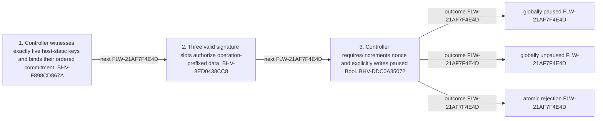

<!-- trace: FLW-21AF7F4E4D -->

# Global pause or unpause command — FLW-21AF7F4E4D

<!-- trace: FLW-21AF7F4E4D, BHV-F898CD867A, CMP-B6BB8BE661, BHV-8ED0438CC8, BHV-DDC0A35072, INV-1E832E77A4, INV-187FD2A7A9, EVD-337E2C2D56, AST-A132DD0B17, GAP-22CD8BD355, REQ-8BFD766005, SEC-10182FB352 -->
## Flow summary
| Scope | Owner | Trigger | Static conclusion | Pass 2 |
| --- | --- | --- | --- | --- |
| LOCAL | CMP-B6BB8BE661 | caller submits operation-specific signatures and current nonce | Global pause authorization lacks deployment-domain binding and an on-chain event and relies on distinct recoverable signers. | REFINED. Global pause authorization lacks deployment-domain binding and an on-chain event and relies on distinct recoverable signers. |

<!-- trace: FLW-21AF7F4E4D, BHV-F898CD867A, CMP-B6BB8BE661, BHV-8ED0438CC8, BHV-DDC0A35072 -->

<!-- trace: FLW-21AF7F4E4D, BHV-F898CD867A, CMP-B6BB8BE661, BHV-8ED0438CC8, BHV-DDC0A35072 -->
## Ordered steps
| Step | Operation | Component | Behavior | Inputs | Outputs | Failure edges |
| --- | --- | --- | --- | --- | --- | --- |
| 1 | Controller witnesses exactly five host-static keys and binds their ordered commitment. | CMP-B6BB8BE661 | BHV-F898CD867A | None recorded. | None recorded. | None recorded. |
| 2 | Three valid signature slots authorize operation-prefixed data. | CMP-B6BB8BE661 | BHV-8ED0438CC8 | None recorded. | None recorded. | None recorded. |
| 3 | Controller requires/increments nonce and explicitly writes paused Bool. | CMP-B6BB8BE661 | BHV-DDC0A35072 | None recorded. | None recorded. | None recorded. |

<!-- trace: FLW-21AF7F4E4D, BHV-F898CD867A, CMP-B6BB8BE661, BHV-8ED0438CC8, BHV-DDC0A35072, INV-1E832E77A4, INV-187FD2A7A9, EVD-337E2C2D56, AST-A132DD0B17, GAP-22CD8BD355, REQ-8BFD766005, SEC-10182FB352 -->
## Outcomes and controls
| Topic | Value |
| --- | --- |
| Terminal outcomes | globally paused globally unpaused atomic rejection |
| Invariants | INV-1E832E77A4, INV-187FD2A7A9 |
| Trust boundaries | host-static participant list signature and hash dependency semantics |

<!-- trace: FLW-21AF7F4E4D, BHV-F898CD867A, CMP-B6BB8BE661, BHV-8ED0438CC8, BHV-DDC0A35072, INV-1E832E77A4, INV-187FD2A7A9, GAP-22CD8BD355, REQ-8BFD766005, SEC-10182FB352, REL-DEB2AB770C, TST-5FC61A24DA, GAP-52A3FE4758 -->
## Related semantic records
| ID | Type | Topic |
| --- | --- | --- |
| [BHV-F898CD867A](../SPECIFICATION.md#bhv-f898cd867a) | BHV | Bind five witnessed participant slots and require three signatures |
| [CMP-B6BB8BE661](../SPECIFICATION.md#cmp-b6bb8be661) | CMP | Treasury Pause Controller smart contract |
| [BHV-8ED0438CC8](../SPECIFICATION.md#bhv-8ed0438cc8) | BHV | Construct operation-prefixed signature data |
| [BHV-DDC0A35072](../SPECIFICATION.md#bhv-ddc0a35072) | BHV | Set global treasury pause state |
| [INV-1E832E77A4](../SPECIFICATION.md#inv-1e832e77a4) | INV | Emergency commands require at least three valid signature slots under the ordered participant list committed in controller state. |
| [INV-187FD2A7A9](../SPECIFICATION.md#inv-187fd2a7a9) | INV | An accepted emergency command cannot be replayed against the same controller nonce. |
| [GAP-22CD8BD355](../SPECIFICATION.md#gap-22cd8bd355) | GAP | Proposal emergency control lacks explicit target state and status preservation policy |
| [REQ-8BFD766005](../SPECIFICATION.md#req-8bfd766005) | REQ | Break-glass multisig intervention |
| [SEC-10182FB352](../SPECIFICATION.md#sec-10182fb352) | SEC | Keep emergency authority thresholded, replay-bounded, transparent, and recoverable |
| [REL-DEB2AB770C](../SPECIFICATION.md#rel-deb2ab770c) | REL | relation:treasury-contracts:pause:test-negative-partitions |
| [TST-5FC61A24DA](../SPECIFICATION.md#tst-5fc61a24da) | TST | Pause controller expectations |
| [GAP-52A3FE4758](../SPECIFICATION.md#gap-52a3fe4758) | GAP | Emergency commands and rotations lack a complete on-chain audit/recovery record |

<!-- trace: FLW-21AF7F4E4D, GAP-22CD8BD355, GAP-52A3FE4758 -->
## Open review items
| ID | Type | Topic | Status |
| --- | --- | --- | --- |
| [GAP-22CD8BD355](../SPECIFICATION.md#gap-22cd8bd355) | GAP | Proposal emergency control lacks explicit target state and status preservation policy | OPEN |
| [GAP-52A3FE4758](../SPECIFICATION.md#gap-52a3fe4758) | GAP | Emergency commands and rotations lack a complete on-chain audit/recovery record | UNRESOLVED |
