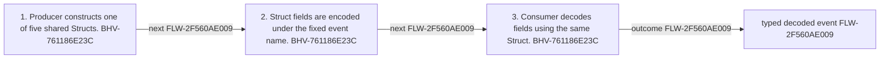

<!-- trace: FLW-2F560AE009 -->

# Treasury event producer-to-consumer schema — FLW-2F560AE009

<!-- trace: FLW-2F560AE009, CMP-834A30297A, BHV-761186E23C, EVD-02AE7D74CF, AST-BB5FF109EE -->
## Flow summary
| Scope | Owner | Trigger | Static conclusion | Pass 2 |
| --- | --- | --- | --- | --- |
| CROSS_COMPONENT | CMP-834A30297A | A contract emits a named payload or indexer fixture decodes it. | Tests establish static encoding expectations for the shared schema, not correctness of values emitted by production methods. | [Exact technical value; STE length exception] CONFIRMED. The Pass-1 flows interpretation for Treasury event producer-to-consumer schema remains consistent with raw anchors and complete context; confirmation is static and does not claim runtime, deployment, or proof-system assurance. |

<!-- trace: FLW-2F560AE009, CMP-834A30297A, BHV-761186E23C -->

<!-- trace: FLW-2F560AE009, CMP-834A30297A, BHV-761186E23C -->
## Ordered steps
| Step | Operation | Component | Behavior | Inputs | Outputs | Failure edges |
| --- | --- | --- | --- | --- | --- | --- |
| 1 | Producer constructs one of five shared Structs. | CMP-834A30297A | BHV-761186E23C | operation values | typed event | producer may supply semantically wrong but type-valid value |
| 2 | Struct fields are encoded under the fixed event name. | CMP-834A30297A | BHV-761186E23C | typed event | field sequence | None recorded. |
| 3 | Consumer decodes fields using the same Struct. | CMP-834A30297A | BHV-761186E23C | field sequence | decoded payload | schema/version mismatch |

<!-- trace: FLW-2F560AE009, CMP-834A30297A, BHV-761186E23C, EVD-02AE7D74CF, AST-BB5FF109EE -->
## Outcomes and controls
| Topic | Value |
| --- | --- |
| Terminal outcomes | typed decoded event |
| Invariants | None recorded. |
| Trust boundaries | production value selection indexer schema/version agreement |

<!-- trace: FLW-2F560AE009, CMP-834A30297A, BHV-761186E23C, TST-ED3BD4CF2F -->
## Related semantic records
| ID | Type | Topic |
| --- | --- | --- |
| [CMP-834A30297A](../SPECIFICATION.md#cmp-834a30297a) | CMP | Treasury event schemas |
| [BHV-761186E23C](../SPECIFICATION.md#bhv-761186e23c) | BHV | Encode shared treasury event payloads |
| [TST-ED3BD4CF2F](../SPECIFICATION.md#tst-ed3bd4cf2f) | TST | Treasury event schema expectations |

<!-- trace: FLW-2F560AE009 -->
## Open review items
None recorded.
