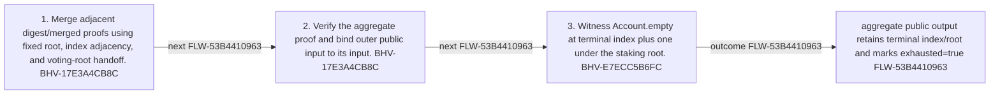

<!-- trace: FLW-53B4410963 -->

# Compose staking ranges and prove terminal boundary — FLW-53B4410963

<!-- trace: FLW-53B4410963, CMP-874E479BA1, BHV-17E3A4CB8C, BHV-E7ECC5B6FC, EVD-B7C40C0F6F, AST-BE02BC3E3B, FND-CA0F83CE86, INV-016B52DE5B -->
## Flow summary
| Scope | Owner | Trigger | Static conclusion | Pass 2 |
| --- | --- | --- | --- | --- |
| LOCAL | CMP-874E479BA1 | One or more digest proofs are recursively merged and wrapped by exhaust. | Recursive adjacency is constrained, but terminal completeness still relies on a dense staking-ledger representation. | REFINED. Recursive adjacency is constrained, but terminal completeness still relies on a dense staking-ledger representation. |

<!-- trace: FLW-53B4410963, CMP-874E479BA1, BHV-17E3A4CB8C, BHV-E7ECC5B6FC -->

<!-- trace: FLW-53B4410963, CMP-874E479BA1, BHV-17E3A4CB8C, BHV-E7ECC5B6FC -->
## Ordered steps
| Step | Operation | Component | Behavior | Inputs | Outputs | Failure edges |
| --- | --- | --- | --- | --- | --- | --- |
| 1 | Merge adjacent digest/merged proofs using fixed root, index adjacency, and voting-root handoff. | CMP-874E479BA1 | BHV-17E3A4CB8C | None recorded. | None recorded. | proof/continuity mismatch |
| 2 | Verify the aggregate proof and bind outer public input to its input. | CMP-874E479BA1 | BHV-17E3A4CB8C | None recorded. | None recorded. | verification/input mismatch |
| 3 | Witness Account.empty at terminal index plus one under the staking root. | CMP-874E479BA1 | BHV-E7ECC5B6FC | None recorded. | None recorded. | root/index mismatch |

<!-- trace: FLW-53B4410963, CMP-874E479BA1, BHV-17E3A4CB8C, BHV-E7ECC5B6FC, EVD-B7C40C0F6F, AST-BE02BC3E3B, FND-CA0F83CE86, INV-016B52DE5B -->
## Outcomes and controls
| Topic | Value |
| --- | --- |
| Terminal outcomes | aggregate public output retains terminal index/root and marks exhausted=true |
| Invariants | None recorded. |
| Trust boundaries | None recorded. |

<!-- trace: FLW-53B4410963, CMP-874E479BA1, BHV-17E3A4CB8C, BHV-E7ECC5B6FC, FND-CA0F83CE86, INV-016B52DE5B, REQ-529C5F460D, TST-5A6CA56CD8, TST-A696D485D6 -->
## Related semantic records
| ID | Type | Topic |
| --- | --- | --- |
| [CMP-874E479BA1](../SPECIFICATION.md#cmp-874e479ba1) | CMP | Staking-ledger-to-voting-ledger ZkProgram |
| [BHV-17E3A4CB8C](../SPECIFICATION.md#bhv-17e3a4cb8c) | BHV | Merge adjacent staking transformation proofs |
| [BHV-E7ECC5B6FC](../SPECIFICATION.md#bhv-e7ecc5b6fc) | BHV | Mark a transformation exhausted by the next empty leaf |
| [FND-CA0F83CE86](../SPECIFICATION.md#fnd-ca0f83ce86) | FND | Staking proof exhaustion is not a terminal recursive state |
| [INV-016B52DE5B](../SPECIFICATION.md#inv-016b52de5b) | INV | An empty leaf at terminal index plus one means no later staking account exists. |
| [REQ-529C5F460D](../SPECIFICATION.md#req-529c5f460d) | REQ | Historical staking-ledger voting weight |
| [TST-5A6CA56CD8](../SPECIFICATION.md#tst-5a6ca56cd8) | TST | Staking-to-voting-ledger expectations |
| [TST-A696D485D6](../SPECIFICATION.md#tst-a696d485d6) | TST | Treasury owner integration expectations |

<!-- trace: FLW-53B4410963, FND-CA0F83CE86 -->
## Open review items
| ID | Type | Topic | Status |
| --- | --- | --- | --- |
| [FND-CA0F83CE86](../SPECIFICATION.md#fnd-ca0f83ce86) | FND | Staking proof exhaustion is not a terminal recursive state | OPEN |
