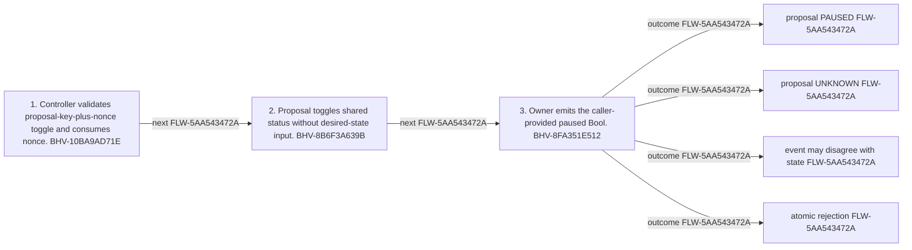

<!-- trace: FLW-5AA543472A -->

# Proposal-specific pause toggle — FLW-5AA543472A

<!-- trace: FLW-5AA543472A, BHV-10BA9AD71E, CMP-B6BB8BE661, BHV-8B6F3A639B, CMP-5CAF19BDCD, BHV-8FA351E512, CMP-E155326DD2, INV-015B387636, INV-DEFE674779, EVD-4908C76CF8, EVD-3FE5CD8A8A, EVD-6665BB19D1, AST-BA1211B140, THR-A943E3380A -->
## Flow summary
| Scope | Owner | Trigger | Static conclusion | Pass 2 |
| --- | --- | --- | --- | --- |
| CROSS_COMPONENT | CMP-B6BB8BE661 | caller submits proposal key, multisig authorization, nonce, and event Bool | Authorization is a blind toggle, terminal status can be lost, and the emitted Bool can disagree with state. | REFINED. Authorization is a blind toggle, terminal status can be lost, and the emitted Bool can disagree with state. |

<!-- trace: FLW-5AA543472A, BHV-10BA9AD71E, CMP-B6BB8BE661, BHV-8B6F3A639B, CMP-5CAF19BDCD, BHV-8FA351E512, CMP-E155326DD2 -->

<!-- trace: FLW-5AA543472A, BHV-10BA9AD71E, CMP-B6BB8BE661, BHV-8B6F3A639B, CMP-5CAF19BDCD, BHV-8FA351E512, CMP-E155326DD2 -->
## Ordered steps
| Step | Operation | Component | Behavior | Inputs | Outputs | Failure edges |
| --- | --- | --- | --- | --- | --- | --- |
| 1 | Controller validates proposal-key-plus-nonce toggle and consumes nonce. | CMP-B6BB8BE661 | BHV-10BA9AD71E | None recorded. | None recorded. | None recorded. |
| 2 | Proposal toggles shared status without desired-state input. | CMP-5CAF19BDCD | BHV-8B6F3A639B | None recorded. | None recorded. | None recorded. |
| 3 | Owner emits the caller-provided paused Bool. | CMP-E155326DD2 | BHV-8FA351E512 | None recorded. | None recorded. | None recorded. |

<!-- trace: FLW-5AA543472A, BHV-10BA9AD71E, CMP-B6BB8BE661, BHV-8B6F3A639B, CMP-5CAF19BDCD, BHV-8FA351E512, CMP-E155326DD2, INV-015B387636, INV-DEFE674779, EVD-4908C76CF8, EVD-3FE5CD8A8A, EVD-6665BB19D1, AST-BA1211B140, THR-A943E3380A -->
## Outcomes and controls
| Topic | Value |
| --- | --- |
| Terminal outcomes | proposal PAUSED proposal UNKNOWN event may disagree with state atomic rejection |
| Invariants | INV-015B387636, INV-DEFE674779 |
| Trust boundaries | indexers may treat event as state truth |

<!-- trace: FLW-5AA543472A, BHV-10BA9AD71E, CMP-B6BB8BE661, BHV-8B6F3A639B, CMP-5CAF19BDCD, BHV-8FA351E512, CMP-E155326DD2, INV-015B387636, INV-DEFE674779, THR-A943E3380A, REQ-8BFD766005, FND-1D115F22E4, GAP-22CD8BD355, GAP-ADD703D733 -->
## Related semantic records
| ID | Type | Topic |
| --- | --- | --- |
| [BHV-10BA9AD71E](../SPECIFICATION.md#bhv-10ba9ad71e) | BHV | Authorize proposal-specific toggle |
| [CMP-B6BB8BE661](../SPECIFICATION.md#cmp-b6bb8be661) | CMP | Treasury Pause Controller smart contract |
| [BHV-8B6F3A639B](../SPECIFICATION.md#bhv-8b6f3a639b) | BHV | Toggle shared status between PAUSED and UNKNOWN |
| [CMP-5CAF19BDCD](../SPECIFICATION.md#cmp-5caf19bdcd) | CMP | Treasury Proposal smart contract |
| [BHV-8FA351E512](../SPECIFICATION.md#bhv-8fa351e512) | BHV | Authorize and toggle proposal pause status |
| [CMP-E155326DD2](../SPECIFICATION.md#cmp-e155326dd2) | CMP | Treasury Owner smart contract |
| [INV-015B387636](../SPECIFICATION.md#inv-015b387636) | INV | Lifecycle events should report values constrained by the state/effect they describe. |
| [INV-DEFE674779](../SPECIFICATION.md#inv-defe674779) | INV | Emergency pause should not erase APPROVED or REJECTED unless governance reset is explicit intent. |
| [THR-A943E3380A](../SPECIFICATION.md#thr-a943e3380a) | THR | Emergency toggle erases finality or inverts operator intent |
| [REQ-8BFD766005](../SPECIFICATION.md#req-8bfd766005) | REQ | Break-glass multisig intervention |
| [FND-1D115F22E4](../SPECIFICATION.md#fnd-1d115f22e4) | FND | Proposal pause event is not bound to post-state |
| [GAP-22CD8BD355](../SPECIFICATION.md#gap-22cd8bd355) | GAP | Proposal emergency control lacks explicit target state and status preservation policy |
| [GAP-ADD703D733](../SPECIFICATION.md#gap-add703d733) | GAP | Treasury Owner integration expectations omit principal adverse partitions |

<!-- trace: FLW-5AA543472A, FND-1D115F22E4, GAP-22CD8BD355, GAP-ADD703D733 -->
## Open review items
| ID | Type | Topic | Status |
| --- | --- | --- | --- |
| [FND-1D115F22E4](../SPECIFICATION.md#fnd-1d115f22e4) | FND | Proposal pause event is not bound to post-state | OPEN |
| [GAP-22CD8BD355](../SPECIFICATION.md#gap-22cd8bd355) | GAP | Proposal emergency control lacks explicit target state and status preservation policy | OPEN |
| [GAP-ADD703D733](../SPECIFICATION.md#gap-add703d733) | GAP | Treasury Owner integration expectations omit principal adverse partitions | OPEN |
