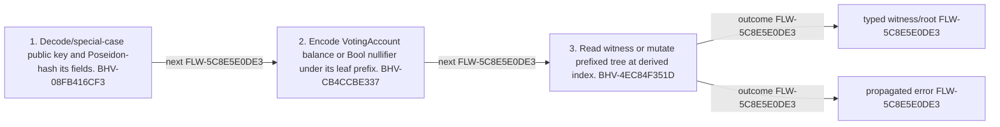

<!-- trace: FLW-5C8E5E0DE3 -->

# Public key to voting/nullifier root — FLW-5C8E5E0DE3

<!-- trace: FLW-5C8E5E0DE3, CMP-7CC27EFA43, BHV-08FB416CF3, CMP-31D3990A1F, BHV-CB4CCBE337, CMP-2890255AE1, BHV-4EC84F351D, EVD-6201011AC1, AST-4CAF411B32 -->
## Flow summary
| Scope | Owner | Trigger | Static conclusion | Pass 2 |
| --- | --- | --- | --- | --- |
| CROSS_COMPONENT | CMP-7CC27EFA43 | A voting or nullifier account is witnessed or updated. | Both ledgers use the identical positional index but distinct prefixed empty/typed leaf values. | [Exact technical value; STE length exception] CONFIRMED. The Pass-1 flows interpretation for Public key to voting/nullifier root remains consistent with raw anchors and complete context; confirmation is static and does not claim runtime, deployment, or proof-system assurance. |

<!-- trace: FLW-5C8E5E0DE3, CMP-7CC27EFA43, BHV-08FB416CF3, CMP-31D3990A1F, BHV-CB4CCBE337, CMP-2890255AE1, BHV-4EC84F351D -->

<!-- trace: FLW-5C8E5E0DE3, CMP-7CC27EFA43, BHV-08FB416CF3, CMP-31D3990A1F, BHV-CB4CCBE337, CMP-2890255AE1, BHV-4EC84F351D -->
## Ordered steps
| Step | Operation | Component | Behavior | Inputs | Outputs | Failure edges |
| --- | --- | --- | --- | --- | --- | --- |
| 1 | Decode/special-case public key and Poseidon-hash its fields. | CMP-7CC27EFA43 | BHV-08FB416CF3 | base58 public key | bigint index | invalid base58 |
| 2 | Encode VotingAccount balance or Bool nullifier under its leaf prefix. | CMP-31D3990A1F | BHV-CB4CCBE337 | typed leaf | leaf Field | None recorded. |
| 3 | Read witness or mutate prefixed tree at derived index. | CMP-2890255AE1 | BHV-4EC84F351D | index leaf | witness/root | storage failure |

<!-- trace: FLW-5C8E5E0DE3, CMP-7CC27EFA43, BHV-08FB416CF3, CMP-31D3990A1F, BHV-CB4CCBE337, CMP-2890255AE1, BHV-4EC84F351D, EVD-6201011AC1, AST-4CAF411B32 -->
## Outcomes and controls
| Topic | Value |
| --- | --- |
| Terminal outcomes | typed witness/root propagated error |
| Invariants | None recorded. |
| Trust boundaries | public-key canonical encoding shared position derivation storage consistency |

<!-- trace: FLW-5C8E5E0DE3, CMP-7CC27EFA43, BHV-08FB416CF3, CMP-31D3990A1F, BHV-CB4CCBE337, CMP-2890255AE1, BHV-4EC84F351D, REL-D3821C9762 -->
## Related semantic records
| ID | Type | Topic |
| --- | --- | --- |
| [CMP-7CC27EFA43](../SPECIFICATION.md#cmp-7cc27efa43) | CMP | Provable ledger and hashing support |
| [BHV-08FB416CF3](../SPECIFICATION.md#bhv-08fb416cf3) | BHV | Derive voting/nullifier Merkle position from a public key |
| [CMP-31D3990A1F](../SPECIFICATION.md#cmp-31d3990a1f) | CMP | Prefixed hashing and action chaining |
| [BHV-CB4CCBE337](../SPECIFICATION.md#bhv-cb4ccbe337) | BHV | Hash prefixed values and append an action |
| [CMP-2890255AE1](../SPECIFICATION.md#cmp-2890255ae1) | CMP | Prefixed Merkle trees and witnesses |
| [BHV-4EC84F351D](../SPECIFICATION.md#bhv-4ec84f351d) | BHV | Set a Merkle leaf and recompute ancestors |
| [REL-D3821C9762](../SPECIFICATION.md#rel-d3821c9762) | REL | relation:primitives-tests:public-key-derives-ledger-index |

<!-- trace: FLW-5C8E5E0DE3 -->
## Open review items
None recorded.
