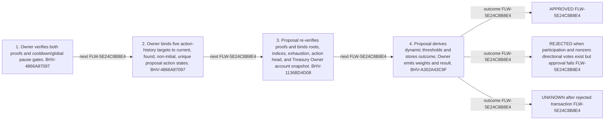

<!-- trace: FLW-5E24C8B8E4 -->

# Proof-backed tally finalization — FLW-5E24C8B8E4

<!-- trace: FLW-5E24C8B8E4, BHV-4866A87097, CMP-E155326DD2, BHV-1136BD4D08, CMP-5CAF19BDCD, BHV-A302A43C9F, INV-F79F5B8C65, INV-222CED01FB, INV-159AD1A04E, EVD-5AED8D6498, AST-9329F20061, FND-B5948FE3CF, UNR-13C729A54A -->
## Flow summary
| Scope | Owner | Trigger | Static conclusion | Pass 2 |
| --- | --- | --- | --- | --- |
| CROSS_COMPONENT | CMP-E155326DD2 | sender submits both proof objects and owner account witness after cooldown | [Exact technical value; STE length exception] The local interpretation for Proof-backed tally finalization remains source-supported, but complete context adds cross-component policy, trust, lifecycle, or liveness qualifications represented by the linked context records. | [Exact technical value; STE length exception] REFINED. The local interpretation for Proof-backed tally finalization remains source-supported, but complete context adds cross-component policy, trust, lifecycle, or liveness qualifications represented by the linked context records. |

<!-- trace: FLW-5E24C8B8E4, BHV-4866A87097, CMP-E155326DD2, BHV-1136BD4D08, CMP-5CAF19BDCD, BHV-A302A43C9F -->

<!-- trace: FLW-5E24C8B8E4, BHV-4866A87097, CMP-E155326DD2, BHV-1136BD4D08, CMP-5CAF19BDCD, BHV-A302A43C9F -->
## Ordered steps
| Step | Operation | Component | Behavior | Inputs | Outputs | Failure edges |
| --- | --- | --- | --- | --- | --- | --- |
| 1 | Owner verifies both proofs and cooldown/global pause gates. | CMP-E155326DD2 | BHV-4866A87097 | None recorded. | None recorded. | None recorded. |
| 2 | Owner binds five action-history targets to current, found, non-initial, unique proposal action states. | CMP-E155326DD2 | BHV-4866A87097 | None recorded. | None recorded. | None recorded. |
| 3 | Proposal re-verifies proofs and binds roots, indices, exhaustion, action head, and Treasury Owner account snapshot. | CMP-5CAF19BDCD | BHV-1136BD4D08 | None recorded. | None recorded. | None recorded. |
| 4 | Proposal derives dynamic thresholds and stores outcome; Owner emits weights and result. | CMP-5CAF19BDCD | BHV-A302A43C9F | None recorded. | None recorded. | None recorded. |

<!-- trace: FLW-5E24C8B8E4, BHV-4866A87097, CMP-E155326DD2, BHV-1136BD4D08, CMP-5CAF19BDCD, BHV-A302A43C9F, INV-F79F5B8C65, INV-222CED01FB, INV-159AD1A04E, EVD-5AED8D6498, AST-9329F20061, FND-B5948FE3CF, UNR-13C729A54A -->
## Outcomes and controls
| Topic | Value |
| --- | --- |
| Terminal outcomes | APPROVED REJECTED when participation and nonzero directional votes exist but approval fails UNKNOWN after rejected transaction |
| Invariants | INV-F79F5B8C65, INV-222CED01FB, INV-159AD1A04E |
| Trust boundaries | configured verification keys proof program correctness Mina account witness representation |

<!-- trace: FLW-5E24C8B8E4, BHV-4866A87097, CMP-E155326DD2, BHV-1136BD4D08, CMP-5CAF19BDCD, BHV-A302A43C9F, INV-F79F5B8C65, INV-222CED01FB, INV-159AD1A04E, FND-B5948FE3CF, UNR-13C729A54A, REQ-8AC636D92F, REQ-F8D28DBFF5, REQ-529C5F460D, REQ-8671471176, REQ-1EEDB7A733, TST-A696D485D6, GAP-7BAF881BED, GAP-ADD703D733 -->
## Related semantic records
| ID | Type | Topic |
| --- | --- | --- |
| [BHV-4866A87097](../SPECIFICATION.md#bhv-4866a87097) | BHV | Verify proofs, bind action history, and tally proposal |
| [CMP-E155326DD2](../SPECIFICATION.md#cmp-e155326dd2) | CMP | Treasury Owner smart contract |
| [BHV-1136BD4D08](../SPECIFICATION.md#bhv-1136bd4d08) | BHV | Bind proof outputs and finalize proposal tally |
| [CMP-5CAF19BDCD](../SPECIFICATION.md#cmp-5caf19bdcd) | CMP | Treasury Proposal smart contract |
| [BHV-A302A43C9F](../SPECIFICATION.md#bhv-a302a43c9f) | BHV | Calculate participation and vote result |
| [INV-F79F5B8C65](../SPECIFICATION.md#inv-f79f5b8c65) | INV | Tally proof roots, start indices, exhaustion, action head, and Treasury Owner account witness are bound to proposal snapshot and configured empty roots. |
| [INV-222CED01FB](../SPECIFICATION.md#inv-222ced01fb) | INV | All five declared target action states are found, non-initial, pairwise unique, and constrained to proposal account action state preconditions. |
| [INV-159AD1A04E](../SPECIFICATION.md#inv-159ad1a04e) | INV | A proposal may be tallied only while status is UNKNOWN. |
| [FND-B5948FE3CF](../SPECIFICATION.md#fnd-b5948fe3cf) | FND | Failed quorum or abstain-only tally cannot finalize as rejected |
| [UNR-13C729A54A](../SPECIFICATION.md#unr-13c729a54a) | UNR | [Exact technical value; STE length exception] Owner tally requires five found, non-initial, pairwise-distinct action-state hashes; practical finalizability for proposals with fewer state transitions and joint satisfiability of five actionState preconditions depend on Mina action-state history semantics. |
| [REQ-8AC636D92F](../SPECIFICATION.md#req-8ac636d92f) | REQ | Community-controlled on-chain treasury |
| [REQ-F8D28DBFF5](../SPECIFICATION.md#req-f8d28dbff5) | REQ | Cooldown permits tally but prevents execution |
| [REQ-529C5F460D](../SPECIFICATION.md#req-529c5f460d) | REQ | Historical staking-ledger voting weight |
| [REQ-8671471176](../SPECIFICATION.md#req-8671471176) | REQ | Lightweight vote dispatch and deferred tally |
| [REQ-1EEDB7A733](../SPECIFICATION.md#req-1eedb7a733) | REQ | Provable proposal, voting, execution, and accounting |
| [TST-A696D485D6](../SPECIFICATION.md#tst-a696d485d6) | TST | Treasury owner integration expectations |
| [GAP-7BAF881BED](../SPECIFICATION.md#gap-7baf881bed) | GAP | Parallel approved proposal liabilities have no reservation or ordering policy |
| [GAP-ADD703D733](../SPECIFICATION.md#gap-add703d733) | GAP | Treasury Owner integration expectations omit principal adverse partitions |

<!-- trace: FLW-5E24C8B8E4, FND-B5948FE3CF, UNR-13C729A54A, GAP-7BAF881BED, GAP-ADD703D733 -->
## Open review items
| ID | Type | Topic | Status |
| --- | --- | --- | --- |
| [FND-B5948FE3CF](../SPECIFICATION.md#fnd-b5948fe3cf) | FND | Failed quorum or abstain-only tally cannot finalize as rejected | OPEN |
| [UNR-13C729A54A](../SPECIFICATION.md#unr-13c729a54a) | UNR | [Exact technical value; STE length exception] Owner tally requires five found, non-initial, pairwise-distinct action-state hashes; practical finalizability for proposals with fewer state transitions and joint satisfiability of five actionState preconditions depend on Mina action-state history semantics. | OPEN |
| [GAP-7BAF881BED](../SPECIFICATION.md#gap-7baf881bed) | GAP | Parallel approved proposal liabilities have no reservation or ordering policy | UNRESOLVED |
| [GAP-ADD703D733](../SPECIFICATION.md#gap-add703d733) | GAP | Treasury Owner integration expectations omit principal adverse partitions | OPEN |
