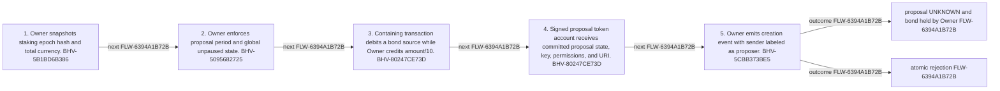

<!-- trace: FLW-6394A1B72B -->

# Proposal creation and bond custody — FLW-6394A1B72B

<!-- trace: FLW-6394A1B72B, BHV-5B1BD6B386, CMP-E155326DD2, BHV-5095682725, BHV-80247CE73D, BHV-5CBB373BE5, CMP-834A30297A, INV-A2C6F00258, INV-CF85A74EED, EVD-E95EC38949, EVD-9FC5B7AF30, AST-7BC1073B95, GAP-9398E85581, GAP-F83C6F5411, REQ-989D12F5D3 -->
## Flow summary
| Scope | Owner | Trigger | Static conclusion | Pass 2 |
| --- | --- | --- | --- | --- |
| CROSS_COMPONENT | CMP-E155326DD2 | signed sender submits proposal-period transaction | [Exact technical value; STE length exception] The local interpretation for Proposal creation and bond custody remains source-supported, but complete context adds cross-component policy, trust, lifecycle, or liveness qualifications represented by the linked context records. | [Exact technical value; STE length exception] REFINED. The local interpretation for Proposal creation and bond custody remains source-supported, but complete context adds cross-component policy, trust, lifecycle, or liveness qualifications represented by the linked context records. |

<!-- trace: FLW-6394A1B72B, BHV-5B1BD6B386, CMP-E155326DD2, BHV-5095682725, BHV-80247CE73D, BHV-5CBB373BE5, CMP-834A30297A -->

<!-- trace: FLW-6394A1B72B, BHV-5B1BD6B386, CMP-E155326DD2, BHV-5095682725, BHV-80247CE73D, BHV-5CBB373BE5, CMP-834A30297A -->
## Ordered steps
| Step | Operation | Component | Behavior | Inputs | Outputs | Failure edges |
| --- | --- | --- | --- | --- | --- | --- |
| 1 | Owner snapshots staking epoch hash and total currency. | CMP-E155326DD2 | BHV-5B1BD6B386 | None recorded. | None recorded. | None recorded. |
| 2 | Owner enforces proposal period and global unpaused state. | CMP-E155326DD2 | BHV-5095682725 | None recorded. | None recorded. | None recorded. |
| 3 | Containing transaction debits a bond source while Owner credits amount/10. | CMP-E155326DD2 | BHV-80247CE73D | None recorded. | None recorded. | None recorded. |
| 4 | Signed proposal token account receives committed proposal state, key, permissions, and URI. | CMP-E155326DD2 | BHV-80247CE73D | None recorded. | None recorded. | None recorded. |
| 5 | Owner emits creation event with sender labeled as proposer. | CMP-834A30297A | BHV-5CBB373BE5 | None recorded. | None recorded. | None recorded. |

<!-- trace: FLW-6394A1B72B, BHV-5B1BD6B386, CMP-E155326DD2, BHV-5095682725, BHV-80247CE73D, BHV-5CBB373BE5, CMP-834A30297A, INV-A2C6F00258, INV-CF85A74EED, EVD-E95EC38949, EVD-9FC5B7AF30, AST-7BC1073B95, GAP-9398E85581, GAP-F83C6F5411, REQ-989D12F5D3 -->
## Outcomes and controls
| Topic | Value |
| --- | --- |
| Terminal outcomes | proposal UNKNOWN and bond held by Owner atomic rejection |
| Invariants | INV-A2C6F00258, INV-CF85A74EED |
| Trust boundaries | off-chain transaction construction selects bond payer deployment supplies proposal verification key |

<!-- trace: FLW-6394A1B72B, BHV-5B1BD6B386, CMP-E155326DD2, BHV-5095682725, BHV-80247CE73D, BHV-5CBB373BE5, CMP-834A30297A, INV-A2C6F00258, INV-CF85A74EED, GAP-9398E85581, GAP-F83C6F5411, REQ-989D12F5D3, REQ-998DF345BB, REQ-8AC636D92F, REQ-4F1B35FCAA, REQ-740285CD08, REQ-1EEDB7A733, REL-3CED302334, TST-A696D485D6, GAP-7BAF881BED, GAP-ADD703D733 -->
## Related semantic records
| ID | Type | Topic |
| --- | --- | --- |
| [BHV-5B1BD6B386](../SPECIFICATION.md#bhv-5b1bd6b386) | BHV | Snapshot current staking epoch ledger |
| [CMP-E155326DD2](../SPECIFICATION.md#cmp-e155326dd2) | CMP | Treasury Owner smart contract |
| [BHV-5095682725](../SPECIFICATION.md#bhv-5095682725) | BHV | Derive and enforce lifecycle slot range |
| [BHV-80247CE73D](../SPECIFICATION.md#bhv-80247ce73d) | BHV | Create proposal and collect ten-percent bond |
| [BHV-5CBB373BE5](../SPECIFICATION.md#bhv-5cbb373be5) | BHV | Emit proposal lifecycle event schemas |
| [CMP-834A30297A](../SPECIFICATION.md#cmp-834a30297a) | CMP | Treasury event schemas |
| [INV-A2C6F00258](../SPECIFICATION.md#inv-a2c6f00258) | INV | A proposal tally uses the staking root and total currency captured at proposal creation. |
| [INV-CF85A74EED](../SPECIFICATION.md#inv-cf85a74eed) | INV | Proposal creation credits exactly floor(amount/10) to Treasury Owner and the containing transaction must provide a balancing debit. |
| [GAP-9398E85581](../SPECIFICATION.md#gap-9398e85581) | GAP | Bond policy does not deter zero-bond dust proposals |
| [GAP-F83C6F5411](../SPECIFICATION.md#gap-f83c6f5411) | GAP | Bond payer, custody, and successful beneficiary policy diverge from RFC wording |
| [REQ-989D12F5D3](../SPECIFICATION.md#req-989d12f5d3) | REQ | Configurable proposer bond |
| [REQ-998DF345BB](../SPECIFICATION.md#req-998df345bb) | REQ | Bond return or loss |
| [REQ-8AC636D92F](../SPECIFICATION.md#req-8ac636d92f) | REQ | Community-controlled on-chain treasury |
| [REQ-4F1B35FCAA](../SPECIFICATION.md#req-4f1b35fcaa) | REQ | Proposal content reference |
| [REQ-740285CD08](../SPECIFICATION.md#req-740285cd08) | REQ | Proposal-submission period |
| [REQ-1EEDB7A733](../SPECIFICATION.md#req-1eedb7a733) | REQ | Provable proposal, voting, execution, and accounting |
| [REL-3CED302334](../SPECIFICATION.md#rel-3ced302334) | REL | relation:treasury-contracts:owner:test-happy-path |
| [TST-A696D485D6](../SPECIFICATION.md#tst-a696d485d6) | TST | Treasury owner integration expectations |
| [GAP-7BAF881BED](../SPECIFICATION.md#gap-7baf881bed) | GAP | Parallel approved proposal liabilities have no reservation or ordering policy |
| [GAP-ADD703D733](../SPECIFICATION.md#gap-add703d733) | GAP | Treasury Owner integration expectations omit principal adverse partitions |

<!-- trace: FLW-6394A1B72B, GAP-9398E85581, GAP-F83C6F5411, GAP-7BAF881BED, GAP-ADD703D733 -->
## Open review items
| ID | Type | Topic | Status |
| --- | --- | --- | --- |
| [GAP-9398E85581](../SPECIFICATION.md#gap-9398e85581) | GAP | Bond policy does not deter zero-bond dust proposals | OPEN |
| [GAP-F83C6F5411](../SPECIFICATION.md#gap-f83c6f5411) | GAP | Bond payer, custody, and successful beneficiary policy diverge from RFC wording | OPEN |
| [GAP-7BAF881BED](../SPECIFICATION.md#gap-7baf881bed) | GAP | Parallel approved proposal liabilities have no reservation or ordering policy | UNRESOLVED |
| [GAP-ADD703D733](../SPECIFICATION.md#gap-add703d733) | GAP | Treasury Owner integration expectations omit principal adverse partitions | OPEN |
