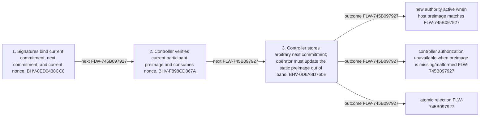

<!-- trace: FLW-745B097927 -->

# Emergency participant commitment rotation — FLW-745B097927

<!-- trace: FLW-745B097927, BHV-8ED0438CC8, CMP-B6BB8BE661, BHV-F898CD867A, BHV-0D6A8D760E, INV-0697F6A5B4, EVD-CF08ADCD5E, EVD-8F785412DE, AST-7FB05AF254, ASM-E6AE27B10D, THR-0DEBF32E0A -->
## Flow summary
| Scope | Owner | Trigger | Static conclusion | Pass 2 |
| --- | --- | --- | --- | --- |
| LOCAL | CMP-B6BB8BE661 | current participant set authorizes a new Field commitment | [Exact technical value; STE length exception] The local interpretation for Emergency participant commitment rotation remains source-supported, but complete context adds cross-component policy, trust, lifecycle, or liveness qualifications represented by the linked context records. | [Exact technical value; STE length exception] REFINED. The local interpretation for Emergency participant commitment rotation remains source-supported, but complete context adds cross-component policy, trust, lifecycle, or liveness qualifications represented by the linked context records. |

<!-- trace: FLW-745B097927, BHV-8ED0438CC8, CMP-B6BB8BE661, BHV-F898CD867A, BHV-0D6A8D760E -->

<!-- trace: FLW-745B097927, BHV-8ED0438CC8, CMP-B6BB8BE661, BHV-F898CD867A, BHV-0D6A8D760E -->
## Ordered steps
| Step | Operation | Component | Behavior | Inputs | Outputs | Failure edges |
| --- | --- | --- | --- | --- | --- | --- |
| 1 | Signatures bind current commitment, next commitment, and current nonce. | CMP-B6BB8BE661 | BHV-8ED0438CC8 | None recorded. | None recorded. | None recorded. |
| 2 | Controller verifies current participant preimage and consumes nonce. | CMP-B6BB8BE661 | BHV-F898CD867A | None recorded. | None recorded. | None recorded. |
| 3 | Controller stores arbitrary next commitment; operator must update the static preimage out of band. | CMP-B6BB8BE661 | BHV-0D6A8D760E | None recorded. | None recorded. | None recorded. |

<!-- trace: FLW-745B097927, BHV-8ED0438CC8, CMP-B6BB8BE661, BHV-F898CD867A, BHV-0D6A8D760E, INV-0697F6A5B4, EVD-CF08ADCD5E, EVD-8F785412DE, AST-7FB05AF254, ASM-E6AE27B10D, THR-0DEBF32E0A -->
## Outcomes and controls
| Topic | Value |
| --- | --- |
| Terminal outcomes | new authority active when host preimage matches controller authorization unavailable when preimage is missing/malformed atomic rejection |
| Invariants | INV-0697F6A5B4 |
| Trust boundaries | out-of-band operator configuration no rotation event |

<!-- trace: FLW-745B097927, BHV-8ED0438CC8, CMP-B6BB8BE661, BHV-F898CD867A, BHV-0D6A8D760E, INV-0697F6A5B4, ASM-E6AE27B10D, THR-0DEBF32E0A, REQ-8BFD766005, TST-5FC61A24DA, FND-10A2C953A0, GAP-52A3FE4758 -->
## Related semantic records
| ID | Type | Topic |
| --- | --- | --- |
| [BHV-8ED0438CC8](../SPECIFICATION.md#bhv-8ed0438cc8) | BHV | Construct operation-prefixed signature data |
| [CMP-B6BB8BE661](../SPECIFICATION.md#cmp-b6bb8be661) | CMP | Treasury Pause Controller smart contract |
| [BHV-F898CD867A](../SPECIFICATION.md#bhv-f898cd867a) | BHV | Bind five witnessed participant slots and require three signatures |
| [BHV-0D6A8D760E](../SPECIFICATION.md#bhv-0d6a8d760e) | BHV | Rotate multisig commitment |
| [INV-0697F6A5B4](../SPECIFICATION.md#inv-0697f6a5b4) | INV | Every stored multisig commitment must have an available exact five-key host-static preimage controlled by the intended distinct participants. |
| [ASM-E6AE27B10D](../SPECIFICATION.md#asm-e6ae27b10d) | ASM | Current multisig participant preimage is available and contains five distinct keys |
| [THR-0DEBF32E0A](../SPECIFICATION.md#thr-0debf32e0a) | THR | Emergency signatures replay across aligned deployments or networks |
| [REQ-8BFD766005](../SPECIFICATION.md#req-8bfd766005) | REQ | Break-glass multisig intervention |
| [TST-5FC61A24DA](../SPECIFICATION.md#tst-5fc61a24da) | TST | Pause controller expectations |
| [FND-10A2C953A0](../SPECIFICATION.md#fnd-10a2c953a0) | FND | Key rotation accepts an unvalidated next commitment |
| [GAP-52A3FE4758](../SPECIFICATION.md#gap-52a3fe4758) | GAP | Emergency commands and rotations lack a complete on-chain audit/recovery record |

<!-- trace: FLW-745B097927, FND-10A2C953A0, GAP-52A3FE4758 -->
## Open review items
| ID | Type | Topic | Status |
| --- | --- | --- | --- |
| [FND-10A2C953A0](../SPECIFICATION.md#fnd-10a2c953a0) | FND | Key rotation accepts an unvalidated next commitment | OPEN |
| [GAP-52A3FE4758](../SPECIFICATION.md#gap-52a3fe4758) | GAP | Emergency commands and rotations lack a complete on-chain audit/recovery record | UNRESOLVED |
