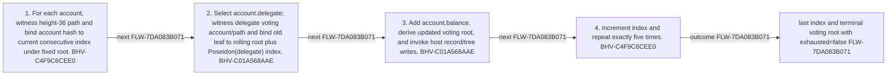

<!-- trace: FLW-7DA083B071 -->

# Staking-to-voting digest batch — FLW-7DA083B071

<!-- trace: FLW-7DA083B071, CMP-874E479BA1, BHV-C4F9C6CEE0, BHV-C01A568AAE, EVD-177476A23F, AST-D3DF75DC95, ASM-73AF207816, INV-2A14CD3045 -->
## Flow summary
| Scope | Owner | Trigger | Static conclusion | Pass 2 |
| --- | --- | --- | --- | --- |
| LOCAL | CMP-874E479BA1 | digest(publicInput, Account[5]) | [Exact technical value; STE length exception] The local interpretation for Staking-to-voting digest batch remains source-supported, but complete context adds cross-component policy, trust, lifecycle, or liveness qualifications represented by the linked context records. | [Exact technical value; STE length exception] REFINED. The local interpretation for Staking-to-voting digest batch remains source-supported, but complete context adds cross-component policy, trust, lifecycle, or liveness qualifications represented by the linked context records. |

<!-- trace: FLW-7DA083B071, CMP-874E479BA1, BHV-C4F9C6CEE0, BHV-C01A568AAE -->

<!-- trace: FLW-7DA083B071, CMP-874E479BA1, BHV-C4F9C6CEE0, BHV-C01A568AAE -->
## Ordered steps
| Step | Operation | Component | Behavior | Inputs | Outputs | Failure edges |
| --- | --- | --- | --- | --- | --- | --- |
| 1 | For each account, witness height-36 path and bind account hash to current consecutive index under fixed root. | CMP-874E479BA1 | BHV-C4F9C6CEE0 | None recorded. | None recorded. | staking root/index mismatch |
| 2 | Select account.delegate; witness delegate voting account/path and bind old leaf to rolling root plus Poseidon(delegate) index. | CMP-874E479BA1 | BHV-C01A568AAE | None recorded. | None recorded. | voting root/index mismatch |
| 3 | Add account.balance, derive updated voting root, and invoke host record/tree writes. | CMP-874E479BA1 | BHV-C01A568AAE | None recorded. | None recorded. | UInt64 arithmetic partial host write |
| 4 | Increment index and repeat exactly five times. | CMP-874E479BA1 | BHV-C4F9C6CEE0 | None recorded. | None recorded. | UInt64 arithmetic |

<!-- trace: FLW-7DA083B071, CMP-874E479BA1, BHV-C4F9C6CEE0, BHV-C01A568AAE, EVD-177476A23F, AST-D3DF75DC95, ASM-73AF207816, INV-2A14CD3045 -->
## Outcomes and controls
| Topic | Value |
| --- | --- |
| Terminal outcomes | last index and terminal voting root with exhausted=false |
| Invariants | None recorded. |
| Trust boundaries | network-ledger representation to repository Account hash host ledger to private witness constraint output to unproved host persistence |

<!-- trace: FLW-7DA083B071, CMP-874E479BA1, BHV-C4F9C6CEE0, BHV-C01A568AAE, ASM-73AF207816, INV-2A14CD3045, REQ-529C5F460D, REQ-D100BF5A33, TST-5A6CA56CD8, TST-A696D485D6 -->
## Related semantic records
| ID | Type | Topic |
| --- | --- | --- |
| [CMP-874E479BA1](../SPECIFICATION.md#cmp-874e479ba1) | CMP | Staking-ledger-to-voting-ledger ZkProgram |
| [BHV-C4F9C6CEE0](../SPECIFICATION.md#bhv-c4f9c6cee0) | BHV | Transform five consecutive staking accounts |
| [BHV-C01A568AAE](../SPECIFICATION.md#bhv-c01a568aae) | BHV | Aggregate every proven account balance by delegate |
| [ASM-73AF207816](../SPECIFICATION.md#asm-73af207816) | ASM | Each proof job has isolated, transactional, idempotent, recoverable host ledgers |
| [INV-2A14CD3045](../SPECIFICATION.md#inv-2a14cd3045) | INV | For every processed account, the selected delegate balance increases by exactly Account.balance and the rolling root reflects that update. |
| [REQ-529C5F460D](../SPECIFICATION.md#req-529c5f460d) | REQ | Historical staking-ledger voting weight |
| [REQ-D100BF5A33](../SPECIFICATION.md#req-d100bf5a33) | REQ | Staking-delegate voting |
| [TST-5A6CA56CD8](../SPECIFICATION.md#tst-5a6ca56cd8) | TST | Staking-to-voting-ledger expectations |
| [TST-A696D485D6](../SPECIFICATION.md#tst-a696d485d6) | TST | Treasury owner integration expectations |

<!-- trace: FLW-7DA083B071 -->
## Open review items
None recorded.
