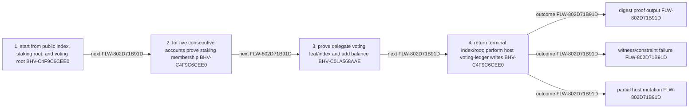

<!-- trace: FLW-802D71B91D -->

# Staking-transformation digest proof statement — FLW-802D71B91D

<!-- trace: FLW-802D71B91D, CMP-874E479BA1, BHV-C4F9C6CEE0, BHV-C01A568AAE, EVD-B30136F272, AST-48E151A2EB, CMP-7CC27EFA43 -->
## Flow summary
| Scope | Owner | Trigger | Static conclusion | Pass 2 |
| --- | --- | --- | --- | --- |
| LOCAL | CMP-874E479BA1 | digest | The proof binds the mathematical root transition, not transactional durability of the host ledger writes. | [Exact technical value; STE length exception] CONFIRMED. The Pass-1 flows interpretation for Staking-transformation digest proof statement remains consistent with raw anchors and complete context; confirmation is static and does not claim runtime, deployment, or proof-system assurance. |

<!-- trace: FLW-802D71B91D, CMP-874E479BA1, BHV-C4F9C6CEE0, BHV-C01A568AAE -->

<!-- trace: FLW-802D71B91D, CMP-874E479BA1, BHV-C4F9C6CEE0, BHV-C01A568AAE -->
## Ordered steps
| Step | Operation | Component | Behavior | Inputs | Outputs | Failure edges |
| --- | --- | --- | --- | --- | --- | --- |
| 1 | start from public index, staking root, and voting root | CMP-874E479BA1 | BHV-C4F9C6CEE0 | None recorded. | None recorded. | None recorded. |
| 2 | for five consecutive accounts prove staking membership | CMP-874E479BA1 | BHV-C4F9C6CEE0 | None recorded. | None recorded. | None recorded. |
| 3 | prove delegate voting leaf/index and add balance | CMP-874E479BA1 | BHV-C01A568AAE | None recorded. | None recorded. | None recorded. |
| 4 | return terminal index/root; perform host voting-ledger writes | CMP-874E479BA1 | BHV-C4F9C6CEE0 | None recorded. | None recorded. | None recorded. |

<!-- trace: FLW-802D71B91D, CMP-874E479BA1, BHV-C4F9C6CEE0, BHV-C01A568AAE, EVD-B30136F272, AST-48E151A2EB, CMP-7CC27EFA43 -->
## Outcomes and controls
| Topic | Value |
| --- | --- |
| Terminal outcomes | digest proof output witness/constraint failure partial host mutation |
| Invariants | None recorded. |
| Trust boundaries | None recorded. |

<!-- trace: FLW-802D71B91D, CMP-874E479BA1, BHV-C4F9C6CEE0, BHV-C01A568AAE, CMP-7CC27EFA43 -->
## Related semantic records
| ID | Type | Topic |
| --- | --- | --- |
| [CMP-874E479BA1](../SPECIFICATION.md#cmp-874e479ba1) | CMP | Staking-ledger-to-voting-ledger ZkProgram |
| [BHV-C4F9C6CEE0](../SPECIFICATION.md#bhv-c4f9c6cee0) | BHV | Transform five consecutive staking accounts |
| [BHV-C01A568AAE](../SPECIFICATION.md#bhv-c01a568aae) | BHV | Aggregate every proven account balance by delegate |
| [CMP-7CC27EFA43](../SPECIFICATION.md#cmp-7cc27efa43) | CMP | Provable ledger and hashing support |

<!-- trace: FLW-802D71B91D -->
## Open review items
None recorded.
