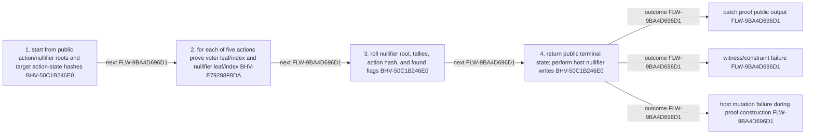

<!-- trace: FLW-9BA4D696D1 -->

# Vote-reduction proof statement — FLW-9BA4D696D1

<!-- trace: FLW-9BA4D696D1, CMP-0F476A460D, BHV-50C1B246E0, BHV-E79288F8DA, EVD-810D58B5D2, AST-CBEC48B1E0, CMP-7CC27EFA43 -->
## Flow summary
| Scope | Owner | Trigger | Static conclusion | Pass 2 |
| --- | --- | --- | --- | --- |
| LOCAL | CMP-0F476A460D | reduceBatch | Host nullifier writes are operational side effects and are not themselves guaranteed by proof verification. | [Exact technical value; STE length exception] CONFIRMED. The Pass-1 flows interpretation for Vote-reduction proof statement remains consistent with raw anchors and complete context; confirmation is static and does not claim runtime, deployment, or proof-system assurance. |

<!-- trace: FLW-9BA4D696D1, CMP-0F476A460D, BHV-50C1B246E0, BHV-E79288F8DA -->

<!-- trace: FLW-9BA4D696D1, CMP-0F476A460D, BHV-50C1B246E0, BHV-E79288F8DA -->
## Ordered steps
| Step | Operation | Component | Behavior | Inputs | Outputs | Failure edges |
| --- | --- | --- | --- | --- | --- | --- |
| 1 | start from public action/nullifier roots and target action-state hashes | CMP-0F476A460D | BHV-50C1B246E0 | None recorded. | None recorded. | None recorded. |
| 2 | for each of five actions prove voter leaf/index and nullifier leaf/index | CMP-0F476A460D | BHV-E79288F8DA | None recorded. | None recorded. | None recorded. |
| 3 | roll nullifier root, tallies, action hash, and found flags | CMP-0F476A460D | BHV-50C1B246E0 | None recorded. | None recorded. | None recorded. |
| 4 | return public terminal state; perform host nullifier writes | CMP-0F476A460D | BHV-50C1B246E0 | None recorded. | None recorded. | None recorded. |

<!-- trace: FLW-9BA4D696D1, CMP-0F476A460D, BHV-50C1B246E0, BHV-E79288F8DA, EVD-810D58B5D2, AST-CBEC48B1E0, CMP-7CC27EFA43 -->
## Outcomes and controls
| Topic | Value |
| --- | --- |
| Terminal outcomes | batch proof public output witness/constraint failure host mutation failure during proof construction |
| Invariants | None recorded. |
| Trust boundaries | None recorded. |

<!-- trace: FLW-9BA4D696D1, CMP-0F476A460D, BHV-50C1B246E0, BHV-E79288F8DA, CMP-7CC27EFA43 -->
## Related semantic records
| ID | Type | Topic |
| --- | --- | --- |
| [CMP-0F476A460D](../SPECIFICATION.md#cmp-0f476a460d) | CMP | Vote Reducer ZkProgram |
| [BHV-50C1B246E0](../SPECIFICATION.md#bhv-50c1b246e0) | BHV | Reduce a fixed five-action vote batch |
| [BHV-E79288F8DA](../SPECIFICATION.md#bhv-e79288f8da) | BHV | Bind a vote to a voting-ledger weight |
| [CMP-7CC27EFA43](../SPECIFICATION.md#cmp-7cc27efa43) | CMP | Provable ledger and hashing support |

<!-- trace: FLW-9BA4D696D1 -->
## Open review items
None recorded.
