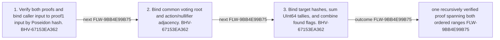

<!-- trace: FLW-9BB4E99B75 -->

# Recursive vote-proof aggregation — FLW-9BB4E99B75

<!-- trace: FLW-9BB4E99B75, CMP-0F476A460D, BHV-67153EA362, EVD-4F2874E860, AST-0BF72F1A24, CMP-7CC27EFA43 -->
## Flow summary
| Scope | Owner | Trigger | Static conclusion | Pass 2 |
| --- | --- | --- | --- | --- |
| LOCAL | CMP-0F476A460D | merge(publicInput, proof1, proof2) | The result uses proof2 terminal commitments and additive vote totals. | [Exact technical value; STE length exception] CONFIRMED. The Pass-1 flows interpretation for Recursive vote-proof aggregation remains consistent with raw anchors and complete context; confirmation is static and does not claim runtime, deployment, or proof-system assurance. |

<!-- trace: FLW-9BB4E99B75, CMP-0F476A460D, BHV-67153EA362 -->

<!-- trace: FLW-9BB4E99B75, CMP-0F476A460D, BHV-67153EA362 -->
## Ordered steps
| Step | Operation | Component | Behavior | Inputs | Outputs | Failure edges |
| --- | --- | --- | --- | --- | --- | --- |
| 1 | Verify both proofs and bind caller input to proof1 input by Poseidon hash. | CMP-0F476A460D | BHV-67153EA362 | None recorded. | None recorded. | verification/input mismatch |
| 2 | Bind common voting root and action/nullifier adjacency. | CMP-0F476A460D | BHV-67153EA362 | None recorded. | None recorded. | continuity mismatch |
| 3 | Bind target hashes, sum UInt64 tallies, and combine found flags. | CMP-0F476A460D | BHV-67153EA362 | None recorded. | None recorded. | history mismatch UInt64 arithmetic |

<!-- trace: FLW-9BB4E99B75, CMP-0F476A460D, BHV-67153EA362, EVD-4F2874E860, AST-0BF72F1A24, CMP-7CC27EFA43 -->
## Outcomes and controls
| Topic | Value |
| --- | --- |
| Terminal outcomes | one recursively verified proof spanning both ordered ranges |
| Invariants | None recorded. |
| Trust boundaries | None recorded. |

<!-- trace: FLW-9BB4E99B75, CMP-0F476A460D, BHV-67153EA362, CMP-7CC27EFA43, REQ-8671471176, TST-A9E4F4D3BC -->
## Related semantic records
| ID | Type | Topic |
| --- | --- | --- |
| [CMP-0F476A460D](../SPECIFICATION.md#cmp-0f476a460d) | CMP | Vote Reducer ZkProgram |
| [BHV-67153EA362](../SPECIFICATION.md#bhv-67153ea362) | BHV | Merge adjacent vote-reduction proofs |
| [CMP-7CC27EFA43](../SPECIFICATION.md#cmp-7cc27efa43) | CMP | Provable ledger and hashing support |
| [REQ-8671471176](../SPECIFICATION.md#req-8671471176) | REQ | Lightweight vote dispatch and deferred tally |
| [TST-A9E4F4D3BC](../SPECIFICATION.md#tst-a9e4f4d3bc) | TST | Vote reducer expectations |

<!-- trace: FLW-9BB4E99B75 -->
## Open review items
None recorded.
