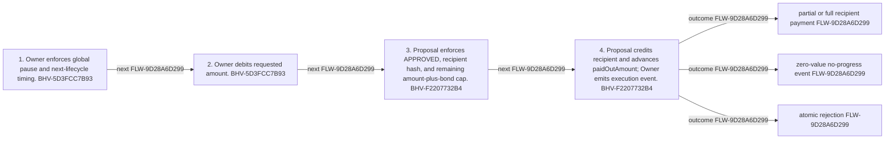

<!-- trace: FLW-9D28A6D299 -->

# Approved partial payout — FLW-9D28A6D299

<!-- trace: FLW-9D28A6D299, BHV-5D3FCC7B93, CMP-E155326DD2, BHV-F2207732B4, CMP-5CAF19BDCD, INV-EF3059DB8A, INV-681AEC9EF4, EVD-0E9360A4D5, EVD-DD1C7DA36F, AST-F5181D332F, GAP-7BAF881BED, GAP-B798CE8DB1 -->
## Flow summary
| Scope | Owner | Trigger | Static conclusion | Pass 2 |
| --- | --- | --- | --- | --- |
| CROSS_COMPONENT | CMP-E155326DD2 | signed sender requests payout in or after next lifecycle | Recipient-bound payout is source-visible, but claims are unreserved, caller ordered, unexpired, and lack a completion state. | REFINED. Recipient-bound payout is source-visible, but claims are unreserved, caller ordered, unexpired, and lack a completion state. |

<!-- trace: FLW-9D28A6D299, BHV-5D3FCC7B93, CMP-E155326DD2, BHV-F2207732B4, CMP-5CAF19BDCD -->

<!-- trace: FLW-9D28A6D299, BHV-5D3FCC7B93, CMP-E155326DD2, BHV-F2207732B4, CMP-5CAF19BDCD -->
## Ordered steps
| Step | Operation | Component | Behavior | Inputs | Outputs | Failure edges |
| --- | --- | --- | --- | --- | --- | --- |
| 1 | Owner enforces global pause and next-lifecycle timing. | CMP-E155326DD2 | BHV-5D3FCC7B93 | None recorded. | None recorded. | None recorded. |
| 2 | Owner debits requested amount. | CMP-E155326DD2 | BHV-5D3FCC7B93 | None recorded. | None recorded. | None recorded. |
| 3 | Proposal enforces APPROVED, recipient hash, and remaining amount-plus-bond cap. | CMP-5CAF19BDCD | BHV-F2207732B4 | None recorded. | None recorded. | None recorded. |
| 4 | Proposal credits recipient and advances paidOutAmount; Owner emits execution event. | CMP-5CAF19BDCD | BHV-F2207732B4 | None recorded. | None recorded. | None recorded. |

<!-- trace: FLW-9D28A6D299, BHV-5D3FCC7B93, CMP-E155326DD2, BHV-F2207732B4, CMP-5CAF19BDCD, INV-EF3059DB8A, INV-681AEC9EF4, EVD-0E9360A4D5, EVD-DD1C7DA36F, AST-F5181D332F, GAP-7BAF881BED, GAP-B798CE8DB1 -->
## Outcomes and controls
| Topic | Value |
| --- | --- |
| Terminal outcomes | partial or full recipient payment zero-value no-progress event atomic rejection |
| Invariants | INV-EF3059DB8A, INV-681AEC9EF4 |
| Trust boundaries | transaction rollback semantics owner available balance |

<!-- trace: FLW-9D28A6D299, BHV-5D3FCC7B93, CMP-E155326DD2, BHV-F2207732B4, CMP-5CAF19BDCD, INV-EF3059DB8A, INV-681AEC9EF4, GAP-7BAF881BED, GAP-B798CE8DB1, REQ-998DF345BB, REQ-8AC636D92F, REQ-F8D28DBFF5, REQ-B3FFF31BC9, REQ-1EEDB7A733, REQ-87F314C527, BR-B122F86EA0, TST-A696D485D6, FND-EE80C71EE3, GAP-F83C6F5411, GAP-ADD703D733 -->
## Related semantic records
| ID | Type | Topic |
| --- | --- | --- |
| [BHV-5D3FCC7B93](../SPECIFICATION.md#bhv-5d3fcc7b93) | BHV | Execute bounded recipient payout |
| [CMP-E155326DD2](../SPECIFICATION.md#cmp-e155326dd2) | CMP | Treasury Owner smart contract |
| [BHV-F2207732B4](../SPECIFICATION.md#bhv-f2207732b4) | BHV | Enforce approved recipient payout cap |
| [CMP-5CAF19BDCD](../SPECIFICATION.md#cmp-5caf19bdcd) | CMP | Treasury Proposal smart contract |
| [INV-EF3059DB8A](../SPECIFICATION.md#inv-ef3059db8a) | INV | Cumulative recipient credit cannot exceed amount + floor(amount/10), and every credit goes to the committed recipient. |
| [INV-681AEC9EF4](../SPECIFICATION.md#inv-681aec9ef4) | INV | The owner debit and recipient credit for a payout are equal within one atomic transaction. |
| [GAP-7BAF881BED](../SPECIFICATION.md#gap-7baf881bed) | GAP | Parallel approved proposal liabilities have no reservation or ordering policy |
| [GAP-B798CE8DB1](../SPECIFICATION.md#gap-b798ce8db1) | GAP | Approved proposal claims lack expiry and an explicit completion state |
| [REQ-998DF345BB](../SPECIFICATION.md#req-998df345bb) | REQ | Bond return or loss |
| [REQ-8AC636D92F](../SPECIFICATION.md#req-8ac636d92f) | REQ | Community-controlled on-chain treasury |
| [REQ-F8D28DBFF5](../SPECIFICATION.md#req-f8d28dbff5) | REQ | Cooldown permits tally but prevents execution |
| [REQ-B3FFF31BC9](../SPECIFICATION.md#req-b3fff31bc9) | REQ | Post-cooldown approved execution |
| [REQ-1EEDB7A733](../SPECIFICATION.md#req-1eedb7a733) | REQ | Provable proposal, voting, execution, and accounting |
| [REQ-87F314C527](../SPECIFICATION.md#req-87f314c527) | REQ | Treasury spend proposal |
| [BR-B122F86EA0](../SPECIFICATION.md#br-b122f86ea0) | BR | Treasury payout follows proposal approval |
| [TST-A696D485D6](../SPECIFICATION.md#tst-a696d485d6) | TST | Treasury owner integration expectations |
| [FND-EE80C71EE3](../SPECIFICATION.md#fnd-ee80c71ee3) | FND | Zero-value executions are repeatable without state progress |
| [GAP-F83C6F5411](../SPECIFICATION.md#gap-f83c6f5411) | GAP | Bond payer, custody, and successful beneficiary policy diverge from RFC wording |
| [GAP-ADD703D733](../SPECIFICATION.md#gap-add703d733) | GAP | Treasury Owner integration expectations omit principal adverse partitions |

<!-- trace: FLW-9D28A6D299, GAP-7BAF881BED, GAP-B798CE8DB1, FND-EE80C71EE3, GAP-F83C6F5411, GAP-ADD703D733 -->
## Open review items
| ID | Type | Topic | Status |
| --- | --- | --- | --- |
| [GAP-7BAF881BED](../SPECIFICATION.md#gap-7baf881bed) | GAP | Parallel approved proposal liabilities have no reservation or ordering policy | UNRESOLVED |
| [GAP-B798CE8DB1](../SPECIFICATION.md#gap-b798ce8db1) | GAP | Approved proposal claims lack expiry and an explicit completion state | UNRESOLVED |
| [FND-EE80C71EE3](../SPECIFICATION.md#fnd-ee80c71ee3) | FND | Zero-value executions are repeatable without state progress | OPEN |
| [GAP-F83C6F5411](../SPECIFICATION.md#gap-f83c6f5411) | GAP | Bond payer, custody, and successful beneficiary policy diverge from RFC wording | OPEN |
| [GAP-ADD703D733](../SPECIFICATION.md#gap-add703d733) | GAP | Treasury Owner integration expectations omit principal adverse partitions | OPEN |
