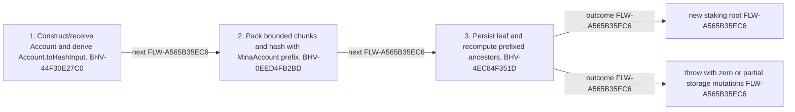

<!-- trace: FLW-A565B35EC6 -->

# Mina account to staking-ledger root — FLW-A565B35EC6

<!-- trace: FLW-A565B35EC6, CMP-49180D7623, BHV-44F30E27C0, BHV-0EED4FB2BD, CMP-2890255AE1, BHV-4EC84F351D, EVD-03D20507BE, EVD-6201011AC1, AST-04EED85D27 -->
## Flow summary
| Scope | Owner | Trigger | Static conclusion | Pass 2 |
| --- | --- | --- | --- | --- |
| CROSS_COMPONENT | CMP-49180D7623 | BaseStakingLedger initializes or updates a leaf. | The same account encoding supplies both the empty staking leaf and populated leaf hash path. | [Exact technical value; STE length exception] CONFIRMED. The Pass-1 flows interpretation for Mina account to staking-ledger root remains consistent with raw anchors and complete context; confirmation is static and does not claim runtime, deployment, or proof-system assurance. |

<!-- trace: FLW-A565B35EC6, CMP-49180D7623, BHV-44F30E27C0, BHV-0EED4FB2BD, CMP-2890255AE1, BHV-4EC84F351D -->

<!-- trace: FLW-A565B35EC6, CMP-49180D7623, BHV-44F30E27C0, BHV-0EED4FB2BD, CMP-2890255AE1, BHV-4EC84F351D -->
## Ordered steps
| Step | Operation | Component | Behavior | Inputs | Outputs | Failure edges |
| --- | --- | --- | --- | --- | --- | --- |
| 1 | Construct/receive Account and derive Account.toHashInput. | CMP-49180D7623 | BHV-44F30E27C0 | Account | RandomOracleInput | invalid external encoding |
| 2 | Pack bounded chunks and hash with MinaAccount prefix. | CMP-49180D7623 | BHV-0EED4FB2BD | RandomOracleInput | leaf Field | packing/prefix incompatibility |
| 3 | Persist leaf and recompute prefixed ancestors. | CMP-2890255AE1 | BHV-4EC84F351D | index leaf Field | root | out-of-range or partial persistence |

<!-- trace: FLW-A565B35EC6, CMP-49180D7623, BHV-44F30E27C0, BHV-0EED4FB2BD, CMP-2890255AE1, BHV-4EC84F351D, EVD-03D20507BE, EVD-6201011AC1, AST-04EED85D27 -->
## Outcomes and controls
| Topic | Value |
| --- | --- |
| Terminal outcomes | new staking root throw with zero or partial storage mutations |
| Invariants | None recorded. |
| Trust boundaries | o1js canonical account encoding MerkleTreeStorage durability |

<!-- trace: FLW-A565B35EC6, CMP-49180D7623, BHV-44F30E27C0, BHV-0EED4FB2BD, CMP-2890255AE1, BHV-4EC84F351D, REQ-529C5F460D, REL-79921BC506, TST-5A6CA56CD8 -->
## Related semantic records
| ID | Type | Topic |
| --- | --- | --- |
| [CMP-49180D7623](../SPECIFICATION.md#cmp-49180d7623) | CMP | Mina account/hash model |
| [BHV-44F30E27C0](../SPECIFICATION.md#bhv-44f30e27c0) | BHV | Construct and hash the canonical empty-account representation |
| [BHV-0EED4FB2BD](../SPECIFICATION.md#bhv-0eed4fb2bd) | BHV | Pack bounded chunks into field elements |
| [CMP-2890255AE1](../SPECIFICATION.md#cmp-2890255ae1) | CMP | Prefixed Merkle trees and witnesses |
| [BHV-4EC84F351D](../SPECIFICATION.md#bhv-4ec84f351d) | BHV | Set a Merkle leaf and recompute ancestors |
| [REQ-529C5F460D](../SPECIFICATION.md#req-529c5f460d) | REQ | Historical staking-ledger voting weight |
| [REL-79921BC506](../SPECIFICATION.md#rel-79921bc506) | REL | relation:primitives-tests:account-serializes-to-staking-leaf |
| [TST-5A6CA56CD8](../SPECIFICATION.md#tst-5a6ca56cd8) | TST | Staking-to-voting-ledger expectations |

<!-- trace: FLW-A565B35EC6 -->
## Open review items
None recorded.
