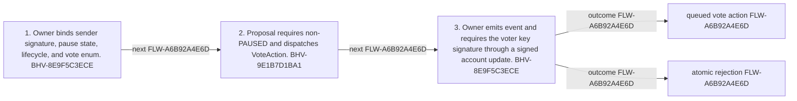

<!-- trace: FLW-A6B92A4E6D -->

# Vote authorization and action dispatch — FLW-A6B92A4E6D

<!-- trace: FLW-A6B92A4E6D, BHV-8E9F5C3ECE, CMP-E155326DD2, BHV-9E1B7D1BA1, CMP-5CAF19BDCD, INV-BD6F8D1028, INV-A0200396FA, EVD-2598ABF031, EVD-9D0B8E0BBB, AST-5A260DA2E6, CMP-7CC27EFA43 -->
## Flow summary
| Scope | Owner | Trigger | Static conclusion | Pass 2 |
| --- | --- | --- | --- | --- |
| CROSS_COMPONENT | CMP-E155326DD2 | sender submits a vote for a voter key | Dispatch authenticity and tally eligibility are separate boundaries. | [Exact technical value; STE length exception] CONFIRMED. The Pass-1 flows interpretation for Vote authorization and action dispatch remains consistent with raw anchors and complete context; confirmation is static and does not claim runtime, deployment, or proof-system assurance. |

<!-- trace: FLW-A6B92A4E6D, BHV-8E9F5C3ECE, CMP-E155326DD2, BHV-9E1B7D1BA1, CMP-5CAF19BDCD -->

<!-- trace: FLW-A6B92A4E6D, BHV-8E9F5C3ECE, CMP-E155326DD2, BHV-9E1B7D1BA1, CMP-5CAF19BDCD -->
## Ordered steps
| Step | Operation | Component | Behavior | Inputs | Outputs | Failure edges |
| --- | --- | --- | --- | --- | --- | --- |
| 1 | Owner binds sender signature, pause state, lifecycle, and vote enum. | CMP-E155326DD2 | BHV-8E9F5C3ECE | None recorded. | None recorded. | None recorded. |
| 2 | Proposal requires non-PAUSED and dispatches VoteAction. | CMP-5CAF19BDCD | BHV-9E1B7D1BA1 | None recorded. | None recorded. | None recorded. |
| 3 | Owner emits event and requires the voter key signature through a signed account update. | CMP-E155326DD2 | BHV-8E9F5C3ECE | None recorded. | None recorded. | None recorded. |

<!-- trace: FLW-A6B92A4E6D, BHV-8E9F5C3ECE, CMP-E155326DD2, BHV-9E1B7D1BA1, CMP-5CAF19BDCD, INV-BD6F8D1028, INV-A0200396FA, EVD-2598ABF031, EVD-9D0B8E0BBB, AST-5A260DA2E6, CMP-7CC27EFA43 -->
## Outcomes and controls
| Topic | Value |
| --- | --- |
| Terminal outcomes | queued vote action atomic rejection |
| Invariants | INV-BD6F8D1028, INV-A0200396FA |
| Trust boundaries | downstream ZkProgram assigns weight and nullifies duplicates |

<!-- trace: FLW-A6B92A4E6D, BHV-8E9F5C3ECE, CMP-E155326DD2, BHV-9E1B7D1BA1, CMP-5CAF19BDCD, INV-BD6F8D1028, INV-A0200396FA, CMP-7CC27EFA43, REQ-8AC636D92F, REQ-EAE9049742, REQ-8671471176, REQ-1EEDB7A733, REQ-632DB8C787, TST-A696D485D6, GAP-ADD703D733 -->
## Related semantic records
| ID | Type | Topic |
| --- | --- | --- |
| [BHV-8E9F5C3ECE](../SPECIFICATION.md#bhv-8e9f5c3ece) | BHV | Dispatch signed voter action |
| [CMP-E155326DD2](../SPECIFICATION.md#cmp-e155326dd2) | CMP | Treasury Owner smart contract |
| [BHV-9E1B7D1BA1](../SPECIFICATION.md#bhv-9e1b7d1ba1) | BHV | Expose lifecycle and dispatch vote action |
| [CMP-5CAF19BDCD](../SPECIFICATION.md#cmp-5caf19bdcd) | CMP | Treasury Proposal smart contract |
| [INV-BD6F8D1028](../SPECIFICATION.md#inv-bd6f8d1028) | INV | Every dispatched vote requires a signature from the supplied voter public key. |
| [INV-A0200396FA](../SPECIFICATION.md#inv-a0200396fa) | INV | Creation occurs in PROPOSAL, votes in VOTING, tally at/after COOLDOWN, and execution at/after next lifecycle PROPOSAL. |
| [CMP-7CC27EFA43](../SPECIFICATION.md#cmp-7cc27efa43) | CMP | Provable ledger and hashing support |
| [REQ-8AC636D92F](../SPECIFICATION.md#req-8ac636d92f) | REQ | Community-controlled on-chain treasury |
| [REQ-EAE9049742](../SPECIFICATION.md#req-eae9049742) | REQ | Exploration period without voting |
| [REQ-8671471176](../SPECIFICATION.md#req-8671471176) | REQ | Lightweight vote dispatch and deferred tally |
| [REQ-1EEDB7A733](../SPECIFICATION.md#req-1eedb7a733) | REQ | Provable proposal, voting, execution, and accounting |
| [REQ-632DB8C787](../SPECIFICATION.md#req-632db8c787) | REQ | Voting period |
| [TST-A696D485D6](../SPECIFICATION.md#tst-a696d485d6) | TST | Treasury owner integration expectations |
| [GAP-ADD703D733](../SPECIFICATION.md#gap-add703d733) | GAP | Treasury Owner integration expectations omit principal adverse partitions |

<!-- trace: FLW-A6B92A4E6D, GAP-ADD703D733 -->
## Open review items
| ID | Type | Topic | Status |
| --- | --- | --- | --- |
| [GAP-ADD703D733](../SPECIFICATION.md#gap-add703d733) | GAP | Treasury Owner integration expectations omit principal adverse partitions | OPEN |
