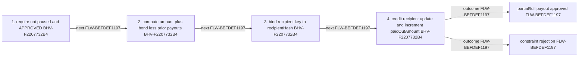

<!-- trace: FLW-BEFDEF1197 -->

# Proposal-local payout — FLW-BEFDEF1197

<!-- trace: FLW-BEFDEF1197, CMP-5CAF19BDCD, BHV-F2207732B4, EVD-DD1C7DA36F, AST-97B28D8884, GAP-B798CE8DB1, GAP-F83C6F5411 -->
## Flow summary
| Scope | Owner | Trigger | Static conclusion | Pass 2 |
| --- | --- | --- | --- | --- |
| LOCAL | CMP-5CAF19BDCD | execute | The local interpretation for Proposal-local payout remains source-supported, but complete context adds cross-component policy, trust, lifecycle, or liveness qualifications represented by the linked context records. | REFINED. The local interpretation for Proposal-local payout remains source-supported, but complete context adds cross-component policy, trust, lifecycle, or liveness qualifications represented by the linked context records. |

<!-- trace: FLW-BEFDEF1197, CMP-5CAF19BDCD, BHV-F2207732B4 -->

<!-- trace: FLW-BEFDEF1197, CMP-5CAF19BDCD, BHV-F2207732B4 -->
## Ordered steps
| Step | Operation | Component | Behavior | Inputs | Outputs | Failure edges |
| --- | --- | --- | --- | --- | --- | --- |
| 1 | require not paused and APPROVED | CMP-5CAF19BDCD | BHV-F2207732B4 | None recorded. | None recorded. | None recorded. |
| 2 | compute amount plus bond less prior payouts | CMP-5CAF19BDCD | BHV-F2207732B4 | None recorded. | None recorded. | None recorded. |
| 3 | bind recipient key to recipientHash | CMP-5CAF19BDCD | BHV-F2207732B4 | None recorded. | None recorded. | None recorded. |
| 4 | credit recipient update and increment paidOutAmount | CMP-5CAF19BDCD | BHV-F2207732B4 | None recorded. | None recorded. | None recorded. |

<!-- trace: FLW-BEFDEF1197, CMP-5CAF19BDCD, BHV-F2207732B4, EVD-DD1C7DA36F, AST-97B28D8884, GAP-B798CE8DB1, GAP-F83C6F5411 -->
## Outcomes and controls
| Topic | Value |
| --- | --- |
| Terminal outcomes | partial/full payout approved constraint rejection |
| Invariants | None recorded. |
| Trust boundaries | None recorded. |

<!-- trace: FLW-BEFDEF1197, CMP-5CAF19BDCD, BHV-F2207732B4, GAP-B798CE8DB1, GAP-F83C6F5411, TST-A696D485D6 -->
## Related semantic records
| ID | Type | Topic |
| --- | --- | --- |
| [CMP-5CAF19BDCD](../SPECIFICATION.md#cmp-5caf19bdcd) | CMP | Treasury Proposal smart contract |
| [BHV-F2207732B4](../SPECIFICATION.md#bhv-f2207732b4) | BHV | Enforce approved recipient payout cap |
| [GAP-B798CE8DB1](../SPECIFICATION.md#gap-b798ce8db1) | GAP | Approved proposal claims lack expiry and an explicit completion state |
| [GAP-F83C6F5411](../SPECIFICATION.md#gap-f83c6f5411) | GAP | Bond payer, custody, and successful beneficiary policy diverge from RFC wording |
| [TST-A696D485D6](../SPECIFICATION.md#tst-a696d485d6) | TST | Treasury owner integration expectations |

<!-- trace: FLW-BEFDEF1197, GAP-B798CE8DB1, GAP-F83C6F5411 -->
## Open review items
| ID | Type | Topic | Status |
| --- | --- | --- | --- |
| [GAP-B798CE8DB1](../SPECIFICATION.md#gap-b798ce8db1) | GAP | Approved proposal claims lack expiry and an explicit completion state | UNRESOLVED |
| [GAP-F83C6F5411](../SPECIFICATION.md#gap-f83c6f5411) | GAP | Bond payer, custody, and successful beneficiary policy diverge from RFC wording | OPEN |
