<!-- trace: FLW-BFD5C6D535 -->

# Vote reduction batch — FLW-BFD5C6D535

<!-- trace: FLW-BFD5C6D535, CMP-0F476A460D, BHV-50C1B246E0, BHV-CEE91EC6D9, BHV-E79288F8DA, BHV-141ED40E5D, BHV-3946C60752, EVD-D70E747767, AST-6FDBBB5290, CMP-7CC27EFA43 -->
## Flow summary
| Scope | Owner | Trigger | Static conclusion | Pass 2 |
| --- | --- | --- | --- | --- |
| LOCAL | CMP-0F476A460D | reduceBatch(publicInput, VoteAction[5]) | All five actions traverse the same membership/nullifier path; dummy only changes selected downstream effects. | [Exact technical value; STE length exception] CONFIRMED. The Pass-1 flows interpretation for Vote reduction batch remains consistent with raw anchors and complete context; confirmation is static and does not claim runtime, deployment, or proof-system assurance. |

```mermaid
flowchart LR
  S0["1. Initialize rolling roots, zero tallies, and false target flags from public input. BHV-50C1B246E0"]
  S1["2. For each action, validate enum and classify exact dummy padding. BHV-CEE91EC6D9"]
  S0 -->|"next FLW-BFD5C6D535"| S1
  S2["3. Witness voting account/path and constrain root plus Poseidon(publicKey) index. BHV-E79288F8DA"]
  S1 -->|"next FLW-BFD5C6D535"| S2
  S3["4. Witness nullifier/path, constrain rolling root/index, and compute conditional true leaf. BHV-141ED40E5D"]
  S2 -->|"next FLW-BFD5C6D535"| S3
  S4["5. Attempt host nullifier record/tree persistence for non-dummy action. BHV-141ED40E5D"]
  S3 -->|"next FLW-BFD5C6D535"| S4
  S5["6. Add selected weight, append action commitment, and update target flags. BHV-3946C60752"]
  S4 -->|"next FLW-BFD5C6D535"| S5
  O0["public output contains terminal roots, batch tallies, and target history FLW-BFD5C6D535"]
  S5 -->|"outcome FLW-BFD5C6D535"| O0
```

<!-- trace: FLW-BFD5C6D535, CMP-0F476A460D, BHV-50C1B246E0, BHV-CEE91EC6D9, BHV-E79288F8DA, BHV-141ED40E5D, BHV-3946C60752 -->

<!-- trace: FLW-BFD5C6D535, CMP-0F476A460D, BHV-50C1B246E0, BHV-CEE91EC6D9, BHV-E79288F8DA, BHV-141ED40E5D, BHV-3946C60752 -->
## Ordered steps
| Step | Operation | Component | Behavior | Inputs | Outputs | Failure edges |
| --- | --- | --- | --- | --- | --- | --- |
| 1 | Initialize rolling roots, zero tallies, and false target flags from public input. | CMP-0F476A460D | BHV-50C1B246E0 | None recorded. | None recorded. | None recorded. |
| 2 | For each action, validate enum and classify exact dummy padding. | CMP-0F476A460D | BHV-CEE91EC6D9 | None recorded. | None recorded. | invalid vote |
| 3 | Witness voting account/path and constrain root plus Poseidon(publicKey) index. | CMP-0F476A460D | BHV-E79288F8DA | None recorded. | None recorded. | wrong root/index host error |
| 4 | Witness nullifier/path, constrain rolling root/index, and compute conditional true leaf. | CMP-0F476A460D | BHV-141ED40E5D | None recorded. | None recorded. | wrong root/index host error |
| 5 | Attempt host nullifier record/tree persistence for non-dummy action. | CMP-0F476A460D | BHV-141ED40E5D | None recorded. | None recorded. | partial write host error |
| 6 | Add selected weight, append action commitment, and update target flags. | CMP-0F476A460D | BHV-3946C60752 | None recorded. | None recorded. | UInt64 arithmetic |

<!-- trace: FLW-BFD5C6D535, CMP-0F476A460D, BHV-50C1B246E0, BHV-CEE91EC6D9, BHV-E79288F8DA, BHV-141ED40E5D, BHV-3946C60752, EVD-D70E747767, AST-6FDBBB5290, CMP-7CC27EFA43 -->
## Outcomes and controls
| Topic | Value |
| --- | --- |
| Terminal outcomes | public output contains terminal roots, batch tallies, and target history |
| Invariants | None recorded. |
| Trust boundaries | host ledger to private witness private witness to public constrained output constraint execution to unproved host persistence |

<!-- trace: FLW-BFD5C6D535, CMP-0F476A460D, BHV-50C1B246E0, BHV-CEE91EC6D9, BHV-E79288F8DA, BHV-141ED40E5D, BHV-3946C60752, CMP-7CC27EFA43, REQ-8671471176, REQ-B5E5D97336, TST-A696D485D6, TST-A9E4F4D3BC -->
## Related semantic records
| ID | Type | Topic |
| --- | --- | --- |
| [CMP-0F476A460D](../SPECIFICATION.md#cmp-0f476a460d) | CMP | Vote Reducer ZkProgram |
| [BHV-50C1B246E0](../SPECIFICATION.md#bhv-50c1b246e0) | BHV | Reduce a fixed five-action vote batch |
| [BHV-CEE91EC6D9](../SPECIFICATION.md#bhv-cee91ec6d9) | BHV | Classify valid and dummy vote actions |
| [BHV-E79288F8DA](../SPECIFICATION.md#bhv-e79288f8da) | BHV | Bind a vote to a voting-ledger weight |
| [BHV-141ED40E5D](../SPECIFICATION.md#bhv-141ed40e5d) | BHV | Roll the voter nullifier and select vote weight |
| [BHV-3946C60752](../SPECIFICATION.md#bhv-3946c60752) | BHV | Commit non-dummy actions and discover action-state targets |
| [CMP-7CC27EFA43](../SPECIFICATION.md#cmp-7cc27efa43) | CMP | Provable ledger and hashing support |
| [REQ-8671471176](../SPECIFICATION.md#req-8671471176) | REQ | Lightweight vote dispatch and deferred tally |
| [REQ-B5E5D97336](../SPECIFICATION.md#req-b5e5d97336) | REQ | One voting-weight contribution per proposal |
| [TST-A696D485D6](../SPECIFICATION.md#tst-a696d485d6) | TST | Treasury owner integration expectations |
| [TST-A9E4F4D3BC](../SPECIFICATION.md#tst-a9e4f4d3bc) | TST | Vote reducer expectations |

<!-- trace: FLW-BFD5C6D535 -->
## Open review items
None recorded.
