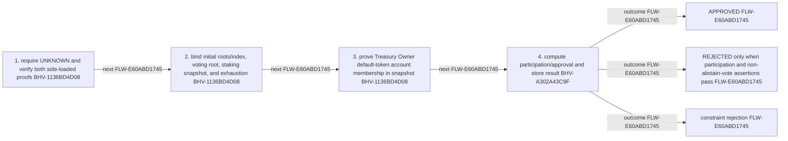

<!-- trace: FLW-E60ABD1745 -->

# Proposal-local tally — FLW-E60ABD1745

<!-- trace: FLW-E60ABD1745, CMP-5CAF19BDCD, BHV-1136BD4D08, BHV-A302A43C9F, EVD-79754810F6, AST-DAB25C2514, ASM-FF091135AE, FND-B5948FE3CF -->
## Flow summary
| Scope | Owner | Trigger | Static conclusion | Pass 2 |
| --- | --- | --- | --- | --- |
| LOCAL | CMP-5CAF19BDCD | tallyVotes | The local interpretation for Proposal-local tally remains source-supported, but complete context adds cross-component policy, trust, lifecycle, or liveness qualifications represented by the linked context records. | REFINED. The local interpretation for Proposal-local tally remains source-supported, but complete context adds cross-component policy, trust, lifecycle, or liveness qualifications represented by the linked context records. |

<!-- trace: FLW-E60ABD1745, CMP-5CAF19BDCD, BHV-1136BD4D08, BHV-A302A43C9F -->

<!-- trace: FLW-E60ABD1745, CMP-5CAF19BDCD, BHV-1136BD4D08, BHV-A302A43C9F -->
## Ordered steps
| Step | Operation | Component | Behavior | Inputs | Outputs | Failure edges |
| --- | --- | --- | --- | --- | --- | --- |
| 1 | require UNKNOWN and verify both side-loaded proofs | CMP-5CAF19BDCD | BHV-1136BD4D08 | None recorded. | None recorded. | None recorded. |
| 2 | bind initial roots/index, voting root, staking snapshot, and exhaustion | CMP-5CAF19BDCD | BHV-1136BD4D08 | None recorded. | None recorded. | None recorded. |
| 3 | prove Treasury Owner default-token account membership in snapshot | CMP-5CAF19BDCD | BHV-1136BD4D08 | None recorded. | None recorded. | None recorded. |
| 4 | compute participation/approval and store result | CMP-5CAF19BDCD | BHV-A302A43C9F | None recorded. | None recorded. | None recorded. |

<!-- trace: FLW-E60ABD1745, CMP-5CAF19BDCD, BHV-1136BD4D08, BHV-A302A43C9F, EVD-79754810F6, AST-DAB25C2514, ASM-FF091135AE, FND-B5948FE3CF -->
## Outcomes and controls
| Topic | Value |
| --- | --- |
| Terminal outcomes | APPROVED REJECTED only when participation and non-abstain-vote assertions pass constraint rejection |
| Invariants | None recorded. |
| Trust boundaries | None recorded. |

<!-- trace: FLW-E60ABD1745, CMP-5CAF19BDCD, BHV-1136BD4D08, BHV-A302A43C9F, ASM-FF091135AE, FND-B5948FE3CF, REQ-74C4827C5B, TST-A696D485D6 -->
## Related semantic records
| ID | Type | Topic |
| --- | --- | --- |
| [CMP-5CAF19BDCD](../SPECIFICATION.md#cmp-5caf19bdcd) | CMP | Treasury Proposal smart contract |
| [BHV-1136BD4D08](../SPECIFICATION.md#bhv-1136bd4d08) | BHV | Bind proof outputs and finalize proposal tally |
| [BHV-A302A43C9F](../SPECIFICATION.md#bhv-a302a43c9f) | BHV | Calculate participation and vote result |
| [ASM-FF091135AE](../SPECIFICATION.md#asm-ff091135ae) | ASM | Production deployment state matches reviewed statics, constants, controller, and permissions |
| [FND-B5948FE3CF](../SPECIFICATION.md#fnd-b5948fe3cf) | FND | Failed quorum or abstain-only tally cannot finalize as rejected |
| [REQ-74C4827C5B](../SPECIFICATION.md#req-74c4827c5b) | REQ | Approval-majority criterion |
| [TST-A696D485D6](../SPECIFICATION.md#tst-a696d485d6) | TST | Treasury owner integration expectations |

<!-- trace: FLW-E60ABD1745, FND-B5948FE3CF -->
## Open review items
| ID | Type | Topic | Status |
| --- | --- | --- | --- |
| [FND-B5948FE3CF](../SPECIFICATION.md#fnd-b5948fe3cf) | FND | Failed quorum or abstain-only tally cannot finalize as rejected | OPEN |
