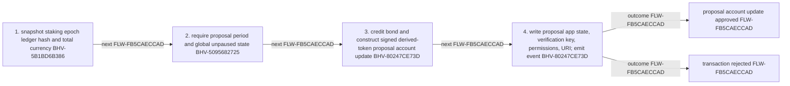

<!-- trace: FLW-FB5CAECCAD -->

# Owner-side proposal creation — FLW-FB5CAECCAD

<!-- trace: FLW-FB5CAECCAD, CMP-E155326DD2, BHV-5B1BD6B386, BHV-5095682725, BHV-80247CE73D, EVD-9E30964FCB, AST-4FF53BEEEB, CMP-7CC27EFA43 -->
## Flow summary
| Scope | Owner | Trigger | Static conclusion | Pass 2 |
| --- | --- | --- | --- | --- |
| LOCAL | CMP-E155326DD2 | createProposal | This local view ends at outbound proposal account-update approval; the orchestrator must compose the cross-contract flow. | [Exact technical value; STE length exception] CONFIRMED. The Pass-1 flows interpretation for Owner-side proposal creation remains consistent with raw anchors and complete context; confirmation is static and does not claim runtime, deployment, or proof-system assurance. |

<!-- trace: FLW-FB5CAECCAD, CMP-E155326DD2, BHV-5B1BD6B386, BHV-5095682725, BHV-80247CE73D -->

<!-- trace: FLW-FB5CAECCAD, CMP-E155326DD2, BHV-5B1BD6B386, BHV-5095682725, BHV-80247CE73D -->
## Ordered steps
| Step | Operation | Component | Behavior | Inputs | Outputs | Failure edges |
| --- | --- | --- | --- | --- | --- | --- |
| 1 | snapshot staking epoch ledger hash and total currency | CMP-E155326DD2 | BHV-5B1BD6B386 | None recorded. | None recorded. | None recorded. |
| 2 | require proposal period and global unpaused state | CMP-E155326DD2 | BHV-5095682725 | None recorded. | None recorded. | None recorded. |
| 3 | credit bond and construct signed derived-token proposal account update | CMP-E155326DD2 | BHV-80247CE73D | None recorded. | None recorded. | None recorded. |
| 4 | write proposal app state, verification key, permissions, URI; emit event | CMP-E155326DD2 | BHV-80247CE73D | None recorded. | None recorded. | None recorded. |

<!-- trace: FLW-FB5CAECCAD, CMP-E155326DD2, BHV-5B1BD6B386, BHV-5095682725, BHV-80247CE73D, EVD-9E30964FCB, AST-4FF53BEEEB, CMP-7CC27EFA43 -->
## Outcomes and controls
| Topic | Value |
| --- | --- |
| Terminal outcomes | proposal account update approved transaction rejected |
| Invariants | None recorded. |
| Trust boundaries | None recorded. |

<!-- trace: FLW-FB5CAECCAD, CMP-E155326DD2, BHV-5B1BD6B386, BHV-5095682725, BHV-80247CE73D, CMP-7CC27EFA43 -->
## Related semantic records
| ID | Type | Topic |
| --- | --- | --- |
| [CMP-E155326DD2](../SPECIFICATION.md#cmp-e155326dd2) | CMP | Treasury Owner smart contract |
| [BHV-5B1BD6B386](../SPECIFICATION.md#bhv-5b1bd6b386) | BHV | Snapshot current staking epoch ledger |
| [BHV-5095682725](../SPECIFICATION.md#bhv-5095682725) | BHV | Derive and enforce lifecycle slot range |
| [BHV-80247CE73D](../SPECIFICATION.md#bhv-80247ce73d) | BHV | Create proposal and collect ten-percent bond |
| [CMP-7CC27EFA43](../SPECIFICATION.md#cmp-7cc27efa43) | CMP | Provable ledger and hashing support |

<!-- trace: FLW-FB5CAECCAD -->
## Open review items
None recorded.
