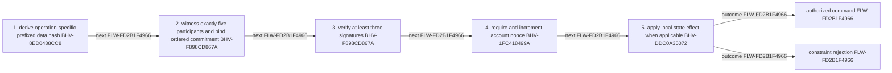

<!-- trace: FLW-FD2B1F4966 -->

# Pause-controller command authorization — FLW-FD2B1F4966

<!-- trace: FLW-FD2B1F4966, CMP-7DB1B15B38, BHV-8ED0438CC8, CMP-B6BB8BE661, BHV-F898CD867A, BHV-1FC418499A, BHV-DDC0A35072, EVD-05AEF87762, EVD-98C59C67BD, AST-4481913618, THR-0DEBF32E0A, THR-77C87EDE62 -->
## Flow summary
| Scope | Owner | Trigger | Static conclusion | Pass 2 |
| --- | --- | --- | --- | --- |
| LOCAL | CMP-B6BB8BE661 | pause/unpause/toggle/rotate | [Exact technical value; STE length exception] The local interpretation for Pause-controller command authorization remains source-supported, but complete context adds cross-component policy, trust, lifecycle, or liveness qualifications represented by the linked context records. | [Exact technical value; STE length exception] REFINED. The local interpretation for Pause-controller command authorization remains source-supported, but complete context adds cross-component policy, trust, lifecycle, or liveness qualifications represented by the linked context records. |

<!-- trace: FLW-FD2B1F4966, CMP-7DB1B15B38, BHV-8ED0438CC8, CMP-B6BB8BE661, BHV-F898CD867A, BHV-1FC418499A, BHV-DDC0A35072 -->

<!-- trace: FLW-FD2B1F4966, CMP-7DB1B15B38, BHV-8ED0438CC8, CMP-B6BB8BE661, BHV-F898CD867A, BHV-1FC418499A, BHV-DDC0A35072 -->
## Ordered steps
| Step | Operation | Component | Behavior | Inputs | Outputs | Failure edges |
| --- | --- | --- | --- | --- | --- | --- |
| 1 | derive operation-specific prefixed data hash | CMP-7DB1B15B38 | BHV-8ED0438CC8 | None recorded. | None recorded. | None recorded. |
| 2 | witness exactly five participants and bind ordered commitment | CMP-B6BB8BE661 | BHV-F898CD867A | None recorded. | None recorded. | None recorded. |
| 3 | verify at least three signatures | CMP-B6BB8BE661 | BHV-F898CD867A | None recorded. | None recorded. | None recorded. |
| 4 | require and increment account nonce | CMP-B6BB8BE661 | BHV-1FC418499A | None recorded. | None recorded. | None recorded. |
| 5 | apply local state effect when applicable | CMP-B6BB8BE661 | BHV-DDC0A35072 | None recorded. | None recorded. | None recorded. |

<!-- trace: FLW-FD2B1F4966, CMP-7DB1B15B38, BHV-8ED0438CC8, CMP-B6BB8BE661, BHV-F898CD867A, BHV-1FC418499A, BHV-DDC0A35072, EVD-05AEF87762, EVD-98C59C67BD, AST-4481913618, THR-0DEBF32E0A, THR-77C87EDE62 -->
## Outcomes and controls
| Topic | Value |
| --- | --- |
| Terminal outcomes | authorized command constraint rejection |
| Invariants | None recorded. |
| Trust boundaries | None recorded. |

<!-- trace: FLW-FD2B1F4966, CMP-7DB1B15B38, BHV-8ED0438CC8, CMP-B6BB8BE661, BHV-F898CD867A, BHV-1FC418499A, BHV-DDC0A35072, THR-0DEBF32E0A, THR-77C87EDE62, TST-5FC61A24DA -->
## Related semantic records
| ID | Type | Topic |
| --- | --- | --- |
| [CMP-7DB1B15B38](../SPECIFICATION.md#cmp-7db1b15b38) | CMP | Pause-controller multisig messages |
| [BHV-8ED0438CC8](../SPECIFICATION.md#bhv-8ed0438cc8) | BHV | Construct operation-prefixed signature data |
| [CMP-B6BB8BE661](../SPECIFICATION.md#cmp-b6bb8be661) | CMP | Treasury Pause Controller smart contract |
| [BHV-F898CD867A](../SPECIFICATION.md#bhv-f898cd867a) | BHV | Bind five witnessed participant slots and require three signatures |
| [BHV-1FC418499A](../SPECIFICATION.md#bhv-1fc418499a) | BHV | Require and increment controller nonce |
| [BHV-DDC0A35072](../SPECIFICATION.md#bhv-ddc0a35072) | BHV | Set global treasury pause state |
| [THR-0DEBF32E0A](../SPECIFICATION.md#thr-0debf32e0a) | THR | Emergency signatures replay across aligned deployments or networks |
| [THR-77C87EDE62](../SPECIFICATION.md#thr-77c87ede62) | THR | Repeated participant identities collapse the emergency threshold |
| [TST-5FC61A24DA](../SPECIFICATION.md#tst-5fc61a24da) | TST | Pause controller expectations |

<!-- trace: FLW-FD2B1F4966 -->
## Open review items
None recorded.
