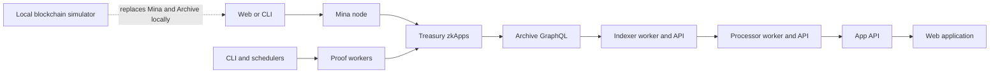

# Developer System Architecture

A Treasury feature can cross Mina zkApps, proof programs, off-chain services,
and a browser or CLI. This overview shows where each layer takes responsibility
and where data crosses a boundary.

Read the [repository tour](../foundations/repository-tour.md) first if the
workspace boundaries are new. Read
[Mina, o1js, and proofs](../foundations/mina-o1js-and-proofs.md) if the
provable layer is new.

## Component Boundaries

| Component          | Main responsibility                                          | Main source                                              |
| ------------------ | ------------------------------------------------------------ | -------------------------------------------------------- |
| Treasury contracts | Apply lifecycle, authorization, tally, and payment rules.    | `packages/sdk/src/provable/contracts/`                   |
| Proof programs     | Convert staking data and reduce vote actions.                | `packages/sdk/src/provable/`                             |
| CLI                | Compile, deploy, sign, trace, prove, tally, and execute.     | `apps/cli/src/`                                          |
| Indexer            | Read Archive observations and persist typed events.          | `packages/indexer/src/`                                  |
| Processor          | Convert typed events into application projections.           | `packages/processor/src/` and `apps/api/src/processors/` |
| App API            | Serve proposal content and lifecycle ledger data.            | `apps/api/src/`                                          |
| Web                | Provide normal Treasury interactions.                        | `apps/web/`                                              |
| Backoffice         | Provide break-glass signing and submission.                  | `apps/backoffice/`                                       |
| Local blockchain   | Provide deterministic Mina and Archive development surfaces. | `packages/local-blockchain/`                             |

## Transaction And Read Flow

The web application or CLI creates a Mina transaction. The Mina node applies
the transaction to the Treasury contracts.

The contracts emit events after accepted state changes. The indexer reads the
Archive data and resolves each event type during ingestion.

The processor reads typed events in order. It writes proposal, vote, tally,
nullifier, and execution projections.

The web application reads Mina state and HTTP APIs. It does not treat an API
projection as contract state.

## Proof Flow

The staking-ledger program converts one staking snapshot into a voting ledger.
The Vote Reducer converts ordered proposal actions into vote totals.

Tracing stores deterministic work units. Redis queues proof tasks, and workers
produce proofs. The Treasury contracts verify the final public inputs.

Read [Provable architecture](../provable/provable-architecture.md) for the code
relationships. Read [System topology](../../operate/architecture/system-topology.md)
for the deployed process topology.

## Sources

- `README.md`
- `apps/api/README.md`
- `apps/web/README.md`
- `apps/backoffice/README.md`
- `packages/indexer/README.md`
- `packages/processor/README.md`
- `packages/sdk/README.md`
- `packages/local-blockchain/README.md`
