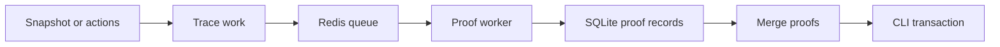

# Proving And Worker Development

Proof work can continue longer than one process or terminal session. The
tracing, queue, worker, merge, and submission stages keep that work visible and
let it resume safely.

## Stages



Tracing reads deterministic input and creates work records. A prover adds jobs
to Redis. Workers compile the required program and store completed proofs.

Merge commands combine compatible adjacent proofs. The final CLI command uses
the merged proof in a Treasury transaction.

## Queue Identity

Use one queue name for one compatible proof workload. All workers on that queue
must use the same code, constants, proof mode, and lifecycle data.

Task retry and timeout fields control worker behavior. They do not change proof
semantics.

## SQLite Identity

SQLite paths use lifecycle namespaces. Staking accounts, voting accounts,
nullifiers, traces, and proofs must refer to the same lifecycle snapshot.

Archive or remove incompatible local data after a circuit, root, or snapshot
change. Do not merge proofs from different roots or action ranges.

## Proof Modes

`PROOFS_ENABLED=true` requests real proof work. Proof-disabled tests use dummy
proofs or unchecked program execution for fast integration.

Always state the proof mode when you report a test result.

## Development Commands

Use the CLI command index for the complete options. The common worker command
has this form:

```bash
pnpm run cli -- worker start \
  --queue-name <QUEUE_NAME> \
  --redis-host 127.0.0.1 \
  --redis-port 6379
```

Read [Provable workflows](../provable/provable-workflows.md) for program-specific
stages. Read [Ledgers and proving](../../operate/proving/ledgers-and-proving.md)
for the controlled operator procedure.

## Sources

- `apps/cli/README.md`
- `apps/cli/src/commands/worker.ts`
- `packages/sdk/src/proving/`
- `packages/sdk/src/services/sqlite/`
- `devops/docker/proving-scheduler-entrypoint.sh`
- `devops/docker/voting-ledger-scheduler-entrypoint.sh`
