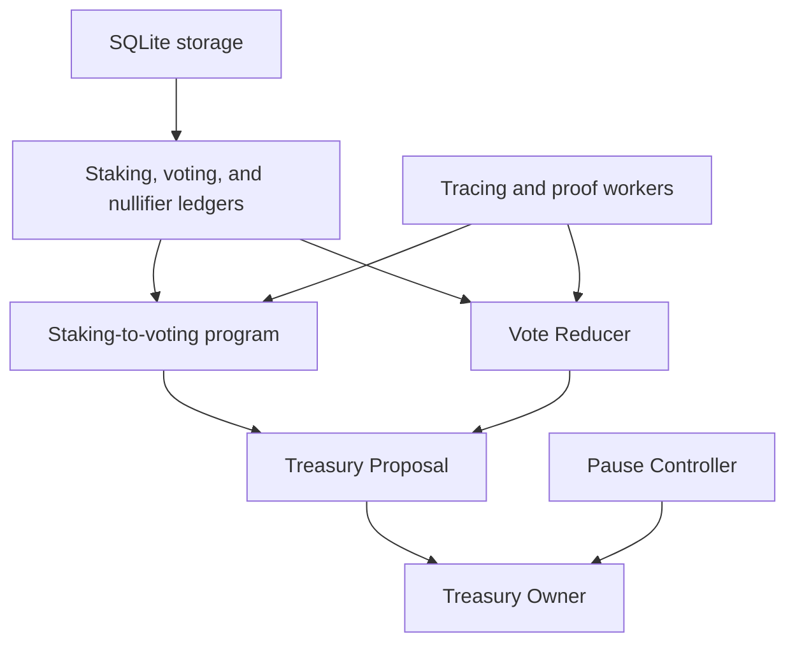

# Provable Architecture

Contracts decide what the network can accept, while off-chain programs do the
expensive proof construction. The provable layer connects these parts: a
contract accepts a proof only when its public inputs match contract state.

## Dependency Graph

## Compile Relationships

Compile proof programs before the Proposal. Compile the Proposal before the
Treasury Owner.

The Proposal verification key is embedded into the Treasury Owner deployment
configuration. The two proof-program verification keys are embedded into the
Proposal configuration.

Browser applications also need these verification keys and the empty ledger
roots. Use one compile result for all consumers.

## Contract State Boundary

The Treasury Owner applies lifecycle timing and Treasury-wide pause rules. It
creates Proposal accounts and approves their custom-token updates.

Each Proposal stores its recipient, amount, lifecycle, snapshot values, action
state, result, and payment state. It cannot replace the Treasury Owner as the
asset authority.

The Pause Controller stores the ordered participant commitment and nonce. Its
signatures bind the action, target, participant order, and nonce.

## Staking Proof Boundary

Proposal creation records the staking root and total currency from network
state. The staking proof must start from that exact root.

The program reads staking accounts by index. It adds default-token balances to
each delegate in the voting ledger.

The final proof also proves exhaustion at the next account index. This prevents
a prefix of the staking ledger from becoming the complete voting snapshot.

## Vote Proof Boundary

The Vote Reducer reads ordered action batches. It uses a nullifier ledger so
that only the first valid vote for one voter contributes weight.

Its output binds the action range, voting root, nullifier roots, vote totals,
and action-state history target.

The Proposal checks these values against its state and the staking proof before
it stores an accepted result.

## Asset Boundary

Proposal execution must match the stored recipient and amount. It occurs in a
later lifecycle and cannot exceed the approved result.

The Treasury Owner remains the asset owner. Proposal child accounts use the
Treasury Owner token to bind their updates to its approval.

## Off-chain Boundary

SQLite and Redis data can be deleted, stale, or inconsistent. The final
contracts do not trust a database row or queue result by itself.

Developers must still protect source selection, compile configuration, and
public input assembly. A matching proof does not validate an unrelated
off-chain description.

## Detailed Reference

- [Contract topology](../../operate/reference/contract-topology.md)
- [Treasury Owner](../../operate/reference/treasury-owner.md)
- [Treasury Proposal](../../operate/reference/treasury-proposal.md)
- [Pause Controller](../../operate/reference/pause-controller.md)
- [Staking Ledger to Voting Ledger](../../operate/reference/staking-ledger-to-voting-ledger.md)
- [Vote Reducer](../../operate/reference/vote-reducer.md)
- [Constants and acceptance](../../operate/reference/constants-and-acceptance.md)

## Sources

- `packages/sdk/src/provable/contracts/treasury-owner.ts`
- `packages/sdk/src/provable/contracts/treasury-proposal/treasury-proposal.ts`
- `packages/sdk/src/provable/contracts/treasury-pause-controller/treasury-pause-controller.ts`
- `packages/sdk/src/provable/staking-ledger-to-voting-ledger.ts`
- `packages/sdk/src/provable/contracts/treasury-proposal/vote-reducer.ts`
- `packages/sdk/src/provable/account.ts`
- `packages/sdk/src/provable/voting-account.ts`
