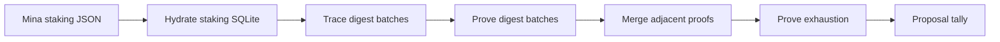
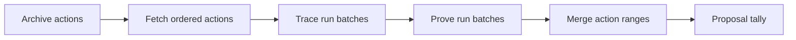

# Provable Workflows

The two proof programs begin with different data, but their work follows a
similar path. Each one traces deterministic inputs, queues proof jobs, merges
compatible results, and ends in a contract transaction.

## Staking Ledger To Voting Ledger

The JSON order defines staking account indices. The hydrated Merkle root must
match the snapshot root recorded by the Proposal.

Each digest batch reads `ACCOUNT_BATCH_SIZE` accounts. It updates delegated
voting balances. The exhausted proof shows that the next staking account is
empty.

## Vote Reducer

The action history target binds the reduction to Proposal action state. Each
accepted first vote reads its weight from the voting ledger.

The nullifier ledger prevents another action for the same voter from changing
the counted choice.

## Shared Worker Flow

The CLI writes trace and proof records to lifecycle SQLite files. Prover
commands enqueue tasks in Redis.

Workers consume one queue and compile the requested program. Merge commands
read completed proofs and enforce public-input continuity.

The queue name is an operational partition. The proof public inputs provide the
semantic binding.

## Development Order

1. Compile the program with the intended proof mode.
2. Hydrate or fetch the complete source data.
3. Trace all required batches.
4. Run a worker with the same code and queue.
5. Prove all batches.
6. Merge compatible adjacent proofs.
7. Check final roots, ranges, totals, and exhaustion.
8. Submit the tally transaction in Cooldown.

Use the [full local demo](../local-development/full-local-demo.md) for complete
commands. Use [Ledgers and proving](../../operate/proving/ledgers-and-proving.md)
for testnet reconciliation.

## Sources

- `apps/cli/README.md`
- `apps/cli/src/commands/staking-ledger.ts`
- `apps/cli/src/commands/staking-ledger-to-voting-ledger.ts`
- `apps/cli/src/commands/vote-reducer.ts`
- `packages/sdk/src/proving/`
- `packages/sdk/src/services/sqlite/`
- `packages/sdk/src/provable/staking-ledger-to-voting-ledger.ts`
- `packages/sdk/src/provable/contracts/treasury-proposal/vote-reducer.ts`
