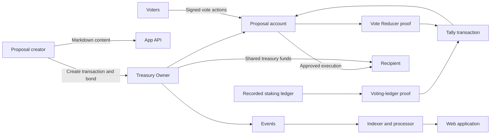

The treasury uses Mina account state for decisions and fund movements.
It uses off-chain services to prepare proofs and present data.

## 1. Create a Proposal

A creator submits a requested amount, a recipient, a lifecycle ID, and a content commitment.
The transaction also moves a bond into the shared Treasury Owner balance.

The Treasury Owner creates the Proposal account under its token.
Users do not deploy a Proposal contract separately.

Follow [Create a Proposal](create-a-proposal.md) for the user procedure.

## 2. Review the Proposal

The exploration period gives users time to read the proposal before voting.
The App API hashes the Markdown before it stores the content.
It compares the result with the content hash in the processor projection.

The web application shows this stored Markdown and the projected hash.
This display is not an independent Mina account check.

Before a material vote, compare the exact Markdown with the Proposal account.
Hash the Markdown bytes, build the full `zkAppUri`, and query the Proposal token account on the Mina network.
Continue only when both `zkAppUri` values are equal.

## 3. Vote

A voter submits `yay`, `nay`, or `abstain` during the voting period.
The vote is a signed action on the Proposal account.

Voting weight comes from delegated stake in the selected staking-ledger snapshot.
The proof process aggregates stake by delegate key.

Follow [Vote](vote.md) for the content checks and transaction procedure.

## 4. Prove and Tally

The operator prepares two proofs after voting.
One proof transforms the recorded staking ledger into a voting ledger.
The other proof reduces vote actions and prevents repeated weight from one voter.

The tally transaction verifies both proofs.
It then applies the participation and approval rules.

Use [Results and Acceptance](results-and-acceptance.md) to read the result and
the conditions that produced it.

## 5. Execute an Approved Proposal

Execution starts in the next lifecycle.
It moves funds from the shared Treasury Owner balance to the fixed recipient.

Execution can occur in parts.
The Proposal account stores the total in `paidOutAmount`.

Follow [Execute an Approved Proposal](execute-a-proposal.md) after the result
and lifecycle gates pass.

## On-Chain and Off-Chain Parts

On-chain state controls the lifecycle checks, status, recipient, amount, and execution cap.
Off-chain services prepare proofs, index events, store matching Markdown, and serve the application.

The application is a projection of the system.
Use Mina account state at the recorded canonical block for a material decision.
For proposal content, use the Proposal token account `zkappUri` as the on-chain commitment.

## Sources

- `packages/sdk/src/provable/contracts/treasury-owner.ts` — `createProposal`, `vote`, `tallyVotes`, `executeProposal`
- `packages/sdk/src/provable/contracts/treasury-proposal/treasury-proposal.ts` — `vote`, `tallyVotes`, `execute`
- `packages/sdk/src/provable/staking-ledger-to-voting-ledger.ts` — `StakingLedgerToVotingLedger`
- `packages/sdk/src/provable/contracts/treasury-proposal/vote-reducer.ts` — `VoteReducer`
- `apps/api/src/proposal-content-routes.ts` — `createProposalContentRoutes`
- `apps/api/src/processors/proposals/proposal-created-event-handler.ts` — projected `zkAppUriHash`
- `apps/web/features/proposals/containers/proposal-detail-page-container.tsx` — application content status
