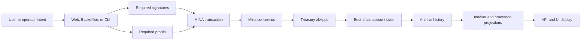

# Authority and Trust Boundaries

Account state in the selected MINA best chain is the final treasury authority.
Off-chain services can lag, fail, or show data from the wrong deployment.

## Authority model

The client tool prepares the transaction.
Required account signatures authorize their specified account updates.
Break-glass signatures authorize the specified pause-controller action.
Proofs establish the relations that their programs encode.

The Treasury Owner account signature is a separate emergency authority only
for a `proofOrSignature` deployment. It can then authorize a direct Owner
balance debit. It does not use the Pause Controller threshold.

Mina consensus decides whether the transaction becomes part of the chain.
The deployed contracts enforce the state and lifecycle conditions.

## Contract authority

| Contract          | Main authority                                                                                                |
| ----------------- | ------------------------------------------------------------------------------------------------------------- |
| Treasury Owner    | Controls the treasury token and treasury balance. It creates proposals and routes normal proposal operations. |
| Treasury Proposal | Stores proposal commitments, result state, and the executed amount.                                           |
| Pause Controller  | Stores the global pause flag, nonce, and break-glass participant commitment.                                  |

Each Treasury Proposal account uses the Treasury Owner token.
The Treasury Owner creates that account during proposal creation.

## Actor boundaries

| Actor                        | Can do                                                                                  | Cannot decide alone                                              |
| ---------------------------- | --------------------------------------------------------------------------------------- | ---------------------------------------------------------------- |
| User                         | Create, vote, tally, or execute when all inputs and conditions are valid.               | Whether MINA includes the transaction.                           |
| Operator                     | Configure services, build artifacts, submit eligible operations, and reconcile results. | Contract state outside a transaction in the selected best chain. |
| Break-glass signer           | Sign a matching pause-controller action package.                                        | A threshold action without enough valid signers.                 |
| Treasury Owner key custodian | Authorize a direct emergency MINA withdrawal from an enabled Owner.                     | A contract state edit or a change to Owner permissions.          |
| Fee payer                    | Pay the transaction fee and sign the fee-payer account.                                 | Authorization for separate signed account updates.               |
| Provider operator            | Operate a Mina or Archive endpoint.                                                     | Treasury rules that deployed contracts enforce.                  |

The Backoffice application separates participant signing from final submission.
The ordered signer set, nonce, action, network, and contract addresses must match.

## Data trust boundaries

### Mina GraphQL

Mina GraphQL is a gateway to account queries and transaction submission.
The selected endpoint must serve the intended MINA network.

An HTTP response does not prove that a submitted transaction was included in a block.
Reconcile the transaction and affected accounts after submission.

### Archive GraphQL

Archive GraphQL supplies pending and canonical blocks, events, and actions.
Pending history can change after a fork.

The indexer stores both pending and canonical observations.
It can later mark an old pending event as `orphaned`.

For the self-operated Archive deployment, Postgres is a reconstructable cache.
Rebuild it from the published dump and chain data when its state is not valid.
Do not treat it as Treasury state.

### Postgres projections

Postgres stores derived views.
The App API and Processor API can show stale rows during service lag.

Do not submit a repair transaction only to make a projection match Mina.
Repair the data path, and then reprocess the canonical history.

### Lifecycle SQLite and staking files

The staking-ledger archive supplies lifecycle input files.
The scheduler checks the computed root against the hash in the file name.

The operator must still bind the file to the correct lifecycle and network.
Lifecycle SQLite is an input to proofs and API lookups.

The Kubernetes provider names an archive with both its epoch and ledger hash.
The ledger hash is its identity. Preserve a required snapshot before the Mina
daemon stops exposing that old epoch ledger.

### Redis and proof files

Redis coordinates proof work.
It does not authorize a tally.

A proof file is not treasury state.
It becomes useful only when the intended contract verifies it in an included transaction.

### Browser configuration

The browser receives endpoints, addresses, lifecycle values, and verification keys from runtime configuration.
A local browser override can select different endpoints.

Check the visible network and addresses before a signing action.

## Reconciliation rule

After a state-changing transaction, use this order:

1. Query the transaction and affected accounts on the intended MINA network.
2. Query canonical Archive GraphQL history for that network.
3. Query the indexer and processor projections.
4. Record and investigate each disagreement.

The first check decides the treasury state.
The later checks validate the off-chain data path.

:::warning Projection values are not contract state

Do not use an API projection as the only result of a privileged operation.
Query the affected Mina accounts after the operation.

For a proposal pause toggle, do not treat the submitted event value as authoritative state.

:::

## Sources

- `packages/sdk/src/provable/contracts/treasury-owner.ts`
- `packages/sdk/src/provable/contracts/treasury-proposal/treasury-proposal.ts`
- `packages/sdk/src/provable/contracts/treasury-pause-controller/treasury-pause-controller.ts`
- `apps/backoffice/README.md`
- `packages/indexer/src/events-indexer.ts`
- `packages/processor/src/events-processor.ts`
- `devops/compose.yml`
- `devops/runbooks/1-Network/1a-Archive-Node/README.md`
- `devops/runbooks/1-Network/1c-Staking-Ledger-Provider/README.md`
- `devops/runbooks/2-Treasury/2d-Lifecycle-Pipeline/README.md`
