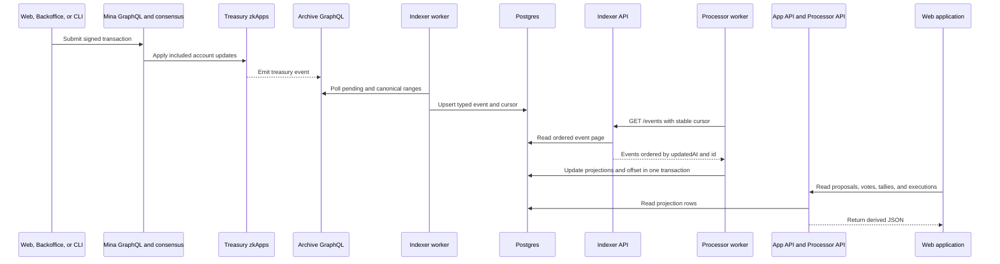

# Events and Projections

The event data path converts active contract events into user-oriented views.
Active events have pending or canonical finality.
The path also processes later promotion and orphaning changes.

For the self-operated Archive data path, use
[1a. Archive Node](../infrastructure/archive-node.md). Its health and height
checks run before the Indexer checks on this page.

## End-to-end flow

The App API also reads lifecycle SQLite for staking and voting account routes.
The App API can store matching proposal Markdown in Postgres.

## Contract event catalog

| Event                    | Main fields                                                                                       | Projection effect                                             |
| ------------------------ | ------------------------------------------------------------------------------------------------- | ------------------------------------------------------------- |
| `proposalCreated`        | Proposal key, lifecycle, amount, recipient, content hash, staking snapshot, proposer, and sender. | Creates or updates the proposal projection.                   |
| `proposalVoteDispatched` | Proposal key, voter key, vote, and sender.                                                        | Adds a vote and updates projected tally data.                 |
| `proposalVotesTallied`   | Proposal key, lifecycle, weights, result, and sender.                                             | Adds the final tally projection.                              |
| `proposalExecuted`       | Proposal key, executed amount, and sender.                                                        | Adds an execution and recalculates projected paid amount.     |
| `proposalPauseToggled`   | Proposal key, caller-supplied pause value, and sender.                                            | Updates the pause projection. Reconcile the Proposal account. |

The contract event map supplies the event-type list to the API configuration.
The indexer must resolve a known event type during ingestion.

Smart-contract methods are the business source of truth.
The processor interprets events according to those methods, including guards and state transitions.
An event payload records contract execution. It does not define different business behavior.

## Indexer behavior

The indexer has separate pending and canonical poll loops.
Each loop stores its cursor in `indexer_cursors`.

The pending loop uses its configured overlap.
The canonical loop also rereads a configured overlap range.
The overlap lets an existing event row receive a later status update.

Pending and canonical are both active statuses.
Promotion changes an existing event from pending to canonical.
It changes finality only and does not create a second business effect.

The event identity contains these values:

- transaction hash;
- account-update identifier;
- account-update index;
- event index.

The indexer stores a stable numeric `id` for API pagination.
The `/events` route orders records by `updatedAt`, then `id`.

When an old pending event exceeds the orphan depth, the indexer marks it `orphaned`.
This status update changes `updatedAt` and makes the processor read the event again.
The Indexer API publishes this status change so the processor can remove its effect.

## Processor behavior

The processor uses one offset for `PROCESSOR_NAME`.
The offset contains `lastSeenUpdatedAt` and `lastSeenEventId`.

For each poll, the processor does these actions:

1. Read the stored offset.
2. Request handled event types from the Indexer API.
3. Dispatch each event to a proposal handler.
4. Recompute the current projection from active pending and canonical facts.
5. Update projections and the offset in one Postgres transaction.

There is one current projection.
Pending events affect that projection and give the affected result pending finality.
Canonical promotion changes finality only.
Orphaning removes the event effect and recomputes from the remaining active facts.

If one event fails, the transaction does not advance the batch offset.
The worker logs the failure and tries again during a later poll.

## Projection tables

| Table                           | Main content                                                          |
| ------------------------------- | --------------------------------------------------------------------- |
| `archive_events`                | Typed event rows and pending, canonical, or orphaned status.          |
| `indexer_cursors`               | Pending and canonical processed block heights.                        |
| `processor_offsets`             | Stable processor position in the event stream.                        |
| `processor_proposals`           | Proposal identity, commitments, status, content, and executed amount. |
| `processor_votes`               | Vote event, voter, weight, nullification, and event status.           |
| `processor_vote_nullifiers`     | First-vote records used by the projection.                            |
| `processor_vote_tallies`        | Running or final weight totals and acceptance fields.                 |
| `processor_proposal_executions` | Each execution and its recalculated remaining amount.                 |

## API and UI consumers

The Indexer API publishes raw indexed event records and cursor progress.
The Processor API publishes generic TypeORM projection records.

The App API publishes proposal aggregates for the web application.
Its proposal list and detail responses include the latest tally.

The App API and Processor API return active pending and canonical projection rows.
They exclude orphaned projection rows.
The App API also excludes exactly nullified votes.

## Fork and lag interpretation

A `pending` row is active and affects the current projection with pending finality.
A `canonical` row is active and records the indexer's canonical Archive observation.
Promotion from pending to canonical changes finality only.
An `orphaned` row is inactive and does not affect the current projection.
Orphaning causes recomputation from the remaining active events.
Pending and canonical rows have the same business effect.

Use `/status` to compare Archive heads and indexer cursors.
Use the Processor API `/status` route to inspect the offset and event backlog.

The value `{ "ok": true }` from `/healthz` only means that the HTTP process responds.
It does not prove worker progress or data freshness.

## Sources

- `packages/sdk/src/provable/events/treasury-proposal-events.ts`
- `packages/indexer/src/entities.ts`
- `packages/indexer/src/events-indexer.ts`
- `packages/indexer/src/events-repository.ts`
- `packages/indexer/src/events-api-server.ts`
- `packages/processor/src/events-processor.ts`
- `packages/processor/src/indexer-events-api-client.ts`
- `apps/api/src/processors/proposals/`
- `devops/runbooks/1-Network/1a-Archive-Node/README.md`
