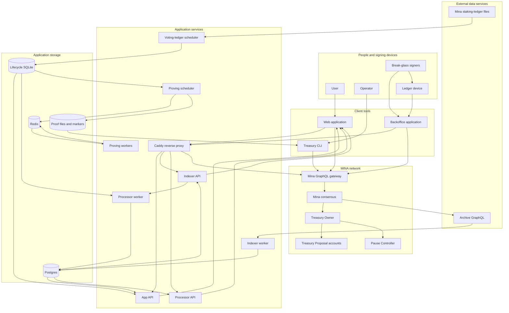

# System Topology

The treasury has an on-chain control plane and an off-chain application plane.
The application plane prepares operations and publishes derived views.

## Complete topology

The diagram shows logical connections.
The normal stack runs one reverse-proxy profile at a time.

## Runtime components

| Component | Function | Reads | Writes |
| --- | --- | --- | --- |
| Web application | Supports proposal reads and normal treasury operations. | App APIs and Mina GraphQL. | Browser state and submitted transactions. |
| Backoffice application | Prepares and submits break-glass operations. | Mina GraphQL and signer packages. | Exported packages and submitted transactions. |
| Treasury CLI | Runs deployment, ledger, proof, and transaction commands. | Environment files, endpoints, SQLite, and proof files. | Files and submitted transactions. |
| `api-migrate` | Applies the TypeORM migrations. | Migration files. | The configured Postgres schema. |
| App API | Publishes user-oriented proposal and lifecycle views. | Postgres and lifecycle SQLite. | Proposal Markdown in Postgres. |
| Indexer worker | Reads treasury events from Archive GraphQL. | Archive GraphQL and indexer cursors. | Indexed events and cursors in Postgres. |
| Indexer API | Publishes indexed events and indexer progress. | Postgres and Archive GraphQL heads. | No application records. |
| Processor worker | Converts indexed events into proposal projections. | Indexer API, Postgres, and lifecycle SQLite. | Projections and its offset in Postgres. |
| Processor API | Publishes generic projection records and processor progress. | Postgres. | No application records. |
| Voting-ledger scheduler | Builds lifecycle ledger data and traces. | Staking-ledger files. | Lifecycle SQLite and `.sqlite.done` markers. |
| Proving scheduler | Selects completed traces and controls proof work. | Lifecycle SQLite, markers, and Redis. | Proof JSON and `.sqlite.proven` markers. |
| Proving workers | Run queued proof tasks. | Redis and worker cache. | Task results in Redis. |
| Caddy | Routes browser and direct HTTP requests. | Proxy configuration. | Caddy TLS data for the public profile. |

## Storage components

| Storage | Content | Authority |
| --- | --- | --- |
| Mina ledger | Treasury, proposal, and pause-controller account state. | Final treasury state on the MINA network. |
| Archive GraphQL | Pending and canonical history from its Mina archive. | External history input. |
| Postgres | Events, cursors, processor offsets, projections, and proposal Markdown. | Derived application state. |
| Lifecycle SQLite | Staking accounts, voting accounts, traces, and proof work records. | Proof input and work state. |
| Redis | BullMQ proving jobs and results. | Transient coordination state. |
| Proof files | Serialized recursive proof artifacts and completion markers. | Transaction input until a contract verifies the proof. |
| Browser storage | Endpoint overrides and client state. | Local display and configuration state. |

## Deployment boundaries

The repository has separate Compose and Kubernetes procedures.

| Deployment mode | Scope | Procedure |
| --- | --- | --- |
| Compose application stack | Application services with external Mina and Archive endpoints. | [Service Procedures](../services/service-operations.md) |
| Kubernetes network | Archive node, archive Postgres, Archive Node API, Mina daemon, GraphQL proxy, and staking-ledger provider. | [Network Runbooks](../infrastructure/index.md#1-network) |
| Kubernetes treasury | Application services, managed Postgres connection, S3 artifact storage, Redis, schedulers, and proof workers. | [Treasury Runbooks](../infrastructure/index.md#2-treasury) |

A service provider can supply Mina and Archive endpoints. The operator can also
use [1a. Archive Node](../infrastructure/archive-node.md) and
[1b. Mina Daemon](../infrastructure/mina-daemon.md) to operate these services.

The `proving` profile adds Redis, the proving scheduler, and proving workers.
It does not submit the final tally transaction.

## HTTP exposure

The local proxy publishes the web application on port `3100` by default.
It publishes direct API ports `4100`, `4101`, and `4102`.

The web origin also publishes these same-origin paths:

- `/api/*` for the App API;
- `/indexer/*` for the Indexer API;
- `/processor/*` for the Processor API;
- `/mina/*` for the configured Mina GraphQL service.

The public proxy publishes the same paths through `PUBLIC_WEB_DOMAIN`.
Dedicated API domains are optional.
The public profile does not publish the Backoffice application.

## Sources

- `devops/compose.yml`
- `devops/proxy/Caddyfile`
- `devops/proxy/Caddyfile.https`
- `devops/docker/Dockerfile`
- `devops/runbooks/1-Network/1a-Archive-Node/README.md`
- `devops/runbooks/1-Network/1b-Mina-Daemon/README.md`
- `devops/runbooks/1-Network/1c-Staking-Ledger-Provider/README.md`
- `devops/runbooks/2-Treasury/2c-Deploy-Stack/README.md`
- `devops/runbooks/2-Treasury/2d-Lifecycle-Pipeline/README.md`
- `apps/api/src/app-api.ts`
- `apps/api/src/indexer.ts`
- `apps/api/src/indexer-api.ts`
- `apps/api/src/processor.ts`
- `apps/api/src/processor-api.ts`
- `apps/web/README.md`
- `apps/backoffice/README.md`
