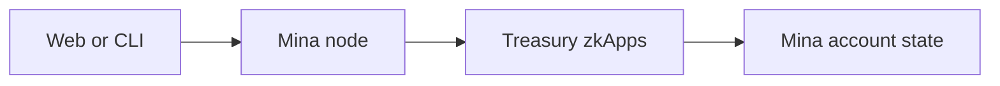
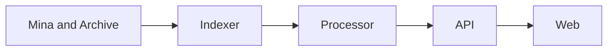

# What You Operate

The Treasury is not one server. It is a chain of systems that write, observe,
transform, and display state. The first operator skill is knowing which system
does each job.

## Start With The Write Path

A user action starts in the web application or CLI. The client builds and
signs a Mina transaction. A Mina node receives the transaction, and the
Treasury zkApps check it.

Only an accepted transaction can change Treasury account state. Application
databases cannot directly change the Proposal status or move Treasury funds.

## Then Follow The Read Path

Accepted contract changes emit events. An Archive node makes block events and
actions available. The indexer stores typed event records. The processor turns
those records into proposal, vote, tally, and execution views. APIs supply the
views to the web application.

Each arrow is a place where data can be delayed, rejected, or configured for
the wrong network.

## The Proof Path Is Separate

The tally depends on two off-chain calculations:

1. Convert the recorded staking ledger into a delegate-based voting ledger.
2. Reduce Proposal vote actions into weighted totals.

Tracing divides these calculations into proof tasks. Redis carries the tasks
to workers. The workers produce proof results. The final tally transaction
supplies the proofs to the Proposal contract.

A running worker is not enough. Its input roots, lifecycle ID, verification
keys, and action range must match the Proposal state.

## Configuration Connects Every Path

Several values appear in many processes:

- Mina network ID and GraphQL endpoints;
- Treasury Owner and Pause Controller addresses;
- lifecycle period duration and deployment slot;
- verification keys and empty ledger roots;
- database and Redis locations;
- staking snapshot location and lifecycle ID.

One difference can produce a system that is healthy but incorrect. Generate
one environment family, inspect resolved values, and keep a record of the
deployed configuration.

## Choose The Authority For Each Question

| Question                                    | Direct source                                      |
| ------------------------------------------- | -------------------------------------------------- |
| Can this transaction change Treasury state? | Treasury contract and Mina account state           |
| What events did the network expose?         | Archive records                                    |
| Has ingestion reached the Archive head?     | Indexer status and cursors                         |
| Has application processing caught up?       | Processor status and offset                        |
| What does the browser currently show?       | App API and web view                               |
| Can the tally proofs match this Proposal?   | Proposal state plus ledger and proof public inputs |

Next, read [Lifecycle and proof work](lifecycle-and-proof-work.md). It explains
when each operating task occurs.

## Sources

- `packages/sdk/src/provable/contracts/`
- `packages/sdk/src/proving/`
- `packages/indexer/src/`
- `packages/processor/src/`
- `apps/api/src/`
- `apps/web/`
- `devops/compose.yml`
