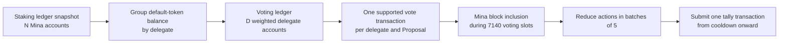

# Voting Capacity and Period Sizing

Use this page to select a lifecycle period and to check whether a voting
period can include the expected vote transactions.

For Kubernetes proof-worker sizing and the current measured devnet example,
use [2d. Lifecycle Pipeline](../infrastructure/lifecycle-pipeline.md). Treat the
runbook values as deployment inputs. Recalculate them for the selected ledger.

The current Treasury default fits the Mesa time model:

- one Mesa Mainnet epoch has `7140` slots;
- one Mesa slot is `90` seconds;
- one default Treasury period has `7140` slots;
- one default period is `178.5` hours, or `7.4375` days;
- four periods form one lifecycle of `28560` slots, or `29.75` days.

The `7140`-slot default was approximately two weeks with a `180`-second
Berkeley slot. It is approximately one week with a `90`-second Mesa slot. Do
not change the period to `14280` only to keep the old wall-clock duration. The
supported scheduler model requires one Treasury period to equal one Mina
epoch.

This result gives a technical reason for `7140`: it keeps period and snapshot
selection aligned with the Mesa epoch. It does not approve a business policy
for turnout, concurrent Proposal count, or acceptable congestion. Those
values need a separate, dated policy decision.

:::caution Confirm the network era and current block limit

Do not identify the Mina protocol era from a calendar date. Confirm the node
release, network identity, slot duration, epoch length, and active zkApp block
limit before deployment.

The official Mesa launch plan sets a temporary limit of `12` zkApp commands
per block. This is an operating limit, not a permanent capacity promise. A
later Mina release can change it.

:::

:::info Measurement status on 2 September 2026

The official schedule sets the first Mesa Mainnet slot for 3 September 2026
at 18:00 UTC. Post-Mesa Mainnet block density, fee behavior, and sustained
zkApp inclusion measurements do not exist yet. The limits on this page are
release configuration values and nominal arithmetic, not measured Mainnet
throughput.

Remove this notice only after the operator records a sufficient post-activation
measurement window.

:::

## How Time, Voting Weight, and Capacity Connect



The staking ledger size and the voting ledger size are different:

- `N` is the number of staking ledger accounts.
- `D` is the number of distinct delegate keys with positive voting weight.
- `D_s` is the number of those delegate keys that can sign a vote through the
  supported workflow.
- `D_s <= D <= N`.
- Several staking accounts can delegate to one key, so `D` can be much less
  than `N`.
- The voting ledger adds the default-token balances for accounts that use the
  same delegate.
- One delegate key can add voting weight once for each Proposal. A later vote
  action from the same key has zero weight for that Proposal.

The supported SDK and CLI path puts one `TreasuryOwner.vote` call and one
`VoteAction` in one Mina zkApp command. Therefore, one supported vote
submission uses one zkApp command.

## Mesa Block Capacity

A canonical Mina chain contains at most one block for each slot. Mina does not
guarantee that every slot has a canonical block. A block can also use its
capacity for other transactions.

Mesa has different limits that an operator must not combine:

| Limit                             | Meaning                                                                                                                          | Effect on this Treasury                                                                                   |
| --------------------------------- | -------------------------------------------------------------------------------------------------------------------------------- | --------------------------------------------------------------------------------------------------------- |
| zkApp command limit per block     | The announced Mesa launch setting is `12` zkApp commands per block.                                                              | This is the binding launch planning value for vote submissions.                                           |
| Account-update cost per command   | MIP9 uses `np + n2 + n1 <= 16`, where the terms describe proof, paired signed or no-auth, and single signed or no-auth segments. | This limits the shape of one command. It does not let one supported Treasury vote count as several votes. |
| Action and event data per command | MIP8 permits up to `1024` field elements for actions and `1024` for events in one zkApp command.                                 | One Treasury vote action has three fields. This limit is not the supported vote-path bottleneck.          |

The tagged Mesa Mainnet release configures a scan-state capacity exponent of
`7`, or `128` transaction positions, and a `12`-command zkApp soft limit. The
release also has a `128` zkApp command hard cap. These values do not mean that
an operator can plan for `128` Treasury votes in each block. Use the active
`12`-command soft limit.

MIP6 and MIP9 include higher test targets and refer to the wider transaction
capacity of a block. Do not use those test targets as the production zkApp
budget while the `12`-command setting is active.

If every slot had a block and every block used all `12` zkApp command
positions for Treasury votes, the nominal envelope for one default voting
period would be:

```text
7140 slots * 1 block per slot * 12 zkApp commands per block
= 85680 vote transactions
```

`85680` is not an operating target. It assumes no empty slots, no competing
traffic, no failed inclusion, no reorganization, and no closing buffer.

The configured time rate is `12 / 90 seconds`, or `8` zkApp commands per
minute. This is the same nominal time rate as `24 / 180 seconds` under
Berkeley. However, Mesa also halves the wall-clock duration of an epoch.
Therefore, the nominal zkApp count in one epoch falls from `171360` to
`85680` under these soft-limit settings.

The contract uses a closed interval and also permits the shared boundary slot
at the start of cooldown. Do not include that shared slot in a sizing
calculation.
Use `7140` non-overlapping slots and keep a closing buffer.

## Calculate a Safe Period Budget

Use these inputs:

```text
S = usable voting slots after opening and closing buffers
F = measured canonical block fraction per slot
Z = current zkApp command limit per block
R = fraction of zkApp capacity reserved for Treasury votes
H = safety factor for congestion, retries, and measurement error
```

Calculate:

```text
planned blocks = floor(S * F)
planned vote capacity = floor(planned blocks * Z * R * H)
```

All fractions are in the range `0..1`. Use a safety factor below `1`. Measure
`F` and competing zkApp traffic on the target network. Do not copy them from a
test network.

This example is an illustration, not a deployment value:

| Input                         |       Example value |
| ----------------------------- | ------------------: |
| Usable slots, `S`             |              `6800` |
| Canonical block fraction, `F` |              `0.75` |
| zkApp commands per block, `Z` |                `12` |
| Treasury share, `R`           |              `0.10` |
| Safety factor, `H`            |              `0.50` |
| Planned vote capacity         | `3060` transactions |

The operator must replace all measured and policy values in this example.

:::warning Submission time is not inclusion time

The contract checks the slot when Mina includes the transaction. A user can
submit a vote before the end of the voting period and still miss the period if
the transaction is not included in time.

Set a user submission cut-off before the contract boundary. Base the cut-off
on measured inclusion delay and the selected confirmation margin. Keep the
remaining slots as a closing buffer.

:::

## Calculate the Required Vote Transactions

Delegate count alone does not determine the minimum transaction count. Voting
weight can be concentrated in a small number of delegate keys.

Use these terms for one Proposal:

```text
T = staking snapshot total currency
p = required participation in basis points
R = floor(T * p / 10000)
w1 >= w2 >= ... >= wD_s = signable delegate voting weights, sorted from high to low
```

For an all-`yay` result, the smallest number of weighted delegate votes is:

```text
k = the first index where w1 + w2 + ... + wk >= R
```

If the total signable voting weight is less than `R`, approval is impossible.
A weighted voting-ledger entry does not prove that a signer controls that key.

All-`yay` votes have `100%` approval, so this same set meets the approval
percentage. The current Owner tally construction also binds five distinct,
non-initial action-state history values. The necessary planning lower bound
is:

```text
necessary submission lower bound = max(k, 5)
```

A repeated delegate action advances the action hash, but the Vote Reducer
gives it zero weight. This does not establish that five included actions are
sufficient for all retained Mina action-state preconditions. Treat
`max(k, 5)` as a necessary lower bound, not as a finalizability guarantee.
Confirm the complete tally path on the target Mesa network before production
use.

For a mixed result, the acceptance conditions are:

```text
yay + nay + abstain >= R
yay + nay > 0
floor(yay * 10000 / (yay + nay)) >= required approval basis points
```

`abstain` adds to participation. It does not add to the approval denominator.

:::note Eligible delegates are not a traffic limit

The vote method accepts a signed voter key before the Vote Reducer checks its
weight. A zero-weight key can submit an action. A delegate can also submit
later actions that add no weight. Therefore, included action count can be
greater than `D`.

Use fees, interface controls, and measured excess traffic in the sizing
model. Do not use `D` as a network traffic cap.

:::

## Equal-Weight Planning Examples

The following table uses normalized values:

```text
snapshot staking-ledger total currency = 10000
snapshot Treasury Owner balance = 10000
all positive weight is held by D_s signable delegates in equal shares
all counted votes are yay
```

Real staking ledgers are not equal-weight ledgers.

| Request size relative to snapshot Owner balance | Participation | `D_s = 100` | `D_s = 1000` | `D_s = 10000` |
| ----------------------------------------------- | ------------: | ----------: | -----------: | ------------: |
| Small request, `1%`                             |      `25.04%` |        `26` |        `251` |        `2504` |
| Medium request, `25%`                           |      `46.08%` |        `47` |        `461` |        `4608` |
| Treasury-sized request, `100%`                  |      `50.00%` |        `50` |        `500` |        `5000` |

For example, a Treasury-sized Proposal with `1000` equal-weight delegates
needs `500` all-`yay` vote transactions to meet the current participation
rule. If ten such Proposals vote in the same period, their weighted
participation lower bound is `5000` vote transactions. The operator must also
budget for other turnout, retained action-state requirements, retries, and
competing network traffic.

If `M` equal-weight votes are `yay` or `nay`, the smallest `yay` count is:

```text
ceil(required approval basis points * M / 10000)
```

The current approval values produce these examples:

| Request class  | Approval | Required `yay` when `M = 100` | Required `yay` when `M = 1000` |
| -------------- | -------: | ----------------------------: | -----------------------------: |
| Small          | `52.74%` |                          `53` |                          `528` |
| Medium         | `65.61%` |                          `66` |                          `657` |
| Treasury-sized | `70.00%` |                          `70` |                          `700` |

See [Constants and Acceptance Math](../reference/constants-and-acceptance.md)
for the exact request curve and integer operation order.

## Repository Fixture Scale

The lightnet staking-ledger fixture has `1007` staking accounts and `1004`
distinct positive default-token delegates. It requires:

```text
ceil(1007 / 5) = 202 digest proofs
202 - 1 = 201 merge proofs
1 exhaustion proof
404 Staking Ledger to Voting Ledger proof calls in total
```

This fixture shows the difference between account count, delegate count, and
proof count. It does not establish how many of its delegate keys are signable.
It is not a production Mina ledger and it does not predict production turnout.

## Size for Concurrent Proposals

For `P` Proposals that use the same lifecycle snapshot:

```text
necessary all-yay lower bound = sum(max(k for each Proposal, 5))
signable full-turnout demand = P * D_s
```

Use full-turnout demand when every eligible delegate must have a practical
chance to vote on every Proposal. Use a measured turnout model only when the
policy permits that service level.

Compare demand with the safe period budget:

```text
expected included vote commands + retry allowance <= planned vote capacity
```

If this condition does not hold, reduce the number of concurrent Proposals or
change the system design. Do not increase `LIFECYCLE_PERIOD_DURATION` without
also redesigning and validating epoch-to-snapshot selection.

At the nominal envelope, the equal-weight `D_s=1000` examples give these
transaction-only upper bounds. They are arithmetic ceilings, not safe limits
or finalizability guarantees:

| Request class  | Votes per Proposal | Proposals in `85680` vote positions |
| -------------- | -----------------: | ----------------------------------: |
| Small          |              `251` |                               `341` |
| Medium         |              `461` |                               `185` |
| Treasury-sized |              `500` |                               `171` |

## Transaction Count Through Approval

For one Proposal with `V` vote transactions:

```text
Proposal period:  1 creation transaction
Voting period:    V vote transactions
Cooldown or later: 1 tally transaction
Total through stored approval: V + 2 transactions
```

For `P` Proposals, the total through stored approval is:

```text
2 * P + sum(V for each Proposal)
```

Only the vote transactions consume the voting-period budget. Creation occurs
in the Proposal period. Tally occurs from cooldown onward.

## Proof Capacity Is a Separate Limit

Proof generation does not consume Mina block positions until the final tally
transaction. It can still delay operation.

| Work                            |                 Input size |                                                                   Proof calls |
| ------------------------------- | -------------------------: | ----------------------------------------------------------------------------: |
| Staking Ledger to Voting Ledger |       `N` staking accounts | `B = ceil(N / 5)` digest, `B - 1` merge, and one exhaustion proof; `2B` total |
| Vote Reducer for one Proposal   |  `V` included vote actions |            `B = ceil(V / 5)` reducer and `B - 1` merge proofs; `2B - 1` total |
| Tally                           | Two final recursive proofs |                                   One Mina zkApp command from cooldown onward |

Staking proof work depends on `N`, not `D`, because the program reads every
staking account before it groups balances by delegate. Vote proof work depends
on included actions, including later actions from an already-used delegate.

The staking formula describes the proof relation for `B >= 2`. When `N <= 5`,
`B=1`. The current CLI exhaustion orchestration requires a stored merge proof,
so the supported path does not handle this one-batch case.

Measure both proof pipelines with production proof mode and the selected
ledger before deployment. Network capacity does not compensate for a prover
that cannot finish the required work.

## Period Selection Decision

Use this order:

1. Confirm that the target network uses the Mesa values expected by this
   release.
2. Keep `LIFECYCLE_PERIOD_DURATION=7140` for the supported one-period-per-epoch
   model.
3. Select `TREASURY_DEPLOYED_AT_SLOT` at the first slot of an epoch.
4. Count staking accounts `N`, weighted delegate accounts `D`, and signable
   weighted delegates `D_s` in the exact selected snapshot.
5. Calculate the minimum weighted voters for each Proposal class.
6. Calculate full-turnout demand for the maximum concurrent Proposal count.
7. Measure canonical block fraction, competing zkApp use, inclusion delay,
   and retry rate on the target network.
8. Select opening and closing buffers, Treasury capacity share, and safety
   factor.
9. Compare transaction demand with the safe period budget.
10. Benchmark staking and vote proof completion separately.
11. Store a dated voting-capacity worksheet beside the public deployment
    configuration record. Include all inputs, measurements, calculations, and
    decision dates.

Stop the release if transaction demand or proof demand does not fit with the
selected safety margin.

## Sources

- `packages/sdk/src/provable/contracts/treasury-owner.ts` — Treasury period and vote method; [MIP6](https://github.com/MinaProtocol/MIPs/blob/main/MIPS/mip-0006-slot-reduction-90s.md), [Mesa release configuration](https://github.com/MinaProtocol/mina/blob/893c877e7d0eb78e4f600815571d773c5292cbeb/src/lib/node_config/profiled/mainnet.ml), and [Mesa zkApp hard cap](https://github.com/MinaProtocol/mina/blob/893c877e7d0eb78e4f600815571d773c5292cbeb/src/lib/node_config/unconfigurable_constants/node_config_unconfigurable_constants.ml)
- `packages/sdk/src/provable/contracts/treasury-proposal/treasury-proposal.ts` — vote dispatch and acceptance; [MIP8](https://github.com/MinaProtocol/MIPs/blob/main/MIPS/mip-0008-increase-events-actions-limit.md) and [MIP9](https://github.com/MinaProtocol/MIPs/blob/main/MIPS/mip-0009-increase-zkapp-account-update-limit.md)
- `packages/sdk/src/provable/contracts/treasury-proposal/vote-reducer.ts`
- `packages/sdk/src/provable/staking-ledger-to-voting-ledger.ts`
- `packages/sdk/src/services/sqlite/sqlite-treasury-owner-service.ts` — one-vote-per-command path; [Mesa launch settings](https://minaprotocol.com/blog/minas-mesa-upgrade-what-to-expect) and [Mainnet schedule](https://minaprotocol.com/blog/mesa-mainnet-upgrade-docs)
- `apps/cli/src/commands/staking-ledger-to-voting-ledger.ts`
- `apps/cli/test/fixtures/staking-epoch-ledger-lightnet.json`
- `devops/runbooks/2-Treasury/2c-Deploy-Stack/helmfile.yaml`
- `devops/runbooks/2-Treasury/2d-Lifecycle-Pipeline/README.md`
