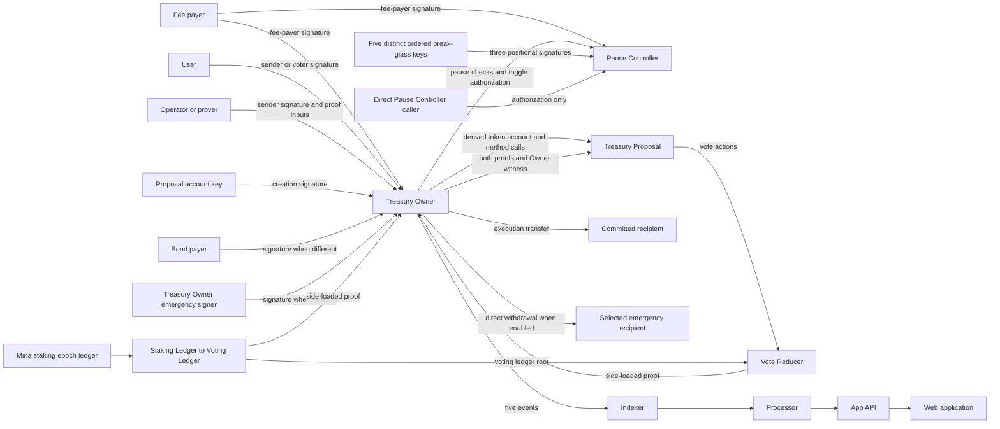

# Contract topology

The protocol has three on-chain contract roles and two off-chain proof programs.

## Topology

## On-chain accounts

| Account                                | Token               | Main responsibility                                  |
| -------------------------------------- | ------------------- | ---------------------------------------------------- |
| `TreasuryOwnerSmartContract`           | Default MINA token  | Holds MINA and coordinates proposal transitions.     |
| `TreasuryProposalSmartContract`        | Owner-derived token | Stores one proposal and dispatches vote actions.     |
| `TreasuryPauseControllerSmartContract` | Default MINA token  | Stores global pause state and the signer commitment. |

The Owner creates each Proposal account with `AccountUpdate.createSigned`. The account receives the Proposal verification key.

## Actors and signature inputs

| Actor                          | Signature input                             | Affected path                                                        |
| ------------------------------ | ------------------------------------------- | -------------------------------------------------------------------- |
| Fee payer                      | Mina fee-payer signature                    | Every submitted transaction.                                         |
| Transaction sender             | Owner-method sender signature               | Owner create, vote, tally, execute, and Proposal-toggle paths.       |
| Funding account                | Signed AccountUpdate when different         | Adds funds through Owner `receive`.                                  |
| Bond payer                     | Signed AccountUpdate when different         | Pays `floor(requestedAmount / 10)` during creation.                  |
| Proposal account key           | Signed token-account AccountUpdate          | Creates the Proposal account.                                        |
| Voter                          | Signed AccountUpdate                        | Dispatches one Proposal vote action.                                 |
| Break-glass key holder         | Embedded signature over an operation hash   | Supplies one of five ordered signature positions.                    |
| Treasury Owner key custodian   | MINA account signature                      | Authorizes a direct emergency debit from an enabled Owner.           |
| Operator or prover             | No special governance signature             | Builds proofs and can submit tally or execution as sender.           |
| Direct Pause Controller caller | Fee-payer signature and embedded signatures | Can consume a Proposal-toggle nonce without changing Proposal state. |

Current builders use the sender as fee payer and bond payer. A different fee payer does not replace an Owner-method sender signature.

The break-glass circuit counts valid positions. Configure exactly five distinct keys and obtain signatures from at least three different keys.

The emergency Owner signature is not an embedded Pause Controller signature. It authorizes a direct default-token AccountUpdate and does not call a contract method.

## Contract method paths

### Treasury Owner

| Method                                     | Kind or caller path                 | Main effect                                                                   |
| ------------------------------------------ | ----------------------------------- | ----------------------------------------------------------------------------- |
| `deploy`                                   | Deployment method                   | Sets permissions, lifecycle start slot, and Pause Controller key.             |
| `receive`                                  | Submitted funding method            | Adds Mina to the shared Owner balance.                                        |
| `createProposal`                           | Submitted user or Operator method   | Creates and initializes a Proposal token account.                             |
| `vote`                                     | Submitted user or Operator method   | Enforces lifecycle and dispatches a signed Proposal action.                   |
| `tallyVotes`                               | Submitted Operator or prover method | Verifies both proofs, five history targets, and the historical Owner witness. |
| `executeProposal`                          | Submitted user or Operator method   | Debits the shared balance and calls Proposal execution.                       |
| `togglePauseProposal`                      | Submitted break-glass method        | Verifies Pause Controller authorization and toggles Proposal status.          |
| `snapshotStakingEpochData`                 | Internal helper                     | Reads the staking root and total currency from network state.                 |
| `getLifecyclePeriodSlotRange`              | Internal helper                     | Calculates the slot range for one lifecycle period.                           |
| `requireLifecyclePeriod`                   | Internal helper                     | Adds a bounded or lower-bounded global-slot precondition.                     |
| `requireLifecyclePeriodGreaterThanOrEqual` | Internal helper                     | Adds a lifecycle lower-bound precondition.                                    |
| `requireNotPaused`                         | Internal helper                     | Calls the Pause Controller global-pause check.                                |
| `approveBase`                              | Token approval callback             | Rejects external child updates that use the Owner token.                      |

### Treasury Proposal

| Method                        | Kind or caller              | Main effect                                                          |
| ----------------------------- | --------------------------- | -------------------------------------------------------------------- |
| `getLifecycleId`              | Owner-called method         | Returns the lifecycle used for Owner time checks.                    |
| `vote`                        | Owner-called method         | Dispatches `VoteAction` to the reducer action state.                 |
| `tallyVotes`                  | Owner-called method         | Verifies proof bindings and stores `APPROVED` or `REJECTED`.         |
| `execute`                     | Owner-called method         | Checks the recipient and cap, then updates `paidOutAmount`.          |
| `togglePause`                 | Owner-called method         | Changes any non-paused status to `PAUSED`, or `PAUSED` to `UNKNOWN`. |
| `requireNotPaused`            | Internal helper             | Rejects Proposal status `PAUSED`.                                    |
| `minUInt128`                  | Static calculation helper   | Returns the smaller of two unsigned 128-bit values.                  |
| `calculateAcceptanceCriteria` | Static calculation helper   | Calculates participation and approval thresholds.                    |
| `calculateApprovalStatus`     | Internal calculation helper | Calculates totals, threshold results, and the candidate status.      |

### Pause Controller

| Method                     | Kind or caller               | Main effect                                                           |
| -------------------------- | ---------------------------- | --------------------------------------------------------------------- |
| `deploy`                   | Inherited deployment method  | Installs the compiled contract during deployment.                     |
| `init`                     | Deployment initialization    | Sets permissions, signer commitment, and `paused = false`.            |
| `requireNotPaused`         | Owner-called method          | Adds the global unpaused precondition.                                |
| `pauseTreasury`            | Submitted break-glass method | Sets `paused = true` and increments the nonce.                        |
| `unpauseTreasury`          | Submitted break-glass method | Sets `paused = false` and increments the nonce.                       |
| `togglePauseProposal`      | Public authorization method  | Authorizes one Proposal target and increments the nonce.              |
| `rotateMultisigKeys`       | Submitted break-glass method | Replaces the signer commitment and increments the nonce.              |
| `requireAndIncrementNonce` | Internal helper              | Requires the supplied account nonce and marks it for increment.       |
| `verifySignatures`         | Internal helper              | Checks the participant commitment and positional signature threshold. |

## ZkProgram method paths

| ZkProgram                       | Public method | Proof relation                                                         |
| ------------------------------- | ------------- | ---------------------------------------------------------------------- |
| Staking Ledger to Voting Ledger | `digest`      | Processes five staking accounts and updates delegate weights.          |
| Staking Ledger to Voting Ledger | `merge`       | Joins adjacent indexes and continuous voting roots.                    |
| Staking Ledger to Voting Ledger | `exhaust`     | Proves only that the immediate next staking leaf is empty.             |
| Vote Reducer                    | `reduceBatch` | Processes five vote actions, nullifiers, targets, and weighted totals. |
| Vote Reducer                    | `merge`       | Joins continuous action and nullifier roots and adds totals.           |

Each program has a native proof type for recursion and a side-loaded proof type for Proposal verification.

## Authority paths

The Owner is the only contract that debits the shared treasury balance. It approves Proposal account updates under its derived token.

The Owner and Proposal verify both side-loaded proofs. The Proposal calculates the result and controls `paidOutAmount`.

The Pause Controller verifies embedded break-glass signatures.
Its public `togglePauseProposal` method increments its nonce but does not change Proposal state.

For a `proofOrSignature` deployment, Owner `access` and `send` also accept its
account signature. This path can debit available MINA without a Proposal proof
or Pause Controller authorization.

The supported composite path calls `TreasuryOwnerSmartContract.togglePauseProposal`.
This path also needs the Owner transaction sender signature.
The Owner calls the Pause Controller and then calls the Proposal `togglePause` method.

A direct Pause Controller call only proves authorization for the named Proposal.
It consumes the signed nonce without changing that Proposal.

## Proof and data paths

The staking proof starts with the recorded Mina staking ledger root. It produces a voting ledger root.

The vote proof uses that voting ledger root. It produces weighted `yay`, `nay`, and `abstain` totals.

The Proposal verifies both proofs. It also verifies the historical Treasury Owner balance under the recorded staking root.

The Owner requires five distinct, non-initial action-state targets from Proposal account history before tally can complete.

Events leave the Owner account and enter the projection services. Events do not replace Mina account state.

A direct emergency withdrawal emits no Owner event. It is visible through the Mina transaction and account balances, not the Proposal event projection.

## Event and projection path

| Owner event              | Projection purpose                                 |
| ------------------------ | -------------------------------------------------- |
| `proposalCreated`        | Creates the Proposal record.                       |
| `proposalVoteDispatched` | Creates the vote record used for action discovery. |
| `proposalVotesTallied`   | Projects vote totals and the stored result.        |
| `proposalExecuted`       | Projects one execution amount.                     |
| `proposalPauseToggled`   | Projects the reported pause value.                 |

The Indexer reads canonical Mina events. The Processor updates API projections, and the web application reads those projections.

Reconcile material transitions against Mina account state. The pause event value is caller supplied and is not state authority.

## Trust boundaries

| Boundary                                | Required check                                                                             |
| --------------------------------------- | ------------------------------------------------------------------------------------------ |
| Source to deployed account              | Compare reproducible verification keys and account addresses.                              |
| Mina ledger to staking proof            | Match the Proposal `stakingEpochDataLedgerHash`.                                           |
| Staking proof to vote proof             | Match the final `votingLedgerRoot`.                                                        |
| Vote actions to tally                   | Match action hashes and the five action-state targets.                                     |
| Events to projection                    | Use the recorded canonical block and stored cursor.                                        |
| Projection to user interface            | Treat API data as a projection and reconcile material transitions on the Mina network.     |
| Break-glass keys to Pause Controller    | Preserve five distinct ordered keys and verify the commitment.                             |
| Treasury Owner key to direct withdrawal | Confirm `proofOrSignature`, network, Owner, recipient, amount, and custody approval.         |

## Component references

- [Treasury Owner](./treasury-owner)
- [Treasury Proposal](./treasury-proposal)
- [Pause Controller](./pause-controller)
- [Staking Ledger to Voting Ledger](./staking-ledger-to-voting-ledger)
- [Vote Reducer](./vote-reducer)
- [Authorization matrix](./authorization-matrix)
- [Events](./events)

## Sources

- `packages/sdk/src/provable/contracts/treasury-owner.ts`
- `packages/sdk/src/provable/contracts/treasury-proposal/treasury-proposal.ts`
- `packages/sdk/src/provable/contracts/treasury-pause-controller/treasury-pause-controller.ts`
- `packages/sdk/src/provable/staking-ledger-to-voting-ledger.ts`
- `packages/sdk/src/provable/contracts/treasury-proposal/vote-reducer.ts`
- `packages/indexer/src/events-indexer.ts`
- `packages/processor/src/events-processor.ts`
- `apps/api/src/processor.ts`
