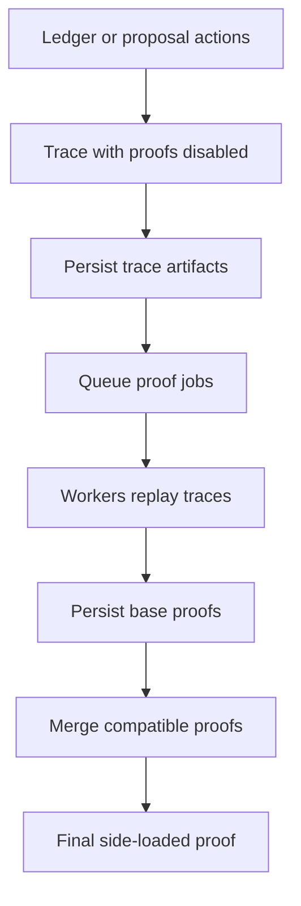

# Provable Architecture

## The Problem This Solves

The treasury system needs to make governance decisions from Mina state without replaying large ledgers or long vote histories inside one transaction. The provable layer solves that by separating work into:

- on-chain zkApps that own state and authorization,
- off-chain circuits that prove expensive transformations,
- storage and data structures that persist ledger state, traces, and proofs,
- operator and worker flows that make proof generation parallelizable and repeatable.

The specs define the contracts those pieces must satisfy. This page explains how the implementation hangs together.

## The Four Layers

### 1. On-chain zkApp Layer

The on-chain zkApp layer is made of treasury zkApp accounts:

- The treasury owner is the coordinator for treasury lifecycle actions.
- Treasury proposals own proposal-local state, vote actions, tally status, and execution authorization.
- The pause controller owns emergency pause authority and multisig authorization.

The owner acts as the integration point. It coordinates with proposal accounts and pause controller accounts, verifies final proofs, and emits lifecycle events for indexer and operator services.

### 2. Off-chain Circuit Layer

The off-chain circuit layer compresses data-heavy work:

- The staking-to-voting circuit transforms the Mina staking ledger into delegate voting weights.
- The vote reducer circuit turns proposal vote actions into weighted vote totals.

These circuits are intentionally separate. `StakingLedgerToVotingLedger` produces a voting root that `VoteReducer` proofs can consume with proposal actions to produce tally weights.

### 3. Storage and Data Layer

Circuits cannot fetch ledger data directly. The SDK stores staking accounts, voting accounts, vote nullifiers, traces, and proofs outside the circuit. These data structures supply witnesses and preserve roots during tracing, replay, and service execution.

There are three implementation modes:

- **Persistent ledgers** keep state in SQLite-backed storage across service calls.
- **In-memory ledgers** provide fast local state for a tracing/proving session.
- **Recording/replayable ledgers** capture or replay witness data so traces can be converted into proofs.

### 4. Operator and Worker Layer

Proof generation can be slow, so the SDK separates preparation from proving:

- Tracers dry-run circuits and record witness data.
- Provers submit trace replay jobs to a Redis-backed task queue.
- Workers execute proof tasks in child processes.
- Merge orchestration combines base proofs until final proofs are ready.

This layer is operational glue. Its job is to make the spec-defined proofs practical to produce.

## Main Flows

### Governance and Proof Interaction Flow

```mermaid
flowchart TD
  subgraph ExternalInputs[External inputs]
    stakingJson[Mina staking epoch ledger JSON]
    lifecycleTxs[Proposal, vote, tally, execute transactions]
    multisig[3-of-5 pause-controller signatures + nonce]
  end

  subgraph OnChain[On-chain zkApps]
    pause[Pause controller zkApp<br/>paused, multisigCommitment, nonce]
    owner[Treasury owner zkApp<br/>treasury balance, lifecycle, token namespace]
    proposal[Proposal zkApp<br/>proposal state, vote actions, status, paidOutAmount]
  end

  subgraph Storage[Storage and data layer]
    stakingLedger[Local staking ledger<br/>accounts + witnesses]
    votingLedger[Local voting ledger<br/>delegate balances]
    nullifierLedger[Local nullifier ledger<br/>voter used flags]
    traceStore[Trace and proof storage]
  end

  subgraph Circuits[Off-chain circuit layer]
    stv[StakingLedgerToVotingLedger circuit<br/>digest -> merge -> exhaust]
    reducer[VoteReducer circuit<br/>reduceBatch -> merge]
  end

  subgraph Workers[Operator and worker layer]
    workers[Tracing, replay, proof jobs, merge orchestration]
  end

  stakingJson --> stakingLedger
  stakingLedger -->|accounts, staking witnesses| stv
  votingLedger -->|delegate voting witnesses| stv
  stv -->|SideLoadedStakingLedgerToVotingLedgerProof<br/>input: index=0, stakingRoot, emptyVotingRoot<br/>output: finalIndex, finalVotingRoot, exhausted=true| workers
  workers --> traceStore
  traceStore --> owner

  lifecycleTxs -->|createProposal| owner
  owner -->|requireNotPaused| pause
  owner -->|snapshot stakingEpochDataLedgerHash + totalCurrency<br/>deploy proposal under owner token id| proposal

  lifecycleTxs -->|vote(publicKey, vote)| owner
  owner -->|dispatch VoteAction| proposal
  proposal -->|reducer action stream + action states| reducer
  votingLedger -->|voter voting-account witnesses| reducer
  nullifierLedger -->|nullifier witnesses + rolling root| reducer
  reducer -->|SideLoadedVoteReducerProof<br/>input: initial actions hash, finalVotingRoot, emptyNullifierRoot, action-state targets<br/>output: toActionsHash, toNullifierRoot, yay/nay/abstain, actionStateHistory| workers
  workers --> traceStore

  traceStore -->|side-loaded proofs| owner
  lifecycleTxs -->|tallyVotes| owner
  owner -->|verify both side-loaded proofs<br/>approve found proposal action states| proposal
  owner -->|treasury owner Account + staking witness| proposal
  proposal -->|bind proof roots, action hashes, nullifier root,<br/>staking epoch root, exhaustion, treasury balance witness| proposal
  proposal -->|set APPROVED or REJECTED| owner
  owner -->|proposalVotesTallied event| lifecycleTxs

  lifecycleTxs -->|executeProposal| owner
  owner -->|subtract owner balance| proposal
  proposal -->|check approved status, recipient hash,<br/>remaining payout; approve recipient update| lifecycleTxs

  multisig -->|pause / unpause / rotate keys| pause
  multisig -->|toggle proposal pause intent| owner
  owner -->|authorize proposal toggle| pause
  owner -->|toggle local proposal status| proposal
```

The tally transaction is the point where the `StakingLedgerToVotingLedger` and `VoteReducer` circuit pipelines meet the treasury zkApps. `SideLoadedStakingLedgerToVotingLedgerProof` contributes the final delegate voting ledger root and proves that it came from the proposal's staking epoch ledger. `SideLoadedVoteReducerProof` consumes that voting root, reduces proposal vote actions into weighted totals, advances the nullifier root, and reports which proposal action-state hashes were seen. The treasury owner verifies both proofs and approves the referenced proposal action states; the proposal account performs the binding checks, threshold math, and status mutation.


### Proof Production Flow




## Important Tradeoffs

### Trace Before Prove

Tracing captures witness data before expensive proof generation. This makes proof work easier to distribute and replay, but it means trace storage must be treated as operational state. The circuit still verifies witness data against public roots during replay.

### Separate Ledgers for Separate Meanings

Staking accounts, voting weights, and vote nullifiers use separate ledgers because they represent different facts:

- staking ledger: Mina account state at an epoch,
- voting ledger: delegate-keyed voting power,
- nullifier ledger: whether a voter has already contributed weight to a proposal tally.

### Storage-backed Services Hide Persistence Wiring

SQLite services assemble ledgers, trace storage, proof storage, batch writers, task queues, and compilers. This keeps CLI/API callers from needing to know every storage factory, but it means service startup options are the main integration surface for operational flows.

## Related Docs

- [Treasury overview](../treasury/index.md)
- [Treasury concepts](../treasury/concepts.md)
- [Overview](overview.md)
- [Workflows](workflows.md)
- [Reference](reference.md)
- [Troubleshooting](troubleshooting.md)

## Related Specs

- [Provable primitives](../../specs/provable/provable-primitives.md)
- [Staking ledger to voting ledger](../../specs/provable/staking-ledger-to-voting-ledger.md)
- [Treasury owner](../../specs/provable/treasury-owner.md)
- [Treasury pause controller](../../specs/provable/treasury-pause-controller.md)
- [Treasury proposal](../../specs/provable/treasury-proposal.md)
- [Vote reducer](../../specs/provable/vote-reducer.md)

