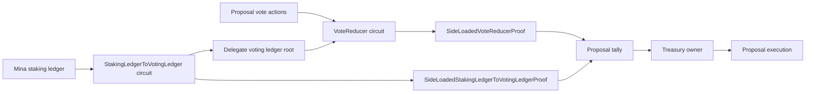

# SDK Provable Overview

The SDK provable layer turns treasury governance intent into Mina-compatible state transitions and proofs. It is where proposal zkApps, pause authority, delegated voting weights, side-loaded tally proofs, and worker-driven proving flows meet.

These docs explain how the implementation is organized and operated. The normative contracts are defined in the related provable specs.

## Mental Model

Think of the provable layer as four cooperating layers:

- **On-chain zkApp layer** decides what can happen on-chain: treasury ownership, proposal state, pause authority, and proposal execution.
- **Off-chain circuit layer** compresses expensive ledger and vote processing into proofs that treasury zkApps can verify.
- **Storage and data layer** persists staking accounts, voting accounts, nullifiers, traces, and proof artifacts.
- **Operator and worker layer** prepares witnesses, records traces, runs proving workers, merges proofs, and hands final proofs back to treasury transactions.

A typical proposal moves from creation, to vote collection, to proof-backed tallying, to execution. The provable layer supports that lifecycle by connecting governance zkApps, off-chain circuits, and operator-facing proving workflows.

## Contents

- [Architecture](architecture.md)
- [Workflows](workflows.md)
- [Testing](testing.md)
- [Reference](reference.md)
- [Troubleshooting](troubleshooting.md)

## Main Concepts

### Treasury Governance Accounts

Treasury governance is split across multiple zkApp accounts. The treasury owner coordinates proposal lifecycle actions and treasury balance movement. Proposal accounts hold proposal-local state and reducer actions. The pause controller owns emergency authority and proposal-pause authorization.

This split keeps long-lived treasury authority, per-proposal state, and emergency governance separate while still allowing cross-zkApp flows.

### Staking Ledger to Voting Ledger

Treasury voting needs delegate voting weights, but Mina exposes staking power as an epoch staking ledger. The `StakingLedgerToVotingLedger` workflow scans staking accounts, aggregates balances by delegate, and produces a voting ledger root that `VoteReducer` side-loaded proofs can use.

### Vote Reduction

Votes arrive as proposal reducer actions. The vote reducer turns those actions into weighted yay, nay, and abstain totals by reading delegate balances from the voting ledger and marking nullifiers so repeated votes do not count twice.

### Trace and Replay

Proof generation is split into tracing and proving. Tracing dry-runs circuits with recording ledgers so the system can capture all witness data needed for proof replay. Proving workers later replay those traces with proofs enabled and merge base proofs into final proofs.

## Related Specs

- [Provable primitives](../../specs/provable/provable-primitives.md)
- [Staking ledger to voting ledger](../../specs/provable/staking-ledger-to-voting-ledger.md)
- [Treasury owner](../../specs/provable/treasury-owner.md)
- [Treasury pause controller](../../specs/provable/treasury-pause-controller.md)
- [Treasury proposal](../../specs/provable/treasury-proposal.md)
- [Vote reducer](../../specs/provable/vote-reducer.md)

## Related User Docs

- [Treasury overview](../treasury/index.md)
- [Treasury concepts](../treasury/concepts.md)
- [Proposal lifecycle](../treasury/proposal-lifecycle.md)
- [Voting and results](../treasury/voting-and-results.md)

